::: {.abstract title="О чём лекция"}
Это вводная лекция курса. Она отвечает на вопросы: что такое цифровой продукт и как он создаёт ценность для пользователя и бизнеса, через какие стадии проходит продукт от поиска проблемы до закрытия и как на каждой стадии меняется работа аналитика, чем продуктовый аналитик отличается от бизнес-, системного, BI- и data-аналитика, за что он отвечает и за что нет, как он встроен в продуктовую команду и что значит мыслить продуктово. Главная мысль: продуктовый аналитик снижает неопределённость в решениях команды, превращая данные в знание о продукте и пользователе. Почти каждая тема показана на примерах из мессенджера MAX и Сбера. Формул нет, специальной подготовки не требуется.

Около трети записи занимают ответы на вопросы из чата. Содержательные ответы вплетены в разделы, к которым относятся, и выделены серыми блоками — их можно пропустить при беглом чтении; вопросы о профессии и карьере из конца лекции собраны в последний раздел. Схемы и таблицы со слайдов приведены прямо в тексте. Сноски с пометкой «Прим. составителя» — пояснения, которых не было в лекции.
:::

## Как устроен курс

*Таймкод: 00:00:03 · слайды 5–16*

Курс состоит из 15 смешанных занятий (лекций, семинаров и тренингов), двух рубежных контролей и девяти промежуточных тестов. Работа регулярная: занятия раз в неделю, иногда два раза. Готовить к зачёту как к отдельному испытанию я не собираюсь: все тесты построены целиком на материале лекций, поэтому достаточно их слушать, при необходимости пересматривать, перечитывать презентации и задавать вопросы.

### Логика программы

**Акцент лектора:** мы начинаем не с инструментов, а с того, чтобы понять пользователя и продукт. Сначала нужно научиться ставить продуктовые вопросы, и только потом выбирать, чем на них отвечать.

Поэтому программа идёт в таком порядке:

1. **Пользователь и продукт** — жизненный цикл продукта, гипотезы, поведение пользователя и карта его пути (CJM). По этой теме будет отдельный большой семинар.
2. **Техническая база** — по сути вводный курс по SQL и Python: чтобы вы понимали, из чего состоит работа с данными, и дальше развивались самостоятельно.
3. **Эксперименты** и A/B-тестирование.
4. **Визуализация и представление результатов.** Аналитику мало получить результат, его нужно, грубо говоря, «продать», а если выражаться аккуратнее, представить: показать руководству, коллегам и команде, что сделанное действительно влияет на бизнес.
5. **Принятие продуктовых решений.**
6. **Реальная работа продуктового аналитика** — типовые задачи, книги и курсы для самостоятельного изучения, ответы на вопросы.

Завершают курс два тренинга: разбор резюме и пробное собеседование на роль продуктового аналитика.

**Важный вывод:** цель курса — не набор отдельных знаний и терминов, а путь целиком: понять продуктовый вопрос → описать пользовательскую проблему → сформулировать гипотезу → получить и проанализировать данные → представить результаты → связать их с продуктовым решением.

### Контроль и оценка

- **Рубежный контроль** — тест на 15–20 вопросов по пройденному материалу; на выполнение даётся две недели, за каждый из двух рубежных контролей можно получить до 15 баллов. Материал важно не откладывать до конца курса.
- **Промежуточный тест** — небольшой тест с автоматической проверкой после каждой лекции; всего их девять, каждый приносит до 5 баллов, срок выполнения — две недели. Во время самой лекции тесты лучше не решать, а слушать.
- **Итоговое тестирование** (зачёт) — тест по всему материалу курса, до 30 баллов, срок тоже две недели.
- **Прожарка резюме** — в конце курса вы отправляете резюме на проверку, часть из них я выборочно разберу: что уже хорошо и что можно сделать лучше. Там же выборочно отработаем собеседование.

Оценка складывается из набранных баллов: тройка (зачёт) — от 50, четвёрка — от 65, пятёрка — от 85.

Обратную связь и вопросы, на которые не хватило времени, можно оставить в короткой анкете после каждого занятия на портале, а с организационными вопросами поможет комьюнити-менеджер. Самые интересные вопросы разберём в начале следующего занятия или на прожарках.

## Цифровой продукт и ценность

*Таймкод: 00:05:35 · слайды 17–20*

Прежде чем говорить о профессии, стоит ответить на простой вопрос: что именно мы анализируем, когда называем себя продуктовыми аналитиками? Начнём с самого понятия продукта.

### Что такое цифровой продукт

**Цифровой продукт** — это решение, которое помогает пользователю достигать своих целей с помощью цифровых технологий. Мессенджер, маркетплейс, сервис доставки, онлайн-банк — всё это цифровые продукты.

**Акцент лектора:** главное слово в этом определении — не «цифровой», а «решение». Утром человек не просыпается с мыслью «как же мне хочется сегодня воспользоваться цифровым продуктом». У него есть вполне конкретная задача: перевести деньги за вчерашние посиделки, переписаться с кем-то, написать маме, заказать еду или такси, добраться из точки А в точку Б. Под эту задачу он и выбирает продукт.

Поэтому в основе любого продукта лежат четыре элемента: **пользователь**, его **потребность**, **решение** и **технология**. Технология стоит в этом ряду последней не случайно. У мессенджера может быть невероятно сложная инфраструктура, но пользователи приходят туда не ради серверов, а чтобы решить свою задачу — общаться.

Проверьте это на себе: вспомните любой цифровой продукт, которым вы уже воспользовались сегодня, и назовите рядом не функцию, а задачу, которую вы с его помощью решали. Получится что-то вроде: Telegram — общение, VK — лента новостей или звонок, MAX — переписка, Т-Банк — перевод денег. Каждый раз мы открываем конкретное приложение ради своей задачи: перевести деньги, заказать еду, послушать музыку.

### Продукт, проект и фича

Три слова — продукт, проект и фича — часто используют почти как синонимы, хотя обозначают они разные вещи.

- [**Продукт**]{.gl key="Продукт"} существует долго, постоянно развивается и может меняться; он создаёт ценность для пользователя в долгосрочной перспективе. Пример — приложение банка.
- **Проект** — ограниченная во времени деятельность с определённой целью: у него есть начало, конец и конкретный результат. Например, внутри того же банковского приложения можно запустить проект «за три месяца перевести пользователей на новый процесс авторизации».
- **Фича** — отдельная функциональность продукта, которая решает конкретную пользовательскую задачу. Например, возможность оплатить покупку по QR-коду.

Продукт развивается непрерывно и может включать множество проектов и отдельных фич. Аналитику это различие важно потому, что вопросы «успешен ли продукт?», «успешен ли проект?» и «успешна ли конкретная фича?» — это три разных аналитических вопроса, и отвечать на них приходится по-разному.

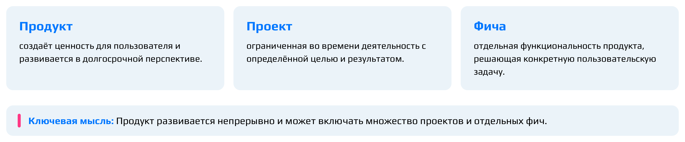

### Как продукт создаёт ценность

Самая важная цепочка всей первой части курса выглядит так:

*Потребность пользователя → решение → пользовательская ценность → ценность для бизнеса.*

Пользователь приходит в продукт не ради набора функций, а чтобы решить определённую задачу. Если решение действительно закрывает его потребность, возникает **пользовательская ценность** — польза, которую человек получает от продукта. Если продукт при этом приносит что-то компании, возникает **ценность для бизнеса**.

Цепочка может порваться с обеих сторон. Допустим, мы сделали функцию, которой никто не пользуется. Технически решение существует, но создали ли мы ценность — большой вопрос. Обратная ситуация: продукт даёт пользователям огромную ценность, но бизнес не способен поддерживать его экономически. Такой продукт сложно назвать устойчивым.

Поэтому продукт всегда существует на пересечении двух вопросов: **зачем он пользователю и зачем он бизнесу**. Проще говоря, продукт должен решать проблему пользователя и при этом приносить пользу компании. Чаще всего ценность для бизнеса — это деньги: бизнес должен зарабатывать, иначе он просто не устоит на ногах. Бывают исключения — благотворительные продукты или продукты, задача которых переводить пользователей в более ценные для компании продукты. Но в основном речь всё же об экономике.

**Важный вывод:** устойчивый продукт должен создавать ценность и для пользователя, и для бизнеса одновременно.

Сама пользовательская ценность бывает разной: **функциональной**, **экономической**, **эмоциональной** или **социальной**.

Через пару лекций мы начнём обсуждать метрики, и здесь стоит запомнить одну мысль. **Важно:** метрика — это не сама ценность, а попытка измерить ценность через наблюдаемое поведение пользователей.

## Жизненный цикл продукта и роль аналитики на каждом этапе

*Таймкод: 00:10:00 · слайды 21–23*

Продукт не остаётся одним и тем же: сначала это догадка о чужой проблеме, потом первая работающая версия, затем большой сервис с миллионами пользователей, а однажды его закрывают. На каждом этапе команда знает о продукте разное и беспокоится о разном. Чтобы говорить об этом предметно, удобно пользоваться моделью **жизненного цикла продукта**, то есть последовательностью стадий, через которые продукт обычно проходит от идеи до завершения.

### Пять стадий

В этом курсе мы будем использовать модель из пяти стадий: Discovery → MVP → Growth → Maturity → Sunset. Она распространена и хорошо подходит для обучения, но это именно модель, а не обязательный маршрут каждого продукта.

- **Discovery** (от англ. «открытие») — стадия поиска проблемы и возможного решения. Мы ещё не уверены, что правильно понимаем проблему, и изучаем её: действительно ли она существует и «болит», нужно ли пользователю новое решение. Бывает, что за проблему принимают обычные жалобы, которые сам пользователь решать не собирается. Тогда решения может не потребоваться вовсе.
- **MVP** (minimum viable product, минимально жизнеспособный продукт) — стадия, на которой появляется первое решение. Это минимальная версия продукта, которая уже приносит пользу. Задача стадии — понять, создаёт ли решение ценность для реальных пользователей.
- **Growth** (рост) — масштабирование ценности, которая уже подтверждена. Граница с MVP проходит именно здесь: на MVP ценность проверяют, на Growth она уже проверена, и продукт растят.
- **Maturity** (зрелость) — продукт вырос, и теперь важно удержать результат: сохранить и приумножить аудиторию, не растерять базу. На первый план выходят удержание пользователей, эффективность и локальные улучшения.
- **Sunset** (закат) — продукт трансформируют или выводят из эксплуатации. Это нормальная часть жизни продукта, а не провал.

Модель нелинейная. Зрелый продукт может вернуться в Discovery, найти новый сегмент пользователей и снова перейти к росту.

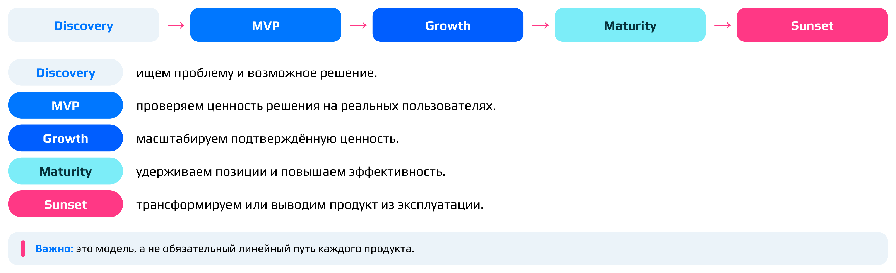

### Какие вопросы решает команда на каждой стадии

Смысл модели в том, что **на разных стадиях команда задаёт разные вопросы**.

На Discovery главный вопрос звучит так: существует ли значимая пользовательская проблема и какое решение стоит проверять? Вам кажется, что вы нашли проблему пользователя, но большого объёма данных ещё нет, и её нужно подтвердить исследованиями, качественными и количественными.

На MVP вопрос другой: даёт ли решение ценность? Мы создаём минимальный продукт, который отвечает на найденную проблему, и смотрим, пользуются ли им и действительно ли он решает проблему, обнаруженную на Discovery.

На Growth, когда и проблема, и ценность решения подтверждены, команда ищет, что позволяет расти и как масштабироваться. Из работающего решения нужно сделать большой продукт, который удерживает широкую аудиторию и быстро растёт. Здесь ищут **драйверы роста**, то есть факторы, которые сильнее всего влияют на рост продукта.

На Maturity продукт уже вырос, и вопрос звучит так: как удерживать позиции и повышать эффективность? Команда разбирается, какие функции заставляют пользователей оставаться и больше пользоваться продуктом и что можно локально подправить, чтобы он стал лучше.

На Sunset решают, стоит ли продолжать вкладываться в продукт и как корректно трансформировать его или завершить.

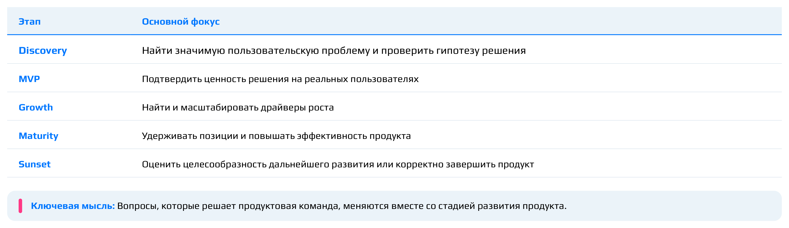

Посмотрим, что бывает, если не учитывать стадию. Стартап на стадии MVP, у него 500 пользователей, и команда предлагает построить идеальный [дашборд]{.gl key="Дашборд"} (панель с графиками и показателями) из 70 показателей. Но главный вопрос сейчас другой: нужен ли этот продукт хоть кому-нибудь? Многие стартапы попадают именно в эту ловушку: гипотеза о том, что продукт нужен людям, так и остаётся непроверенной, а силы уходят на подробные измерения.

**Важный вывод:** хорошая аналитика — это не максимальное количество расчётов. Хорошая аналитика отвечает на главную неопределённость продукта прямо сейчас, то есть на тот вопрос, от ответа на который больше всего зависит судьба продукта на текущей стадии.

### Что делает аналитик на каждой стадии

Вместе со стадией меняются и задачи аналитика, и данные, которые у него есть.

**Discovery.** Собственных данных почти нет: продукт ещё ничего не произвёл, поведения пользователей наблюдать негде. Поэтому аналитик работает с исследованиями рынка и пользователей, внешними данными и оценкой масштаба проблемы. Основные инструменты такие:

- **Глубинные интервью** — **качественное исследование**. У интервьюера есть сценарий вопросов, который помогает выявить боль и потребность пользователя. Он проходит по этим вопросам и выясняет, что думает о них собеседник. Исследование называют глубинным и качественным, потому что шаблонных вариантов ответа нет: суть в том, чтобы по-настоящему поговорить с человеком.
- **Количественные исследования**, например опросы. Когда проблема, как вам кажется, найдена, её «масштабируют»: проверяют, у скольких людей она откликается.
- **Изучение конкурентов.** Смотрят на отзывы, функции конкурентов, на то, как они развивались, какие метрики использовали, какие сценарии затронули и, главное, зачем всё это было нужно их пользователям. Кроме того, может оказаться, что идея, которая кажется вам или бизнесу новой и классной, уже реализована конкурентами или они начали над ней работать. Поэтому изучение конкурентов тоже входит в Discovery.

Вся эта работа с потенциальными пользователями и проверкой проблемы до создания продукта известна как **CustDev** (customer development, «развитие клиента») и целиком относится к Discovery[^n3a].

**MVP.** Здесь впервые появляется реальное поведение пользователей. Продукт сделан в минимальном виде, и уже можно собирать [логи]{.gl key="Логи"} (записи о действиях пользователей в продукте), отзывы, результаты альфа- и бета-тестирования, комментарии пользователей и отчёты об ошибках. По ним понятно, что пользователям на самом деле нужно, а что нет, то есть проверяются ключевые предположения о продукте.

**Growth.** Появляются классические инструменты продуктовой аналитики: продуктовые метрики, воронки (как пользователи шаг за шагом проходят ключевой сценарий и где отсеиваются), сегментация (сравнение разных групп пользователей), эксперименты и поиск драйверов роста. Всё это подробно разбирается в следующих темах курса.

**Maturity.** Задачи смещаются к оптимизации: поиску локальных точек роста и повышению эффективности. Аналитик ищет, за счёт чего аудитория удерживается в продукте.

**Sunset.** Закрытие продукта тоже требует аналитики. Нужно оценить оставшуюся аудиторию и ценность, которую она продолжает получать; стоимость поддержки, которая на этой стадии может перевешивать то, что продукт зарабатывает; последствия закрытия.

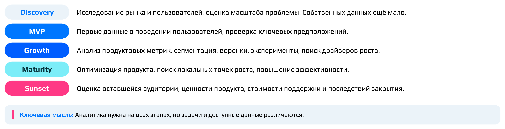

**Важно:** аналитика нужна продукту с самого начала, а не только когда накопились данные. Просто на разных стадиях у неё разные задачи и разные доступные данные.

::: {.qa title="Вопросы из зала"}
**CustDev — это часть Discovery?** Да, CustDev относится именно к Discovery.

**Изучение конкурентов — это тоже Discovery?** И да, и нет. Конкурентов изучают на всех этапах, потому что продукту нужно оставаться конкурентоспособным. Но на Discovery это особенно полезно при формулировании гипотезы о проблеме: можно заметить, что конкурент какую-то проблему пользователей не решает.

**В какой момент встаёт вопрос доверия пользователя к продукту и решают ли его аналитики?** Для этого есть отдельные метрики, связанные с удовлетворённостью пользователей конкретной функциональностью и продуктом в целом. Их мы разберём в теме, посвящённой метрикам.
:::

[^n3a]: Примечание составителя: расшифровка термина и общее описание CustDev добавлены для ясности; в курсе CustDev упоминается только как часть Discovery в связи с интервью пользователей и изучением конкурентов.

## Ландшафт аналитических специальностей

*Таймкод: 00:18:23 · слайды 24–28*

Мы разобрались, зачем аналитика нужна продукту. Теперь стоит распутать другую путаницу: какие бывают аналитики. Аналитик аналитику рознь. В вакансиях встречаются бизнес-аналитик, системный аналитик, BI-, дата- и продуктовый аналитик, причём две компании могут совершенно по-разному называть почти одинаковую работу, а иногда путаница есть даже внутри текста одной вакансии. Поэтому важно самим понимать, кто чем занимается и кем вы хотите работать.

Начнём не с названий должностей, а с того, зачем команде вообще нужна аналитика. У продуктовой команды постоянно возникают вопросы четырёх типов:

1. **Что произошло?** Часто для ответа достаточно агрегировать данные.
2. **Почему это произошло?** Здесь уже нужно исследование.
3. **Что можно изменить?** Для ответа нужен продуктовый контекст.
4. **Как понять, что изменение сработало?** Нужно корректное измерение.

От первого вопроса к четвёртому задача усложняется. Во всех четырёх случаях аналитика делает одно и то же: уменьшает неопределённость, в которой команда принимает продуктовые решения. К этой мысли мы ещё вернёмся, когда будем говорить о роли продуктового аналитика.

### Пять ролей

Удобнее всего различать аналитические роли по **объекту анализа**, то есть по тому, с чем аналитик работает в первую очередь.

- **Business Analyst** (BA, бизнес-аналитик) работает с бизнес-процессами и требованиями. Он описывает процессы, смотрит, как они реализуются, и следит за их исполнением. Результат его работы — описание и улучшение процессов.
- **System Analyst** (SA, системный аналитик) работает с информационными системами и требованиями к ним. Его задачи — системные требования и описание того, как взаимодействуют компоненты системы.
- **BI Analyst** (BI-аналитик) отвечает за показатели, мониторинг и отчётность. Результат его работы — дашборды и отчёты.
- **Data Analyst** (DA, дата-аналитик) работает с данными: исследует их, ищет закономерности и делает выводы.
- **Product Analyst** (PA, продуктовый аналитик) работает с продуктом, поведением пользователей и продуктовыми решениями. Его инструменты — исследования, метрики и эксперименты, а результат — продуктовые выводы и рекомендации.

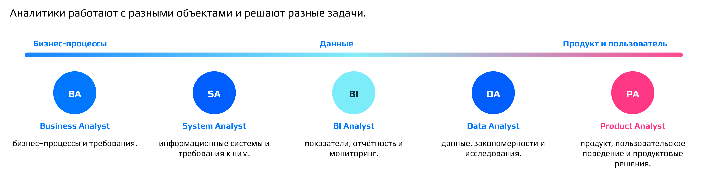

**Важно:** это не пять непроницаемых коробок. В реальных компаниях обязанности пересекаются, а границы между ролями проводят по-разному. В одной компании дата-аналитик фактически делает работу продуктового, в другой продуктовый аналитик сам строит BI. В MAX, например, отдельных BI-аналитиков нет, и дашборды продуктовые аналитики строят сами. Это умение продуктовому аналитику в любом случае нужно: без него трудно представить результаты своей работы. При этом во многих компаниях есть отдельная BI-команда. Навыки тоже переносятся: начав с дата-аналитики и перейдя в продуктовую, вы продолжаете пользоваться тем, чему научились раньше.

Отсюда практический совет к собеседованию. Спрашивайте не только, как называется позиция, но и:

- какой объект я буду анализировать;
- что войдёт в мою зону ответственности;
- какие вопросы я буду решать;
- кто принимает решения на основе моей работы.

**Важный вывод:** содержание работы важнее названия роли.

### Как это выглядит в работе

**Бизнес-аналитик** анализирует процессы и требования. Например, он может разобрать **CJM** (Customer Journey Map, карта пути пользователя), то есть описание того, как пользователь шаг за шагом взаимодействует с нашей системой; подробно CJM разбирается в следующей теме курса. Кроме того, бизнес-аналитик проводит исследования, налаживает бизнес-процессы и описывает продуктовые требования.

**Системный аналитик** делает похожую работу, но смотрит на неё со стороны системы. Весь продукт разложен на компоненты, и системный аналитик хорошо знает, как они между собой сообщаются. Возьмём архив чатов в мессенджере: туда убирают переписки с теми, с кем не хочется общаться, или каналы, на которые подписались, но читаете редко. Допустим, такую фичу только создают. Системный аналитик описывает все требования и все взаимодействия компонентов для неё: как пользователь попадает в архив, как его открывает, какие чаты туда ни в коем случае нельзя класть, как перенести в архив открытый канал. По сути, это описание того, как будет работать система. Системный аналитик ближе к разработке, но он не разработчик: он должен понимать, как работает разработчик, и описывает, как требования должны быть реализованы. Детализация бывает разной, не всегда до уровня «какой метод API будет вызываться», но в MAX требования описываются подробно.

**BI-аналитик** настраивает отчётность в виде визуализаций. BI-инструмент показывает графики того, как меняются показатели; набор таких графиков на одном экране называют **дашбордом**. Хороший BI-аналитик строит дашборд так, чтобы бизнес легко видел причинно-следственные связи: например, количество сообщений падает, потому что упало количество людей, которые их отправляют. Пример элементарный, но хорошо показывает идею. Вторая часть работы BI-аналитика — **алертинг**: бот или встроенные в BI-инструмент средства автоматически присылают в корпоративный чат либо ежедневную статистику для C-level и руководителей продукта, либо сообщение о том, что метрика вышла за заданное минимальное или максимальное значение. Во втором случае нужно срочно бежать тушить пожар: BI-аналитик свою работу сделал, теперь пора поработать пожарным.

**Дата-аналитик** в основном копается в логах и отвечает на вопрос, почему произошло то или иное изменение. **Продуктовый аналитик** делает то же самое, но переводит объяснение на язык продукта: объясняет причины со стороны пользователей, их поведения. Закономерности тоже ищет не только дата-аналитик, но и продуктовый. Кроме того, продуктовый аналитик постоянно формулирует и проверяет [гипотезы]{.gl key="Гипотеза"}, то есть предположения о том, что изменение в продукте повлияет на поведение пользователей. Гипотезам посвящена следующая тема курса.

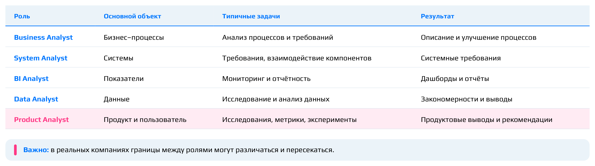

### Где находится продуктовый аналитик

Продуктовый аналитик находится на пересечении трёх областей:

- **пользователь**: поведение, потребности, пользовательский опыт;
- **продукт**: цели, механики, проблемы и развитие продукта;
- **данные**: измерение, анализ, закономерности и проверка предположений.

Представьте три пересекающихся круга. Лучше всего роль каждого круга видна, если его убрать. Без пользователя остаётся анализ цифр без понимания поведения, просто какие-то числа. Без продукта можно найти закономерность, которая никак не помогает принять решение. Без данных остаются только мнения и интуиция: продукт почему-то перестал развиваться, пользователь как-то себя ведёт, а проверить гипотезы нечем.

**Важный вывод:** продуктовый аналитик исследует пользователя через данные в контексте задач продукта.

::: {.qa title="Вопросы из зала"}
**Системный аналитик ближе к UX или к разработке?** К UX он отношения не имеет, это совсем другая история. Он ближе к разработке, но код не пишет, а описывает, как должны быть реализованы требования.

**В продуктовые аналитики легче перейти из бизнес-аналитики или из дата-аналитики?** Из дата-аналитики. Бизнес-аналитику не обязательно хорошо знать математическую статистику и теорию вероятностей, а дата-аналитик этой базой уже владеет. После перехода остаётся развивать продуктовое видение.

**Можно ли считать продуктовую аналитику отраслью дата-аналитики, как и BI?** Продуктовую аналитику можно считать ветвью дата-аналитики: оба ищут в данных причины изменений, только продуктовый аналитик объясняет их через поведение пользователей. А вот BI частью продуктовой аналитики считать не стоит: для продуктового аналитика BI скорее инструмент.
:::

## Главная задача продуктового аналитика — снижать неопределённость

*Таймкод: 00:32:55 · слайды 29–32*

### Что продуктовый аналитик даёт команде

Мы разобрали, где продуктовый аналитик находится среди других аналитических ролей. Теперь главный вопрос этой темы: что именно он даёт продуктовой команде?

Команда почти всегда принимает решения в условиях неполной информации. Она приходит с вопросами, на которые не всегда есть готовый ответ: почему упала метрика, нужна ли пользователям новая функция, что сломалось после релиза. Это и есть **неопределённость** — недостаток знания о продукте и пользователях, при котором решение приходится принимать наугад или по интуиции. Главная задача продуктового аналитика — эту неопределённость снижать.

Ответить «я посмотрел данные, делаем» аналитик не может. Его работа — пройти цепочку:

**Продуктовый вопрос → Данные → Анализ → Знание о продукте и пользователе → Продуктовое решение.**

Ценность появляется, когда данные и анализ превращаются в новое знание, на которое команда может опереться при решении.

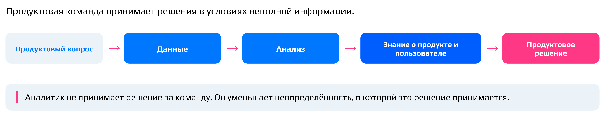

Возьмём мессенджер MAX. Команда спрашивает: почему падает отправка сообщений? Аналитик выясняет, что снижение сосредоточено на одной платформе, например только на iOS, и началось после определённого изменения: перестали приходить push-уведомления. Пользователи не видели новых сообщений, не отвечали родным и знакомым, и поэтому общее число сообщений упало. Раньше у команды этого знания не было, а теперь понятно, где искать причину и что чинить.

**Важно:** аналитик не принимает решение за команду. Он уменьшает неопределённость, в которой это решение принимается. Обычно аналитик представляет результаты исследования и предлагает возможные пути решения, а решает тот, кто поставил вопрос: чаще всего продакт (менеджер продукта, который отвечает за развитие фичи или продукта), в серьёзных случаях, например при крупном инциденте, — его руководитель или даже вице-президент. Приходить к продакту нужно не с голыми цифрами («вот тебе числа, делай с ними что хочешь»), а с выводами, которые объясняют, что происходит и что с этим можно сделать.

### Какие вопросы решает аналитик

Почти любое продуктовое исследование начинается с одного из пяти вопросов:

1. **Что происходит?** Как меняется продукт и поведение пользователей?
2. **Почему это происходит?** Какие факторы могут объяснять изменения?
3. **Для кого это происходит?** Одинаково ли ведут себя разные группы пользователей?
4. **Что можно изменить?** Где проблемы и потенциальные точки роста?
5. **Как понять, что изменение сработало?** Как измерить результат продуктового решения?

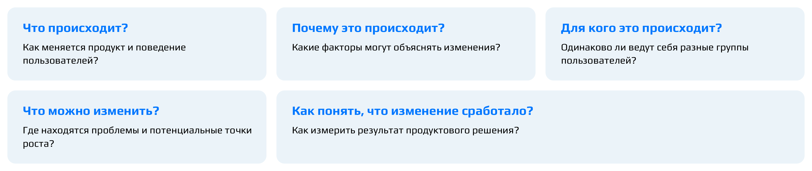

**Акцент лектора:** хороший аналитик почти никогда не останавливается на первом вопросе. Нельзя просто прийти к менеджеру и сказать: «У нас упал DAU». **DAU** (daily active users) — число активных пользователей за день. Фраза «DAU упал» — лишь описание события. Следующим вас спросят: у кого упал, почему, что делать. Эти вопросы нужно предвосхищать и отвечать на инцидент или запрос комплексно. Именно движение от описания к объяснению и решению превращает расчёт в **продуктовое исследование** — работу, которая отвечает не только на «что», но и на «почему», «для кого» и «что с этим делать».

### От «посчитай цифру» до продуктового исследования

Представим: продакт просит посчитать, сколько пользователей воспользовались новой функцией. Начинающий аналитик пишет SQL-запрос, получает 1,2 миллиона и отправляет эту цифру. Для младшего специалиста это нормально: от джуна обычно ждут именно цифр, а не больших исследований. Но полезно с самого начала понимать, что работа аналитика этим не ограничивается.

Сама по себе цифра 1,2 миллиона ничего не говорит. Много это или мало? От какой базы? За какой период? Кто эти люди — новые пользователи или давние? Как они пришли к функции? Воспользовались один раз или делают это регулярно? А что с теми, кто функцией не пользуется: пытались ли они вообще, может быть, у них не получилось? Хороший продуктовый аналитик раскручивает один вопрос в полноценное исследование: кто пользуется, как часто, кто не пользуется и почему, как использование связано с остальным поведением пользователя, создаёт ли функция ожидаемую ценность. Не всегда нужен такой размах, но для исследования он часто необходим.

Главное — понять, **зачем** команда задала вопрос. Возможно, настоящий вопрос звучит так: стоит ли дальше инвестировать в эту функцию? Тогда одно число пользователей практически бесполезно.

**Важный вывод:** прежде чем писать SQL-запрос, спросите заказчика, какое решение будет принято на основании вашего ответа, то есть зачем мы это считаем. Работа аналитика начинается не с расчёта, а с понимания вопроса.

Разберём, какие уточняющие вопросы стоит задать продакту, который пришёл с просьбой «посчитайте пользователей новой функции».

- **Зачем считаем и что хотим выяснить?** Это главный вопрос: от ответа зависит, что вообще считать.
- **Что значит «воспользовался функцией»?** Очень полезный вопрос: то, что представляете вы, не всегда совпадает с тем, что в голове у продакта.
- **За какой период?** Если функцию запустили две недели назад, период фактически задан.
- **Каких пользователей считать** — новых или постоянных? Кто целевой пользователь функции?
- **Какой результат считать успешным, а какой нет?** Без этого цифру не с чем сравнить.
- **Как часто пользуются?** Здесь уместна не только доля, но и, например, медиана частоты использования.
- **Нужна ли разбивка по точкам входа** — откуда пользователи приходят к функции?
- **Точно ли нужна именно эта метрика?** Список метрик аналитик и продакт обычно обсуждают и оспаривают вместе.

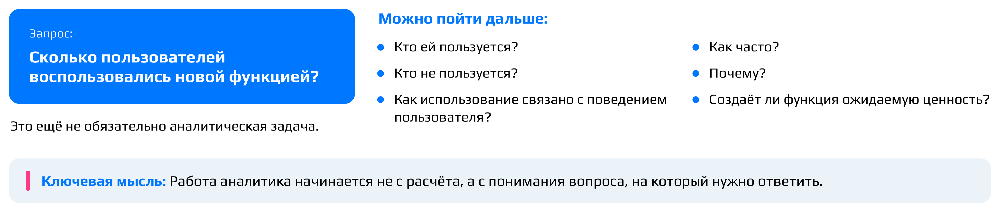

Настоящий вопрос за просьбой зависит от самой функции. Если она заменяет старую, продакту, скорее всего, важно, сколько пользователей перешли на новую. Иногда важно, насколько функция удобна, или даже сколько пользователей её вообще увидели.

А вот вопрос «откуда брать данные?» продакту задавать не нужно: он этого не знает, это зона аналитика. Продакты — менеджеры, а источники данных знает аналитик.

Часть уточняющих вопросов снимается сама, если изучить описание функции. У крупной продуктовой фичи обычно есть **спецификация** (в MAX она называется именно так, в других компаниях — по-разному): документ, где описаны технические и продуктовые требования и метрики. По ней видно, какой пользовательский путь ведёт к функции, зачем она нужна, какую задачу и проблему решает. В MAX, когда анализируют что-то новое, обязательно читают спецификацию, чтобы понять, в какой сценарий встроена функция. После этого задавать продакту вопросы гораздо проще, и сами вопросы становятся точнее.

::: {.qa title="Вопросы из зала"}
**С кем продуктовый аналитик работает больше всего — с менеджером продукта?** Со всеми: немного с разработкой, с дизайнерами, с продактами (иногда много), со своим руководителем и с вышестоящими руководителями.

**Долго ли согласовывается решение аналитика в бигтехе?** Сильно зависит от компании. В MAX пока это происходит довольно быстро.

**То, что аналитик приносит продакту, — это UX-исследования?** Не только: работа продуктового аналитика UX-исследованиями не ограничивается.

**Может ли аналитик сам, без запроса команды, что-то исследовать?** Да. Например, он замечает странность в метриках на дашборде и начинает копать. На большое исследование ресурса обычно нет: работа планируется заранее. Но его можно согласовать с руководителем или сделать самостоятельно, если руководитель доверяет, и принести найденное продакту или руководству. Культура в компаниях разная. В MAX можно инициировать собственное исследование, обосновав его важность, а сильные продуктовые выводы после проверки можно представить всей команде MAX.
:::

## Зоны ответственности и задачи аналитики на примере MAX

*Таймкод: 00:45:40 · слайд 33*

### Семь зон — одна цепочка

Посмотрим, за какие области работы отвечает продуктовый аналитик. Их удобно назвать [**зонами ответственности**]{.gl key="Зоны ответственности"}:

1. исследование поведения пользователей;
2. мониторинг состояния продукта;
3. поиск проблем и точек роста;
4. сегментация и исследование аудитории;
5. оценка продуктовых изменений;
6. подготовка и анализ экспериментов;
7. поддержка продуктовой команды данными, выводами, рекомендациями и инсайтами.

Список легко прочитать как набор независимых работ, но на практике это цепочка. Мониторинг показал падение метрики, исследование локализовало его в конкретном сегменте пользователей, появилась гипотеза о причине, команда внесла изменения, аналитик оценил результат. Время от времени цепочка возвращается на один из предыдущих шагов: оценка изменений снова превращается в мониторинг, мониторинг — в новое исследование.

Как выглядят реальные задачи в этих зонах? Хорошие примеры: «объяснить падение количества активных пользователей», «почему DAU упал на 10 %», «почему новой фичей не пользуются», «почему вдруг выросли продажи», «закрыла ли фича потребность, которую мы выявили раньше». Многие же формулировки, которые приходят в голову первыми, слишком широки. «Оценить новую систему монетизации» — это скорее **эпик**, крупный блок работы, который сначала нужно разбить на отдельные задачи. «Исследовать полезность новой фичи» — польза эфемерна, пока не договорились, что ею считать: доход для бизнеса, спрос на услугу или что-то ещё. «Проанализировать целевую аудиторию» тоже требует уточнения цели: аудиторию можно рассматривать с точки зрения монетизации или частоты использования конкретных функций. «Сколько пользователей посетило сайт» даст голую цифру, поэтому нужно спросить продакта, в рамках какой инициативы это считается.

Часто размытую задачу помогает переформулировать пользовательский путь. «Почему пользователи стали быстрее закрывать страницу» точнее звучит так: почему они выходят из своего пути раньше, чем получили ценность. «Почему пользователи отказываются от продукта» — в какой момент они выпадают из пути; обычно это видно как провал в **воронке** (последовательности шагов, на каждом из которых часть пользователей отсеивается), и с воронки исследование начинается. А «в выходные пользователей меньше, чем в будни» — классика: скорее всего, это **сезонность**, естественный ритм жизни людей, а не проблема продукта.

### Чем занимается продуктовая аналитика в MAX

Команда продуктовой аналитики MAX разделена на направления. Самое большое — **кор мессенджера**: звонки, переписка, каналы, поиск, пуши, настройки, Trust & Safety — всё, что связано с мессенджером как таковым. Внутри него аналитики тоже поделены: кто-то ведёт каналы, кто-то базовый модуль переписки, кто-то звонки. Похожими задачами занимается направление «Госы и бизнес». Отдельно работает направление продуктовых исследований.

У кор-команды три основных типа задач.

**Пред- и постаналитика выкатки фич.** **Преданалитика** проводится до запуска: насколько функциональность сейчас нужна пользователю, как он будет с ней взаимодействовать, какие метрики и насколько она поднимет. Аналитик прорабатывает сценарий использования и сверяет его с тем, как его описал менеджер, оценивает ожидаемые пиковые значения использования и ищет **бенчмарки** — ориентиры из похожих запусков. Когда в MAX выкатывали истории, смотрели на метрики запуска историй в VK, чтобы понимать, на какие значения целиться. [**Постаналитика**]{.gl key="Постаналитика"} проводится после запуска: аналитик оценивает прирост метрик, который дала фича, визуализирует его, проверяет, что всё работает правильно, и дальше следит за фичей на дашборде.

**Описание логирования.** [**Логирование**]{.gl key="Логирование"} — это запись данных о том, что происходит в продукте. Аналитик описывает для разработки, какие данные он хочет получать, когда срабатывает та или иная функциональность. Пользователь отправил сообщение — в этот момент фиксируется время, ID пользователя, было ли вложение и какое (стикер, голосовое, фото). **Важно:** содержимое сообщений аналитики не читают, это распространённое заблуждение. По-хорошему логирование описывает системный аналитик, но в MAX системных аналитиков нет, и эта работа достаётся продуктовым.

**Эксперименты.** Эксперимент — это не обязательно **A/B-тест**, при котором разные группы пользователей одновременно получают разные версии продукта и их метрики сравнивают. Бывают офлайн-проверки на ретро-данных, то есть на уже накопленной истории. Пусть кор-команда видит, что упало число подписок на каналы в день. Хороший аналитик, глядя на дашборды, выписывает список **гипотез** — предположений о причине, которые предстоит проверить, — и сортирует их от более релевантных к менее. Может быть, сломалась кнопка «Подписаться» после недавнего релиза (это быстро выясняется у разработки), может быть, дело в рекламе каналов или в новых ограничениях. Придумать можно что угодно, но проверять нужно по порядку, начиная с самого вероятного, чтобы не тратить лишнее время. Когда меняли рекомендательную систему каналов, старую и новую модели запустили параллельно и смотрели, какая показывает лучший результат. A/B-тестам в курсе посвящена отдельная тема во второй его части.

При этом не каждая новая фича проходит через эксперимент. Мультизакрепы (закрепление нескольких сообщений) выкатили без A/B-теста: спрос очевиден, функция давно есть в других мессенджерах. А новую рекомендательную систему или улучшения дозваниваемости без A/B не выкатывают: слишком велик риск сильно обвалить метрики. Есть и промежуточный вариант — **канареечный релиз**: фичу раскатывают по частям, сначала на 1 % аудитории, затем на 5 %, дальше больше, и на каждом шаге следят за мониторингами в реальном времени. Если всё хорошо, раскатку продолжают, если плохо — постепенно откатывают. Иногда фичу открывают отдельному сегменту, например блогерам: это и инфоповод («мы получили доступ к созданию собственных стикеров»), и проверка того, как функциональность работает.

Направление продуктовых исследований берёт более широкие вопросы о поведении пользователей и развитии продукта: строит **дерево метрик** (структуру, которая связывает метрики продукта причинно-следственными связями), сегментирует пользователей, прогнозирует метрики на следующий период (например, как продукт будет двигаться до конца 2027 года), разбирается в оттоке — почему пользователь уходит и почему возвращается.

### Не гнаться за метриками, а объяснять их

**Акцент лектора:** продуктовый аналитик не гонится за высокими метриками, он отвечает на вопрос, почему они такие. И ответ может оказаться неприятным. Допустим, выросло количество звонков. Негативных причин много: плохая связь, лаги и долгая загрузка, звонки чаще обрываются, активизировались мошенники, не отправляются сообщения и людям проще позвонить. А могло случиться и так, что в рамках какой-то выкатки случайно ограничили длительность звонка одной минутой, и пользователи вынуждены перезванивать. Метрика выросла, но плюса в этом нет. Поэтому в хорошем продукте есть дерево метрик: по нему видно, что на самом деле происходит. Подробно оно разбирается в третьей теме курса.

Аналитик учитывает и факторы вне продукта. Летом в MAX проседает число сообщений: люди уезжают в отпуска и меньше общаются. Чтобы убедиться, что это сезонность, а не проблема, смотрят на аналоги: если у них та же просадка, это рынок. Ещё один внешний фактор — перетоки аудитории: у нас трафик падает, а у другого мессенджера растёт. Данные по рынку дают специальные инструменты, но внутренние данные конкурентов недоступны: проверить спрос на мультизакрепы в Telegram нельзя. Сезонность же можно сверять как минимум с VK. Кроме того, в MAX есть отдельные команды, которые изучают жалобы и обращения пользователей и новостной фон вокруг продукта: новости тоже двигают метрики. Если причинно-следственные связи метрик внутри продукта выстроены хорошо, изменение поведения пользователей почти всегда удаётся объяснить.

::: {.qa title="Вопросы из зала"}
**Как составлять релевантные гипотезы — это только насмотренность?** Насмотренность и жизненный опыт влияют, но важнее знать, что происходит внутри компании: какие метрики связаны между собой, что недавно выкатила разработка. Если неделю назад вышла новая фича, она вполне могла повлиять на каналы. С опытом в конкретной компании начинаешь понимать причинно-следственные связи между метриками и сразу знаешь, куда смотреть. И очень важна логика — без неё продуктовому аналитику никуда. Подробно о гипотезах — в следующей теме курса.

**MAX и VK в одной группе компаний — у вас совместная аналитика?** Нет, и пользователей друг у друга никто не переманивает. Команды смотрят на данные друг друга, чтобы понять сезонность или эффект выкатки похожих фич.
:::

## За что продуктовый аналитик не отвечает

*Таймкод: 01:05:44 · слайд 34*

### Аналитик повышает качество решения, но не принимает его

Мы уже разобрали, чем занимается продуктовый аналитик. Теперь посмотрим на обратную сторону: чего от него ждать не стоит.

Аналитик не обладает истиной в данных. Данные могут быть неполными, у любого метода есть ограничения, а причинность не всегда удаётся доказать. Поэтому продуктовый аналитик:

- не принимает продуктовые решения единолично;
- не определяет стратегию вместо Product Manager;
- не гарантирует успех продуктового изменения;
- не заменяет собой другие роли продуктовой команды;
- не является просто «человеком для выгрузок».

Последний пункт стоит пояснить. Запросы вида «выгрузи мне табличку» действительно приходят, и их выполняют, но заниматься только ими нельзя. Ответственность аналитика в другом: команда должна понимать **факты, неопределённости, риски и возможные последствия** решения.

**Важный вывод:** задача аналитика — повысить качество решения, а не принять его за команду.

Почему решение принимает не аналитик? Найденные инсайты и предложения по изменениям он согласует с продактом или с руководителями выше, например с [CPO]{.gl key="CPO"} (директором по продукту). На это есть три причины. Во-первых, у компании есть стратегия, и от неё отходят далеко не всегда. Во-вторых, гипотезы аналитика попадают в бэклог (список задач команды), где их ранжируют вместе с другими по ожидаемому результату. В-третьих, то, что аналитику кажется верным, не обязательно сработает с точки зрения бизнеса. Поэтому аналитик приносит инсайты, объясняет, как пришёл к выводу, и предлагает, что сделать. Дальше решение обсуждают вместе с продактом и руководителями. Если речь о выкатке фич, финальное слово остаётся за продактом: он согласует решение со стратегией.

Отдельный случай — когда данных не хватает. Бывает, что часть данных просто «не долетает»: какое-то событие не залогировали или произошёл системный сбой. Тогда аналитик может строить только гипотезы и прямо говорит, что они не проверены. Если продакт готов принимать решение на основе таких экспертных догадок, это ограничение нужно явно подсветить.

### Ответственность за результаты

Из сказанного не следует, что аналитик ни за что не отвечает, а вся ответственность лежит на менеджере. Хороший менеджер доверяет хорошему аналитику: сам в данных не копается и при принятии решения полностью опирается на результаты аналитика. Если эти результаты оказались неверными, ответ на вопрос «кто виноват» очевиден. Аналитик отвечает за решения, принятые на основе его данных. Принося результаты, вы гарантируете, что они верны, при условии, что данных было достаточно.

Мера ответственности зависит от уровня влияния. Если джун принесёт неточные данные, их перепроверит руководитель или менеджер, да и задачи ему дают попроще. Чем выше уровень аналитика, тем больше доверяют его данным и тем больше ответственности он несёт.

Что делать, если цифры противоречат интуиции? Возьмём случай из практики. Перед исследованием картина в голове уже сложилась, но результат показал совершенно неинтуитивное поведение пользователей. Предлагать решение на таких данных без дополнительной проверки было нельзя: им не было доверия. Провели дополнительные исследования, нашли инсайты и вместе с продактами выстроили дальнейшую стратегию. Если есть время и логи, в такой ситуации нужно проверять и копать дальше. Интуиция помогает задать правильные вопросы, но опираться нужно на итоги исследований.

**Акцент лектора:** одна из самых частых ошибок аналитиков — делать выводы о причинах на интуиции. Прошли часть исследования и решили: «всё, проблема точно в этом». Когда в голове возникает такая мысль, надо срочно идти проверять. Не всё так понятно, как кажется, поэтому исследование нужно доводить до конца. Вторая частая ошибка — ошибки с данными: неверно написанный запрос или неверно построенная визуализация, из-за которых метрики перестают отражать реальность.

### Как начинается исследование: ТЗ и груминг

Качество ответа во многом определяется тем, как поставлена задача. **ТЗ на исследование** — это описание задачи, которое заказчик (например, продакт) передаёт аналитику. Хорошее ТЗ максимально ясно отвечает на три вопроса: в чём проблема и с чем столкнулись, из-за чего понадобилось исследование; на что повлияет его результат; какой нужен **образ результата**, то есть в каком виде нужен ответ, от одной цифры до презентации.

Задача часто приходит сформулированной плохо. Если вопрос слишком общий, можно потратить много времени и решить не ту задачу. Поэтому ТЗ стоит «челленджить»: пойти к заказчику и задать уточняющие вопросы, как мы учились раньше. Что именно нужно исследовать? Какой эффект ожидается? В каком формате нужен результат?

Задачи продуктовых исследований бывают очень широкими. Формулировка вроде «сегментация пользователей» звучит как огромное полотно, и непонятно, за что браться. Такую задачу декомпозируют на **груминге**: аналитик вместе с руководителем обсуждает, как подойти к задаче и на какие блоки её разбить. Насколько хорошо понята задача, в итоге зависит от самого сотрудника.

### Инсайт и гипотеза

**Инсайт** — идея, рождённая в ходе исследования: новое понимание того, как ведут себя пользователи, или новая гипотеза о том, что стоит внедрить или изменить. **Гипотеза** — предположение о чём-либо, например о том, как решить проблему пользователя. Как формулировать и проверять гипотезы, подробно разберём в следующих темах курса.

::: {.qa title="Вопросы из зала"}
**Прописана ли ответственность аналитика в должностной инструкции или нормативных актах?** Скорее нет, это формальность. Что и как часто аналитик отдаёт, договариваются с руководителем (руководителем команды или руководителем продуктовой аналитики): ставят KPI и определяют, какие задачи нужно решить за период. Постоянных отчётов «наверх» аналитик не готовит, регулярная отчётность давно автоматизирована.

**Аналитики сидят внутри продуктовых направлений или отдельной структурой?** В MAX отдельно существуют техническая аналитика, продуктовая аналитика и команда **DWH** (Data Warehouse, хранилище данных). Продуктовая аналитика — самостоятельная структура из четырёх команд.

**DWH — это системные аналитики?** Нет. Это команда, близкая к технической аналитике и дата-инженерии: они перекладывают данные из одних источников в другие и настраивают инфраструктуру данных.

**Какими BI-инструментами пользуются в MAX?** DataLens от Яндекса. Инфраструктура Яндекса пришла в MAX вместе с переходом Дзена в VK.

**Пригодятся ли продуктовому аналитику компетенции системного аналитика?** Скорее да. Системный аналитик хорошо понимает, как система устроена внутри продукта, и умеет описывать функциональные требования. Это помогает выстраивать причинно-следственные связи и понимать, как всё работает.

**Ошибка ли аналитика, если его гипотеза не подтвердилась (результат не статистически значим)?** Зависит от ситуации. Если речь об A/B-тесте, возможно, эксперимент был неправильно спроектирован.
:::

## Продуктовая команда и процесс разработки

*Таймкод: 01:41:34 · слайды 35–38*

Аналитик не работает сам по себе, поэтому посмотрим, в какой системе он существует: кто рядом с ним и как новая функциональность проходит путь от идеи до запуска.

### Кто входит в продуктовую команду

**Продуктовая команда** — это группа специалистов разных профессий, которые вместе развивают продукт или его часть. Типичный состав такой:

- **Product Manager** (продакт-менеджер, иногда его роль называют Product Owner) отвечает за направление развития продукта и приоритеты.
- **Product Analyst** — продуктовый аналитик.
- **Designer / UX Researcher**: дизайнер отвечает за пользовательский опыт, а **UX Researcher** изучает пользователей, их поведение и проблемы. В частности, он работает с CJM, то есть с картой пути пользователя по продукту или по отдельной его функциональности. Этой теме целиком посвящена следующая лекция.
- **Developers** — разработчики, отвечают за техническую реализацию.
- **QA** — специалисты по качеству: тестируют функциональность перед выпуском.
- **Marketing / Growth** занимаются ростом и продвижением продукта.
- Другие специалисты, которые нужны в конкретном продукте.

У каждой роли своя зона ответственности, но цель общая: создавать ценность для пользователя и для бизнеса.

Описанная схема — классическая **кросс-функциональная** команда, где люди разных профессий сидят в одной команде вокруг одного продукта. Так была устроена, например, команда рекламной платформы Сбера: продакт, тимлид, два дата-инженера, два разработчика, три дата-аналитика, а дизайнера не было вовсе. Однако в российских бигтехах от такой модели постепенно уходят. В MAX, например, есть отдельная команда продуктовых аналитиков, где работают только аналитики. Есть отдельная команда разработки, которая делится по клиентам (iOS, Android, десктоп, веб) и бэкенду, и отдельная команда продакт-менеджеров. Команды постоянно общаются между собой, а конкретные аналитики закреплены за конкретными направлениями, как и разработчики: одни работают над каналами, другие над перепиской. К такой структуре MAX пришёл сравнительно недавно.

::: {.qa title="Вопросы из зала"}
**Входят ли тестировщики в продуктовую команду?** Зависит от того, как устроен продукт. В MAX тестировщики работают рядом с разработчиками.

**К какой модели приходят сейчас крупные компании?** В основном к отдельным командам аналитиков, разработчиков и продактов, которые вместе работают в рамках своих направлений (стримов).
:::

### Путь фичи: от проблемы до оценки результата

Разберём упрощённый **путь фичи**, то есть последовательность этапов, через которые проходит новая функциональность:

**Проблема → Исследование → Гипотеза решения → Приоритизация → Разработка → Запуск → Оценка результата**

Исследования ведутся уже на этапе проблемы. Затем формулируется гипотеза решения — предположение о том, как решить проблему. Гипотез обычно несколько, поэтому дальше идёт приоритизация: выбираем, какая из них выглядит наиболее перспективной. Как приоритизировать проверку гипотез, мы разберём в отдельной теме курса. Только после этого начинаются разработка, запуск и оценка результата.

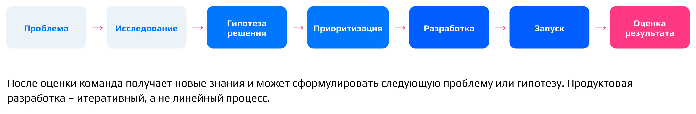

**Важно:** разработка стоит только в середине пути. Частая ошибка, особенно в стартапах (зрелые компании так уже не работают), — начинать сразу с решения: «Давайте добавим сюда кнопку». Зачем? «Кажется, пользователям так будет удобно». Решение есть, а нормально сформулированной проблемы нет.

После запуска работа тоже не заканчивается. Приходят новые данные, и может оказаться, что решение не сработало, сработало только для части пользователей или создало новую проблему. Команда получает новые знания и формулирует следующую проблему или гипотезу.

**Важный вывод:** продуктовая разработка — итеративный, а не линейный процесс.

### Где в этом процессе аналитик

Распространённое заблуждение звучит так: «Мы уже запустили фичу, позовите аналитика, пусть посмотрит, сработала ли она». Это слишком поздно. Так не должно быть, хотя на практике бывает. Аналитик должен участвовать во всех этапах, от исследования проблемы до подведения итогов. Как минимум он должен понимать, какой путь прошла функциональность, а в идеале — знать, что происходит на каждом этапе. В MAX всё устроено именно так:

- **Исследование проблемы:** оценивает масштаб проблемы и помогает понять поведение пользователей.
- **Планирование:** оценивает потенциальный эффект и задаёт критерии успеха. Когда в MAX выкатывали сторис, на этапе планирования нужно было определить, какие значения метрик должны получиться в ходе раскатки, чтобы можно было сказать: всё идёт по плану.
- **Разработка:** определяет, какие данные нужно собирать и что обязательно учесть к запуску.
- **Запуск:** следит за состоянием продукта и ключевыми показателями: ничего не сломалось, функциональность раскатилась правильно.
- **После запуска:** оценивает результат и разбирается в причинах изменений.

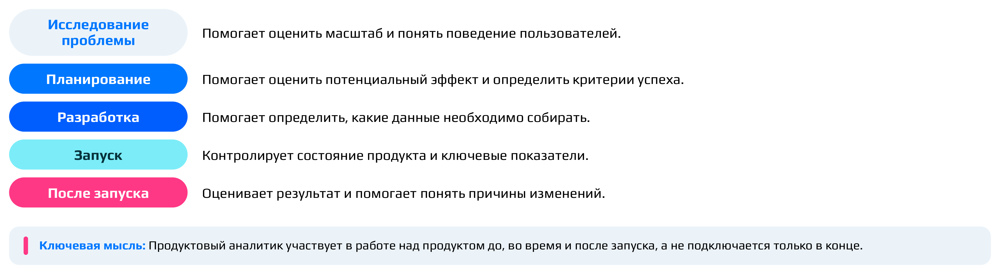

На этапе разработки решается, какие **логи** будут собираться. Логи — это данные о действиях пользователей. Например, пользователь перешёл с одного экрана на другой. В лог записываются номер первого экрана, номер второго, время перехода, идентификатор пользователя и дополнительные флаги: скажем, был ли переход сделан из какой-то папки или по ссылке.

**Акцент лектора:** если аналитик впервые увидел фичу после релиза и обнаружил, что нужные события не логируются, хороший анализ может быть физически невозможен. Звучит абсурдно, но так бывает. В MAX это случалось раньше, когда аналитиков не хватало, а разработка шла очень быстро. Логи не внедряли, фичу выкатывали, а потом срочно искали данные, чтобы понять, всё ли в порядке. Сейчас MAX достаточно зрелый продукт, и такого уже не происходит.

**Важный вывод:** продуктовый аналитик работает над продуктом до запуска, во время него и после, а не подключается только в конце.

::: {.qa title="Вопросы из зала"}
**Что делает аналитик после запуска, есть ли «поддержка»?** Да. Настраиваются дашборды и регулярная отчётность, чтобы держать руку на пульсе, а аналитик переходит к другим задачам.

**Сколько данных нужно, чтобы принять решение?** Это вопрос статистической значимости: данных должно хватать, чтобы отличить реальный эффект от случайных колебаний. Подробно её разберём в теме про исследование гипотез.

**Насколько аналитик должен сам пользоваться продуктом?** Зависит от продукта. В **B2B**-продуктах (продуктах для бизнеса, а не для частных пользователей) это часто почти невозможно: рекламной платформой Сбера, например, самому аналитику воспользоваться было очень непросто. Но изучать, из чего состоит продукт и какие в нём есть пользовательские пути, нужно обязательно. Без этого невозможно строить гипотезы и принимать решения.

**Может ли аналитик предлагать социальные инициативы — изменения, полезные пользователям, но не приносящие денег бизнесу?** Изменения в продукте в итоге влияют на бизнес, но не всегда напрямую через деньги. MAX, например, пока не зарабатывает и развивает другие метрики (о метриках поговорим в третьей лекции). Когда продукт уже зарабатывает, как Ozon, его метрики в большинстве случаев связаны с выручкой. Социальные проекты ради репутации обычно решаются на уровне вице-президента, а идея аналитика «раздать всем конфеты» без связи с целями бизнеса сомнительна. Предлагать такие инициативы можно, но они должны влиять на метрики удовлетворённости пользователей, например на **NPS** (Net Promoter Score — индекс готовности пользователей рекомендовать продукт) или CSI (индекс удовлетворённости клиентов).

**Значит, основная задача аналитика — увеличивать прибыль?** Не обязательно прибыль в денежном выражении. Скорее это развитие текущей функциональности и предложение новой, но вряд ли чисто социальной.

**Бывают ли нововведения, которые не приносят прибыли напрямую, но ускоряют работу сотрудников?** Да. Этим занимаются отдельные люди или целые команды, в MAX тоже: пересчитывают KPI сотрудников, ищут способы быстрее реагировать на задачи.

**Как понять, что учтены все нужные метрики?** Когда они отвечают на поставленный вопрос.
:::

## Продуктовое мышление и метрики

*Таймкод: 01:58:47 · слайды 39–43*

До сих пор мы говорили о том, что делает продуктовый аналитик. Теперь разберём, как он должен рассуждать. Выражение «продуктовое мышление» сейчас звучит со всех сторон, поэтому стоит договориться, что за ним стоит.

### Что значит мыслить продуктово

**Продуктовое мышление** — это способность смотреть на данные не изолированно, а в контексте продукта. На практике это означает несколько вещей:

- понимать, какую проблему решает продукт;
- смотреть на функциональность или проблему глазами пользователя;
- учитывать цели бизнеса, а не действовать из собственного энтузиазма;
- искать причины, а не просто фиксировать изменения: мало принести команде цифру «метрика изменилась на полтора миллиона» и оставить её с этим разбираться;
- связывать данные с реальным поведением людей, когда объясняем изменения;
- думать о последствиях решений: предлагая инициативу на основе данных, понимать, к чему она приведёт.

Всё это сводится к одному главному вопросу: *что это означает для пользователя и продукта?* Когда вы начинаете задавать его автоматически к любым цифрам, к любому изменению или гипотезе, вы уже мыслите продуктово.

### Ценность для пользователя и для бизнеса

Вспомним две стороны ценности, с которых мы начинали. Пользователь получает решение своей проблемы, экономию времени или ресурсов, более удобный процесс, новые возможности, более приятный опыт. Бизнес получает аудиторию, удержание пользователей, выручку, эффективность и устойчивое конкурентное преимущество. Сильный продукт создаёт ценность для обеих сторон.

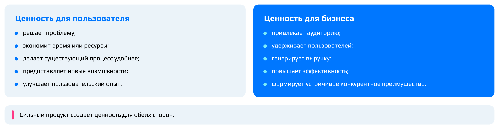

**Акцент лектора:** самые интересные продуктовые вопросы возникают там, где эти стороны конфликтуют. Больше рекламы в краткосрочной перспективе увеличивает выручку, но раздражает пользователей, ухудшает их опыт и в итоге приводит к оттоку.

Возьмём рекламу в каналах MAX. Вопрос здесь ставится не «показывать ли рекламу», а «раз в сколько постов её можно показывать, чтобы она не раздражала и даже была полезна». На чаше весов одновременно выручка и удержание пользователей. Поэтому аналитик смотрит не на один показатель, а на систему последствий решения.

Таких решений с риском негативных последствий много. Реклама сомнительных услуг вроде казино поднимает выручку, но бьёт по опыту пользователя: либо мы этот опыт не ухудшаем, либо умеем оценивать и осознанно принимать риски. Платная подписка — тоже очень аккуратный момент: часть пользователей может просто уйти. Сильное изменение визуала обычно выкатывают через тестирование, чтобы пользователи не разбежались.

### Хорошая метрика — ещё не хороший продукт

Рост показателя сам по себе не означает, что продукт стал лучше. Допустим, число кликов выросло на 30 %. Кажется, что это успех: люди стали больше кликать. Но, возможно, раньше пользователь решал задачу за два клика, а теперь ему нужно пять, то есть интерфейс стал сложнее и опыт ухудшился.

Другой пример — **time spent**, время, которое пользователь проводит в продукте. Для развлекательного сервиса его рост может быть хорошим знаком. Для утилитарного он часто означает, что пользователь дольше ищет нужное. Когда в MAX выбирали **North Star** — главную метрику всего продукта, на которую ориентируется команда[^n9a], — рассматривали и time spent. Проблема в том, что эту метрику очень легко «хакнуть». Если у пользователя постоянно вылезает реклама, сообщения не отправляются с первого раза, запись кружочка обрывается и её приходится начинать заново, время в продукте растёт. Главная метрика растёт, всё выглядит отлично, а на деле всё плохо.

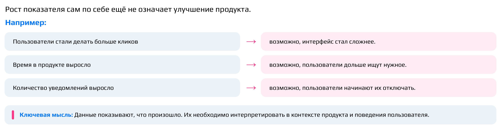

**Важный вывод:** метрика — это сигнал. Данные показывают, *что* произошло, но интерпретировать их нужно в контексте продукта и поведения пользователя.

Похожая ловушка — средний чек. Он может вырасти не потому, что люди стали больше платить, а потому, что ушли пользователи, которые платили мало. Показатель улучшился за счёт оттока. Тот же подвох есть и в других метриках: число заходов в приложение, звонков или сообщений; много посетителей на сайте при том, что заказов не прибавилось или стало меньше; переходы к оплате, которые не заканчиваются оплатой; растущее число поисковых запросов, которое может значить, что пользователь просто не находит нужное.

::: {.qa title="Вопросы из зала"}
**Как проверить, что рост кликов настоящий, а не фиктивный?** В логах есть информация о каждом клике, и по ней можно многое понять. Например, посмотреть на время между кликами: если между ними миллисекунды, клики неосознанные, скажем, потому что лагает телефон. У осознанных кликов между ними нормальный интервал. Ещё один способ из опыта работы с рекламной платформой: смотреть, в какую часть баннера пришёлся клик. Нормальный пользователь вряд ли нажмёт точно в крайний угол или в последний пиксель, он кликает в более естественную зону. По такому признаку можно распознавать ботов. Вариантов проверки много.
:::

### От данных к решению

Посмотрим, как рассуждает аналитик на конкретном случае. В мессенджере количество отправленных сообщений выросло на 20 %. Хорошая ли это новость? Пока мы этого не знаем.

Сначала раскладываем метрику: за счёт чего произошёл рост? Возможно, стало больше пользователей, которые отправляют сообщения. А возможно, пользователей столько же, но каждый стал писать больше. Это две очень разные истории. Затем задаём уточняющие вопросы:

- какие группы пользователей дали рост;
- на каких платформах он произошёл;
- какие типы сообщений выросли;
- были ли продуктовые изменения;
- могли ли повлиять внешние факторы.

Причин у такого роста может быть множество. Появилась новая функция, например отправка стикеров, а стикеры тоже считаются сообщениями. Выросло число пользователей. В каком-то регионе что-то случилось, и люди стали больше переписываться на фоне тревоги. Пошёл наплыв спама и мошенников: взломанные аккаунты, «мёртвые» аккаунты с автоматическими рассылками, боты. Ввели ограничение на число символов, и длинные сообщения стали дробиться. Сработала сезонность или другие внешние факторы, не связанные с продуктом. Наконец, сообщения могут дублироваться из-за технической ошибки. Такое действительно бывает: в MAX дублирование находили в логах десктопной версии.

Только ответив на эти вопросы, можно перейти от наблюдения «+20 %» к выводу и рекомендации. Цепочка рассуждения аналитика выглядит так:

**Наблюдение → Вопросы → Анализ → Вывод → Рекомендация.**

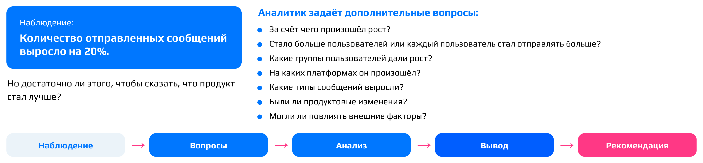

[^n9a]: Примечание составителя: подробно North Star метрика разбирается в следующих темах курса; здесь достаточно понимать её как единственную главную метрику продукта, в которую целится вся команда.

## Что производит аналитик и чем он работает

*Таймкод: 02:08:14 · слайды 44–50*

### Что считать результатом работы

Разберём практический вопрос: что аналитик в итоге отдаёт команде? За день он может написать несколько SQL-запросов, питоновский код, построить десяток графиков. Но сами по себе всё это не конечный результат.

**SQL** (язык запросов к базам данных) нужен, чтобы получить данные, Python — чтобы их обработать и проанализировать. Оба инструмента нужны самому аналитику. SQL-запрос мы никогда не отдаём продакту: большинство продактов умеют писать код и понимают, как он работает, но им это просто не нужно. График — только форма представления, визуализация.

Результатом работы, или **артефактами аналитика**, называют то, что команда действительно может использовать:

- **аналитическое исследование** — законченная работа, которая отвечает на продуктовый вопрос и заканчивается выводами (как оно устроено, разберём ниже);
- система показателей;
- дашборд, но с выводами и ответами на вопросы, а не просто набор графиков;
- оценка продуктового изменения;
- результаты эксперимента;
- выводы и рекомендации;
- сценарии принятия решения.

Если подняться на уровень выше, главный результат аналитика — это **новое знание, которое помогает принимать решения**.

При этом не стоит считать, что каждая работа аналитика обязана подтолкнуть команду к какому-то новому решению. Решить, что «всё идёт нормально, ничего менять не надо», — тоже решение, и иногда нам достаточно в этом удостовериться. Не каждая работа приносит и инсайт. Бывает, что мы надеемся подтвердить гипотезу, проделываем огромную работу, а в итоге ничего значимого не видим. Это тоже результат: из него следует вывод, что поведение пользователей не соответствует нашей гипотезе.

**Важно:** хороший вопрос для самопроверки — узнала ли команда после моей работы о продукте что-то нужное, новое, важное? Если нет, скорее всего, это была работа в стол.

### Как выглядит хорошее исследование

Хорошее аналитическое исследование отвечает как минимум на пять вопросов:

1. **Вопрос.** Что мы хотим понять?
2. **Данные.** На основании чего мы можем ответить? Сюда же относится вопрос, хватает ли нам данных.
3. **Анализ.** Что показывают данные?
4. **Вывод.** Что это означает для продукта?
5. **Рекомендация.** Что мы предлагаем делать дальше?

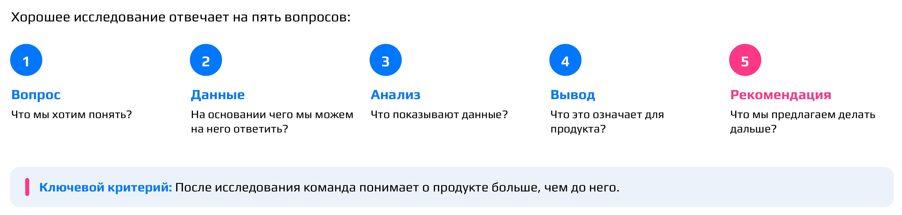

Второй пункт часто оказывается решающим: иногда исследование на нём и заканчивается. Возьмём мессенджер MAX. Когда вы пишете «люблю», мессенджер предлагает стикер с котиком и сердечком. Нам нужно было понять, помогают ли такие стикер-подсказки «драйвить» сообщения, то есть увеличивают ли они число сообщений на пользователя. Но ключевых логов не хватало. Задачу на их логирование переприоритизировали, и на тот момент разработка её не сделала. В прямом виде провести исследование было нельзя, а ответ был очень нужен, поэтому считали косвенными методами.

Если данных недостаточно, действуем по порядку. Сначала выясняем, можно ли их откуда-то достать. Если нельзя — можно ли посчитать результат косвенно, но так, чтобы он оставался репрезентативным. Если и это невозможно, вопрос ставится ребром и обсуждается с заказчиком: «Сейчас я не могу отдать исследование, потому что нет репрезентативных данных».

Последние три вопроса легко смешать, поэтому **важно различать анализ, вывод и рекомендацию**. Пример:

- *анализ:* на одной из платформ показатель снизился на 12%;
- *вывод:* общее снижение практически полностью объясняется изменением поведения аудитории этой платформы;
- *рекомендация:* в первую очередь исследовать причины изменений на этой платформе.

По тому, до какого из этих шагов доходит аналитик, можно судить о его уровне, или, если угодно, об уровне осознанности. Уровни обычно называют так: **джун, мидл, сеньор**.

- **Джун** (младший специалист) считает цифры и отдаёт их. Обычно большего от него и не ждут, но хорошо, если вы будете делать больше.
- **Мидл** (специалист среднего уровня) отдаёт цифры вместе с объяснением: метрика выросла на столько-то благодаря тому-то.
- **Сеньор** (старший, ведущий специалист) обязательно отвечает и на вопрос «что с этим делать дальше»: развивая эту метрику, мы сможем получить то-то.

**Ключевой критерий:** после исследования команда понимает о продукте больше, чем до него.

### Инструменты аналитика

Базовый набор инструментов, с которыми аналитик работает каждый день, раскладывается по задачам:

- **получение данных** — SQL;
- **анализ** — Python и электронные таблицы (Excel);
- **визуализация** — **BI-системы**, то есть инструменты бизнес-аналитики, в которых строят графики и дашборды поверх данных;
- **эксперименты** — экспериментальные платформы и статистические инструменты; эксперимент можно провести и с помощью SQL и Python;
- **коммуникация** — презентации, документация, таск-трекеры вроде Jira.

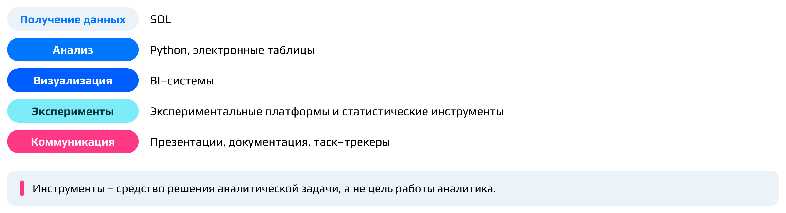

**Акцент лектора:** инструмент выбирается после аналитического вопроса, а не наоборот. Мы не ищем задачу, чтобы применить Python: сначала понимаем задачу, потом решаем, какой инструмент для неё нужен.

### Данные → знание → решение

Соберём всё в одну схему. У продукта появляются данные, мы их анализируем, из анализа появляется знание о пользователе или продукте. На основании этого знания команда принимает решение. Решение приводит к изменению продукта (или не приводит), пользователи взаимодействуют с изменённым продуктом, и появляются новые данные:

**Данные → Анализ → Знание → Решение → Изменение продукта → Новые данные.**

Цикл замкнут: новые данные снова идут в анализ, и продукт с каждым оборотом совершенствуется. Этот **цикл данные → знание → решение** и есть место продуктовой аналитики в работе команды. **Важный вывод:** продуктовая аналитика — это не производство отчётов, а часть механизма совершенствования продукта.

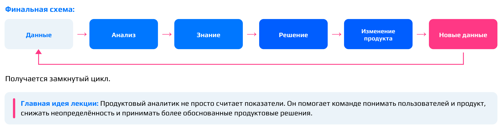

Подведём итоги темы. Главная задача продуктового аналитика — снижать неопределённость. К нам приходят с вопросом, потому что не знают ответа, и отдать в ответ просто цифры плохо: нужно дать ответ и предложение. Решения при этом принимает команда, а не аналитик. Аналитик работает на пересечении пользователя, продукта и данных, и если убрать что-то одно, работа не сложится. Его задачи меняются вместе со стадией жизненного цикла продукта (от Discovery до Sunset), а внутри отдельной фичи — со стадией её реализации, и эта смена всё время повторяется по кругу. Цифра без контекста почти никогда не бывает продуктовым выводом. Задачи «просто выгрузить цифры», конечно, встречаются: например, для отчётности нужно число подписчиков десяти самых популярных каналов. Такие разовые запросы называют **ad hoc**: мы помогаем их решать, но основная работа аналитика не в них. Рост показателя не обязательно означает, что продукт стал лучше: за ним нужна интерпретация. Наконец, результат работы аналитика — не запрос, не Python-код и не график, а новое знание о продукте или пользователе, которое помогает принять решение.

Пока слова «пользователь», «потребность», «проблема», «гипотеза» звучали довольно абстрактно, и это нормально: в следующей теме мы разберём, как исследовать путь пользователя, строить CJM, отделять проблему от решения и превращать найденные проблемы в проверяемые продуктовые гипотезы.

## Профессия продуктового аналитика: ответы на вопросы

*Таймкод: 02:22:30 · слайды 45, 47*

### Инструменты и код

Нужно ли аналитику писать код? Зависит от того, какой это аналитик. В MAX, например, есть отдельная команда исследователей: они проводят опросы и полевые исследования, разговаривают с пользователями, разбирают жалобы и отзывы. Им код может и не понадобиться. Продуктовому аналитику без кода сегодня не обойтись: данные лежат в логах и базах данных, и чтобы достать их оттуда, нужен запрос.

Поэтому большую часть времени стандартный аналитик работает с SQL. Инструменты меняются от этапа к этапу. Данные собирают SQL-запросом. Если нужен прогноз, его делают в SQL, Excel или Python, а при хороших данных скорее в Python. Результат визуализируют в BI-системе (в MAX это DataLens, в других компаниях Tableau, Redash, Superset) или в презентации. В конце решения описывают в базе знаний. Не стоит недооценивать и Excel: в нём удобно крутить уже агрегированные данные. В больших компаниях данные сначала сворачивают SQL-запросом, выгружают табличкой и дальше работают с ней в Excel.

Задачи команда получает на планированиях раз в одну-две недели. Реалистичный максимум на неделю — около трёх задач или пяти мелких, плюс запас на ad hoc.

**Важно:** начинающему аналитику нужны SQL, базовая математическая статистика и теория вероятностей. Без матстатистики, Excel и Python попасть в продуктовые аналитики ещё можно, без SQL нельзя. Матстатистика кажется предметом «для собеседований», но в исследованиях ею пользуешься почти каждый день.

### Как оформлять результаты исследования

Вордовский файл — скорее нет. Чаще результаты кладут в базу знаний, например в Confluence: заводят страницу «Исследование …» и собирают на ней основные выводы, графики и цифры. Часть результатов может жить в дашборде, но выводы исследования всё равно нужно записать словами.

Если исследование большое и его показывают руководству или всей компании, его упаковывают в презентацию: графики, главные выводы, инсайты, предложения по улучшению. Форма зависит от того, для кого результат. При любой форме результатом остаётся новое знание, которое помогает принять решение.

### Карьера и треки роста

Профессия постоянно развивается, но многое зависит от самого человека. Можно годами перекладывать данные из таблички в табличку на одной должности. А можно брать всё более сложные задачи и осваивать под них новые подходы: читать литературу, проходить курсы (например, по математической статистике для сложных прогнозов или заново по машинному обучению). Аналитика — место, где можно расти, если есть желание.

Перейти из одного вида аналитики в другой тоже можно. Типичный пример пути: разметка данных для голосового ассистента Салют ещё в студенчестве, затем аналитик-разработчик в GlowByte (сложные SQL-запросы, ETL-процессы, документация), затем data-аналитик в Сбере, где параллельно с анализом данных пришлось строить платформу A/B-тестов и прокачивать системное и продуктовое мышление, и наконец классическая продуктовая аналитика в MAX. Главное — понять, каких компетенций не хватает, и закрыть их. Кому-то на это нужен месяц, кому-то годы. Один из навыков, который стоит развить обязательно, — умение отстаивать позицию и доносить выводы до заказчиков.

Карьерная лестница выглядит так: джун → мидл → сеньор → ведущий. Дальше путь раздваивается:

- **экспертный трек** — становишься технически очень сильным специалистом и источником знаний для других. Подходит тем, кто не слишком любит работать с людьми. Но и здесь нужно уметь объяснять свои идеи: кандидата на позицию сеньора вполне могут не взять именно потому, что он не может донести свою мысль;
- **менеджерский трек** — движение в сторону продакт-менеджмента. От классической аналитики отходишь, но знаний столько, что по данным, которые приносят аналитики, умеешь хорошо принимать решения.

После ведущего возможны разные роли. **CPO** (Chief Product Officer, директор по продукту) стоит над продакт-менеджерами и имеет решающий голос в продуктовых решениях. Реже аналитики становятся CDO (Chief Data Officer, руководитель направления данных), и приходят туда скорее из data-аналитиков. Ещё одна роль — head of product analytics, руководитель всей продуктовой аналитики. Выбор зависит от компетенций человека и от его soft skills.

Чем выше грейд, тем важнее знание предметной области и умение придумывать нестандартные решения. От джунов и мидлов ждут уверенной работы с классическими методами, от сеньора и ведущего — способности справиться там, где классика не работает. Специалисту, который 15 лет проработал, скажем, в страховании, перейти сеньором в другую область непросто: от опытного человека ждут, что он быстро войдёт в новую тему.

### Как учиться и где брать практику

Войти в профессию без профильного образования реально: продуктовыми аналитиками работают, например, экономисты, прошедшие айтишную магистратуру или много курсов. Кроме образования смотрят на прикладной опыт — стажировки, релевантную работу и **пет-проекты**, то есть собственные учебные проекты, где вы сами попробовали решить аналитическую задачу. Строчка «прошёл курс на Stepik» без практики мало что говорит.

Один курс не сделает из вас готового аналитика: на SQL в курсе отведено три часа теории и три часа семинара, а этого мало, чтобы набить руку. Вне бигтеха устроиться после курса вполне реально. Хороший вход — стажировка: люди совсем не из сферы через четыре месяца уже решают джуновские задачи. Для бигтеха придётся самостоятельно подтянуть матстатистику, теорию вероятностей, SQL и Python.

Для самостоятельной практики есть бесплатные тренажёры по SQL и Python, выглядят они старомодно, но задач там много. Задачи на A/B-тесты можно найти на Kaggle, но без математической статистики A/B-тесты не освоить. Для статистики подойдёт бесплатный курс Карпова на Stepik. Полезно ходить на митапы, в том числе онлайн (Матемаркетинг, конференции Яндекса), и слушать, как задачи решали в других компаниях. В MAX аналитики раз примерно в две недели собираются вместе и делятся нестандартными подходами.

### ИИ и ML в работе аналитика

В VK есть внутренние ИИ-агенты, данные из которых наружу не уходят. Они решают джуновские задачи вроде «сколько пользователей обновились до новой версии iOS». Базовые расчёты удобно отдавать агенту, пока сам собираешь презентацию. А генерировать гипотезы и метрики лучше самому. В продуктовой аналитике слишком много хитросплетений и причинно-следственных связей: чтобы модель нашла инсайт, в неё пришлось бы заложить слишком много контекста. В разработке ИИ помогает заметно сильнее. При этом джуны в командах есть, и работают они хорошо.

**Важный вывод:** инструменты вроде агента, который по кнопке строит ML-модель и выдаёт код, упрощают работу, но не снимают ответственности. Нужно точно знать, что вы хотите получить и как проверите результат, и понимать, как модель работает под капотом. Внедрить результат модели, не умея объяснить, что она делает и как проверили, что она не выдала ерунду, — очень плохой подход.

::: {.qa title="Вопросы из зала"}
**Как косвенно оценили эффект стикер-подсказок, если нужных логов не было?** Текст сообщений мы не видим, но видим их длину. Посчитали, как часто люди отправляют короткие сообщения, которые в принципе можно заменить стикером, и как часто уже пользуются стикерами (часть людей их не использует вовсе, и это нормально). Так оценили, какую долю сообщений могут заменить стикеры. Кроме того, прошлое исследование показало, что стикеры не вытесняют текст, а оживляют переписку: после стикера человек обычно дописывает сообщение. Получилась сложная цепочка допущений, и без прямых данных такая оценка остаётся очень приблизительной.

**Часто ли приходится придумывать собственные методики?** Довольно часто. Например, прогноз DAU в MAX: данных за историю продукта мало, они нестабильны и сильно зависят от сезона. Три математические модели не сработали, пришлось делить историю продукта на периоды роста и спада и подбирать эвристики.

**Отвечает ли аналитик за корректность опросов?** Опросы проводят исследователи. Но если их результаты расходятся с тем, что видно в данных, аналитик выясняет, на каком сегменте и на какой выборке проводили опрос. Цель — не подогнать цифры, а проверить результат на том же сегменте или понять, что опрос проведён некачественно. В собственных исследованиях по части пользователей нужно следить, чтобы в выборку попала нужная аудитория, чтобы она была репрезентативной (отражала действительность) и чтобы в неё не попали выбросы — пользователи с аномально большим или малым числом действий.
:::

## Главное из лекции {.unnumbered}

::: keypoints
1. **Цифровой продукт** — это решение задачи пользователя с помощью технологий, а не набор функций. Ценность возникает по цепочке «потребность → решение → пользовательская ценность → ценность для бизнеса», и продукт устойчив, только если работают оба последних звена.
2. Продукт проходит **жизненный цикл** Discovery → MVP → Growth → Maturity → Sunset, причём не обязательно линейно. На каждой стадии у команды свои главные вопросы и свои данные, поэтому меняется и работа аналитика: от исследований рынка и интервью на Discovery до оценки последствий закрытия на Sunset.
3. Хорошая аналитика — не максимум расчётов, а анализ, отвечающий на главную неопределённость продукта прямо сейчас. Стартапу на MVP с 500 пользователями не нужен дашборд из 70 метрик: сначала надо понять, нужен ли продукт кому-нибудь.
4. Аналитики различаются объектом анализа: бизнес-процессы (BA), системы (SA), показатели (BI), данные (DA), продукт и пользователь (PA). Границы между ролями размыты, поэтому важнее содержание работы, чем название должности.
5. Главная задача продуктового аналитика — **снижать неопределённость** в решениях команды: продуктовый вопрос → данные → анализ → знание → решение. Решение принимает не аналитик, а продакт или руководство, но аналитик отвечает за корректность того, на чём оно основано.
6. Работа начинается не с SQL-запроса, а с понимания, какое решение примут по его результату. Голая цифра («1,2 млн пользователей») почти никогда не бывает продуктовым выводом: нужны база, период, сегменты и объяснение.
7. Аналитик нужен на всех этапах пути фичи, а не только после запуска: без заранее описанного логирования хороший анализ после релиза может быть физически невозможен.
8. Рост метрики не равен улучшению продукта: больше кликов, больше time spent или больше сообщений могут означать ухудшение опыта. Метрика — это сигнал, который нужно интерпретировать в контексте продукта.
9. Результат работы аналитика — не запрос, код или график, а **новое знание**, которое помогает принять решение. Хорошее исследование проходит путь «вопрос → данные → анализ → вывод → рекомендация», и в этом цикле «данные → знание → решение» продукт улучшается с каждым оборотом.
:::

## Что подчеркнул лектор {.unnumbered}

::: emphasis
- **Материал не откладывать.** Тесты строятся только на лекциях: достаточно слушать их по ходу курса и освежать перед тестом.
- **К продакту идут с инсайтами, а не с таблицей.** Фраза «вот тебе цифры, делай что хочешь» — не работа продуктового аналитика.
- **До расчёта выясните, какое решение примут по вашему ответу.** За «посчитай пользователей» часто стоит вопрос «инвестировать ли дальше в функцию».
- **Две самые частые ошибки:** неверные данные (ошибка в запросе или визуализации) и вывод о причинности по интуиции. Как только появилась уверенность «100% дело в этом», надо идти проверять.
- **Звать аналитика только после релиза — слишком поздно.** Логирование описывают до запуска.
- **Метрики легко «хакнуть».** Прежде чем радоваться росту показателя, спросите, что он означает для пользователя.
- **На собеседовании** спрашивайте, какой объект вы будете анализировать и кто принимает решения по вашей работе, а не только название позиции.
- **Без SQL продуктовым аналитиком не стать.** От джуна ещё ждут базовой матстатистики и теорвера. Курс даёт введение, а практику (стажировки, пет-проекты, тренажёры) нужно добирать самим.
- **Инструмент выбирают после вопроса,** а не наоборот: задачу не ищут ради того, чтобы применить Python.
- **Работая с ИИ-агентами и ML-моделями,** нужно понимать, что происходит «под капотом», и уметь проверить результат.
- **Хорошая аналитика — не максимум расчётов.** Она отвечает на главную неопределённость продукта на текущей стадии.
:::

## Стоит посмотреть в видео {.unnumbered}

::: watch
- **≈ 00:10–00:18** — жизненный цикл продукта со слайдами-таблицами 21–23: вопросы команды и роль аналитики на каждой стадии.
- **≈ 00:22–00:31** — примеры работы разных аналитиков (архив чатов, алертинг) и таблица ролей на слайде 27.
- **≈ 00:39–00:44** и **≈ 00:46–00:50** — интерактив в чате: какие вопросы задать продакту и как переформулировать слишком широкие задачи. Ответы слушателей были только в чате и в запись не попали.
- **≈ 01:05–01:24** — длинный поток ответов на вопросы из чата (ТЗ, структура аналитики в MAX, ошибки аналитиков). Он местами скомкан, сами вопросы в записи не слышны.
- **≈ 02:04–02:10** — упражнения в чате: какой рост метрики может означать ухудшение и почему могло вырасти число сообщений.
- **≈ 02:56–02:59** — разбор ML-прототипа слушателя: обсуждалась картинка на экране, которая в текст не попала.
:::

## Глоссарий {.unnumbered}

| Термин | Коротко |
|:----------|:------------------------------|
| **Рубежный контроль** | Тест на 15–20 вопросов по блоку материала, до 15 баллов |
| **Промежуточный тест** | Короткий тест после каждой лекции, до 5 баллов |
| **Прожарка резюме** | Выборочный разбор резюме слушателей в конце курса |
| **Цифровой продукт** | Решение, которое помогает пользователю достигать целей с помощью цифровых технологий |
| **Продукт** | То, что долго существует, развивается и создаёт ценность для пользователя |
| **Проект** | Ограниченная во времени работа с определённой целью и результатом |
| **Фича** | Отдельная функциональность продукта, решающая конкретную задачу пользователя |
| **Пользовательская ценность** | Польза, которую человек получает, решая свою задачу с помощью продукта |
| **Ценность для бизнеса** | То, что продукт даёт компании, чаще всего деньги |
| **Жизненный цикл продукта** | Модель стадий Discovery → MVP → Growth → Maturity → Sunset |
| **Discovery** | Стадия поиска и проверки пользовательской проблемы и возможного решения |
| **MVP** | Минимально жизнеспособный продукт: проверка ценности решения на реальных пользователях |
| **Growth** | Стадия масштабирования подтверждённой ценности |
| **Maturity** | Стадия зрелости: удержание, эффективность, локальные улучшения |
| **Sunset** | Стадия трансформации или вывода продукта из эксплуатации |
| **Драйверы роста** | Факторы, которые сильнее всего влияют на рост продукта |
| **Глубинные интервью** | Качественное исследование: разговор с пользователем по сценарию без шаблонных ответов |
| **CustDev** | Customer development: работа с потенциальными пользователями и проверка проблемы, часть Discovery |
| **Business Analyst** (BA) | Аналитик бизнес-процессов и требований |
| **System Analyst** (SA) | Аналитик систем: требования и взаимодействие компонентов |
| **BI Analyst** | Аналитик показателей: мониторинг, отчётность, дашборды |
| **Data Analyst** (DA) | Аналитик данных: закономерности, причины изменений |
| **Product Analyst** (PA) | Аналитик продукта и поведения пользователей |
| **Дашборд** | Набор графиков изменения показателей на одном экране |
| **Алертинг** | Автоматические сообщения о статистике или выходе метрики за допустимые границы |
| **CJM** | Customer Journey Map, карта пути пользователя |
| **Неопределённость** | Нехватка знания, в которой команда принимает решения; её снижает аналитик |
| **DAU** | Daily active users, число активных пользователей за день |
| **Продуктовое исследование** | Анализ, который идёт от описания к объяснению и решению |
| **Спецификация** | Документ с продуктовыми и техническими требованиями к фиче и её метриками |
| **Зоны ответственности** | Области работы аналитика, которые складываются в цепочку |
| **Эпик** | Крупный блок работы, который нужно разбить на задачи |
| **Преданалитика** | Анализ фичи до запуска: потребность, ожидаемые метрики, бенчмарки |
| **Постаналитика** | Анализ фичи после запуска: прирост метрик, мониторинг |
| **Логирование** | Описание того, какие данные о событиях должен записывать продукт |
| **A/B-тест** | Эксперимент: разные версии продукта одновременно на разных группах пользователей |
| **Гипотеза** | Предположение о причине или решении, которое нужно проверить |
| **Канареечный релиз** | Постепенная раскатка фичи (1 %, 5 %, …) с мониторингом на каждом шаге |
| **Дерево метрик** | Структура причинно-следственных связей между метриками продукта |
| **ТЗ на исследование** | Постановка задачи аналитику: проблема, влияние результата, образ результата |
| **Груминг** | Совместная с руководителем декомпозиция широкой задачи на блоки |
| **DWH** | Data Warehouse, хранилище данных, и команда, которая его поддерживает |
| **Инсайт** | Новое понимание или идея о продукте и пользователях, рождённые в исследовании |
| **Продуктовая команда** | Специалисты разных профессий, которые вместе развивают продукт |
| **Product Manager** | Отвечает за направление развития продукта и приоритеты |
| **UX Researcher** | Изучает пользователей, их поведение и проблемы |
| **Путь фичи** | Проблема → исследование → гипотеза → приоритизация → разработка → запуск → оценка |
| **Логи** | Записи о действиях пользователей в продукте |
| **B2B** | Продукты для бизнеса, а не для частных пользователей |
| **NPS** | Net Promoter Score, готовность пользователей рекомендовать продукт |
| **Продуктовое мышление** | Способность смотреть на данные в контексте продукта и пользователя |
| **Time spent** | Время, которое пользователь проводит в продукте |
| **North Star** | Главная метрика продукта, на которую ориентируется команда |
| **Артефакты аналитика** | То, что команда может использовать: исследования, оценки, выводы, рекомендации |
| **Аналитическое исследование** | Законченная работа: вопрос → данные → анализ → вывод → рекомендация |
| **SQL** | Язык запросов к базам данных, главный инструмент получения данных |
| **BI-системы** | Инструменты для графиков и дашбордов поверх данных (DataLens, Tableau, Superset) |
| **Джун, мидл, сеньор** | Уровни аналитика: цифры → объяснение → рекомендация |
| **Цикл данные → знание → решение** | Замкнутый цикл, в котором продукт совершенствуется |
| **Ad hoc** | Разовый запрос «просто выгрузить цифры» |
| **Экспертный / менеджерский трек** | Два пути роста после ведущего аналитика |
| **CPO** | Chief Product Officer, директор по продукту |
| **Пет-проект** | Собственный учебный проект с решением аналитической задачи |
