::: {.abstract title="О чём лекция"}
Это завершение лекции «CJM, user stories, гипотезы» и первый семинар курса. Первый час отвечает на два вопроса, которые встают после того, как гипотезы придуманы: какие из них проверять в первую очередь (скоринг ICE и RICE и его ограничения) и как проверять — каким методом снимать ту неопределённость, которая мешает принять решение (интервью, прототипы, usability-тесты, фейковая дверь, «волшебник страны Оз», A/B-тест). Затем показан весь путь продуктовой гипотезы — от наблюдения до решения — и мостик к следующей лекции о метриках.

Остальные два часа — практика на одном сквозном кейсе: сервис доставки еды, пользователь, который хочет быстро заказать ужин после работы. На нём по шагам пройдена вся цепочка: пользователь и его потребность → job story → CJM с барьерами на каждом этапе → наблюдение, интерпретация и причинная гипотеза → возможность и выбор решения → гипотеза в формате «если … то … потому что» → user story с критериями приёмки → план проверки. Понятия CJM, Persona, JTBD, user story вводились в первой части лекции; здесь они кратко определены заново по её слайдам, чтобы текст читался без неё.

Формул почти нет, специальной подготовки не требуется. Вопросы из чата, если ответ на них содержательный, вплетены в разделы и выделены серыми блоками — их можно пропустить при беглом чтении. Схемы и таблицы со слайдов приведены прямо в тексте. Сноски с пометкой «Прим. составителя» — пояснения, которых не было в лекции.
:::

## Приоритизация гипотез: ICE и RICE

*Таймкод: 00:00:02 · слайды —*

### Зачем выбирать очерёдность

У каждой фичи есть этап исследования и этап формирования гипотез. Допустим, команда научилась генерировать хорошие гипотезы о том, как решить пользовательскую проблему, и набрала их целую кучу. Реализовать и проверить все сразу нельзя: разработка требует денег, времени и снова денег. Поэтому появляется отдельная задача — выбрать, в каком порядке гипотезы проверять. Это и есть **приоритизация гипотез**.

Представьте бэклог — список имеющихся задач — на 80–100 идей. Ограничены не только разработчики и деньги. Ограничено внимание пользователей: у них есть лишь какое-то время, чтобы подождать, пока вы решите их проблему. Ограничены трафик, на котором можно ставить эксперименты, и исследовательская ёмкость команды. Наконец, одновременные изменения мешают интерпретировать результаты: если запустить несколько экспериментов параллельно, их эффекты смешаются, и выделить вклад каждого не получится. Гипотез почти всегда больше, чем ресурсов.

Поэтому приоритизация — не поиск самой красивой идеи. Её вопрос звучит так: *какая гипотеза сейчас даёт наилучшее соотношение ожидаемой ценности, ресурсов и неопределённости?* Ответ бывает разным. Иногда дешёвая проверка слабой, но критичной неопределённости важнее разработки потенциально большой фичи. А иногда возможность настолько крупная и хорошо подтверждённая, что есть смысл вложить больше времени в разработку. Начинать всегда с самого лёгкого и дешёвого не нужно, но иногда это работает.

**Важный вывод:** приоритизация — это управление стоимостью ошибки и стоимостью получения знания.

Чтобы упорядочить гипотезы, им ставят оценки по нескольким критериям и сводят их в один балл. Такая процедура называется **скоринг**, а итоговый балл — скор. Любой скоринг, как и любое ранжирование, — способ структурировать разговор в команде, а не математически вычислить ответ.

### Четыре компонента

Чаще всего при приоритизации учитывают четыре компонента:

- **Reach** (охват) — сколько пользователей или событий затронет изменение за заданный период;
- **Impact** (импакт) — насколько сильным ожидается эффект;
- **Confidence** (конфиденс) — насколько мы уверены в исходных предположениях и оценках;
- **Effort** (эффорт) — сколько ресурсов потребуется, то есть сколько это будет стоить.

Иногда вместо Effort используют **Ease** — насколько легко и быстро гипотезу проверить и реализовать. Effort растёт с ценой, Ease, наоборот, тем больше, чем проще задача.

**Важно:** Reach и Impact не путают. Большой охват не означает большого эффекта: изменение может затронуть всех пользователей и почти не поменять их поведение. И наоборот, узкий сценарий может дать огромный эффект для небольшого, но стратегически важного сегмента. Например, есть совсем небольшая группа пользователей, которые постоянно платят. Изменение затронет немногих, но эти люди настолько важны, что его приоритизируют и поднимают наверх.

Confidence полезен тем, что заставляет спросить: на чём основана наша оценка — на данных исследований и прошлых экспериментов или только на интуиции? Бывает, что гипотезу предлагают интуитивно. Если она совсем ни на что не опирается, а другие опираются, её поставят ниже.

### Реальность шире четырёх букв

Кроме этих четырёх компонентов есть юридические требования, стратегические обязательства, зависимости, риск для бренда, технический долг. Возьмём случай из MAX. Команда хотела проверить гипотезу, и один из аналитиков предложил посмотреть переписки пользователей: как часто в них встречаются определённые слова, чтобы подогнать под это стикеры. Но таких данных в MAX нет: переписки — чувствительные, личные данные, и представление, будто мессенджер читает переписки, — большое заблуждение. Довод «нам всего один раз» ничего не меняет: это юридический риск, на который никто не пойдёт. Гипотезу отбросили сразу. Даже если Reach, Impact, Confidence и Effort у неё прекрасно сходятся, проверить её невозможно ни с юридической, ни со стратегической точки зрения.

**Акцент лектора:** фреймворк полезен, если делает предположения явными, и вреден, если команда считает, что итоговый скор отменяет продуктовый контекст. Контекст и риски учитываются всегда.

### ICE

Первый, самый простой вариант скоринга — **ICE**: гипотеза оценивается по Impact, Confidence и Ease (в другом варианте вместо Ease берут Effort):

$$\text{ICE} = \text{Impact} \times \text{Confidence} \times \text{Ease}.$$

Чем сильнее ожидаемый эффект, чем увереннее оценка и чем легче проверка, тем выше скор.[^n1a]

Плюс ICE — скорость: за короткое время можно относительно сравнить большое число идей. Минус — субъективность. Если одна команда ставит Impact по шкале от 1 до 10, а другая понимает «восемь» совсем иначе, числа создают ложную точность. Поэтому все, кто смотрит на скоринг, должны понимать, почему поставлен именно такой скор, и перед скорингом команда договаривается о шкалах и основаниях оценок. ICE хорош как структурированный разговор, но не как автоматический генератор роадмапа — карты пути команды по проверке гипотез.

### RICE

Второй метод — **RICE**. К ICE добавляется Reach, а произведение делится на Effort (здесь уже именно Effort, а не Ease):

$$\text{RICE} = \frac{\text{Reach} \times \text{Impact} \times \text{Confidence}}{\text{Effort}}.$$

Охват, сила эффекта и уверенность повышают приоритет, а стоимость его снижает. Ключевая особенность RICE — охват за конкретный период и обычно в реальных единицах: пользователях, сессиях, транзакциях. Частая ошибка — считать Reach одной гипотезы за неделю, а другой за год и потом сравнивать числа. Охват всех гипотез выражают в одинаковых единицах и за одинаковый период и только потом скорят.

RICE особенно полезен, когда идеи сильно различаются масштабом аудитории. Улучшение основного онбординга затрагивает почти всех новых пользователей, а изменение редкой настройки — лишь небольшой сегмент. Но от плохих входных данных формула не спасает: если Impact и Confidence придуманы, результат выглядит математически строгим, оставаясь субъективным.

### Что выбрать и чего не видит формула

ICE удобен для быстрого относительного сравнения и для случаев, когда Reach трудно оценить: охват затрагиваемого функционала неизвестен. RICE отдельно учитывает масштаб аудитории, поэтому его берут, когда этот масштаб известен.

У обеих моделей общие слабости: они зависят от качества оценок, чувствительны к шкалам и не учитывают весь контекст. Регуляторное требование может получить низкий скор, но быть обязательным — как в примере с переписками. Стратегическая инфраструктура может не давать мгновенного пользовательского импакта, но быть необходимой для будущих решений. Ни одна формула не ответит, нужно ли делать обязательную регуляторную задачу и допустим ли риск для доверия пользователей ради роста.

Поэтому скор — лишь один из входов в решение. Если команда говорит «у задачи 83 балла, значит, обязаны делать», она превращает вспомогательную модель в псевдообъективную истину. Спорить о правильной математике не нужно. Важнее единообразие шкал, основания оценок («почему вот это — 1, а вот это — 8») и прозрачность: всем должно быть понятно, почему одна инициатива получила более высокий скор. Подробно приоритизация разбирается в отдельной лекции.

### Гибкий скоринг

Более гибкий подход — **гибкий скоринг**: команда сама задаёт критерии и их веса под свой контекст. В критерии можно вынести пользовательскую ценность (user value), бизнес-ценность (business value), соответствие стратегии, а также Confidence, риск, Effort или Ease.

Набор критериев зависит от стадии продукта. Для зрелого продукта важны риски и эффективность. В большом бигтехе критично мнение пользователей: что о вас скажут после релиза, какой будет новостной фон. Опираться только на Confidence и Effort там нельзя — решение должно соответствовать стратегии и разумному будущему для пользователей. Для раннего продукта, стартапа, важнее скорость обучения и снятие критической неопределённости; какими-то ценностями можно поступиться, чтобы реализовать подход быстрее.

Чем больше критериев, тем легче построить сложную таблицу, которая маскирует субъективность. Добавить можно хоть сто критериев, но у каждого должно быть понятное определение, он должен влиять на решение, и его включение нужно обосновать. Хорошая таблица делает предположения явными: почему возможность ценна, на каких основаниях, что учли. Критерии, веса и оценки обязательно согласовывают с командой. Если вы вкладываете в вес один смысл, а коллега другой, ни гибкий, ни любой другой скоринг правильно работать не будет.

**Важный вывод:** скоринг отражает контекст решения, а не создаёт красивую математику; скор не равен истине. Он полезен тем, что структурирует обсуждение, заставляет назвать предположения и договориться о критериях, но решения за команду не принимает.

[^n1a]: Примечание составителя: способ объединения компонентов ICE в лекции не назван; произведение — распространённый вариант. Если вместо Ease используется Effort, его, как и в RICE, ставят в знаменатель.

## Скоринг помогает обсуждать, а не решать

*Таймкод: 00:16:38 · слайды —*

### 72 против 70: что на самом деле значит разница в баллах

Возьмём сервис доставки еды. Пользователь не понимает итоговую стоимость заказа, пока не дойдёт до корзины или до оплаты, и на этом шаге люди отваливаются. Какое решение поможет, пока неизвестно. Допустим, у команды есть десять гипотез, каждая из которых в принципе может снять проблему, и их нужно упорядочить: что проверять первым, что последним. Гипотезы оценили, например, с помощью гибкого скоринга, и две из них получили 72 и 70 баллов.

Значит ли это, что первая гипотеза объективно лучше и её нужно брать автоматически? Нет. Каждый балл в таблице выставлен человеком, и, оценивая отдельный критерий, мы могли чуть завысить или чуть занизить оценку. Погрешность субъективных оценок легко может оказаться больше, чем разница в два пункта. Правильное прочтение такого результата: модель показывает, что эти гипотезы выглядят **сопоставимо**. Дальше команда обсуждает, какие оценки в таблице самые неопределённые и какие стратегические факторы формула не учитывает.

Можно ли объяснить разницу сезонностью? В этом примере вряд ли. Мы не закладывали сезонность в таблицу, а критерии гибкого скоринга вроде пользовательской ценности описывают изменение глобально, а не его актуальность в данный момент. Сезонность имеет смысл учитывать для сезонных историй, например для осеннего предложения к началу учебного года. Для глобального изменения фичи она не подходит.

То же касается и больших чисел: 90 баллов против 70 не означают, что одна идея на сколько-то процентов лучше другой. Большая часть входных данных скоринга — **экспертные шкалы**, то есть оценки, которые участники дали «из головы».

### Что делать с почти равными гипотезами

С командой стоит заранее договориться, какую погрешность вы готовы принимать. Например, можно считать равноценными гипотезы, которые отличаются друг от друга примерно на пять баллов в любую сторону. Для таких гипотез решение принимается по дополнительным факторам: стратегическим соображениям и юридическим рискам. Принимает его команда вместе. Допустимо опереться и на интуицию: если две гипотезы оказались равноценными, но в одну из них команда не очень верит, разумно поставить выше вторую.

### Самый полезный результат скоринга

**Важный вывод:** самый полезный результат скоринга часто не первое место в таблице, а **расхождение оценок** между участниками. Пусть один участник ставит гипотезе Confidence 9, а другой 3. Это сигнал, что у команды разное понимание наблюдения: кто-то доверяет данным, на которых строилась оценка, а кто-то нет. Вместо спора о финальном балле полезнее разобрать, какие данные видит каждый и какого знания не хватает. Такое упражнение часто даёт больше, чем сам итоговый рейтинг.

::: {.qa title="Вопросы из зала"}
**Как часто продуктовый аналитик на практике работает с картами пути пользователя, job story и user story, скорингом? Обычно об этом рассказывают на курсах по дизайну.** Курс обзорный: его задача — показать, какие компетенции стоит прокачивать и в какую сторону копать дальше. О конкретных hard и soft skills продуктового аналитика поговорим на последних занятиях. Скоринг используют все, вплоть до разработчиков: везде, где нужно приоритизировать гипотезы или задачи и понять, что дешевле решить и с каким приоритетом. Какой именно скоринг принят, зависит от культуры компании. Ещё его применяют к задачам в Scrum и Agile, но эту тему курс не затрагивает. Карты пути пользователя и его истории[^n2a] сейчас строят в основном исследователи, а продуктовые аналитики — лишь в немногих компаниях. Но хороший продуктовый аналитик понимает, что фичи не возникают просто так, «потому что так решило руководство». Бывает и так: у руководства есть своя стратегия и «сильная рука». Но в большинстве случаев, даже когда речь идёт о метриках, нужно понимать, от чего отталкивался пользователь, принимая решение, и какого результата он хочет. В компании и даже в собственном стартапе во главе стоит пользователь с его «хотелками»: мы реализуем их, потому что в итоге на этом зарабатываем.
:::

[^n2a]: Примечание составителя: речь о CJM (карте пути пользователя), job story и user story. Эти инструменты подробно разбираются в семинарской части: job story — в разделе «Семинар: пользователь, потребность и job story», CJM — в разделе «Семинар: CJM доставки ужина», user story — в разделе «Семинар: user story, критерии приёмки и план проверки».

## Как проверить гипотезу: методы под вопрос

*Таймкод: 00:26:53 · слайды 7, 9, 10, 43*

Мы уже умеем формулировать предположения и выбирать, какие из них важнее. Остался последний большой шаг: понять, какие данные и наблюдения способны изменить наши решения и что вообще значит проверить гипотезу.

### Проверить — не значит доказать

**Проверка гипотезы** — это не доказательство того, что идея правильная. Мы получаем наблюдение и обновляем своё представление о мире. Исходов может быть несколько: результат поддерживает гипотезу, не поддерживает её, оказывается недостаточным или показывает, что исходное предположение нужно уточнить.

**Акцент лектора:** это очень важная смена мышления. Если команда идёт в эксперимент, чтобы *доказать*, что фича работает, она уже мотивирована и будет трактовать неоднозначные результаты в пользу своей идеи. Поэтому критерии нужно определить **заранее**: какой результат усилит нашу уверенность, какой её уменьшит, а при каком мы скажем «данных недостаточно».

### Пять интервью и смещённая выборка

Типичная ситуация. Команда очень хочет запустить функцию, проводит пять интервью, трое из пяти говорят: «Да, классно». Команда пишет в отчёте: «Гипотеза подтверждена». Что на самом деле проверили?

Во-первых, скорее всего, отношение к концепту, а не реальное поведение. То, что пользователь говорит, и то, что он делает, — разные данные: **attitudinal data** описывают, что человек думает, считает и чувствует, а **behavioral data** — что он фактически делает. Фраза «я обязательно воспользуюсь такой функцией» не равна использованию после запуска.

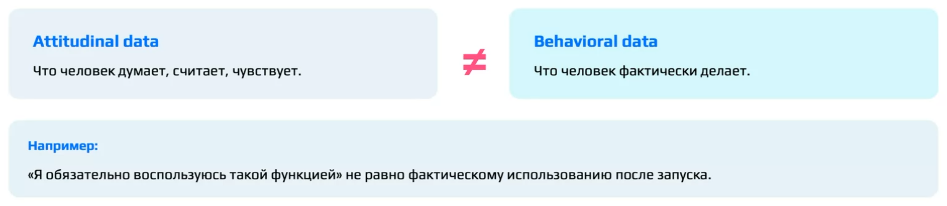

Во-вторых, выборка могла быть смещена. Проверять гипотезу нужно на равномерной выборке или на такой, которая точно **репрезентативна**, то есть её результаты будут показательны для всей интересующей нас аудитории. **Смещённая выборка** — это выборка, перекошенная в сторону какой-то группы. Если о мотоциклах спрашивать человека, который в них не разбирается и ими не интересуется, полезных ответов не будет. Но если, наоборот, опросить только любителей мотоциклов, а нужно среднее мнение, выборка сместится в сторону любителей. Другой пример: мы продаём мороженое и хотим выпустить «супер кокосовый» вкус, такой приторный, что, кроме кокоса, ничего не чувствуется. Берём для исследования пять человек, и четверо из них обожают кокос. Они, конечно, скажут «супер», но репрезентативного среднего ответа такая выборка не даёт.

**Акцент лектора:** математическая статистика очень полезна продуктовому аналитику, её совершенно точно стоит относить к hard skills и изучать.

В-третьих, то, что людям «понравилось», может вообще не касаться той неопределённости, которая мешает принять решение.

Честная формулировка результата звучала бы так: «В пяти интервью мы увидели повторяющийся сценарий X. Это повышает уверенность, что проблема существует в исследованном контексте, но не позволяет оценить её распространённость». Такая фраза описывает, как изменилось наше знание.

**Важный вывод:** сильный аналитик не обязан приносить бинарное «да/нет». Он должен ясно показать, какое наблюдение получено, какие у него ограничения и что теперь рационально делать.

### Метод выбирается под вопрос

Это очень важный блок. Способов проверить гипотезу много: анализ существующих данных, интервью, прототипы, usability-тесты, фейковая дверь, «волшебник страны Оз», A/B-тесты. Не все из них использует сам продуктовый аналитик, но знать их полезно. Этот перечень не упорядочен от лучшего к худшему, это не обязательная лестница и не матрица: **каждый метод отвечает на свой тип неопределённости**.

- **Интервью** помогает понять, почему пользователь поступает так или иначе и в каком контексте. Оно отлично подходит для исследования проблемы на ранних этапах, но плохо доказывает будущий причинный эффект фичи.
- **Usability-тест** показывает, где возникают проблемы взаимодействия и способен ли пользователь вообще воспользоваться решением. При этом он не гарантирует, что человек будет пользоваться решением регулярно.
- **A/B-тест** — эксперимент, в котором сравнивают поведение групп пользователей с изменением и без него. При подходящих условиях он может оценить причинный эффект изменения, но не объясняет автоматически, почему этот эффект возник.

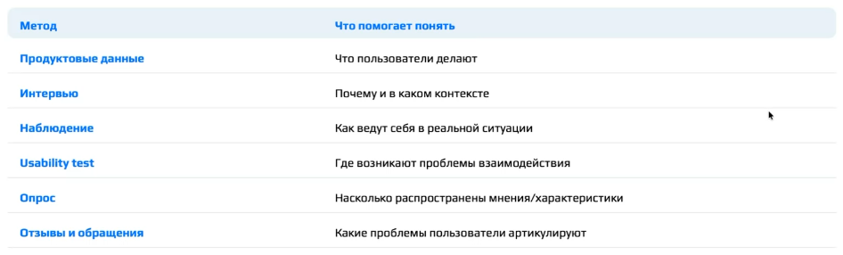

Частая ошибка — выбирать метод по принципу «самый сложный значит самый надёжный». Правильный порядок другой: исследовательский вопрос → какое знание нужно → какие данные его дают → метод. Например, на вопрос «где пользователи бросают регистрацию?» ответят продуктовые данные, на вопрос «почему они уходят?» — интервью или usability-тест, а на вопрос «насколько распространена найденная причина?» — количественная проверка.

Для выбора удобна шпаргалка «вопрос → метод». Её строки соответствуют типам продуктовых гипотез: в одном решении обычно скрыто несколько предположений (Problem, Value, Usability, Behavior / Outcome hypothesis), и каждое проверяется по-своему.

|Вопрос (неопределённость)|Метод|
|:--------------|:-----------|
|Существует ли проблема?|Исследования, продуктовые данные|
|Есть ли ценность в решении?|Интервью, прототип[^n3a], фейковая дверь — в зависимости от того, что именно хотим узнать|
|Понимает ли пользователь решение?|Usability-тест|
|Меняется ли его поведение?|Эксперимент|
|Есть ли причинный эффект изменения при подходящих условиях?|A/B-тест|

**Важно:** в последней строке ключевое слово — «подходящих». A/B-тест требует возможности корректно разделить группы, достаточного трафика, корректной метрики и отсутствия статистических нарушений дизайна. Подробно это разбирается в отдельной лекции об A/B-тестах; пока достаточно запомнить: **сначала формулируем неопределённость, то есть свой вопрос, потом выбираем метод**.

Несколько примеров. Понимают ли пользователи новую иконку? Это usability-тест. Есть ли интерес к новому типу услуги? Фейковая дверь: она даёт поведенческий сигнал. Почему люди бросают сценарий? Интервью плюс продуктовые данные: если воронка достаточно подробная, по ней можно найти объяснение. Меняет ли конкретная механика вероятность завершения опроса или регистрации? Эксперимент, A/B-тест при подходящих условиях.

Плохая логика выбора звучит так: «A/B серьёзнее интервью, поэтому проводим A/B». Хорошая — «какое неизвестное мешает решению и какой метод лучше всего уменьшит именно это неизвестное». A/B-тесты любят, и все хорошие продуктовые аналитики умеют их проводить, но это довольно дорого, и возможность провести A/B есть не всегда.

### Фейковая дверь и волшебник страны Оз

Эти два метода звучат забавно, но применяются довольно часто, особенно в компаниях, у которых немного денег на разработку.

**Фейковая дверь (fake door)** показывает вход в функцию, которой ещё нет, и так измеряет реальный интерес. Например, в интерфейсе появляется кнопка «Автоматическая расшифровка». По нажатию открывается сообщение «Функция пока недоступна» или не происходит ничего. Мы считаем клики: если конверсия в клик высокая, функция людям интересна. Это поведенческий сигнал интереса, а не слова из интервью. Подходить к этому нужно аккуратно, потому что нельзя разрушать доверие пользователя: представьте продукт, где половина функционала — иконки, под которыми ничего нет или написано «будет в следующей версии». Поэтому фейковые двери чаще используют на ранних этапах проекта или когда денег мало: разработать функцию сразу нельзя, сначала нужно убедиться, что она нужна.

**Волшебник страны Оз (Wizard of Oz)** — пользователь взаимодействует с продуктом так, будто функция работает автоматически, но за кулисами часть процесса выполняется вручную. Ранний сервис рекомендаций может собирать подборки руками, пока команда не построила сложную систему. Или автоматический заказ из ресторана: партнёрское соглашение ещё не подписано, интеграции нет, но в приложении ресторан уже виден, пользователь «как будто» заказывает, и курьер везёт еду. На деле на той стороне сидит человек: звонит в ресторан, делает заказ, может быть, сам едет за ним на велосипеде и доставляет. Пользователю кажется, что функционал автоматизирован, а выполняют его вручную. Так мы тоже проверяем актуальность и интерес, но ещё не тратим кучу денег на разработку.

Оба подхода позволяют проверить часть ценности до дорогой автоматизации[^n3b]. Но масштабируемость и экономику полноценного решения они не доказывают: их потом всё равно придётся пересчитать.

[^n3a]: Примечание составителя: прототип — упрощённый макет решения (кликабельный интерфейс, эскиз), который можно показать пользователю до разработки; отдельно этот метод не разбирался.

[^n3b]: Примечание составителя: разница между методами в том, что за фейковой дверью функции нет совсем и измеряется только интерес (клик), а в «волшебнике страны Оз» пользователь действительно получает результат, просто его производят люди, а не система.

## A/B-тест, готовность к проверке и путь гипотезы

*Таймкод: 00:41:31 · слайды 38, 47, 56*

Последний метод из перечня — A/B-тест. Вокруг него больше всего заблуждений, поэтому разберём его отдельно.

### Что даёт A/B-тест и чего он не даёт

A/B-тест — один из способов проверки гипотез, а не финальный экзамен, обязательный для любой идеи. При корректном дизайне он позволяет оценить причинный эффект изменения: мы сравниваем поведение сопоставимых групп, которые различаются только воздействием. Поэтому A/B полезен, когда вопрос именно о причине: изменило ли конкретное изменение поведение пользователей относительно **контрфактического сценария**, то есть того, что происходило бы без изменения. Группа без изменения как раз и показывает этот сценарий.

Работает это только при соблюдении условий: правильный дизайн, корректная метрика, рандомизация (случайное распределение пользователей по группам), достаточный объём данных и корректная интерпретация. Статистическому дизайну A/B-тестов посвящена отдельная лекция курса, здесь важна общая логика.

**Важно:** к фразе «объективные данные» стоит относиться осторожно. A/B-тест не делает исследование объективным автоматически. Можно выбрать неправильную метрику (так бывает), нарушить ход эксперимента, неверно интерпретировать результат или остановить тест раньше, чем заложено в дизайне. Если какое-то условие не соблюдено, тест провален. Хуже всего, когда команда этого не замечает: тогда она принимает неверное решение, ошибочно признавая гипотезу провальной или, наоборот, подтверждённой.

Даже хороший A/B-тест не объясняет, *почему* эффект появился или не появился. Для понимания механизма после теста иногда снова нужны исследования. В MAX, например, есть две точки входа в каналы (они устроены так же, как в Telegram): поиск и папка «Каналы» с рекомендациями из 25 каналов. Для рекомендаций было несколько вариантов рекомендательной системы, и лучший выбирали A/B-тестом. Эффект оказался неоднозначным, поэтому продуктовая аналитика дополнительно исследовала уже собранные данные.

Наконец, не каждую функцию можно или нужно проверять A/B-тестом. Он не подходит или мало что даёт, когда трафика мало, когда есть сетевые эффекты (пользователи влияют друг на друга), когда изменение обязательно и запускается в любом случае, когда речь о критических багах, а также когда интересны долгосрочные эффекты. A/B-тест — важное, но лишь одно звено в цепочке проверки.

### Чек-лист готовности гипотезы к проверке

Прежде чем запускать любую проверку, стоит пройти **чек-лист готовности гипотезы** — перечень вопросов, на которые команда должна уметь ответить:

1. Понятна ли пользовательская проблема?
2. Определены ли пользователь и контекст?
3. Есть ли основания для предположения?
4. Что именно мы меняем?
5. Какой механизм предполагаем?
6. Какой результат ожидаем?
7. Можно ли гипотезу опровергнуть?
8. Какой метод проверки подходит?
9. Что считаем успехом?
10. Какой результат реально изменит решение команды?

**Акцент лектора:** последний вопрос забывают чаще всего. Если команда при любом исходе всё равно собирается запускать фичу, проверка на решение не влияет и ресурс тратится ради ритуала. Готовность к тесту — это не красивая формулировка гипотезы, а ясная связь между наблюдением, которое мы получим, и будущим решением.

### Весь путь продуктовой гипотезы

Все инструменты лекции складываются в одну цепочку — **путь продуктовой гипотезы**:

1. Исследование пользователя даёт знание о контексте и потребности, в том числе о его джобах в терминах Jobs to Be Done.
2. CJM (карта пути пользователя) показывает, как пользователь проходит путь при решении своей задачи.
3. Pain points (точки боли) фиксируют барьеры, с которыми он сталкивается на этом пути.
4. Затем ищется предполагаемая причина барьера; автоматически считать её доказанной нельзя.
5. Возможности (opportunities) задают пространство для улучшения.
6. Рассматриваются варианты решений.
7. Формулируются гипотезы и user story (пользовательские истории).
8. Гипотезы приоритизируются.
9. Выбирается тест.
10. Тест даёт наблюдение.
11. Принимается продуктовое решение.[^n4a]

Короткая версия той же логики: наблюдение → потребность → pain point → причина → opportunity → варианты решений → гипотеза. В сквозном примере из e-commerce это выглядит так: пользователи часто бросают корзину (наблюдение); исследование показывает, что часть из них отвлекается и забывает вернуться; возможность — помочь продолжить прерванный сценарий; решение — напоминание; гипотеза — «если напомнить о незавершённой покупке…». Роли инструментов в этой цепочке разные: CJM помогает найти проблему, гипотеза — проверить решение, user story — реализовать ценность.

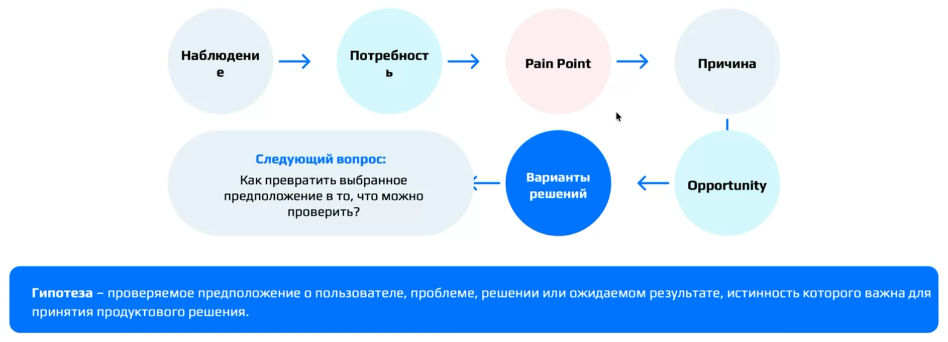

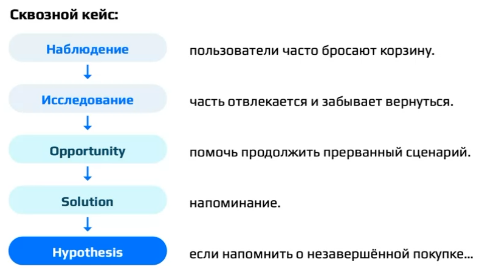

**Важно:** это не конвейер, а цикл. В реальной работе порядок бывает нелинейным или вообще другим. После теста можно вернуться к проблеме, обнаружить новый сегмент, изменить CJM или отказаться от возможности, если в её рамках не удаётся проверить ни одно решение. Поэтому в схеме есть петля обратно к пользователю или к любому этапу, на котором была допущена ошибка. Продуктовая работа — это цикл обучения, а не конвейер, который один раз проходят слева направо.

### Пример: AI summary для новых участников чата

Пройдём весь путь на кейсе мессенджера.

| Этап | Содержание |
|:--------------------|:----------------------------------------------------|
| Наблюдение | Часть новых участников активных групповых чатов долго остаётся читателями и не пишет |
| Исследование | Некоторые говорят, что после входа сложно понять контекст сотен предыдущих сообщений |
| Джоб | Быстро включиться в коммуникацию группы |
| CJM | Приглашение → вход → просмотр → попытка восстановить контекст → первое взаимодействие → дальнейшее участие или выход |
| Pain point | Высокая «стоимость» восстановления контекста: сложно, неприятно, слишком много сообщений, непонятно, что писали до тебя |
| Гипотеза о причине | Сложность понимания пропущенного обсуждения мешает части пользователей начать участвовать в чате |
| Возможность | Помочь быстро восстановить значимый контекст |
| Варианты решений | Закреплённый итог, AI summary, ключевые сообщения, онбординг, треды; выбран AI summary |
| Гипотеза | Если новому участнику активного чата показать краткое содержание недавнего обсуждения, то он быстрее совершит первое содержательное взаимодействие, потому что ему потребуется меньше усилий для понимания контекста |
| User story | Как новый участник активного группового чата, я хочу быстро увидеть краткое содержание недавнего обсуждения, чтобы понять контекст и включиться в разговор |
| Первая проверка | Не строить сразу полноценную AI-систему, а показать вручную подготовленные саммари на небольшой выборке (волшебник страны Оз) |
| Дальше | Получить наблюдение, обновить уверенность и только затем принять решение |

**Важный вывод:** так инструменты лекции перестают быть набором отдельных фреймворков и превращаются в одну последовательность продуктового рассуждения.

[^n4a]: Примечание составителя: подробно элементы этой цепочки (Persona и джобы, CJM, барьеры и возможности, формулировка гипотез и user story) разбираются на практике в разделах семинара ниже.

## Итог лекции: от гипотез к метрикам

*Таймкод: 00:51:41 · слайды 1*

Путь продуктовой гипотезы ведёт от наблюдения за пользователем к проверке и решению, но оставляет открытым ещё один вопрос.

### Как понять, что продукт стал лучше

Мы научились находить проблему, формулировать гипотезу и выбирать, что и как проверять. Остаётся фундаментальный вопрос: как понять, что продукт действительно стал лучше? Острее всего он встаёт, когда изменение кажется небольшим на фоне огромного продукта. Допустим, в мессенджере, которым каждый день пользуются 100 миллионов человек, вместо одного закреплённого сообщения разрешили закреплять несколько. На таком масштабе это выглядит мелочью, но каждое решение должно положительно влиять на продукт — иначе зачем были потрачены деньги на разработку, время и люди.

Чтобы ответить на этот вопрос, нужно решить:

- что именно мы измеряем;
- какие показатели отражают состояние продукта;
- как связать поведение пользователей с бизнес-результатом;
- как отличить полезное изменение от простого движения цифры.

Это прямой мостик к теме «Метрики продукта»: системы метрик, выбор показателей, интерпретация изменений. С неё начинается хардовая часть работы продуктового аналитика. Не понимать, какие метрики существуют, для продуктового аналитика очень плохо. Джуну знать все метрики не обязательно — это нарабатывается с опытом, — но на более серьёзных позициях это уже нужно, а на собеседованиях джунов в заданиях просят назвать определённые метрики. Коротко: эта лекция отвечала на вопрос «что мы предполагаем и почему», следующая ответит на вопрос «чем мы будем измерять результат».

### Главная мысль

**Важный вывод:** продуктовая аналитика начинается не с таблицы и не с идеи фичи, а с правильно поставленного вопроса о пользователе и продукте.

Это хорошо видно, если сравнить две модели появления продуктового решения. В наивной модели всё линейно: идея → разработка → запуск. В продуктовой модели решению предшествует длинная цепочка: наблюдение, исследование, потребность и проблема, возможность, гипотеза и её проверка. Хорошее продуктовое решение начинается не с идеи фичи, а с понимания проблемы.

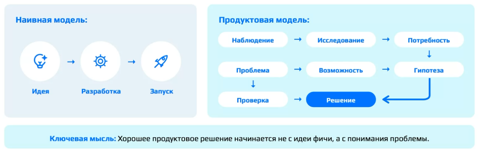

### Core-пользователи и целевая аудитория

Может показаться, что карты пути пользователя (CJM) и формулировки его задач — учебные упражнения, далёкие от реальной работы. Это не так: в продуктовых исследованиях MAX ими оперируют буквально каждый день. Пример — работа с ядром аудитории.

**Core-пользователи (core-аудитория)** — ядро аудитории продукта, те, кто на данный момент составляет его основу. По сути, это тот же портрет ключевого пользователя с его характеристиками, только под другим названием. Понимая ядро, мы видим, сколько таких пользователей и из кого оно состоит, а значит — насколько продукт устойчив: большое ядро означает, что решение уже довольно стабильно. Но важнее другое: какую долю остальной аудитории удастся «подтянуть» до ядра, то есть как его расширить и насколько остальные пользователи близки к показателям ядра.

Для этого строятся гипотезы, в том числе через задачи пользователей. Например, среди пользователей MAX можно выделить сегмент учителей. Тогда задача формулируется в духе «Как учитель начальных классов, я хочу …, чтобы …» — и с этой формулировки начинается вся связка от пользователя к метрикам. Метрики у такого сегмента будут совсем другими, потому что в MAX он решает свою особую задачу. Работая с данными и логами в отрыве от пользователя, рядовые задачи решать можно, но на серьёзный уровень продуктовой аналитики так не выйти.

Ядро не стоит путать с **целевой аудиторией**. Core-пользователи — те, кто *уже сейчас* является ядром продукта. Целевая аудитория — все потенциальные люди, которые могли бы взаимодействовать с продуктом, включая тех, с кем он уже взаимодействует. Например, целевой аудиторией могут быть люди 18–25 лет, которые сейчас учатся и обладают определёнными характеристиками: это не core-аудитория конкретного университета, а все люди, подходящие под описание.

::: {.qa title="Вопросы из зала"}
**Насколько подробно нужно знать метрики, чтобы попасть на стажировку?** Если на стажировке подробно спрашивают метрики, скорее всего, требования завышены. От стажёров не ждут чётких знаний: стажировка как раз нужна, чтобы получить навыки джуна. На стажировку в VK, например, ищут ребят условно с 3–4-го курса университета. Опыта работы у них может не быть вовсе, но нужны хард-скиллы: понимание математической статистики и SQL — хотя бы по личным или учебным проектам; Python желателен, но не обязателен. А что такое метрики, как собирать выборки и визуализировать данные в Redash, Superset или DataLens — это нарабатывается уже на работе.

**Может ли услуга, которую на этапе проверки выполняют вручную, оказаться настолько плохой, что окажется невостребованной?** Такое бывает, но обычно это следствие неправильных технических требований, то есть ТЗ к функции. Прежде чем писать ТЗ, проверяют актуальность каждого требования: насколько оно важно и нужно, что войдёт в MVP. Из этого складываются условия, по которым принимают готовую фичу. Если фича всё же оказалась ненужной, вариантов два: либо её актуальность не доказали ещё до разработки, либо она была актуальна, но что-то упустили в требованиях.[^n5a]
:::

[^n5a]: Примечание составителя: ответ сформулирован для фичи в целом. Применительно к ручной проверке («волшебник страны Оз») из него следует, что неудачный результат может говорить о качестве исполнения, а не о ненужности самой идеи, поэтому, прежде чем отвергать гипотезу, стоит убедиться, что её проверили на достаточно качественной реализации.

## Семинар: пользователь, потребность и job story

*Таймкод: 01:02:27 · слайды 3, 4, 5, 6, 12, 13, 14, 15, 16, 18, 34*

Семинар полностью опирается на лекцию: возьмём один продуктовый кейс и соберём решение от самого начала до проверки. Главный вопрос, на который мы учимся отвечать: почему именно эта фича вообще появилась в бэклоге и на чём основана вера, что она что-то изменит.

Рассуждение держится на четырёх опорных понятиях. **Evidence** — наблюдения и данные о пользователях. **Pain point** (точка боли) — то, что мешает пользователю добиться своей цели. **Opportunity** — возможность: направление, в котором продукт может эту боль снять. **Solution** — конкретное решение. Именно между этими четырьмя звеньями чаще всего и происходят логические скачки: команда перепрыгивает от одного наблюдения сразу к готовой фиче. Поэтому к концу семинара нужно уметь для любого решения пройти назад — от solution до наблюдения, на котором оно стоит.

Маршрут такой: понять пользователя и его задачу → построить его путь → собрать на этом пути данные → сформулировать проблемы → получить из проблем возможности → только после этого перейти к решениям → выбрать одно → превратить его в проверяемую гипотезу → описать ценность для пользователя → спроектировать первый разумный тест. В реальной работе процесс бывает итеративным, но логика обоснования должна сохраняться. Статистику глубоко не разбираем: важнее более ранний вопрос — что именно нам неизвестно и какой метод может уменьшить эту неопределённость.

### Кейс: новые пользователи не доходят до заказа

**Кейс доставки еды**, на котором построен весь семинар: вы — команда сервиса доставки, и бизнес хочет увеличить долю новых пользователей, которые делают первый заказ. Известно, что многие начинают выбирать еду, но часть до заказа не доходит. Этих данных недостаточно, чтобы решить, что делать.

Низкая конверсия здесь — **симптом**: наблюдаемый результат, а не его причина. За одним симптомом может скрываться множество причин: сложный выбор, цена, срок доставки, техническая ошибка, недоверие, нет подходящего способа оплаты, пользователя просто отвлекли. Одинаковый результат не означает одинаковую причину, а разные причины ведут к разным решениям. То же видно на регистрации: пользователи её не заканчивают, команда предлагает «сократим количество полей», а на деле не приходит SMS, человек не понимает ценность регистрации или не хочет давать номер телефона. До понимания причины осмысленно выбирать решение нельзя.

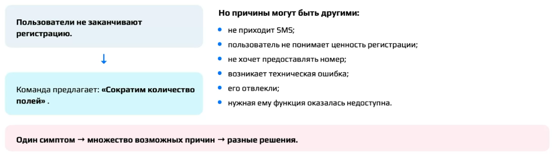

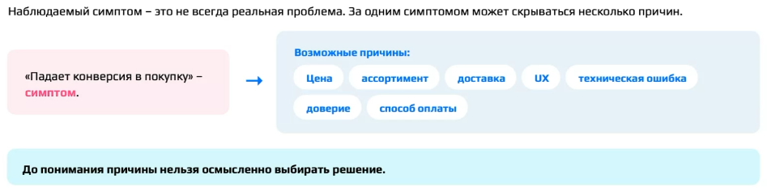

Типичная ловушка: продакт или разработчики сразу говорят: «Каталог плохой, пользователь в нём теряется и ничего не заказывает — надо переделать». Задача аналитика — остановить этот преждевременный переход к решению.

### Какие вопросы задать до обсуждения дизайна

Первое упражнение — сформулировать вопросы, которые стоит задать до разговора о каталоге. Хорошие ответы участников: посмотреть по логам, на каком шаге воронки отваливаются пользователи; выяснить, откуда вообще узнали о проблеме и на какой выборке; проверить, во всех ли сегментах пользователи уходят одинаково. Самый важный вопрос: «С чего вы вообще взяли, что дело именно в каталоге?» Возможно, это уже кто-то проверил — тогда вопрос снимается. Если же за этим стоит просто чуйка, с таким мы не работаем.

Полный набор того, что мы хотим узнать о пользователе, удобно держать в виде списка: контекст (когда возникает задача?), цель (чего хочет достичь пользователь?), мотивация (почему это важно?), поведение (что он делает?), барьеры (что ему мешает?), альтернативы (как решает задачу сейчас?), результат (что считает успешным исходом?). В кейсе к этому добавляются вопросы о том, на каком шаге человек прекращает путь и возвращается ли он потом.

Эти вопросы складываются в три группы: про пользователя (нужен контекст, а не паспортные данные), про поведение (что человек делает на самом деле) и про проблему (где и как ему что-то мешает). «Пользователи не совершают заказ» — это наблюдение об итоге, а не объяснение причины. **Важно:** у аналитика должна быть привычка не превращать название плохой метрики в диагноз.

### Persona: только то, что объясняет поведение

Дальше нужно описать пользователя. Здесь полезно различать три понятия, которые не конкурируют друг с другом, а отвечают на разные вопросы. Сегмент — группа пользователей с общими значимыми характеристиками. **Persona** — модель характерного пользователя и его контекста. Задача, которую человек пытается решить, — третье понятие, к нему мы придём в конце раздела.

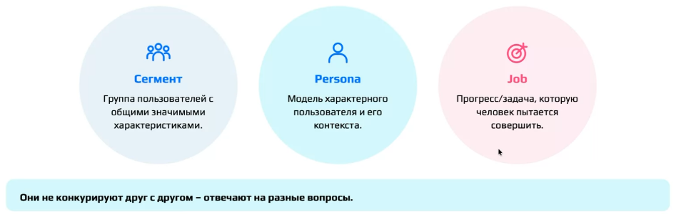

Хорошая Persona содержит контекст, цели, мотивацию, поведение, потребности и барьеры. Плохая выглядит как «Мария, 29 лет, любит кофе, путешествия и сериалы»: это литературный портрет, а не модель. Правило простое: если характеристика не помогает объяснять продуктовую задачу, она лишняя. Persona — не придуманный персонаж, она строится на исследованиях, наблюдаемом поведении, данных и устойчивых паттернах.

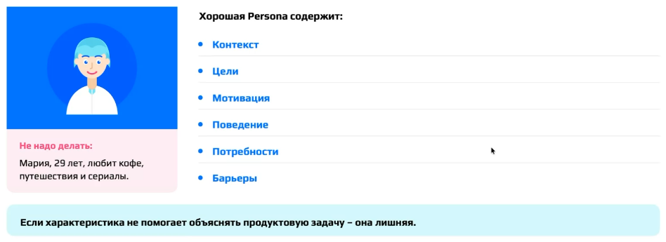

Во втором упражнении дан список признаков, где полезное перемешано с шумом: «заказывает вечером», «сравнивает рестораны», «не хочет готовить», «хочет понимать итоговую стоимость», «28 лет», «любит путешествовать». Нужно выбрать признаки, которые объясняют пользователя и его контекст, и обосновать каждый. Ответ «всё, что касается пользователя» слишком широк: любимый цвет тоже касается пользователя.

**Важный вывод:** релевантность признака определяется его объяснительной ценностью. Любой признак допустим, если можно объяснить, зачем он нужен. «28 лет — чтобы понимать платёжеспособность» — уже аргумент. Даже любимый цвет становится релевантным, если, скажем, всё приложение фиолетовое, а пользователи любят фиолетовый. Поэтому деление на «полезное» и «шум» здесь примерное. Но биографию пользователя мы не пишем. Если человек говорит «мне важно заранее понимать, сколько я заплачу», из этого нельзя вывести низкий доход: многие обеспеченные люди тоже постоянно следят за тем, на что тратят, и прозрачность цены важна и им. Доход становится частью модели, только когда данные исследования показывают, что он действительно разделяет поведение.

Третье упражнение — собрать мини-Persona из данных. Известно: пользователь новый, вечер после работы, ужин на двоих, он знаком с другими сервисами доставки; есть цитаты из интервью о нежелании готовить, сравнении ресторанов, важности итоговой стоимости и времени доставки. Цитата фиксирует лишь то, что так сказал конкретный респондент. Распространять её на всю аудиторию можно, только если она повторяется регулярно. Качественное исследование хорошо раскрывает механизм, но не измеряет долю проблемы — для этого нужны количественные методы.

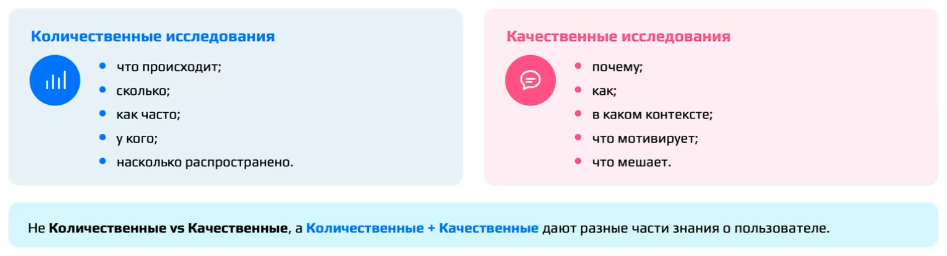

Эталонный вариант выглядит так:

|Поле|Содержание|
|:--|:-----------|
|Контекст|вечер после работы, нужно организовать ужин на двоих|
|Цель|быстро выбрать и заказать подходящую еду|
|Поведение|сравнивает рестораны; знаком с другими сервисами|
|Потребности|быстро выбрать; понимать стоимость и время доставки|
|Мотивация|ужин без готовки и лишних усилий|
|Барьеры|сложность выбора; неопределённость итоговой суммы и времени доставки|

Контекст — это то, в рамках чего человек сейчас находится в этой проблеме. Частая ошибка — смешивать с ним другие поля: «обычно заказывает два-три раза в неделю» — это не контекст, а поведение. Другая ошибка — описать контекст всей задачи бизнеса вместо контекста пользователя. **Акцент лектора:** не добавляйте характеристик, которых нет в данных. Если хочется написать «он устал», «он экономный», «он раздражён», остановитесь и спросите себя, где было это наблюдение. Это может быть правдоподобной интерпретацией, но пока это не знание.

### Потребность или решение

Пользователи часто говорят решениями: «хочу фильтр», «нужна кнопка», «показывайте цену здесь». Поправлять такого пользователя не нужно — нужно раскрутить, какую задачу он пытается решить. Здесь различаются три уровня. **Потребность** — человеку нужно получить определённый результат. Проблема — что-то мешает ему этот результат получить. **Решение** — конкретный способ устранить проблему. «Мне нужна кнопка „Скачать“» — решение, «мне нужен доступ к материалам без интернета» — потребность.

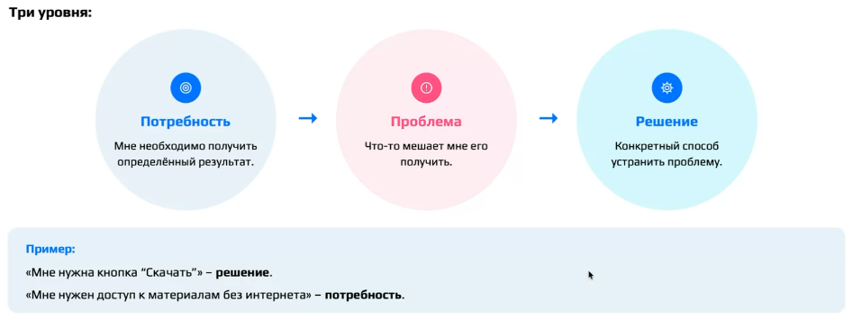

В четвёртом упражнении шесть формулировок нужно разделить на потребности и решения. Потребности: понимать время доставки; быстро повторить понравившийся заказ; заранее понимать итоговые расходы. Решения: «хочу фильтр по времени»; «нужна кнопка повторного заказа»; отображение стоимости доставки в каталоге. Многих сбивает слово «хочу», вставленное намеренно: оно не делает формулировку потребностью.

Критерий такой: если задачу можно закрыть несколькими способами, то конкретный способ — это решение. Потребность «заранее понимать расходы» можно закрыть показом стоимости доставки в каталоге, прогнозом полной стоимости, сортировкой по полной стоимости — вариантов можно нагенерировать сотню. Если же начать с «нужен фильтр», пространство решений искусственно сужено, и дальше команда гадает, зачем этот фильтр и куда его поставить. Отсюда порядок работы: сначала пространство проблемы (кто, в какой ситуации, что пытается сделать, почему, что мешает), затем пространство решений (что изменить, какой интерфейс сделать, какую механику добавить, как реализовать).

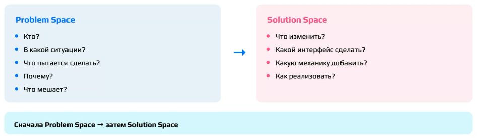

### Jobs to Be Done и job story

[**Джоб (job)**]{.gl key="Джоб (job)"} — прогресс или задача, которую человек пытается совершить. На этом строится подход **Jobs to Be Done (JTBD)**: пользователь выбирает продукт, чтобы совершить определённый прогресс в конкретной ситуации. Не «мне нужен мессенджер», а «мне нужно быстро договориться с группой людей».

Удобная форма записи — [**job story**]{.gl key="Job story"}, которая удерживает ситуацию, задачу и желаемый прогресс:

> Когда [ситуация], я хочу [мотивация / действие], чтобы [ожидаемый результат].

Цель — уйти от формулировки «пользователь хочет заказать еду в приложении» к жизненному контексту. Для кейса один из возможных вариантов: «Когда вечером после работы я не хочу готовить, я хочу быстро выбрать и заказать подходящую еду, чтобы получить ужин без лишних усилий».

Проверить, что записана задача, а не функция, можно так: уберите наш продукт. Если джоб у человека остаётся и закрыть его можно множеством альтернатив — доставкой, готовой едой из магазина, походом в ресторан, тем, что приготовит кто-то другой, — job story сформулирована правильно. Отсюда же следует, что с точки зрения JTBD конкурент — не обязательно похожий продукт: для джоба «занять себя в дороге» соперничают YouTube, музыка, книга, игра, соцсети и сон. Круг альтернатив шире прямых продуктовых конкурентов, потому что пользователь сравнивает разные способы выполнить одну и ту же задачу.

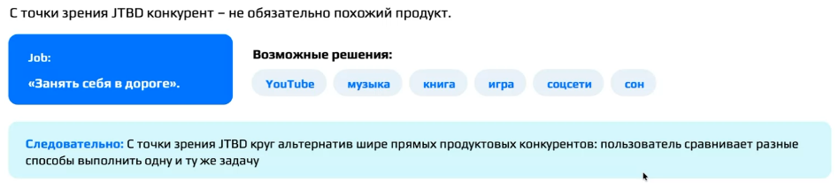

::: {.qa title="Вопросы из зала"}
**Можно ли считать, что пользователь из кейса живёт в Москве и пользуется iPhone?** Нет: этого нет в данных. Опираемся только на то, что известно из исследования, и не достраиваем портрет.
:::

## Семинар: CJM доставки ужина

*Таймкод: 01:41:00 · слайды 20, 21, 22, 23, 24, 25, 26, 27, 29, 30, 32, 33*

Центральное и, пожалуй, самое сложное упражнение семинара: по данным кейса доставки еды построить карту пути пользователя.

### Где начинается путь

Пользователь не взаимодействует с продуктом как с набором экранов. У него есть путь от возникновения потребности до достижения цели: ситуация → цель → действия → точки контакта → результат. Часть этого пути проходит до входа в продукт, часть — после выхода из него. **CJM (Customer Journey Map)** — визуальная модель такого пути пользователя к определённой цели. Карта показывает действия, цели и контекст, выявляет эмоции и проблемы, помогает находить точки роста и выравнивает понимание внутри команды. CJM — это не про экраны продукта, а про опыт.

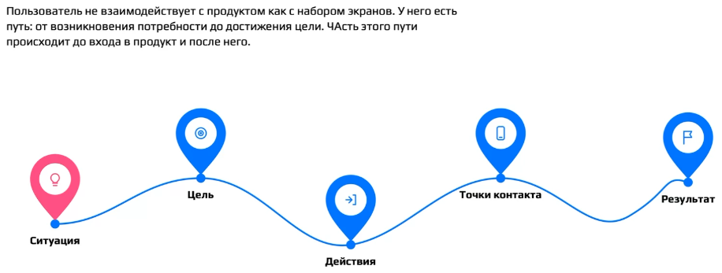

Отсюда первый вопрос: где начинается CJM в нашем кейсе? Правильный ответ — в момент, когда возникла необходимость решить вопрос с ужином, а не когда пользователь открыл приложение. Ещё до продукта у человека есть контекст (вечер после работы), ожидания и альтернативы. Если начать карту с интерфейса, мы потеряем причины прихода и альтернативы. Например, реклама могла пообещать бесплатную доставку ещё до того, как пользователь увидел каталог, а разочарование проявится только в корзине. CJM описывает путь к цели, а не внутреннюю навигацию продукта.

### Границы карты

Прежде чем строить карту, задают её **границы CJM** — отвечают на шесть вопросов: кто пользователь, в какой он ситуации, какой цели хочет достичь, где начинается рассматриваемый путь, где он заканчивается и какие каналы и точки контакта мы включаем. Пример: пользователь — студент, цель — купить онлайн-курс, границы — от первого контакта с рекламой до начала обучения. Типичная ошибка — «построим CJM нашего приложения»: это слишком широко.

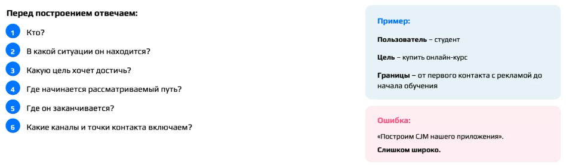

В кейсе рамка такая: пользователь — новый пользователь сервиса, контекст — вечер после работы, цель — организовать ужин на двоих, границы — от возникновения потребности до вручения заказа. Без границ «CJM доставки» превращается в огромную энциклопедию, где смешаны разные пользователи, разные джобы и очень много этапов.

### Из чего состоит карта и на чём она строится

Карта складывается из нескольких элементов. **Этапы пути** — логические шаги пользователя. Для каждого этапа записывают цель (чего пользователь хочет достичь на этом шаге), действия (что он делает), **точки контакта (touchpoints)** (где он взаимодействует с продуктом или брендом), мысли и ожидания, **эмоции** (что он чувствует), **барьер** (что мешает достичь цели) и возможности для улучшения (opportunity). Точки контакта не ограничиваются интерфейсом: это и реклама, и поиск, и сайт, и приложение, и email, и push-уведомления, и поддержка, и сама доставка. Значительная часть опыта пользователя проходит вне основного интерфейса. Барьер — это и есть pain point: конкретная проблема, которая мешает пользователю достичь цели. Чтобы оценить её вес, смотрят, насколько часто она возникает (frequency), насколько сильно мешает (severity) и к каким последствиям приводит (impact).

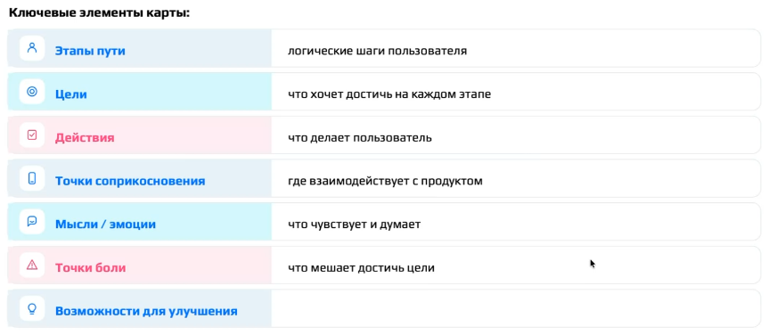

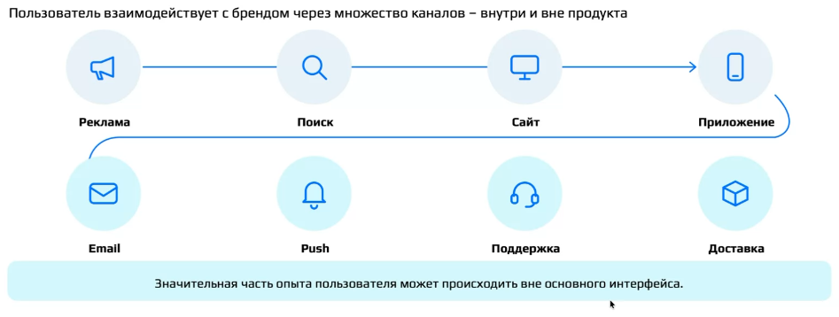

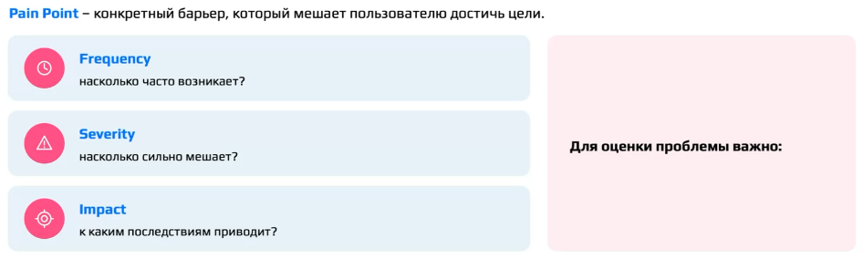

Важнее всего то, что CJM должна опираться на данные: продуктовые данные о поведении, интервью, usability-тесты, опросы, обращения и отзывы пользователей, рыночные и конкурентные данные. Фраза «мне кажется, здесь пользователь злится» — не источник. CJM — исследовательская модель, а не упражнение на фантазию.

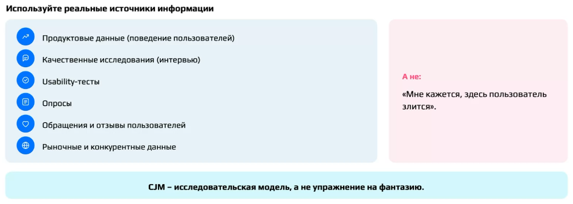

В кейсе данные такие. Пользователь «долго листал и не мог определиться»; «блюда казались недорогими, потом добавилась доставка»; «непонятно, 30 или 90 минут»; «после итоговой суммы решил посмотреть другой сервис»; «после заказа несколько раз проверял курьера». Есть и поведенческое наблюдение: после отображения полной стоимости часть новых пользователей прекращает оформление. Заметьте: ни одна из этих фраз не говорит, что «пользователь чувствует себя обманутым». Это уже объяснение данных, а не сами данные. Точно так же многократная проверка статуса заказа ещё не означает тревоги: причина может быть другой.

Данных об эмоциях в кейсе нет. В правильной CJM в такой ячейке пишут «нет данных»: пустая ячейка сильнее выдуманной. На семинаре эмоции всё же проставили, и проставили смешными стикерами, но только как игру. В настоящей работе так делать нельзя.

### Этапы — шаги пользователя, а не экраны

Первая горизонталь таблицы — этапы. Здесь чаще всего ошибаются: предлагают «вход в приложение», «регистрацию», «авторизацию», «скачивание из стора». Это экраны и шаги интерфейса, а в CJM рассуждают только в логике действий пользователя. Продуктовый взгляд даёт цепочку «Главная → Каталог → Карточка → Корзина → Оплата», пользовательский — «Возникла потребность → Ищу варианты → Сравниваю → Выбираю → Покупаю → Получаю». Один этап может включать несколько экранов: на выборе это и каталог, и корзина, и переходы между блюдами. Верно и обратное: один экран может обслуживать разные джобы.

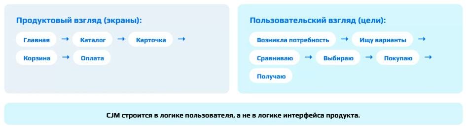

В кейсе получилось семь этапов: **возникла потребность → ищу → сравниваю → выбираю → оформляю → жду → получаю**. Оплата входит в «оформляю». Вариант «сталкиваюсь с опозданием курьера» на роль этапа не подходит: это уже барьер.

Путь заканчивается на «получаю», хотя жизнь пользователя продолжается. Он ест, может обнаружить, что еда невкусная или заказ перепутан, написать отзыв, позвонить в поддержку. Всё это за пределами карты, потому что мы заранее задали границы. Именно для этого их и определяют: чтобы понимать, в рамках чего мы работаем, и не расползаться.

### Заполнение по этапам

Дальше таблицу заполняют вертикально, этап за этапом. Её устройство повторяет шаблон «этап × (действие, touchpoint, emotion, pain, opportunity)». Вот что получилось (эмоции опущены, данных о них нет):

| Этап | Цель | Действие | Точки контакта | Мысли / ожидания | Барьер |
|:----|:------|:------|:------|:------|:------|
| Возникла потребность | поесть, организовать ужин | — | нет | поесть быстро, недорого и без усилий | не выявлен |
| Ищу | найти подходящий вариант | открывает сервис, просматривает рестораны | приложение, сайт, каталог, карточки блюд, реклама | «что выбрать — роллы или пиццу?» | большой выбор |
| Сравниваю | понять, какой вариант лучше подходит | открывает рестораны, сравнивает | каталог, карточки | что быстрее, что вкуснее, чего хочу сейчас | неясно время доставки, сложно сравнивать |
| Выбираю | определиться с рестораном и едой | выбирает ужин, заполняет корзину | корзина, карточки | «точно ли это то, что мне нужно?» | итоговая стоимость |
| Оформляю | оформить и оплатить заказ | проверяет условия, оплачивает | корзина, интерфейс оплаты или банковское приложение | «дорого», «сколько?!» | цена выросла: добавились доп. расходы |
| Жду | понять, когда привезут | отслеживает курьера | карта в приложении или сообщение «курьер будет через N минут» | «скорее бы» | непонимание, когда привезут заказ |
| Получаю | забрать заказ | получает заказ | курьер | нет данных | не выявлен |

Цели соседних этапов похожи, а точки контакта на разных этапах повторяются, и это нормально.

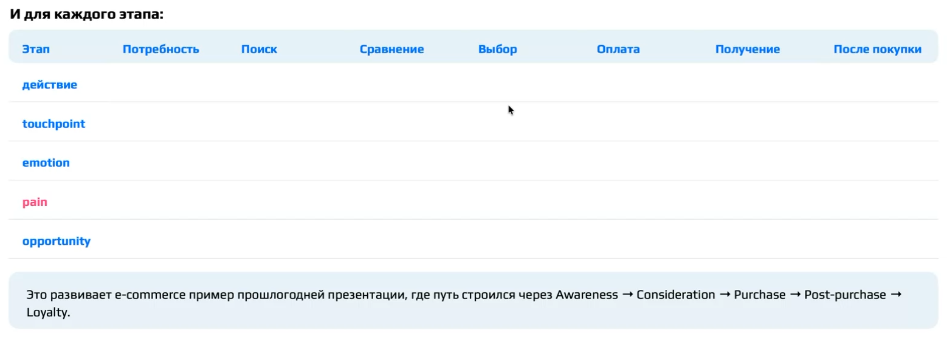

**Барьеры берутся только из данных.** На первом этапе пользователь ещё ни с чем не столкнулся, поэтому барьера нет. «Цена» сюда не подходит: он ещё не открыл ни одного приложения. «Диета» в принципе возможна, но о ней в данных ничего не сказано. Барьер нужно ставить на тот этап, где он возникает: платная доставка — реальный барьер, но не на поиске, а позже. На оформлении часто предлагают «не прошла оплата». Это хороший барьер, но выдуманный. Ближе к данным — «цена изменилась, добавились расходы»: тот самый барьер с итоговой стоимостью, который проявился на двух этапах подряд. С ожиданием так же. Утверждать, что «доставка задерживается», можно только при подтверждении в данных. Например, в промо обещана доставка до 15 минут, как у Самоката, а логи показывают, что заказы систематически приезжают за 20–25. Таких данных в кейсе нет, поэтому барьер на этом этапе — непонимание, когда привезут заказ. «Тревожность» тоже не подходит: это эмоция, а не барьер. Мысли на этапе получения пользователь не описывал, так что честная запись — «нет данных».

В эталонной карте эмоции нигде не проставлены, на первом этапе нет ни барьера, ни точки контакта, а в одной из ячеек стоит «нет информации». Пустые ячейки при отсутствии данных — нормальный результат.

### Откуда берутся эмоции

Во многих CJM эмоции рисуют волной по этапам, как в примере карты покупки подарка в интернет-магазине. Обычно это шкала примерно из пяти состояний: от резко негативного через нейтральное к позитивному. Волна показывает, на каком этапе барьер переживается наиболее негативно и с каким этапом нужно работать в первую очередь. Данные для неё дают исследования. Сначала качественные: в интервью замечают, что на определённых этапах пользователи называют одну и ту же эмоцию. Потом количественные: опросом подтверждают масштаб. Например: «Отметьте по шкале от 0 до 10, насколько это про вас: когда мне долго не везут заказ, я начинаю злиться» (5 — нейтрально).

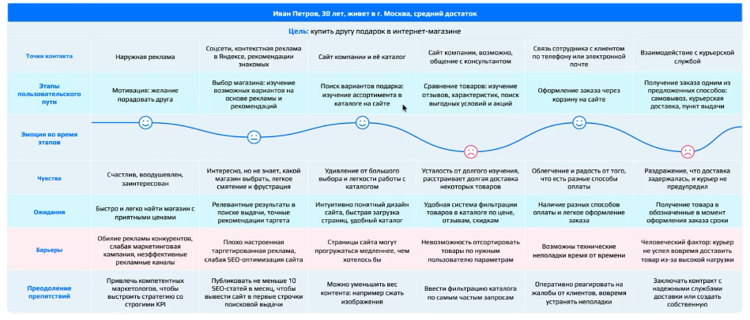

Отдельно на пути выделяют **Moments of Truth** — точки, которые непропорционально сильно влияют на восприятие продукта, дальнейшее поведение и решение продолжить или прекратить взаимодействие. Это, например, первая успешная покупка, первая ошибка оплаты, получение заказа, первый конфликт с поддержкой.[^n7a]

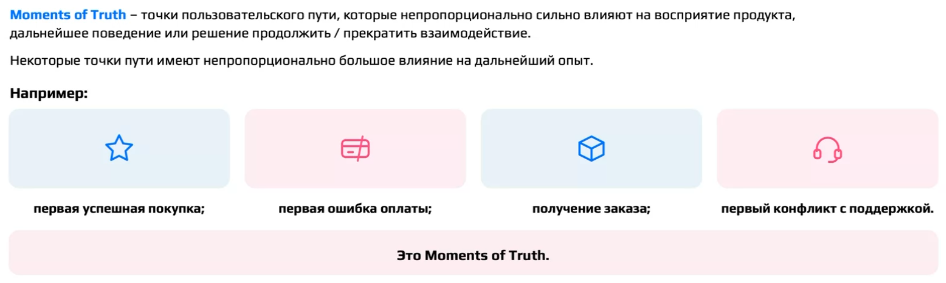

Все ошибки, которые встретились в упражнении, входят в типичный набор ошибок CJM: строить карту по экранам, придумывать эмоции и потребности, строить без данных или только на мнении команды, пытаться описать весь продукт. В этот же набор входят смешивание разных сценариев и сегментов пользователей, путаница проблемы и решения и представление о CJM как о конечном результате.

[^n7a]: Примечание составителя: на семинаре этот термин отдельно не разбирался. В кейсе на роль такого момента подходит показ итоговой суммы: по данным, после него часть новых пользователей прекращает оформление.

## Семинар: от барьера к гипотезе

*Таймкод: 02:19:24 · слайды 11, 28, 35, 36, 37, 39, 40, 41, 42, 43, 44, 45, 46, 47*

Карта пути показала, где пользователю трудно. Теперь нужно пройти от этих трудностей к проверяемой гипотезе: наблюдение → барьер → предполагаемое влияние → возможность → решение → гипотеза. На каждом шаге легко подменить одно другим, и упражнения ниже учат этого не делать.

### Наблюдение, интерпретация, причинная гипотеза

Об одном и том же факте можно сказать на трёх разных уровнях. **Наблюдение** отвечает на вопрос «что мы видели или заметили». **Интерпретация** отвечает на вопрос «что это может означать». **Причинная гипотеза** (гипотеза о причине) отвечает на вопрос «почему это происходит». Например: «38% пользователей бросают регистрацию на шаге подтверждения номера» — факт; «на этом этапе есть значимый барьер» — интерпретация; «пользователи не понимают, зачем продукту номер телефона» — гипотеза о причине. Отсюда очень важный принцип аналитика: не выдавать объяснение данных за сами данные.

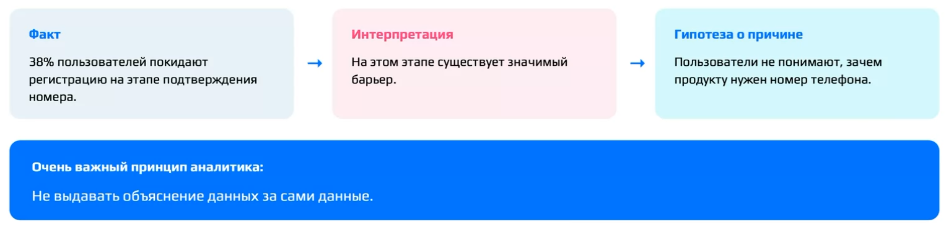

Попробуем разложить по уровням четыре утверждения о пользователях. Цитата пользователя (А) и наблюдаемое поведение (Б) — это наблюдения. «Пользователи считают ценовую политику нечестной» (В) — интерпретация, если это никто не измерял. «Пользователи уходят, потому что чувствуют себя обманутыми» (Г) — причинная гипотеза. Утверждение В звучит убедительно, поэтому его хочется записать в наблюдения. Но правдоподобность не превращает утверждение в наблюдение.

Пример из мессенджера. «Пользователи, получившие входящее сообщение в первый день, чаще возвращаются» — наблюдение из данных. «Социальная коммуникация связана с возвратом» — интерпретация. «Входящее сообщение само по себе вызывает рост retention», то есть возвращаемость в сервис, — уже причинная гипотеза. Причинную гипотезу всегда надо держать рядом с альтернативами. Возможно, дело не в сообщении, а в том, что у этих пользователей изначально сильный социальный граф: у них много знакомых в сервисе, поэтому им и пишут, и возвращаются они чаще.[^n8a]

Чтобы дойти от наблюдаемого симптома до глубоких причин, используют метод 5 «Почему?». Вопрос «почему?» задают последовательно и не останавливаются на первом правдоподобном объяснении. Буквально пять раз спрашивать не обязательно: цель в том, чтобы двигаться от симптома к причинам. Но и результат этого метода — гипотеза о причине, которую ещё нужно подтвердить данными.

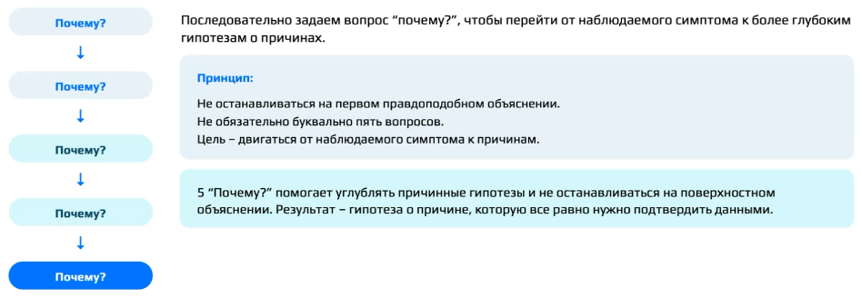

Практический вывод для рабочих документов: полезно буквально ставить маркеры «наблюдаем», «интерпретируем», «предполагаем как причину». Барьер в этой схеме — уже не сырое наблюдение, а формулировка, сделанная на основе наблюдений. Например, наблюдение «не понял, привезут через 30 минут или через полтора часа» превращается в барьер «пользователь не может достаточно уверенно оценить время доставки при выборе». Так из наблюдений кейса доставки получаются барьеры:

| Наблюдение | Барьер |
|:------------------------------|:-----------------------------|
| Долго листает, не может определиться | Сложно выбрать подходящий вариант |
| Не понимает, будут везти 30 минут или 90 | Неясно ожидаемое время доставки |
| Дополнительные расходы становятся очевидны слишком поздно | Нельзя заранее оценить полную стоимость |

### Барьер, возможность, решение

Следующее различение — между проблемой и тем, что с ней делать. Барьер говорит, что мешает пользователю прямо сейчас. **Возможность** (opportunity) говорит, что в опыте пользователя можно улучшить: это направление будущего улучшения. Решение говорит, как именно это сделать. Барьер «не понимаю полную стоимость заранее» за потребностью «понимать стоимость до принятия решения» даёт возможность «сделать стоимость предсказуемее (прозрачной раньше)». «Показывать стоимость доставки в карточке ресторана» — уже решение. Варианты решений появляются только после того, как сформулирована возможность. Барьер фиксирует то, что мы уже знаем о проблеме, а возможность смотрит вперёд. Между ними должна быть понятная цепочка рассуждения: возможность вытекает из барьера через понимание проблемы, а не появляется сама по себе.

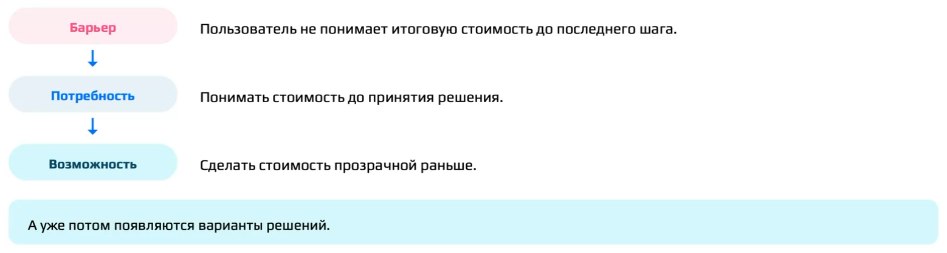

Хорошая возможность оставляет пространство для нескольких решений. Проверить это можно простым тестом: можно ли реализовать её минимум тремя способами? Если да, уровень абстракции выбран правильно. Если же в формулировке возможности уже сидит фича («сделать фильтр по категориям»), это решение, а не возможность. Источник возможностей — не только CJM. Точки роста ищут также в пользовательских исследованиях, продуктовых данных, обратной связи, обращениях в поддержку, незакрытых потребностях, альтернативных сценариях, на рынке и у конкурентов.

### Предполагаемое влияние

Между барьером и возможностью стоит ещё одно звено — предполагаемое влияние. Оно нужно, потому что сам факт проблемы ещё не доказывает, что она влияет на бизнес-результат. «Не могу заранее понять стоимость» — барьер, а «из-за этого прекращаю заказ» — уже причинное предположение о влиянии. Влияние — это ответ на вопрос, что сделает пользователь, столкнувшись с барьером: откажется от заказа, пойдёт искать другой вариант, уйдёт к конкуренту. Соответственно, ожидаемый эффект улучшения — рост конверсии из корзины в оплату.

В ответах участников регулярно повторяются две ошибки. Первая: шаг влияния пропадает, и сразу после барьера идёт возможность. Вторая: возможность подменяется фичей, например «фильтр по времени» вместо «давать точную информацию о сроках ещё на этапе выбора». Полная цепочка выглядит так:

- наблюдение: итоговые расходы видны поздно;
- барьер: пользователь не может заранее определить полную стоимость;
- предполагаемое влияние: неожиданное увеличение стоимости может снижать готовность продолжить заказ, то есть конверсию;
- возможность: сделать полную стоимость предсказуемой ещё на этапе выбора.

### Из пространства проблем в пространство решений

До этого момента вся работа шла в **Problem Space** — пространстве проблемы: кто пользователь, в какой он ситуации, что пытается сделать и что ему мешает. Теперь начинается **Solution Space** — пространство решений: что изменить и как это реализовать. Порядок именно такой: сначала проблема, потом решения.

У одной возможности много решений. Чтобы сделать полную стоимость предсказуемой на этапе выбора, можно показывать цену доставки прямо в выдаче ресторанов, давать прогноз полной стоимости, добавить фильтр или сортировку. По сути это три класса решений: показать информацию раньше, помочь сравнить, объяснить условия. Эту же идею выражает дерево Opportunity Solution Tree: от желаемого результата (Desired Outcome) ветвятся возможности, от каждой возможности — несколько решений, от каждого решения — эксперименты. Перебор альтернатив защищает команду от привязанности к первой идее: она лишь один из способов.

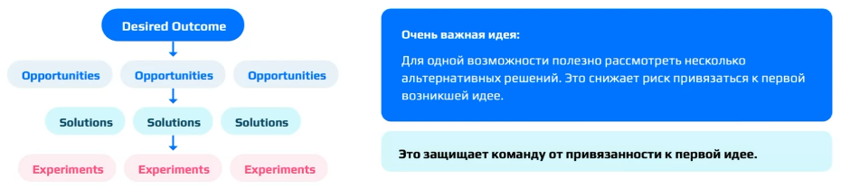

Из нескольких решений надо выбрать одно для первой проверки, и выбор надо аргументировать. Годятся такие аргументы: связь с проблемой, потенциальная ценность, стоимость проверки, неопределённость и изолируемость, то есть возможность проверить решение в отрыве от других решений. «Мне кажется, так удобнее всего» — не аргумент. Аргументированный выбор звучит, например, так: «выбрали, потому что изменение можно изолировать, но мы не знаем, изменит ли оно поведение».

**Важно:** выбрать решение для проверки не значит доказать, что оно сработает. Именно поэтому дальше нужна проверяемая гипотеза.

### Продуктовая гипотеза и каркас IF / THEN / BECAUSE

**Продуктовая гипотеза** — проверяемое предположение о том, как изменение продукта повлияет на пользователя или продуктовый результат, и почему. Она связывает пользовательскую проблему, конкретное изменение, ожидаемый результат и механизм воздействия. Этим гипотеза отличается от идеи. «Добавим персональные рекомендации» — идея: в ней нет контекста и ожидаемого результата, не объяснено, почему это сработает, и такую идею трудно проверить. Гипотеза звучит так: «Если новым пользователям показывать персональные рекомендации, они быстрее найдут релевантный контент и чаще начнут взаимодействовать с продуктом, потому что проблема выбора будет снижена».

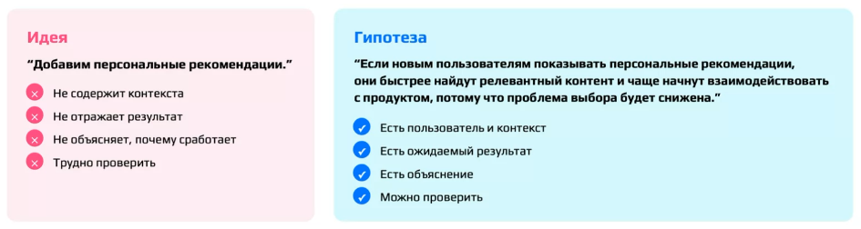

Для формулировки служит каркас **IF / THEN / BECAUSE**: «если мы [изменение], то ожидаем [результат], потому что [основание / механизм]». Его усиленная версия добавляет сегмент: «Для [кого / в какой ситуации], если мы [изменение], то ожидаем [результат], потому что [основание]». Самая важная часть — BECAUSE: это наша теория о том, как изменение приводит к результату. «Если отправить push, пользователи будут чаще возвращаться» — непонятно, почему это должно сработать, и трудно выбрать метрику и способ проверки. Сравните: «Если напомнить о незавершённом заказе, часть пользователей вернётся к оформлению, потому что некоторые прерывают покупку из-за внешнего отвлечения, а не из-за отказа от намерения купить». Здесь механизм понятен, гипотезу можно проверить и можно опровергнуть.

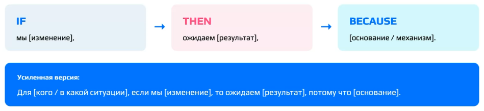

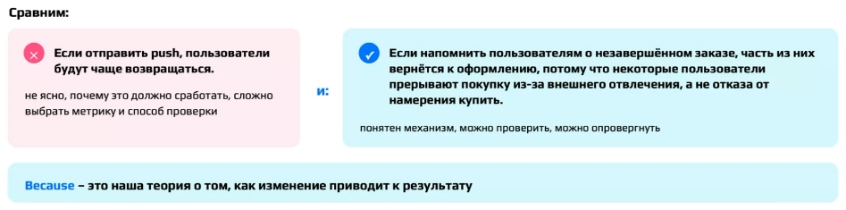

При этом каркас не гарантирует качества. «Если сделать кнопку зелёной, конверсия вырастет, потому что зелёный удобнее» формально уложена в каркас, но механизма в ней нет. Хорошая гипотеза конкретна и основана на наблюдении или инсайте. Она описывает пользователя и контекст, содержит изменение и ожидаемый результат, объясняет механизм, измерима, проверяема и опровержима. Последнее особенно важно: хорошая гипотеза допускает результат «мы ошибались». «Новый дизайн улучшит пользовательский опыт» опровергнуть нельзя: непонятно, что считать улучшением и что именно менять. Типичные плохие гипотезы:

- «Добавим Stories — пользователям понравится»: нет конкретного поведения и критерия проверки;
- «Сделаем onboarding удобнее»: не определено изменение;
- «Добавим рекомендации и увеличим все метрики»: не определены механизм и ожидаемый эффект.

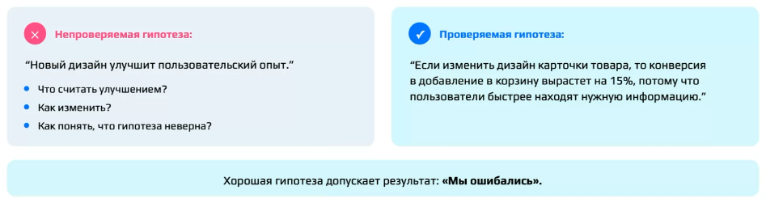

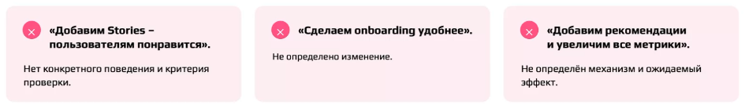

Из нескольких вариантов наиболее проверяемой оказывается та гипотеза, в которой есть все три части. Вот гипотезы участников для кейса доставки:

- «Если показывать стоимость доставки при выборе ресторана, то больше пользователей продолжит оформление заказа, потому что они сразу понимают полную стоимость»;
- «Если в корзине указывать стоимость доставки и сервисный сбор, то больше людей закончит оформление, так как сразу будут видеть итоговую сумму».

Обе формулировки хорошие. Эталонная использует усиленную версию каркаса: «Если показывать **новому пользователю** стоимость доставки уже на этапе выбора ресторана, то **конверсия из выбора ресторана в начало оформления заказа** увеличится, потому что пользователь сможет учитывать полную стоимость раньше и будет реже сталкиваться с неожиданным увеличением цены». Изменение здесь — стоимость показывается раньше, результат — растёт конверсия в начало оформления, механизм — меньше неожиданностей с полной стоимостью. От вариантов участников эталон отличают указанный сегмент и конкретная метрика: конверсия между двумя определёнными шагами.

### Скрытые предположения

Даже аккуратно сформулированная гипотеза опирается на **скрытые предположения** — утверждения, которые должны оказаться правдой, чтобы она сработала. Возьмём гипотезу «повтор заказа в один клик увеличит число повторных заказов». Что в ней спрятано?

- Проблема: повторный поиск действительно мешает, людям правда бывает нужно заказать то же самое ещё раз (Problem hypothesis).
- Ценность: быстрый повтор действительно ценен для пользователя (Value hypothesis).
- Удобство использования: пользователь заметит функцию и поймёт её (Usability hypothesis).
- Поведение: снижение усилий действительно изменит поведение (Behavior / Outcome hypothesis).
- Техническая возможность это реализовать.

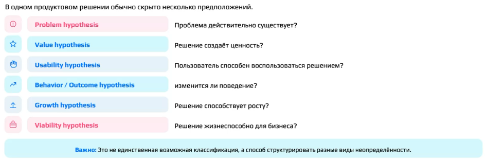

Отсюда главный вывод: одна гипотеза — это несколько неопределённостей, и проверка одной из них не закрывает остальные. Подтверждённая usability ещё не подтверждает Behavior-гипотезу: функцию могут найти и понять, но заказывать чаще не станут. Реальная проблема ещё не значит, что выбранное решение хорошее. Поэтому, разбирая гипотезу (свою или чужую), полезно спрашивать: что должно быть правдой, чтобы это сработало, и какое из этих предположений мы на самом деле проверяем?

[^n8a]: Примечание составителя: в этом примере наблюдаемая связь между входящим сообщением и возвратом может объясняться третьим фактором — размером социального графа, который влияет на обе величины. Отличить такую корреляцию от причинного эффекта позволяет контролируемый эксперимент, например A/B-тест.

## Семинар: user story, критерии приёмки и план проверки

*Таймкод: 02:40:05 · слайды 48–56*

### Стори или гипотеза?

Гипотеза описывает предположение, которое мы хотим проверить. Но когда решение уже принято, его нужно передать в разработку так, чтобы было понятно, что и для кого строится. Для этого служит [**user story**]{.gl key="User story"} (пользовательская история, «стори») — формулировка того, какую возможность и ценность должен получить пользователь. Её формула:

> Как [пользователь], я хочу [возможность], чтобы [ценность].

В английском варианте — *As a [persona], I want [need], so that [value]*. Формула по порядку отвечает на три вопроса: кто? что? зачем? Техническую реализацию в стори не описывают.

По форме стори похожа на job story, но фокус у них разный. Job story («Когда возникает X, я хочу Y, чтобы получить Z») описывает контекст и потребность. User story («Как пользователь X, я хочу Y, чтобы Z») описывает возможность, которую должен предоставить продукт.

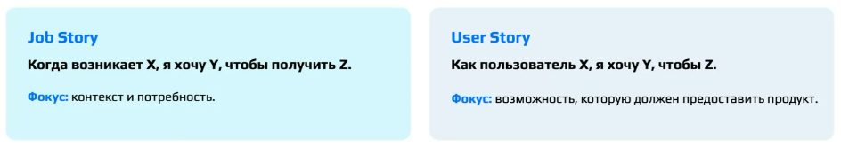

Чаще всего стори путают с гипотезой. Возьмём кейс доставки. «Как пользователь, я хочу видеть стоимость доставки заранее» — это стори. «Если показывать стоимость раньше, больше пользователей продолжат оформление» — это гипотеза. Стори отвечает на вопрос, какую возможность и ценность получает пользователь; гипотеза — какое предположение о результате мы хотим проверить. Простой тест: пользователь не может сказать «я хочу повысить конверсию». Если в формулировке появился бизнес-эффект, это уже не стори.

### Критерии приёмки

К каждой стори пишут два-три **критерия приёмки** — условия, при которых историю считают реализованной. Стори отвечает, что и зачем нужно пользователю, а критерии — что именно должно быть сделано. Через них требование доносится до разработчиков. На этапе формулировки их можно писать достаточно общими словами, не закапываясь в детали.

Для стори «хочу видеть стоимость доставки заранее» годятся, например, такие критерии: стоимость доставки показывается до оформления заказа; она выведена на экран выбора ресторана; цена пересчитывается в реальном времени при изменении корзины; если стоимость показывается баннером, его текст и дизайн согласованы. Эталонный набор выглядит так:

1. Стоимость доставки отображается до перехода к оформлению.
2. Пользователь видит её для каждого доступного ресторана.
3. Если стоимость зависит от условий, это явно обозначено.

**Важно:** частая ошибка — записать в критерии приёмки что-нибудь вроде «конверсия выросла на 5 %». Это не критерий приёмки, а **критерий успеха**. Критерий приёмки говорит о том, что реализовано, а критерий успеха — о том, какой эффект должно дать изменение. Поэтому критерий успеха относится к гипотезе, а не к стори.

Для критериев приёмки есть удобный формат **Given / When / Then**: исходное состояние → действие или событие → что должно произойти. Пример для стори «Как покупатель, я хочу видеть срок доставки на карточке товара, чтобы понимать, когда получу заказ»:

- *Given* — я нахожусь на карточке товара; *When* — товар доступен для заказа; *Then* — отображается предполагаемая дата доставки.
- *Given* — товар отсутствует на складе; *When* — я открываю карточку товара; *Then* — отображается сообщение о сроке поступления.[^n9a]

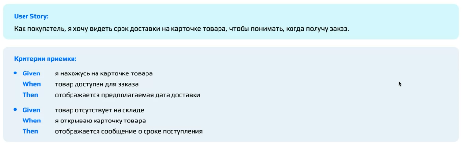

### Качество стори и её место в разработке

Проверить, хорошо ли написана стори, помогает чек-лист **INVEST**: Independent, Negotiable, Valuable, Estimable, Small, Testable — независимая, обсуждаемая, ценная, оцениваемая, небольшая, проверяемая. Это чек-лист качества, а не механическая инструкция.

Стори — средний уровень иерархии **Epic → Story → Task**. Epic — крупная пользовательская возможность («Покупка»). User story — конкретная пользовательская ценность внутри неё («Выбрать способ доставки»). Task — работа для реализации («Разработать UI выбора доставки»). Так стратегия связывается с конкретной разработкой.

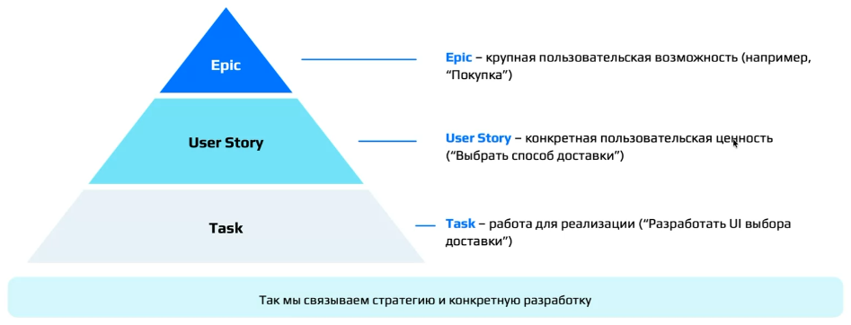

Стори всего продукта раскладывают на карте — это **Story Mapping**. По горизонтали идёт пользовательский путь, по вертикали — детализация, варианты и приоритет реализации. Такая карта помогает видеть продукт целиком, декомпозировать сценарий, определить минимально достаточный набор и спланировать дальнейшее развитие.

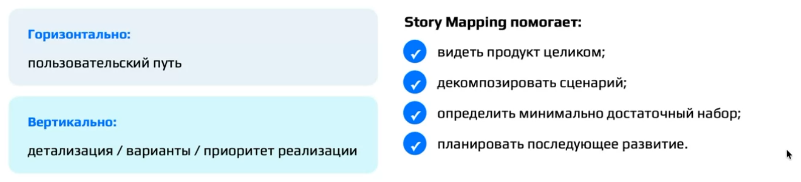

### Как проверять: метод зависит от неопределённости

Универсального лучшего метода проверки не существует: выбор определяется тем, чего мы не знаем. Не знаем, есть ли проблема, — нужно исследование и данные. Не знаем, понятна ли механика, — прототип и usability-тест. Нужен поведенческий сигнал интереса — фейковая дверь. Нужен причинный эффект — A/B-тест, если для него есть подходящие условия.

Чтобы спроектировать проверку, нужно ответить на шесть вопросов:

1. Что сейчас неизвестно?
2. Что хотим узнать?
3. Какой метод используем и почему?
4. Что наблюдаем?
5. Какой результат поддержит предположение? Это и есть критерий успеха.
6. Какой результат заставит пересмотреть предположение?

«Проведём интервью» — это не дизайн проверки: не сказано, какую неизвестность интервью уменьшит. «Запустим A/B» — тоже не ответ. Если у гипотезы о проблеме нет оснований, A/B-тест запускать рано: сначала нужно понять, есть ли проблема вообще. Расписывать всю исследовательскую программу при этом не нужно, достаточно спроектировать первый шаг.

### Разбор: первый шаг проверки барьера

Задача. Мы считаем, что барьер — пользователь не видит итоговую стоимость. Хотим понять, понимают ли пользователи итоговую стоимость и связано ли это с прекращением заказа. Каким будет первый шаг и каким методом?

Удачные ответы опираются на то, что уже есть. Можно посмотреть логи: где пользователи бросают заказ. Можно провести usability-тест: что пользователь видит и как переходит по экранам. Можно провести интервью (CustDev), чтобы понять ход его мысли. Предложение «проверить, вырастет ли конверсия из корзины в заказ, через A/B-тест» на этом шаге не подходит. A/B-тест нужен, когда мы меняем функциональность и хотим сравнить новую версию со старой. Если же функциональность уже изменена и все пользователи перешли на новую версию, сравнение делают по логам на ретроданных.

Эталонный дизайн первого шага:

- **вопрос:** является ли неожиданное появление дополнительных расходов существенным барьером при оформлении;
- **что хотим узнать:** сталкиваются ли пользователи с этим барьером и связан ли он с отказом от продолжения заказа;
- **первый шаг:** анализ поведения по данным и пользовательское исследование.

::: {.qa title="Вопросы из зала"}
**Непонятно, зачем здесь A/B-тест?** На первом шаге он и не нужен. A/B-тест проводят, когда решение уже хотят внедрить и нужно убедиться, что новое решение работает лучше старого. Вопрос «есть ли проблема» им не решается.
:::

### Итог: полный цикл продуктового рассуждения

На кейсе доставки мы прошли весь цикл продуктового рассуждения:

1. построили полный CJM;
2. поняли пользователя, его джобы и путь;
3. отделили наблюдение от интерпретации;
4. сформулировали барьеры и возможности;
5. рассмотрели несколько решений;
6. сформулировали гипотезы и стори;
7. выбрали способ проверки.

Короче всего эту цепочку можно записать как CJM → гипотеза → user story. CJM помогает найти проблему («пользователи не понимают итоговую стоимость заказа»). Гипотеза позволяет проверить решение («если показать итоговую стоимость раньше, конверсия вырастет, потому что пользователи чаще отказываются на финальном шаге»). User story помогает реализовать ценность («как покупатель, я хочу видеть полную стоимость до оплаты, чтобы принимать решение осознанно»). Приоритизацию гипотез в разборе пропустили: кейс изучен слишком поверхностно, чтобы честно оценивать гипотезы.

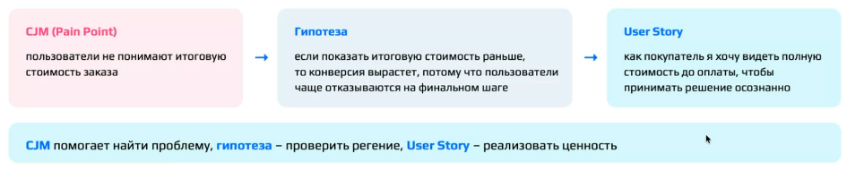

**Акцент лектора:** сильное решение — не самое эффективное. Сильное решение — то, для которого команда может объяснить всю логическую цепочку и честно показать, где заканчивается знание и начинается предположение.

[^n9a]: Примечание составителя: второй критерий в примере описывает не основной сценарий, а то, что продукт показывает, когда условие не выполнено; ту же роль в кейсе доставки играет третий критерий («если стоимость зависит от условий, это явно обозначено»). В формате Given / When / Then его можно записать так: *Given* — стоимость доставки зависит от условий; *When* — я выбираю ресторан; *Then* — рядом со стоимостью указано, от чего она зависит.

## Вопросы в конце занятия

*Таймкод: 02:51:45 · слайды —*

Следующая лекция посвящена метрикам, и дальше мы будем рассуждать уже в терминах метрик. Без понимания метрик и умения построить дерево метрик не получится ни проводить A/B-тесты, ни проверять гипотезы.

::: {.qa title="Вопросы из зала"}
**Чем продуктовая аналитика в IT отличается от продуктовой аналитики в другой сфере, например в строительстве?** Инструменты и hard skills те же самые. Различаются специфика отрасли и то, что конкретная компания понимает под продуктовой аналитикой. Чётких границ у профессии нет: если бы все компании одинаково определяли функционал аналитика, разница сводилась бы к специфике отрасли, но на деле многое зависит от того, что компания вкладывает в эту должность.

**Если попасть на стажировку в IT-компанию, придётся ли самим строить CJM, писать Jobs to Be Done и user stories, или этим занимаются более опытные специалисты?** Дело не в опыте: этим обычно занимаются специалисты другого профиля — команда исследований. Но аналитику всё равно придётся работать с этими артефактами, поэтому у него в голове должна быть картина мира: почему пользователь поступает так или иначе. Виртуозно владеть этими инструментами не обязательно, а базовое понимание нужно.

**Есть ли смысл во второй магистратуре?** Учиться стоит, чтобы расширять кругозор, но только если изученное потом применяется на практике, а не ради самого обучения. При этом специализированные курсы часто оказываются намного эффективнее двух лет магистратуры — многое зависит от конкретной программы.
:::

## Главное из лекции {.unnumbered}

::: keypoints
1. Гипотез всегда больше, чем ресурсов, поэтому их **приоритизируют**. ICE (Impact × Confidence × Ease) годится для быстрого относительного сравнения, RICE ((Reach × Impact × Confidence) / Effort) — когда известен масштаб аудитории. Гибкий скоринг позволяет задать свои критерии и веса под стадию продукта.
2. Скор не равен истине. Разница в 70 и 72 балла лежит в пределах погрешности субъективных оценок. Юридические и стратегические ограничения формула не видит, а самый полезный результат скоринга — расхождение оценок между участниками.
3. Проверить гипотезу — не значит доказать её. Мы получаем наблюдение и обновляем уверенность, а критерии «что усилит, что ослабит, когда данных мало» задаём заранее.
4. Метод проверки выбирается под конкретную неопределённость, а не по принципу «чем сложнее, тем надёжнее». Есть ли проблема — исследования и данные; понимают ли решение — usability-тест; есть ли интерес — фейковая дверь или «волшебник страны Оз»; есть ли причинный эффект — A/B-тест при подходящих условиях.
5. A/B-тест оценивает причинный эффект относительно контрфактического сценария, но не объясняет механизм. Он требует корректного дизайна, метрики, рандомизации и трафика и подходит не для каждой функции.
6. Продуктовая работа — цикл обучения, а не конвейер: пользователь и джоб → CJM → барьеры → причина → возможности → решения → гипотеза и user story → приоритизация → тест → наблюдение → решение, с возвратом к любому шагу.
7. CJM строится по шагам пользователя к цели, а не по экранам продукта. Она начинается с возникновения потребности, имеет явные границы и опирается только на данные: пустая ячейка честнее выдуманной.
8. Наблюдение, интерпретация и причинная гипотеза — три разных уровня утверждений. Возможность лежит между барьером и решением и должна допускать несколько способов реализации.
9. Хорошая гипотеза записывается по каркасу «если … то … потому что», в ней есть сегмент, изменение, измеримый результат и механизм, и её можно опровергнуть. Внутри одной гипотезы обычно скрыто несколько предположений (проблема, ценность, удобство, поведение).
10. User story описывает ценность для пользователя («как …, я хочу …, чтобы …»), критерии приёмки — что должно быть реализовано. Бизнес-эффект вроде «конверсия +5 %» — это критерий успеха гипотезы, а не стори.
:::

## Что подчеркнул лектор {.unnumbered}

::: emphasis
- Скоринг — способ структурировать разговор в команде, а не вычислить ответ. Перед оценкой договоритесь о шкалах и основаниях, а гипотезы в пределах согласованной погрешности считайте равноценными.
- Не ходите в эксперимент, чтобы «доказать», что фича работает: такая команда будет трактовать неоднозначные результаты в свою пользу.
- Из последнего пункта чек-листа готовности: если команда запустит фичу при любом исходе, проверка — ритуал, а не источник знания.
- Математическая статистика — обязательный hard skill продуктового аналитика. Метрики — тема следующей лекции, без неё не получится ни A/B-тестов, ни проверки гипотез.
- Не превращайте название плохой метрики в диагноз: «пользователи не совершают заказ» — симптом, а не причина.
- Не добавляйте в Persona и CJM того, чего нет в данных («устал», «экономный», «тревожится», «не прошла оплата»). Правдоподобное — ещё не знание.
- Этапы CJM — логические шаги пользователя, а не экраны: «регистрация» и «скачивание из стора» этапами не являются.
- Сильное решение — не самое эффективное, а то, для которого команда может объяснить всю цепочку рассуждения и честно показать, где кончается знание и начинается предположение.
:::

## Стоит посмотреть в видео {.unnumbered}

::: watch
- **≈00:47–00:51** — схема «весь путь продуктовой гипотезы» с петлёй обратной связи и разбор кейса AI summary: слайдов этой части в PDF нет.
- **≈01:09–01:19** — эталонная мини-Persona и разбор ответов участников: таблица показывалась на экране.
- **≈01:45–02:17** — заполнение CJM доставки ужина в общей таблице: этапы, барьеры по этапам и сверка с эталонной картой видны только на экране.
- **≈02:19–02:21** — упражнение «наблюдение / интерпретация / причинная гипотеза»: утверждения А и Б вслух не зачитаны.
- **≈02:34–02:38** — варианты гипотез А–Г и эталонная формулировка гипотезы для кейса доставки.
- **≈02:40** — упражнение «стори или гипотеза»: четыре формулировки только на экране.
:::

## Глоссарий {.unnumbered}

| Термин | Коротко |
|:----------|:--------------------------------------------|
| **Приоритизация гипотез** | Выбор очерёдности проверки гипотез при ограниченных ресурсах |
| **Скоринг** | Оценка гипотез по нескольким критериям со сведением в один балл (скор) |
| **Reach** (охват) | Сколько пользователей или событий затронет изменение за заданный период |
| **Impact** (импакт) | Насколько сильным ожидается эффект изменения |
| **Confidence** (конфиденс) | Насколько мы уверены в исходных предположениях и оценках |
| **Effort** (эффорт) | Сколько ресурсов потребуется на изменение |
| **Ease** | Насколько легко и быстро проверить и реализовать гипотезу |
| **ICE** | Скоринг по Impact, Confidence и Ease (или Effort); быстрый и субъективный |
| **RICE** | Скоринг (Reach × Impact × Confidence) / Effort; учитывает масштаб аудитории |
| **Гибкий скоринг** | Скоринг с критериями и весами, которые команда задаёт под свой контекст |
| **Расхождение оценок** | Разные оценки одной гипотезы у участников; сигнал о разном понимании данных |
| **Проверка гипотезы** | Получение наблюдения, которое обновляет уверенность, а не доказывает идею |
| **Attitudinal data** | Данные о том, что человек думает, считает и чувствует |
| **Behavioral data** | Данные о том, что человек фактически делает |
| **Смещённая выборка** | Выборка, перекошенная в сторону какой-то группы и поэтому не репрезентативная |
| **Интервью** | Метод, который объясняет, почему пользователь поступает так или иначе и в каком контексте |
| **Usability-тест** | Метод, который показывает, где возникают проблемы взаимодействия с решением |
| **A/B-тест** | Эксперимент со сравнением групп с изменением и без; оценивает причинный эффект |
| **Фейковая дверь (fake door)** | Вход в несуществующую функцию; клики измеряют реальный интерес |
| **Волшебник страны Оз (Wizard of Oz)** | Функция выглядит автоматической, но за кулисами её выполняют люди |
| **Контрфактический сценарий** | То, что происходило бы без изменения; в A/B-тесте его показывает контрольная группа |
| **Чек-лист готовности гипотезы** | Десять вопросов, на которые нужно ответить до запуска проверки |
| **Путь продуктовой гипотезы** | Цикл от исследования пользователя до продуктового решения с возвратами к любому шагу |
| **Core-пользователи (core-аудитория)** | Ядро аудитории продукта на данный момент |
| **Целевая аудитория** | Все потенциальные пользователи продукта, включая нынешних |
| **Evidence** | Наблюдения и данные о пользователях |
| **Pain point** (точка боли) | То, что мешает пользователю добиться цели |
| **Opportunity** | Возможность: направление улучшения, в котором продукт может снять боль |
| **Симптом** | Наблюдаемый результат (например, низкая конверсия), за которым могут стоять разные причины |
| **Persona** | Модель характерного пользователя и его контекста, построенная на данных |
| **Потребность** | Результат, который человеку нужно получить |
| **Решение** | Конкретный способ устранить проблему; потребность можно закрыть многими решениями |
| **Джоб (job)** | Прогресс или задача, которую человек пытается совершить |
| **Jobs to Be Done (JTBD)** | Подход: продукт выбирают, чтобы совершить прогресс в конкретной ситуации |
| **Job story** | «Когда [ситуация], я хочу [действие], чтобы [результат]» |
| **CJM (Customer Journey Map)** | Визуальная модель пути пользователя к определённой цели |
| **Границы CJM** | Кто пользователь, в какой ситуации, какая цель, где путь начинается и заканчивается, какие каналы включены |
| **Этапы пути** | Логические шаги пользователя к цели, а не экраны продукта |
| **Точки контакта (touchpoints)** | Места взаимодействия пользователя с продуктом или брендом, в том числе вне интерфейса |
| **Барьер** | Конкретная проблема на пути, которая мешает достичь цели (pain point) |
| **Moments of Truth** | Точки пути, которые непропорционально сильно влияют на восприятие продукта |
| **Наблюдение** | Что мы видели или заметили |
| **Интерпретация** | Что наблюдение может означать |
| **Причинная гипотеза** | Предположение о том, почему это происходит |
| **Problem Space / Solution Space** | Пространство проблемы (кто, где, что мешает) и пространство решений (что и как изменить) |
| **Продуктовая гипотеза** | Проверяемое предположение о том, как изменение повлияет на пользователя или результат, и почему |
| **IF / THEN / BECAUSE** | Каркас гипотезы: «если [изменение], то [результат], потому что [механизм]» |
| **Скрытые предположения** | Утверждения, которые должны быть правдой, чтобы гипотеза сработала |
| **User story** | «Как [пользователь], я хочу [возможность], чтобы [ценность]» |
| **Критерии приёмки** | Условия, при которых user story считается реализованной |
| **Критерий успеха** | Какой эффект должно дать изменение; относится к гипотезе, а не к стори |
| **Given / When / Then** | Формат критерия приёмки: исходное состояние → событие → результат |
| **INVEST** | Чек-лист качества стори: Independent, Negotiable, Valuable, Estimable, Small, Testable |
| **Epic → Story → Task** | Иерархия: крупная возможность → конкретная ценность → работа для реализации |
| **Story Mapping** | Карта стори: по горизонтали путь пользователя, по вертикали детализация и приоритет |
