::: {.abstract title="О чём лекция"}
В прошлых лекциях речь шла о пользователе, его задачах и гипотезах. Эта лекция о том, как гипотезу проверить, то есть как превратить продуктовый вопрос в измеримый показатель. Она отвечает на вопросы: что такое продуктовая метрика и чем она отличается от просто числа, как от ценности для пользователя перейти к его поведению и к метрике, чем результат отличается от диагностики и защитных показателей, какие бывают метрики аудитории, вовлечённости, конверсии и удержания (DAU, retention, воронка), как связаны пользовательская ценность и деньги (ARPU, LTV, GMV), зачем нужны когорты и сегменты, North Star Metric, guardrails и дерево метрик, как не ошибиться при интерпретации изменений и как собрать набор метрик для конкретной гипотезы. Сквозной пример — гипотеза о показе стоимости доставки до выбора ресторана; почти все темы проиллюстрированы примерами из мессенджера MAX и сервисов доставки. Формулы простые, специальной подготовки не требуется.

Лекция идёт около трёх часов, перерыв примерно с 01:30 до 01:45; около 02:01–02:05 у лектора прерывалась связь. Организационной части почти нет, заметную долю времени занимают интерактивы и вопросы из чата. Содержательные ответы вплетены в разделы и выделены серыми блоками — при беглом чтении их можно пропустить. Схемы и таблицы со слайдов приведены прямо в тексте. Сноски «Прим. составителя» — пояснения, которых не было в лекции.
:::

## Зачем нужны метрики

*Таймкод: 00:00:02 · слайды 1–7*

Мы уже разобрали, кто такой пользователь, какую задачу он решает и как сформулировать гипотезу. Следующий шаг — понять по данным, сработало ли решение, стало ли пользователю лучше и насколько здоров продукт в целом. Заучивать список показателей не нужно: специального словаря здесь не будет, и все метрики на свете мы не рассмотрим — только основные, остальные придут с опытом. Учимся другому: выбирать измерение под конкретный вопрос и объяснять, почему оно подходит.

План такой. Сначала свяжем метрики с ценностью для пользователя и для бизнеса. Затем посмотрим, какие показатели подходят разным этапам взаимодействия с продуктом, и разберёмся, чем отличаются метрики, которые фиксируют результат, помогают найти причину и защищают от побочного вреда. Дальше поймём, зачем метрики собирают в систему. В конце обсудим, как интерпретировать изменение показателя и что проверить, прежде чем делать вывод о его причинах: сезонность, изменения в данных, состав аудитории, качество данных. Решение о продукте должно опираться на понятное свидетельство, и метрика — мост от гипотезы к проверяемому шагу.

### Гипотеза без измерения остаётся ожиданием

Через весь курс проходит гипотеза из сервиса доставки еды: «Если показать стоимость доставки до выбора ресторана, больше новых пользователей продолжат оформление заказа, потому что заранее увидят полную стоимость». В ней есть изменение, ожидаемое поведение и объяснение. Но «стало удобнее» объясняет замысел, а не задаёт критерий проверки. Нужно решить, какое наблюдаемое событие покажет, что люди действительно продолжили путь: начало оформления, оплата или доставка — это не одно и то же.

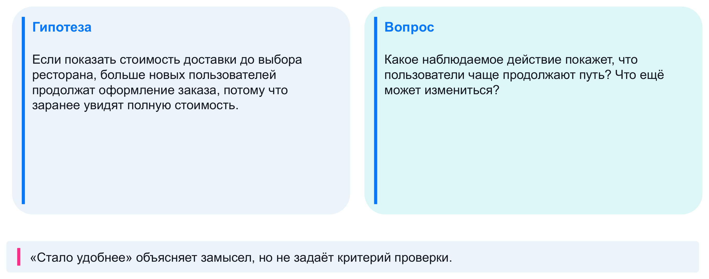

Если спросить группу, что здесь мерить, ответы разойдутся: оплата, оформленный заказ, средний чек, число людей, завершивших оплату, среднее время. Но большинство вариантов сводится к одному: новый пользователь дошёл до заказа и оплатил его. Хороший вариант — и повторный заказ: новый пользователь вернулся и заказал снова. К возвращаемости мы ещё придём.

### Что называют продуктовой метрикой

**Продуктовая метрика** — количественно определённый показатель состояния продукта, поведения пользователей или результата продуктового изменения. Ключевые слова здесь — «количественно определённый»: если два аналитика по-разному понимают, кого и что считать, единой метрики нет.

**Показатель** сам по себе — это просто число, которое можно получить из данных: открытия экрана, API-запросы, клики. Такое число бывает полезно для технической диагностики, но само по себе не доказывает пользовательскую ценность. Польза числа зависит от вопроса, на который оно помогает ответить. Число активных пользователей за день отвечает на вопрос «сколько людей пользовались продуктом в этот день». Число открытий экрана тоже говорит о какой-то активности, но ни на какой вопрос не отвечает, если только вопрос не звучит буквально «сколько раз сегодня открыли экран». Обычно такие числа рассматривают как шаги пути пользователя к цели. Отсюда порядок: сначала задаём вопрос, потом решаем, какой показатель даст полезное свидетельство.

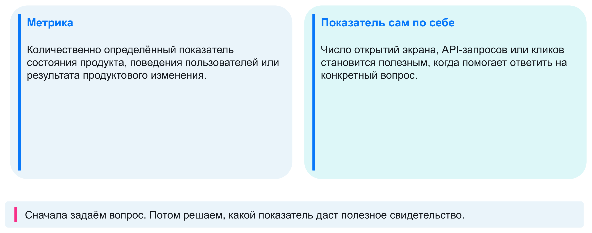

Выбор метрики идёт в четыре шага:

1. **Вопрос** — что хотим понять?
2. **Поведение** — что делает пользователь, когда получает ценность?
3. **Определение** — кого и какое событие считаем, за какой период?
4. **Метрика** — как сведём наблюдения в показатель?

Логика начинается с продукта, а не с таблиц и событий. Никогда не начинаем с «у нас есть таблица, давайте посчитаем что-нибудь по такому-то столбцу». Возьмём вопрос «Стало ли проще оформить заказ?». Он слишком широк, и его нужно декомпозировать: кого считаем, какое действие означает успешное оформление, как детализировать результат.

### Рост метрики может означать разное

Вы записываете кружочек или голосовое, а оно не отправляется с первого раза. Вы раздражаетесь, а поделиться новостями с подругой нужно срочно. Время в приложении выросло — значит ли это, что стало лучше? Ни разу.

Одна и та же метрика бывает хорошей или плохой в зависимости от продукта. В видеосервисе рост времени в приложении может означать, что люди смотрят больше интересного контента. В такси он, скорее всего, означает долгое ожидание машины, а в банке — сложный интерфейс и лишнее трение. С кликами то же самое: их стало больше, потому что функцией активнее пользуются или потому что приходится чаще исправлять ошибки интерфейса. Хорошее это изменение или плохое, решает контекст использования.

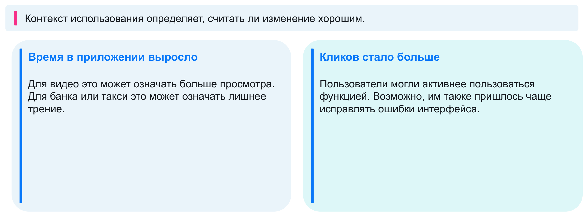

**Важный вывод:** каждый раз выясняем, какую задачу решает пользователь и почему показатель мог измениться. Метрика — только симптом, а не объяснение ситуации. Поэтому состояние продукта оценивают не по одной метрике, а по системе связанных показателей — к ней мы ещё вернёмся.

## От ценности к измерению

*Таймкод: 00:09:55 · слайды 8–14*

Главный вопрос этого блока: какое поведение пользователя показывает, что продукт ему действительно помогает? Ответ на него удобно искать, двигаясь от пользы для человека к числу, которое мы будем считать.

### Три уровня: ценность, поведение, метрика

Мыслить здесь удобно тремя уровнями — **ценность → поведение → метрика**. **Ценность** — то, что получает человек (клиент, заказчик) от продукта. **Поведение** — то, что он делает, когда эту ценность получает. **Метрика** — способ сделать это действие измеримым, то есть как мы это поведение посчитаем.

Возьмём навигационное приложение (карты). Ценность для пользователя — добраться до нужного места. Поведение, в котором эта ценность проявляется, — он завершает маршрут. Метрика — доля начатых маршрутов, по которым пользователь действительно прибыл в точку назначения.

**Важно:** метрика всегда описывает ценность лишь *приближённо*. Поэтому нужно понимать её ограничения: мы ищем показатель, достаточно близкий к ценности и при этом полезный для принятия решения.

### Пример: мессенджер

Ценность мессенджера — общаться с нужными людьми и получать ответ. Первое, что приходит в голову, — считать общее число сообщений. Но это плохая метрика: число сообщений может расти по причинам, никак не связанным с пользой. Это могут быть автоматические системные сообщения — вроде «ваша учительница зарегистрировалась в MAX» или «эй, теперь я в MAX», — повторные сообщения или просто задублированные данные. Общее число сообщений не показывает, была ли коммуникация полезной.

Гораздо ближе к ценности **активные диалоги** — те, где есть сообщения от обеих сторон: и от меня, и от моего собеседника. Подойдут также доля пользователей с двусторонней коммуникацией и удержание отправителей (возвращаются ли люди, которые пишут сообщения). При этом заранее нужно договориться, что именно считается активным диалогом. Это снова возвращает нас к исходному правилу: прежде чем что-то считать, спрашиваем себя, какую ценность хотим измерить.

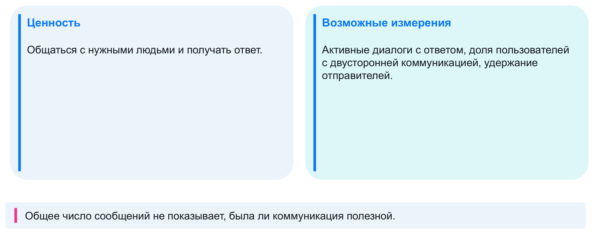

### Пример: доставка еды

Ценность доставки — получить подходящую (а лучше любимую) еду за приемлемое время и по понятной цене. Создание заказа — очень важный шаг, но ещё не ценность: заказ могут отменить, ресторан может его не принять, курьер может опоздать. Поэтому полезно смотреть на успешно доставленные заказы, отдельно — на отмены (долю заказов без отмены) и отдельно — на повторные заказы.

Повторный заказ хорошо показывает, остался ли новый пользователь доволен: мало того что он оплатил заказ — он вернулся. Но и здесь есть тонкость. Повторы не всегда говорят об удовлетворённости: человек может по своей природе и потребностям заказывать еду редко. Поэтому частоту повторов нужно сравнивать с **ожидаемым циклом** продукта — то есть смотреть на повторный заказ в том интервале, в котором его естественно ждать для этого продукта.

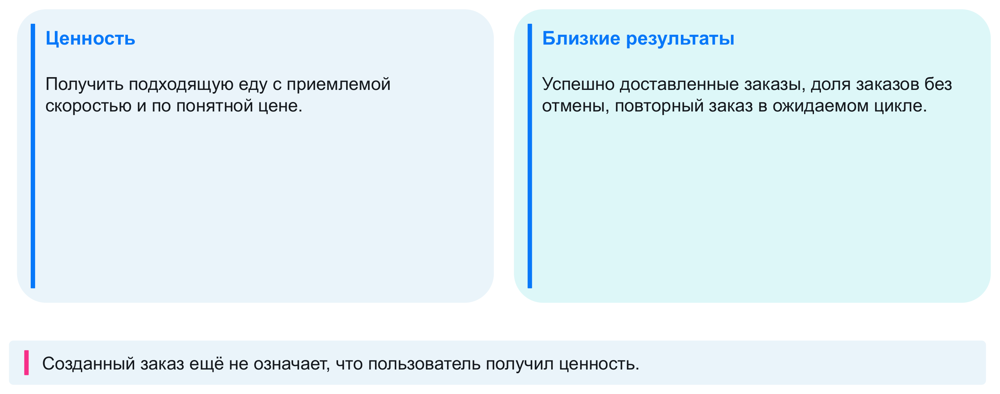

И ещё одно следствие: если мы меняем флоу, то есть пользовательский путь, систему метрик тоже нужно пересматривать.

### Пример: маркетплейс

На маркетплейсе путь пользователя выглядит так: поиск → просмотр карточки товара → корзина → оплата → получение заказа. Просмотр карточки и добавление в корзину показывают лишь промежуточный интерес: пользователь может передумать или вообще уйти — скажем, из Ozon в Wildberries — и заказать там. Полученный товар гораздо ближе к решённой задаче.

Отсюда различие двух видов показателей. **Итоговая метрика** (метрика результата) фиксирует событие, ближайшее к полученной ценности, — здесь это полученный заказ. **Промежуточные показатели** описывают шаги пути до этого события: поиск, карточка, корзина, оплата. Если мы меняем поиск или другие ранние шаги, именно по промежуточным показателям видно, где путь ломается. Итоговая метрика и промежуточные показатели не конкурируют — они отвечают на разные вопросы: для ранней диагностики нужны шаги пути, для оценки результата — итоговое событие.

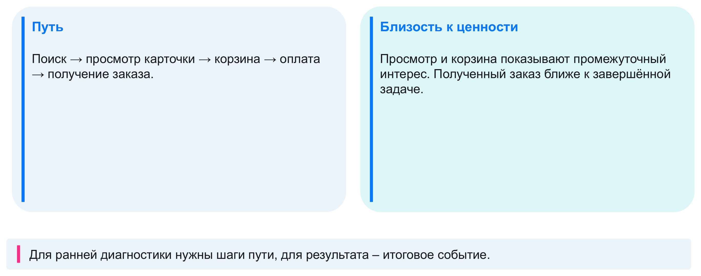

Это различие часто проверяют на собеседованиях продуктовых аналитиков. В MAX, например, дают кейсы из совсем других направлений, в том числе про Ozon, — чтобы посмотреть, насколько широко кандидат мыслит. Типичная ошибка выглядит так. Задача — измерить качество поиска товаров: пользователь заходит на маркетплейс и вводит в строку поиска «корм для кошки». А кандидат предлагает мерить выдачу заказов в ПВЗ (пунктах выдачи заказов). Связь, конечно, есть: чтобы дойти до заказа, нужно сначала что-то найти. Но такая метрика слишком далека от изменения, которое мы оцениваем, и в большинстве случаев это проблема. Продуктовый аналитик должен оперировать метриками на каждом этапе пользовательского пути и уметь декомпозировать этот путь, чтобы понять, где именно возникает проблема.

### Задание: такси и мессенджер

Проверим себя. Есть два продукта и по три показателя для каждого:

- сервис такси: открытия приложения, поиски адреса, завершённые поездки;
- мессенджер: открытия, отправленные сообщения, активные диалоги с ответом.

Для каждого продукта нужно выбрать итоговую метрику — ту, что ближе всего к полученной пользователем ценности, а остальные оставить для диагностики. Можно предложить и свои промежуточные показатели.

Под диагностикой здесь понимаются показатели, которые идут *до* получения ценности: логические шаги пользовательского пути, помогающие найти проблему на одном из этапов. Само слово «диагностика» в продуктовой аналитике употребляется нечасто, но суть простая — мы «прощупываем» путь пользователя до итога.

**Такси.** Итоговая метрика — **завершённые поездки**. Для диагностики пути подходят поиски адреса, запрос поездки, назначение водителя, ожидание подачи, отмены; полезны и показатели времени и соотношений, например доля отменённых заказов от общего числа. Очень важно заранее определить, что считать завершённой поездкой: поездка состоялась и не была отменена — или пассажир доехал прямо до нужной точки? Бывает, что человек устаёт ехать, выходит где-то на середине пути и идёт к метро пешком. Завершена ли такая поездка — вопрос определения, и его нужно решить до того, как считать.

На «поисках адреса» стоит остановиться. В таком виде это не количественная величина и не очень похоже на метрику: непонятно, что с ней делать. Из поиска нужно извлечь что-то измеримое, например:

- отношение числа поисков к итоговому заказу;
- частоту захода в поиск и количество введённых запросов;
- количество перезапросов и пустых выдач;
- сколько раз пользователь исправлял адрес (так проверяется, хорошо ли работает автоопределение);
- время ожидания и отмены поездки на этапе поиска адреса.

**Мессенджер.** Итоговая метрика — **активные диалоги с ответом**. Считать их можно по-разному: как долю активных диалогов с ответом от всех диалогов, как абсолютное число активных диалогов по всему мессенджеру или в расчёте на одного пользователя. Открытия и отправленные сообщения — промежуточные показатели. Для диагностики подойдут создание сообщения, его отправка, доставка, прочтение, удаление, получение ответа — и всё, что с этим может быть связано.

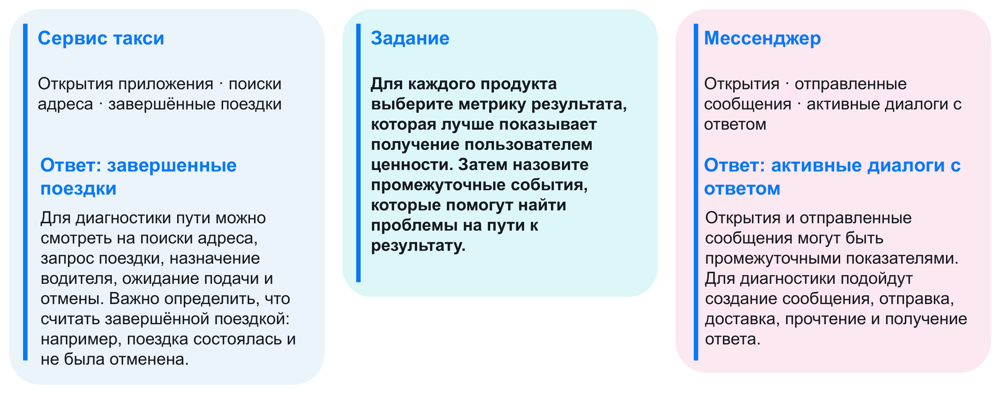

## Результат, диагностика и защита

*Таймкод: 00:21:40 · слайды 15–20*

До сих пор мы выбирали, как измерить, что пользователь получил ценность. Теперь вопрос другой: что именно говорит нам показатель и как не объявить успех по одному-единственному числу. Иначе говоря, как отличить факт активности от полезного изменения? Сначала отделим объём работы, которую проделала система, от пользы, которую получил пользователь. Затем разберём, в каких ролях выступают метрики: метрики результата, диагностические метрики и защитные метрики, которые ловят побочные эффекты. Защитные метрики здесь только назовём, подробно они разбираются в теме «North Star Metric и guardrails».

Может показаться, что многие метрики здесь слишком простые, вроде числа заходов в приложение. Так и бывает на практике: не всё должно быть сложным. Продуктовый аналитик измеряет конкретное действие или конкретную проблему, и часто для этого хватает метрики куда проще модной аббревиатуры.

### Output и outcome

**Output** показывает, что произвела система или сколько пользователей коснулись функции: отправленные уведомления, показанные экраны, созданные отчёты, созданные AI-сводки. **Outcome** показывает, что изменилось для самого пользователя: он вернулся к диалогу, быстрее выполнил задачу, успешно завершил заказ. Первое описывает работу системы, второе описывает ценность для пользователя.

**Важный вывод:** система может проделать огромный объём работы и не дать пользователю ожидаемого результата. Высокий output может не привести к ожидаемому outcome. Миллион отправленных уведомлений не равен миллиону полезных взаимодействий: можно разослать кучу пушей, но это не значит, что пользователи вернутся.

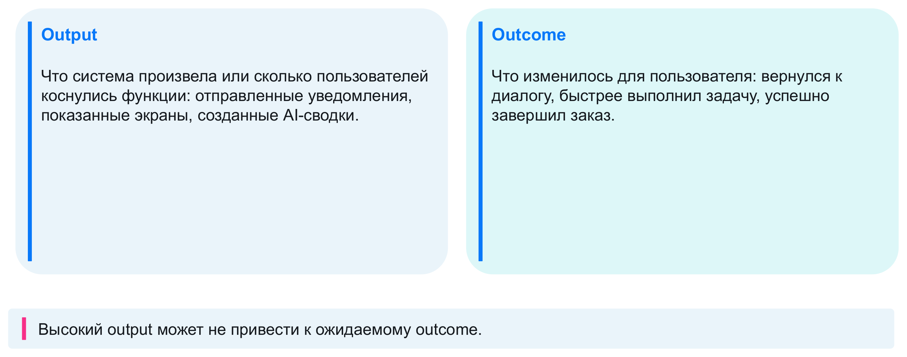

Попробуйте придумать пару output и outcome для знакомого вам продукта. Несколько удачных примеров:

- «отправлено 5000 пушей» — это output, а «250 пользователей перешли в приложение и совершили покупку» — outcome;
- «показано 20 000 экранов с картой» — output, «пользователь завершил заказ» — outcome;
- если компания сама публикует рекламные посты или заказывает их у блогеров, то число постов — output: система «произвела» их, чтобы привлечь людей. Outcome здесь — рост числа кликов, то есть реакция пользователей.

### Пример: путь push-уведомления

Push — короткое сообщение, которое приложение присылает на телефон или другое устройство. Его путь проходит четыре этапа: **отправлено** (сообщение поставлено в отправку) → **доставлено** (устройство его получило) → **открыто** (пользователь перешёл по нему) → **действие** (пользователь выполнил целевое действие). Каждый этап помогает диагностировать предыдущий, но к outcome приближается только последний: целевое действие.

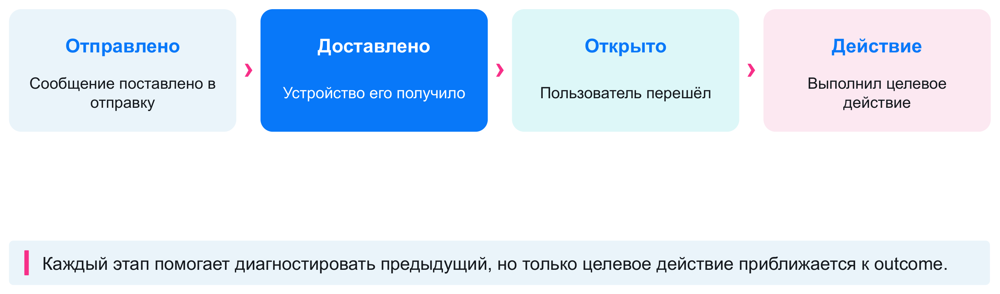

Так выглядит диагностика на практике. Если открытий мало, сначала проверяем доставляемость: дошли ли пуши вообще. Если с доставкой всё в порядке, смотрим на тексты и на аудиторию. Проблема может быть в самой коммуникации: пуш непонятен, человеку неясно, зачем заходить в приложение. Или пуш ушёл не тем людям: если ВкусВилл присылает скидку на продукты, которые вам неинтересны, вы просто не его аудитория для этой рассылки и переходить не станете.

**Акцент лектора:** смотреть нужно и на системную, и на пользовательскую сторону, потому что проблема может быть на любой из них. Каждый этап диагностируется отдельно.

### Метрика результата и диагностические метрики

Метрика результата (по сути, итоговая метрика в этой роли) отвечает на вопрос, изменился ли исход, ради которого команда меняла продукт. **Диагностические метрики** показывают, на каком шаге пути или у какой группы пользователей могло возникнуть изменение.

Допустим, мы упростили оформление заказа. Метрика результата: доля пользователей, которые начали оформление и успешно оплатили заказ. Диагностические метрики: переходы между шагами оформления, ошибки оплаты, доля отказов на каждом шаге, разрезы по устройствам и типам пользователей. Если доля успешно оплативших почти не выросла, это ещё не значит, что оформление стало сложнее или не понравилось пользователям. Возможно, на одном из этапов что-то ломается, и это место нужно найти.

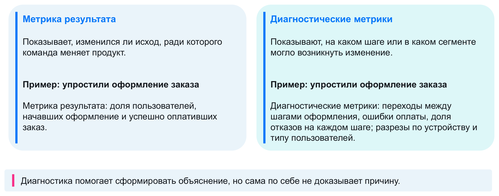

**Важно:** диагностика помогает построить объяснение, но сама по себе не доказывает причину.

### Task success rate

Одна из самых распространённых метрик пользовательского результата — **task success rate** (успешность задачи), доля успешно выполненных пользовательских задач:

$$
\text{Task success rate} = \frac{\text{успешно завершённые подходящие попытки}}{\text{все подходящие начатые попытки}} \times 100\%
$$

Подходящие попытки — те, что относятся к измеряемой задаче. Например, из 100 начатых попыток перевести деньги 80 закончились зачислением, значит task success rate равен 80%. Метрикой пользуются в самых разных продуктах, от рекламы до мессенджера.

Заранее нужно зафиксировать три вещи:

- **критерий успеха**: что именно считаем успешным результатом;
- **единицу счёта**: попытки или уникальных пользователей. Если считаем попытки, повторный старт той же задачи — ещё одна попытка; если пользователей, каждого человека считаем один раз;
- **дополнительные показатели**: время до результата, ошибки, повторные попытки, всё, с чем пользователь мог столкнуться. Они показывают, насколько легко он достиг цели.

Делать это нужно после того, как определены пользовательская задача и критерий её успеха, но до настройки сбора данных: сначала решаем, что считаем успехом, потом выбираем показатель и события для его расчёта. При этом быстрее не всегда значит лучше: скорость стоит оценивать вместе с качеством результата.

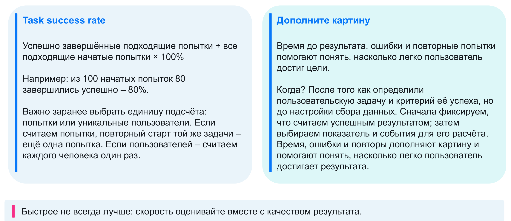

### Пример: упала доля завершённых заказов

В сервисе доставки снизилась доля подходящих пользователей, завершивших заказ. Это метрика результата, и она сообщает только факт падения. Дальше в дело идёт диагностика: проходим по шагам (выбор ресторана, корзина, оформление, оплата, отмена) и сравниваем разные группы пользователей. Параллельно проверяем сами данные: одинаково ли записываются события и от одной ли базы считаются доли до и после.

Допустим, оформление стали начинать больше людей, а оплачивать меньше. Причиной может быть неожиданная цена или ошибка оплаты. Сначала выясняем, на каком шаге пользователи стали чаще уходить (например, при вводе адреса или при оплате), и потом работаем с этим шагом.

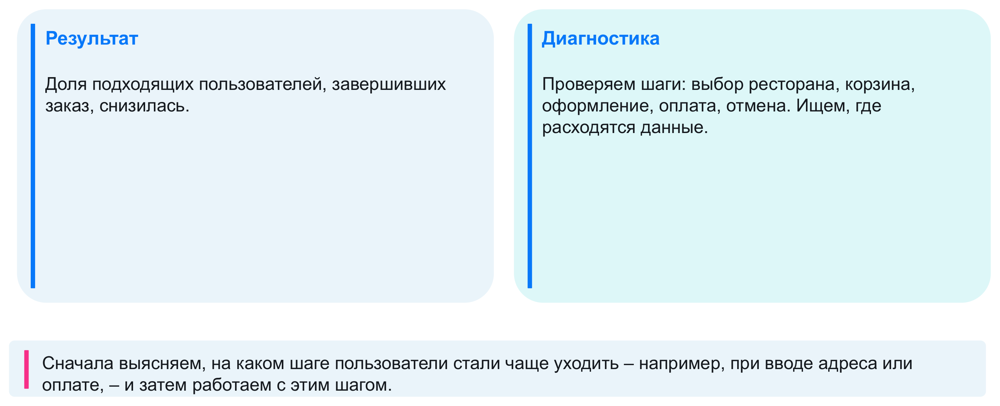

**Важный вывод:** пошаговый разбор пути показывает, где мы теряем пользователей, но не объясняет почему. Для объяснения нужны дальнейшие проверки.

Пример из MAX. Пользователям отправили коммуникацию с предложением обновить приложение, разложили их путь по шагам и увидели, что большинство отваливается на втором шаге. Это ответило на вопрос «где», но не на вопрос «что произошло». Дальше пришлось разбираться со вторым шагом: может быть, что-то сломалось, лендинг не показывался или слишком долго грузился.

::: {.qa title="Вопросы из зала"}
**Есть ли у компании данные о том, что пользователь заблокировал пуши?** Да. В MAX такие данные есть, и в большинстве сервисов, скорее всего, тоже: это базовая настройка, и она хранится по каждому пользователю. На ней строится отдельная метрика: доля пользователей, разрешивших пуши.
:::

## Метрики аудитории: DAU, WAU, MAU и паспорт метрики

*Таймкод: 00:31:41 · слайды 21–24*

### DAU, WAU, MAU: кого считать активным

Самая базовая метрика, которой оперируют абсолютно все продукты, — число активных пользователей. **DAU** (daily active users) — число уникальных людей, которые были активны в данный день; **WAU** (weekly active users) — то же за неделю; **MAU** (monthly active users) — за месяц. Это именно число людей, а не действий: человек, который за день зашёл в приложение десять раз, даёт в DAU единицу.

Главное в этих метриках — договориться, что считается активным действием. В мессенджере MAX, например, общий DAU — это люди, которые хотя бы зашли сегодня в мессенджер. Но можно посчитать и DAU переписки: тех, кто сегодня читал или писал сообщения в личных и групповых чатах. Обе метрики называются DAU, а аудитории у них разные.

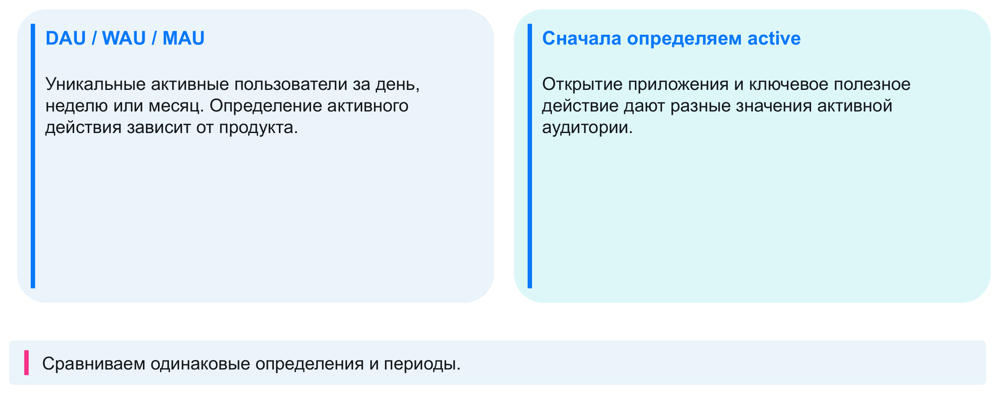

### Упал DAU: что мы знаем и чего не знаем

Допустим, DAU снизился. Что мы знаем наверняка? Что число уникальных активных пользователей в день уменьшилось **при выбранном определении активности** — то есть при той договорённости о том, что делал активный пользователь (для переписки — писал или читал). Это надёжный факт. Причины мы не знаем, и их может быть много: сбой логирования, сезонность, меньше новых пользователей, люди стали заходить реже, люди перестали возвращаться, техническая проблема.

**Важный вывод:** одна метрика не объясняет, что произошло с продуктом. Она сигнализирует, что что-то случилось, а дальше нужно копать по другим метрикам: смотреть контекст, разрезы по группам пользователей и делать дополнительные проверки.

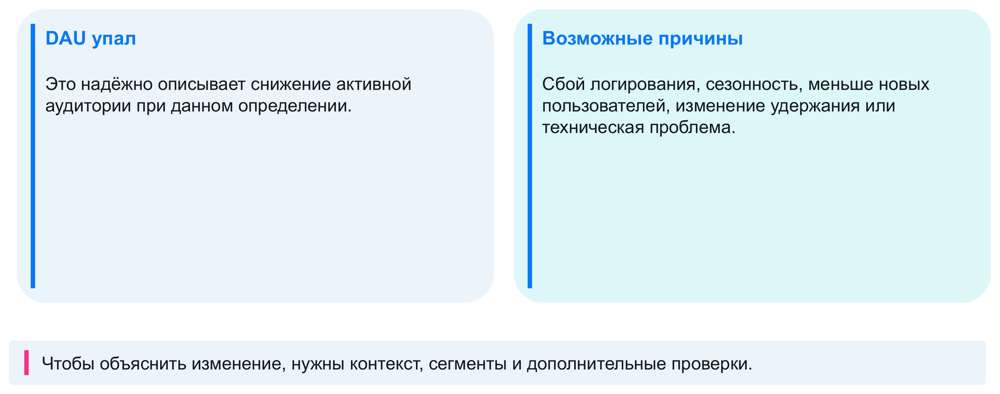

### Дерево метрик как инструмент диагностики

Как копать? В зрелых сервисах, давно работающих на рынке и с хорошо выстроенной аналитикой, для этого есть **дерево метрик**: каждая метрика в нём — узел, а под ним стоят метрики, которые на него влияют. Узнав, что с одной метрикой случилась проблема, мы спускаемся на уровень ниже и смотрим, что произошло там.

Возьмём мессенджер, где за день отправляются несколько миллиардов сообщений. Допустим, упало общее (total) количество отправленных сообщений. На эту метрику влияют две другие: DAU сендеров — людей, которые сегодня отправили хотя бы одно сообщение, — и среднее количество сообщений на одного отправителя. Вместе они и дают total[^n4a]:

$$
\text{Отправленные сообщения} = \text{DAU}_{\text{senders}} \times \frac{\text{сообщения}}{\text{sender}}
$$

Спустившись на этот шаг, уже видно, что сломалось: стало меньше пишущих людей или каждый стал писать меньше. Если и здесь причина не ясна, идём ещё ниже. Так и происходит диагностика. Альтернатива — просто генерировать всевозможные срезы наугад — обычно не работает: так можно уйти в дремучие леса. Подробно дерево метрик разбирается в разделе «Дерево метрик».

### DAU упал, а WAU на месте

Простейший шаг такой диагностики — сравнить DAU с WAU. Пусть DAU упал, а WAU остался прежним. О чём это говорит?

Здесь легко начать перечислять все возможные причины падения DAU — сезонность, «плохой день», технические ошибки. Но вопрос именно в сочетании двух метрик. Хорошие ответы: недостаток пользователей в один день компенсировался пользователями в другой; день не повлиял на неделю; новые пользователи скачут по дням, а постоянные остались.

Обычно такая картина говорит о снижении **частотности** — того, как часто пользователь возвращается в продукт. Вспомним: WAU — это те, кто был активен хотя бы раз за неделю, MAU — хотя бы раз за месяц. Если WAU не изменился, столько же людей по-прежнему заходят в течение недели, но делают это реже, не каждый день, — и DAU проседает. В MAX при падении DAU действительно периодически проверяют WAU.

### Уникальность и одно определение активности

Вернёмся к самим метрикам аудитории и уточним два правила.

Первое — уникальность: человек считается один раз за окно, где окно — день, неделя или месяц, сколько бы раз он ни заходил.

Второе — сначала определить активное действие. Открытие экрана даст одну аудиторию; успешный перевод денег — гораздо меньшую; просмотр видео — совсем другую. И это определение нужно сохранять при каждом сравнении: если мы сравниваем DAU с WAU, то в обеих метриках должно быть одно и то же определение активности и сопоставимые периоды. Иначе мы сравниваем разные аудитории.

### Паспорт метрики

Отсюда идея: у метрики есть паспорт. **Паспорт метрики** — зафиксированное описание того, как метрика считается:

- **единица счёта** — пользователь или устройство;
- **событие или условие** — что считается активностью;
- **окно времени** — день, неделя, месяц, и в каком часовом поясе;
- **фильтры и исключения** — например, убираем ли тестовые аккаунты, учитываем ли только авторизованных.

Для DAU паспорт может звучать так: уникальные `user_id`, выполнившие целевое действие в календарный день; отдельно оговорены авторизация, тестовые аккаунты и часовой пояс.

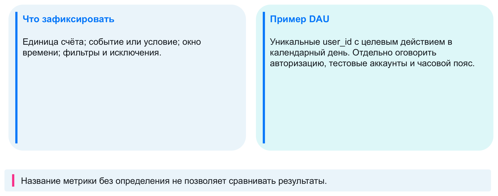

Зачем это нужно? Чтобы разные команды получали одно и то же число. Название метрики без определения не позволяет сравнивать результаты. Простой пример: если у человека два устройства без общего `user_id`, при счёте по устройствам он попадёт в DAU дважды, и нормально посчитать активных пользователей не получится.

**Можно ли складывать DAU по платформам?** В мессенджере есть total DAU, а также DAU iOS, DAU Android, DAU desktop и DAU web. Что получится, если сложить DAU iOS и DAU Android? Число **больше**, чем реальных пользователей за день: один и тот же человек может пользоваться обеими платформами и попадёт в сумму дважды. Так иногда делают, но складывать можно, только если гарантированно известно, что в каждый платформенный DAU попадают пользователи, сидящие только на этой платформе, и пересечений нет. Иначе нужно считать уникальных пользователей по объединению платформ — так получается корректный «DAU мобилок»[^n4b].

**Часовой пояс.** Пользователи живут в разных часовых поясах, и логируется клиентское время. Чтобы аналитики корректно считали метрики по дням, это время обычно нормируют к одному поясу — например, к московскому, если команда работает в Москве. Это касается не только DAU, а вообще всех метрик с временным окном.

[^n4a]: Примечание составителя: само разложение описано устно, формулой оно записано для наглядности.

[^n4b]: Примечание составителя: число уникальных пользователей по объединению платформ всегда не больше суммы платформенных DAU; сумма совпадает с ним, только когда платформы не пересекаются по пользователям.

## Путь пользователя: активация, вовлечённость, конверсия и воронка

*Таймкод: 00:41:16 · слайды 25–31*

Метрики аудитории отвечают на вопрос, сколько людей пользуется продуктом. Но за одним и тем же числом активных пользователей могут стоять очень разные истории: кто-то только что пришёл и ещё не понял, зачем ему продукт, кто-то пользуется им каждый день, кто-то застрял на полпути к покупке. Дальше идёт обзор основных семейств метрик поведения. На первый взгляд они слабо связаны между собой, но вместе показывают, какие бывают метрики и как они применяются к разным продуктам.

### Стадии отношений с продуктом

Удобная рамка для выбора метрик — **стадии отношений с продуктом**, которые проходит пользователь:

- **Acquisition** — привлечение: откуда человек пришёл;
- **Activation** — активация: впервые получил ли он ценность;
- **Engagement** — вовлечённость: как он пользуется продуктом;
- **Retention** — удержание: возвращается ли он к ценности (метрики удержания разбираются в следующем разделе);
- **Monetization** — монетизация: как продукт получает доход и поддерживает свою модель.

**Важно:** это карта вопросов, а не обязательная линейная воронка для любого бизнеса. Не у каждого продукта есть монетизация. У продукта с редкой потребностью может не быть ежедневных возвратов, и это нормально. А для мессенджера всё наоборот: чтобы сохранять аудиторию, нужно стремиться к тому, чтобы каждый пользователь возвращался каждый день. Полностью этого не достичь никогда, но ориентир именно такой.

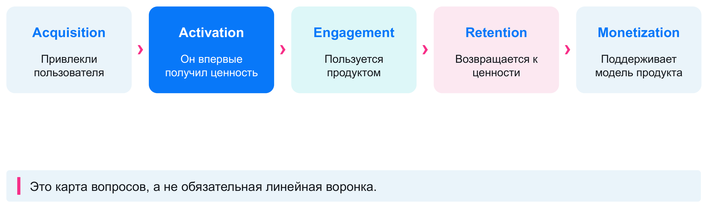

### Активация

Между «скачал приложение» и «получил пользу» есть несколько ступеней. Человек может скачать приложение из стора и ничего в нём не сделать. Может скачать и зарегистрироваться, но всё ещё не получить ничего полезного. И только на третьей ступени он скачал, зарегистрировался и получил ценность: например, отправил в мессенджере первое сообщение. Это и есть **активация** — момент, когда пользователь впервые получил ценность продукта. Что именно считать ценностью, нужно договориться заранее.

Регистрация или первый запуск сами по себе активацией не являются и ценность не гарантируют. Поэтому обычно смотрят конверсию из регистрации в активацию. Для доставки активацией может быть первый успешно доставленный заказ, для мессенджера — первый диалог, в котором человеку ответили.

Долю активировавшихся измеряет **activation rate** — доля новых eligible-пользователей, которые выполнили заранее определённое ключевое действие в заданное окно, например за первые три дня после регистрации:

$$
\text{Activation rate} = \frac{\#\{\text{новые eligible-пользователи, выполнившие ключевое действие за окно}\}}{\#\{\text{новые eligible-пользователи}\}}.
$$

**Eligible** означает «подходящий», то есть имеющий доступ к ключевому действию по условиям продукта. Строя метрику, нужно чётко понимать, с какой группой пользователей мы работаем. Человек, который живёт вне зоны доставки, оформить заказ не может, и он не должен портить конверсию в заказ: в знаменатель его включать нельзя. При этом таких людей полезно изучать отдельно. Если в какой-то деревне массово скачивают приложение доставки, а предложить им нечего, возможно, стоит принять волевое решение и завести туда курьеров.

Вторая метрика активации — **time-to-value**: время от входа в продукт до первого успешного получения ценности. В мессенджере это, например, время от регистрации до первого ответа от того, кому человек написал. Для такого распределения полезно смотреть не только на среднее: почему среднее не всегда описывает типичного пользователя и чем его дополнять, разбирается в разделе «Как интерпретировать изменения метрик».

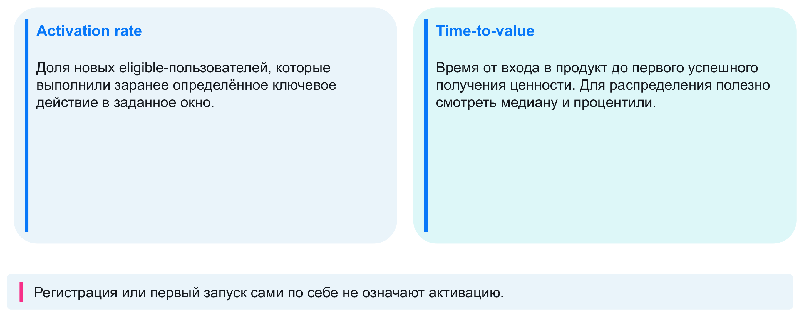

### DAU/MAU: насколько аудитория «липкая»

Грубую, но полезную оценку частоты использования даёт отношение **DAU/MAU**: средний DAU за период, делённый на MAU за тот же период. Обычно берут среднедневной DAU за месяц и MAU за этот же месяц:

$$
\text{DAU/MAU} = \frac{\overline{\text{DAU}}_{\text{месяц}}}{\text{MAU}_{\text{тот же месяц}}}.
$$

Этот показатель иногда называют липкостью (sticky factor). Он описывает, насколько месячная аудитория активна в типичный день, если определения DAU и MAU и период согласованы. Если DAU равен 10 000, а MAU — 100 000, то DAU/MAU = 10%.

Воспринимать это число как универсальную норму нельзя. Сервис прогноза погоды и мессенджер нужны человеку с разной частотой, и одинаковой «липкости» от них ждать странно. Метрика также не даёт напрямую число дней, в которые средний пользователь заходил в продукт, и не позволяет сравнивать продукты с разной частотой потребности. Частоту использования нужно сопоставлять с естественным циклом продукта.

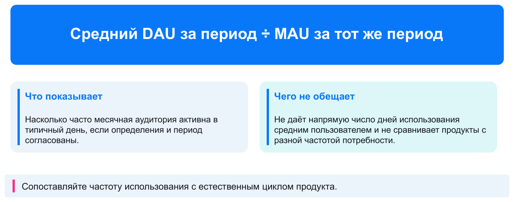

### Вовлечённость: частота и интенсивность

**Вовлечённость** — то, как активно человек пользуется продуктом. Её полезно разложить на две составляющие:

- **частота** — в скольких днях или сессиях пользователь активен за период;
- **интенсивность** — сколько целевых действий он выполняет за активный день или сессию.

Сессия — ограниченный период взаимодействия с продуктом. Правила её начала и окончания в разных приложениях фиксируются по-разному.

Обе метрики требуют осмысленного определения действия. Рост интенсивности хорош, если растёт число полезных действий. Если же человек раз за разом повторяет одну и ту же операцию, потому что она завершается ошибкой, рост интенсивности, очевидно, тревожный.

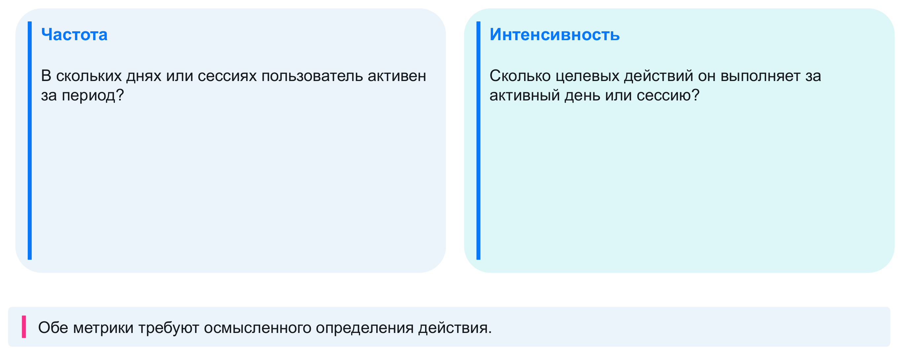

::: {.qa title="Вопросы из зала"}
**Выбираем ли мы под метрику определённую выборку пользователей, «ранжируем» ли их по полезности для статистики?** Ранжирование — это присвоение пользователям ранга. От него стоит отличать классификацию и деление аудитории на группы по признакам: «подписчики / бесплатные пользователи» или RFM-анализ, который чаще используют в маркетинге, — это именно деление на группы. А выборку под метрику выбирают однозначно. Допустим, нас интересует среднее число отправленных сообщений на пользователя. В мессенджере есть люди, которые никогда не пишут: только звонят или читают каналы. Если нас интересуют именно те, кто пишет (сендеры), берём аудиторию, отправившую за день хотя бы одно сообщение, и считаем метрику среди неё. Если нужно понять, какими возможностями премиум-подписки пользуются больше, а какими меньше, берём тех, кто подписку купил.

**Это всё только для IT-продуктов?** Мессенджер, доставка, банк — это и есть IT-продукты. Но те же метрики применимы и к офлайну. Например, сколько людей сегодня сняли наличные, можно отследить по банковским транзакциям и уникальному номеру клиента, без всяких камер.

**Бывает ли «типовой пользователь» для определённых метрик?** Задачу, для которой понадобилось бы выбирать типового пользователя, привести трудно. Однажды маркетинг запросил метрики по «наиболее активным» пользователям: тем, кто пишет не меньше заданного числа сообщений в день, обязательно пользуется стикерами, голосовыми и так далее. Но это не типовой пользователь, а узкая группа. При расчёте метрик обычно работают именно с группами пользователей, выделенными по признакам, важным для вопроса. Как такие группы выделять, разбирается дальше в лекции.
:::

### Использование функции: охват и повтор

Для новой функции важны две метрики. **Охват функции** — доля воспользовавшихся ею среди тех, кому она была доступна или показана:

$$
\text{Охват функции} = \frac{\text{пользователи, воспользовавшиеся функцией}}{\text{пользователи, которым она была доступна или показана}}.
$$

**Повторное использование** — доля впервые воспользовавшихся, кто вернулся к функции в заданном окне, например на седьмой или десятый день.

Путь пользователя к функции проверяется последовательно: кому она доступна, кто её увидел, кто попробовал впервые, кто вернулся к ней повторно. Эти ступени нужно разделять. Охват зависит от базы: считать его среди всех пользователей или только среди тех, кому функцию показали, — это решение, которое нужно принять заранее. Кроме того, клик не равен результату. Клик может означать интерес, но не полученную пользу, поэтому клики без фактического использования завышают оценку. Если человек открыл автоматическую сводку пропущенной переписки, это ещё не значит, что он восстановил контекст; к этому примеру мы вернёмся в финальном кейсе лекции.

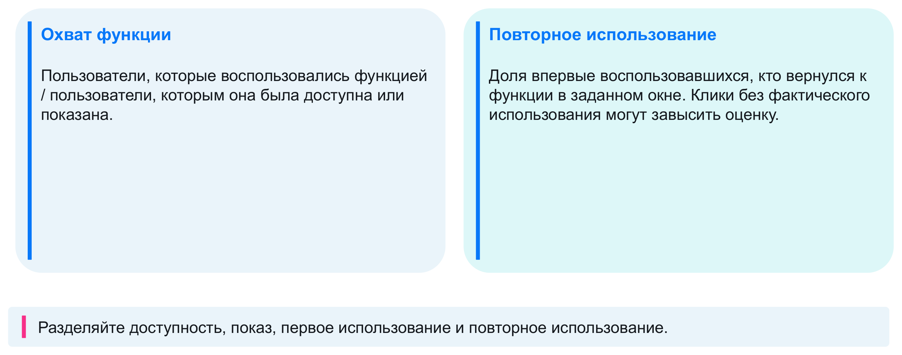

Возьмём сторис в MAX. Есть все зарегистрированные пользователи мессенджера, есть DAU — те, кто в целом заходит в продукт, и есть те, кому функция доступна. Сторис запускались начиная с определённой версии приложения, и у тех, кто не обновился, функции просто нет. Доля воспользовавшихся сторис среди тех, кто мог ими воспользоваться, и доля среди всего DAU — совсем разные числа. Нужно очень чётко понимать, что именно мы хотим посчитать.

### Конверсия начинается со знаменателя

**Конверсия** в продуктовой аналитике — доля пользователей, перешедших с одного шага на другой:

$$
\text{Конверсия } A \to B = \frac{\text{число подходящих пользователей, достигших шага } B}{\text{число подходящих пользователей на шаге } A}.
$$

Расчёт любой конверсии начинается с вопроса, кого мы включаем в **знаменатель** — относительно чего или кого считаем долю. Это не обязательно пользователи: в знаменателе могут стоять клики или любые другие события.

Пусть 300 из 1 000 пользователей, начавших оформление заказа (checkout), его завершили: конверсия этапа — 30%. Если те же 300 разделить на 2 000 всех посетителей приложения, получится 15%. Оба расчёта корректны, но отвечают на разные вопросы: первый оценивает отдельный шаг, второй — весь путь пользователя. Поэтому всегда нужно понимать, относительно чего и для чего вы считаете. Конверсии — инструмент, которым продуктовый аналитик пользуется каждый день.

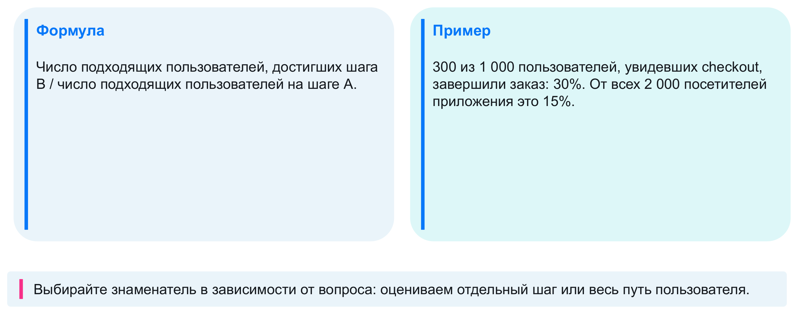

### Воронка

**Воронка** — последовательность шагов пути пользователя с числом дошедших до каждого шага. Она показывает, где мы теряем пользователей, но не говорит, что именно произошло. Возьмём путь в маркетплейсе: каталог посмотрели 10 000 человек, карточку товара открыли 7 000, товар в корзину добавили 3 000, оформление начали 2 000, заказ оформили 1 500.

Воронку читают двумя способами. **Конверсия по шагам** (step conversion) сравнивает соседние шаги, общая конверсия — старт и финал одного пути:

$$
\text{Step conversion}_{A \to B} = \frac{N_B}{N_A}, \qquad \text{Общая конверсия} = \frac{N_{\text{финал}}}{N_{\text{старт}}},
$$

где $N$ — число подходящих пользователей на шаге. Шагов конверсии на один меньше, чем этапов: при пяти этапах это переходы 1→2, 2→3, 3→4 и 4→5.

| Переход | Конверсия |
|:--|:--|
| каталог → карточка | $7\,000 / 10\,000 = 70\%$ |
| карточка → корзина | $3\,000 / 7\,000 \approx 43\%$ |
| корзина → checkout | $2\,000 / 3\,000 \approx 67\%$ |
| checkout → заказ | $1\,500 / 2\,000 = 75\%$ |
| общая: каталог → заказ | $1\,500 / 10\,000 = 15\%$ |

Конверсии по шагам нужны, чтобы найти место самой большой потери, здесь это переход из карточки в корзину. Общая конверсия показывает, сколько мы теряем относительно всей базы. В отчёты обычно выносят обе цифры. «1 500 из 2 000» звучит хорошо: большинство дошедших до checkout действительно оформили заказ. Но «1 500 из 10 000» уже показывает реальные потери. А бывает и так, что из 50 миллионов до конца доходят 200 тысяч, и тогда понятно, что на одном или нескольких этапах продукт теряет очень много людей.

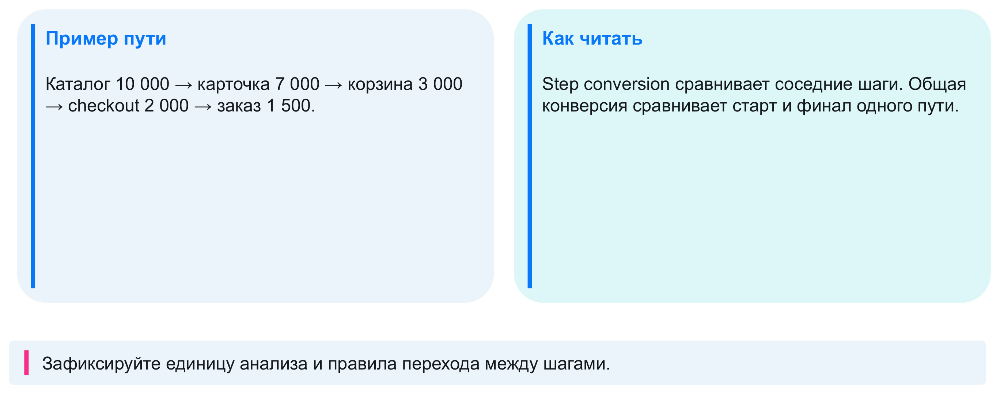

При построении воронки нужно зафиксировать единицу анализа и правила перехода между шагами. Также нужно проверить, что одни и те же пользователи проходят шаги в заданном окне и что события записываются последовательно. **Важный вывод:** падение воронки — направление для исследования, а не готовое объяснение.

Отсюда два основных способа считать пользовательскую воронку. **Связанная воронка** — классическое и правильное построение. Берём всех, кто зашёл в каталог, и смотрим, сколько из этих же людей перешло на следующий шаг. Из перешедших смотрим следующий шаг и так далее. Тот, кто оказался в конце воронки, гарантированно прошёл все предыдущие шаги. Минус такого подхода — ресурсы: код обрабатывается дольше, потому что на каждом шаге приходится сверять, что это те же люди, что были на предыдущем. **Несвязанная воронка** эту проверку пропускает: считают число уникальных пользователей на каждом этапе и примерно оценивают отношение одного количества к другому. К такому способу прибегают, когда нужно посчитать быстрее или когда связать шаги невозможно[^n5a].

Однажды понадобилось посчитать воронку, один из этапов которой проходил в неавторизованной зоне. Там нет `user_id`, по которому можно связать предыдущий и следующий шаги. Этот этап пришлось оценить по `unique device id`, понимая, что люди на нём не связаны с остальными. Вся остальная воронка была связанной, поэтому несвязанный этап вынесли отдельным пунктом сбоку и в отчёте явно оговорили: связанность здесь посчитать нельзя, конверсия на этом шаге примерная. Так и стоит поступать: несвязанный участок воронки нужно показывать и оговаривать явно.

::: {.qa title="Вопросы из зала"}
**Есть ли «вес этапа» — например, средняя конверсия по шагам, то есть сумма step-конверсий, делённая на число шагов?** Такой метрикой пользоваться не приходилось, и зачем она нужна, неясно. Бывает другое — не вес этапа, а допущение, что одни переходы важнее других. Потерять большинство пользователей между каталогом и карточкой товара — нормально. А вот между checkout и заказом важно, чтобы дошло большинство.
:::

[^n5a]: Примечание составителя: в несвязанной воронке на следующем шаге могут оказаться люди, которые не проходили предыдущий (например, попали в корзину по прямой ссылке), поэтому отношение чисел на соседних шагах — лишь приблизительная оценка конверсии.

## Retention и churn

*Таймкод: 01:06:29 · слайды 32–37*

Воронка показывает, сколько людей дошли до цели за один заход. Но для большинства продуктов не менее важно другое: вернётся ли человек потом, когда, к чему именно и почему. Эту сторону поведения описывает **[retention]{.gl key="Retention"}** — удержание, или возврат. Это одна из самых важных метрик продуктовой аналитики.

### Что такое retention и что нужно зафиксировать заранее

Retention — это доля пользователей начальной группы, которые совершили определённое возвращающее действие в заданный период. Чтобы такое число что-то значило, до расчёта нужно договориться о трёх вещах:

- **исходная группа** — каким стартовым событием она задаётся (например, регистрацией);
- **целевое действие возврата** — что именно считается возвратом;
- **окно наблюдения** — в какой период мы ждём этого действия и отсчитываем ли его по календарю или от момента старта каждого пользователя.

Исходную группу обычно называют когортой: это пользователи с общим стартовым событием, пришедшие в один период, например зарегистрировавшиеся за одну неделю. Подробнее когорты разбираются в разделе «Когорты и сегменты».

Выбор события возврата — не формальность. Если мы оцениваем ценность мессенджера, то простое открытие приложения может оказаться слабым возвратом. Полезнее считать возвратом отправку или получение сообщения. Открытие приложения годится как событие возврата только тогда, когда оно действительно отражает нужное поведение.

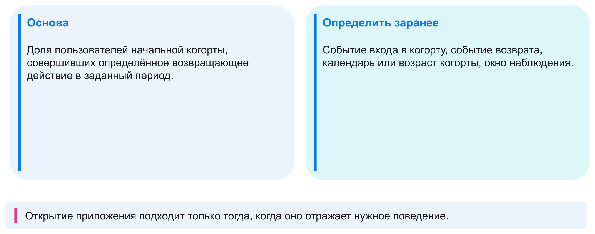

### D1, D7, D30

Обозначения **D1, D7, D30** выглядят как шифр, но читаются просто: D — день, число — сколько дней прошло после старта. Пусть из 1 000 новых пользователей на первый день вернулись 400, на седьмой — 250, на тридцатый — 150. Тогда удержание по дням (N-day retention) равно 40%, 25% и 15%:

$$\text{Retention}_{DN} = \frac{\text{число пользователей когорты, совершивших целевое действие в день } N}{\text{число пользователей когорты}}.$$

В числителе — те, кто вернулся в день $N$, в знаменателе — вся исходная группа. Такими значениями оперируют в работе практически каждый день.

Тут же возникает вопрос, что считать «днём»: календарный день, первые 24 часа после старта или что-то ещё. Одна подпись «D7» без методики может скрывать разные расчёты. Кроме того, период стоит выбирать под сам продукт: ожидаем ли мы, что человек будет возвращаться каждый день, раз в неделю или только по какому-то событию. Окно должно соответствовать естественной частоте потребности.

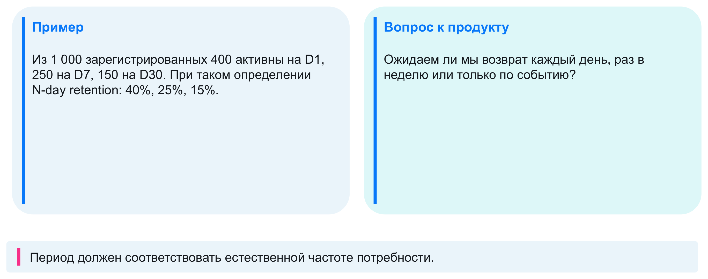

### Exact-day и rolling retention

Есть два основных способа считать возврат на день N.

**Exact-day retention** (удержание на день N) учитывает только тех, кто совершил целевое действие именно в день N или в явно оговорённом окне вокруг него.

**Rolling retention** (удержание с дня N и позже) засчитывает пользователя, если он вернулся в день N или в любой более поздний день, пока доступно наблюдение.

При одинаковом знаменателе rolling retention не бывает ниже exact-day: он включает ещё и более поздние возвраты. Поэтому два «D7», посчитанные разными способами, нельзя сравнивать между собой.

**Важно:** в отчёте недостаточно написать «D7» или «D30». Нужно указать способ расчёта и событие возврата, иначе вас вряд ли поймут.

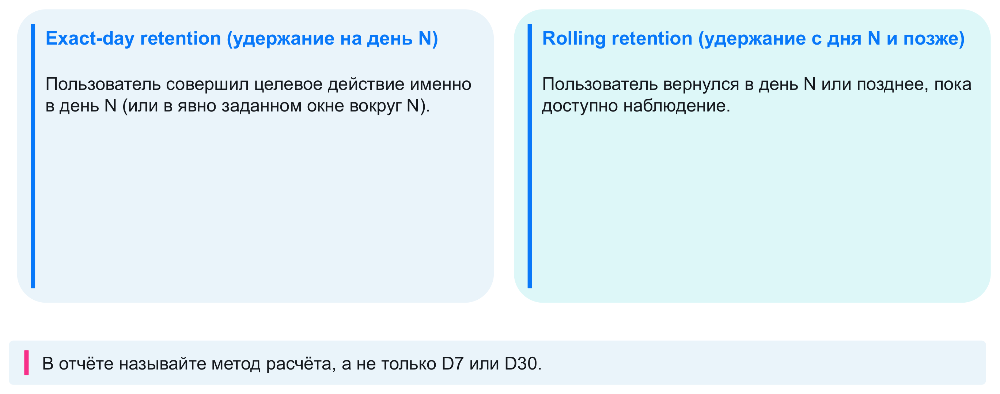

### Retention-кривая: три формы динамики

Если отложить удержание по неделям после входа в когорту, получится **retention-кривая**. Учебно выделяют три её формы.

**Резкий ранний спад.** Большинство пользователей уходят почти сразу: например, к первой неделе остаётся меньше половины. Отток сам по себе нормален, кто-то всегда перестаёт пользоваться продуктом. Но резкий обвал в начале — повод проверить, как люди впервые получают ценность: поняли ли они, как начать, получили ли ожидаемый результат, понимают ли вообще, зачем пришли.

**Плавное снижение без плато.** Кривая медленно, но неуклонно ползёт вниз и ни на чём не останавливается. Объяснений может быть несколько. Возможно, у пользователя разовая потребность: он какое-то время получал то, что нужно, и ушёл. Возможно, повторная ценность так и не сформировалась: человек попробовал закрепиться в продукте, но возвращаться ему незачем.

**[Плато]{.gl key="Плато"}.** Через несколько недель кривая выходит на горизонтальный участок, и дальше доля возвращающихся почти не меняется. Значит, у продукта есть возвращающееся ядро, и стоит смотреть на его размер. В мессенджере кривая практически наверняка выходит на **плато**.

**Акцент лектора:** форма кривой сама по себе не диагноз. Продукт нужно оценивать с учётом частоты естественной потребности и зрелости когорты. Когорте нужно «вызреть», дойти до плато: на первых этапах люди отваливаются, и ни в одном продукте на седьмой неделе не останутся все 100% пришедших.

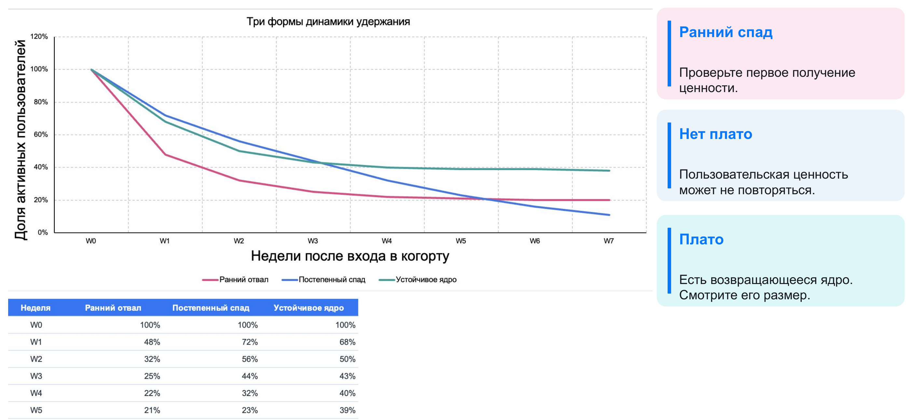

### Retention и churn

Обратная сторона удержания — **churn**, отток. Здесь важна аккуратность: если пользователь не был активен на D7, это ещё не значит, что он ушёл навсегда. Он может вернуться позже.

Чтобы посчитать отток операционно, выбирают срок, в течение которого отсутствие целевого действия считается уходом, с учётом естественного цикла продукта. Это нетривиальный вопрос. В одном продукте, например, принято так: если пользователь не возвращался 30 дней, он ушёл в отток. Даже если когда-нибудь он вернётся, его считают заново: идентификатор у него тот же, но привычку ему придётся формировать с нуля, это уже по сути другой пользователь. В других случаях порог берут в 90 дней.

Порог зависит от частоты потребности и модели продукта: у новостного приложения и у сервиса бронирования путешествий он будет разным. О пороге нужно договариваться и не выдавать условное правило за универсальное определение ухода.

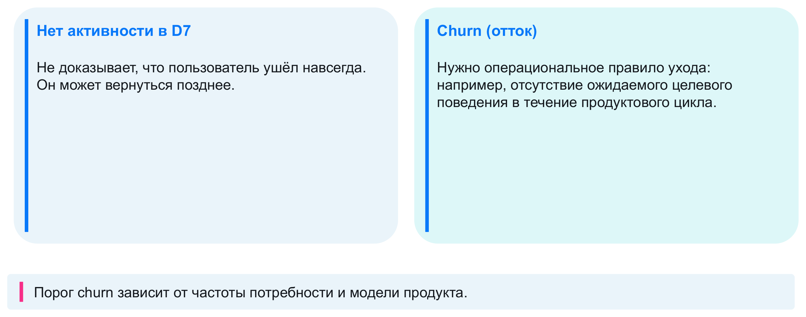

### Когда сравнение retention обманывает

Сравнивая удержание разных когорт, нужно следить, чтобы у них были одинаковые определения (стартовое событие, событие возврата, способ расчёта) и одинаковый возраст после старта.

Пусть за старой когортой наблюдают уже пять недель, а за новой только две. Тогда значение на пятой неделе (W5) у новой когорты неизвестно, и это не ноль: его просто ещё не было, данные не успели появиться. В таблице когорт такие пропуски образуют «лесенку»: чем моложе когорта, тем короче её строка. Такое неполное окно наблюдения называется **цензурированием**. Поэтому две когорты корректно сравнивать на второй неделе, при одинаковых правилах, а на пятой нельзя: по молодой когорте этих данных пока нет. Незрелая когорта не сопоставима с той, за которой наблюдали дольше.

Даже при одинаковом возрасте стоит проверить, не изменился ли состав привлечённых пользователей, продуктовый календарь или сам сбор событий: такие изменения тоже сдвигают retention.

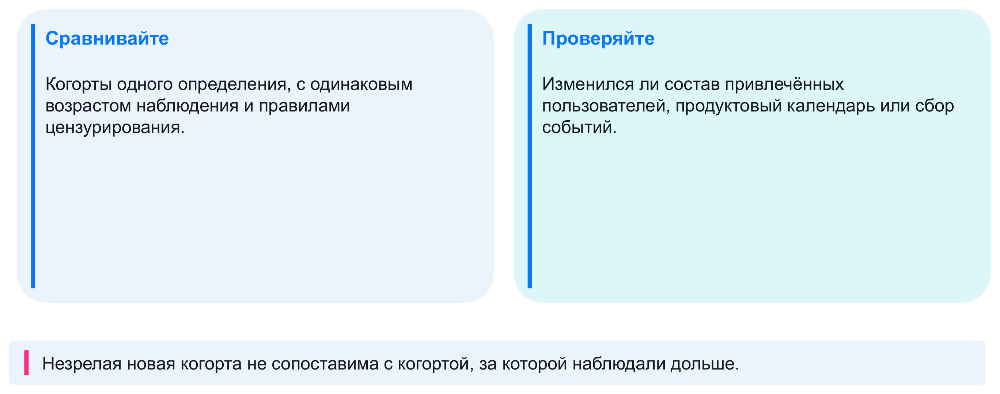

::: {.qa title="Вопросы из зала"}
**Retention считают как срез на конкретный день или как интервал? Что, если пользователь пропустил день?** Зависит от задачи. Например, в одном из недавних расчётов пользователь считался вернувшимся, если появился хотя бы раз за указанную неделю.
:::

## Бизнес-метрики: выручка, ARPU, LTV, GMV

*Таймкод: 01:14:50 · слайды 38–44*

### Ценность для пользователя и результат для бизнеса

До сих пор речь шла о метриках поведения: сколько людей пришло, дошло до цели, вернулось. Но продукт существует не в вакууме. Бизнес не может думать только об улучшении пользовательского пути, если это никак не сказывается на деньгах: без денег продукт просто не выживет. Поэтому бизнес-метрики нужны, чтобы связать результат пользователя с устойчивостью бизнес-модели.

У двух сторон разные интересы. Пользователь хочет решить свою задачу и получить подходящий результат при приемлемых затратах времени, денег и усилий, причём надёжно. Бизнесу нужно покрывать расходы и зарабатывать: выручка, маржа, транзакции, подписка, комиссия или рекламный доход. Эти стороны **связаны, но не тождественны**. Рост денег не всегда означает, что пользователю стало лучше. А полезное для человека изменение может отразиться на выручке не сразу или не отразиться вовсе.

Возьмём бесплатную доставку. Она почти наверняка улучшит пользовательский опыт, но может ухудшить экономику каждого заказа. Поэтому, оценивая такое изменение, нужно посмотреть и на пользу для человека, и на эффект для бизнеса. Хорошая система измерения показывает обе стороны и не подменяет одну другой.

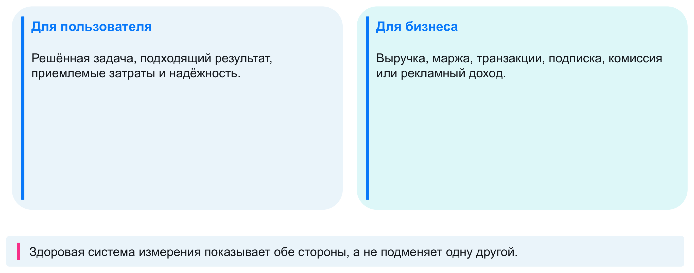

### Декомпозиция выручки

**Выручка** — это деньги, которые продукт получает по своей бизнес-модели. Выручку, как и пользовательские метрики, полезно раскладывать на множители. Для простой заказной модели, где выручка возникает из покупок, **декомпозиция выручки** выглядит так:

$$\text{Выручка} = \text{платящие пользователи} \times \text{покупок на пользователя} \times \text{выручка на покупку}.$$

Итог складывается из трёх факторов: числа платящих, частоты их покупок и средней суммы покупки. Например, 100 платящих пользователей, которые сделали по 2 покупки по 500 ₽, дают $100 \times 2 \times 500 = 100\,000$ ₽.

Смысл разложения в том, чтобы понимать, какой именно фактор изменил итог: стало больше платящих, выросла частота или выросла средняя сумма. Логика здесь та же, что с общим числом сообщений в мессенджере: если оно упало, его раскладывают на DAU и среднее число сообщений на пользователя и смотрят, какой множитель просел. В пользовательских и бизнес-метриках это делается одинаково. Все три множителя нужно считать за один и тот же период. И это разложение подходит только для заказной модели: для подписки, рекламы или комиссии маркетплейса формула будет другой.

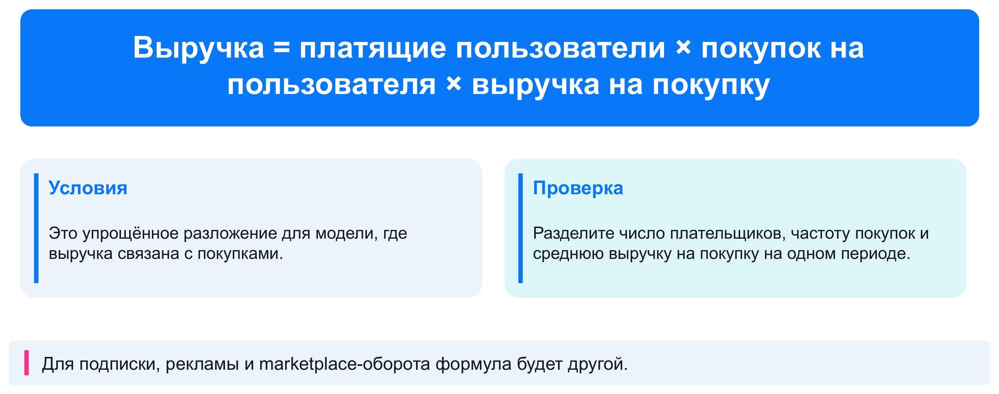

### ARPU и ARPPU

Две метрики, с которыми в работе сталкиваются очень часто:

- **ARPU** (Average Revenue Per User) — средняя выручка на одного пользователя выбранной базы за период;
- **ARPPU** (Average Revenue Per Paying User) — средняя выручка на одного платящего пользователя за период.

$$\begin{gathered}\text{ARPU} = \frac{\text{выручка за период}}{\text{число пользователей выбранной базы за тот же период}},\\[1ex] \text{ARPPU} = \frac{\text{выручка за период}}{\text{число платящих пользователей за тот же период}}.\end{gathered}$$

Числитель у них одинаковый, а знаменатель разный. Пусть выручка за период — 120 000 ₽, активных пользователей — 4 000, а платящих среди них — 600. Тогда ARPU $= 120\,000 / 4\,000 = 30$ ₽, а ARPPU $= 120\,000 / 600 = 200$ ₽. Знаменатель меняет смысл ответа: первое число говорит, сколько в среднем приносит любой пользователь базы, второе — сколько приносит тот, кто уже платит.

**Важно:** называя ARPU или ARPPU, всегда указывайте базу пользователей и период, а также валюту и тип выручки. Без этого цифру невозможно правильно прочитать.

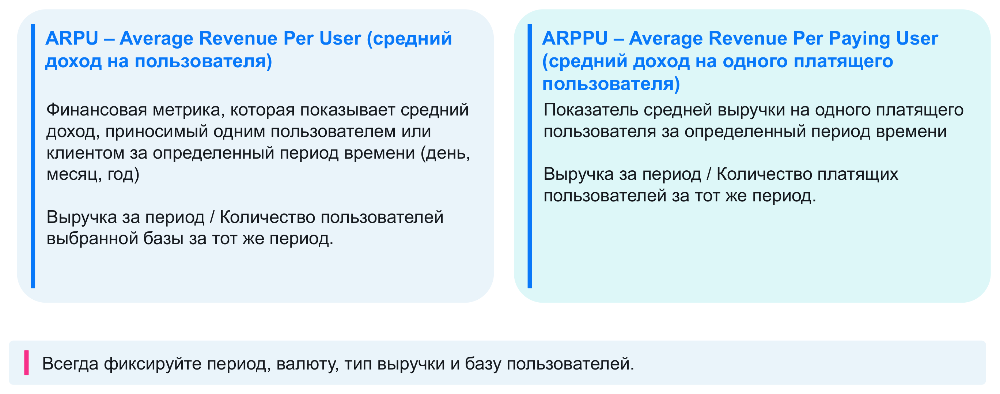

### LTV

**LTV** (lifetime value) — ценность пользователя за весь период его отношений с продуктом. В финансовых моделях в ней часто считают не выручку, а маржинальный вклад. На практике LTV — это обычно прогноз будущих денег, а не число, которое можно непосредственно наблюдать. LTV — оценка модели, а не единичный факт.

Простейшая оценка: если пользователь приносит в среднем 300 ₽ маржи в месяц и остаётся с продуктом 8 месяцев, то LTV $\approx 300 \times 8 = 2\,400$ ₽ без дисконтирования[^n7a]. Если меняется удержание, затраты или срок отношений, меняется и оценка. В целом LTV зависит от горизонта расчёта, от того, что берётся за основу (выручка или маржа), от дисконтирования, удержания, расходов и метода прогноза.

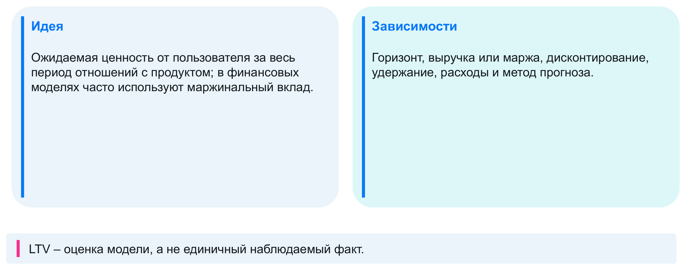

### GMV, выручка платформы и маржинальный доход

Маркетплейсы вроде Ozon и Wildberries часто оперируют показателем **GMV** — общей стоимостью заказов, прошедших через площадку. GMV показывает масштаб торговли, но не заработок самой платформы. Если GMV Ozon равен какой-то сумме, это вовсе не значит, что столько же Ozon и заработал.

Выручка платформы — доход, который она признаёт по своей бизнес-модели. Для маркетплейса-агента это комиссия и сборы с продавцов. **Маржинальный доход** — это выручка платформы минус переменные затраты, связанные с заказами. Эта сумма идёт на покрытие постоянных расходов, поэтому это ещё не чистая прибыль. Правила учёта скидок, возвратов и отмен нужно договорить заранее.

**Важно:** не называйте выручкой весь оборот продукта и не путайте GMV с выручкой, не проверив бизнес-модель.

Разберём задачу. Маркетплейс обработал 100 заказов по 1 000 ₽, комиссия площадки — 15 %, переменные затраты — 80 ₽ на заказ. Нужно найти GMV, выручку платформы и маржинальный доход.

- GMV $= 100 \times 1\,000 = 100\,000$ ₽ — оборот через площадку.
- Выручка платформы $= 0{,}15 \times 100\,000 = 15\,000$ ₽ — комиссия.
- Маржинальный доход $= 15\,000 - 100 \times 80 = 15\,000 - 8\,000 = 7\,000$ ₽.

Из 100 000 ₽ оборота платформе остаётся 7 000 ₽, и из них ещё предстоит покрыть постоянные расходы.

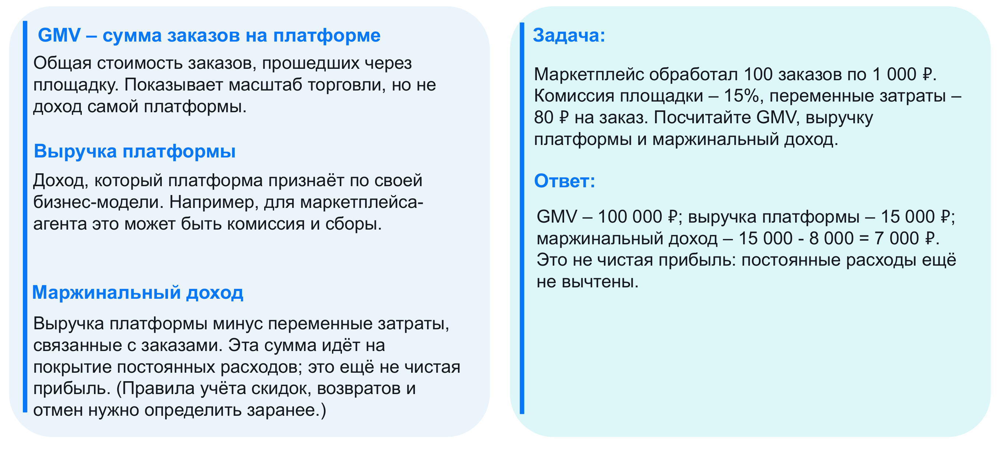

::: {.qa title="Вопросы из зала"}
**LTV моделируют через машинное обучение? Как его считают в компании и как понять, когда «лайфтайм» закончился?** ML не обязателен. LTV можно посчитать по формуле, а можно оценить моделью. Выбор зависит от продукта, объёма данных (его может не хватать для модели) и от того, как далеко вперёд нужно прогнозировать.

Универсальной даты конца отношений нет: каждая компания задаёт своё правило. Где-то просто берут горизонт в три-четыре месяца. В подписке концом считают отмену подписки или отсутствие оплаты после льготного периода. В сервисах с редкими покупками, например при бронировании путешествий, — долгое отсутствие заказов. Порог выбирают с учётом того, как часто клиент обычно возвращается: как и с churn, 30 дней без активности может быть мало, чтобы сказать, что человек ушёл. Если конечный момент неизвестен, считают ценность за наблюдаемый период и отдельно прогнозируют будущую.

Грубая оценка для подписки: клиент приносит в среднем 1 000 ₽ маржинального дохода в месяц, ежемесячный отток — 10 %. Тогда

$$\text{LTV} \approx \frac{\text{маржинальный доход в месяц}}{\text{месячный отток}} = \frac{1\,000}{0{,}1} = 10\,000\ \text{₽}.$$

Это работает только при упрощающих предположениях: отток примерно постоянный, клиенты ведут себя похоже, будущие деньги не дисконтируются[^n7b]. Точнее можно сложить доход или маржинальный вклад по таблице retention, где видно, сколько клиентов ещё активны, и спрогнозировать будущие месяцы по тому, как удерживаются группы пользователей, пришедших в разные периоды. Здесь как раз подходят статистические методы, в том числе ML, особенно когда у клиентов много разных признаков и траекторий и достаточно данных. Итак, лайфтайм заканчивается по заранее принятому правилу оттока, а LTV оценивают за период: иногда полностью наблюдённый, иногда частично спрогнозированный, иногда соединяя оба подхода.
:::

[^n7a]: Примечание составителя: дисконтирование — приведение будущих денег к сегодняшней стоимости. Рубль, который пользователь принесёт через год, в финансовых моделях ценится ниже рубля сегодня, поэтому оценка LTV с дисконтированием получается меньше простого произведения.

[^n7b]: Примечание составителя: деление на отток работает потому, что при постоянном месячном оттоке $c$ клиент в среднем остаётся с продуктом $1/c$ месяцев: при оттоке 10 % это 10 месяцев. Формула — то же «маржа в месяц × число месяцев», что и в примере выше, только срок жизни выведен из оттока.

## Когорты и сегменты

*Таймкод: 01:21:40 · слайды 45–50*

Любой агрегат (общий retention, средняя конверсия, ARPU) складывается из поведения очень разных людей. Когда он меняется, следующий вопрос аналитика: у кого и когда изменилось поведение? На первую половину вопроса отвечают сегменты, на вторую — когорты.

### Сегмент: разрез под гипотезу

**Сегмент** — часть аудитории, выделенная по признаку, важному для вопроса. По сути это просто набор характеристик пользователей, без привязки к какому-то моменту времени. Типичные разрезы: новые и вернувшиеся пользователи, платформа, канал (источник) привлечения, страна, пол, возраст, наличие подписки, особенности поведения. Например, у бота с расписанием учителя, студенты и школьники — это разные сегменты одной аудитории.

Разрез выбирают не потому, что в таблице есть такая колонка, а потому, что нужно проверить конкретную гипотезу о различии. Допустим, гипотеза такая: «женщины заказывают на маркетплейсах чаще, чем мужчины». Или после обновления выросло число ошибок оплаты, и мы подозреваем одну платформу. Тогда сравним Android с другими платформами в сопоставимые периоды. Порядок всегда один: сначала гипотеза, затем заранее выбранный сегмент и сопоставимый период.

**Важно:** если проверять всё подряд, растёт риск найти случайное отличие. Чем больше разрезов, тем выше вероятность, что какой-нибудь из них покажет «необычный» результат просто по случайности.[^n8a]

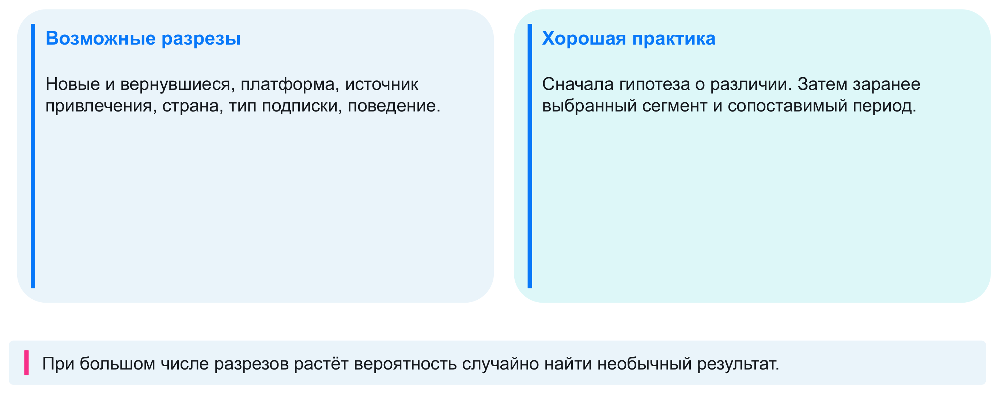

### Среднее скрывает состав

Зачем вообще смотреть на группы, если есть общее число? Пусть общий retention равен 30%. Внутри при этом может оказаться 15% у новых пользователей и 50% у зрелой аудитории, у которой уже сформировалась привычка. Если доля зрелых пользователей в базе выросла, общий показатель поднимется, хотя у новой аудитории привычка так и не сформировалась и ничего не улучшилось.[^n8b] Агрегат зависит и от поведения, и от состава аудитории.

Поэтому при любом сдвиге агрегата проверяем: изменился ли результат внутри групп или просто изменилась доля групп в общей аудитории? Хорошая практика — рядом с агрегатом писать значения по важным группам и долю каждой группы в общей базе.

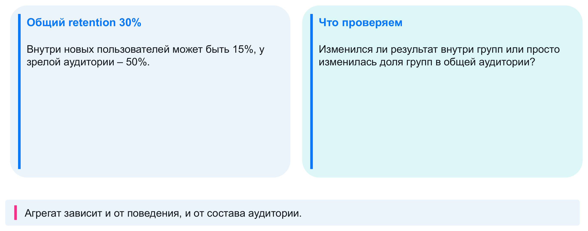

### Когорта: общий старт

**Когорта** — группа пользователей, объединённая общим событием и временем, например зарегистрировавшиеся на неделе 1 сентября. Стартовое событие задаёт начало отсчёта, после которого группу наблюдают в заданном окне. Разницу с сегментом проще всего увидеть на примере: «новые пользователи» — это сегмент, а «пользователи, зарегистрировавшиеся на такой-то неделе» — это когорта, потому что у них общий стартовый момент. Для retention когорты обычно нарезают по неделям: зарегистрировавшиеся в неделю $N$, в неделю $N+1$, в неделю $N+2$ и так далее.

Когортный анализ сопоставляет поведение групп по возрасту, то есть по тому, сколько времени прошло после общего старта: первая неделя, вторая, третья. Так когорты отделяют зрелость группы от календарной даты: когорту, которой две недели, сравнивают с другими когортами на их второй неделе, а не с теми, кто пользуется продуктом полгода.

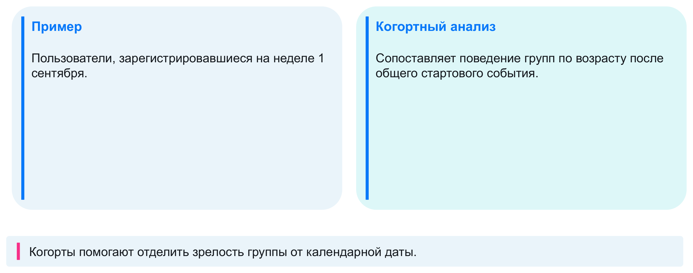

### Когортный retention

**Когортный retention** — доля пользователей когорты, совершивших целевое действие в каждую неделю после старта. Его удобно показывать тепловой картой: строки — когорты, столбцы — недели жизни когорты $W0, W1, \dots$ Вот учебный пример:

| Когорта | W0 | W1 | W2 | W3 | W4 | W5 |
|:--|:--|:--|:--|:--|:--|:--|
| 4 авг. | 100% | 42% | 35% | 31% | 29% | 28% |
| 11 авг. | 100% | 46% | 39% | 35% | 33% | 31% |
| 18 авг. | 100% | 45% | 38% | 34% | – | – |
| 25 авг. | 100% | 48% | 40% | – | – | – |

По такой таблице задают два вопроса. Какая когорта выглядит лучше на W1–W2? Когорта 25 августа: 48 и 40%. Какие когорты ещё нельзя сравнивать на W5? Когорты 18 и 25 августа: мы пока не знаем, что с ними будет в этот период. Прочерк означает, что полное окно наблюдения ещё не наступило, — это неизвестное будущее значение (цензурирование), а не нулевой retention. На W5 корректно сравнить только когорты 4 и 11 августа.

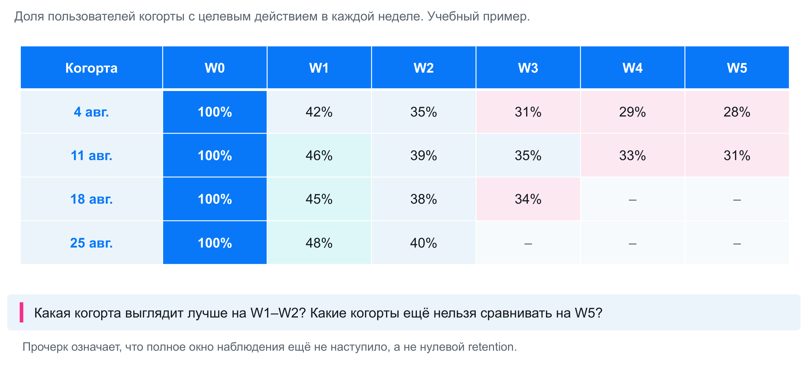

Retention нужен, чтобы понимать, спустя сколько времени пользователи обычно отваливаются. Строят его не по одной когорте, потому что продукт развивается и поведение новых когорт может меняться. Сравнение когорт одного возраста показывает, стало ли лучше.

### Почему общий retention мог вырасти

Допустим, общий retention вырос. Возможны два сценария:

- **Сценарий A:** retention внутри каждой когорты вырос после изменения продукта, то есть пользователи действительно стали возвращаться чаще.
- **Сценарий B:** пришло больше пользователей из источника с изначально высоким retention. Например, стало больше органических пользователей, а органический канал и раньше удерживался лучше. Внутри групп ничего не изменилось, изменился только их вес.

По одному общему числу эти сценарии не различить: агрегат может двигаться иначе, чем каждая из групп, просто потому, что меняется вес групп. Отсюда тот же вывод, что и для сегментов.

**Важный вывод:** при росте или падении агрегата проверяйте две вещи — динамику внутри когорт (или сегментов) и изменение их весов в общей аудитории.

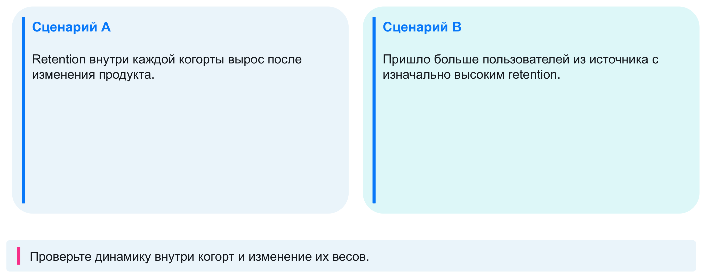

::: {.qa title="Вопросы из зала"}
**Чем сегмент отличается от когорты?** Сегмент — это просто набор характеристик пользователей. Когорта — это пользователи, выбранные по определённой логике за определённый период, то есть пережившие одно и то же событие в одно и то же время. Именно поэтому когорты появляются в retention: «зарегистрировавшиеся в неделю $N$», «в неделю $N+1$» и так далее. Привязка ко времени нужна и тогда, когда признак пользователя может поменяться. Например, в продукте несколько платформ и нужно изучить тех, кто сидит только на одной из них, скажем только в нативном iOS-приложении. Мы не знаем, не перейдёт ли такой пользователь завтра на другую платформу. Поэтому фиксируем временной промежуток и говорим, что в этот промежуток это когорта пользователей «только iOS».
:::

[^n8a]: Примечание составителя: это эффект множественных сравнений. Значения метрики в любых двух группах всегда хоть немного различаются из-за случайности. Если перебрать два десятка разрезов, почти наверняка найдётся такой, где различие выглядит заметным, хотя за ним ничего не стоит. Поэтому разрез выбирают до того, как смотреть на данные.

[^n8b]: Примечание составителя: числовая иллюстрация. Если новых пользователей в базе 60%, а зрелых 40%, общий retention равен $0{,}6 \cdot 15\% + 0{,}4 \cdot 50\% = 29\%$. Если доли поменяются местами (40% новых, 60% зрелых), получится $0{,}4 \cdot 15\% + 0{,}6 \cdot 50\% = 36\%$. Агрегат вырос на 7 п. п., хотя retention в каждой группе остался прежним.

## North Star Metric и guardrails

*Таймкод: 01:45:05 · слайды 51–59*

В продукте легко насчитать десятки графиков, но они не говорят, какой результат важнее, когда нужно принять решение. Есть и обратная опасность: если команда выбрала одно число и оптимизирует только его, она может незаметно испортить всё остальное. Этот раздел о двух инструментах против этих проблем: об общем ориентире продукта и о метриках, которые защищают продукт от односторонней оптимизации.

### Зачем команде North Star Metric

**North Star Metric (NSM)**, «метрика полярной звезды», — это общий долгосрочный ориентир ценности продукта. Она отражает устойчивую ценность, которую получает пользователь, и помогает разным командам двигаться в одном направлении, связывая развитие продукта с долгосрочным успехом бизнеса.

**Важно:** NSM — это не единственное число на дашборде и не замена остальным показателям. Она направляет внимание, но полный набор метрик, в том числе диагностических, по-прежнему нужен.

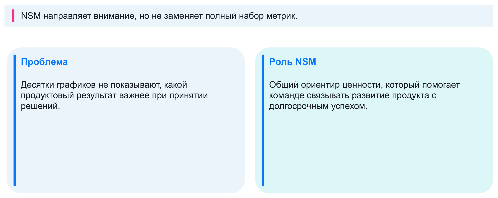

NSM легко спутать с метриками другого уровня, хотя формулы у них иногда совпадают. Различаются они ролью:

| Уровень | Что это |
|:--|:-----------|
| NSM | уровень продукта: долгосрочный ориентир ценности для продукта и команды |
| Outcome metric | результат конкретной задачи или изменения |
| **Primary metric** | главная метрика конкретной проверки или эксперимента, выбранная заранее, до запуска |

Частая ошибка — считать, что метрика, которая выросла в удачном A/B-тесте, автоматически становится North Star всего продукта. Это не так: primary metric — критерий одной гипотезы, а NSM — ориентир для всех команд.

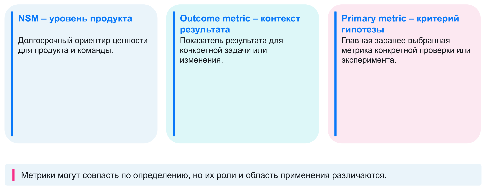

### Какой должна быть хорошая NSM

Хорошая NSM связана с **повторяемой** ценностью: пользователь получает пользу регулярно, а не один раз попробовал функцию и ушёл. Кандидата в NSM проверяют тремя вопросами:

1. Действительно ли пользователи регулярно получают пользу, которую отражает показатель?
2. Можно ли объяснить, как он связан с долгосрочным успехом бизнеса?
3. Понимает ли команда, на какие факторы она может влиять, чтобы его изменить?

Третий пункт часто недооценивают. Если выбрать NSM, на которую часть продукта не может повлиять никак, это неправильная NSM: у таких команд пропадает понимание, зачем они вообще делают свои фичи.

Примеры кандидатов: для мессенджера — осмысленные диалоги, прочитанные сообщения, успешные звонки; для доставки — успешно доставленные заказы; для видеосервиса — просмотры подходящего контента. В каждом случае нужно точно определить, что считать «осмысленным», «успешным» и «подходящим». Например, просто число отправленных сообщений к ценности мессенджера отношения почти не имеет. Ближе к ней диалоги, в которых человек отправил сообщение и получил ответ. Кандидатов у одной компании может быть несколько, пока команда уточняет свою модель ценности. И метрику не выбирают только потому, что она уже растёт.

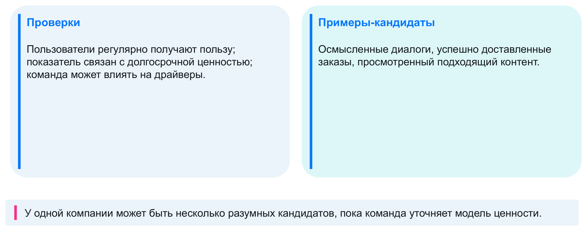

В MAX, например, формирование NSM прошло несколько итераций согласования с руководством. Пришлось доказать две вещи, причём не словами, а гипотезами, проверенными на данных: что метрика отражает ценность, которую получают пользователи, и что все команды смогут её двигать.

**Что редко подходит на роль единственного ориентира.** Загрузки и регистрации показывают вход в продукт, а не получение ценности: человек мог скачать приложение и ни разу им не воспользоваться. Для верхней части пути привлечения эти числа полезны, но рядом с ними должны стоять активация, решение задачи и удержание. Просмотры страниц и выручка могут быть частью системы метрик, но без контекста подталкивают к вредной оптимизации. Любую метрику оценивают вместе с поведением пользователей и бизнес-моделью.

Как проверить, что регистрация действительно стала полезной? Нужно посмотреть на следующее действие: пользователь написал сообщения, позвонил, переслал что-то, совершил целевое действие. Если такое активное действие есть, значит, пользователь активировался.

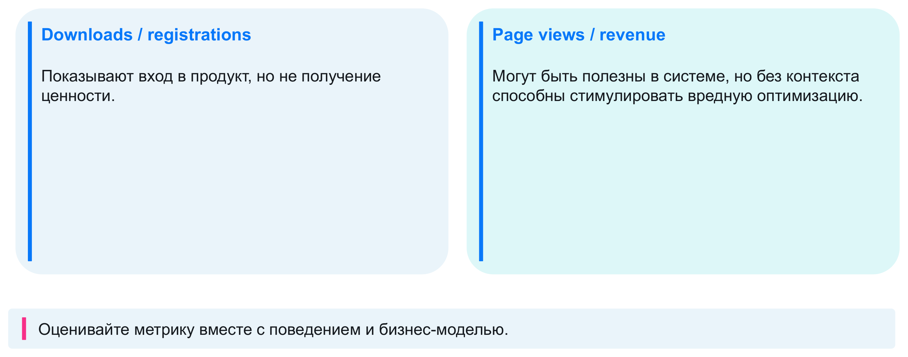

**NSM не должна поощрять вред.** Любой ориентир нужно проверить на нежелательные способы его роста. Общее число сообщений может расти за счёт роста активной аудитории, а может за счёт повторов, автоматизации, спама и нерелевантных уведомлений. Чтобы понять, что произошло на самом деле, смотрят на число активных отправителей, диалоги с ответом и сообщения на пользователя. Рост объёма может сопровождаться ухудшением качества коммуникации. С временем в приложении то же самое: его можно увеличить, просто усложнив пользователю полезную задачу.

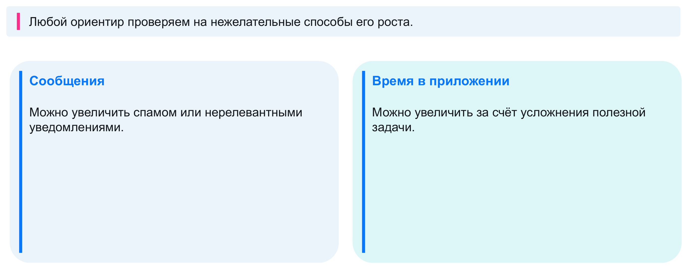

### NSM на практике: DAU и time spent

В теории всё выглядит стройно, но на практике найти универсальную NSM сложно. Некоторые компании берут в качестве NSM DAU, но это не лучший выбор. Во-первых, DAU со временем может выйти на плато, и сдвинуть его станет очень трудно. Во-вторых, DAU измеряет частотность, но не интенсивность. Один человек за день отправил триста сообщений, сделал пять звонков, пользовался стикерами и голосовыми, другой зашёл и отправил одно сообщение. В DAU, а значит и в NSM, оба попадут одинаково.

Из практики можно вывести три правила:

- рядом с NSM кладут ближайшие к ней метрики, чтобы диагностировать, за счёт чего она растёт или падает;
- NSM должна отражать полученную ценность, а не быть «метрикой ради метрики»;
- недочёты найдутся у любой NSM, и это нормально. Главное, чтобы она отражала ценность, команды могли на неё влиять и чтобы её нельзя было легко «хакнуть».

«Хакнуть» метрику — значит вырастить её способом, который не создаёт ценности. Классический пример — **time spent**, время, которое пользователь проводит в продукте. Если замедлить или ухудшить пользовательский путь, time spent вырастет, команде можно выписывать премию, но за счёт чего метрика выросла — большой вопрос.

При этом time spent часто выбирают в качестве NSM, и на то есть причина. У человека 24 часа в сутках, и если он тратит, условно, 40 «чистых» минут в день на сервис, это ценность, выраженная в минутах. В мессенджере вроде Telegram у пользователей много разных интентов, то есть потребностей: кто-то только переписывается, кто-то ведёт блог, кто-то звонит, читает новости или сидит в групповых чатах. Объединить эти разные ценности в одно число помогает общее время в инструменте: чем оно больше, тем больше личного ресурса человек вкладывает в продукт. Но, как уже говорилось, рост time spent может означать и хорошее, и плохое.

::: {.qa title="Вопросы из зала"}
**Какая NSM в MAX?** Сейчас её пересматривают, рассматривается несколько вариантов, поэтому назвать её пока нельзя. В Telegram, по-видимому, это time spent.

**Какие NSM бывают в разных компаниях?** Любые показатели, которые отражают ценность: time spent, количество успешных звонков, время за просмотром контента. Маркетплейсы, как правило, выбирают финансовые метрики: GMV, ARPU, ARPPU. Много времени на стриминговой площадке не всегда хорошо для самого человека, но для Netflix, который ровно для этого и нужен, время просмотра — валидный ориентир.

**Как агрегируют time spent в NSM?** По-разному: кто-то берёт суммарное время всех пользователей за день, но обычно берут среднее время на одного пользователя. Его легче сдвинуть: оно реагирует на изменения в поведении как самых активных, так и редких пользователей.
:::

### Guardrails: защитные метрики

Если NSM можно «хакнуть», нужен механизм, который это заметит. **Guardrails** (защитные метрики) показывают, не ухудшаем ли мы другие важные стороны продукта, пока улучшаем основной результат. Guardrail нужен везде, где рост основной метрики может повредить другой важный аспект. Например, если в эксперименте primary metric — конверсия в заказ среди пользователей, которым заказ доступен, то в guardrails идут отмены, возвраты, жалобы, маржа и скорость доставки.

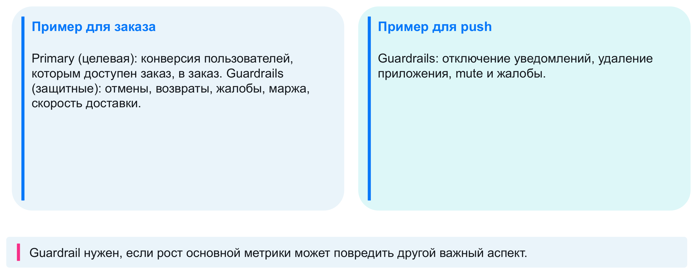

**Акцент лектора:** **порог guardrail**, то есть допустимую границу ухудшения, задают **до** эксперимента. Например, команда заранее решает, что готова к снижению скорости доставки максимум на определённую величину. Если порог не зафиксирован, после эксперимента легко оправдать любой вред тем, что главная метрика выросла. Если же защитная метрика рухнула ниже допустимого значения, тест срочно останавливают.

Возьмём сервис доставки продуктов вроде Самоката или Лавки. Внизу корзины есть блок рекомендованных товаров. Команда ранжирования (ML-инженеры, дата-сайентисты) заменила модель, которая решает, в каком порядке показывать рекомендации. Гипотеза: с новой моделью людям будут попадаться более релевантные товары, и они станут больше покупать из рекомендаций. Целевая метрика здесь — качество рекомендаций, например метрика ранжирования NDCG[^n9a]. В guardrails кладут средний чек, причём не по всем покупкам, а только по товарам, атрибутированным к рекомендациям: такие покупки можно отделить и измерить.

Почему средний чек — именно защитная метрика? Если новая модель станет предлагать менее релевантные товары, это покажет целевая метрика. Опаснее другое: модель может начать рекомендовать **более дешёвые** товары. Тогда товаров в корзине станет больше, релевантность вырастет, целевая метрика покажет успех, а денег бизнес начнёт получать меньше. От такого сценария и защищает guardrail: улучшение рекомендаций не должно обвалить средний чек.

Роль одной и той же метрики зависит от задачи. Кто-то кладёт ARPU в primary, если цель изменения — вырастить средний чек. В этом кейсе цель другая, поэтому ARPU стоит среди guardrails.

[^n9a]: Примечание составителя: NDCG (normalized discounted cumulative gain) — метрика качества ранжирования. Она выше, когда релевантные элементы стоят ближе к началу списка.

### Три роли метрик вместе

Теперь можно свести три роли метрик в одну систему:

| Роль | На какой вопрос отвечает |
|:--|:-----------|
| Primary / outcome | Достигли ли мы ожидаемого изменения — главного результата |
| Diagnostics | На каком промежуточном шаге проявилось изменение — помогают его локализовать |
| Guardrails | Не навредили ли мы другим целям — их ухудшение недопустимо |

Английские названия здесь стоит запомнить: в продуктовой аналитике оперируют именно ими. Система из трёх ролей нужна потому, что один показатель редко описывает всё важное. Прежде чем выкатывать значимое изменение, нужно посмотреть, как оно влияет на продукт в целом. Показатели и пороги выбирают до того, как увидели итог эксперимента.

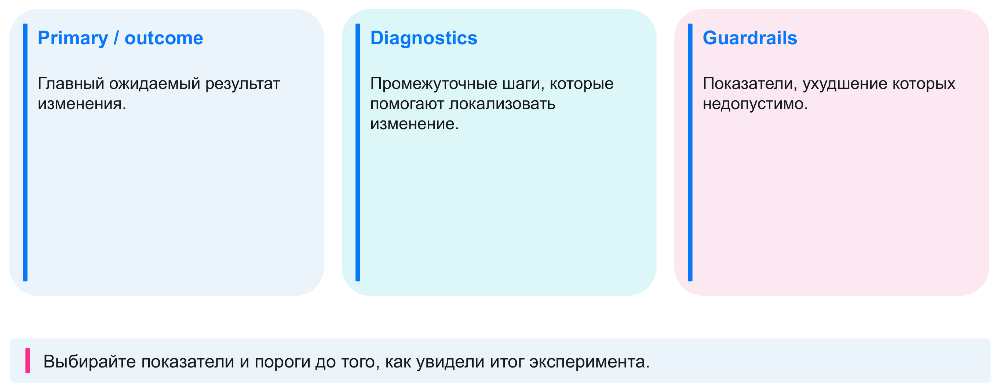

::: {.qa title="Вопросы из зала"}
**Что делать, если обновление уменьшает средний чек, но увеличивает число пользователей?** Решение зависит от порога, который задали заранее. Определяя guardrail, фиксируют допустимый диапазон его изменения. Падение в пределах этого диапазона guardrail не нарушает. Если же средний чек рухнул ниже допустимого значения, тест останавливают.

**Что такое коммуникации?** Любое взаимодействие продукта с пользователем: push-уведомления, e-mail-рассылки, SMS, реклама в каналах.
:::

### Пример: больше push — не всегда лучше

Команда увеличила число push-уведомлений, и DAU вырос на 3%. Но одновременно отписки выросли на 40%, а отключения уведомлений (mute) и удаления приложения тоже участились. Объявить такую стратегию успешной только по DAU нельзя. Нужно проверить, не слишком ли часто мы обращаемся к пользователям и не купили ли краткосрочную активность ценой потери доверия.

Какие защитные метрики стоит добавить в тест на увеличение числа push-уведомлений?

- число пользователей, отключивших уведомления. Считать лучше людей, а не сами отключения;
- переходы по push-уведомлениям и целевое действие после перехода, то есть получил ли пользователь ценность;
- число удалений приложения;
- жалобы на уведомления;
- последующее падение активности.

Последний пункт — про долгосрочный эффект. Человек, которого заставили отключить уведомления, первое время по привычке ещё заходит в продукт. Потом напоминаний нет совсем, и его частотность начинает падать. Поэтому одного изменения DAU недостаточно для продуктового решения.

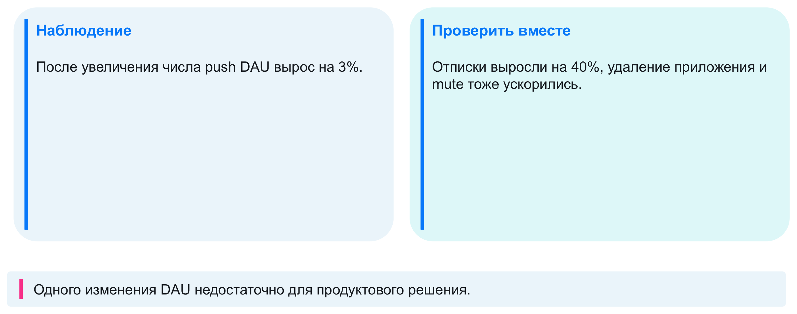

## Дерево метрик

*Таймкод: 02:10:35 · слайды 60–69*

Дерево метрик уже появлялось как инструмент диагностики падения DAU. Теперь соберём его как систему: дерево нужно, чтобы разложить целевой результат на измеримые составляющие, на которые можно повлиять.

### Как выглядит дерево

Дерево метрик действительно похоже на дерево. Это граф, на вершине которого стоит одна метрика, чаще всего NSM, а от неё вниз спускаются другие метрики. Возьмём простое верхнеуровневое дерево: на вершине Profit (прибыль), на неё влияют Revenue (выручка) и Costs (затраты). На Revenue влияют Users (пользователи) и LTV, на Users — следующие метрики, и так дерево «по листьям» спускается вниз. В индустрии этот инструмент называют именно деревом метрик.

Идея дерева в том, чтобы разложить общий исход на вопросы, на которые команда может повлиять и которые можно проверить. В одной схеме сходятся пользовательская ценность, NSM, факторы, которые формируют результат, диагностические показатели и защитные ограничения.

### Система метрик вокруг NSM

Логика дерева выстраивается в цепочку:

$$\text{User Value} \rightarrow \text{NSM} \rightarrow \text{Drivers} \rightarrow \text{Diagnostics}, \qquad \text{Guardrails — сбоку}$$

В начале цепочки стоит пользовательская ценность (User Value): какую ценность получает пользователь. Пользователь во главе всего. NSM показывает, как мы отслеживаем эту ценность на уровне продукта. **Драйверы** (drivers) — факторы, которые формируют NSM: они раскладывают результат на составляющие. Диагностические метрики показывают, где и почему мог измениться драйвер. Guardrails стоят сбоку: это защитные метрики, которые следят, чтобы рост результата не ухудшал качество, доверие, маржу или стабильность. Так система метрик превращается в дерево — от общего ориентира к управляемым факторам. При этом связи между узлами нужно обосновать, а не просто нарисовать.

**Уровень дерева** — это то, насколько далеко метрика от вершины. Каждый следующий уровень влияет на NSM через промежуточные узлы, то есть часто опосредованно: Users влияют на Profit не напрямую, а через Revenue. На стрелках дерева можно подписывать силу влияния. Это помогает при приоритизации бэклога: видно, насколько сильно та или иная задача может сдвинуть итоговую NSM.

Где рисовать guardrails, единого правила нет. Кто-то выносит их вбок, кто-то — вниз, под всё дерево, потому что они должны оставаться неизменными для всех стримов (направлений продукта), а кто-то помещает их прямо в листья. Универсально правильного дерева не существует.

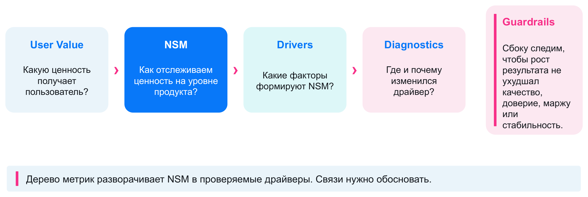

### Декомпозиция числа заказов

Основной приём построения дерева — **декомпозиция**: метрика верхнего уровня представляется как произведение (или другая формула) метрик следующего уровня. Число заказов раскладывается так:

$$\text{Заказы} = \text{Покупатели} \times \text{Заказов на покупателя}$$

Покупатели — число пользователей, которые купили в заданный период. Заказов на покупателя (частота) — среднее число заказов на одного покупателя в том же периоде. Например, 10 000 покупателей сделали в среднем по 2 заказа — всего 20 000 заказов. Такое дерево показывает, что именно изменилось: аудитория покупателей, конверсия или частота повторных заказов. **Важно:** периоды и единицы измерения по всей формуле должны совпадать.

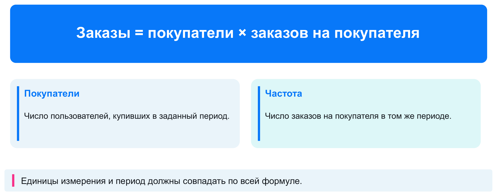

Число покупателей раскладывается дальше, на следующий уровень: доступная аудитория → активные → конверсия в покупку → покупатели. Доступная аудитория — те, кому продукт доступен. Для сторис в мессенджере это те, кто обновился до версии, в которой можно публиковать сторис. Активные — те, кто выполнил выбранное действие, например опубликовал или посмотрел сторис. Конверсия — доля дошедших до покупки. Для каждого компонента нужно задать определение и проверить единицу счёта, чтобы одного человека с несколькими заказами не принять за нескольких покупателей: определения должны исключать двойной счёт. И это лишь один из возможных вариантов декомпозиции.

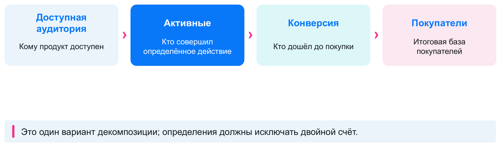

### Дерево — не дашборд

**Дерево ≠ дашборд** — эти два инструмента важно не путать. Дашборд показывает значения выбранных, согласованных показателей. Он бывает тематическим, по конкретной фиче: в MAX, например, есть дашборды «Сторис», «Переписка», «Трансляции в каналах» с основными показателями, по которым видно здоровье фичи. Бывают KPI-дашборды с ключевыми показателями по стримам — отдельно по переписке, отдельно по звонкам. Иногда дашборд делают даже под маленькую фичу, чтобы понять, как она вела себя в момент выкатки. Отвечает за дашборды обычно BI-аналитик (BI — система бизнес-аналитики и отчётности), но BI-аналитики есть далеко не во всех компаниях. Тогда эту работу выполняют дата-аналитики и продуктовые аналитики. Подробно дашборды разбираются в лекции по визуализации.

Дерево показывает другое: предполагаемые связи, формулы и причинные гипотезы между показателями. Отсюда правило: **не добавляйте показатель в дерево только потому, что он доступен в BI.** В дерево входят только те числа, которые помогают объяснить или изменить целевой результат.

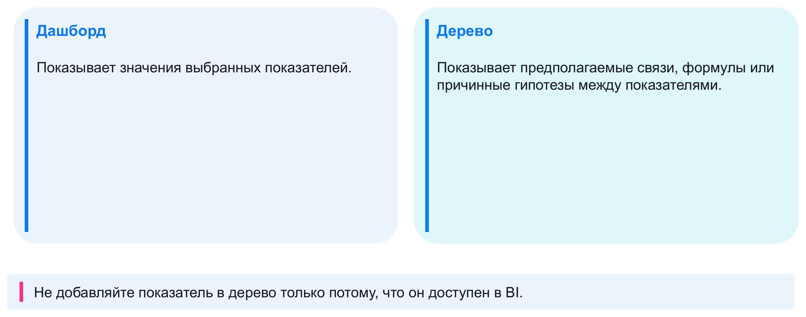

### Дерево для мессенджера

Возьмём мессенджер. Это общий пример, а не устройство дерева в MAX. Outcome — число пользователей с осмысленной коммуникацией за неделю (или за день — как договорится команда). Осмысленная коммуникация — та, в которой ценность доставлена: на той стороне приняли звонок или прочитали сообщение. Драйверы:

$$\text{Outcome} = \text{активные коммуникаторы} \times \text{доля с активным собеседником}$$

Активные коммуникаторы — люди, которые участвуют в коммуникации. Вторая составляющая — доля тех из них, у кого есть активный собеседник. В диагностику входят доставляемость сообщений, дозваниваемость, ответы, активные дни, блокировки, отключение уведомлений (mute) и многое другое. Полезна даже такая метрика, как число исторических контактов: она показывает, насколько ещё можно вырастить базу людей для переписки. Если год назад вы с кем-то переписывались, этот человек входит в вашу активную базу — есть шанс, что вы снова ему напишете.

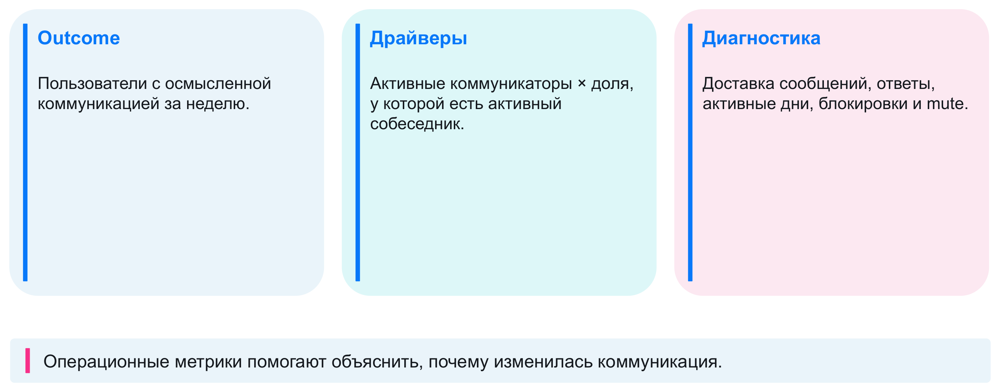

### Интерактив: дерево для онлайн-кинотеатра

Задача: онлайн-кинотеатр хочет увеличить число завершённых просмотров, которые пользователь выбрал осознанно. Нужно разложить этот outcome на зрителей и путь к просмотру, предложить NSM, диагностические метрики и guardrails.

Одно из предложенных решений — метрика «рубль в минуту». Здесь сразу возникают вопросы: рубль от чего, минута чего, за какой период — день, месяц, год? И главное: при модели подписки выручка с пользователя фиксирована, поэтому чем больше человек смотрит, тем ниже такая метрика. Она наказывала бы продукт за то, что он приносит ценность. При оплате отдельных фильмов картина была бы другой.

Один из возможных ответов: число осознанно завершённых просмотров зависит от того, сколько зрителей увидели подходящий контент, выбрали его, начали смотреть и досмотрели. Путь: доступная аудитория → увидели контент → выбрали и запустили → завершили просмотр. В виде формулы:

$$\begin{aligned}\text{Осознанно завершённые просмотры} = {}&\text{подходящая аудитория} \times \text{доля увидевших контент}\\ &\times \text{доля выбравших и начавших}\\ &\times \text{доля завершивших}\end{aligned}$$

У каждой доли свой знаменатель: например, завершённые просмотры делятся на начатые.[^n10a] Guardrails здесь — доля скрытий, жалоб, быстрых пропусков. Важно заранее договориться, что считать завершённым просмотром и как отличать осознанный выбор от автовоспроизведения. Отдельно стоит смотреть на уникальных зрителей: общее число просмотров может вырасти просто из-за повторов одних и тех же людей.

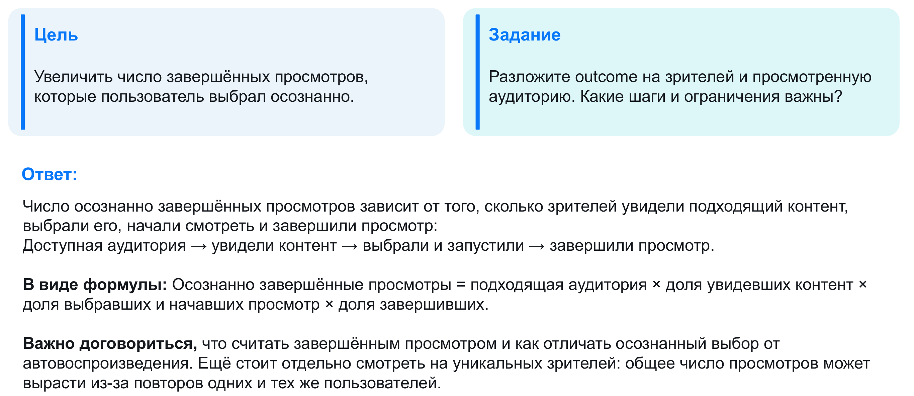

### Один outcome — несколько деревьев

Один и тот же outcome можно разложить по-разному. Декомпозиция по пользователю: активные зрители × завершённые просмотры на зрителя. Декомпозиция по пути: показы рекомендаций × выбор × старт × доля завершения. На практике у продукта обычно одно глобальное дерево, а небольшие деревья с разной декомпозицией строят для отдельных стримов. Правило выбора: берите ту декомпозицию, которая помогает принять следующее продуктовое решение.

Дерево подсказывает, где искать проблему. Мало показов — работаем с доступностью контента. Много стартов, но мало завершений — изучаем, соответствует ли фактический просмотр ожиданиям зрителя. Метрики в дереве связаны, поэтому, увидев проблему в верхней метрике, спускаемся вниз и ищем, на каком листе она возникла.

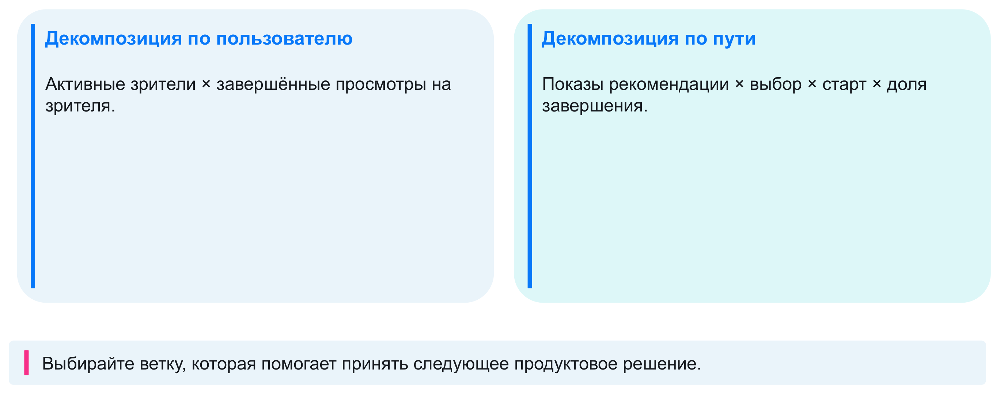

::: {.qa title="Вопросы из зала"}
**Есть ли термин «дерево зависимостей»?** Такой термин не встречается: в индустрии все оперируют деревом метрик.

**Говорит ли то, что метрика стоит на более низком уровне, о её важности — или только о том, как она влияет на верхнюю?** Каждый уровень влияет на NSM через промежуточные узлы: Users влияют на Profit через Revenue. Положение в дереве отражает путь влияния, а насколько оно сильное, можно подписать на стрелках. Это и используют, когда ранжируют задачи в бэклоге.

**Располагают ли графики на дашборде так же, как на дереве?** Нет, так не делают: на дашборд просто выносят основные показатели.
:::

[^n10a]: Примечание составителя: если каждую долю считать от предыдущего шага (увидевшие — от подходящей аудитории, начавшие — от увидевших, завершившие — от начавших), промежуточные величины в произведении сокращаются и остаётся ровно число завершённых просмотров. Поэтому формула верна только при согласованных знаменателях.

## Как интерпретировать изменения метрик

*Таймкод: 02:27:03 · слайды 70–77*

До сих пор речь шла о том, как выбирать метрики и связывать их в систему. Теперь — о том, что делать, когда метрика сдвинулась. Увидеть разницу на графике — только начало работы. Дальше нужно выяснить три вещи: **когда** возник этот «симптом» (так удобно называть изменение метрики), **какие группы** пользователей его сформировали и **что ещё происходило** в то же время. Причинного ответа это само по себе не даст, но подскажет, какие проверки делать дальше, и убережёт от слишком сильного вывода по одному графику. Ниже разобраны типичные ловушки интерпретации.

### Когда появляется сигнал: leading и lagging

Индикаторы различаются по времени, когда появляется сигнал. **Leading-индикатор** (ранний, опережающий) появляется раньше конечного результата и может быть с ним связан: активация, раннее целевое поведение пользователя. **Lagging-индикатор** (запаздывающий) фиксирует уже наступивший результат: удержание на 90-й день (D90 retention), churn, прибыль за квартал.

Ранний сигнал полезен для быстрых действий — по принципу «акция — реакция»: не нужно ждать квартал, чтобы понять, работает ли изменение. Но опираться на него можно, только если его связь с итоговым результатом проверена.

**Важно:** то, что показатель появился раньше, ещё не делает его причиной результата.

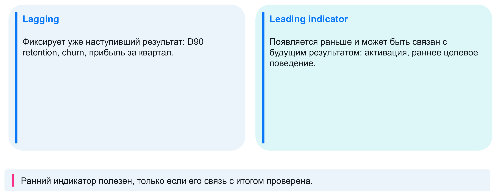

### Корреляция ещё не причинность

**Корреляция** означает, что два показателя меняются вместе. Сама по себе она не доказывает **причинность** — того, что изменение одного показателя вызывает изменение другого.

Пусть пользователи, которые сделали пять действий в первый день, удерживаются чаще. Напрашивается вывод: давайте доведём всех до пяти действий. Но, возможно, эти пользователи просто изначально сильнее мотивированы — и мотивация объясняет и пять действий, и удержание. Если принудительно заставить остальных сделать пять действий, удержание может не вырасти.

Для причинного вывода нужен подходящий дизайн проверки, а не только совпадение метрик. Например, случайное распределение пользователей по вариантам, то есть A/B-тест, с соблюдением условий эксперимента.

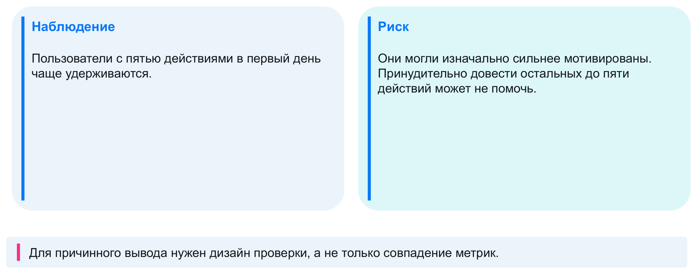

### Vanity metric

**Vanity metric** («показная» метрика) выглядит крупно, но плохо помогает принимать решения. «Отправлено 100 млн сообщений» звучит внушительно. Но сразу стоит спросить: сколько было активных отправителей? Сколько диалогов получили ответ? Не вырос ли спам? Если на 100 млн сообщений приходится, условно, 100 тыс. отправителей, то почти наверняка это спамеры. Чтобы их найти, смотрят на распределение числа сообщений на пользователя: выбросы в нём помогают выделить ботов.

Считать общий объём сообщений никто не запрещает. Но надо понимать, какое решение этот показатель поддерживает и какие дополнительные показатели нужны, чтобы его интерпретировать.

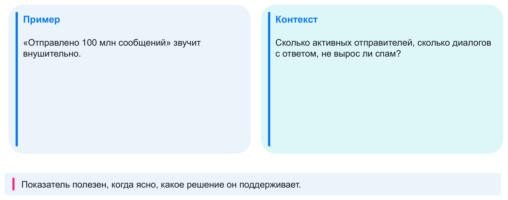

### Total и per-user

Общее значение метрики (**total**) и значение в расчёте на пользователя (**per-user**) рассказывают разные истории, поэтому важно смотреть в обоих разрезах. Пример:

- всего сообщений: было 100 млн, стало 120 млн — рост на 20%;
- DAU вырос с 50 до 70 млн;
- сообщений на одного активного пользователя: было $100/50 = 2{,}0$, стало $120/70 \approx 1{,}71$.

Общий объём вырос, а средняя интенсивность снизилась, и это проблема: рост общего объёма может сопровождаться снижением интенсивности. В отчёты чаще кладут абсолютные значения, но смотреть их нужно вместе с нормированными.

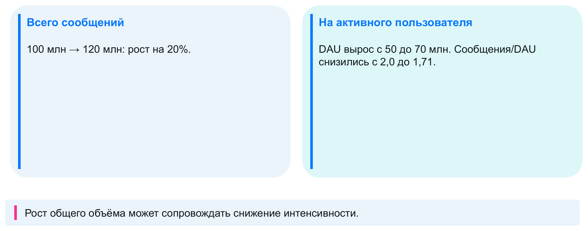

::: {.qa title="Вопросы из зала"}
**Откуда брать «нормальные» значения, например среднего числа сообщений на пользователя?** Для отчётов обычно берут простое среднее на пользователя. При диагностике — скажем, после инцидента, когда среднее выросло или упало, — смотрят ещё и на распределение (об этом — в следующем подразделе). Общепринятого правила, какое значение считать нормальным, нет. Обычно пытаются понять, как это устроено у конкурентов, — это называется **[бенчмарки]{.gl key="Бенчмарки"}**. Данные конкурентов не всегда доступны, но иногда их можно прикинуть. Например, площадка Mediascope публикует месячный охват (MAU) ведущих соцсетей, правда, к точности таких данных есть вопросы. Другой путь — опыт близких продуктов. Когда в MAX запускали сторис, смотрели на метрики ВКонтакте при запуске аналогичной функции, чтобы понять, что такое норма. При этом скромное значение метрики вполне может быть нормой для конкретного сервиса — на это нужно делать скидку.

**Можно ли растить метрику до бесконечности?** Никто не запрещает, но чаще всего кривая роста со временем замедляется и выходит на насыщение.

**Что такое операционные метрики?** **[Операционные метрики]{.gl key="Операционные метрики"}** измеряют внутреннюю эффективность продукта, скорость и качество повседневных бизнес-процессов. Это время выполнения заказа, доля ошибок и дефектов, производительность, нагрузка на поддержку, время загрузки сервиса. Такие метрики часто стоят на диагностическом уровне дерева и помогают объяснить, почему изменился итоговый показатель.
:::

### Среднее и типичный пользователь

Из математической статистики известно, что среднее чувствительно к очень большим значениям — к длинному хвосту распределения. Пусть 99 пользователей отправили по одному сообщению, а один — сто. Тогда среднее

$$\frac{99 \cdot 1 + 100}{100} = 1{,}99 \approx 2,$$

хотя типичный пользователь отправил одно сообщение. В реальности картина бывает такой: половина пользователей отправила по одному сообщению, а небольшая группа — сотни.

Поэтому, кроме среднего, смотрят на распределение, медиану, перцентили и заранее выбранные сегменты. **Медиана** — значение ровно посередине упорядоченного списка: значения сортируют и проводят черту посередине. **Перцентили** показывают, как ведут себя разные части аудитории, например самые активные и наименее активные пользователи. 50-й перцентиль — это и есть медиана.

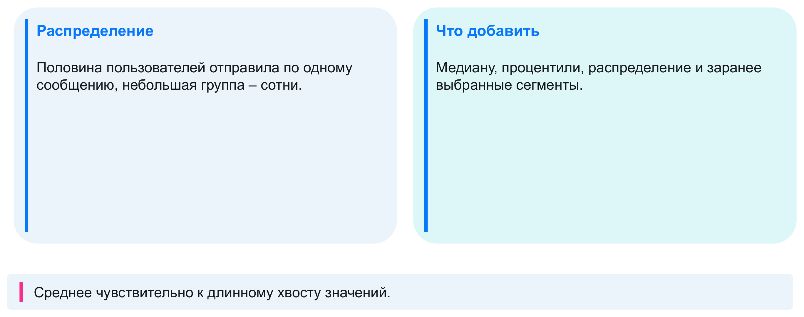

### Парадокс Симпсона

Агрегат может скрывать движение сегментов. **Парадокс Симпсона** — ситуация, когда общая динамика отличается от динамики внутри групп из-за того, что изменились доли этих групп. Средняя конверсия может вырасти, потому что стало больше пользователей из сегмента, который и раньше конвертировался лучше, хотя внутри каждого сегмента конверсия снизилась. Общее и детализированное значения смотрят в разные стороны.[^n11a] Другой пример: общая прибыль маркетплейса выросла, а в большинстве категорий, если смотреть по отдельности, уменьшилась. Этот эффект уже встречался при разговоре о когортах и сегментах; теперь у него есть имя.

На практике это значит: сравнивайте не только значения в сегментах, но и вес каждого сегмента в общей аудитории, причём в одинаковых условиях. Смотрите и на total, и на разбивку по сегментам. Проверяйте состав аудитории, прежде чем интерпретировать общий процент.

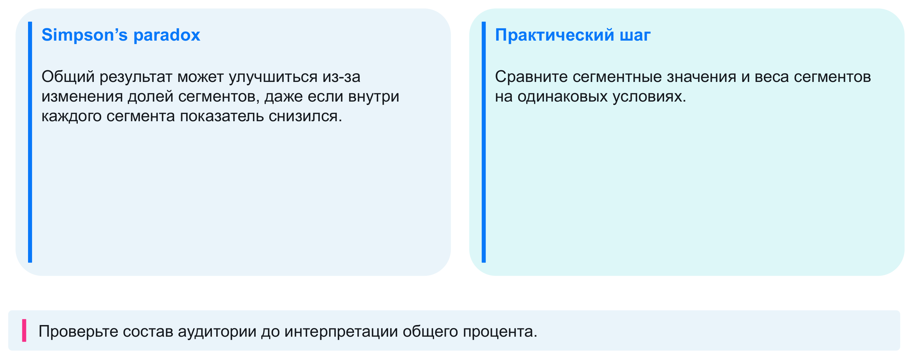

**Акцент лектора:** о парадоксе Симпсона очень любят спрашивать на собеседованиях на позиции junior и middle, особенно в Яндексе. Стоит разобрать его на нескольких примерах.

[^n11a]: Примечание составителя: числовая иллюстрация. Пусть в сегменте A конверсия упала с 50% до 45%, в сегменте B — с 10% до 8%, а доля сегмента A в аудитории выросла с 20% до 60%. Тогда общая конверсия была $0{,}2 \cdot 50\% + 0{,}8 \cdot 10\% = 18\%$, а стала $0{,}6 \cdot 45\% + 0{,}4 \cdot 8\% = 30{,}2\%$: в обоих сегментах конверсия снизилась, а в целом выросла.

### Метрика изменилась, а продукт — нет

Метрика может сдвинуться и без всяких изменений в продукте. Причины бывают внешние: сезонность, праздники, маркетинговая кампания, новостной фон, внешний рынок, изменившийся состав трафика. Бывают и проблемы с данными: сбой сбора событий, изменение логирования, часового пояса или определения события. Поэтому при любом движении метрики проверяют две вещи: качество данных и внешние события. Если в продукте ничего не меняли, нужно понять, что произошло вовне.

**Важный вывод:** фраза «после релиза стало лучше» описывает последовательность во времени, а «из-за релиза стало лучше» — это уже причинный вывод, и для него нужны дополнительные основания.

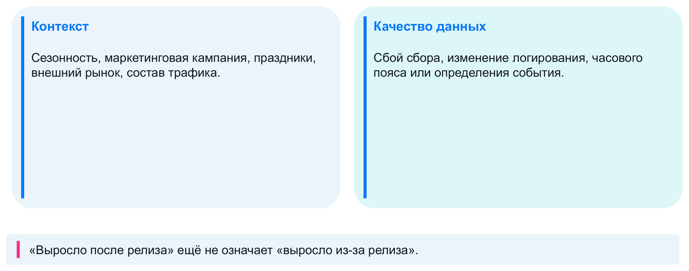

## Как выбрать метрики: фреймворк и финальный кейс

*Таймкод: 02:41:17 · слайды 78–91*

Метрик мы разобрали много, но список этот не исчерпывающий. Есть «модные» метрики вроде ARPU, ARPPU или GMV, а есть просто число кликов, и это тоже метрика. По сути, метрик столько, сколько вопросов вы задаёте продукту, так что за карьеру вы узнаете ещё множество новых. Важнее не каталог, а способ выбора, и его стоит закрепить на двух примерах: на сквозной гипотезе о цене доставки и на финальном кейсе.

Главный принцип такой: **до расчёта нужно договориться, какое поведение мы ожидаем, на какой аудитории и в каком окне**, то есть за какой период. Метрики не выбираются автоматически из списка знакомых. Сначала формулируем гипотезу (вопрос) и механизм её действия, затем подбираем основной результат, диагностику и защитные метрики.

### Гипотеза о цене доставки и eligible-аудитория

Изменение: показать стоимость доставки до выбора ресторана. Ожидаемый эффект: новые пользователи с большей вероятностью продолжат оформление, если увидят полную стоимость заранее. Обратите внимание на формулировку: ожидаемый ранний шаг (продолжение оформления) нужно отделить от итогового заказа. Кроме показателя результата, нужно определить eligible-аудиторию, то есть тех, у кого вообще есть возможность оформить заказ.

Какие условия влияют на эту возможность? Пользователь должен находиться в зоне доставки, ресторан должен быть открыт. Дальше список легко продолжить: работает ли сервис в это время суток, успевают ли доставить, не в стоп-листе ли блюдо, не мешает ли сложная погода, прошёл ли человек регистрацию, не мешает ли VPN, есть ли у него вообще деньги и не зашёл ли он только посмотреть блюда. Ограничений может быть много, и каждое из них меняет то, кого мы считаем в знаменателе.

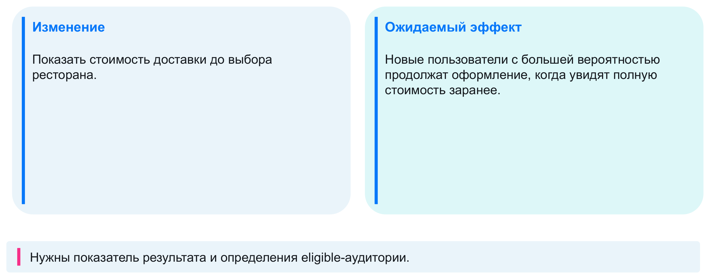

### Фреймворк выбора метрик

**Фреймворк выбора метрик** — это рамка, упорядоченный способ подобрать метрики под гипотезу. Он состоит из четырёх вопросов:

- **Primary** — какое целевое поведение должно измениться? Это основная метрика гипотезы.
- **Diagnostics** — на каких шагах мы увидим, где изменился путь?
- **Guardrails** — какие важные результаты нельзя ухудшить, какие метрики нельзя ронять?
- **Scope** — для кого, в каком окне и по какому определению считаем?

**Scope** — это рамки расчёта: аудитория, временное окно и точное определение метрики. Фреймворк превращает гипотезу в план измерения. Пока это прикидка, но именно такую заготовку потом натягивают на дизайн A/B-теста.

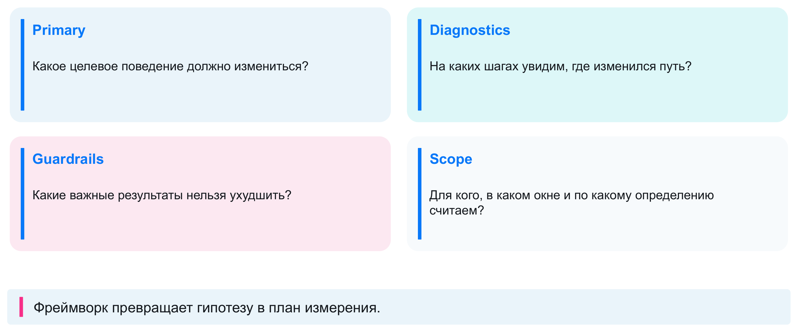

Если заполнить фреймворк для гипотезы о цене доставки, первым на ум приходит «число заказов» в качестве primary, а в качестве guardrails — общая выручка, отток старых клиентов, средний чек, время доставки (чтобы учитывать нагрузку на курьеров). Хорошая идея для диагностики — конверсия из каталога в оплату, а для scope — ограничиться клиентами, которые начали наполнять корзину, потому что именно на этом этапе пользователи разделяются по изменению.

Всё это разумно, но гипотеза касается **новых** пользователей. Если бы речь шла обо всех, количество заказов вполне подошло бы. Для нашей гипотезы набор выглядит так:

- **Primary:** доля новых пользователей, выбравших ресторан и начавших checkout в течение сессии.
- **Diagnostics:** сравнение ресторанов, возврат в каталог, просмотр условий доставки, конверсия из каталога в покупку — точки пути, которые затрагивает изменение.
- **Guardrails:** общая конверсия в завершённый заказ, отмены, жалобы, средняя маржа.
- **Scope:** новые eligible-пользователи.

Итоговый заказ здесь оказывается не в primary, а в guardrails: мы ждём сдвига на раннем шаге, а завершённый заказ следим, чтобы он не ухудшился[^n12a]. Финальный выбор всегда зависит от механики изменения и пользовательского пути.

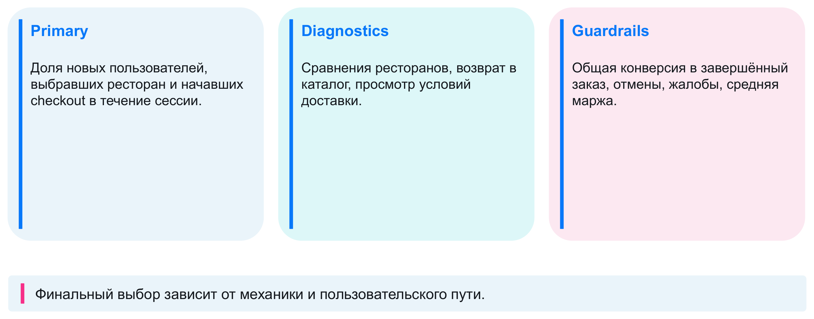

### Паспорт метрики и одно слово — разные метрики

Primary-метрику стоит сразу описать паспортом. Для конверсии в checkout он выглядит так:

$$
\text{Конверсия в checkout} = \frac{\text{eligible users, начавшие checkout}}{\text{уникальные eligible users, выбравшие ресторан в сессии}}
$$

В числителе — те, у кого была возможность заказать и кто начал оформление заказа; в знаменателе — все такие пользователи, выбравшие ресторан. Параметры: единица — пользователь, окно — сессия, сегмент — новые пользователи, источники событий — выбор ресторана и начало checkout. Если пользователь пробует несколько раз или заходит в нескольких сессиях, нужно заранее зафиксировать правило атрибуции.

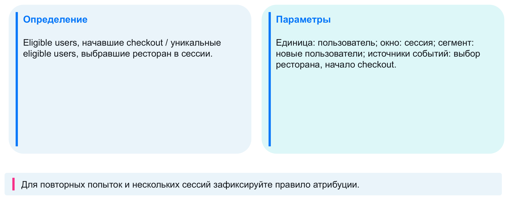

Зачем такая дотошность? Потому что одно слово может обозначать разные метрики. Для retention нужно указать, какое событие считается возвратом, после какого стартового события и в какой день или окне. Заказ может быть создан, оплачен, подтверждён, доставлен или отменён — это всё разные метрики. Конверсия зависит от того, кто стоит в знаменателе. Название не заменяет формулу и правила учёта.

**Акцент лектора:** видя какую-то метрику, прежде чем делать выводы, убедитесь, как она считается. Если считали не вы, спросите, как именно. Такие недоразумения случаются и в реальной работе.

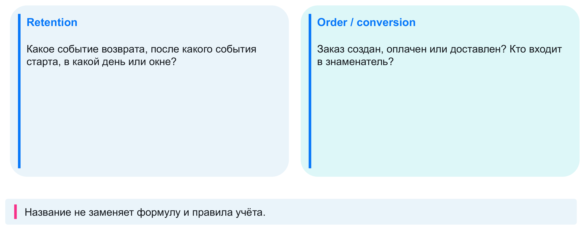

### Финальный кейс: AI-сводка в групповом чате

**AI-сводка** — функция мессенджера, которая кратко пересказывает пропущенные сообщения в групповом чате; её ценность в том, чтобы быстрее восстановить контекст. Задача: предложить primary metric, диагностику и guardrails, уточнить аудиторию и окно.

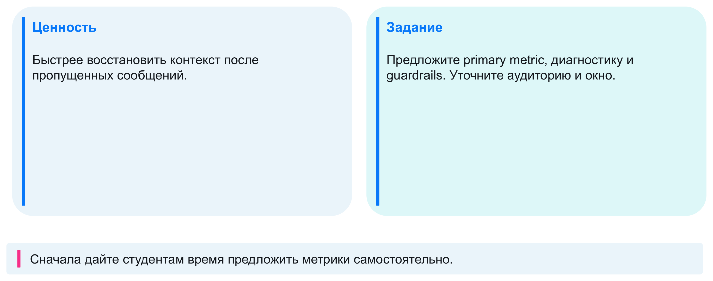

Возможный outcome для primary — доля вернувшихся пользователей, которые выполнили целевое действие в чате в заданном окне после просмотра сводки. Альтернатива — активация пользователей; если её не взяли в primary, она пойдёт в диагностику. Количество созданных сводок и CTR кнопки — это output: они показывают использование, но не то, решает ли сводка задачу. И даже сравнение «после просмотра» само по себе не доказывает, что действие вызвала именно сводка.

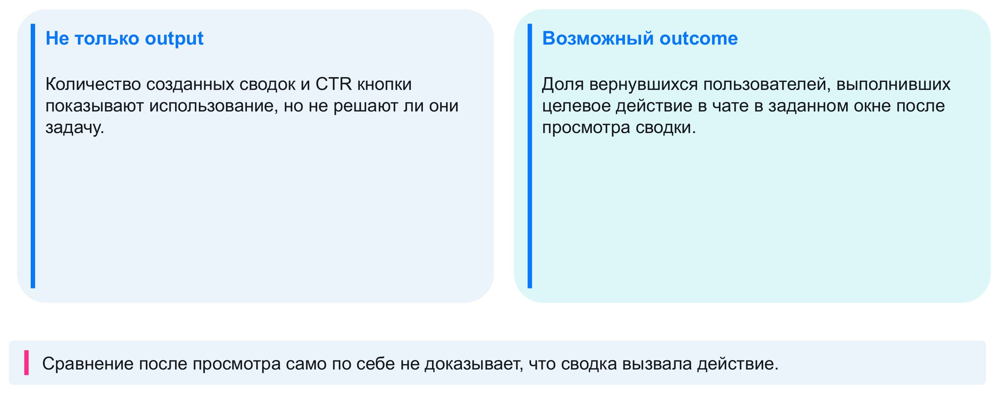

Диагностика: открытие и дочитывание сводки, время до целевого действия (например, до отправки первого сообщения), отправка сообщения, переход к непрочитанным. Guardrails: уход из чата или mute, жалобы на ошибки в содержании, отключение функции, latency. Их смысл в том, чтобы пользователь не ушёл совсем и чтобы ему не показалось, что мы засоряем чат. Primary metric должна соответствовать гипотезе и выбранному дизайну проверки.

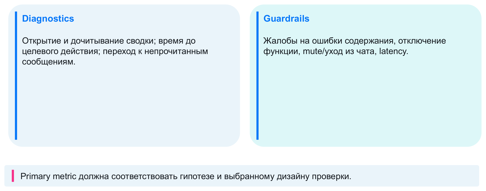

### Как мыслит продуктовый аналитик

Ход мысли аналитика укладывается в три шага: сформулировать вопрос о ценности или результате; выбрать наблюдаемое поведение и аудиторию — какой путь должен измениться и у кого; проверить интерпретацию — какие нужны диагностики и guardrails. Мыслить нужно не только primary-метриками, но и диагностическими (их ещё называют прокси, косвенными, или secondary, вторичными метриками), и guardrails. Решение начинается с определения метрики, а не с поиска самого большого графика.

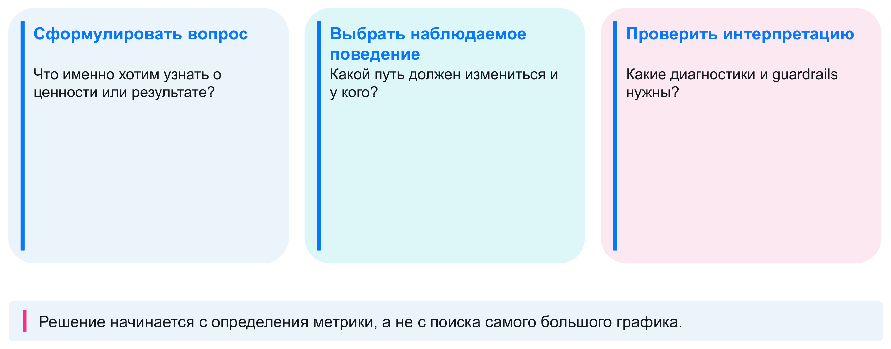

Перед тем как использовать метрику, пройдите чек-лист:

- **Определение:** что считаем, кого включаем, какое окно, событие и фильтры; если это конверсия — относительно чего, то есть какой знаменатель.
- **Интерпретация:** насколько метрика близка к ценности, отвечает ли она на наш вопрос, что ещё могло изменить показатель.
- **Система:** какая диагностика объяснит изменение и что нельзя ухудшить.

Записывайте определение до расчёта и сравнивайте только сопоставимые значения.

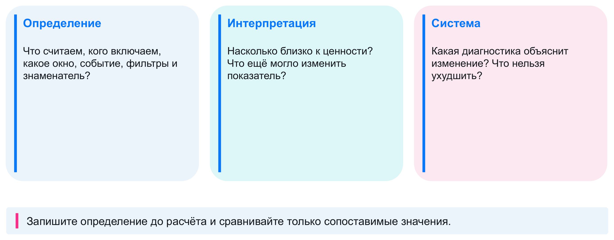

### Итоги

Логика лекции сводится к трём переходам. **Вопрос → метрика:** сначала продуктовый вопрос и поведение, затем показатель, а не наоборот. **Результат → диагностика:** primary показывает ожидаемый исход, но всегда нужно понять, почему мы его получили, и диагностика помогает локализовать динамику. **Ценность → бизнес:** ценность для пользователя в итоге переходит в бизнес-результат, а NSM, драйверы и guardrails дают целостную картину.

Метрика полезна, когда помогает выбрать следующее действие. Допустим, конверсия в заказ снизилась, а ошибки оплаты выросли только на Android. Следующий шаг — проверить оплату на Android, а не переделывать весь путь заказа. Метрики указали, где искать, но сами по себе ещё не доказывают, что сбой вызвало обновление.

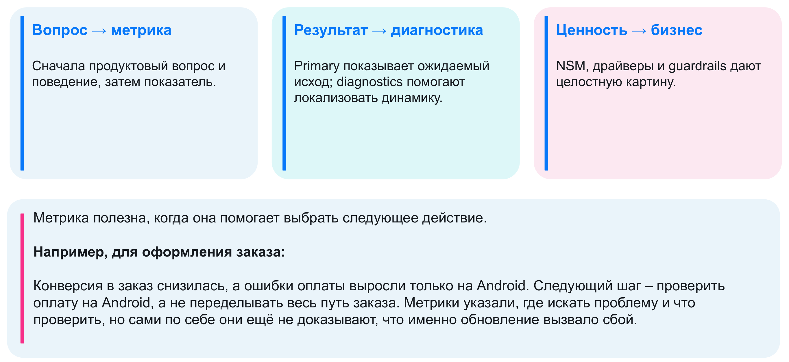

Материала много, и он уляжется не сразу. В темах про A/B-тесты такие системы метрик придётся строить в полную силу, в том числе на кейсах с собеседований. Следующая лекция — SQL: как от продуктового вопроса через определение метрики и данные прийти к запросу.

::: {.qa title="Вопросы из зала"}
**Получается, в одном дереве метрик могут быть одинаковые метрики в разных ветвях, которые называются одинаково, но считаются по-разному? Как это описывать?** Да, такое бывает. Например, показатель по всей аудитории может идти в разные ветви. В такой ситуации можно вести от этой метрики ветви в разные метрики.
:::

[^n12a]: Примечание составителя: ранний шаг ближе всего к самому изменению (цена показана до выбора ресторана), поэтому эффект на нём заметнее; на итоговый заказ влияет много других факторов, и его разумнее контролировать как защитную метрику.

## Главное из лекции {.unnumbered}

::: keypoints
1. **Метрика начинается с вопроса, а не с таблицы.** Порядок всегда один: продуктовый вопрос → поведение, в котором проявляется ценность → определение (кого, какое событие, за какой период) → показатель. Число, которое просто «есть в данных», само по себе ничего не доказывает.
2. Рост метрики может означать и улучшение, и ухудшение: больше времени в приложении хорошо для видеосервиса и плохо для такси или банка. Метрика — симптом, а не объяснение, поэтому продукт оценивают системой связанных показателей.
3. **Output** (что сделала система) не равен **outcome** (что изменилось для пользователя). Метрика результата говорит, изменился ли исход; диагностические метрики — где на пути это произошло; guardrails — не навредили ли мы чему-то важному. Диагностика подсказывает, где искать, но не доказывает причину.
4. У каждой метрики должен быть **паспорт**: единица счёта, событие активности, окно и часовой пояс, фильтры. Без него DAU одной команды не совпадёт с DAU другой, а сумма платформенных DAU окажется больше реального числа людей.
5. Путь пользователя описывают стадии Acquisition → Activation → Engagement → Retention → Monetization. Это карта вопросов, а не обязательная воронка: у каждой стадии свои метрики, и их нормы зависят от естественной частоты потребности в продукте.
6. **Любая конверсия начинается со знаменателя.** Одни и те же 300 заказов дают 30% от начавших оформление и 15% от всех посетителей: оба числа верны, но отвечают на разные вопросы. Воронка показывает, где теряются пользователи, но не почему.
7. Retention без методики — просто подпись: нужно указать событие возврата, стартовое событие и способ расчёта (exact-day или rolling). Сравнивать когорты можно только на одинаковом возрасте; незакрытое окно — это неизвестность, а не ноль.
8. Ценность для пользователя и деньги бизнеса связаны, но не тождественны. ARPU и ARPPU отличаются знаменателем, LTV — оценка модели, а не факт, GMV — оборот площадки, а не её выручка.
9. **North Star Metric** — общий долгосрочный ориентир ценности, на который могут влиять все команды и который трудно «хакнуть». Её дополняют guardrails с порогами, заданными до эксперимента, а дерево метрик раскладывает NSM на драйверы и диагностику.
10. Изменение агрегата нужно проверять: что изменилось внутри групп, а что — в их весах (парадокс Симпсона); total рядом с per-user; среднее рядом с медианой; качество данных и внешние события. «После релиза» ещё не значит «из-за релиза».
:::

## Что подчеркнул лектор {.unnumbered}

::: emphasis
- **Заучивать метрики не нужно.** Метрик столько, сколько вопросов вы задаёте продукту; важнее уметь выбрать измерение под вопрос и объяснить, почему оно подходит.
- **Никогда не начинайте с «у нас есть таблица, давайте что-нибудь посчитаем».** Сначала вопрос и поведение, потом показатель.
- **Не берите метрику слишком далеко от изменения.** Типичная ошибка на собеседовании: оценивать качество поиска на маркетплейсе по выдаче заказов в ПВЗ.
- **Смотрите и на системную, и на пользовательскую сторону:** проблема может быть на любом этапе пути, и каждый этап диагностируется отдельно.
- **Видя чужую метрику, сначала выясните, как она считается.** Одно слово («retention», «заказ», «конверсия») может обозначать разные метрики.
- **Всегда называйте базу и период** (для денежных метрик — ещё валюту и тип выручки), а для конверсии — знаменатель.
- **Порог guardrail задают до эксперимента,** иначе после него любой вред легко оправдать ростом главной метрики.
- **DAU — не лучшая NSM:** он выходит на плато и измеряет частоту, но не интенсивность. Time spent легко «хакнуть», ухудшив путь пользователя.
- **Парадокс Симпсона очень любят спрашивать на собеседованиях** на позиции junior и middle — разберите его на нескольких примерах.
- **Не добавляйте показатель в дерево только потому, что он доступен в BI.**
:::

## Стоит посмотреть в видео {.unnumbered}

::: watch
- **≈ 00:16–00:22** — интерактив с такси и мессенджером: какие показатели итоговые, а какие диагностические; ответы студентов звучат только в пересказе из чата.
- **≈ 00:33–00:38** — разбор падения DAU по дереву метрик и интерактив «DAU упал, а WAU на месте».
- **≈ 00:59–01:06** — связанная и несвязанная воронка, расчёт конверсий по шагам на числовом примере.
- **≈ 01:19–01:21** — задача про GMV, выручку платформы и маржинальный доход.
- **≈ 02:00–02:05** — кейс с рекомендациями в корзине и guardrail «средний чек»: у лектора прерывалась связь, объяснение восстановлено по контексту.
- **≈ 02:10–02:12** — пример верхнеуровневого дерева (Profit → Revenue, Costs → Users, LTV): картинку лектор показывала из чата, на слайдах её нет. Запись звонка ≈ 02:23–02:24 не велась.
- **≈ 02:21–02:27** — интерактив: дерево метрик для онлайн-кинотеатра и разбор метрики «рубль в минуту».
- **≈ 02:44–02:48** — заполнение фреймворка Primary / Diagnostics / Guardrails / Scope для гипотезы о цене доставки вместе с ответами из чата.
:::

## Глоссарий {.unnumbered}

| Термин | Коротко |
|:--|:-----------|
| **Продуктовая метрика** | Количественно определённый показатель состояния продукта, поведения пользователей или результата изменения |
| **Показатель** | Просто число из данных (клики, открытия экрана); полезно, только если отвечает на вопрос |
| **Итоговая метрика** | Метрика результата: событие, ближайшее к полученной пользователем ценности |
| **Промежуточные показатели** | Шаги пути до итогового события; нужны для диагностики |
| **Output** | Что произвела система: отправленные пуши, показанные экраны, созданные сводки |
| **Outcome** | Что изменилось для пользователя: вернулся, выполнил задачу, завершил заказ |
| **Диагностические метрики** | Показывают, на каком шаге или у какой группы произошло изменение |
| **Task success rate** | Доля успешно завершённых подходящих попыток выполнить задачу |
| **DAU / WAU / MAU** | Число уникальных активных пользователей за день / неделю / месяц при выбранном определении активности |
| **Дерево метрик** | Граф, в котором метрика верхнего уровня раскладывается на влияющие на неё метрики |
| **Частотность** | Как часто пользователь возвращается в продукт |
| **Паспорт метрики** | Зафиксированное определение: единица счёта, событие, окно, фильтры и исключения |
| **Стадии отношений с продуктом** | Acquisition → Activation → Engagement → Retention → Monetization — карта вопросов о пути пользователя |
| **Активация** | Момент, когда пользователь впервые получил ценность продукта |
| **Activation rate** | Доля новых eligible-пользователей, выполнивших ключевое действие в заданное окно |
| **Eligible** | Подходящие пользователи: те, у кого есть доступ к ключевому действию |
| **Time-to-value** | Время от входа в продукт до первого получения ценности |
| **DAU/MAU** | Средний DAU за период, делённый на MAU того же периода; грубая оценка «липкости» |
| **Вовлечённость** | Как активно пользуются продуктом: частота и интенсивность |
| **Охват функции** | Доля воспользовавшихся функцией среди тех, кому она доступна или показана |
| **Повторное использование** | Доля попробовавших функцию, кто вернулся к ней в заданном окне |
| **Конверсия** | Доля пользователей, перешедших с одного шага на другой |
| **Знаменатель** | База, относительно которой считается доля; определяет смысл конверсии |
| **Воронка** | Последовательность шагов пути с числом дошедших до каждого шага |
| **Конверсия по шагам (step conversion)** | Отношение числа пользователей на соседних шагах воронки |
| **Связанная воронка** | Воронка, где на каждом шаге считаются только прошедшие все предыдущие шаги |
| **Несвязанная воронка** | Число уникальных пользователей на каждом шаге без проверки связи; приблизительная оценка |
| **Retention** | Доля пользователей исходной группы, совершивших целевое действие возврата в заданный период |
| **D1, D7, D30** | Retention на 1-й, 7-й и 30-й день после старта |
| **Exact-day retention** | Возврат именно в день N (или в оговорённом окне вокруг него) |
| **Rolling retention** | Возврат в день N или в любой более поздний день; не ниже exact-day |
| **Retention-кривая** | Удержание по неделям после старта когорты: ранний спад, плавное снижение или плато |
| **Плато** | Горизонтальный участок retention-кривой: у продукта есть возвращающееся ядро |
| **Churn** | Отток: отсутствие целевого действия дольше оговорённого порога |
| **Цензурирование** | Неполное окно наблюдения: значение ещё неизвестно, а не равно нулю |
| **Выручка** | Деньги, которые продукт получает по своей бизнес-модели |
| **Декомпозиция выручки** | Выручка = платящие × покупок на платящего × выручка на покупку |
| **ARPU** | Средняя выручка на пользователя выбранной базы за период |
| **ARPPU** | Средняя выручка на платящего пользователя за период |
| **LTV** | Ценность пользователя за весь период отношений с продуктом; обычно прогноз |
| **GMV** | Общая стоимость заказов, прошедших через площадку; оборот, а не выручка |
| **Маржинальный доход** | Выручка платформы минус переменные затраты на заказы |
| **Сегмент** | Часть аудитории, выделенная по признаку, важному для вопроса |
| **Когорта** | Группа пользователей, объединённая общим стартовым событием и временем |
| **Когортный retention** | Доля пользователей когорты, вернувшихся в каждую неделю после старта |
| **North Star Metric (NSM)** | Общий долгосрочный ориентир ценности продукта для всех команд |
| **Primary metric** | Главная метрика конкретной проверки, выбранная до запуска |
| **Time spent** | Время, которое пользователь проводит в продукте |
| **Guardrails (защитные метрики)** | Метрики, которые не должны ухудшиться, пока растёт основной результат |
| **Порог guardrail** | Допустимая граница ухудшения защитной метрики, заданная до эксперимента |
| **Драйверы** | Факторы, которые формируют NSM; следующий уровень дерева |
| **Уровень дерева** | Насколько метрика далека от вершины дерева |
| **Декомпозиция** | Представление метрики формулой (обычно произведением) метрик следующего уровня |
| **Leading-индикатор** | Ранний сигнал, появляющийся раньше конечного результата |
| **Lagging-индикатор** | Запаздывающий показатель уже наступившего результата |
| **Корреляция** | Два показателя меняются вместе |
| **Причинность** | Изменение одного показателя вызывает изменение другого; требует дизайна проверки |
| **Vanity metric** | «Показная» метрика: выглядит крупно, но плохо помогает принимать решения |
| **Total / per-user** | Общее значение и значение на пользователя; рассказывают разные истории |
| **Бенчмарки** | Ориентиры «нормальных» значений по конкурентам и близким продуктам |
| **Операционные метрики** | Внутренняя эффективность и качество процессов: время выполнения, ошибки, нагрузка |
| **Медиана** | Значение посередине упорядоченного ряда; 50-й перцентиль |
| **Перцентили** | Значения, показывающие поведение разных частей распределения |
| **Парадокс Симпсона** | Общая динамика расходится с динамикой внутри групп из-за изменения их долей |
| **Фреймворк выбора метрик** | Primary, Diagnostics, Guardrails и Scope для конкретной гипотезы |
| **Scope** | Рамки расчёта: аудитория, временное окно и определение метрики |
| **AI-сводка** | Функция мессенджера, кратко пересказывающая пропущенные сообщения группового чата |
