::: {.abstract title="О чём лекция"}
Это вводная лекция курса. Она отвечает на вопросы: что такое рекомендательная система и чем она отличается от поиска, какие задачи она решает (top-N и прогноз рейтинга), как область развивалась с 1979 года до LLM, на каких данных строятся рекомендации (явный и неявный фидбэк, контент, контекст), с какими трудностями сталкивается любая такая система (bias, справедливость, информационный пузырь, холодный старт) и из каких компонентов она обычно состоит. Материал обзорный, почти без формул: большинство тем здесь только очерчены, подробно они разбираются в следующих темах курса. Для чтения достаточно общих представлений о машинном обучении (классификация, нейросети, метрики).

Около трети записи занимают организационные вопросы и ответы слушателям. Организационная часть сжата в первый раздел, а содержательные вопросы вплетены в разделы, к которым относятся, и выделены серыми блоками — их можно пропустить при беглом чтении. Схемы и таблицы со слайдов приведены прямо в тексте. Сноски с пометкой «Прим. составителя» — пояснения, которых не было в лекции.
:::

## Зачем изучать рекомендательные системы и как устроен курс

*Таймкод: 00:00:00 · слайды 1–23*

### Рекомендации вокруг нас

Информационное пространство вокруг нас буквально пропитано рекомендательными системами (англ. recommender systems, сокращённо **RecSys**). Телевизор предлагает фильмы, подобранные под нас, умная колонка включает музыку по нашему вкусу, видеосервисы, музыкальные стриминги и социальные сети строят ленты персонально для каждого.

Для компаний, которые их внедрили, это заметная доля бизнеса:

- в Netflix 80 % потребляемого контента приходит из рекомендаций;
- на YouTube 60 % кликов по видео приходится на рекомендации;
- в Spotify 40 % прослушиваний определяются рекомендациями;
- в Amazon 35 % дохода генерирует движок рекомендаций.

Индустрия, в свою очередь, подталкивает науку. Число научных статей о рекомендательных системах в Scopus росло каждый год с 2019 по 2023-й (примерно с 14 до 20 тысяч в год), и тенденция сохраняется. Растёт и рынок: по прогнозу Precedence Research, его объём увеличивается в среднем на 36,33 % в год, с 5,39 млрд долларов в 2024 году до почти 120 млрд к 2034-му. Раз внедрений становится больше, индустрии нужно всё больше людей, которые умеют строить такие системы. Этот курс даёт то, что необходимо знать, чтобы войти в эту сферу.

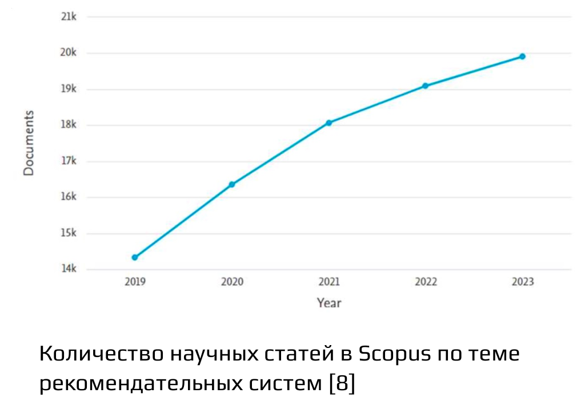

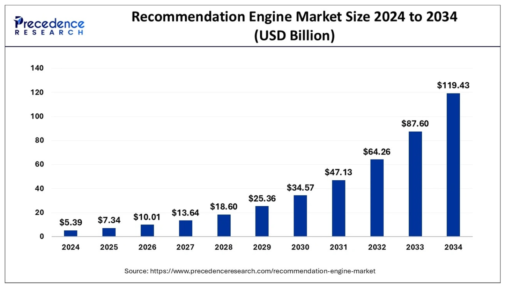

### Логика программы

Курс состоит из 10 лекций и 7 семинаров. Сложность растёт от темы к теме:

1. **Введение** — взгляд на рекомендательные системы «с высоты птичьего полёта» и на весь спектр задач курса.
2. **Ранжирование и метрики качества** — как упорядочивать объекты рекомендаций и как измерять качество рекомендаций онлайн (на живых пользователях) и офлайн (на исторических данных).
3. **Признаки и классические модели** — коллаборативная фильтрация (рекомендации по сходству поведения пользователей), контентные и гибридные модели. Это база и классика области.
4. **Двухбашенные модели** — с этой темы начинаются нейросетевые технологии, которые сейчас применяют многие компании. Идея на пальцах: отдельно строим «башню» для пользователей и «башню» для объектов, а предсказание делаем на их пересечении.
5. **Sequential Recommendation** — учитываем не просто факт просмотра клипа или покупки товара, а последовательность действий пользователя. Это даёт более качественные рекомендации.
6. и 7. **Нейросетевая кандидатогенерация** и **нейросетевое ранжирование** — две объёмные темы о production-ready решениях, которые используются в современных рекомендательных системах.
8. и 9. **Графовые нейронные сети** и **LLM × RecSys** — более экспериментальные направления на пике исследований, ещё не внедрённые повсеместно. Это плацдарм на будущее: так рекомендательные системы видятся в ближайшие несколько лет.
10. **Перспективы рекомендательных систем** — итоги курса и нерешённые проблемы области.

Простые статистические методы вроде «показывать самое популярное» мы рассматривать не будем: в курсе с самого начала используется машинное обучение, примерно с четвёртой темы начинаются нейронные сети, а завершается курс языковыми моделями в рекомендациях. Эмбеддинги, в том числе для видео и картинок, появятся вместе с нейросетями: без них признаковое пространство для нейросети не представить.

### Как устроена аттестация

Знания проверяются тремя способами. **Рубежный контроль** — промежуточный тест на Moodle; всего их четыре, каждый открывается после соответствующего блока тем и проверяет только материал, пройденный с предыдущего контроля: общие понятия и метрики; классические и двухбашенные модели; Sequential и кандидатогенерация; ранжирование и графовые модели. Домашних заданий три: рекомендательная система на классических методах, на двухбашенной модели и система с отбором кандидатов и ранжированием. Они сдаются на **AllCups** — платформе VK для соревнований по программированию и анализу данных: решение (Python-файл по шаблону) загружается туда и проверяется автоматически, поэтому оформлять его нужно строго по инструкции. Итоговый экзамен — тоже тест.

| Активность | Количество | Баллов за одну | Всего |
|:--|:--|:--|:--|
| Домашнее задание | 3 | 15 | 45 |
| Рубежный контроль | 4 | 7 | 28 |
| Экзамен (итоговый тест) | 1 | 23 | 23 |
| Развёрнутая обратная связь | 1 | 4 | 4 |

Оценка «3» ставится за 65–74 балла (минимум 1 ДЗ и 2 рубежных контроля), «4» — за 75–84 (2 ДЗ и 3 контроля), «5» — за 85–100 (3 ДЗ и 3 контроля). **Важно:** итоговый тест обязателен для любой оценки. Сертификат выдаётся на платформе после 20 декабря 2026 года. Лекции можно смотреть в записи; вопросы по курсу лучше задавать в чате курса.

::: {.qa title="Вопросы из зала"}
**Кто такой специалист по RecSys — Data Scientist или ML-инженер?** Зависит от компании. В рекомендательных системах есть работа во всех ипостасях: инженерия данных, программирование, машинное обучение, аналитика. В VK над рекомендациями бок о бок работают ML-инженеры, аналитики, дата-инженеры и бэкенд-разработчики. Курс сосредоточен на моделях машинного обучения: именно они дают интеллектуальную ценность и делают систему рекомендательной, тогда как бэкенд или аналитика сами по себе с рекомендациями могут быть не связаны.

**Можно ли пользоваться ИИ-ассистентами вроде ChatGPT и Claude?** Можно, мы и сами используем их, как и AutoML, при разработке рекомендательных систем. Но сгенерированное не всегда верно ни по логике, ни по качеству кода, поэтому всё написанное ассистентом нужно перечитывать, понимать и контролировать.

**Заменит ли AutoML или ИИ специалиста по рекомендациям?** Нет. Это вспомогательные инструменты для инженера, задачу рекомендаций сами по себе они не решат. Область будет расти: без рекомендаций уже невозможно представить повседневную жизнь.

**Где работают специалисты по RecSys?** Из крупных компаний — VK, Яндекс, X5, Ozon, Авито, там много профессионалов высокого уровня. Путь начинающего — вакансии и стажировки: из стажёров очень часто вырастают джуны.
:::

## Что такое рекомендательная система

*Таймкод: 00:36:33 · слайды 24–26*

Прежде чем говорить о методах, взглянем на рекомендательные системы с высоты птичьего полёта: что это такое, из каких частей обычно состоит архитектура, с какими вызовами (challenges) сталкиваются инженеры и исследователи и как устроены данные. Это базис, который в следующих темах курса будет раскрываться подробнее.

Начнём с определения. В основополагающих работах по рекомендательным системам их несколько, и все они, по сути, об одном. Ким Фальк в книге «Рекомендательные системы на практике» формулирует так: **рекомендательная система** — это информационная система, которая подбирает и предлагает пользователю релевантный контент, основываясь на своих знаниях о пользователе, контенте и взаимодействии пользователя и контента.

Ключевые слова здесь — «подбирает» и «предлагает». Рекомендательная система не создаёт новой информации: она выбирает из того, что уже существует. Выбор опирается на знания, а часто и на предположения о пользователе, о контенте и о том, как пользователь с этим контентом взаимодействует.

**Важно:** рекомендательная система не генерирует новое, а отбирает подходящее из уже существующего.

Второе определение взято из Recommender Systems Handbook (F. Ricci et al.): *Recommender systems (RSs) are software tools and techniques that provide suggestions for items that are most likely of interest to a particular user.* Здесь это уже программный инструмент, который предлагает айтемы, интересные **конкретному** пользователю. Акцент сделан на персонализации: подбор ведётся под определённого человека, а не для всех сразу.

В этом определении появляется понятие, которым мы будем пользоваться весь курс. Рекомендательные системы оперируют двумя основными сущностями:

- **пользователь (user)** — тот, для кого подбираются рекомендации;
- **айтем (item)** — то, что подбирается и предлагается пользователю.

Айтемом может быть что угодно, в зависимости от области, где работает система: видео, аудиотрек, товар в супермаркете, банковское предложение вроде кредита. Поэтому и слово «контент» в первом определении не стоит понимать буквально: рекомендовать можно не только контент.

Третье определение дают Shaina Raza и Mizanur Rahman в обзоре *A Comprehensive Review of Recommender Systems: Transitioning from Theory to Practice*: *Recommender Systems (RS) are a type of information filtering system designed to predict and suggest items or content — such as products, movies, music, or articles — that a user might be interested in.* Здесь главное слово — фильтрация. **Система информационной фильтрации** отсеивает из большого потока информации то, что нужно конкретному человеку. Рекомендательная система фильтрует доступные айтемы, чтобы спрогнозировать, какие из них будут интересны пользователю.

**Важный вывод:** сведя три определения вместе, получаем рабочую формулировку. Рекомендательная система — это информационная система или программное обеспечение, которое на основе найденных в данных закономерностей предлагает конкретному пользователю айтемы, наиболее интересные ему для просмотра, покупки или иного взаимодействия.

## Поиск и рекомендации

*Таймкод: 00:41:56 · слайд 27*

Мы определили рекомендательную систему как систему информационной фильтрации. Но фильтрация бывает разной, и у неё есть две основные задачи: поиск информации и рекомендации. Их важно различать, хотя методы у них во многом общие.

### Что общего

И поиск, и рекомендации относятся к системам фильтрации информации: **на выходе не генерируется новая информация или знание**, хотя внутри алгоритма такая информация может использоваться. Поясним на примере. Многие ML-алгоритмы строят вспомогательные объекты, например векторы, которые близки к продуктам, понравившимся пользователю. Сам такой вектор не описывает ни один реальный айтем, это нечто сгенерированное. Похоже устроен центр кластера в k-means: он не совпадает ни с одним объектом кластера, но по нему можно найти объекты, лежащие рядом. Так и в рекомендациях: сгенерированное представление служит лишь инструментом поиска, а пользователю система отдаёт существующие айтемы. Такие алгоритмы мы подробно разберём в следующих темах курса.

### Чем они различаются

Поиск устроен по схеме «Query → Documents». На входе **запрос (query)**, явная формулировка того, что нужно пользователю, а на выходе документы, найденные по этому запросу. Пользователь точно знает, что ищет, у него есть точные требования к результату, и он может выразить их ключевыми фразами.

Рекомендации устроены по схеме «User → Items». Пользователь точно не знает, что хочет найти, и **не может** использовать ключевые фразы. Часто он даже не инициирует работу системы: она сама подбрасывает контент в момент взаимодействия, например клипы или видео в ленте, или при заказе продуктов спрашивает: «Не забыли ли вы купить вот это?». Пользователь системе не помогает, и она должна сама понять по признакам, что ему интересно. Такими признаками служат предыдущая история взаимодействия пользователя с системой и уже известная информация о нём.

Можно возразить, что поиск тоже умеет учитывать историю просмотров пользователя. Это так, но для поиска история лишь дополнительная информация, а главное в нём — **обязательный явный запрос**. В рекомендациях запроса нет: на входе в основном неявная информация о пользователе (история просмотров, возможно, демографические данные) и контекст, то есть обстоятельства, в которых пользователь зашёл в систему, например время. Поэтому задачи различает не учёт истории, а наличие явного запроса.

**Важный вывод:** поиск и рекомендации — близкие задачи, и методы свободно переходят из одной в другую. В VK, например, есть общее ядро, которое используется и в поиске, и в рекомендациях. Другой пример — **двухбашенные модели**: их изначально разработали для поиска, а затем переиспользовали в рекомендациях. Подробно они разбираются в теме «Двухбашенные модели».

### Поиск и рекомендации в одном продукте

Обе задачи часто живут в одном продукте, но работают в разных местах. В VK Видео есть строка поиска: вы вводите, что хотите увидеть, и по запросу формируется выдача, это работа поиска. Когда же видео закончилось и вам предлагают, что посмотреть ещё, хотя вы ничего не спрашивали, работают рекомендации. То же в приложениях доставки продуктов: в поиск вы вводите то, что точно хотите купить, а после сборки корзины приложение подсказывает, не забыли ли вы что-нибудь ещё.

::: {.qa title="Вопросы из зала"}
**Можно ли применять рекомендательные системы в дейтинговых приложениях, где пользователь одновременно и айтем?** Да, людей вполне можно рекомендовать другим людям. Так работает рекомендация друзей, так работают и VK Знакомства, где используется движок рекомендательной системы VK.

**Если в музыкальном сервисе пользователь нажал на жанр «рок», разве это не ключевое слово?** Это нажатие можно записать в профиль пользователя («ему нравится рок»), и оно отразится на будущих рекомендациях. Но отсюда не следует, что рекомендовать нужно только рок: так сформируется **информационный пузырь**, при котором пользователь видит лишь узкий круг похожего контента. Об этой проблеме поговорим в разделе о Challenges.

**Если у пользователя конкретный вопрос, не лучше ли дать ему прямой ответ?** Да, но это задача поиска, а не рекомендательной системы. Именно поэтому в продуктах есть и строка поиска, и рекомендательная выдача.

**Можно ли дать пользователю ограничить рекомендации, дописав что-то вроде запроса?** Да, такие эксперименты идут в VK Видео: там появится ИИ-помощник, который по вашей подсказке будет советовать, что посмотреть.
:::

## Две основные задачи: top-N и прогноз рейтинга

*Таймкод: 00:47:11 · слайды 28–30*

Мы договорились, что рекомендательная система отбирает для конкретного пользователя интересные ему айтемы. Но что именно она должна выдавать на выходе? Здесь принято различать две основные постановки задачи: **рекомендацию top-N элементов** и **прогноз рейтинга**. Сразу оговорюсь: на практике они часто пересекаются, и одна нередко переходит в другую.

### Рекомендация top-N

В задаче **top-N рекомендации** на входе у нас таблица взаимодействий «пользователь — айтем»: пользователь A взаимодействовал с айтемом a, пользователь B с айтемом b и так далее. Никаких оценок в этой таблице нет, есть только сам факт взаимодействия. На выходе система должна выдать пользователю набор из N айтемов.

Суть задачи в том, чтобы из большого множества айтемов отобрать те, которые с высокой вероятностью понравятся пользователю. Заметим: между собой отобранные айтемы никак не проранжированы. Результат здесь понимается именно как множество «подходящих» айтемов, а не как упорядоченный список, где первый лучше второго.

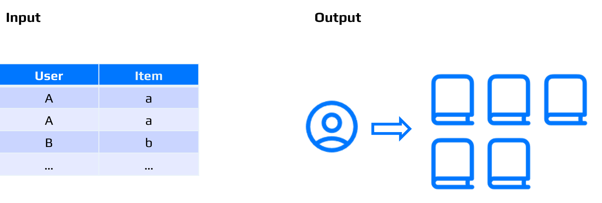

### Прогноз рейтинга

В задаче **прогноза рейтинга** на входе таблица из трёх колонок: пользователь, айтем и рейтинг, например число звёзд. Пользователь A поставил айтему a четыре звезды, пользователь B тому же айтему a пять звёзд, а айтему b одну звезду. На выходе для новой пары «пользователь — айтем» нужно предсказать, какой рейтинг там стоял бы.

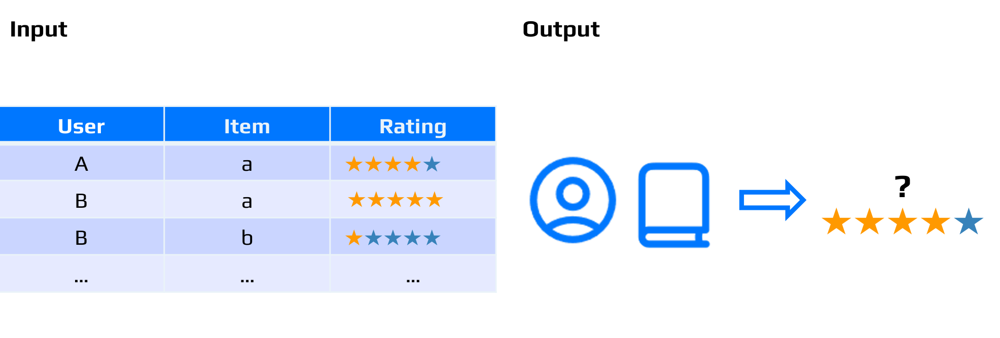

**Акцент лектора:** рейтинг ставится не айтему, а паре «пользователь — айтем». Один и тот же айтем одному пользователю точно зайдёт, а другому зайдёт гораздо хуже. В нашем примере айтем a получил от A оценку 4, а от B оценку 5, то есть пользователю B он нравится больше. Никакого «рейтинга фильма вообще» в этой постановке нет: всё персонально.

### Как задачи связаны между собой

Очень часто прогноз рейтинга перетекает в top-N: сначала мы предсказываем рейтинги для множества пар, а затем просто отбираем для пользователя айтемы с наибольшими значениями. Почему же задачи разделяют? Во-первых, существуют методы, которые отбирают top-N элементов вообще без расчёта рейтинга. Во-вторых, к двум задачам применяются разные метрики качества. Метрики мы подробно разберём в теме «Ранжирование и метрики качества». Сегодня в большинстве практических систем используется именно прогноз рейтинга.

Это хорошо видно в типичном пайплайне рекомендаций, двумя основными кубиками которого являются кандидатогенерация и ранжирование. На этапе ранжирования как раз рассчитывается рейтинг для пары «пользователь — айтем», и по нему формируется выдача конкретному пользователю.

Зачем вообще два этапа? Возьмём VK Клипы. Клипов там миллионы. Если для каждого пользователя пытаться оценить каждый клип из базы, это займёт слишком много времени, а система работает онлайн и должна постоянно подкидывать клипы в ленту. Поэтому работу делят так:

1. [**Кандидатогенерация**]{.gl key="Кандидатогенерация"} — быстрый отбор из огромной базы сравнительно небольшой части айтемов, которые с большой вероятностью понравятся пользователю.
2. [**Ранжирование**]{.gl key="Ранжирование"} — более точная оценка рейтинга для каждого кандидата; пользователю показываются айтемы с наивысшим рейтингом.

**Важный вывод:** двухэтапная схема нужна ради скорости при огромном каталоге: дорогую и точную модель запускают не на всей базе, а только на кандидатах. Подробно оба этапа разбираются в темах «Нейросетевая кандидатогенерация» и «Нейросетевое ранжирование».

::: {.qa title="Вопросы из зала"}
**Кто формирует рейтинг и по какому принципу, если при просмотре видео звёзды никто не ставит?** Есть данные, на которых мы обучаемся, то есть история пользователя, и есть данные, которые генерирует модель. В историю попадают два вида сигналов. Явный: пользователь сам поставил фильму звёзды. Неявный: видео или трек досмотрен или дослушан до конца, пересмотрен несколько раз. На этой истории обучается модель машинного обучения, и уже она рассчитывает рейтинги для других пар, то есть для других айтемов того же пользователя. По этим рейтингам пользователю рекомендуются новые айтемы.[^n4a] Подробнее об этом поговорим в разделе о данных в рекомендательных системах.

**Где граница между кандидатогенерацией и ранжированием: кандидатогенерация даёт большой первоначальный топ, а ранжирование сокращает его перед выдачей?** По сути да. Кандидатогенерация сокращает миллионы айтемов до небольшого пула, а ранжирование упорядочивает этот пул и оставляет лучших. Всё это нужно, чтобы онлайн-система успевала отвечать быстро.
:::

[^n4a]: Примечание составителя: слово «рейтинг» здесь используется в двух смыслах. В обучающих данных это наблюдаемая оценка: звёзды или сигнал, построенный из неявного поведения. На выходе модели это её прогноз для пар, которые пользователь ещё не видел.

## История: от стереотипов до факторизационных машин (1979–2012)

*Таймкод: 01:25:02 · слайды 31–32*

Если всерьёз заниматься какой-то областью, нужно знать её историю. Во-первых, так проще не наступить на грабли, на которые уже наступали до вас. Во-вторых, так становится понятно, как мы пришли к тем методам, которыми пользуемся сегодня. Поэтому пройдём по главным вехам развития рекомендательных систем, от первых научных работ до классических моделей, на которых во многом держится индустрия.

### Первые работы: от стереотипов к информационной фильтрации

Началом рекомендательных систем принято считать 1979 год и статью **«User modeling via stereotype»**. Пользователь заполнял опросник, по ответам для него строился **стереотип**, то есть типовой портрет читателя, и уже по стереотипу определялось, какие книги ему понравятся, а какие нет. Это первая серьёзная научная работа, в которой рассматривалась именно задача рекомендации.

В 1988 году вышла работа **«An architecture for large scale information systems»**. Прямо о рекомендациях в ней ничего нет, но для области она очень важна. Большинство рекомендательных систем — это большие информационные системы, которые перерабатывают огромные объёмы данных. В статье описаны распределённые базы данных и распределённые вычисления, а на них сегодня опирается большинство промышленных RecSys.

В 1990 году появляется подход, основанный на **близости документов (Documents Proximity)**: для документов вычисляется метрика близости к конкретному пользователю, и самые близкие можно ему рекомендовать.

Заметим, что поначалу между вехами проходят годы: тема развивалась медленно, и тогда ещё не было понимания, что это технология, которой суждено «выстрелить».

В 1992 году Belkin и Croft явно разделили информационные системы на два типа: системы **информационного поиска (information retrieval)** и системы **информационной фильтрации (information filtering)**, которые отбирают нужное из уже существующих данных[^n5a]. Рекомендательная система относится ко второму типу. С этого момента можно опереться на научную работу, где функциональность таких систем чётко описана.

В том же 1992 году вышла статья Дэвида Голдберга о системе **Information Tapestry**, в которой впервые упоминается **коллаборативная фильтрация**. В ней собиралась статистика того, насколько пользователи довольны своими подписками на новостные рассылки, и по этой статистике пользователям рекомендовались новые подписки. Главное здесь то, что рекомендации строятся по опыту других людей.

### Первая промышленная система и первый открытый датасет

1996 год стал для области знаковым. Компания **Net Perceptions** создала, по-видимому, первую индустриальную рекомендательную систему, которая по-настоящему работала в продакшене. Это был явный скачок от научных статей к реальному продукту. Система была B2B: разные организации строили на её основе собственные рекомендации. На первых порах ею пользовался, в частности, Amazon.

В 1998 году появился **MovieLens**, первый открытый датасет для тестирования и отладки рекомендательных систем. В нём собраны фильмы и история их оценок пользователями в виде записей (пользователь, айтем, рейтинг).

**Акцент лектора:** MovieLens используется до сих пор. Откройте современные статьи по рекомендательным системам, и во многих из них метрики посчитаны именно на MovieLens. Причина в том, что датасет широко распространён в научном сообществе и на нём удобно сравнивать свой метод с чужими: предыдущие алгоритмы получили такую-то метрику, а ваш выше или ниже. Это стандарт де-факто, сколько бы лет ни прошло.

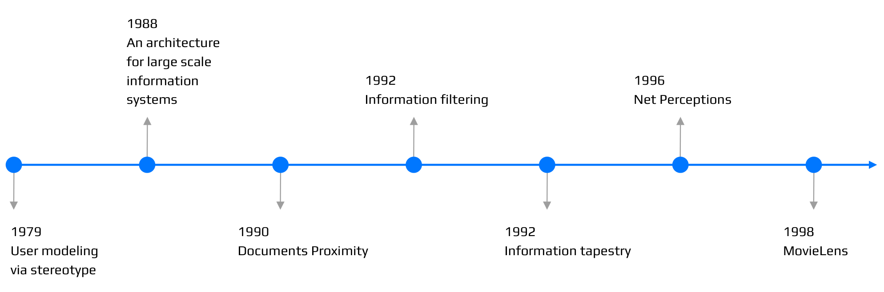

### Коллаборативная фильтрация, SVD и content-based

С 1998 по 2000 год выходит очень много работ по коллаборативной фильтрации, это настоящий бум таких методов. Основной объект здесь — **матрица взаимодействий**: строки соответствуют пользователям, столбцы айтемам, а в ячейках стоят взаимодействия, например оценки. **Коллаборативная фильтрация** — подход, при котором по этой матрице ищут похожих пользователей или похожие айтемы и рекомендуют то, что понравилось похожим.

**Важно:** коллаборативная фильтрация, как и SVD, — это must have. Эти алгоритмы нужно обязательно разобрать самостоятельно; подробно они изучаются в теме «Признаки и классические рекомендательные модели».

В 2000 году в рекомендации приходит **SVD** (сингулярное разложение) — метод разложения матрицы взаимодействий user–item. SVD важен не только сам по себе: он знаменует переход от одного класса методов к другому.

- **Memory-based** методы. Ранняя коллаборативная фильтрация работала напрямую с данными: похожих пользователей или айтемы искали прямо по их векторам взаимодействий, то есть по строкам и столбцам матрицы.
- **Model-based** методы. В SVD уже строится математическая модель того, как пользователи взаимодействуют с айтемами, и рекомендации получаются из этой модели.

Дальше линия model-based методов развивается непрерывно, и почти все следующие вехи — её продолжение.

В том же 2000 году оформляется **content-based filtering** (фильтрация по содержимому). К взаимодействиям user–item добавляется информация о самих айтемах (их контенте), а иногда и демографическая информация о пользователях. Зачем это нужно? Взаимодействия доступны не всегда. Пользователь мог только что впервые зайти на платформу, а товар мог только что появиться в каталоге. Истории у них нет, и коллаборативной фильтрации не на что опереться, а описание контента есть всегда. Это одна из основных проблем рекомендательных систем, **холодный старт**, и мы подробно разберём её в разделе о challenges.

### Netflix Prize, ACM RecSys и итоги классической эпохи

С 2006 по 2009 год проходил **Netflix Prize** — открытое соревнование, в котором нужно было превзойти рекомендательную систему, работавшую на Netflix. Приз составлял миллион долларов. В 2009 году одна из команд побила систему Netflix и получила этот миллион.

**Важный вывод:** решение победителей так и не внедрили. Оно оказалось настолько сложным, что рассчитать по нему рекомендации в онлайне было невозможно. Формальные условия конкурса команда выполнила, поэтому приз получила, но для продакшена решение не подошло. Качество модели по метрике — это ещё не всё: в реальной системе не менее важны ограничения на время и ресурсы расчёта.

В 2007 году прошла первая конференция **ACM RecSys**. Это главная конференция в области, и такой она остаётся до сих пор: на ней собираются учёные и представители индустрии, и всё новое и прорывное в рекомендательных системах публикуется прежде всего там. Если вы работаете в этой области, просматривайте её материалы, а лучше посещайте её, чтобы не отставать от прогресса. В том же 2007 году появляются рекомендательные системы на основе логистической регрессии.

Логическим итогом линии, начатой коллаборативной фильтрацией 1998 года, стали **факторизационные машины** (2010). Они объединяют модель коллаборативной фильтрации, построенную на взаимодействиях user–item, с дополнительной информацией о пользователях и айтемах. Получается **гибридная модель**, которая использует и взаимодействия, и признаки. На момент появления факторизационные машины давали очень высокое качество и заметно превосходили предшественников по метрикам.

Наконец, в 2012 году появляется **ALS (Alternating Least Squares, попеременные наименьшие квадраты)**. Это тоже способ построить модель коллаборативной фильтрации через разложение матрицы, но рассчитанный на большие данные и распределённые вычисления: модель должна обучаться на кластере. Задача решается итеративно, по очереди:

1. фиксируем векторы пользователей и методом наименьших квадратов находим векторы айтемов;
2. фиксируем векторы айтемов и тем же методом находим векторы пользователей;
3. повторяем эти шаги, постепенно уточняя модель.

Отсюда и название: наименьшие квадраты применяются попеременно то к одной, то к другой группе векторов. ALS мы ещё встретим в теме о классических моделях.

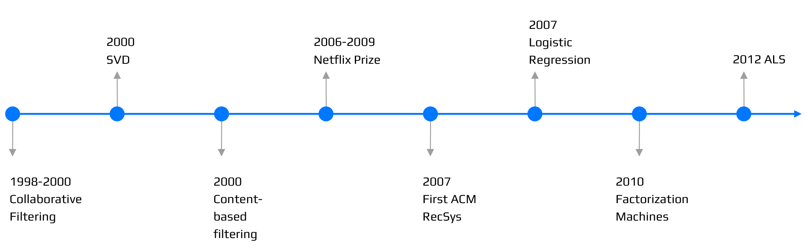

[^n5a]: Примечание составителя: граница здесь проходит по наличию явного запроса. Информационный поиск отвечает на запрос пользователя, информационная фильтрация сама отбирает нужное из потока данных. Ни то ни другое, как показано в разделе «Поиск и рекомендации», не создаёт новой информации.

## Современный этап: нейросети, трансформеры, причинность и LLM

*Таймкод: 01:42:55 · слайд 33*

Факторизационные машины и ALS подводят итог классической эпохе. Дальше рекомендательные системы меняются в двух направлениях: модели начинают учитывать порядок событий, а затем в них приходят нейросети. Пройдём по основным вехам.

### Порядок событий и первые нейросети

В классической коллаборативной фильтрации учитывался только сам **факт** взаимодействия: пользователь купил товар, посмотрел фильм, поставил оценку. Когда именно это произошло и что было до и после, модель не интересовало. В 2011 году появляется подход, в центре которого стоит пользователь и его история (**User-centric**). События пользователя рассматриваются как **временной ряд**. Важно, какие события шли после каких: у истории есть последовательность, и нарушать её нельзя. Позже из этой идеи вырастут последовательные (sequential) модели, о которых речь пойдёт ниже.

С 2016 года нейросети активно внедряются в рекомендательные системы. Первая заметная работа здесь — **Wide & Deep** от Google. Модель состоит из двух частей:

- **широкая (wide) часть** — простая однослойная сеть, которая получает на вход все признаки как есть: точки взаимодействия пользователя с сайтом, категориальные и прочие признаки айтемов и пользователей;
- **глубокая (deep) часть** — берёт небольшое подмножество признаков, строит по ним [эмбеддинги]{.gl key="Эмбеддинги"} и пропускает их через многослойную глубокую сеть.

Выходы обеих частей сходятся в финальной feed-forward сети, которая и выдаёт предсказание.

### Трансформеры и бум нейросетевых моделей

В 2017 году выходит статья «Attention is all you need», одна из ключевых работ для всего искусственного интеллекта. В ней предложен **трансформер** — архитектура, построенная на механизме **внимания (attention)**: при обработке каждого элемента последовательности модель сама решает, на какие другие элементы смотреть и с каким весом. Трансформеры — неотъемлемая часть больших языковых моделей, но применяются они и в моделях гораздо меньшего размера. Для рекомендаций ценно то, что трансформер позволяет построить модель, которая **помнит историю взаимодействий** пользователя. Сегодня трансформеры в рекомендательных системах используются повсеместно.

В 2017–2018 годах нейросети добираются и до факторизационных машин. **Neural FM** — это факторизационная машина, в которую встроена обычная feed-forward сеть. **DeepFM** — факторизационная машина в паре с глубокой нейросетью. Идея та же, что и в классических FM (учесть взаимодействия признаков пользователей и айтемов), но выразительность модели выше.

Дальше внедрение нейросетей идёт по нарастающей, и в 2019 году случается настоящий бум моделей, многие из которых используются до сих пор. Они применяют нейросети к рекомендациям с разных сторон:

- **SASRec** — последовательная модель: она получает историю пользователя как упорядоченную цепочку айтемов и с помощью механизма self-attention предсказывает, какой айтем будет следующим. Это прямое продолжение идеи «история как временной ряд»;
- **BERT4Rec** — адаптация BERT, модели для работы с текстами, под задачу рекомендаций: вместо последовательности слов она обрабатывает последовательность айтемов;
- **EASE** и **Mult-VAE** — модели, которые работают с **матрицей user–item целиком**. Как и факторизационные машины, они строят модель по всей матрице взаимодействий, но уже нейросетевыми методами.[^n6a]

Последовательные модели вроде SASRec и BERT4Rec подробно разбираются в теме о sequential-рекомендациях.

**Важный вывод:** нейросети плотно обосновались в рекомендательных системах и уже никуда из них не уйдут.

### Причинность и объяснимость

Интерес к причинно-следственному выводу, **causal inference**, существовал всегда, но около 2020 года он заметно вырос. Пользователям и заказчикам важно понимать **причинно-следственные связи** в рекомендациях: почему система рекомендует именно это. Особенно остро вопрос стоит там, где от системы зависят важные финансовые или жизненные показатели.

Возьмём здравоохранение. Если нейросеть просто говорит «делай так» и никак это не обосновывает, принять такую рекомендацию лекарства или медицинской процедуры трудно. Если же у рекомендации есть чёткое объяснение, какой путь прошла система, чтобы к ней прийти, доверия к системе становится больше.

То же самое происходит в торговле. При построении рекомендаций товаров для онлайн- и офлайн-магазинов заказчики очень требовательны к прозрачности: нужно доказательство того, что конкретному пользователю конкретный товар рекомендован не зря.

Со стремлением к прозрачности связано направление **XAI** (Explainable Artificial Intelligence, объяснимый искусственный интеллект): методы, которые позволяют понять и обосновать, почему модель приняла то или иное решение. Для рекомендательных систем это очень интересная и перспективная тема.

::: {.qa title="Вопросы из зала"}
**Разве хорошая система не говорит сама за себя? Зачем объяснять заказчику, почему выбран именно такой метод, — это защита своего алгоритма?** Нет, требование здесь предъявляется не к разработчикам, а к методу. Метод должен быть прозрачным: в любой момент, глядя на рекомендации конкретному пользователю, заказчик должен видеть их обоснование. Система может работать как чёрный ящик, когда видны только входы и выходы, а внутренняя логика скрыта, и рекомендовать вполне разумные вещи. Но заказчику такой вариант не подходит.

**Это где-то закреплено или это просто договорённость?** Это требование заказчика: результат должен быть доказуемым. Поэтому методы специально подбирались такие, которые эту доказуемость обеспечивают. Обычная feed-forward нейросеть здесь не подходит: такой прозрачности в ней нет.
:::

### LLM в рекомендательных системах

С 2022 года в рекомендательные системы активно внедряют [**LLM**]{.gl key="LLM"} (Large Language Models, большие языковые модели). Работ и способов такого внедрения уже очень много. Этому посвящена отдельная тема курса. Её, как и темы о кандидатогенерации, ранжировании, нейросетевых и графовых моделях, ведут люди, которые сами занимаются этими задачами в VK. Они расскажут не пересказ прочитанных статей, а то, как эти методы устроены и работают на практике.

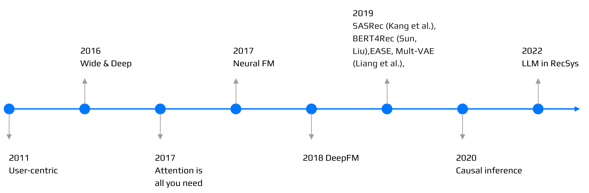

::: {.qa title="Вопросы из зала"}
**Регулируются ли рекомендательные системы законом?** Их работа регулируется законодательством страны, в которой делаются рекомендации. Особых проблем здесь нет, потому что рекомендательная система не создаёт новую информацию, она выбирает из уже существующей. В VK Клипах, например, запрещённый и неприемлемый контент фильтруется заранее и в рекомендации не попадает. Контроль должен проходить сам контент, а не рекомендательная система, которая выбирает из допустимого.

**А как быть с персональными данными пользователей?** Персональные данные хранятся по закону: на территории РФ и под защитой организации, которой пользователь их доверил. Разглашать их организация не имеет права. Когда компания публикует открытый датасет (например, VK недавно выложил датасет с историей взаимодействий пользователей с клипами), данные пользователей в нём не раскрываются. Взаимодействия зашумляются, а идентификаторы пользователей и айтемов заменяются, чтобы по датасету нельзя было установить конкретных людей.
:::

[^n6a]: Примечание составителя: строго говоря, EASE — линейная модель (линейный автоэнкодер с аналитическим решением), а не нейросеть. Mult-VAE — вариационный автоэнкодер, то есть нейросетевая модель. Объединяет их то, что обе восстанавливают строку матрицы user–item целиком.

## Уровни персонализации, методы и таксономия

*Таймкод: 02:02:20 · слайды 34–36*

Мы прошли историю рекомендательных систем. Теперь посмотрим на область целиком, как бы с высоты птичьего полёта: насколько персональными бывают рекомендации, какими методами их строят и из каких крупных частей складывается вся область.

### Уровни персонализации

Рекомендации различаются по тому, насколько они учитывают конкретного человека. Удобно выделять три уровня (так их делит, например, Kim Falk в книге *Practical Recommender Systems*):

- **Неперсональные рекомендации.** Всем пользователям показывается одно и то же, чаще всего самый популярный контент.
- **Полуперсональные рекомендации.** Пользователи делятся на сегменты (группы), и внутри каждой группы рекомендуется своё. Это может быть тот же «самый популярный» контент, только популярность считается уже внутри группы.
- **Персональные рекомендации.** Для каждого пользователя строится свой набор рекомендаций на основе его собственных предпочтений, и этот набор показывается только ему.

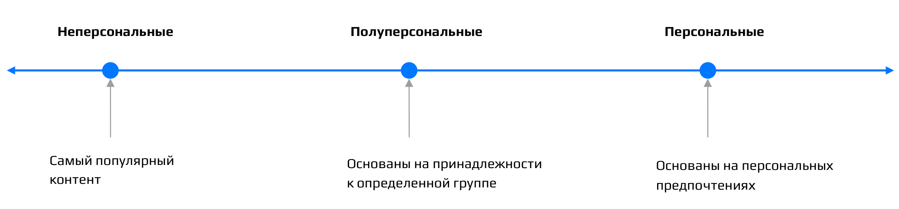

Дальше в курсе мы работаем именно с персональными рекомендациями.

### RecSys — это не только ML

Рекомендательная система не обязана использовать машинное обучение. Методы её построения можно разбить на три группы.

1. **Rule-based подход (на основе правил).** Машинного обучения здесь нет совсем. Например, пользователей можно разбить на сегменты по заранее заданным правилам (по доходу, возрасту, полу) и каждой группе показывать контент, интересный именно ей. По сути это и есть полуперсональные рекомендации. Другой пример: в магазине идёт акция, и людям рекомендуются акционные товары.
2. **Статистические методы.** Сюда относится та же рекомендация популярных айтемов. Сюда же относится **анализ выживаемости** (survival analysis): с его помощью определяют момент, когда пользователю стоит что-то порекомендовать. В рекомендательных системах применяется и **марковский процесс принятия решений**.[^n7a]
3. **ML-методы:** логистическая регрессия, градиентный бустинг и случайный лес, нейронные сети.

**Важный вывод:** RecSys и ML пересекаются во многих местах, но не совпадают. Рекомендательная система выходит за рамки машинного обучения, и её можно построить другими методами.

### Таксономия рекомендательных систем

Всю область удобно представить в виде карты (одна из известных версий собрана в репозитории awesome-RecSys на GitHub). В центре стоит сама рекомендательная система (Recommender System, RS), а вокруг неё четыре крупных блока. Эту схему мы будем называть **таксономией Challenges / Data / Models / Evaluation**.

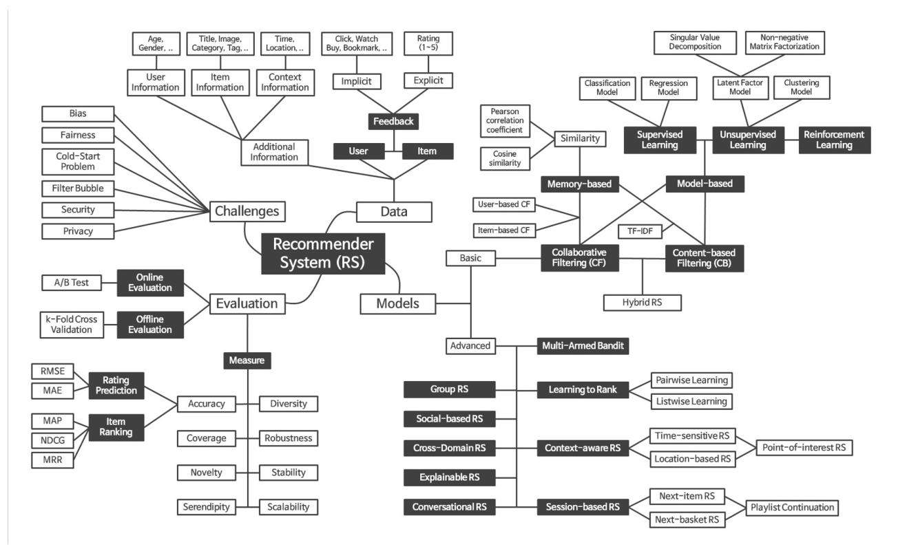

**Challenges** — вызовы, то есть трудности, с которыми разработчики рекомендательных систем борются постоянно. Это смещения в данных (bias), справедливость рекомендаций (fairness), холодный старт (как рекомендовать новому пользователю или новому айтему, о которых почти ничего не известно), информационный пузырь (пользователь видит всё более однообразный контент), безопасность и приватность. Часть этих проблем мы уже затрагивали, а подробно они разбираются в разделе о Challenges.

**Data** — данные. Основа здесь — пользователи, айтемы и обратная связь (фидбэк) в матрице взаимодействий «пользователь — айтем». Фидбэк бывает явным (explicit), например оценка, и неявным (implicit), например клик или просмотр. К матрице добавляется дополнительная информация: о пользователе (скажем, демографическая), об айтемах и о **контексте**, то есть о том, в какой момент пользователь зашёл в систему и что в этот момент происходит.

**Models** — модели. Их очень много, и делят их по-разному: на базовые и продвинутые, на нейросетевые и без нейросетей. Среди базовых мы уже встречали коллаборативную фильтрацию, content-based фильтрацию и гибридные подходы, а также деление на memory-based и model-based. Большинство моделей, которые реально работают в рекомендательных системах, мы разберём в курсе.

**Evaluation** — оценка качества. Здесь важно различать два понятия: **онлайн-оценку** и **офлайн-оценку**.

Онлайн-оценка — это **A/B-тест** (A/B-эксперимент). Он позволяет оценить качество рекомендательной системы в боевом режиме. Части пользователей мы показываем контент с новой рекомендательной системой, а другой части, например, контент без рекомендательной системы вообще. Затем сравниваем метрики двух групп и смотрим на прирост бизнес-метрик, который дал эксперимент.

Офлайн-метрики удобно считать в процессе разработки: они показывают, в правильном ли направлении мы движемся, ещё до выхода в бой. Среди них есть метрики, основанные на рейтингах, например ошибка прогноза оценки (RMSE, MAE) и метрики качества ранжирования. Есть и более сложные метрики, которые оценивают качество рекомендаций как таковых, например **новизна** и **разнообразие**. Они нужны, чтобы пользователь не застревал в пузыре, а рекомендации оставались для него актуальными и интересными.

**Важно:** офлайн-метрики в основном технические, и они не всегда тесно связаны с бизнес-метриками, которые на самом деле интересуют бизнес. Хороший результат офлайн ещё не гарантирует прирост в A/B-тесте.

[^n7a]: Примечание составителя: анализ выживаемости и марковский процесс принятия решений здесь только названы как примеры статистических методов. Как именно они применяются к рекомендациям, в этой теме не раскрывается.

## Где применяются и кому нужны рекомендательные системы

*Таймкод: 02:10:50 · слайды 37–40*

### Сферы применения

Рекомендательные системы сегодня встречаются почти везде, где у пользователя есть выбор из большого количества вариантов. Пройдём по основным сферам.

- **Ритейл и электронная коммерция.** X5, Carrefour, Ozon, Amazon: компании, которые продают товары офлайн или онлайн. Покупателю можно порекомендовать товар.
- **Новости.** Новостные ленты вроде Дзена.
- **Социальные сети.** ВКонтакте, Одноклассники и зарубежные соцсети.
- **Стриминговые платформы.** VK Видео, Netflix, YouTube: здесь рекомендуются видео.
- **Музыка.** VK Музыка, Яндекс Музыка, Звук, Spotify.
- **Финтех.** Банки и кредитные организации. Если у вас установлено приложение Сбербанка или Т-Банка, в нём периодически появляются предложения оформить кредит, страховку и т. п.
- **Здравоохранение.** Питание, медикаменты, физическая активность (подробнее ниже).
- **Туризм.** Покупаете билеты, и вам сразу предлагают отель в том же городе или экскурсии.
- **Образование.** На платформах онлайн-курсов после одного курса вам почти всегда рекомендуют пройти похожие.

Социальные сети хорошо показывают, как рекомендации меняют сам продукт. Вначале соцсети были площадкой для общения: люди делились эмоциями и фотографиями с друзьями. Постепенно они превратились скорее в ленту, где показывается контент, который может быть интересен пользователю. На мой взгляд, это не совсем правильно, но так они сейчас устроены. Лента работает на то, чтобы пользователи «залипали» и проводили в сервисе больше времени: на фотографиях друзей надолго не задержишься.

Со здравоохранением важно понимать, в каком смысле здесь вообще говорят о рекомендациях. Речь не о жёстком варианте, когда система прописывает таблетки или назначает лечение (medical treatment). Имеется в виду более мягкая версия. Например, фитнес-браслет замечает, что вы долго сидите, и начинает вибрировать: это рекомендация подвигаться.

### Зачем рекомендательные системы компаниям

На рынке несколько игроков, и у каждого свой интерес к рекомендациям. Начнём с компаний, которые их внедряют.

- **Увеличить продажи.** Можно рекомендовать **комплементарные** товары, то есть дополняющие то, что человек уже купил. Или другой сценарий: человек давно не заходил в интернет-магазин, и ему приходит пуш: «Пора купить туалетную бумагу, вы давно её не покупали».
- **Продвигать более разнообразные айтемы.** Человек покупает хлеб и молоко, а ему предлагают: «У нас есть ещё сыр, возможно, он вам понравится».
- **Улучшить пользовательский опыт.** Давать людям не только то, что они просят, но и подсказывать, чтобы им было проще выбирать.
- **Добиться лояльности и лучше понимать пользователей.** Компания показывает, что понимает своих пользователей, и они начинают её больше ценить. Если одна из двух фирм вам что-то подсказывает, а другая нет, вы, скорее всего, останетесь в той, что понимает вас лучше.

**Важно:** всё это работает, только если рекомендации не назойливые. Но и это регулирует рекомендательная система: она решает не только что, но и когда порекомендовать.

### Зачем они пользователям

Для пользователей рекомендательная система тоже ценна.

- **Найти лучший товар и все подходящие товары.** Вы купили хлеб и колбасу, а масло и сыр забыли. Система напоминает: «Возьмите ещё масло и сыр, получится вкусный бутерброд».
- **Найти последовательность или набор товаров.** Покупаете книгу, а вам советуют ещё несколько по той же теме. Они немного про другое, но вместе складываются в цельную область знаний и дают больше, чем одна прочитанная книга.
- **Экономить время на поиск.** Листаете VK Клипы, попадается реклама со ссылкой на Ozon, и думаете: «Именно этого мне и не хватало», хотя вы это даже не искали. По вашим взаимодействиям с разными информационными ресурсами система поняла, что вам стоит это купить.

### Чем область интересна инженерам

Наконец, есть те, кто эти системы разрабатывает.

- **Высоконагруженный отказоустойчивый сервис.** Рекомендательная система почти всегда высоконагруженная, и построить такой сервис — хороший инженерный вызов.
- **Большие данные.** Слово «big data» сейчас звучит избито, потому что большие данные теперь повсюду. Но по сути это работа с распределёнными вычислениями, и это интересно.
- **Машинное обучение.** Тем, кто любит ML, в RecSys будет где развернуться.
- **Объективно измерять результат своей работы.** Не во всех системах, но во многих результат виден сразу. В VK Клипах, например, можно разработать фичу, запустить эксперимент, самому попасть в экспериментальную группу и посмотреть, как новая технология выглядит глазами пользователя.
- **Узнать много нового о людях**: о том, как они потребляют контент.
- **Зарплата.** Специалистам по RecSys хорошо платят, так что на эту область можно ориентироваться.

## Данные в рекомендательных системах

*Таймкод: 02:28:05 · слайды 41–45*

Любой метод рекомендаций начинается с данных, поэтому сначала разберёмся, какие данные бывают и как их удобно представлять.

### История взаимодействий

Основной источник информации — **история взаимодействий** пользователей с айтемами. Во многих датасетах она хранится как таблица с колонками UserId, ItemId, Timestamp и Rating. Каждая строка описывает одно событие: такой-то пользователь в такой-то момент взаимодействовал с таким-то айтемом и поставил ему такую-то оценку. Например, пользователь 1 поставил айтему 23 оценку 2, а пользователь 2 оценил айтем 45 на 5 и айтем 34 на 4.

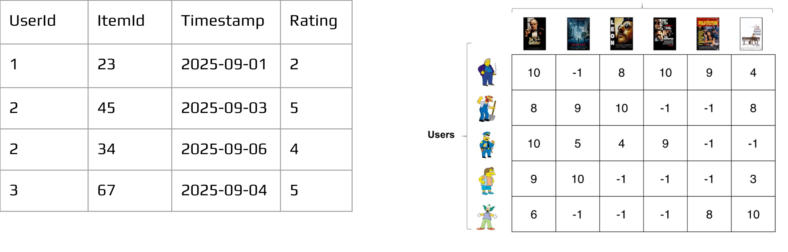

### Явные данные: explicit feedback

Если пользователь сам проставил рейтинг, то есть прямо сказал, что ему нравится, а что нет, такие данные называют **явными (explicit feedback)**. Из таблицы взаимодействий удобно построить **матрицу взаимодействий**: по строкам идут пользователи, по столбцам айтемы, а в клетке стоит оценка, которую пользователь поставил айтему. Если пользователь с айтемом не взаимодействовал, клетка остаётся пустой.

| User / Item | 23 | 34 | 45 | 56 |
|:--|:--|:--|:--|:--|
| 1 | 2 |   |   |   |
| 2 |   | 4 | 5 |   |
| 3 | 3 | 4 |   | 5 |

Даже в этом крошечном примере половина клеток пустая. В реальных системах пользователей и айтемов миллионы, а каждый пользователь оценил лишь малую их долю, так что матрица получается сильно разреженной.

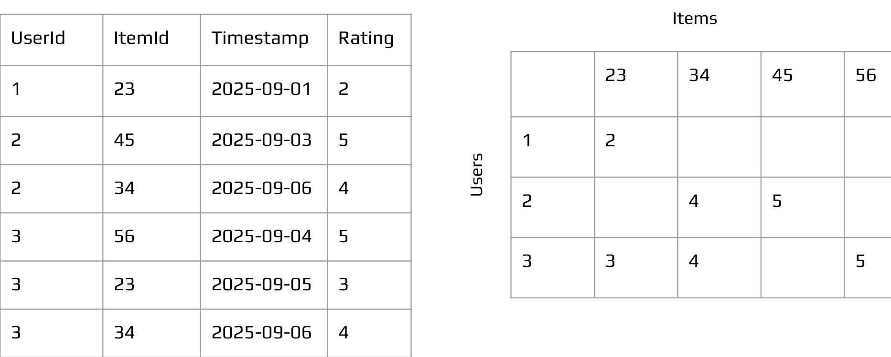

### Неявные данные: implicit feedback

Гораздо чаще явной оценки нет, а есть только сам факт взаимодействия: пользователь посмотрел видео или дослушал трек. Это **неявные данные (implicit feedback)**. В таблице вместо рейтинга может стоять, например, время просмотра. Длинный просмотр разумно считать позитивным сигналом, короткий нет, и тогда матрица становится бинарной: 1 означает «понравилось», 0 означает «позитивного сигнала нет».

| User / Item | 23 | 34 | 45 | 56 |
|:--|:--|:--|:--|:--|
| 1 | 1 | 0 | 0 | 0 |
| 2 | 0 | 1 | 1 | 0 |
| 3 | 1 | 0 | 0 | 1 |

Здесь у пользователя 1 время просмотра айтема 23 равно 20, а айтема 34 всего 5, поэтому первому досталась единица, а второму ноль.[^n9a]

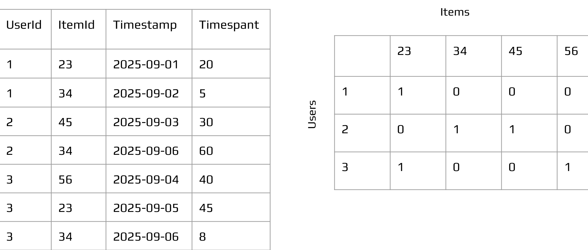

Почему именно неявные данные на практике основные? Их просто на порядки больше. Лайки пользователи ставят редко, дизлайки ещё реже, а просмотров огромное количество.

**Акцент лектора:** у неявных данных есть принципиальная проблема. Мы знаем, что пользователь посмотрел и что ему понравилось, но не знаем, что ему **не** нравится. Если он чего-то не посмотрел, это вовсе не значит, что айтем ему неинтересен. Возможно, он его просто не видел, а увидев, остался бы доволен. Отсутствие взаимодействия не равно негативной оценке. К этой проблеме мы ещё вернёмся, когда будем говорить о bias.

### Контент и контекст

Кроме истории взаимодействий, у нас есть сведения о самих пользователях и айтемах, а также об обстановке, в которой делается рекомендация.

**Контент** — описательные свойства айтема или пользователя, которые не меняются со временем или меняются редко. Для фильма это аннотация и жанр, для товара категория, для продукта состав. Возьмём видео: у него есть автор, название и описание от автора, обложка, кадры, снятые через равные промежутки времени, звуковая дорожка. Всё, что можно собрать об айтеме и что может помочь в прогнозе рейтинга, стоит «пропылесосить»: оцифровать и сложить в виде эмбеддингов. Для пользователя контент — это пол, год рождения и другая анкетная информация, которую он указал сам, а также то, что удалось узнать по его поведению на сайте. «Меняется редко» здесь понимается буквально: фамилия у человека за жизнь может смениться несколько раз, а может и ни разу.

**Контекст** — внешние условия и быстро меняющиеся признаки: время суток, день недели, время года, погода, геолокация, устройство. Сюда же можно отнести размер ключевой ставки ЦБ, количество денег на счету, число кредитов. В зависимости от того, где, когда и в каких условиях находится пользователь, ему нужно показывать разные рекомендации. Возьмём доставку продуктов. Бессмысленно предлагать мороженое, когда на улице льёт дождь: его скорее всего не купят. А в жару вода и мороженое окажутся очень кстати.

**Важный вывод:** контекст по-хорошему нужно учитывать всегда. Одна и та же история взаимодействий в разных условиях должна приводить к разным рекомендациям.

::: {.qa title="Вопросы из зала"}
**Используют ли рекомендательные системы для продвижения товаров или идей, и не теряют ли на этом пользователей?** Товары продвигают: в VK Клипах, например, есть рекламные опции, и на рекламе VK зарабатывает. Продвижения политических сил и идей через рекомендации мне видеть не приходилось.

**Настройка рекомендательной системы — это работа ML-инженера, или вводные вроде частоты и объёма показов задают аналитики?** Систему не настраивают вручную через такие параметры. Бизнес ставит задачу растить определённые метрики: время, которое люди проводят в ленте, число лайков, деньги, потраченные в магазинах. ML-инженеры разрабатывают новые подходы, чтобы рекомендации улучшали именно эти метрики.
:::

[^n9a]: Примечание составителя: точный порог, по которому время просмотра превращается в 0 или 1, не задан. В примере короткие просмотры (5 и 8) дают 0, а длинные (от 20 до 60) дают 1.

## Challenges: предвзятость, справедливость, пузырь, холодный старт

*Таймкод: 02:34:55 · слайды 46–50*

Мы разобрали, на каких данных строятся рекомендации. Теперь посмотрим, какие трудности возникают при работе с ними. Эти проблемы есть почти в любой рекомендательной системе, и о них полезно знать с самого начала.

### Bias и петля обратной связи

Первая проблема — **bias (предвзятость)**. Я предпочитаю английское слово, но смысл у него такой: из-за особенностей работы рекомендательной системы, поведения пользователей и специфики предметной области рекомендованные айтемы начинают распределяться несправедливо. В рекомендациях появляется систематический скос.

Почему эта проблема особенно остра именно для рекомендательных систем? Из-за **петли обратной связи (feedback loop)**. Пользователь взаимодействует с контентом, на этих взаимодействиях обучается модель, модель строит рекомендации, их показывают пользователю, он взаимодействует уже с ними, и на новых данных модель снова обучается. Получается замкнутый цикл: пользователь → данные → модель → рекомендации → пользователь.

**Важный вывод:** мы обучаемся на данных, которые сами же и порекомендовали. Поэтому любой перекос в рекомендациях попадает обратно в обучающие данные и с каждым витком петли усиливается.

Виды bias принято различать по тому, в каком месте петли возникает скос. Удобная систематизация есть в обзоре Jiawei Chen et al. «Bias and Debias in Recommender System: A Survey and Future Directions» (2021). На этапе сбора данных (пользователь → данные) выделяют четыре вида:

- **User-selection bias** — относится к явным оценкам. Пользователь сам решает, каким айтемам ставить рейтинг, поэтому наблюдаемые рейтинги не являются случайной выборкой. Айтемы, у которых уже есть рейтинг, система показывает чаще. Айтемы, которым оценку не поставили или не успели поставить, показываются реже. Чем больше смотрят айтемы с рейтингом, тем меньше шансов у всех остальных.
- **Exposure bias** — аналог той же проблемы для неявного фидбэка. Если пользователь не посмотрел айтем, мы не знаем, нравится он ему или нет: возможно, пользователь просто его не видел. Мы знаем только, что он посмотрел и что ему понравилось. Утверждать, что пропущенные айтемы ему не нравятся, нельзя.
- **Conformity bias** — следствие конформизма. Ставя оценку, человек уже видит, как этот айтем оценили другие, и подстраивается под них. Допустим, фильм вам не очень понравился, а рейтинг у него 9,5. Возникает мысль: «Может, со мной что-то не так и я просто не понял фильм, раз он всем понравился?» В итоге вы ставите оценку выше. Если бы вы не видели чужих оценок, то могли бы поставить двойку.
- **Position bias** — рекомендации всегда показываются списком, и у каждого айтема в нём есть позиция. Пользователи склонны выбирать то, что стоит наверху. Поэтому айтем, поставленный первым, с большей вероятностью выберут и оценят выше, причём независимо от его настоящей релевантности.

На этапе обучения модели (данные → модель) возникает **inductive bias**. Это особый случай: скос, который разработчики вводят в модель специально. Из всех видов bias только он работает в плюс, а не в минус. Типичная ситуация: позитивных взаимодействий очень мало, а негативных много. В явном фидбэке бывает и наоборот: много позитивных оценок и мало негативных. Чтобы модель корректно обучилась, этот дисбаланс нужно убрать, например с помощью undersampling или oversampling, которые выравнивают классы. Сознательно заложенное допущение делает модель качественнее[^n10a].

На этапе выдачи рекомендаций (модель → пользователь) возникают два вида bias:

- **Popularity bias** — популярные айтемы рекомендуются чаще непопулярных. Популярный айтем чаще попадает в выдачу, получает больше показов и отзывов, и на следующем витке его раскручивают ещё сильнее. Непопулярные айтемы уходят из выдачи и не получают должного охвата. Это наглядный пример того, как bias усиливается вдоль петли.
- **Unfairness** — перекос рекомендаций в сторону определённой группы пользователей или айтемов. О нём подробнее ниже.

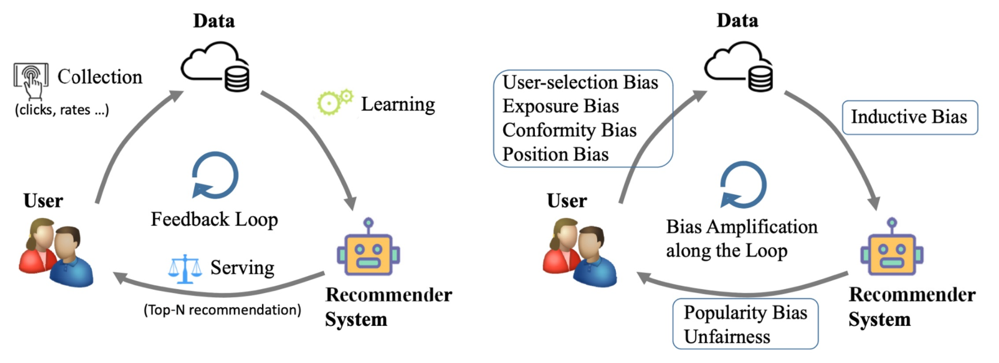

### Справедливость

Противоположное понятие — **fairness (справедливость)**: айтемы распределяются среди пользователей без дискриминации по каким-либо признакам. Рекомендации не должны быть перекошены, например, по вероисповеданию или цвету кожи. Все пользователи должны получать одинаково качественные рекомендации. Тема большая, и дискриминация в рекомендациях подробно разобрана в обзоре Yifan Wang et al. «A Survey on the Fairness of Recommender Systems» (2023).

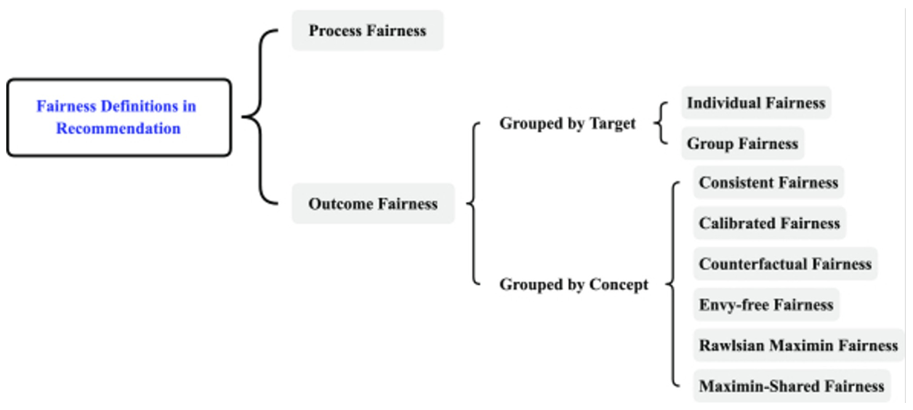

### Информационный пузырь

Следующая проблема — **информационный пузырь (filter bubble)**. Термин ввёл Eli Pariser в книге «The Filter Bubble» (2011). Персонализированная фильтрация замыкает пользователя на логически связанных между собой айтемах, и он перестаёт видеть то, чего раньше не было в поле его интересов.

Представьте человека, который листает ленту. Ему понравилось видео про инопланетян, потом что-то из эзотерики. Лента начинает постоянно подкидывать «подтверждения»: инопланетяне существуют, периодически прилетают, вот ещё факты. Постепенно человек начинает жить внутри этого пузыря. Мы хотим такого избегать. Гораздо ценнее понемногу расширять кругозор пользователя, находить у него новые интересы и показывать неожиданную для него, но интересную и качественную информацию.

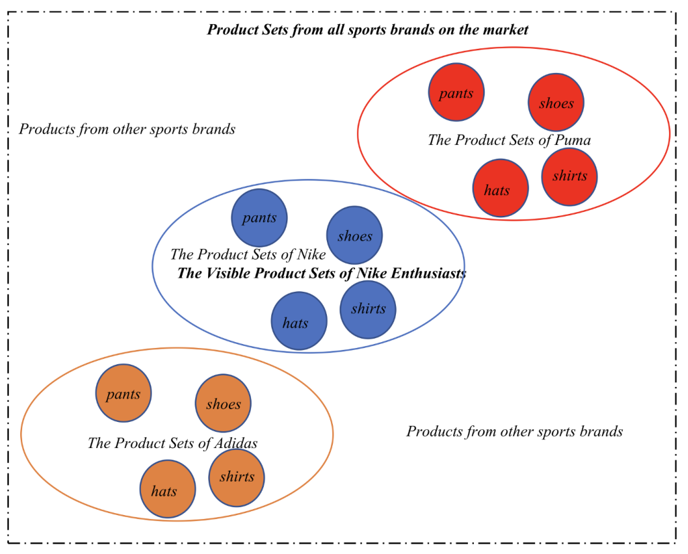

Для выхода из пузыря используют **exploration** (исследование) — модели и подходы, которые ищут в информационном поле новые интересы пользователя, а не только подтверждают уже известные.

**Акцент лектора:** здесь всегда нужен баланс. Если делать только exploration и показывать всё вразброс, пропадает весь смысл персональных рекомендаций. Нужно сочетать исследование новых интересов с рекомендациями по уже известным.

### Холодный старт

Ещё одна классическая проблема — **холодный старт**. Она возникает в двух ситуациях:

- **новый пользователь** — истории его взаимодействий нет, и понять его предпочтения невозможно или очень сложно;
- **новый айтем** — с ним ещё никто не взаимодействовал, и неясно, кому его рекомендовать.

Есть два основных подхода. Первый — чистый exploration: показывать, например, самое популярное из топовых категорий и смотреть на реакцию. Второй — опираться на то, что известно помимо взаимодействий. Для нового айтема это его контент, для нового пользователя — демографические данные. По этой информации нового пользователя или айтем можно сопоставить с пользователями, у которых похожие интересы.

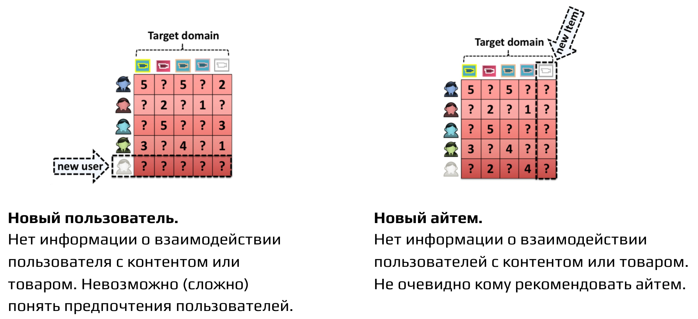

::: {.qa title="Вопросы из зала"}
**Чем bias отличается от переобучения?** Это разные проблемы. Переобучение связано со сложностью модели: мы построили слишком сложную модель. Bias — другая история: скос возникает из-за того, как собираются данные и как работает петля обратной связи.

**Можно ли уменьшить количество bias и их влияние на рекомендации, или проблема нерешаема?** Решаема. Методам учёта и устранения bias (debiasing) посвящены следующие темы курса.
:::

[^n10a]: Примечание составителя: в машинном обучении inductive bias обычно понимают шире — как априорные допущения, заложенные в модель или алгоритм обучения. Балансировка классов через undersampling и oversampling здесь служит примером такого сознательно внесённого допущения.

## Архитектура рекомендательной системы

*Таймкод: 02:48:21 · слайды 51–53, 64–65*

До сих пор мы говорили о том, что рекомендательная система делает, на каких данных она работает и с какими проблемами сталкивается. Осталось понять, как она устроена как программная система: из каких частей она состоит и как эти части взаимодействуют с пользователем.

### RecSys как чёрный ящик

Самый простой взгляд на рекомендательную систему такой: это чёрный ящик. На вход ему подаются данные о пользователях, айтемах и их взаимодействиях, а на выходе он выдаёт рекомендации. Такой ящик встроен в конкретное приложение (онлайн-кинотеатр, ленту клипов, маркетплейс), а приложение, в свою очередь, работает в некотором внешнем окружении. Пользователи получают от системы айтемы и своими действиями снова порождают данные для неё.

Для того, кто пользуется рекомендациями, такого описания достаточно. Нам же важно заглянуть внутрь: там находятся алгоритмы, архитектура, которая их связывает, и профили пользователей. Этот взгляд, **RecSys как чёрный ящик**, полезен как отправная точка: он фиксирует, что поступает на вход и что ожидается на выходе, а всё остальное мы дальше будем раскрывать по частям.

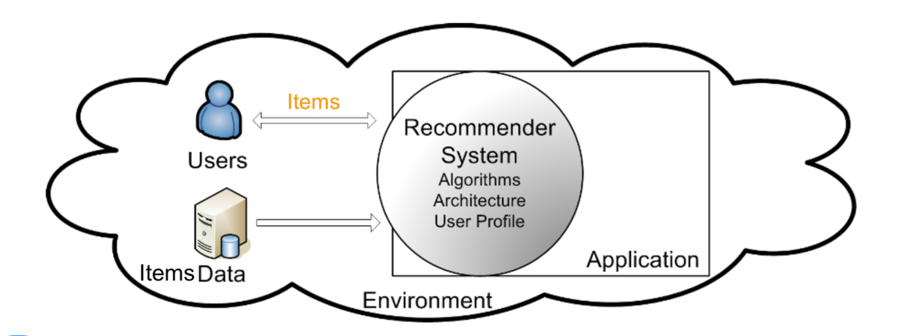

### Типичные компоненты

Посмотрим, из каких **типичных компонентов RecSys** складывается реальная система. Хороший пример — архитектура сервиса Mendeley Suggest, рекомендующего научные статьи (её описали Kris Jack, Ed Ingold и Maya Hristakeva в 2016 году). Компоненты там довольно общие, похожий набор блоков встречается в большинстве промышленных систем.

- **Пользовательский интерфейс (User Interface).** С ним пользователь взаимодействует напрямую: заходит в приложение и видит рекомендации, которые должны быть ему интересны. Отсюда же уходят события: клики, прокрутки и т. п.
- **Сбор и обработка данных (Data Collection and Processing).** За интерфейсом стоит довольно сложный бэкенд на сервере. Его первая часть собирает данные, причём не только о пользователях, но и об айтемах и контексте: профили пользователей, описания айтемов (в случае Mendeley это статьи), события взаимодействия. Всё это обрабатывается и передаётся дальше.
- **Рекомендательная модель (Recommender Model).** Это центральный блок: ML-модели, которые моделируют взаимодействие пользователей с айтемами и формируют рекомендации. Модель обучается на подготовленных данных, после чего строит предсказания. Устройство именно этого блока мы будем разбирать почти весь семестр.
- **Постпроцессинг (Recommender Post-Processing).** Предсказания модели не сразу отдаются пользователю: их проверяют (валидация) и фильтруют.
- **Онлайн-модули (Online Modules).** Именно с ними общается интерфейс. Мы передаём им текущее взаимодействие пользователя и сразу получаем свежую рекомендацию.

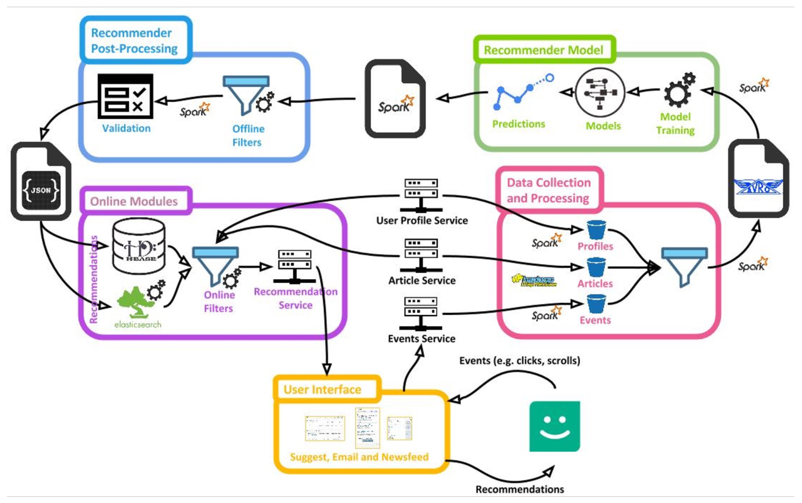

**Важно:** онлайн-модули должны работать быстро. Модель можно обучать долго и заранее, но ответ пользователю, который только что открыл ленту, нужен немедленно.

Здесь мы описали лишь общий каркас. Как система справляется с огромными каталогами, зачем рекомендации строят в два этапа и как распределяются вычисления между офлайном и онлайном, разбирается в темах «Кандидатогенерация» и «Ранжирование» и в следующих лекциях курса.

::: {.qa title="Вопросы из зала"}
**Какой инструмент главный в исследованиях и инженерии рекомендательных систем: PyTorch, scikit-learn, TensorFlow, Keras?** Если речь о нейросетях, то PyTorch или TensorFlow. Существенная разница скорее в языке, чем в библиотеке: прототипировать удобно на Python, а в продакшн модели часто выкладывают на C++ или Java.

**Что нужно подучить, чтобы успешно пройти курс?** Каких-то особых инструментов не требуется. Достаточно немного знать Python и математику.

**Какую литературу читать?** Основная книга — *Recommender Systems Handbook* (Francesco Ricci, Lior Rokach, Bracha Shapira; 3-е издание, Springer, 2022). Это очень сильная книга на английском, в ней хорошо описаны все области рекомендательных систем. Для тех, кому удобнее читать по-русски, подойдёт *Practical Recommender Systems* Kim Falk (Manning, 2019): у этой книги есть перевод на русский язык. Остальные источники из списка литературы (книги Chip Huyen и Martin Kleppmann о проектировании ML-систем и систем с интенсивной обработкой данных, обзоры по рекомендательным системам и их истории, классические статьи) стоит читать по возможности. Для основы хватит одной-двух книг, где подробно расписаны все области.
:::

## Главное из лекции {.unnumbered}

::: keypoints
- Рекомендательная система подбирает и предлагает конкретному пользователю айтемы из уже существующих. Новой информации она не создаёт, это система информационной фильтрации.
- От поиска рекомендации отличает отсутствие явного запроса: интересы пользователя система выводит сама, из истории взаимодействий, контента и контекста.
- Две основные задачи — top-N (отобрать подходящие айтемы) и прогноз рейтинга для пары «пользователь — айтем». На практике рейтинг предсказывают и сортируют, а работу делят на два этапа: кандидатогенерацию и ранжирование.
- История области: стереотипы (1979) → коллаборативная фильтрация и SVD → content-based filtering → факторизационные машины и ALS → нейросети (Wide & Deep, трансформеры, SASRec, BERT4Rec) → causal inference, XAI и LLM. MovieLens и ACM RecSys остаются общими точками отсчёта.
- Рекомендации бывают неперсональными, полуперсональными и персональными. Строить их можно правилами, статистикой или ML, курс посвящён персональным ML-рекомендациям.
- Основной объём данных — implicit feedback: он обильный, но не говорит, что пользователю не нравится. Explicit feedback точнее, но встречается редко. Кроме взаимодействий используют контент (редко меняется) и контекст (меняется быстро).
- Система учится на данных, которые сама же порождает (петля обратной связи). Отсюда разные виды bias, проблемы fairness и информационного пузыря. С пузырём борются exploration, но его нужно балансировать с персонализацией.
- Холодный старт (новый пользователь или новый айтем) решают через exploration и опору на контент и демографию.
- Модель — центральная, но не единственная часть системы. Вокруг неё работают сбор данных, постобработка и быстрые онлайн-модули.
:::

## Что подчеркнул лектор {.unnumbered}

::: emphasis
- Коллаборативная фильтрация и SVD — must have, их обязательно нужно разобрать.
- MovieLens — стандарт де-факто для сравнения методов в статьях.
- Решение победителей Netflix Prize так и не внедрили: слишком сложное для онлайн-расчёта. Выиграть по метрике ещё не значит сделать продовую систему.
- Тем, кто работает в области, стоит следить за ACM RecSys.
- Рейтинг ставится не айтему, а паре «пользователь — айтем».
- Офлайн-метрики не всегда связаны с бизнес-метриками, окончательную проверку даёт A/B-тест.
- Из неявных данных нельзя заключить, что пользователю что-то не нравится: он мог этот айтем просто не увидеть.
- Inductive bias — единственный вид bias, который вводят специально и который работает в плюс.
- Exploration нужно балансировать с персонализацией, иначе рекомендации теряют смысл.
- Основная литература — Recommender Systems Handbook и книга Kim Falk «Practical Recommender Systems» (есть русский перевод). Для курса достаточно немного знать Python и математику.
- Итоговый тест обязателен для любой оценки; домашние задания на AllCups проверяются автоматически, поэтому оформлять их нужно строго по шаблону.
- ИИ-ассистентами пользоваться можно, но сгенерированный код нужно понимать и проверять.
:::

## Стоит посмотреть в видео {.unnumbered}

::: watch
- **01:25–01:42** — таймлайн истории RecSys: рассказ идёт по схеме, её последовательность текстом передаётся хуже.
- **01:41–01:42** — ALS: попеременная фиксация векторов пользователей и айтемов объяснена очень бегло.
- **01:43–01:45** — устройство Wide & Deep: описание «широкой» и «глубокой» частей поправляется на ходу.
- **02:05–02:10** — таксономия RecSys: большая мелкая схема, разбор идёт по ней указкой.
- **02:35–02:44** — петля обратной связи и виды bias: схема с раскладкой bias по этапам петли.
- **02:48–02:51** — архитектура Mendeley Suggest.
:::

## Глоссарий {.unnumbered}

| Термин | Коротко |
|:-----------------|:------------------------------------------|
| **Рубежный контроль** | Промежуточный тест после блока тем (4 за курс, по 7 баллов) |
| **AllCups** | Платформа VK, где сдаются и автоматически проверяются домашние задания |
| **Рекомендательная система (RecSys)** | Информационная система, которая подбирает пользователю релевантные айтемы из уже существующих |
| **Пользователь (user)** | Тот, для кого система подбирает рекомендации |
| **Айтем (item)** | То, что рекомендуется: видео, трек, товар, банковское предложение и т. п. |
| **Система информационной фильтрации** | Отбор нужного из существующих объектов без создания новой информации; сюда относятся поиск и рекомендации |
| **Информационный поиск (information retrieval)** | Поиск документов по явному запросу пользователя |
| **Запрос (query)** | Явно сформулированная потребность пользователя; в поиске есть, в рекомендациях нет |
| **Top-N рекомендация** | Отбор N подходящих айтемов без упорядочивания между ними |
| **Прогноз рейтинга** | Предсказание оценки для пары «пользователь — айтем» |
| **Кандидатогенерация** | Первый этап: быстрый отбор небольшого множества кандидатов из всего каталога |
| **Ранжирование** | Второй этап: упорядочивание кандидатов по рассчитанному рейтингу |
| **Коллаборативная фильтрация** | Рекомендации по поведению и оценкам других пользователей, через матрицу взаимодействий |
| **Матрица взаимодействий** | Строки — пользователи, столбцы — айтемы, в ячейках — их взаимодействия (например, рейтинги) |
| **Memory-based / model-based** | Поиск похожих прямо по данным / построение модели взаимодействий |
| **SVD** | Разложение матрицы user–item, первый model-based метод в истории RecSys |
| **Content-based filtering** | Рекомендации с учётом содержания айтемов и данных о пользователях |
| **MovieLens** | Открытый датасет фильмов с рейтингами (1998), стандарт де-факто для сравнения методов |
| **Netflix Prize** | Конкурс Netflix 2006–2009 гг. на улучшение их рекомендательной системы |
| **ACM RecSys** | Главная конференция по рекомендательным системам (с 2007 г.) |
| **Факторизационные машины** | Гибридная модель: коллаборативная фильтрация плюс признаки пользователей и айтемов |
| **Гибридная модель** | Модель, использующая и взаимодействия, и признаки пользователей и айтемов |
| **ALS (Alternating Least Squares)** | Попеременные наименьшие квадраты: разложение матрицы с поочерёдной фиксацией векторов, распределяется на кластер |
| **Wide & Deep** | Нейросеть Google (2016) из однослойной «широкой» и многослойной «глубокой» ветвей |
| **Трансформеры, внимание (attention)** | Архитектура на механизме внимания; в RecSys позволяет учитывать историю взаимодействий |
| **Neural FM, DeepFM** | Факторизационные машины со встроенной нейросетью (2017–2018) |
| **SASRec, BERT4Rec** | Модели 2019 г., работающие с последовательностью взаимодействий пользователя |
| **EASE, Mult-VAE** | Модели 2019 г., работающие со всей матрицей user–item целиком |
| **Causal inference** | Причинно-следственный вывод: почему система рекомендует именно это |
| **XAI** | Explainable AI — объяснимость решений моделей |
| **LLM** | Большие языковые модели; с 2022 г. активно применяются в RecSys |
| **Неперсональные / полуперсональные / персональные рекомендации** | Уровни персонализации: одно для всех / своё для сегмента / своё для каждого пользователя |
| **Rule-based подход** | Рекомендации по правилам, заданным человеком, без обучения |
| **Анализ выживаемости (survival analysis)** | Статистический метод; в RecSys помогает выбрать момент для рекомендации |
| **Марковский процесс принятия решений** | Статистический метод, применяемый в рекомендательных системах |
| **Онлайн-оценка / офлайн-оценка** | A/B-тест на реальных пользователях / метрики на собранных данных |
| **A/B-тест** | Сравнение бизнес-метрик групп пользователей с новой и старой системой |
| **Явные данные (explicit feedback)** | Явная обратная связь: оценки, которые пользователь поставил сам |
| **Неявные данные (implicit feedback)** | Неявная обратная связь: просмотры, клики, время просмотра |
| **Контент** | Редко меняющиеся свойства айтема или пользователя (жанр, описание, пол) |
| **Контекст** | Быстро меняющиеся внешние условия (время, погода, геолокация, устройство) |
| **Эмбеддинги** | Векторные представления айтемов, пользователей или признаков |
| **Bias (предвзятость)** | Систематический скос в распределении рекомендаций |
| **Петля обратной связи (feedback loop)** | Модель учится на данных, порождённых её же рекомендациями |
| **User-selection bias** | Пользователь сам выбирает, что оценивать, поэтому наблюдаемые рейтинги — не случайная выборка |
| **Exposure bias** | Непросмотренный айтем не значит неинтересный: пользователь мог его не увидеть |
| **Conformity bias** | Оценка подстраивается под мнение других пользователей |
| **Position bias** | Айтемы вверху списка выбирают чаще независимо от релевантности |
| **Inductive bias** | Скос, который разработчики вводят в модель специально; работает в плюс |
| **Popularity bias** | Популярное рекомендуется чаще просто потому, что оно популярно |
| **Unfairness** | Перекос рекомендаций в сторону определённой группы пользователей или айтемов |
| **Fairness (справедливость)** | Распределение айтемов без дискриминации групп пользователей |
| **Информационный пузырь (filter bubble)** | Замыкание пользователя на узком круге уже знакомых интересов |
| **Exploration** | Поиск новых интересов пользователя через показ непривычного |
| **Холодный старт** | Нет истории у нового пользователя или нового айтема |
| **RecSys как чёрный ящик** | Взгляд на систему только через вход (данные) и выход (рекомендации) |
| **Типичные компоненты RecSys** | Интерфейс, сбор и обработка данных, модель, постпроцессинг, онлайн-модули |
