::: {.abstract title="О чём лекция"}
Лекция посвящена второму этапу рекомендательной системы — ранжированию. Сначала показано, что задача ранжирования ставится одинаково для поиска, RAG и рекомендаций, а различаются только фичи и таргет: откуда берутся метки (асессорская разметка или онлайн-сигналы пользователей) и как из сигналов собрать рейтинг. Затем вводится метрика качества NDCG и объясняется, почему её нельзя оптимизировать напрямую. Основная часть — методы обучения ранжированию: поточечный, попарный (RankNet) и списочный (ListNet, ListMLE) подходы, переход от RankNet к LambdaRank через «лямбды» и применение этих идей в градиентном бустинге (XGBoost, CatBoost). Для чтения нужны основы машинного обучения: логистическая регрессия, LogLoss, градиентный спуск, производная сложной функции; полезно знать, что такое KL-дивергенция и градиентный бустинг над деревьями.

Первая треть лекции идёт по слайдам, остальное — выкладки на доске; страницы доски обозначены в плашках разделов как «доска N». Организационная часть занимает пару минут и собрана в первом разделе. Вопросов из зала и чата много; содержательные вплетены в разделы и выделены серыми блоками — их можно пропустить при беглом чтении. Схемы со слайдов и доски приведены прямо в тексте. Сноски с пометкой «Прим. составителя» — пояснения, которых не было в лекции.
:::

## Организационное

*Таймкод: 00:00:01 · слайды 3*

### План лекции

Тема лекции — задача ранжирования. Начнём с того, что её постановка очень общая: она возникает не только в рекомендательных системах, но и в других задачах, где нужно упорядочить объекты по полезности. Затем разберём, какие данные нужны, чтобы эту задачу решать, и кратко обсудим, как измерить качество ранжирования. Основная и самая большая часть лекции посвящена подходам к обучению ранжированию (learning to rank): как эти методы устроены и почему они работают.

### Рубежный контроль и семинар

После этой лекции идёт первый **рубежный контроль (РК)** — промежуточный тест курса. Он охватывает материал прошлой лекции, этой лекции и семинара, который проходит на следующий день. В тесте 7 вопросов: в одних нужно выбрать вариант ответа, в других — вписать правильный ответ самостоятельно. Тест проводится в **LMS** — системе обучения VK Education; он откроется после семинара, на прохождение даётся неделя.

Семинар начинается в 9:30 и состоит из двух примерно равных частей, по 40 минут каждая. Первая — небольшая презентация о метриках качества ранжирования. Здесь подробно разбирается только одна метрика, а на семинаре рассматриваются и остальные, в том числе **MAP** и **MRR**[^n1a]. Вторая часть — небольшой ноутбук с практическими примерами.

Рукописные выкладки с доски, которые встречаются в разделах лекции, прикладываются к материалам курса.

[^n1a]: Примечание составителя: MAP (Mean Average Precision) и MRR (Mean Reciprocal Rank) — распространённые метрики качества ранжирования. В лекции они только названы, определения даются на семинаре.

## Ранжирование как общая задача: поиск, RAG, рекомендации

*Таймкод: 00:01:00 · слайды 4–10*

### Напоминание: двухэтапная схема

Начнём с главной мысли прошлой лекции. Классическая рекомендательная система устроена по [**двухэтапной схеме**]{.gl key="Двухэтапная схема"}. Есть каталог документов — в рекомендательных системах их обычно называют айтемами, — и он огромен: от $10^6$ до $10^9$ айтемов. Показать пользователю их все невозможно, поэтому работа идёт в два шага.

Первый шаг — **отбор кандидатов (retrieval)**. Из всего каталога с помощью сравнительно несложных правил достаётся небольшой набор, порядка $10^2$–$10^3$ айтемов. Главное требование к этому этапу — не потерять релевантное. Достать что-то лишнее не страшно, страшно пропустить хорошее. Порядок, в котором отобраны кандидаты, здесь не важен: его потом задаст следующий этап. Поэтому и качество отбора меряют метриками полноты вроде Recall@K, HitRate@K, Precision@K. Отбору кандидатов будет посвящён отдельный большой разговор на следующих лекциях.

Второй шаг — **ранжирование (ranking)**. Отобранных кандидатов упорядочивает более сильная и тяжёлая модель, и пользователю выдаётся топ — порядка $10^1$–$10^2$ айтемов. Интуитивно эта задача проще: пришёл набор документов, и их нужно поставить в правильном порядке. Особенно важно, чтобы наверху оказалось самое лучшее. Поэтому метрики ранжирования, в отличие от метрик отбора, чувствительны к порядку и прежде всего к верху списка. К ним относятся, например, MAP и MRR, а оценке качества посвящён отдельный раздел ниже. Модель, которая выполняет этот этап, называют **ранкером**.

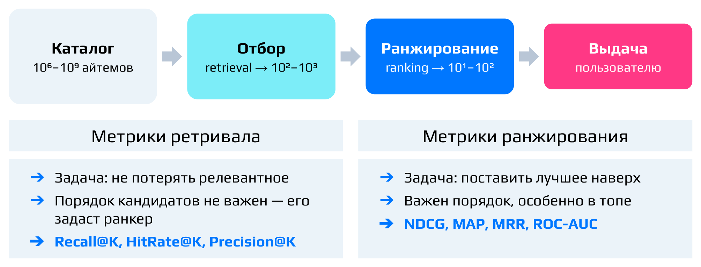

В реальных системах после ранжирования есть и другие этапы, на которых учитывается бизнес-логика, но здесь они не рассматриваются. Вся лекция посвящена именно этапу ранжирования.

### Одна постановка — три задачи

Двухэтапная схема встречается далеко не только в рекомендациях. Возьмём три задачи, которые сильно похожи друг на друга (их можно придумать и больше).

**Поиск.** Пользователь вводит текстовый запрос, например «кроссовки для бега». Из миллиардов веб-страниц или товаров отбираются тысячи кандидатов, затем ранкер выставляет каждой паре (запрос, документ) оценку, и на первую страницу выдачи попадает топ-10. Цель — поставить наверх страницы, которые действительно отвечают на запрос. Так устроены Яндекс, Google, поиск на маркетплейсах.

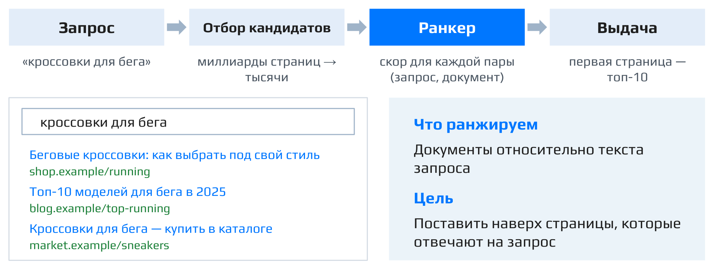

**RAG** (retrieval-augmented generation) — технология, которая добавляет в LLM данные из внешней базы знаний. Она работает как своего рода «поиск» по этой базе. По вопросу пользователя или по текущей истории диалога ретривер достаёт похожие фрагменты, например top-50. Затем **реранкер** — модель, которая заново упорядочивает уже отобранных кандидатов, — выбирает из них top-k самых важных. Эти фрагменты отдаются не человеку, а LLM, и она по ним строит финальный ответ. Пусть сотрудник спрашивает ассистента «Как оформить отпуск?». Наверх должны попасть регламент с требованием подать заявление за две недели и шаблон заявления, а не правила оформления командировок. Ранжирование здесь особенно важно, потому что LLM видит только верх списка: всё, что ниже отсечки top-k, в промпт не попадёт.[^n2a]

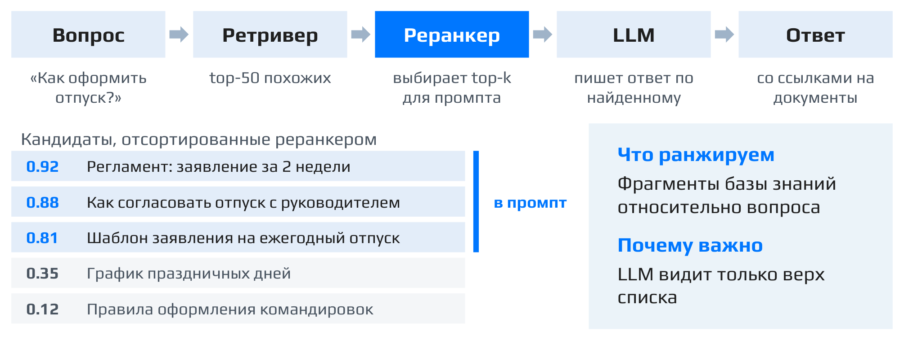

**Рекомендации.** Здесь явного запроса нет. Его заменяет пользователь во всём его многообразии: его история, время, устройство, по сути — состояние человека в текущий момент. По этому «запросу» разные генераторы отбирают сотни кандидатов, ранкер оценивает каждую пару (пользователь, айтем), например вероятностью клика, и лента показывается сверху вниз в порядке убывания этой оценки.

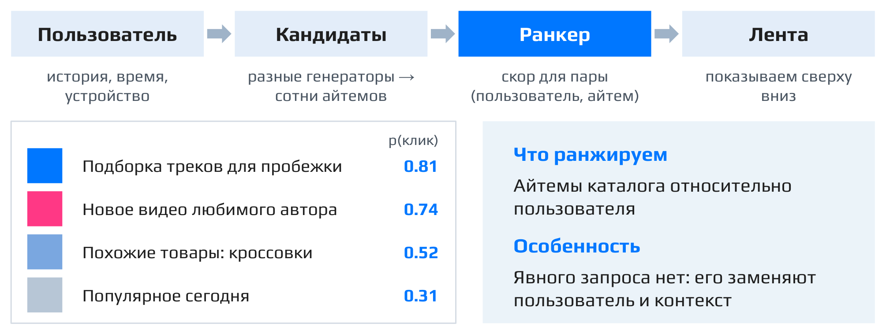

### Унификация: запрос, документ, функция ранжирования

Во всех трёх задачах можно одинаково говорить о **запросе $q$** и **документе $d$**, хотя в каждом случае они означают своё:

|Задача|Запрос $q$|Документ $d$|Хотим наверху|
|:--|:--|:--|:--|
|Поиск|текст запроса|веб-страница, товар|отвечает на запрос|
|RAG|вопрос пользователя (промпт)|фрагмент базы знаний|помогает ответить|
|Рекомендации|пользователь и контекст|айтем каталога|понравится пользователю|

**Важный вывод:** во всех трёх задачах нужно одно и то же — способ отсортировать документы так, чтобы для текущего запроса они стояли в наилучшем порядке. Именно эту задачу мы и учимся решать.

Формально мы ищем **функцию ранжирования**

$$f(q, d) \to \text{score},$$

которая по паре «запрос — документ» выдаёт число: насколько документ $d$ хорош для запроса $q$. Сортировка кандидатов $D_q$ по значению $f$ должна давать хороший порядок. Как обычно в машинном обучении, $f$ приближается моделью, и остаётся понять, что это за модель и как её обучать.

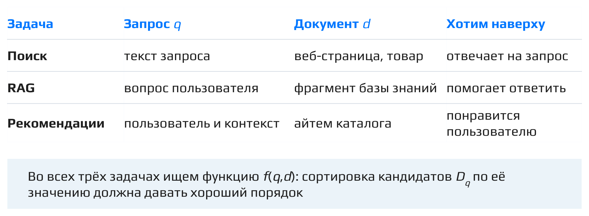

### Чем отличаются задачи: фичи и таргет

Постановка одна, но различаются две вещи.

Первая — **фичи**, то есть признаки, которые модель знает о запросе, документе и их паре. Каждая из трёх задач специфична, поэтому и признаки у каждой свои. Они отражают предметную область: в поиске это, например, текстовая близость запроса и документа, в рекомендациях — история пользователя и популярность айтема. Признакам, специфичным для рекомендаций, во многом посвящены следующие лекции курса.

Вторая, более интересная для нас сейчас, — **таргет**: на что учить модель, то есть какой порядок считать правильным. Таргет задаётся меткой $y(q, d)$ для пары «запрос — документ», и именно он определяет, что модель будет оптимизировать. Что вообще значит «хороший документ для запроса» — отдельный и непростой вопрос, и здесь три задачи заметно расходятся. С него и начнём.

[^n2a]: Примечание составителя: пример с оформлением отпуска и мысль о том, что LLM видит только верх списка, взяты со слайда; в устном объяснении RAG описан кратко, с оговоркой, что нужные фрагменты в RAG можно получать и другими способами.

## Откуда берётся таргет: асессоры и онлайн-сигналы

*Таймкод: 00:11:55 · слайды 11–13*

Чтобы обучать функцию ранжирования $f(q,d)$, нужно сначала решить, что вообще считать хорошим документом для запроса. Это отдельный и непростой вопрос, и именно здесь поиск и рекомендации расходятся сильнее всего.

### Поиск: асессорская разметка

В поиске базовое желание простое: документ, выданный по запросу, должен быть ему **релевантен**. Если я ищу кроссовки, мне должны показать кроссовки, а не штаны или платья. На практике оказывается, что релевантность неплохо оценивается со стороны: достаточно посмотреть на пару «запрос — документ» и ответить, подходит ли товар запросу. Кроссовки на запрос «кроссовки» — релевантно, платье — нет. Ответ почти не зависит от того, кто именно спрашивает.

Поэтому в поиске пользуются трудом **асессоров** — обученных разметчиков, которые по инструкции оценивают пары (запрос, документ). Результат их работы называют **асессорской разметкой**. Типичное задание выглядит так: дан запрос «кроссовки для бега» и документ «Беговые кроссовки: как выбрать под свой стиль», и нужно ответить, насколько документ отвечает на запрос, по шкале

| 0 | 1 | 2 | 3 | 4 |
|:--|:--|:--|:--|:--|
| мимо | слабо | частично | хорошо | полностью |

Выставленная оценка становится меткой пары, например $y(q,d) = 3$. Собрав такую разметку, можно прямо сформулировать, чего мы хотим от модели $f$: по запросу она должна поднимать наверх документы с высокой оценкой релевантности.

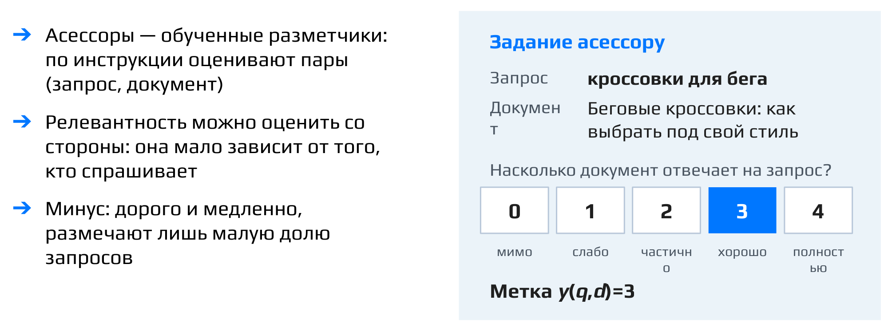

У подхода есть очевидный минус: он дорогой и медленный, поэтому размечают лишь малую долю запросов. Традиционно такую разметку собирали через **краудсорсинг** — раздавали задания большому числу людей-исполнителей. Сейчас эту работу всё чаще выполняют LLM: им нужно только правильно задать вопрос.

### Рекомендации: онлайн-сигналы

В рекомендациях так сделать не получится. Запрос здесь — это человек во всём его многообразии, и асессор не может знать, что понравится конкретному пользователю. Чтобы понять, чего человек подсознательно хочет, пришлось бы чуть ли не делать МРТ его мозга и искать в нём закономерности, что на практике невозможно.

Поэтому таргет берут из поведения самого пользователя, то есть из **онлайн-сигналов**: логов того, как пользователь взаимодействует с документами на рекомендательной платформе. Типичные сигналы такие:

- **клик** — показали документ, и он заинтересовал пользователя;
- **время просмотра** — например, какую долю видео человек посмотрел;
- **лайк** — документ понравился;
- **«поделиться»** — документ показался ценным и для других;
- **дизлайк** — явный негативный сигнал.

Обычно задачу сводят к тому, чтобы находить для пользователя то, что он скорее всего лайкнет или кликнет. Сигналов много, и достаются они бесплатно, но они шумные. Главная ловушка — **кликбейт**: контент, который провоцирует клик, но не приносит пользователю ценности. Если оптимизировать только вероятность клика, можно всем выдавать одно и то же — расчленёнку, контент 18+: кликать на это будут все, но мы хотим совсем не этого. Есть и второй источник шума: документы на верхних позициях получают клики просто потому, что стоят наверху.

### Из сигналов в рейтинг

Поэтому вместо бинарной шкалы «кликнул / не кликнул» обычно используют комбинированный фидбэк — агрегат по разным событиям. Сигналы упорядочивают по силе:

- лайк или «поделиться» — самый явный признак, что пользователю действительно понравилось;
- просмотр или просмотр большой доли — сигнал слабее: человек мог досмотреть видео, но не обязательно оно ему понравилось;
- клик без долгого просмотра — ещё слабее;
- дизлайк или показ без какого-либо взаимодействия — самый слабый, скорее негативный фидбэк.

Из этого собирают **рейтинг $y$** — сводный сигнал: чем сильнее реакция, тем он выше. Для ленты видео шкала может выглядеть так:

| Рейтинг | Событие |
|:--|:-------------|
| 3 | лайк или «поделился» |
| 2 | досмотрел до конца |
| 1 | кликнул, но быстро ушёл |
| 0 | показ без реакции или дизлайк |

Какие сигналы и с какими весами брать, решает команда под продуктовую цель. Дальше рейтинг используется точно так же, как асессорская метка в поиске.

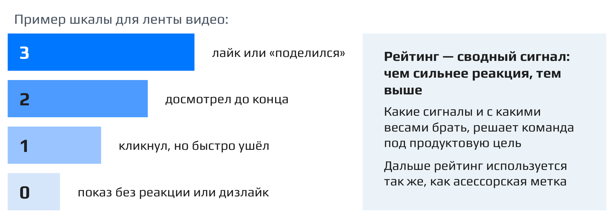

Здесь есть тонкий момент: таргет, по которому строится ранжирование, должен отвечать бизнес-требованиям, а чёткого понимания, чего именно хочет бизнес, бывает нет, и сами требования могут меняться. На практике здесь много подводных камней. Поэтому рядом с основной бизнес-метрикой обычно следят за **guardrail-метриками**[^n3a]: разнообразием выдачи, удовлетворённостью пользователей, задержкой, справедливостью, отписками и жалобами. Многое из этого разбирается в следующих темах курса. В оставшейся части лекции будем считать, что рейтинг уже есть, полученный вместе с бизнесом и из понимания контекста. Задача — обучить модель под этот рейтинг.

**Важно:** шкала выше — пример того, как можно думать о таргете, а не инструкция на все случаи жизни.

::: {.qa title="Вопросы из зала"}
**Показ без реакции и дизлайк — равноценные сигналы?** Однозначного ответа нет. Дизлайк — явное высказывание «мне не нравится», а показ без реакции — просто отсутствие взаимодействия, поэтому дизлайк логично ставить ниже нуля за показ. Другой вариант — вообще не использовать показы без реакции в обучении и учитывать только те, где произошло хоть какое-то событие.

**Можно ли учитывать ещё и время просмотра: зашёл, дизлайкнул и ушёл — это одно, а досмотрел до конца и потом дизлайкнул — другое?** Да, тонких моментов много. Например, дизлайк не обязательно означает, что пользователю не нравится всё подобное: тема ему может быть интересна, похожие видео нравятся, а не понравилось именно это видео по какой-то причине. Такие случаи можно пытаться выделять разными способами, но описать всё многообразие поведения явными правилами не получится.

**Искусственно ли добавляют пользователю новые айтемы и как решают проблему информационного пузыря?** Это вопрос этапа отбора кандидатов, а не ранжирования: ранкер получает уже готовый набор айтемов и только упорядочивает его. При отборе кандидатов нужно брать и что-то похожее на то, что пользователь любит, и что-то новое. Это один из краеугольных камней рекомендательных систем, рядом с проблемой холодного старта, и простого ответа здесь нет. Один из вариантов — действительно подмешивать новые айтемы.
:::

[^n3a]: Примечание составителя: guardrail-метрики («ограничительные») — показатели, которые не оптимизируют напрямую, но которые не должны ухудшиться при улучшении основной метрики. Список примеров предложили слушатели в чате. Позиция лектора: с частью он согласен, многое будет обсуждаться позже.

## Данные и метрика качества: DCG и NDCG

*Таймкод: 00:23:44 · слайды 14–17*

### Единый вид данных

Когда решено, какой таргет мы строим, остальное во всех задачах ранжирования устроено одинаково. В поиске рейтинги документов берутся из асессорской разметки, в RAG это метки полезности фрагментов, в рекомендациях — рейтинги, собранные из онлайн-сигналов, то есть из взаимодействий пользователя с документами. Но в любом случае данные для обучения ранкера выглядят так:

- запрос $q$;
- набор кандидатов $D_q$, которые нужно упорядочить;
- рейтинги $y(q,d)$ для каждого документа $d$ из $D_q$.

Раз данные одинаковые, методы обучения тоже общие. Они переносятся между задачами без изменений: модель, которая учится упорядочивать результаты поиска, учится по тем же правилам, что и модель, упорядочивающая ленту рекомендаций. Эти методы разбираются в следующих разделах. Перед этим нужно понять, на каких данных учимся и как измеряем результат.

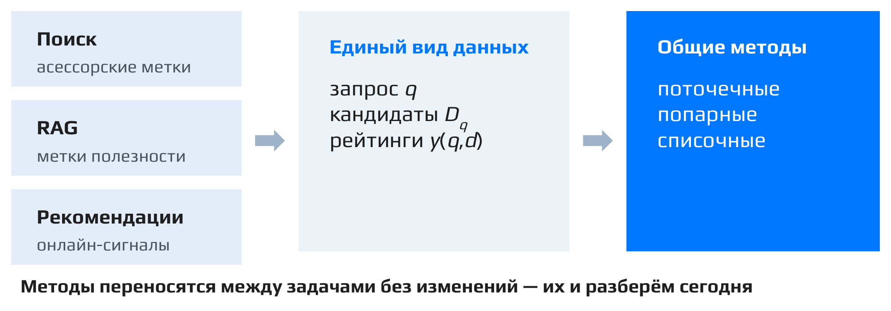

### Датасет из сессий

В рекомендациях роль «запроса» играет **сессия**: пользователь в конкретный момент времени, документы, которые ему показали, и то, как он с ними провзаимодействовал, то есть рейтинги этих документов. **Датасет из сессий** — это набор таких сессий. Важно, что документы сравниваются **только внутри одной сессии**: рейтинг 3 у одного пользователя вечером и рейтинг 3 у другого пользователя утром между собой не сопоставляются.

Возьмём две сессии:

| Сессия | Контекст | Документы и рейтинги |
|:--|:----|:----------|
| 1 | пользователь А, лента, вечер | клип $y=3$, трек $y=0$, видео $y=2$, пост $y=0$, товар $y=1$ |
| 2 | пользователь Б, лента, утро | новость $y=0$, видео $y=3$, пост $y=1$, трек $y=0$, клип $y=0$ |

В первой сессии у двух документов рейтинг 0, у одного 1, у одного 2 и у одного 3. Во второй — три нуля, одна единица и одна тройка. По таким обучающим данным модель должна научиться сортировать документы: для первой сессии сначала тройка, затем двойка, затем единица, затем два нуля.

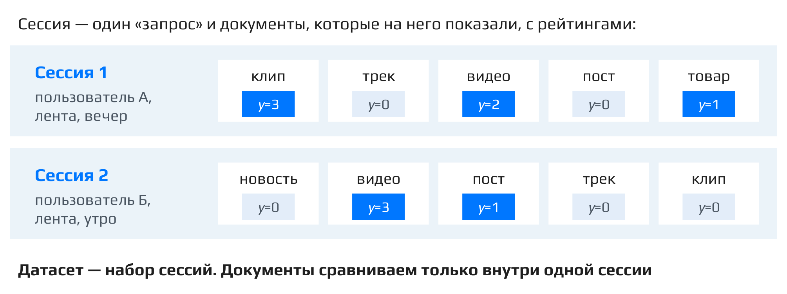

### DCG: рейтинги с весом позиции

Чтобы сравнивать модели, нужна метрика, которая показывает, насколько хорошо отсортирован список. Хотим, чтобы документы с высоким рейтингом стояли наверху. Такая метрика — **DCG (discounted cumulative gain)**, «дисконтированный накопленный выигрыш»:

$$\mathrm{DCG@}K = \sum_{i=1}^{K} \frac{y_i}{\log_2(i+1)}$$

Здесь $i$ — позиция в выдаче (суммируем по первым $K$ позициям), $y_i$ — рейтинг документа, который модель поставила на позицию $i$. Знаменатель $\log_2(i+1)$ — дисконт. Иначе говоря, мы складываем рейтинги, но каждый берём с весом позиции

$$w_i = \frac{1}{\log_2(i+1)}.$$

Хорошесть документа на первой позиции входит в сумму с весом 1, на второй — с весом 0.63, на третьей — 0.5, на четвёртой — 0.43, на пятой — 0.39[^n4a]. Чем ниже документ, тем меньше его вклад. Интуиция простая: раз веса затухают, выгодно, чтобы всё хорошее стояло в начале списка.

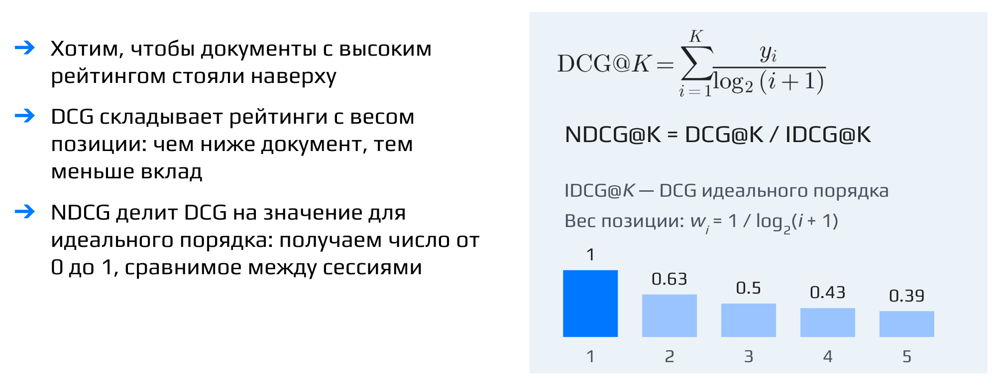

Посчитаем DCG для первой сессии. Пусть модель выдала порядок: клип ($y=3$), трек ($y=0$), видео ($y=2$), пост ($y=0$), товар ($y=1$). Рейтинги по позициям — 3, 0, 2, 0, 1, и

$$\mathrm{DCG@}5 = 3\cdot 1 + 0\cdot 0.63 + 2\cdot 0.5 + 0\cdot 0.43 + 1\cdot 0.39 = 4.39.$$

### IDCG и NDCG: нормировка на идеальный порядок

Число 4.39 само по себе мало что говорит. Максимально достижимый DCG в каждой сессии свой и зависит от того, какие в ней рейтинги. Если в сессии одни тройки или все тройки и одна двойка, DCG будет большим при любом порядке. Если в сессии одна тройка, а остальные нули, он будет маленьким даже при идеальной сортировке. Поэтому значения DCG разных сессий напрямую не сравнить.

Решение — нормировать на лучшее, что можно было получить. **IDCG** (ideal DCG) — это DCG идеального порядка, когда документы отсортированы по убыванию рейтингов. Для первой сессии идеальный порядок такой: клип (3), видео (2), товар (1), трек (0), пост (0), и

$$\mathrm{IDCG@}5 = 3\cdot 1 + 2\cdot 0.63 + 1\cdot 0.5 + 0 + 0 = 3 + 1.26 + 0.5 = 4.76.$$

**NDCG** (normalized DCG) — это отношение одного к другому:

$$\mathrm{NDCG@}K = \frac{\mathrm{DCG@}K}{\mathrm{IDCG@}K}.$$

В примере $\mathrm{NDCG@}5 = 4.39 / 4.76 \approx 0.92$. До идеала не хватает потому, что документы с $y=0$ (трек и пост) оказались выше видео и товара. Суффикс @K в **NDCG@k** означает, что метрику считают по первым $K$ позициям выдачи.

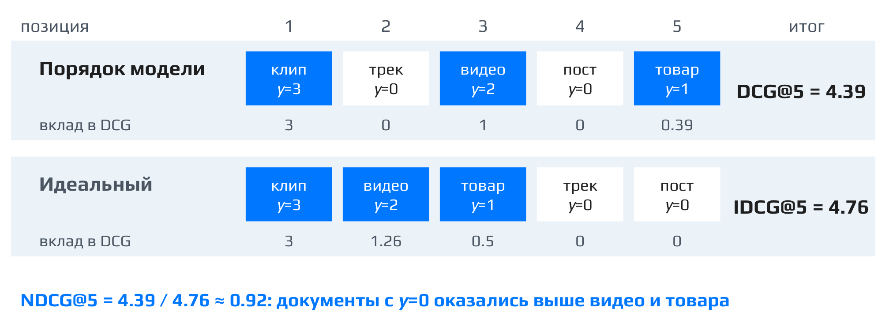

Ещё раз коротко, чем отличаются три величины:

- DCG — дисконтированные награды: рейтинги документов, делённые на дисконт позиции, в том порядке, который выдала модель;
- IDCG — та же метрика, но посчитанная по идеальному порядку;
- NDCG — первое, делённое на второе, то есть доля от оптимального выигрыша, которую получает наша модель. Это число от 0 до 1, и его уже можно сравнивать между сессиями.

**Важно:** идеальный порядок не нужно знать заранее или размечать вручную. Метрику считают на датасете, где для каждой сессии уже известно, какие айтемы показали пользователю и как он с ними провзаимодействовал, то есть рейтинги известны. Применяем обученную модель, получаем её скоры, сортируем по ним документы и считаем DCG. Сортировка тех же документов по известным рейтингам даёт IDCG. В поиске рейтинги могут прийти из асессорской разметки, в рекомендациях их руками не размечают: берут логи сессий с реальным поведением пользователей.

Подробно NDCG ещё раз разбирается на семинаре.

::: {.qa title="Вопросы из зала"}
**Рейтинг обязательно порядковый (0, 1, 2, 3)? Или он может быть непрерывным, например взвешенной суммой нескольких критериев, и как тогда мерить качество?** Шкала 0–3 — только пример, в общем случае рейтинг может быть каким угодно. NDCG никак не завязана на то, что $y$ — целые числа: формула так же работает и с нецелыми рейтингами.

**Пользователь включил видео и ушёл пить чай или встречать курьера. Получается, контент «потреблён» без всякого интереса. Что с этим делать?** Это действительно проблема. Нужно смотреть, насколько часто такое встречается и насколько сильно портит данные, и дальше действовать по ситуации. На практике в простых случаях этим чаще всего пренебрегают.

**Отражает ли NDCG бизнес-ценность?** Это скорее техническая метрика: она показывает, насколько хорошо мы отранжировали айтемы. В каком-то смысле ценность она отражает, ведь мы ранжируем в том порядке, который нужен бизнесу. Но это не прямая бизнес-метрика вроде CTR или конверсии в целевое событие.
:::

[^n4a]: Примечание составителя: дисконт $\log_2(i+1)$, а не $\log_2 i$, выбран так, чтобы на первой позиции вес был ровно $1/\log_2 2 = 1$; при $\log_2 i$ на первой позиции получилось бы деление на ноль.

## Методы обучения ранжированию: постановка и поточечный подход

*Таймкод: 00:40:08 · слайды 18 · доска 1–4*

### Почему метрику нельзя оптимизировать напрямую

Мы научились измерять качество ранжирования с помощью NDCG. Естественное желание — взять эту метрику и обучать модель, напрямую её максимизируя. Но метрики качества ранжирования, и NDCG в частности, **нельзя оптимизировать напрямую**.

Причина простая. NDCG зависит только от порядка документов в выдаче. Если немного подвигать предсказания модели, порядок, как правило, не изменится, а значит, не изменится и метрика. Как функция от предсказаний NDCG кусочно-постоянна: на больших участках она стоит на месте, а в отдельных точках, где два документа меняются местами, скачком меняет значение. Такая функция недифференцируема, а там, где производная существует, она равна нулю. Градиентному спуску здесь не за что зацепиться.

**Акцент лектора:** эта мысль проходит красной нитью через всю тему. Все методы обучения ранжированию, о которых пойдёт речь дальше, по сути отвечают на один вопрос: как обойти невозможность прямой оптимизации NDCG.

### Формальная постановка

Пусть $Q$ — множество запросов, $D$ — множество документов. В общем виде датасет записывается так:

$$\mathcal{X} = \{(q, S_q) \mid q \in Q\},$$

где $S_q$ — некоторые данные об истинных метках для запроса $q$. Содержание $S_q$ здесь намеренно не уточняется: в каждом из подходов эти данные устроены по-своему, и именно этим подходы друг от друга отличаются.

Мы хотим построить модель

$$\hat y : Q \times D \to \mathbb{R},$$

которая принимает пару «запрос — документ» и выдаёт вещественное число. Это та же функция ранжирования $f(q,d)$: по её значениям мы сортируем документы, и полученный порядок должен как можно лучше приближать идеальное ранжирование.

### Три подхода к обучению ранжированию

Методы обучения ранжированию принято делить на три группы.

- **Поточечный подход (pointwise)** — предсказание меток напрямую. Нам нужно, чтобы наверху оказались айтемы с высокой меткой, так давайте просто эту метку и предсказывать.
- **Попарный подход (pairwise)** — обучение на парах. Рассматриваем пары айтемов, в которых один лучше другого для конкретного пользователя или запроса, и учим модель правильно их упорядочивать.
- **Списочный подход (listwise)** — обучение на списках объектов. Модель учится с учётом полного порядка в выдаче.

Начнём с самого простого, поточечного подхода. Попарный и списочный разбираются в следующих разделах.

### Поточечный подход: сведение к классификации или регрессии

В поточечном подходе данные об истинных метках — это просто документы с их рейтингами:

$$S_q = \{(d, r_d) \mid d \in D_q\},$$

где $D_q$ — множество айтемов, для которых по запросу $q$ есть фидбэк (рейтинг), а $r_d$ — рейтинг документа $d$.

Вспомним датасет из сессий: в каждой сессии каждому показанному документу приписан рейтинг $y$, например от 0 до 3. Идея поточечного подхода — предсказывать этот $y$ напрямую обычной классификацией или регрессией. Обучили модель, которая предсказывает рейтинг, а потом выдаём пользователю документы в порядке убывания предсказанного рейтинга. Учить такую модель можно, например, по MSE, если рассматривать задачу как регрессию, или по LogLoss для бинарной или многоклассовой классификации.

### Проблема многоклассовой классификации

С многоклассовой классификацией возникает тонкость: в ней **нельзя указать, что одна метка лучше другой**. Если $y \in \{0, 1, 2, 3\}$, задачу естественно свести к классификации на 4 класса. Но мы знаем, что метка 3 лучше метки 2, а та лучше метки 1. Для стандартных методов многоклассовой классификации все классы равнозначны и никак не упорядочены. Информация о порядке меток, а для ранжирования это самое главное, просто теряется.

### Решение: засечки на числовой прямой

Решение — добавить в классификацию **засечки (пороги)**. Пусть метки — это $1, \dots, K$. Модель $\hat y$, которую мы обучаем, выдаёт для объекта одно число, точку на числовой прямой. На этой прямой расставим пороги $b_1 < b_2 < \dots < b_{K-1}$. Если предсказание попало левее $b_1$, объект получает метку 1, между $b_1$ и $b_2$ — метку 2, и так далее, а правее последнего порога — метку $K$. Например, для пяти меток нужны четыре засечки $b_1, \dots, b_4$.

Вероятность того, что истинная метка больше $i$, задаётся так:

$$P(y > i) = \sigma(\hat y - b_i),$$

где $\sigma$ — сигмоида (логистическая функция), $\hat y$ — скалярное предсказание модели, $b_i$ — $i$-я засечка. Чем правее предсказание относительно порога $b_i$, тем ближе эта вероятность к единице. Так мы **одновременно решаем $K-1$ задачу бинарной классификации**: для каждого порога отвечаем на вопрос «метка больше $i$?».[^n5a]

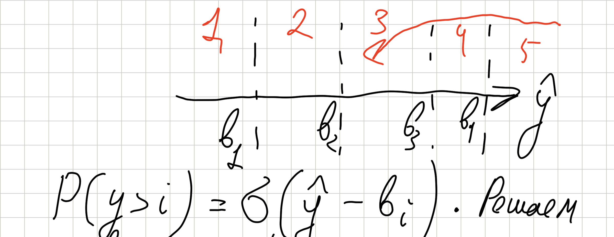

Главное в этой конструкции вот что. В обычной классификации модель выдаёт отдельный скор на каждый класс, и итоговое решение получается уже из этих скоров. Здесь всё «упихивается» в одну числовую прямую: модель выдаёт одно число, а предсказание интерпретируется как вероятность того, что метка больше $i$, то есть что точка лежит правее соответствующего порога. Порядок меток при этом задан явно, порядком засечек на прямой, и предсказания модели автоматически согласованы с тем, как метки упорядочены между собой. Такая постановка называется **ординальной классификацией**.

Это описание концептуальное, а не алгоритм конкретного метода. По такой схеме, с различиями в деталях, работают несколько методов:

- **PRank** — довольно старый метод из статьи с забавным названием «Pranking with Ranking»;[^n5b]
- **CORAL** и **CORN** — более современные методы.

Подробно разбирать их различия здесь не будем.

### Пример: ранжирование по времени просмотра

Пусть мы хотим ранжировать видео по времени просмотра: наверху должно оказаться то, что пользователь, вероятно, будет смотреть дольше всего. Какой таргет и какой лосс выбрать в поточечном подходе?

Таргет здесь — само время просмотра. Его можно дополнительно ограничить сверху или разбить на интервалы. Ключевое отличие от предыдущих примеров в том, что метки теперь непрерывные, поэтому нужны методы регрессии, например MSE или MAE в зависимости от данных. У времени просмотра есть и более интересные особенности: его можно предсказывать вероятностно, например моделируя его распределение как смесь нормальных распределений. Но это уже отдельная тема.

::: {.qa title="Вопросы из зала"}
**Где мы берём размеченные данные и почему считаем их релевантными?** Датасет собирается из логов. Взаимодействие уже произошло: мы показали пользователю айтем, а он кликнул на него, лайкнул и так далее. По этим данным считаются метрики, из них же берутся и метки релевантности.

**Не связана ли проблема многоклассовой классификации с ростом размерности и тем, что расстояния между векторами становятся почти одинаковыми?** Нет. Это проклятие размерности, оно возникает, когда мы смотрим на метрические расстояния между векторами. Здесь ситуация другая: базовые модели многоклассовой классификации просто не учитывают, в каком порядке идут метки.
:::

[^n5a]: Примечание составителя: обычно каждая из $K-1$ бинарных задач обучается по LogLoss, а пороги $b_i$ обучаются вместе с моделью. Итоговую метку можно получить как $1 +$ число порогов, которые предсказание $\hat y$ превзошло.

[^n5b]: Примечание составителя: статья K. Crammer, Y. Singer «Pranking with Ranking» опубликована на NIPS в 2001 году.

## Попарный подход: RankNet

*Таймкод: 00:58:28 · доска 5–8*

### Зачем сравнивать пары

В попарном подходе данные об истинных метках для запроса $q$ устроены как множество пар:

$$S_q \subset D_q \times D_q,$$

где $S_q$ — множество **правильно отранжированных пар** по запросу $q$. Если пара $(d_i, d_j)$ лежит в $S_q$, то документ $d_i$ должен стоять выше документа $d_j$.

Зачем вообще переходить от отдельных документов к парам? Ответов два.

Первый: поточечный подход решает не ту задачу, которую мы на самом деле хотим решить. Он решает задачу «угадай, какая будет метка качества». Но в рекомендациях нам не нужно угадывать, лайкнет пользователь айтем или нет, и вообще не обязательно понимать, как именно он с ним провзаимодействует. Наша задача — правильно отсортировать айтемы, то есть из того, что есть, подобрать ему самое хорошее. Важен порядок, а не абсолютное значение предсказания.

Второй ответ связан с разметкой. Вернёмся к поиску и асессорам. В поточечной постановке асессор должен выставить документу оценку релевантности по шкале. Если он сомневается, «супер релевантен» документ или «просто релевантен», выбрать оценку трудно. В попарной постановке задача проще: вот запрос, вот документ 1 и документ 2 — какой из них релевантнее? На сравнительный вопрос обычно ответить легче, чем выставить абсолютную оценку. Отсюда вывод: попарные **данные легче собирать, и поэтому их больше**.

### Постановка RankNet

Теперь разберём **RankNet** — один из наиболее широко применяемых методов в ранжировании. В разных модификациях он известен под разными названиями.

Пусть есть модель

$$\hat y_\theta(q, d) : Q \times D \to \mathbb{R},$$

которая по-прежнему по паре (запрос, документ) выдаёт вещественное число. Здесь $\theta$ — веса модели, например веса нейросети или линейной регрессии. Единственное требование: модель **дифференцируема по $\theta$**.

Пусть $(d_i, d_j) \in S_q$. Введём обозначение

$$s_i := \hat y_\theta(q, d_i).$$

Это **скор $s_i$** — предсказание модели на $i$-м документе. Важно, что $s_i$ — это не реальная метка, а именно выход модели. В классическом варианте RankNet это просто сырые выходы модели: никаких требований к ним нет, они не обязаны быть неотрицательными или суммироваться в единицу.

### Истинная и предсказанная вероятности

Истинное соотношение документов в паре зададим величиной

$$Q_{ij} = \begin{cases} 1, & d_i \text{ лучше } d_j, \\ 0, & d_i \text{ хуже } d_j. \end{cases}$$

Это то, как документы соотносятся в действительности. Иногда добавляют третье значение: $Q_{ij} = 1/2$, если $d_i$ и $d_j$ одинаково хороши.

Модель же даёт свою оценку вероятности того, что $d_i$ лучше $d_j$:

$$P_{ij} = \frac{1}{1 + e^{-\alpha (s_i - s_j)}}.$$

Многие узнают здесь **сигмоиду** (логистическую функцию) $\sigma(x) = 1/(1+e^{-x})$ и будут абсолютно правы. $P_{ij}$ — это предсказанное сравнение айтема $i$ с айтемом $j$. За то, насколько сильно документы различаются, отвечает разность скоров $s_i - s_j$: чем больше скор $d_i$ превосходит скор $d_j$, тем ближе $P_{ij}$ к единице. Коэффициент $\alpha$ — масштабирующий множитель[^n6a]. Так же устроена логистическая регрессия.

Получаются две меры вероятности того, что $i$-й документ лучше $j$-го: истинная $Q_{ij}$ и предсказанная $P_{ij}$. Мы хотим приблизить одну к другой.

### Лосс пары: KL-дивергенция между распределениями Бернулли

Каждое из чисел $Q_{ij}$ и $P_{ij}$ задаёт **распределение Бернулли** — распределение случайной величины, которая равна 1 с вероятностью $p$ и 0 с вероятностью $1 - p$. $\mathrm{Bern}(Q_{ij})$ — «истинное» распределение с вероятностью позитива $Q_{ij}$, $\mathrm{Bern}(P_{ij})$ — предсказанное. Близость двух распределений измеряется **KL-дивергенцией** (дивергенцией Кульбака–Лейблера): для распределений $p$ и $p'$ это $\sum_x p(x)\log\frac{p(x)}{p'(x)}$, она неотрицательна и равна нулю только при совпадении распределений.

Определим лосс на одной паре:

$$C_{ij} := \mathrm{KL}\big(\mathrm{Bern}(Q_{ij}) \,\|\, \mathrm{Bern}(P_{ij})\big) = Q_{ij}\log\frac{Q_{ij}}{P_{ij}} + (1 - Q_{ij})\log\frac{1 - Q_{ij}}{1 - P_{ij}}.$$

Раскроем логарифмы:

$$C_{ij} = \underbrace{Q_{ij}\log Q_{ij} + (1 - Q_{ij})\log(1 - Q_{ij})}_{\text{не зависит от } P_{ij}} \;-\; Q_{ij}\log P_{ij} - (1 - Q_{ij})\log(1 - P_{ij}).$$

Первые два слагаемых не зависят от $P_{ij}$. А оптимизируем мы именно $P_{ij}$ — хотим приблизить его к $Q_{ij}$. Поэтому с точки зрения оптимизации первая часть — константа, и остаётся классическая формула LogLoss между $Q_{ij}$ и $P_{ij}$. Величину **$C_{ij}$** можно понимать как расстояние между истинной и предсказанной вероятностями, которое мы минимизируем.

### Свойства $C_{ij}$

Подставим конкретные значения $Q_{ij}$.

1. **$d_i$ лучше $d_j$** ($Q_{ij} = 1$). В первой части $1 \cdot \log 1 = 0$, а $0 \cdot \log 0$, как обычно в энтропиях, считается нулём. Во второй части остаётся $-\log P_{ij}$, то есть логарифм знаменателя сигмоиды:
   $$C_{ij} = \log\left(1 + e^{-\alpha(s_i - s_j)}\right).$$
2. **$d_i$ хуже $d_j$** ($Q_{ij} = 0$). Пользуясь свойством сигмоиды $1 - \sigma(x) = \sigma(-x)$, получаем ту же формулу, где $i$ и $j$ поменялись местами:
   $$C_{ij} = \log\left(1 + e^{-\alpha(s_j - s_i)}\right).$$
   Формула симметрична; это можно проверить отдельно.
3. **$s_i = s_j$**. Тогда в обоих случаях показатель экспоненты равен нулю, $e^0 = 1$, и
   $$C_{ij} = \log(1 + 1) = \log 2.$$
   Основание логарифма может быть любым; для двоичного логарифма получится ровно 1.

Обратите внимание на третье свойство: какой $Q_{ij}$ в него подставлять? Если не учитывать вариант с $Q_{ij} = 1/2$, то для одинаково хороших документов $Q_{ij}$ вообще не определён: мы считаем, что в каждой паре один документ всё-таки лучше другого, и $Q_{ij}$ равен 1 или 0. Но при $s_i = s_j$ это неважно — в обоих случаях получается одно и то же число $\log 2$, независимо от того, как $d_i$ и $d_j$ соотносятся на самом деле[^n6b].

### Лосс и его градиент

Степень того, насколько один документ лучше другого с точки зрения модели, задаётся разностью скоров. Общий лосс — сумма лоссов $C_{ij}$ по всем правильно упорядоченным парам всех запросов:

$$Q(\theta) = \sum_q \sum_{(d_i, d_j) \in S_q} C_{ij} \to \min_\theta.$$

Градиент нужен, чтобы взять антиградиент и провести оптимизацию градиентным спуском. Поскольку $C_{ij}$ зависит от $\theta$ только через скоры $s_i$ и $s_j$, по правилу дифференцирования сложной функции

$$\nabla_\theta Q = \sum_q \sum_{(d_i, d_j) \in S_q} \left[\frac{\partial C_{ij}}{\partial s_i} \cdot \frac{\partial s_i}{\partial \theta} + \frac{\partial C_{ij}}{\partial s_j} \cdot \frac{\partial s_j}{\partial \theta}\right].$$

**Важно:** обратите внимание на множители $\partial C_{ij} / \partial s_i$ и $\partial C_{ij} / \partial s_j$ — это градиенты лосса пары по скорам модели. Они ещё понадобятся: дальше именно через них будет строиться развитие RankNet.

Здесь предполагается, что обучается нейросеть (или другая модель с весами), и градиент берётся по обучаемым весам $\theta$. Если модель — ансамбль деревьев, никакого $\theta$ нет и градиент по нему не берётся; как обучать ранжирование в этом случае, разобрано в последнем разделе[^n6c].

### Что на чём обучается: резюме

Соберём постановку целиком. **Что предсказываем:** есть запрос (в рекомендациях — пользователь) и набор документов-кандидатов, которые мы потенциально хотим ему показать. Модель для каждого кандидата выдаёт числовой скор, и мы просто сортируем по нему: на первом месте — кандидат с наибольшим скором, на втором — следующий, и так далее.

**На каких данных обучаемся:**

- в попарном подходе — множество троек «запрос (пользователь), айтем 1, айтем 2», где с одним айтемом взаимодействие было лучше, чем с другим; модель учится ставить первый выше второго для этого пользователя;
- в поточечном подходе — множество пар «пользователь, документ, с которым он взаимодействовал» вместе с оценкой (таргетом).

В рекомендациях эти данные берутся из логов: из историй пользователей в сервисе. Для каждого пользователя известен набор документов, с которыми он провзаимодействовал, и то, как именно.

::: {.qa title="Вопросы из зала"}
**По какому основанию берётся логарифм?** Это не важно. Логарифмы по разным основаниям отличаются умножением на константу ($\log_2 x = \ln x / \ln 2$), поэтому с точки зрения оптимизации лосса все варианты эквивалентны.

**Откуда взялось $D_q$?** Это множество документов залогированной сессии: пользователь, показанные ему документы и то, как он с ними провзаимодействовал. Иначе говоря, документы, про которые у нас есть данные по запросу $q$. А $S_q$ — набор правильно упорядоченных пар из этих документов.

**Что такое $q$, что за «запрос»?** Задача ранжирования унифицирована для поиска, рекомендаций и RAG, поэтому «запросом» в каждой из них называется своё: в поиске — текстовый запрос, в рекомендациях — пользователь в каком-то представлении.

**В лоссе суммирование идёт по $S_q$, а в градиенте — по $D_q$. Почему меняется область суммирования?** Не меняется: в градиенте суммирование тоже по парам из $S_q$.

**Правильно ли я понимаю: $P_{ij}$ — вероятность, которую выдаёт модель, что $d_i$ лучше $d_j$; $Q_{ij}$ — истинная вероятность (1, если $d_i$ лучше, иначе 0); $C_{ij}$ — расстояние между ними, которое мы оптимизируем?** Да, именно так.

**Скоры $s_i$, $s_j$ — это сырые выходы модели или к ним применяют softmax?** В классическом варианте — просто сырые выходы, никаких ограничений на них не накладывается.
:::

[^n6a]: Примечание составителя: роль $\alpha$ в лекции не раскрывалась. Он задаёт крутизну сигмоиды: при большом $\alpha$ даже небольшая разница скоров даёт вероятность, близкую к 0 или 1.

[^n6b]: Примечание составителя: интуитивно $C_{ij} = \log 2 > 0$ при $s_i = s_j$ означает, что модель, не различающая документы пары ($P_{ij} = 1/2$), получает ненулевой штраф — лосс подталкивает её развести скоры в правильную сторону.

[^n6c]: Примечание составителя: на вопрос о бустинге в лекции дан лишь краткий ответ («в бустинге нет $\theta$»). В бустинге для ранжирования роль градиента играют как раз производные лосса по скорам $\partial C_{ij}/\partial s_i$ — см. раздел о ранжировании градиентным бустингом.

## Списочный подход: модель Плакетта–Люса, ListNet и ListMLE

*Таймкод: 01:28:48 · доска 8–12*

В попарном подходе обучающий объект для запроса $q$ — набор пар $S_q$, где про каждую пару известно, какой документ лучше. Списочный подход делает следующий шаг: вместо отдельных пар берём сразу весь список документов запроса с правильным порядком на нём, то есть $S_q = D_q$ вместе с упорядочиванием. Модель теперь должна сравнивать не две позиции, а целую выдачу. Для этого нужен способ говорить о вероятности того или иного порядка документов, и классический инструмент здесь — модель Плакетта–Люса. На ней основано сразу несколько списочных методов.

### Модель Плакетта–Люса

**Модель Плакетта–Люса** превращает скоры $\hat y(q,d)$, которые модель выдаёт документам, в вероятностное распределение на перестановках документов. Пусть $\pi$ — перестановка документов из $D_q$, а $d_j$ — документ, стоящий в ней на $j$-м месте. Тогда

$$
P_{\hat y}(\pi) = \prod_{j=1}^{|D_q|} \frac{\hat y(q, d_j)}{\sum_{k=j}^{|D_q|} \hat y(q, d_k)} .
$$

Каждый множитель — это доля скора документа, стоящего на $j$-м месте, в сумме скоров тех документов, которые ещё не заняли места (с $j$-го по последний). Перемножая эти доли по всем позициям, получаем вероятность всей перестановки.

**Важно:** формула имеет смысл только при строго положительных скорах, иначе доли перестают быть вероятностями. В RankNet скоры $s_i$ могли быть любыми сырыми выходами модели, здесь же требование жёстче. Если модель выдаёт и отрицательные числа, их достаточно пропустить через монотонное положительное преобразование — сигмоиду, экспоненту или что-то подобное, просто чтобы сделать скоры положительными.

Разберём пример с тремя документами $A$, $B$, $C$. Вероятность перестановки «сначала $A$, потом $B$, потом $C$» раскладывается по условным вероятностям:

$$
P_{\hat y}(ABC) = P_{\hat y}(A\text{ — I})\cdot P_{\hat y}(B\text{ — II}\mid A\text{ — I})\cdot P_{\hat y}(C\text{ — III}\mid A\text{ — I},\, B\text{ — II}),
$$

где «$A$ — I» означает «$A$ стоит на первом месте». По формуле Плакетта–Люса это

$$
P_{\hat y}(ABC) = \frac{\hat y(A)}{\hat y(A)+\hat y(B)+\hat y(C)}\cdot\frac{\hat y(B)}{\hat y(B)+\hat y(C)}\cdot\frac{\hat y(C)}{\hat y(C)} .
$$

Интуитивно это удобно представлять как мешок Деда Мороза. В непрозрачном мешке лежат все документы — здесь три. Опускаем руку и вытягиваем документ, но не равновероятно, а с вероятностью, пропорциональной его скору: скоры играют роль весов. Вероятность первым вытащить $A$ равна доле его веса в сумме весов всех трёх документов. Дальше $A$ уже на руках, в мешке остались $B$ и $C$, и вероятность вытащить $B$ равна $\hat y(B)/(\hat y(B)+\hat y(C))$. В мешке остаётся только $C$, и его мы достаём с вероятностью $\hat y(C)/\hat y(C)=1$. Порядок, в котором документы вынимаются из мешка, и есть перестановка. Для большего числа документов всё расписывается точно так же.

### ListNet

Первый метод на основе модели Плакетта–Люса — **ListNet**. В нём считается, что у документов есть истинные метки $y$, поэтому на перестановках возникают два распределения:

- $P_{\hat y}(\pi)$ — по модели, через предсказанные скоры $\hat y$;
- $P_y(\pi)$ — по истинным меткам $y$, по той же формуле.

Естественная задача — приблизить модельное распределение к истинному, минимизируя KL-дивергенцию между ними:

$$
\mathrm{KL}(P_y, P_{\hat y}) \to \min_\theta .
$$

Это та же идея, что и в RankNet, только там сравнивались распределения Бернулли для пары документов, а здесь — распределения на целых перестановках. Такая функция дифференцируема и, значит, оптимизируема градиентными методами.

Но с вычислением здесь есть проблема. Распределение задано на перестановках, а перестановок $|D_q|!$. Уже для нескольких десятков документов перебрать их все невозможно.

Выход подсказывает то же соображение, на котором построена метрика NDCG: по-настоящему важен верх выдачи. Что окажется на сотом месте, волнует гораздо меньше, чем что окажется на первом или втором. Поэтому вместо распределения на всех перестановках рассматривают распределение только того, какой документ окажется первым, — **top-1 вероятность**:

$$
P_{\hat y}(d) = \frac{\hat y(q,d)}{\sum_{d'\in D_q}\hat y(q,d')}, \qquad
P_y(d) = \frac{y(q,d)}{\sum_{d'\in D_q} y(q,d')} .
$$

Это вероятность того, что документ $d$ встанет на первую позицию: скор документа, нормированный на сумму скоров всех документов запроса. В терминах мешка мы достаём из него один подарок — и больше нам ничего не нужно. Штрих у $d'$ нужен только для того, чтобы индекс суммирования в знаменателе не совпал с документом $d$ в числителе.

Сравнивая два top-1 распределения, получаем лосс ListNet — **кросс-энтропию** между истинным и модельным распределениями[^n7a]:

$$
L(y,\hat y) = -\sum_{d\in D_q} P_y(d)\,\log P_{\hat y}(d) \to \min_\theta .
$$

Теперь всё вычислимо: сумма идёт по $|D_q|$ документам, а не по $|D_q|!$ перестановкам.

### ListMLE

Можно подойти к списочному обучению с другой стороны. ListNet сравнивает два распределения, и для этого пришлось упрощать задачу. Но сравнивать распределения не обязательно: у нас вообще-то есть правильная перестановка. Это идеальное ранжирование $\pi_q$ для запроса $q$, которое порождают истинные метки.

**ListMLE** предлагает просто сделать эту перестановку как можно более вероятной под моделью. Функция потерь — вероятность идеальной перестановки $P_{\hat y}(\pi_q)$[^n7b], а оптимизируют её минус логарифм:

$$
-\log P_{\hat y}(\pi_q) \to \min_\theta .
$$

Минимизируется **отрицательное лог-правдоподобие** идеальной перестановки. Отсюда и название метода: MLE — Maximum Likelihood Estimation, оценка максимального правдоподобия.

::: {.qa title="Вопросы из зала"}
**Что делать, если $y$ и $\hat y$ бывают отрицательными — брать экспоненту?** Да. Для этих методов скоры должны быть строго положительными, и экспонента — самый частый способ этого добиться.

**Чем отличаются $y$ и $\hat y$?** $y$ — истинные метки: например, пользователь лайкнул документ — 1, не лайкнул — 0. $\hat y$ — предсказания модели, то есть числа, которые она выдаёт для документов.

**Что такое $d'$ в формуле top-1 вероятности?** Это просто индекс суммирования в знаменателе. Штрих стоит, чтобы не было коллизии с $d$, который уже занят в числителе. Смысл формулы — скор документа нормируется на сумму скоров по всем документам $D_q$.

**В чём смысл подхода, если всё свелось к угадыванию первого документа выдачи?** Интуиция такая: документы, которые часто оказываются на первой позиции, часто будут и на второй, и на третьей, и модель сможет это уловить. При этом нельзя сказать, что это лучший из подходов: как всегда, выбор метода решают эксперименты.
:::

[^n7a]: Примечание составителя: $\mathrm{KL}(P_y, P_{\hat y}) = \sum_d P_y(d)\log P_y(d) - \sum_d P_y(d)\log P_{\hat y}(d)$. Первое слагаемое не зависит от параметров модели $\theta$, поэтому минимизировать KL-дивергенцию — то же самое, что минимизировать кросс-энтропию, то есть второе слагаемое со знаком минус. Аналогичный шаг делался для $C_{ij}$ в RankNet. На доске лосс записан без минуса перед суммой, но для корректной минимизации минус нужен.

[^n7b]: Примечание составителя: вероятность $P_{\hat y}(\pi_q)$ здесь считается по модели Плакетта–Люса, то есть как произведение $\prod_j \hat y(q,d_j)/\sum_{k\ge j}\hat y(q,d_k)$, где $d_j$ — документ на $j$-м месте идеальной перестановки.

## Градиент RankNet через лямбды

*Таймкод: 01:45:29 · доска 13–15*

Списочные функции потерь — не единственный способ учесть устройство всей выдачи. Есть другой путь: вернуться к попарному RankNet и внимательно посмотреть на его градиент. Разбирая RankNet, мы остановились на том, что градиент итогового лосса раскладывается по цепному правилу и в нём появляются множители $\partial C_{ij}/\partial s_i$ и $\partial C_{ij}/\partial s_j$ — градиенты лосса пары по скорам модели. Посчитаем их явно: в них обнаруживается структура, на которой построены следующие методы.

### Производные лосса пары по скорам

Пусть документ $d_i$ лучше документа $d_j$. Тогда, как мы уже выяснили, лосс пары равен

$$C_{ij} = \log\left(1 + e^{-\alpha (s_i - s_j)}\right).$$

Возьмём производную по $s_i$. Производная логарифма — единица, делённая на выражение под логарифмом, — даёт знаменатель. Её умножаем на производную того, что стоит внутри: единица при дифференцировании исчезает, производная экспоненты равна самой экспоненте, умноженной на производную показателя, а производная показателя $-\alpha(s_i - s_j)$ по $s_i$ равна $-\alpha$. Получаем

$$\frac{\partial C_{ij}}{\partial s_i} = \frac{-\alpha\, e^{-\alpha(s_i-s_j)}}{1+e^{-\alpha(s_i-s_j)}} = \frac{-\alpha}{1+e^{\alpha(s_i-s_j)}}.$$

Второе равенство получается делением числителя и знаменателя на одну и ту же экспоненту $e^{-\alpha(s_i-s_j)}$: в числителе от неё остаётся единица, то есть просто $-\alpha$; в знаменателе единица превращается в $e^{\alpha(s_i-s_j)}$, а сама экспонента — в единицу.

Производная по $s_j$ считается точно так же, отличается только последний шаг: производная показателя $-\alpha(s_i - s_j)$ по $s_j$ равна $+\alpha$. Сначала получается $\dfrac{\alpha\, e^{-\alpha(s_i-s_j)}}{1+e^{-\alpha(s_i-s_j)}}$, а после того же деления на экспоненту —

$$\frac{\partial C_{ij}}{\partial s_j} = \frac{\alpha}{1+e^{\alpha(s_i-s_j)}} = -\frac{\partial C_{ij}}{\partial s_i}.$$

Обе производные совпадают с точностью до знака. Это естественно: лосс пары зависит только от разности $s_i - s_j$, поэтому увеличить $s_i$ — то же самое, что на столько же уменьшить $s_j$.

### Лямбды

Теперь подставим эти производные в цепное правило для параметров модели $\theta$:

$$\frac{\partial C_{ij}}{\partial \theta} = \frac{\partial C_{ij}}{\partial s_i}\frac{\partial s_i}{\partial \theta} + \frac{\partial C_{ij}}{\partial s_j}\frac{\partial s_j}{\partial \theta} = -\frac{\alpha}{1+e^{\alpha(s_i-s_j)}}\left(\frac{\partial s_i}{\partial\theta} - \frac{\partial s_j}{\partial\theta}\right).$$

Градиент лосса пары — это разность градиентов двух предсказаний, умноженная на общий коэффициент. Этот коэффициент и обозначим

$$\lambda_{ij} = -\frac{\alpha}{1+e^{\alpha(s_i-s_j)}}.$$

Величина **$\lambda_{ij}$** — производная лосса пары по скору лучшего документа. Аналогично она определяется и в случае, когда $d_i$ хуже $d_j$.

Один и тот же документ $d_i$ входит во многие пары: в одних он лучше соседа, в других хуже. Соберём вклад всех пар, где участвует $d_i$, в одну величину:

$$\lambda_i := \sum_{j:\ d_i \text{ лучше } d_j} \lambda_{ij} \;-\; \sum_{j:\ d_i \text{ хуже } d_j} \lambda_{ij}.$$

Минус во второй сумме появляется по той же причине, что и выше: если $d_i$ — худший документ пары, его скор входит в лосс так же, как $s_j$ в разобранном случае, и производная по нему берётся с обратным знаком. Лямбды входят во все формулы с разными знаками в зависимости от того, какой документ пары лучше.[^n8a]

Ради этой величины всё и затевалось. Для итогового лосса $Q$, то есть суммы $C_{ij}$ по всем парам, верно

$$\frac{\partial Q}{\partial s_i} = \lambda_i, \qquad \frac{\partial Q}{\partial \theta} = \sum_i \lambda_i \frac{\partial s_i}{\partial \theta}.$$

**Величина $\lambda_i$** — это просто производная всего лосса по скору $i$-го документа. Дальше мы будем постоянно пользоваться этим фактом.

### Что это даёт: сумма по документам вместо суммы по парам

Раньше градиент лосса был суммой по **парам** документов, и для каждой пары выписывалось своё выражение. Теперь это сумма по **документам**: для каждого документа берём градиент предсказания модели на нём и умножаем на вес $\lambda_i$. Сам вес, конечно, зависит от скоров всех документов, с которыми $d_i$ образует пары, но с точки зрения градиента это всего лишь умножение на число.

Отсюда практическое следствие: стохастический градиентный спуск можно делать не по парам, а по отдельным документам — **SGD по документам**. Это улучшает сходимость.

### Смысл лямбд: стрелки в выдаче

У лямбд есть наглядная интерпретация, которую обычно показывают на классической картинке. Нарисуем текущую выдачу модели: сверху вниз — первый, второй, третий айтем и так далее, в том порядке, в каком модель их ранжирует. Рядом с каждым айтемом нарисуем стрелку, соответствующую его $\lambda_i$: у одного документа она направлена вниз, у других вверх, у разных документов стрелки разной длины.

Эти стрелки показывают, куда мы хотим переместить документ в выдаче. Знак $\lambda_i$ задаёт направление, абсолютное значение — насколько сильно. Это прямо следует из равенства $\partial Q/\partial s_i = \lambda_i$. При градиентном спуске скор двигается против градиента: если $\lambda_i$ положительна, скор документа уменьшается и документ опускается в выдаче; если отрицательна, скор растёт и документ поднимается. Чем больше $|\lambda_i|$, тем сильнее сдвиг.

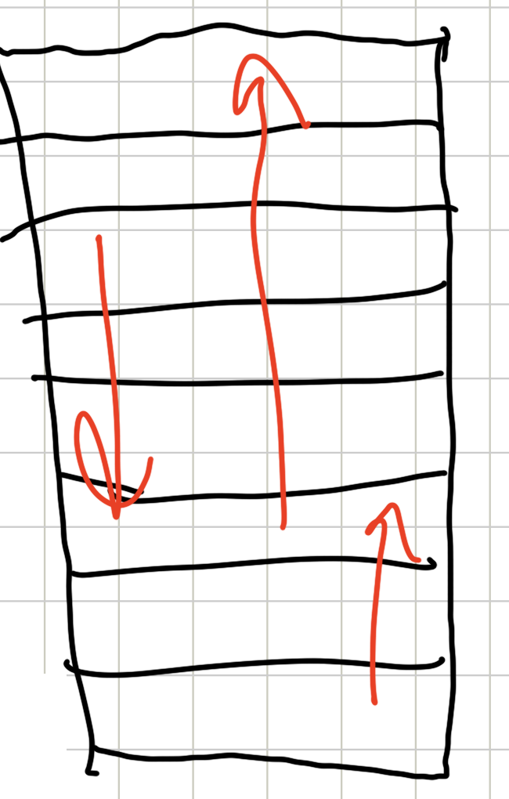

**Акцент лектора:** интерпретацию лямбд как стрелок, показывающих, куда и насколько сильно сдвинуть документ, стоит запомнить: на ней строится следующий метод.

::: {.qa title="Вопросы из зала"}
**Почему при делении на экспоненту в $\partial C_{ij}/\partial s_i$ изменилась только степень в знаменателе?** Числитель и знаменатель делятся на $e^{-\alpha(s_i-s_j)}$. В числителе от экспоненты остаётся $e^0 = 1$, то есть просто $-\alpha$. В знаменателе единица переходит в $e^{\alpha(s_i-s_j)}$, а экспонента — в единицу. Знаменатель $1 + e^{-\alpha(s_i - s_j)}$ превращается в $e^{\alpha(s_i - s_j)} + 1$: внешне меняется только знак в степени.

**Почему в $\partial C_{ij}/\partial s_j$ в знаменателе стоит $e^{\alpha(s_i-s_j)}$, а не $e^{-\alpha(s_i-s_j)}$ — куда делся минус?** Здесь тоже два перехода сделаны сразу. Сначала получается $\alpha\, e^{-\alpha(s_i-s_j)} / (1+e^{-\alpha(s_i-s_j)})$, затем числитель и знаменатель делятся на ту же экспоненту, что и в предыдущем случае. Итоговая формула верна.

**Где прочитать вывод подробнее, с расписанными формулами?** Этими методами активно занимались в Microsoft, у них есть несколько статей — их можно найти по запросам RankNet и LambdaRank (о нём — в следующем разделе). Есть и хорошая обзорная статья.
:::

[^n8a]: Примечание составителя: точнее, во второй сумме $\lambda_{ij}$ — это лямбда пары, в которой лучший документ $d_j$, то есть $-\alpha/(1+e^{\alpha(s_j-s_i)})$. Так как производная лосса пары по скору худшего документа равна этой лямбде со знаком минус, она и входит в $\lambda_i$ с минусом. Все $\lambda_{ij}$ отрицательны, поэтому пары, где $d_i$ лучше соседа, тянут его скор вверх, а пары, где он хуже, — вниз.

## LambdaRank: оптимизация NDCG через градиент

*Таймкод: 01:59:15 · доска 16–22*

### Зачем объединять RankNet и метрику

RankNet учится правильно упорядочивать пары документов, но все пары для него одинаково важны. Метрика же, по которой мы на самом деле оцениваем выдачу, например NDCG, относится к ошибкам в разных местах выдачи по-разному. При этом, как уже говорилось в начале, оптимизировать метрики качества ранжирования напрямую нельзя: они недифференцируемы.

Отсюда цель **LambdaRank**: объединить RankNet и оптимизацию метрик ранжирования. А всё-таки, может быть, можно придумать такую функцию потерь $\bar C$, чтобы, оптимизируя её, мы оптимизировали и метрику?

Ключевое наблюдение, с которого начинается метод: **сама $\bar C$ нам не нужна, достаточно её производной**. Градиентным методам функция потерь в явном виде ни к чему: чтобы делать шаги, нужно знать только градиенты. В прошлом разделе мы видели, что у RankNet градиент лосса по скору документа равен $\lambda_i$. Значит, можно попробовать сразу придумать «правильные» лямбды, не записывая сам лосс. Остаётся одна проблема: произвольный набор чисел вовсе не обязан быть градиентом какой-то функции. Достаточное условие на этот счёт даёт лемма Пуанкаре.

### Лемма Пуанкаре

Это классический результат теории полей. В общем виде он формулируется на языке дифференциальных операторов векторного анализа, но нам хватит такой формы.

**Лемма Пуанкаре.** Пусть функции $f_1, \dots, f_n : \mathbb{R}^n \to \mathbb{R}$ (их столько же, сколько аргументов) таковы, что

1. они дифференцируемы;
2. $\dfrac{\partial f_j}{\partial x_i} \equiv \dfrac{\partial f_i}{\partial x_j}$ для всех $i, j$.

Тогда существует функция $F$, для которой $\dfrac{\partial F}{\partial x_i} = f_i$ при всех $i$.

На пальцах условие читается так: берём любые две функции из набора и дифференцируем каждую по аргументу с индексом другой. Если такие «перекрёстные» производные всегда совпадают, то весь набор $f_1, \dots, f_n$ — это частные производные одной функции $F$, то есть её градиент. Для нас $f_i$ будут лямбдами, $x_i$ — скорами $s_i$, а $F$ — тем самым лоссом $\bar C$, который мы не хотим выписывать явно.

### Изменение метрики при перестановке пары

Теперь нужно встроить в лямбды информацию о метрике. Пусть $Z(q, \hat y)$ — значение метрики $Z$ (например, NDCG) для запроса $q$, когда документы отранжированы по предсказаниям $\hat y$. Иначе говоря, есть запрос и набор документов к нему, мы отсортировали документы по предсказаниям модели и посчитали по этой выдаче метрику.

Введём вспомогательное предсказание, в котором два документа обменялись скорами:

$$
\hat y_{ij}(q,d)=\begin{cases}\hat y(q,d_i), & d=d_j,\\ \hat y(q,d_j), & d=d_i,\\ \hat y(q,d), & \text{иначе}.\end{cases}
$$

Документ $d_j$ получает скор документа $d_i$, а $d_i$ — скор $d_j$; остальные предсказания не трогаем. Тогда величина

$$\Delta Z_{ij} = Z(q,\hat y) - Z(q,\hat y_{ij})$$

показывает, насколько изменится метрика, если поменять местами в выдаче документы $d_i$ и $d_j$. Это и есть **$\Delta Z_{ij}$**.

Возьмём пример с пятью документами. Текущая модель ранжирует их по $\hat y$ в порядке $3, 4, 1, 5, 2$: наверху документ с идентификатором 3, за ним 4, 1, 5 и 2. По этой выдаче считаем $\text{nDCG}_1$. Порядок по $\hat y_{35}$ — $5, 4, 1, 3, 2$: документы 3 и 5 поменялись местами, остальная выдача та же. По ней считаем $\text{nDCG}_2$. Тогда

$$\Delta Z_{35} = \text{nDCG}_1 - \text{nDCG}_2.$$

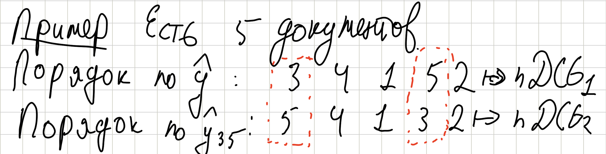

**Важно:** местами меняются не позиции 3 и 5, а документы с идентификаторами 3 и 5. Пусть документ 3 про кота, а документ 5 про собаку. Где бы они ни стояли в выдаче, мы меняем местами именно кота и собаку.

### Новые лямбды

Вспомним лямбду RankNet для пары, в которой $d_i$ лучше $d_j$:

$$\lambda_{ij} = -\frac{\alpha}{1+e^{\alpha(s_i-s_j)}},$$

где $s_i$ — скор модели на документе $i$, а $\alpha$ — параметр сигмоиды. Идея LambdaRank — домножить её на модуль изменения метрики:

$$\lambda_{ij} = -\frac{\alpha}{1+e^{\alpha(s_i-s_j)}}\cdot|\Delta Z_{ij}|.$$

Лямбды по документам собираются в точности так же, как в RankNet, меняются только сами $\lambda_{ij}$:

$$\lambda_i = \sum_{j:\ d_i\ \text{лучше}\ d_j}\lambda_{ij} \;-\; \sum_{j:\ d_i\ \text{хуже}\ d_j}\lambda_{ij}.$$

### Почему это градиент какого-то лосса

Чтобы применить лемму Пуанкаре, понадобятся два вспомогательных факта.

**Утверждение 1.** $\Delta Z_{ij} = \Delta Z_{ji}$.

Почему? Разница между $\Delta Z_{ij}$ и $\Delta Z_{ji}$ может быть только в предсказаниях $\hat y_{ij}$ и $\hat y_{ji}$, а это одно и то же: поменять местами кота и собаку ровно то же самое, что поменять местами собаку и кота. Значит, и метрика после перестановки получается одна и та же.

**Утверждение 2.** Если в выражении для лямбды поменять индексы местами и продифференцировать по «другому» скору, получится то же самое:

$$\frac{\partial}{\partial s_i}\left[-\frac{\alpha}{1+e^{\alpha(s_i-s_j)}}\right]=\frac{\partial}{\partial s_j}\left[-\frac{\alpha}{1+e^{\alpha(s_j-s_i)}}\right].$$

Это вспомогательный факт, который проверяется прямой арифметикой; доказывать его здесь не будем.

Из леммы Пуанкаре и этих двух утверждений следует

**Теорема.** Существует функция $\bar C$, для которой при всех $i$

$$\frac{\partial \bar C}{\partial s_i} = \lambda_i.$$

Доказательство мы опустим[^n9a]. Важен вывод. В RankNet лосс был определён явно, и мы вычисляли, что $\partial Q/\partial s_i = \lambda_i$. Теперь лосс явно не определён, но мы знаем, что он существует и его градиенты — ровно наши новые лямбды. А раз градиентному спуску нужны только градиенты, можно обучать модель, используя одни $\lambda_i$, и формулу для $\bar C$ вообще не выписывать.

[^n9a]: Примечание составителя: условие леммы здесь — симметрия $\partial\lambda_i/\partial s_j = \partial\lambda_j/\partial s_i$. Множитель $|\Delta Z_{ij}|$ зависит от скоров только через порядок документов, поэтому при дифференцировании его считают константой; утверждение 1 гарантирует, что этот множитель одинаков в обеих частях равенства, а утверждение 2 обеспечивает симметрию оставшейся части. Подробно эти выкладки разобраны в статьях Microsoft о RankNet и LambdaRank (например, в обзоре C. Burges «From RankNet to LambdaRank to LambdaMART: An Overview»).

### Смысл: стрелки, длина которых измерена метрикой

Пока может показаться, что мы просто взяли какие-то лямбды, домножили их на какие-то дельты и получили формальный вывод неизвестно зачем. Смысл же такой: **мы дополнительно взвешиваем каждую пару на то, насколько она важна с точки зрения метрики**.

Вспомним картинку со стрелками из предыдущего раздела. У каждого документа выдачи есть стрелка $\lambda_i$: знак показывает, в какую сторону мы хотим сдвинуть документ, абсолютное значение — насколько сильно. Но в RankNet это «насколько сильно» понималось в смысле оптимизации лосса RankNet. LambdaRank «подхачивает» стрелки так, чтобы их длина показывала, насколько сильно хочется передвинуть документ именно с точки зрения целевой метрики. Если перестановка пары сильно меняет NDCG, стрелки у этой пары длинные; если метрика от неё почти не меняется — короткие.

### Замечания: эмпирический факт и LambdaLoss

**Акцент лектора:** интуиция со стрелками — это всё-таки интуиция, а не формальное доказательство. Поэтому правильная формулировка такая: **эмпирический факт — такая оптимизация оптимизирует целевую метрику**. И это очень интересный результат: обучение по «подправленным» лямбдам на практике действительно оптимизирует NDCG.

Можно ли превратить этот эмпирический факт в нечто более честное? Оказывается, да. Более формальный подход, основанный примерно на той же идее, называется **LambdaLoss**. Он опирается на модель Плакетта–Люса, с помощью которой мы задавали вероятности на перестановках через последовательное вытаскивание документов, как подарков из мешка, и на **EM-алгоритм**. EM-алгоритм многим знаком как подход к кластеризации, но вообще это целое семейство методов байесовского подхода к машинному обучению. Если правильно записать вероятностную постановку задачи на перестановках и применить к ней EM-алгоритм, получается метод, очень похожий на LambdaRank, но с некоторыми модификациями, и более честный с точки зрения теории. Подробно разбирать LambdaLoss здесь не будем: это направление для тех, кому интересно копнуть глубже.

## Ранжирование градиентным бустингом

*Таймкод: 02:24:30 · слайды 20 · доска 22–29*

До сих пор мы рассуждали так, будто ранжирующая модель — нейросеть с обучаемыми весами: считаем лосс, берём его градиенты по весам и делаем шаг. На практике в качестве ранжирующей модели очень часто используют **градиентный бустинг** — ансамбль решающих деревьев, где каждое следующее дерево исправляет ошибки уже построенных. Сегодня это стандартный бейзлайн для ранжирования, причём такой, который довольно сложно побить. Поэтому стоит отдельно разобрать, как всё сказанное о RankNet и LambdaRank переносится на деревья.

LambdaRank- и RankNet-подобные методы действительно часто применяют к градиентным бустингам. В двух самых популярных библиотеках, **XGBoost** и **CatBoost**, уже есть встроенные механизмы для обучения ранкера на такие лоссы, так что реализовывать их вручную не нужно. Как это выглядит в коде, разбирается на семинаре; здесь посмотрим, что происходит внутри.

### Лямбды как таргеты для деревьев

Вспомним главный результат про LambdaRank: существует лосс $\bar C$, для которого

$$\frac{\partial \bar C}{\partial s_i} = \lambda_i,$$

где $s_i$ — предсказание модели на объекте $i$, а $\lambda_i$ — лямбда-градиент этого объекта. Явного вида $\bar C$ мы не знаем, но знаем его производные по предсказаниям.

Теперь вспомним, как устроен обычный, «ванильный» градиентный бустинг. Очередное дерево в нём — это регрессионное дерево, которое учится предсказывать производную лосса по предсказанию модели на конкретном объекте (точнее, антиградиент). Градиент по весам здесь вообще не нужен: бустингу нужны только производные по предсказаниям на объектах. Но именно это лямбды и дают.

**Важный вывод:** $\lambda_i$ — это просто таргет для построения очередного дерева на объекте $i$. Лосс в явном виде бустингу не нужен, достаточно лямбд — ровно как и в нейросетевом случае.

### Значения в листьях: шаг метода Ньютона

В бустингах обычно не только строят очередное дерево, но и отдельно подбирают **значения в листьях** — числа, которые дерево выдаёт для всех объектов, попавших в данный лист. Это можно делать по-разному. Самый простой способ — усреднить таргеты объектов листа. Более продвинутый и распространённый способ — сделать один шаг **метода Ньютона**. Напомним, что это метод оптимизации второго порядка: он использует и первую, и вторую производную функции. Один шаг метода Ньютона часто оказывается лучше, чем много шагов градиентного спуска. Чтобы сделать такой шаг, посчитаем обе производные.

**Первая производная.** Распишем $\lambda_i$ через лямбды пар, как раньше:

$$\frac{\partial \bar C}{\partial s_i} = \lambda_i = \sum_{j:\, i \succ j} \lambda_{ij} - \sum_{j:\, i \prec j} \lambda_{ij} = \sum_j \lambda_{ij}\, O_{ij},$$

где запись $i \succ j$ означает, что $d_i$ лучше $d_j$. Чтобы свернуть две суммы в одну, введён множитель

$$O_{ij} := \mathbb{I}\{d_i \text{ лучше } d_j\} - \mathbb{I}\{d_i \text{ хуже } d_j\},$$

который равен $+1$, если $d_i$ лучше $d_j$, и $-1$, если хуже. Подставим лямбду пары из LambdaRank — лямбду RankNet, домноженную на изменение метрики $|\Delta Z_{ij}|$:

$$\frac{\partial \bar C}{\partial s_i} = -\sum_j O_{ij}\, \alpha\, \frac{1}{1+e^{\alpha(s_i - s_j)}}\, |\Delta Z_{ij}|.$$

Дробь здесь — та же сигмоида, что и в RankNet. Обозначим её отдельно:

$$\rho_{ij} := \frac{1}{1+e^{\alpha(s_i - s_j)}}.$$

Тогда первая производная записывается компактно:

$$\frac{\partial \bar C}{\partial s_i} = -\sum_j \alpha\, O_{ij}\, \rho_{ij}\, |\Delta Z_{ij}|.$$

Здесь $\alpha$ — параметр масштаба сигмоиды из RankNet, а $|\Delta Z_{ij}|$ — то, насколько изменится метрика (например, NDCG), если поменять местами документы $i$ и $j$, то есть вес пары с точки зрения метрики.

**Вторая производная.** Понадобится вспомогательное утверждение — известное свойство сигмоиды:

$$\frac{\partial \rho_{ij}}{\partial s_i} = -\alpha\, \rho_{ij}\, (1-\rho_{ij}).$$

Продифференцируем первую производную ещё раз по $s_i$. Множители $\alpha$, $O_{ij}$ и $|\Delta Z_{ij}|$ от $s_i$ не зависят и выносятся как константы, дифференцировать нужно только $\rho_{ij}$. Заменяем $\rho_{ij}$ на её производную: минус из этой производной сокращается с минусом перед суммой, второй множитель $\alpha$ превращает $\alpha$ в $\alpha^2$, а вместо $\rho_{ij}$ появляется $\rho_{ij}(1-\rho_{ij})$:

$$\frac{\partial^2 \bar C}{\partial s_i^2} = \sum_j \alpha^2\, \rho_{ij}(1-\rho_{ij})\, |\Delta Z_{ij}|\, O_{ij}.$$

**Переход к листу.** Пока мы считали производные по предсказанию на одном объекте. Но настраивать нужно значение листа, общее для многих объектов. Пусть в лист $n$ попало множество объектов $R_n$, и пусть $x$ — предсказание в этом листе: у всех объектов листа оно одно и то же. Тогда производная по $x$ — это сумма производных по предсказаниям всех объектов листа:

$$\frac{\partial \bar C}{\partial x} = \sum_{i \in R_n} \frac{\partial \bar C}{\partial s_i} = -\sum_{i \in R_n} \sum_j \alpha\, |\Delta Z_{ij}|\, \rho_{ij}\, O_{ij},$$

$$\frac{\partial^2 \bar C}{\partial x^2} = \sum_{i \in R_n} \sum_j \alpha^2\, \rho_{ij}(1-\rho_{ij})\, |\Delta Z_{ij}|\, O_{ij}.$$

Почему здесь появляется сумма по листу — тонкий момент. Возьмём функцию двух аргументов $f(x, y)$ и определим функцию одного аргумента $g(z) := f(z, z)$, то есть подставим в $f$ одно и то же число дважды. По теореме о производной сложной функции

$$\frac{dg}{dz} = \frac{\partial f}{\partial x}\Big|_{(z,z)} + \frac{\partial f}{\partial y}\Big|_{(z,z)}.$$

С лоссом происходит ровно то же самое: аргументы $\bar C$ — разные предсказания $s_i$, а мы вместо всех $s_i$ из листа подставляем одно число $x$. Поэтому производная по $x$ равна сумме частных производных по этим $s_i$. Для второй производной рассуждение то же.

**Шаг Ньютона.** Метод Ньютона делает шаг, равный градиенту со знаком минус, делённому на вторую производную. Новое значение в листе:

$$x' = -\frac{\partial \bar C / \partial x}{\partial^2 \bar C / \partial x^2} = \frac{\sum_{i \in R_n} \sum_j \alpha\, |\Delta Z_{ij}|\, \rho_{ij}\, O_{ij}}{\sum_{i \in R_n} \sum_j \alpha^2\, \rho_{ij}(1-\rho_{ij})\, |\Delta Z_{ij}|\, O_{ij}}.$$

Это и есть значение, которое дерево будет выдавать для объектов листа $n$.[^n10a]

### Ньютон по всем листьям сразу и лоссы CatBoost

Выше каждый лист перенастраивался отдельно: учитывалась только вторая производная по его собственному значению. Но можно точно так же посчитать вторые производные по разным парам листьев,

$$\frac{\partial^2 \bar C}{\partial x_i\, \partial x_j},$$

для всех листьев $x_i$ и $x_j$. Тогда шаг Ньютона делается одновременно во всех листьях. Вместо одного числа во знаменателе появляется матрица вторых частных производных — **гессиан**, и её нужно обращать.

На этом различии построены пары ранжирующих лоссов в CatBoost: **PairLogit** и **PairLogitPairwise**, а также **YetiRank** и **YetiRankPairwise**. Это самые часто используемые лоссы для ранжирования в CatBoost, своего рода священный грааль. Разницу между PairLogit и PairLogitPairwise понимают довольно немногие. Она состоит в том, что значения в листьях в этих вариантах настраиваются по-разному.[^n10b] Как этими лоссами пользоваться на практике, разбирается на семинаре.

### Итоги темы

Подведём итоги всего разговора о ранжировании. Задача ранжирования ставится в одном и том же виде для разных применений — рекомендательных систем, поиска, RAG. Различаются признаки модели, архитектуры и таргеты ранжирования. Подходы к обучению ранжированию делятся на поточечный, попарный и списочный: они различаются тем, какие данные о правильном ранжировании модель получает на входе. В попарном подходе обычно используют RankNet-подобные лоссы, и их адаптации есть в разных библиотеках, в том числе в градиентных бустингах. В списочном подходе частый выбор — LambdaRank: он добавляет к градиенту веса, соответствующие важности пары с точки зрения метрики ранжирования.

::: {.qa title="Вопросы из зала"}
**Нет ли во второй производной лишнего множителя $O_{ij}$ в конце?** Нет. $O_{ij}$ был уже в первой производной. При повторном дифференцировании по $s_i$ он никуда не девается: как и $\alpha$ с $|\Delta Z_{ij}|$, от $s_i$ он не зависит и выносится как константа. Дифференцируется только $\rho_{ij}$: её заменяем на $-\alpha\rho_{ij}(1-\rho_{ij})$. Минус компенсирует минус перед суммой, из второго $\alpha$ получается $\alpha^2$, вместо $\rho$ стоит $\rho(1-\rho)$, а $|\Delta Z_{ij}|$ и $O_{ij}$ остаются как были.
:::

[^n10a]: Примечание составителя: выкладки здесь упрощены. Для пар с $O_{ij} = -1$ аргумент сигмоиды по смыслу должен быть $s_j - s_i$, а не $s_i - s_j$. Если это учесть, множитель $O_{ij}$ во второй производной исчезает: она становится суммой неотрицательных слагаемых $\alpha^2\rho_{ij}(1-\rho_{ij})|\Delta Z_{ij}|$ и не может обнулиться из-за взаимного сокращения слагаемых. Именно в таком виде шаг Ньютона для листьев записан у Burges, «From RankNet to LambdaRank to LambdaMART».

[^n10b]: Примечание составителя: из рассуждения выше следует такая трактовка: в вариантах с суффиксом Pairwise значения листьев подбираются с учётом смешанных вторых производных между листьями, то есть совместным шагом Ньютона с гессианом, а в базовых вариантах — по каждому листу отдельно. Прямо эта связь не проговаривалась, а про YetiRank, кроме названия, ничего не было сказано.

## Главное из лекции {.unnumbered}

::: keypoints
- Ранжирование — второй этап двухэтапной схемы: из сотен–тысяч отобранных кандидатов нужно поставить наверх самое лучшее. Поиск, RAG и рекомендации ставят эту задачу одинаково — запрос $q$, кандидаты $D_q$, функция $f(q,d)$, — а различаются фичами и таргетом.
- Таргет в поиске обычно даёт асессорская разметка (сейчас всё чаще LLM), в рекомендациях — онлайн-сигналы пользователя, сведённые в рейтинг. Сигналы шумные, а таргет должен отвечать бизнес-целям, поэтому шкалу подбирают под продукт.
- Данные для обучения ранкера — сессии: запрос, показанные документы и их рейтинги. Документы сравниваются только внутри одной сессии.
- Качество измеряют NDCG: DCG складывает рейтинги с дисконтом $1/\log_2(i+1)$ по позиции, IDCG — тот же DCG для идеального порядка, NDCG = DCG / IDCG $\in [0,1]$.
- NDCG зависит только от порядка, поэтому кусочно-постоянна и не оптимизируется градиентом напрямую. Все методы обучения ранжированию так или иначе обходят эту проблему.
- Поточечный подход предсказывает рейтинг (регрессия, классификация; для порядковых меток — засечки, PRank / CORAL / CORN). Попарный (RankNet) учит правильно упорядочивать пары через сигмоиду от разности скоров и LogLoss. Списочный (ListNet, ListMLE) работает с распределением на перестановках по модели Плакетта–Люса.
- Градиент RankNet раскладывается по документам: $\partial Q/\partial s_i = \lambda_i$. Лямбды — «стрелки», которые показывают, куда и насколько сдвинуть документ в выдаче.
- LambdaRank домножает лямбды пар на $\lvert\Delta Z_{ij}\rvert$ — изменение NDCG при обмене документов местами. Сам лосс выписывать не нужно: по лемме Пуанкаре он существует, а оптимизация по таким лямбдам на практике оптимизирует метрику.
- В градиентном бустинге лямбды служат таргетами для очередного дерева, а значения в листьях подбираются шагом метода Ньютона. Отсюда ранжирующие лоссы XGBoost и CatBoost (PairLogit, YetiRank и их Pairwise-варианты).
:::

## Что подчеркнул лектор {.unnumbered}

::: emphasis
- Красная нить темы: метрики ранжирования нельзя оптимизировать напрямую, каждый метод — способ это обойти.
- Задача ранжирования — правильно отсортировать документы, а не угадать абсолютную метку. Поэтому попарные данные ценнее: на вопрос «какой из двух лучше» ответить проще, и таких данных больше.
- Шкала рейтинга из сигналов — пример, а не инструкция: какие сигналы брать и с какими весами, решает команда под продуктовую цель.
- Модели-ранкеры не нужен лосс в явном виде, достаточно его градиента по скорам. На этом построены и LambdaRank, и обучение бустингов.
- То, что LambdaRank оптимизирует NDCG, — эмпирический факт; более строгая постановка — LambdaLoss.
- Градиентный бустинг — стандартный и трудно побиваемый бейзлайн для ранжирования. Разницу между PairLogit и PairLogitPairwise в CatBoost (настройка значений в листьях) понимают немногие.
- Тест РК — 7 вопросов по материалам этой и прошлой лекции и семинара, в LMS, открыт неделю после семинара.
:::

## Стоит посмотреть в видео {.unnumbered}

::: watch
- 00:26:57–00:30:50 — расчёт DCG, IDCG и NDCG на примере сессии: удобно следить по слайдам 16–17.
- 00:47:42–00:51:48 — засечки на числовой прямой в ординальной классификации: схема рисуется на доске.
- 01:02:11–01:13:33 — вывод лосса RankNet через KL-дивергенцию и три свойства $C_{ij}$.
- 01:29:41–01:35:33 — модель Плакетта–Люса на примере трёх документов и «мешка Деда Мороза».
- 01:45:29–01:59:15 — вывод лямбд RankNet и картинка со стрелками; в конце студенты находят пропущенные шаги вывода.
- 02:00:30–02:19:00 — LambdaRank: лемма Пуанкаре, пример с перестановкой документов 3 и 5, утверждения и теорема (часть выкладок скомкана, утверждение 2 не доказано).
- 02:28:37–02:43:27 — шаг Ньютона для значений в листьях; знаки в выводе стоит сверить с первоисточником (см. сноску в последнем разделе).
:::

## Глоссарий {.unnumbered}

| Термин | Коротко |
|:--|:------------|
| **Двухэтапная схема** | Отбор кандидатов из всего каталога, затем ранжирование отобранных более сильной моделью |
| **Отбор кандидатов (retrieval)** | Первый этап: быстро достать из каталога $10^2$–$10^3$ кандидатов, не потеряв релевантное |
| **Ранжирование (ranking)** | Второй этап: упорядочить кандидатов так, чтобы наверху оказалось лучшее |
| **Ранкер** | Модель этапа ранжирования, выдающая скор для пары (запрос, документ) |
| **RAG** | Retrieval-augmented generation: LLM отвечает по фрагментам, найденным во внешней базе знаний |
| **Реранкер** | Модель, заново упорядочивающая уже отобранных кандидатов (в RAG — выбирает top-k для промпта) |
| **Функция ранжирования** | $f(q,d)$ — число, по которому сортируются документы для запроса |
| **Таргет** | Метка $y(q,d)$, задающая, какой порядок считать правильным |
| **Асессорская разметка** | Оценки релевантности пар (запрос, документ), выставленные обученными разметчиками по инструкции |
| **Онлайн-сигналы** | Логи поведения пользователя: клики, время просмотра, лайки, «поделиться», дизлайки |
| **Кликбейт** | Контент, провоцирующий клик без реальной ценности для пользователя |
| **Рейтинг $y$** | Сводный таргет из сигналов: чем сильнее реакция, тем выше |
| **Guardrail-метрики** | Метрики, которые не должны ухудшиться при улучшении основной |
| **Сессия** | Пользователь в конкретный момент, показанные ему документы и их рейтинги; аналог запроса |
| **DCG (discounted cumulative gain)** | Сумма рейтингов документов выдачи с весом $1/\log_2(i+1)$ по позиции |
| **IDCG** | DCG идеального порядка — по убыванию истинных рейтингов |
| **NDCG** | DCG / IDCG: доля от наилучшего возможного DCG, число от 0 до 1 |
| **Поточечный подход (pointwise)** | Обучение предсказывать метку каждого документа отдельно |
| **Попарный подход (pairwise)** | Обучение правильно упорядочивать пары документов |
| **Списочный подход (listwise)** | Обучение с учётом порядка всей выдачи |
| **Ординальная классификация** | Классификация с упорядоченными классами через пороги на одной числовой прямой |
| **PRank, CORAL, CORN** | Методы ординальной классификации с засечками |
| **RankNet** | Попарный метод: вероятность $P_{ij}=\sigma(\alpha(s_i-s_j))$ и LogLoss относительно истинного порядка пары |
| **KL-дивергенция** | Мера отличия одного распределения от другого; в RankNet и ListNet сводится к LogLoss / кросс-энтропии |
| **Модель Плакетта–Люса** | Распределение на перестановках: документы последовательно «вытягиваются» с вероятностью, пропорциональной скору |
| **ListNet** | Списочный метод: кросс-энтропия между top-1 распределениями по истинным меткам и по скорам |
| **ListMLE** | Списочный метод: минимизация минус логарифма вероятности идеальной перестановки |
| **$\lambda_{ij}$** | Производная лосса пары по скору документа; в LambdaRank домножается на $\lvert\Delta Z_{ij}\rvert$ |
| **$\lambda_i$** | Производная всего лосса по скору документа $i$: «стрелка» его сдвига в выдаче |
| **LambdaRank** | Метод, взвешивающий лямбды RankNet изменением метрики при перестановке пары |
| **$\Delta Z_{ij}$** | Изменение метрики (NDCG) при обмене документов $i$ и $j$ местами |
| **Лемма Пуанкаре** | Условие, при котором набор функций — градиент некоторой функции (симметрия перекрёстных производных) |
| **LambdaLoss** | Более строгая вероятностная постановка в духе LambdaRank на основе модели Плакетта–Люса и EM-алгоритма |
| **Градиентный бустинг** | Ансамбль деревьев, где каждое следующее дерево учится на антиградиенте лосса |
| **Метод Ньютона** | Метод оптимизации второго порядка: шаг — минус первая производная, делённая на вторую |
| **Гессиан** | Матрица вторых частных производных; нужна для совместного шага Ньютона по всем листьям |
| **PairLogit, YetiRank** | Ранжирующие лоссы CatBoost; варианты с суффиксом Pairwise иначе настраивают значения в листьях |
