::: {.abstract title="О чём семинар"}
Семинар продолжает лекцию «Ранжирование и метрики качества» и отвечает на практический вопрос: как понять, что рекомендательная система после изменения стала лучше. Сначала сравниваются два способа проверки — A/B-тест и офлайн-эксперимент на логах, — и объясняется, почему офлайн-замер смещён и как совмещать его с A/B. Затем метрики раскладываются по уровням (бизнес-метрики, онлайн-прокси, офлайн-метрики) и подробно разбираются офлайн-метрики: метрики ретривала (Precision@K, Recall@K, HitRate@K), метрики ранжирования (MAP, NDCG, MRR, ROC-AUC) и контекстуальные метрики «здоровья» системы (Coverage, Diversity, Novelty, Serendipity, Popularity bias), а также простые рекомендательные бейзлайны. Вторая часть — практика по ноутбуку семинара: на MovieLens 100K метрики реализуются своими руками, строятся простые признаки и сравниваются бейзлайны, CatBoostRanker, XGBRanker и небольшая нейросеть с функцией потерь в стиле LambdaRank. Для чтения нужны материалы лекции 2 (NDCG, попарный подход, RankNet, LambdaRank) и основы Python, pandas и градиентного бустинга.

Первые три четверти семинара идут по слайдам, последняя четверть — беглый обзор ноутбука; в конспекте ноутбук изложен полностью, включая части, которые на семинаре пропустили. Вопросов из чата много; содержательные вплетены в разделы и выделены серыми блоками — их можно пропустить при беглом чтении. Схемы со слайдов приведены прямо в тексте. Сноски с пометкой «Прим. составителя» — пояснения, которых не было на семинаре.
:::

## Как понять, что рекомендации стали лучше: A/B-тест и офлайн-эксперимент

*Таймкод: 00:00:56 · слайды 2–7*

Рекомендательную систему постоянно хочется улучшать: менять модель, подбирать гиперпараметры, добавлять признаки. Но сразу возникает вопрос: как понять, что после изменения система стала лучше, а не хуже? В рекомендациях ответить на него сложнее, чем во многих других областях. В NLP, например, есть бенчмарки — публичные или внутренние, приватные. Новую модель прогоняют на них, и хороший результат на бенчмарке уже неплохое свидетельство её качества. В рекомендациях универсального бенчмарка нет: качество зависит от конкретного сервиса, его пользователей и того, как они реагируют на выдачу.

Поэтому, как это обычно бывает в продакшен-задачах, подходы к измерению качества делятся на две группы: онлайн-эксперименты (A/B-тесты) и офлайн-эксперименты.

### A/B-тест

**A/B-тест** на пальцах устроен так. Мы хотим выпустить новую схему модели. Части пользователей показываем старую систему, другой части — новую, а затем сравниваем поведение пользователей в двух группах. Важно, что группы работают параллельно, в одно и то же время: тогда на обе группы одинаково действуют внешние эффекты, зависящие от времени, и разница в поведении объясняется именно изменением.[^n1a]

У A/B-теста три серьёзных минуса.

1. **Это долго.** Чтобы честно понять, хороша ли новая модель, эксперимент приходится держать порядка недели, иногда меньше, иногда больше — в зависимости от метрики.
2. **Это риск.** Эксперимент идёт на реальных людях. Если изменение плохое, мы фактически выкатываем плохое изменение на часть аудитории, и у неё портится опыт пользования сервисом.
3. **Нужна инфраструктура.** В большой системе одновременно идёт много экспериментов: несколько инженеров параллельно проверяют разные механики. Нужна инфраструктура сплитов, распределяющая трафик, и приходится решать, можно ли ставить разные эксперименты на одних и тех же пользователях, не мешают ли они друг другу.

Зато у A/B-теста есть главный плюс: мы прямо в продакшене измеряем те метрики, которые нам действительно нужны, то есть бизнес-эффект изменения.

### Офлайн-эксперимент

**Офлайн-эксперимент**, или **офлайн-замер**, — это подсчёт метрик на исторических данных, то есть на логах прошлых взаимодействий пользователей. Он намного быстрее: минуты или часы вместо недель. Поэтому экспериментов можно провести гораздо больше, а прод при этом не трогаем и пользователями не рискуем. Нужны только логи и код подсчёта метрик. Минус в том, что результат получается приближённым и смещённым: мы по-честному не знаем, как именно новая модель повлияет на пользователя в продакшене.

| | A/B-тест | Офлайн-эксперимент |
|:--|:--|:--|
| Как устроен | новая версия на части трафика | метрики на исторических логах |
| Скорость | недели на один эксперимент | минуты или часы |
| Риск | плохой опыт у реальных людей | прод не трогаем |
| Достоверность | прямо измеряем бизнес-эффект | приближённо, со смещением |
| Что нужно | инфраструктура сплитов и трафик | логи и код подсчёта метрик |

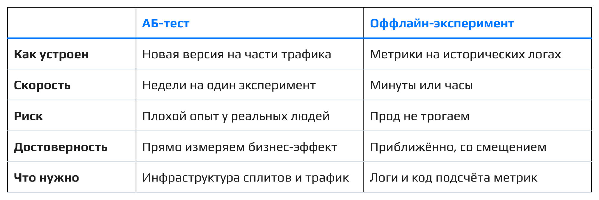

### Как устроен офлайн-замер

Классическая схема такая. Берём логи, например, за 7 дней. Дни 1–6 — период обучения, день 7 — тест. На данных первых шести дней обучаем модели: скажем, ранжирующую модель вроде LambdaRank с одними гиперпараметрами и с другими. Затем на седьмом дне смотрим, в каком порядке старая модель ранжирует документы для пользователя и в каком порядке их ранжирует для того же пользователя новая. Два порядка сравниваем метрикой ранжирования, например NDCG@5 (подробно она разбирается в разделе о метриках ранжирования).

**Акцент лектора:** айтемы в таком сравнении — это те айтемы, с которыми пользователь реально взаимодействовал в день 7. Мы берём реальные взаимодействия из логов и смотрим только на то, как новая модель **переранжировала** тот же самый набор.

Пример. Старая модель показала пользователю ленту: 1 — клип (клик), 2 — трек, 3 — видео (клик), 4 — пост, 5 — товар. Её NDCG@5 = 0.92. Новая модель расставила те же айтемы иначе: 1 — видео (клик), 2 — клип (клик), 3 — товар, 4 — трек, 5 — пост. Оба кликнутых айтема оказались наверху, и NDCG@5 = 1.00.[^n1b] Новая модель лучше на тех же логах, хотя пользователи её ни разу не видели.

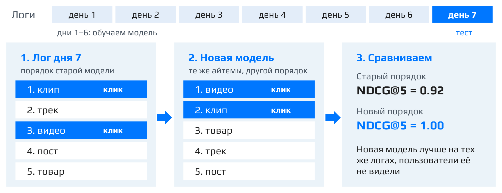

### Где офлайн-замер ошибается

У этой схемы есть принципиальное ограничение: фидбек есть только на то, что показала старая модель. Когда мы меняем схему ранжирования или рекомендаций вообще, в выдаче могут появиться новые документы, которых раньше никто не показывал, — например, концерты или подкасты. Офлайн-замер этого никак не отловит.

Пусть новая модель выдала: 1 — концерт, 2 — видео (клик), 3 — клип (клик), 4 — подкаст, 5 — трек. Концерт и подкаст пользователю не показывали, реакции на них в логах нет, и при подсчёте метрики они считаются нулём. В результате NDCG@5 = 0.69 против 0.92 у старой модели, хотя, возможно, концерт пользователю понравился бы больше всего. Получается, что в офлайне находить новое невыгодно, а копировать поведение старой модели выгодно. Отсюда и расхождения офлайн-результатов с A/B-тестами.

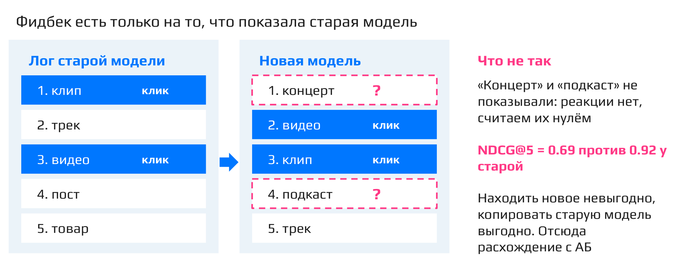

### Как совмещать офлайн и A/B

Классический подход: сначала массированно проводим офлайн-эксперименты (перебор гиперпараметров, разных моделей), отбрасываем явно слабые идеи, не рискуя пользователями, а затем один или несколько финальных кандидатов отправляем в A/B-тест — трафик и время на эксперименты ограничены. Офлайн — быстрый и дешёвый фильтр, A/B — финальное решение.

**Важный вывод:** без A/B-тестирования ничего достоверно сказать нельзя.

Поэтому важное свойство системы, за которым стоит следить, — сходятся ли офлайн- и онлайн-замеры. Довольно полезно иметь в своём сервисе набор офлайн-метрик, про которые эмпирически показано, что они обычно согласуются с продакшеном: если модель лучше по такой метрике, она должна выигрывать и в тесте. Проверяют это на истории прошлых экспериментов. Если офлайн и A/B расходятся, нужно искать причину: смещение логов, неудачная метрика или разные цели. Правим метрику, а не игнорируем тест.

::: {.qa title="Вопросы из зала"}
**Почему инфраструктура A/B-тестов — проблема?** Поддерживать много экспериментов одновременно сложно. Пусть эксперимент берёт 5% пользователей на старую схему и 5% на новую, итого 10%. Если в компании 20 человек и каждый хочет «откусить» по 10%, нужно 200% пользователей, а есть только 100%. Выход — пересекать эксперименты, то есть ставить их на одних и тех же пользователях, если они затрагивают разные, непересекающиеся части системы. Классический пример: дизайнер экспериментирует с цветом кнопки, а это слабо пересекается с ранжированием.

**Что такое A/A-тест?** **A/A-тест** — это A/B-тест, в котором обе группы получают одно и то же. Его проводят, чтобы убедиться, что при заведомом отсутствии изменений метрики не прокрасятся и эксперимент покажет, что изменений нет.

**Что использовать: классический A/B, CUPED или bootstrap?** Зависит от схемы эксперимента и конкретной метрики: **CUPED** подходит для одних метрик, bootstrap применяют в других ситуациях. Это тема отдельного курса по A/B-тестированию.

**Не стоит ли брать в A/B только особых пользователей, например с большим временем просмотра, чтобы снизить риск?** Зависит от того, что измеряем. Если метрика — среднее время просмотра на платформе, в ней ничего не сказано про «только активных», значит, внедрять и мерить нужно на всех. Если же хотим прицельно проверить технологию на холодных пользователях с малым числом взаимодействий, метрику разумно считать именно на них. Вообще полезно смотреть метрики в разрезе прогресса пользователя: это даёт дополнительную информацию.

**Офлайн-метрики занижают результат, если появился ещё не показанный айтем. Как решить расхождение с A/B?** Хорошего способа нет. Это и есть смещение офлайн-замера: его результаты — прикидка, а решение всё равно принимается по A/B-тесту.

**Как не потерять деньги, если тестовая группа показывает просадку?** Статистически корректно заранее зафиксировать длительность теста (исходя из **MDE**, minimum detectable effect — минимального детектируемого эффекта), честно её выдержать и только потом смотреть результаты. На практике часто подглядывают: если через несколько часов видна просадка денег, например на 10%, это скорее всего не случайность, и эксперимент останавливают. Это инженерный, а не статистический ответ.

**Сколько A/B-тестов можно крутить одновременно без взаимных искажений?** Совсем без искажений — только один эксперимент на пользователя: при пересечении какие-то искажения будут в любом случае. На практике допустимое число подбирают эмпирически, в зависимости от того, насколько эксперименты пересекаются и сколько их. Цвет кнопки и ранжирование, например, пересекаются слабо.

**Принимать решение только по p-value или ещё по размеру эффекта и доверительному интервалу?** Всё это взаимосвязано. Чтобы сузить доверительный интервал и уменьшить MDE, эксперимент нужно держать больше дней. Если же интервал широкий, p-value с высокой вероятностью окажется выше порога и эффект не прокрасится.
:::

[^n1a]: Примечание составителя: в речи обоснование параллельного запуска звучит как «чтобы нивелировать эффект новизны». Обычно параллельность групп нужна, чтобы исключить сезонность и другие внешние факторы, зависящие от времени; эффект новизны (временный всплеск интереса к изменению) — отдельное явление, от которого параллельный запуск не защищает.

[^n1b]: Примечание составителя: проверка по формуле $\mathrm{DCG} = \sum_i rel_i / \log_2(i+1)$. У старого порядка клики на позициях 1 и 3: $\mathrm{DCG} = 1 + 1/\log_2 4 = 1.5$; идеальный порядок ставит оба клика на позиции 1 и 2: $\mathrm{IDCG} = 1 + 1/\log_2 3 \approx 1.631$; $\mathrm{NDCG} = 1.5/1.631 \approx 0.92$. У нового порядка клики уже на позициях 1 и 2, поэтому NDCG = 1.


## Виды метрик: бизнес-метрики, прокси-метрики, классические метрики

*Таймкод: 00:20:20 · слайды 8–13*

### Три уровня метрик

На лекции про ранжирование уже возникала трудность: NDCG нельзя оптимизировать напрямую, поэтому приходится придумывать обходные пути вроде LambdaRank. Но это переход второго уровня. Есть и переход первого уровня: на самом деле нас интересует вовсе не NDCG, а **бизнес-метрики**, то есть показатели, ближе всего стоящие к цели бизнеса: retention, время в сервисе, выручка. Их напрямую оптимизировать тем более нельзя.

Поэтому метрики удобно разложить по трём уровням. Чем выше уровень, тем ближе метрика к цели бизнеса; чем ниже, тем проще её мерить и оптимизировать.

- Бизнес-метрики мерятся только в A/B-тесте, и отклик на изменение виден через недели.
- Онлайн-прокси (CTR, досмотры, лайки) тоже мерятся в A/B-тесте, но отклик виден уже через дни.
- Офлайн-метрики (например, NDCG@K и другие, о которых пойдёт речь дальше) считаются на логах за минуты.

Цель — бизнес-метрики, но оптимизировать их напрямую нельзя. Значит, выбирать нужно такие офлайн-метрики, которые с бизнес-метриками согласуются.

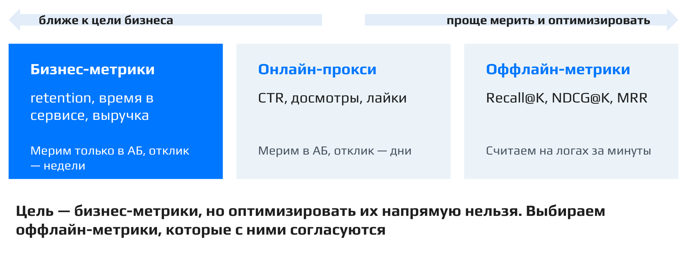

### Примеры бизнес-метрик

Типичные бизнес-метрики рекомендательного сервиса:

- **view time** — время просмотра контента пользователем за день или за сессию;
- **CTR** (click-through rate, click-rate) — доля кликов среди показов: клики / показы;
- **like-rate** — лайки / показы;
- **dislike-rate** — дизлайки и скрытия «не интересно» / показы. Это «отрицательная» метрика: в отличие от остальных, она должна падать;
- **buy-rate** — для онлайн-магазина: в какой доле случаев пользователь купил то, что ему порекомендовали, то есть конверсия рекомендаций в покупку.

Более специфическая метрика — **retention**: доля пользователей, вернувшихся в течение какого-то времени (скажем, N дней) после покупки или другого взаимодействия. Это важная метрика, она показывает, насколько сильно пользователи «отваливаются»: приходят и остаются или зашли один раз, им не понравилось, и больше они не возвращаются.

**Важно:** смотреть надо на набор метрик, а не на одну. Если CTR вырос, но вместе с ним вырос и dislike-rate, это не победа.

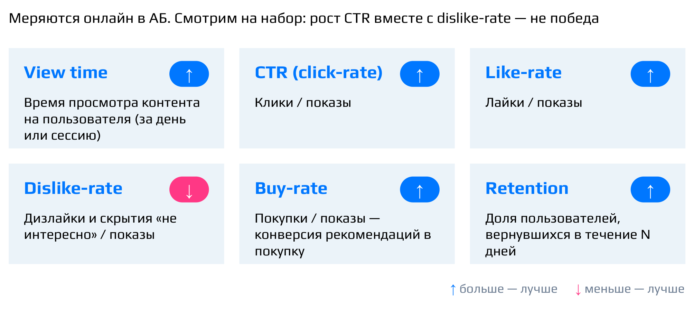

### Как выбрать техническую метрику

В A/B-экспериментах помимо бизнес-метрик используют **технические (прокси-) метрики**. Это показатели, построенные на разных типах обратной связи от пользователя. Напомним, что это за типы. **Explicit feedback** (явный отклик) — пользователь явно показал своё отношение: лайки, дизлайки, оценки, «не интересно». **Implicit feedback** (неявный отклик) — просто его поведение на сайте: клики, время просмотра, добавления в корзину, покупки, скролл. По этому поведению мы пытаемся понять, что пользователь на самом деле имел в виду.

Выбор метрики — компромисс. С одной стороны, нужно достаточно сигнала, то есть много взаимодействий. С другой — метрика должна коррелировать с бизнес-метриками. События, сильно связанные с бизнесом, ценные, но их мало. Базовых событий много, но они хуже отражают задачу.

Хорошо это видно на воронке интернет-магазина: показы → клики → просмотры карточки → добавления в корзину → покупки. Каждый следующий уровень — лишь доля предыдущего. На схеме воронка сужается равномерно, но на практике на каждом переходе остаётся несколько процентов, в лучшем случае 10–20% от предыдущего уровня. Наверху воронки много событий и слабый сигнал, внизу событий мало, зато сигнал сильный: покупка гораздо ближе к деньгам, чем показ.

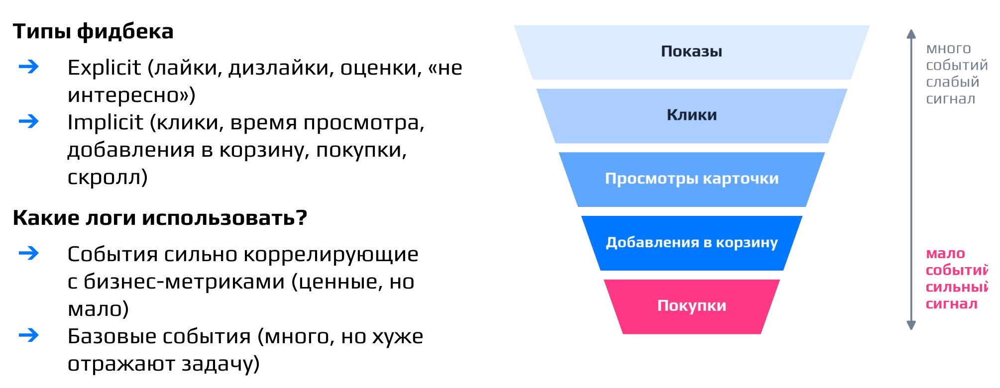

### Офлайн и онлайн вместе

Для оценки идей нужны оба подхода — и офлайн-эксперименты, и онлайн. Общий пайплайн такой: прогоняется много офлайн-экспериментов, и самые сильные кандидаты отправляются в A/B-тест. При подготовке офлайн-эксперимента нужно выбрать технические метрики, связанные с целевой бизнес-метрикой, и правильно разбить данные на обучение и валидацию.

Последний пункт довольно важен и на практике не всегда очевиден. Вернёмся к схеме офлайн-эксперимента, где дни 1–6 идут на обучение, а день 7 — на тест. Наиболее честный способ мерить качество офлайн — **time split** (разбиение по времени): модель обучается на префиксе по времени, а тестируется на последнем дне или последних днях. Представим, что тестовые данные взяли из дня 4. Тогда при обучении модель уже видела взаимодействия этого же пользователя в днях 5 и 6, то есть заглянула в будущее, чтобы предсказать, что ему понравится. Так делать некорректно: обучаться на данных из будущего нельзя.

### Классические метрики

Наконец, всем известные классические метрики классификации и регрессии — RMSE, MAE, accuracy, precision, recall — в каком-то виде тоже применимы. Вспомним поточечный (pointwise) подход: он сводит задачу ранжирования к классификации или регрессии. Например, мы учим классификатор «лайкнет / не лайкнет» и считаем для него обычные precision и recall.

Плюс таких метрик в том, что они всё ещё измеряют точность модели. Минус — они не отражают специфику рекомендаций: например, не используют знание о том, что важнее всего верх выдачи. Метрики, которые эту специфику учитывают, разбираются в следующих разделах.


## Метрики ретривала: Precision@K, Recall@K, HitRate@K

*Таймкод: 00:28:11 · слайды 14–17*

Рекомендательный пайплайн состоит из двух этапов. Сначала из огромного каталога отбирается сравнительно небольшое множество подходящих айтемов — это **ретривал (отбор кандидатов)**, он же кандидатогенерация. Затем эти кандидаты упорядочиваются на этапе ранжирования. Задачи у этапов разные, поэтому и метрики для них логично выбирать разные. Начнём с метрик, которые естественно подходят для ретривала.

### Precision@K

Все метрики этого раздела считаются внутри **одного пользователя или одной сессии**. Представим, что пользователю порекомендовали 12 айтемов, и по логам мы знаем, какие из них оказались релевантными (например, получили лайк), а какие нет. Айтемы упорядочены по скору модели. Отрежем первые $K$ позиций и посмотрим, какая доля отрезанного действительно релевантна. Это и есть **Precision@K**:

$$\text{Precision@}K = \frac{|Rel_u \cap Top_K(u)|}{K},$$

где $Rel_u$ — множество релевантных айтемов пользователя $u$, а $Top_K(u)$ — первые $K$ рекомендаций. В числителе стоит число релевантных айтемов, попавших в топ-$K$, в знаменателе — размер этого топа.

Возьмём выдачу, в которой среди первых пяти айтемов релевантны четыре. Тогда $\text{Precision@}5 = 4/5 = 0.8$. Если расширить топ до десяти и релевантных там окажется шесть, то $\text{Precision@}10 = 6/10 = 0.6$.

Название понятно и без формальных TP и FP. В классификации precision — это доля объектов, которые модель назвала единичками и которые действительно единички по ground truth. Здесь «предсказанием единичек» служит сам топ-$K$: модель как бы заявила, что эти пять айтемов позитивны, а на деле позитивными оказались четыре. Метрика считается для каждого пользователя или сессии, а затем усредняется по всем.

На этапе отбора кандидатов $K$ велико — сотни айтемов. Поэтому precision там заведомо низкий, и для ретривала важнее другая метрика.

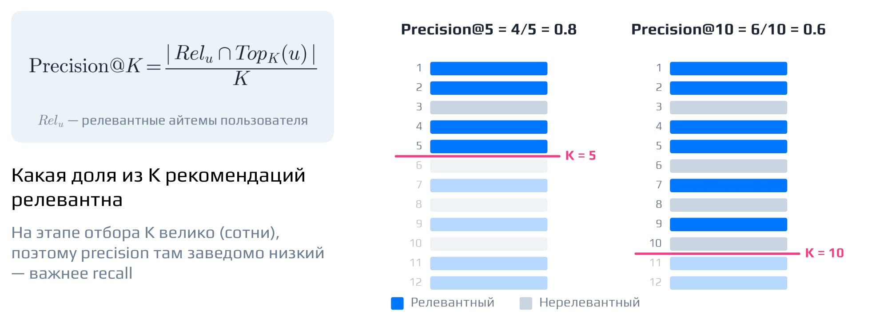

### Recall@K

**Recall@K** строится по тому же принципу: отрезаем топ-$K$. Только смотрим теперь «в другую сторону» — какую долю из всего, что на самом деле релевантно, мы нашли:

$$\text{Recall@}K = \frac{|Rel_u \cap Top_K(u)|}{|Rel_u|}.$$

Пусть в той же выдаче всего 8 релевантных айтемов. В топ-5 попали четыре из них, поэтому $\text{Recall@}5 = 4/8 = 0.5$. В топ-10 — шесть, поэтому $\text{Recall@}10 = 6/8 = 0.75$.

Здесь есть тонкий момент. При $K = 5$ и восьми релевантных айтемах, даже если весь топ-5 состоит из релевантных, получится $5/8$, а не единица. Метрика не может достичь максимума просто потому, что топ меньше числа позитивов. Поэтому иногда в знаменатель ставят минимум из $K$ и числа релевантных:

$$\text{Recall@}K = \frac{|Rel_u \cap Top_K(u)|}{\min(K,\ |Rel_u|)}.$$

**Важный вывод:** recall — главная метрика ретривала. Он показывает, сколько релевантного мы потеряли, а для отбора кандидатов это критично. Если айтем не отобрался на этом этапе, на ранжировании ему взяться неоткуда: что потеряно при отборе, ранкер уже не вернёт.

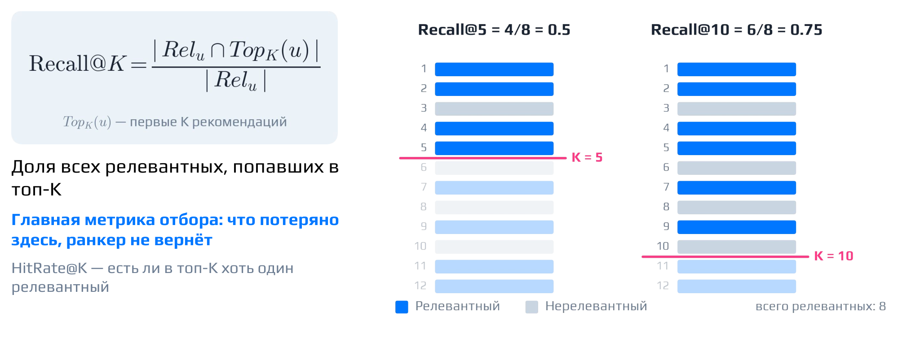

### HitRate@K

**HitRate@K** похожа на recall, но устроена ещё проще. Отрезаем топ-$K$ и смотрим, попал ли туда **хотя бы один** релевантный айтем: если да — метрика равна 1, если нет — 0.[^n3a] Она уместна, когда собрать всё релевантное не нужно, а важно, чтобы пользователю попалось хоть что-то подходящее.

### Плюсы и минусы

Precision и Recall довольно адекватны: их легко интерпретировать и легко реализовать. Недостатков два.

Первый — гиперпараметр $K$. Как его выбирать, до конца непонятно: метрика при одном $K$ не даёт общей картины для любого другого.

Второй — эти метрики **не видят порядок внутри топ-$K$**. Возьмём топ-10, в котором пять релевантных айтемов. В одной выдаче они стоят в самом верху, в другой — в самом низу, в «антитопе». Метрика в обоих случаях одинаковая. Для ретривала это совершенно не проблема: кандидаты собираются как множество и потом всё равно переранжируются. Для этапа ранжирования это плохое свойство, и для него нужны метрики, чувствительные к порядку. Им посвящён следующий раздел.

::: {.qa title="Вопросы из чата"}
**Как определяется, что айтем действительно релевантный?** Берутся просто логи. Вспомним схему офлайн-эксперимента: первые шесть дней недели идут на обучение, седьмой — на тест. Выдача, по которой считается метрика, — это реальная залогированная сессия из седьмого дня. Релевантным в ней считается, например, айтем, которому пользователь поставил лайк.

**$K$ подбирается эмпирически под задачу — когда брать 5, когда 10?** Общего ответа нет. Для ретривала самый адекватный бейзлайн — брать $K$ равным числу айтемов, которые реально отбираются на этапе кандидатогенерации.

**В каких случаях используют global time split, а в каких leave-last-out?** При **global time split** у всех пользователей одна общая граница по времени: всё, что до неё, идёт в обучение, всё, что после, — в тест. При **leave-last-out** в тест у каждого пользователя откладывается его последнее взаимодействие; в варианте leave-last-N-out — несколько последних. Почти всегда честнее глобальный сплит: он лучше эмулирует A/B-тест. Leave-last-out используют в основном ради простоты. Зато у него есть преимущество: метрика меряется на всех пользователях, а при глобальном сплите — только на тех, у кого были взаимодействия в тестовый период.

**Пользователь не может кликнуть на все релевантные айтемы — не пересмотрит же он все рекомендации YouTube. Значит, метрики занижены?** Да, занижены, но одинаково для всех моделей, так что после усреднения модели всё равно можно сравнивать. То же верно и для бизнес-метрик вроде like-rate. Пользователь мог бы лайкнуть любое из показанных ему видео, просто его внимание не зацепилось. Отсутствие фидбека ещё не означает, что айтем нерелевантен.
:::

[^n3a]: Примечание составителя: после усреднения по пользователям HitRate@K — это доля пользователей, у которых в топ-$K$ попал хотя бы один релевантный айтем.


## Метрики ранжирования: MAP, NDCG, MRR

*Таймкод: 00:40:07 · слайды 18–27*

Precision@K, Recall@K и HitRate@K отвечают на вопрос, сколько релевантного попало в топ, но почти не смотрят, в каком порядке оно там стоит. Кроме того, у Precision@K остаётся неудобный вопрос: какое K выбрать. Метрики этого раздела устроены иначе: они учитывают позиции релевантных айтемов внутри выдачи и сильнее награждают модель, если хорошее стоит ближе к началу.

### MAP: усреднённая средняя точность

Название **MAP (mean average precision)** по-русски звучит забавно: «средняя средняя точность». Точнее понимать его как «усреднённая средняя точность»: одно усреднение происходит внутри выдачи одного пользователя, второе — по пользователям.

Идея растёт прямо из проблемы выбора K. Раз непонятно, какое K брать, посчитаем precision@k сразу для всех позиций: precision@1, precision@2, …, precision@6. Затем оставим только те позиции, где стоит релевантный айтем, и усредним precision на них. Получится [**AP (average precision)**]{.gl key="AP (average precision)"} — средняя точность для одного пользователя:

$$AP@K = \frac{1}{\#\{\text{релевантных}\}}\sum_{k:\ rel_k = 1} \text{Precision@}k .$$

Здесь $rel_k$ равно 1, если айтем на позиции $k$ релевантен, и 0 иначе. Суммируем precision только по релевантным позициям и делим на число релевантных айтемов. MAP — это среднее AP по всем пользователям:

$$MAP = \frac{1}{|U|}\sum_{u \in U} AP_u .$$

Возьмём выдачу из шести айтемов, где релевантные стоят на позициях 1, 4 и 5. На этих позициях precision равен $1/1 = 1$, $2/4 = 0.5$ и $3/5 = 0.6$. Усредняем три числа:

$$AP@6 = \frac{1 + 0.5 + 0.6}{3} = 0.7 .$$

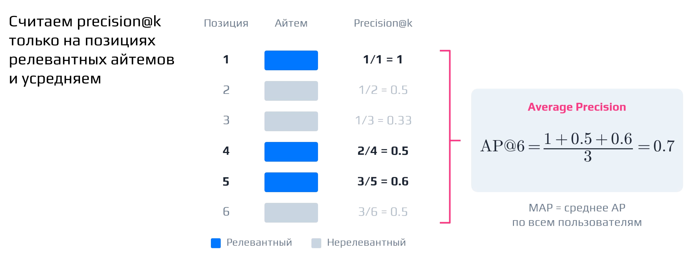

Почему усредняем только по релевантным позициям, а не по всем подряд? Это хорошо видно на двух примерах.

*Пример 1.* Всего 100 айтемов, релевантных из них три, и все три стоят в самом топе. Это идеальное ранжирование, и хочется, чтобы метрика была равна единице. Так и выходит: $AP = (1/1 + 2/2 + 3/3)/3 = 1$. Нули ниже последнего релевантного на метрику не влияют, сколько бы их ни было — хоть 97, хоть миллион.

*Пример 2.* Те же три релевантных айтема стоят на позициях 1–3, но есть ещё четвёртый, и он оказался на последней, сотой позиции. Первые три precision по-прежнему равны единице, а на сотой позиции precision равен $4/100$: среди ста айтемов четыре релевантных. Тогда

$$AP = \frac{1/1 + 2/2 + 3/3 + 4/100}{4} = 0.76 .$$

Метрика всё ещё довольно высокая, но один айтем в хвосте её заметно испортил. Член $4/100$ почти ничего не добавляет к сумме, а знаменатель вырос с 3 до 4. Если бы мы усредняли precision и по нерелевантным позициям, метрика в обоих примерах была бы заметно ниже, и даже идеальное ранжирование не давало бы единицу.

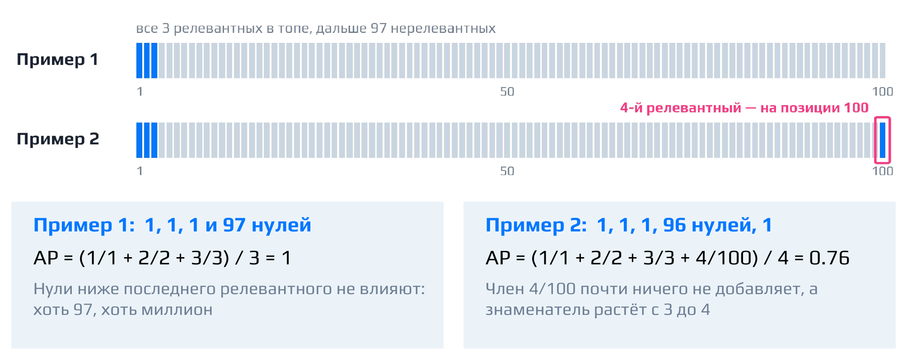

Из этого следуют свойства MAP. Айтемы в голове списка входят почти в каждый precision@k, поэтому метрика уделяет больше внимания началу выдачи. Это хорошее свойство: топ для нас важнее хвоста. MAP даёт общую картину качества, но сильно штрафует даже за один релевантный айтем в самом хвосте, как во втором примере.

**Важно:** MAP подходит только для бинарного фидбэка, когда релевантность равна 0 или 1. Если релевантность градуированная, например оценки 1, 2, 3, 4, MAP уже не подойдёт.

В реализации к семинару знаменатель AP@k — число релевантных айтемов во всём списке, а не только в первых $k$. Поэтому релевантный айтем, который не попал в топ-$k$, тоже ухудшает метрику. Если релевантных айтемов нет вовсе, AP считается равным нулю.

### NDCG: от суммы релевантностей к нормированной метрике

NDCG уже встречался в лекции «Ранжирование и метрики качества». Здесь соберём его по шагам: каждый следующий шаг исправляет недостаток предыдущего.

**Шаг 1: CG.** Самый простой способ оценить выдачу — сложить релевантности всех айтемов, попавших в топ. Получается **CG (cumulative gain)**:

$$CG@K = \sum_{k=1}^{K} rel_k ,$$

где $rel_k$ — релевантность айтема на позиции $k$. Это неплохая метрика, чем-то похожая на Precision@K: она показывает, сколько релевантного вообще попало в топ. Но порядок внутри топа она не учитывает. Пусть в списке A релевантные айтемы стоят на позициях 3–5, а в списке B — на позициях 1–3. В обоих случаях $CG = 3$, хотя в B релевантное явно стоит выше.

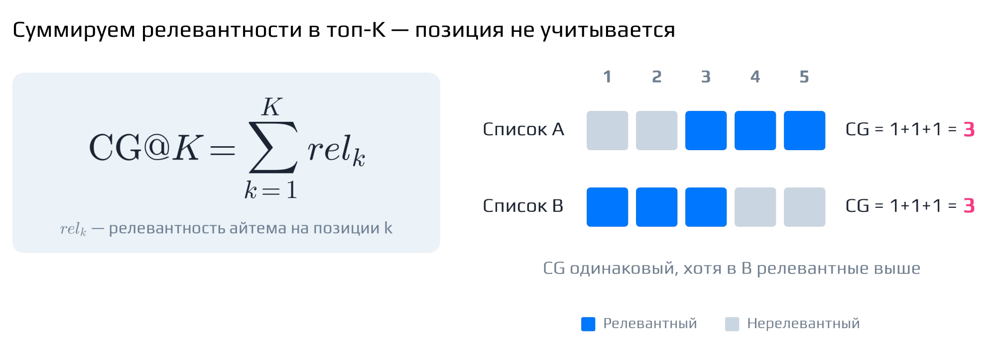

**Шаг 2: DCG.** Чтобы различить списки A и B, добавим штраф за низкую позицию: будем суммировать релевантности не просто так, а с затухающими весами. Получается **DCG (discounted cumulative gain)**:

$$DCG@K = \sum_{k=1}^{K} \frac{rel_k}{\log_2(k+1)} .$$

Вклад айтема делится на логарифм его позиции. Веса для позиций 1–5 равны 1.00, 0.63, 0.50, 0.43 и 0.39: чем ниже позиция, тем меньше вклад. Теперь $DCG_A = 1.32$, а $DCG_B = 2.13$. DCG растёт и от того, сколько релевантного попало в топ, и от того, насколько близко к началу оно стоит.

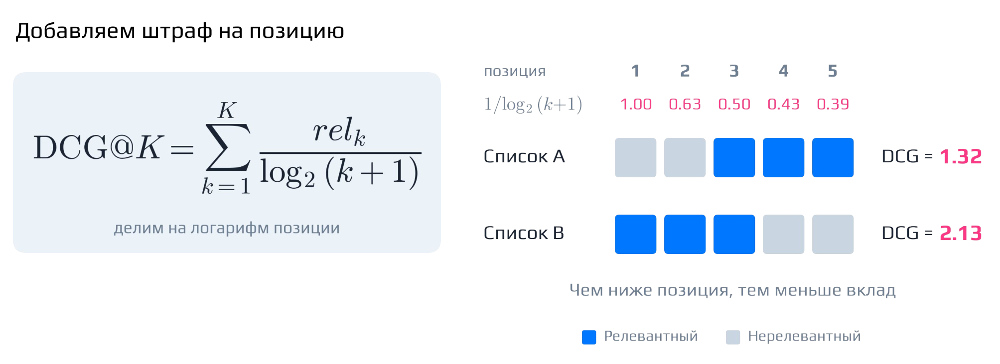

Величину, которую суммирует DCG, называют [**gain**]{.gl key="Gain"} — полезность айтема. В формуле выше gain просто равен релевантности $rel_k$. Часто релевантность предварительно преобразуют: $gain(rel) = 2^{rel} - 1$. Тогда более высокие уровни релевантности получают заметно больший вес. Например, разница между релевантностью 3 и 2 становится важнее, чем между 1 и 0. Именно такой вариант используется в реализации к семинару.

**Шаг 3: NDCG.** У DCG остаётся проблема: он смешивает два эффекта — правильность порядка и количество релевантных айтемов. Если у пользователя релевантный айтем всего один, DCG заведомо будет меньше, чем при трёх, как бы хорошо модель их ни расставила. А качество ранжирования — это именно то, насколько правильный порядок находит модель.

Поэтому посчитаем, какой наибольший DCG вообще возможен при этих же метках релевантности. Для этого отсортируем айтемы по убыванию релевантности и посчитаем DCG такой выдачи. Это **IDCG** — DCG идеального ранжирования. Нормируем на него:

$$NDCG@K = \frac{DCG@K}{IDCG@K} .$$

**NDCG** показывает, насколько реальное ранжирование далеко от идеального при тех же метках. В примере со списками A и B идеальный DCG равен 2.13. Тогда для списка A $NDCG \approx 1.32 / 2.13 \approx 0.62$, а для списка B $NDCG = 2.13 / 2.13 = 1.00$. Идеальная сортировка всегда даёт единицу. Если релевантных айтемов нет вовсе, IDCG равен нулю, и NDCG в реализации к семинару считается равным нулю.

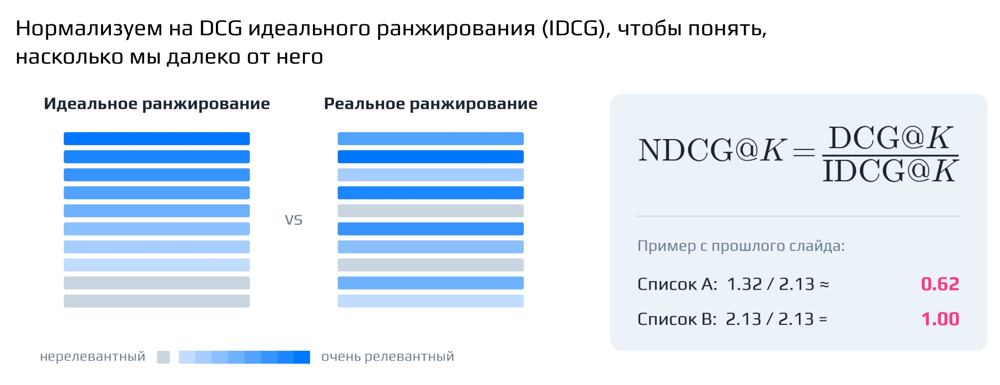

NDCG применяется часто, на практике даже чаще, чем MAP. В отличие от MAP, он работает не только с бинарным фидбэком, но и с градуированной релевантностью, и хорошо учитывает позицию. Минус в том, что его сложно интерпретировать. Это отношение одной величины к другой: значения NDCG разных моделей можно сравнивать между собой, но по абсолютному значению выводы сделать можно не всегда.

### MRR: где стоит первый релевантный айтем

У следующей метрики другая концепция. Пользователь не может провзаимодействовать со всем, что ему показали. Значит, достаточно, чтобы хотя бы один релевантный айтем стоял близко к началу выдачи.

Для каждого пользователя возьмём получившееся ранжирование и запомним позицию первого релевантного айтема $\text{rank}_u$. Величина $1/\text{rank}_u$ тем больше, чем ближе к топу стоит этот айтем. Усредним её по всем пользователям и получим **MRR (mean reciprocal rank)**:

$$MRR = \frac{1}{|U|}\sum_{u \in U} \frac{1}{\text{rank}_u} .$$

Пусть у четырёх пользователей первый релевантный айтем стоит на позициях 1, 3, 6 и 2. Тогда

$$MRR = \frac{1 + 1/3 + 1/6 + 1/2}{4} = \frac{2}{4} = 0.5 .$$

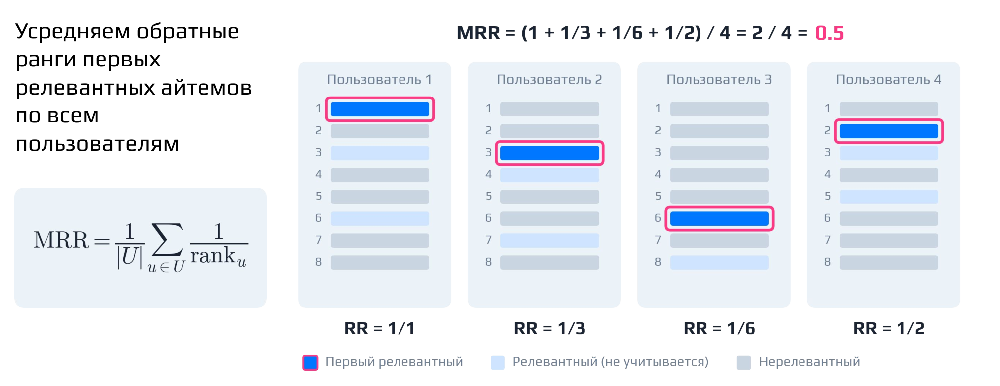

Релевантные айтемы ниже первого метрика не учитывает вовсе. MRR легко интерпретировать и реализовать, он удобен там, где важен именно первый результат. Ограничение видно заранее: учитывается только первый релевантный айтем. Кроме того, метрика быстро убывает: уже на третьей позиции вклад падает до $1/3$.


## ROC-AUC в ранжировании

*Таймкод: 00:51:56 · слайды 28–32*

**ROC-AUC** — метрика бинарной классификации, но в ранжировании её тоже активно используют, только в немного другом ключе. У неё есть два определения, которые дают одно и то же число. Первое, классическое, — площадь под ROC-кривой. Второе — доля правильно упорядоченных пар «релевантный — нерелевантный», то есть пар, в которых релевантный айтем стоит выше нерелевантного. Иначе говоря, ROC-AUC — это вероятность того, что случайно выбранный релевантный айтем окажется выше случайно выбранного нерелевантного. Случайное ранжирование даёт 0.5, идеальное — 1.

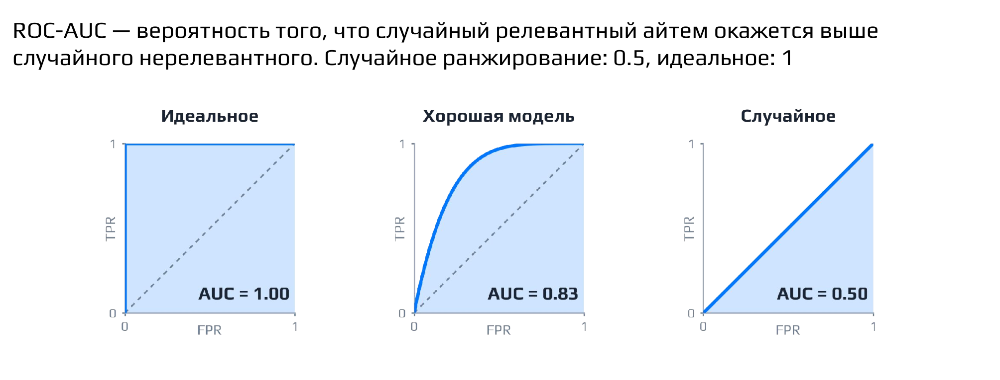

### Два определения на одном примере

Доказывать эквивалентность двух определений не будем, но её легко увидеть на примере. Пусть выдача, отсортированная по скору модели, выглядит так: `+ + − + − −`, где «+» — релевантный айтем, «−» — нерелевантный. Считаем пары. Минус на третьей позиции правильно отранжирован относительно двух плюсов над ним и неправильно — относительно плюса на четвёртой позиции. Два нижних минуса стоят ниже всех трёх плюсов. Всего пар «плюс–минус» $3 \cdot 3 = 9$, из них верных 8:

$$AUC = \frac{8}{9} \approx 0.89.$$

ROC-кривую строят по той же выдаче, двигая порог сверху вниз: каждый «+» — шаг вверх на $1/P$, каждый «−» — шаг вправо на $1/N$, где $P$ и $N$ — число релевантных и нерелевантных айтемов. Каждый «−» даёт столбец шириной $1/N$, высота которого равна доле плюсов, стоящих выше него. Поэтому площадь под кривой складывается ровно из долей верных пар и тоже равна $8/9$.

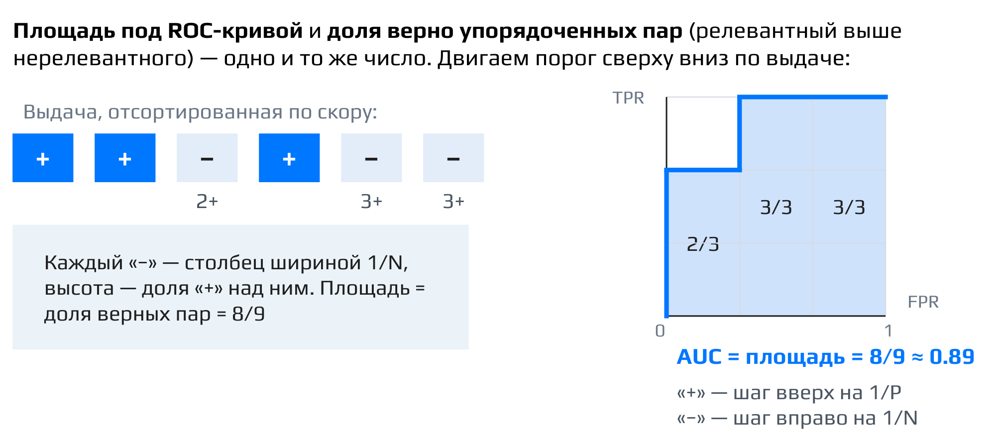

Связь с ранжированием здесь почти лингвистическая: раз метрика говорит о том, насколько правильно упорядочены пары, её естественно применять для оценки ранжирования.

### Глобальный AUC и AUC по пользователю

Важный практический вопрос — какие пары сравнивать. Возьмём двух пользователей и скоры модели для их айтемов (жирным выделены релевантные):

| Пользователь | Скоры | AUC пользователя |
|:--|:--|:--|
| A | **0.9**, 0.8, **0.7**, **0.6** | 1/3 |
| B | 0.4, 0.3, **0.2**, 0.1 | 1/3 |

Если свалить все айтемы в одну кучу и считать пары между всеми, получится **глобальный AUC**. У пользователя A и скоры выше, и релевантных айтемов больше, поэтому скор хорошо коррелирует с тем, у кого больше релевантного. Пары между пользователями вроде (0.7 у A, 0.4 у B) или (0.9 у A, 0.3 у B) упорядочены «правильно». В итоге из 16 пар верны 11, и глобальный AUC выходит довольно высоким: $11/16 \approx 0.69$.

Внутри одной ленты всё не так радужно. У пользователя A релевантные 0.7 и 0.6 стоят ниже нерелевантного 0.8, и верна только одна пара из трёх (0.9 > 0.8): $AUC_A = 1/3$. У пользователя B единственный релевантный айтем со скором 0.2 обходит только 0.1: $AUC_B = 1/3$. Среднее по пользователям — **AUC по пользователю** — равно

$$\frac{1/3 + 1/3}{2} \approx 0.33,$$

то есть внутри каждой ленты модель ранжирует хуже случайной. Модель выучила, что у A скоры в целом выше, чем у B, а не порядок внутри ленты.

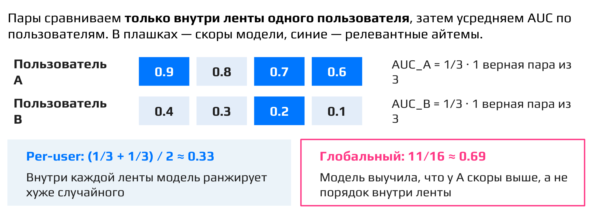

**Важный вывод:** в рекомендациях важен порядок пар внутри выдачи одного пользователя, а не между пользователями, ведь каждый видит только свою ленту. Поэтому ROC-AUC считают по каждому пользователю отдельно и затем усредняют. Глобальный AUC может серьёзно вводить в заблуждение.

### Ошибка в топе весит столько же, сколько ошибка в хвосте

У ROC-AUC как метрики ранжирования есть принципиальный минус. Возьмём выдачу из 8 айтемов с градуированными метками релевантности от 8 (самый релевантный) до 1. Строго говоря, ROC-AUC определён для бинарных меток; для градуированных берут его попарное обобщение — долю верно упорядоченных пар, а на бинарных метках оно совпадает с ROC-AUC.

- **Пример 1:** всё стоит идеально, кроме первых двух позиций: там айтемы с метками 7 и 8 поменялись местами. Это ошибка в топе.
- **Пример 2:** перепутаны последние два айтема, с метками 1 и 2. Это ошибка в хвосте.

Пар с разными метками в обоих случаях 28, и в каждом примере неверно упорядочена ровно одна пара. Значит, AUC одинаковый: $27/28 \approx 0.964$. Но ранжирование во втором случае заметно лучше: нам важнее всего топ выдачи и то, что происходит именно в нём. NDCG эту разницу видит: 0.983 в первом примере против 0.999 во втором, и потеря DCG в первом примере примерно в 20 раз больше.

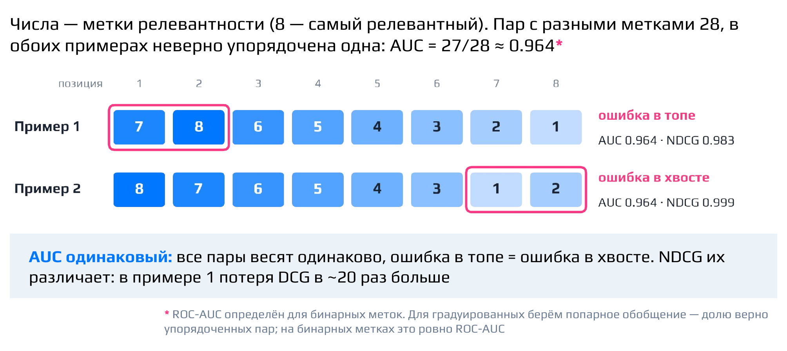

Отсюда полезная интуиция к LambdaRank. Раз у AUC все пары весят одинаково, а ошибка в топе на деле дороже, логично домножать градиент пары на то, насколько изменится целевая метрика, например NDCG, если эти два айтема поменять местами. Именно так устроен LambdaRank.

Итого у ROC-AUC есть плюс: его легко интерпретировать, потому что сразу видно, насколько ранжирование лучше случайного (0.5). Минусов два: все пары равноценны, и ошибка в топе стоит столько же, сколько ошибка в хвосте; кроме того, при сильном дисбалансе классов метрика выглядит оптимистично.

::: {.qa title="Вопросы из чата"}
**Какое значение MRR считается приемлемым?** Это зависит от того, сколько у пользователей позитивных айтемов: при одном позитиве в среднем и при сотне позитивов ожидания совсем разные. На практике встречаются значения в районе 0.1 — немного больше или немного меньше.

**Что будет с AUC, если в примере поменять местами айтемы с метками 8 и 1?** AUC уже не останется прежним. Если единица окажется на первой позиции, она образует неверную пару с каждым более релевантным айтемом ниже неё — с семёркой, шестёркой, четвёркой, тройкой, двойкой и так далее. Неправильно упорядоченных пар сразу становится много. Иначе говоря, AUC не чувствителен к тому, *где* случилась ошибка, но чувствителен к тому, *сколько* пар она нарушила.[^n5a]
:::

[^n5a]: Примечание составителя: если в идеальной выдаче 8, 7, …, 1 поменять местами 8 и 1, единица образует неверные пары со всеми семью айтемами ниже неё, а восьмёрка на последней позиции — ещё с шестью айтемами (7…2) выше неё. Всего 13 неверных пар из 28, и $AUC = 15/28 \approx 0.54$ — почти как у случайного ранжирования.


## Контекстуальные метрики: Coverage, Diversity, Novelty, Serendipity, Popularity bias

*Таймкод: 01:01:05 · слайды 33–43*

Precision, NDCG, MAP и ROC-AUC отвечают на вопрос, насколько точно система угадывает, что понравится конкретному пользователю. Но у рекомендательной системы есть и другие свойства, которые эти метрики не видят. Для них существуют **контекстуальные метрики**: они более специфичны для рекомендаций и говорят о «глобальном здоровье» системы в целом, а не о точности отдельной выдачи. Следить за ними вполне разумно. Разберём пять: покрытие, разнообразие, новизну, серендипность и popularity bias. У каждой есть и плюсы, и минусы.

### Coverage

**Coverage** (покрытие каталога) — доля айтемов каталога, которые рекомендательная система хоть кому-то показывает. Рекомендации могут быть отличными по точности, но при этом значительная часть каталога в них не попадает никогда.

Удобно смотреть на график популярности айтемов каталога, упорядоченных по убыванию: слева немного очень популярных, справа длинный хвост малопопулярных. Отметим айтемы, которые хотя бы раз попали в рекомендации. Если из 60 айтемов каталога рекомендовались 20, то

$$\text{Coverage} = \frac{20}{60} \approx 33\%.$$

В общем виде это число айтемов, хотя бы раз попавших в рекомендации, делённое на размер каталога $|I|$[^n6a].

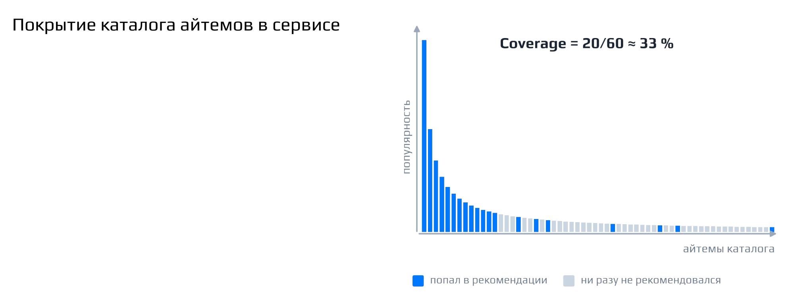

Почему низкое покрытие плохо — отдельный основательный разговор. Но замерять его полезно в любом случае. Если покрытие высокое, из каталога рекомендуется больше элементов, внимание пользователей распределяется между айтемами равномернее, раскрываются менее популярные и нишевые товары. Обратная сторона: погоня за покрытием может снизить релевантность и общее качество рекомендаций.

### Diversity

**Diversity** (разнообразие) показывает, насколько разнообразна лента одного пользователя: по категориям, авторам и т. п. Можно набрать пользователю только «чисто релевантное», и тогда окажется, что в ленте одно и то же. Например, фанату баскетбола подряд показываются «Хайлайты NBA #1», «Хайлайты NBA #2», «Хайлайты NBA #3». Это низкое разнообразие. Лента «Хайлайты NBA #1», «Свинка Пеппа», «Лекция Stanford» гораздо разнообразнее. Логичнее, чтобы в ленте было то, что пользователю нравится, но при этом разное.

Измеряется разнообразие как средняя «непохожесть» по всем парам показанных айтемов:

$$\operatorname{div}(u) = \frac{2}{n(n-1)}\sum_{i<j}\bigl(1-\operatorname{sim}(i,j)\bigr), \qquad n = |Rec(u)|.$$

Здесь $Rec(u)$ — список рекомендаций пользователю $u$, сумма идёт по всем парам айтемов $i<j$ из этого списка, $\operatorname{sim}(i,j)$ — похожесть двух айтемов, а $1-\operatorname{sim}(i,j)$ — их непохожесть. Множитель $\frac{2}{n(n-1)}$ — единица, делённая на число пар, так что в итоге получается среднее. Важна здесь не точная формула, а идея.

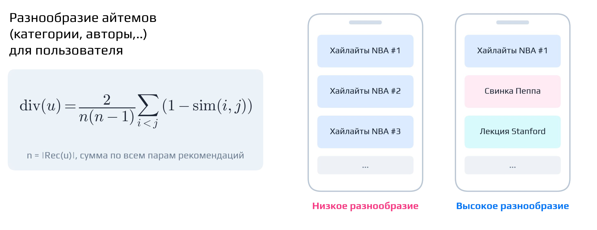

**Акцент лектора:** разнообразие важно, но если добавлять его искусственно, можно ухудшить качество рекомендаций. Нужно соблюдать баланс.

Плюсы разнообразия: пользователи открывают для себя новые категории и интересы, лента становится богаче, снижается риск [**информационного пузыря**]{.gl key="Информационный пузырь"}, то есть ситуации, когда система замыкает пользователя в узком круге однотипного контента. Минусы: чрезмерное разнообразие снижает точность рекомендаций, а сам пользователь может почувствовать себя ошеломлённым.

### Novelty

**Novelty** (новизна) отвечает на вопрос, показывает ли система пользователям что-то новое или «зависла» в каком-то пузыре, из которого не выбирается. Формализуют новизну через то, насколько редко айтем вообще рекомендуют:

$$\operatorname{novelty}(i) = -\log_2 \frac{|\{u : i \in Rec(u)\}|}{|U|}.$$

Дробь под логарифмом — доля пользователей, которым рекомендовали айтем $i$ (из всех пользователей $U$). Чем реже айтем рекомендуют, тем он «новее» и тем больше значение в битах. Популярный айтем, который рекомендуют половине пользователей, имеет новизну $-\log_2 0{,}5 = 1$ бит, а нишевый айтем — около 5,6 бита[^n6b].

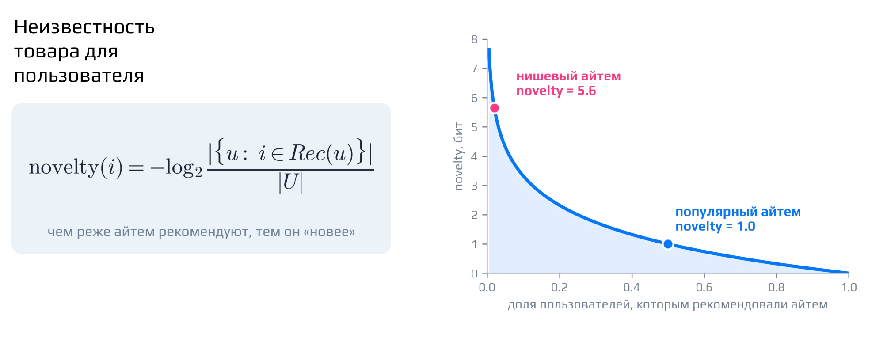

Плюсы новизны: пользователи остаются заинтересованными, поощряется открытие новых и актуальных элементов. Минусы: новое может не соответствовать долгосрочным интересам пользователя, а избыток нового — перегружать.

### Serendipity

**Serendipity** (серендипность, «удачность» рекомендаций) — способность системы найти то, что пользователю понравится, но окажется для него неожиданным. Это и даёт «вау-эффект»: показали что-то необычное, и оно действительно зашло. Метрика интересная и важная, но ею часто пренебрегают.

Измерять её можно так: для каждого рекомендованного айтема учитываем не только его релевантность, но и то, насколько он похож на «ожидаемые» рекомендации для этого пользователя:

$$\operatorname{Ser}(u) = \frac{1}{|Rec(u)|}\sum_{i\in Rec(u)}\Bigl[\operatorname{rel}(u,i) - \max_{j\in B(u)} \operatorname{sim}(i,j)\Bigr].$$

Здесь $\operatorname{rel}(u,i)$ — релевантность айтема $i$ пользователю $u$, а $B(u)$ — множество ожидаемых айтемов. Слагаемое $\max_{j\in B(u)} \operatorname{sim}(i,j)$ — похожесть на ближайший из них; оно вычитается как штраф за предсказуемость. В качестве $B(u)$ можно брать исторические айтемы, с которыми пользователь уже взаимодействовал, или то, что порекомендовала бы простейшая бейзлайновая модель.

Удобно представить айтемы в виде диаграммы. Все айтемы делятся на знакомые пользователю (среди них те, что он уже оценил) и новые. Среди них есть релевантные и неожиданные. Серендипные айтемы лежат на пересечении трёх множеств: новые, релевантные и неожиданные одновременно.

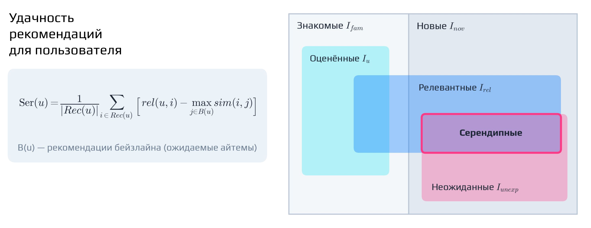

Плюсы: приятные неожиданности улучшают пользовательский опыт, пользователь открывает для себя что-то новое и интересное, рекомендации становятся менее предсказуемыми. Минус: в погоне за неожиданностью легко получить нерелевантные или просто случайные рекомендации.

### Popularity bias

**Popularity bias** — это не метрика в строгом смысле, а скорее эффект: в топе рекомендаций преобладают популярные айтемы. Замерять его разумно как долю популярных айтемов среди всего, что показывается пользователям. На графике популярности каталога это выглядит так: слева «хиты», справа длинный хвост нишевых айтемов.

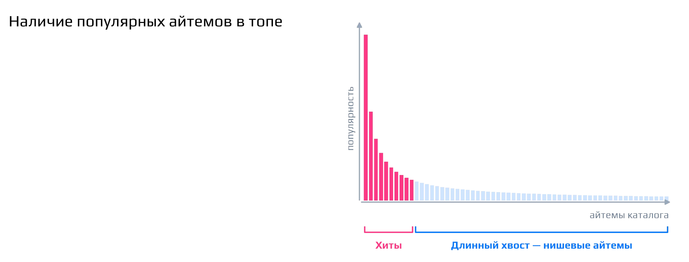

Откуда берётся эффект? Популярные айтемы потому и популярны, что нравятся многим. По ним больше информации, они надёжнее и нравятся широкому кругу. Поэтому у системы есть соблазн «скатиться» к тому, чтобы всегда показывать популярное и никогда — непопулярное.

Чем это плохо — тонкий момент. Если непопулярные айтемы не показывать, авторы и продавцы такого контента теряют мотивацию вообще что-либо делать. Разнообразие контента или товаров на платформе падает, а это плохо для самой платформы. При этом то, что популярные айтемы получают больше показов, само по себе нормально. Вопрос в том, хотим ли мы, чтобы они забирали абсолютно всё.

У популярности в выдаче тоже две стороны. Плюсы: такие рекомендации нравятся широкой аудитории, популярные элементы часто действительно качественнее или релевантнее. Минусы: менее известные, но релевантные айтемы игнорируются, и возникает эффект «богатые богатеют».

[^n6a]: Примечание составителя: формально $\text{Coverage} = \dfrac{|\{i : i \text{ хотя бы раз попал в рекомендации}\}|}{|I|}$, где $I$ — каталог айтемов; в материалах дан только числовой пример.

[^n6b]: Примечание составителя: при устном объяснении новизна описывалась как непохожесть показанного на то, что пользователь смотрел раньше, а формула определяет её через редкость рекомендации айтема по всем пользователям. Это разные, хотя и родственные, способы формализации; в тексте приведён вариант с формулой. Значению 5,6 бита соответствует доля пользователей около $2^{-5{,}6} \approx 2\%$.


## Рекомендательные бейзлайны и как выбирать метрики

*Таймкод: 01:09:29 · слайды 44–47*

### Простые бейзлайны

Прежде чем строить сложную модель ранжирования, полезно иметь под рукой **бейзлайн** (baseline) — простейший способ построить рекомендации, без обучения или почти без него. Он служит точкой отсчёта: новая модель имеет смысл, только если в офлайн-эксперименте и затем в A/B-тесте она заметно обгоняет бейзлайн. Бейзлайн уже встречался в формуле Serendipity: рекомендации простейшей модели там играют роль «ожидаемых» айтемов $B(u)$, от которых должна отличаться неожиданная, но релевантная рекомендация.

Самые распространённые варианты устроены как топы — один и тот же отсортированный список айтемов для всех пользователей:

- **Top popular** — топ популярного: показываем айтемы, с которыми взаимодействовало больше всего пользователей;
- **TopByCtr** — топ по CTR: сортируем айтемы не по абсолютному числу взаимодействий, а по доле кликов от показов;
- **Rating** — топ по рейтингу, то есть по средней явной оценке айтема.

Есть и бейзлайны другого рода. **Random** — рекомендации просто случайные. Звучит странно, но у них есть применение: если мы хотим оценить, как пользователь взаимодействует с новыми для него айтемами, проще всего показать ему что-то случайное. Близкий вариант — **Novelty**: целенаправленно показывать пользователю то, что для него ново.[^n7a]

Относительно адекватный бейзлайн — **редакторская подборка**. В системе есть редакторы, которые решают, какими должны быть рекомендации, и вручную собирают для пользователей топ айтемов. Такой список не персонален, но в нём уже заложено человеческое суждение о качестве.

Наконец, все перечисленные бейзлайны можно строить не для всей аудитории сразу, а в разрезе групп — по полу, возрасту, географии. Тогда у каждого сегмента свой топ популярного, свой топ по CTR и так далее, и рекомендации становятся хотя бы грубо персонализированными.

### Итоги: как подходить к оценке рекомендаций

Из всего разговора про метрики вытекает несколько практических правил.

Во-первых, модели нужно сначала валидировать офлайн и только затем отправлять сильных кандидатов в A/B-тест. Разумный процесс разработки выглядит так: много дешёвых офлайн-экспериментов, а то, что показало себя лучше всего, проверяется в A/B-эксперименте, который обходится гораздо дороже.

Во-вторых, оптимизировать стоит такие таргеты и смотреть на такие метрики, которые хорошо аппроксимируют нужные продуктовые метрики — те, которых непосредственно хочет бизнес.

В-третьих, нельзя оптимизировать только одну метрику. Рекомендательная система многогранна, и в ней много подводных камней — это хорошо видно по контекстуальным метрикам: выдача может быть точной и при этом однообразной, узкой по каталогу или целиком состоящей из популярного. Поэтому за здоровьем системы следят с помощью разных метрик и смотрят на них в совокупности.

В-четвёртых, двигаться нужно от простого к сложному: сначала бейзлайны и эвристики, затем сложные модели.

::: {.qa title="Вопросы из зала"}
**Popularity bias — это эффект Матфея, «богатый богатеет»?** В каком-то смысле да. Это похоже на старый спор о том, как должно быть устроено общество: кто богатый, кто бедный и как распределять блага. Как устроить «рекомендательное общество», то есть как распределить показы между популярными и непопулярными айтемами, — отдельный вопрос, и при построении системы на него приходится отвечать. Ответ зависит от того, что конкретно нужно бизнесу и для чего вообще нужна рекомендательная система. Это тема для многочасового разговора за чашкой чая.

**Почему Serendipity часто пренебрегают, если это как будто бы основная суть RecSys?** Основная суть RecSys всё-таки не в серендипности, а в том, чтобы вообще набирать релевантное. Серендипность — скорее дополнительное свойство: на неё имеет смысл смотреть, когда рекомендации уже неплохие и хочется, чтобы они ещё и удивляли. Пренебрегают ею по двум причинам. Её сложно измерить: с формулами вроде приведённой выше можно спорить. И профит от неё не очевиден: он не превращается напрямую в деньги или в основные метрики.

**Метрик так много, а отвечают они за разные вещи. Как бизнес выбирает, какие важны? Можно ли ограничиться двумя-тремя?** Технические метрики вроде MAP и NDCG в целом про одно и то же: насколько хорошо работают рекомендации. К ним и стоит относиться как к техническим, а не бизнесовым. У бизнеса обычно есть целевая метрика (например, деньги от рекламы) или прокси-метрика (например, время смотрения). В A/B-тестах смотрят прежде всего на неё и при этом жёстко требуют, чтобы остальные метрики сильно не проседали. Получается своего рода условная оптимизация: максимизируем основную метрику при условии, что все остальные остаются на приемлемом уровне.

**Какие метрики смотреть с точки зрения поставщиков айтемов — авторов, продавцов?** Как показывает практика, популярные авторы и так получают много показов и в органическом случае не страдают, поэтому на них можно пристально не смотреть. Смотреть надо на непопулярных, у кого взаимодействий мало. Логично считать, сколько показов получили такие авторы и какая доля всех показов пришлась на непопулярные айтемы. Другая полезная метрика — какая доля айтемов, которые выпускает автор, набирает достаточно показов или лайков. Если всё, что он выпускает, получает по нулю просмотров, — это одна ситуация. Если у каждой его публикации набирается адекватное число, скажем три тысячи просмотров, — совсем другая.
:::

[^n7a]: Примечание составителя: бейзлайн Novelty — это способ построить выдачу (подмешивать новое для пользователя), а не метрика Novelty, которая оценивает уже готовые рекомендации. Подробнее он не раскрывался.


## Практика: данные MovieLens, признаки и простые способы ранжирования

*Таймкод: 01:20:41 · ноутбук: части I–IV (ячейки 0–35)*

Практическая часть семинара — ноутбук (Jupyter, запускается в Google Colab на CPU), который выкладывается в материалах курса. У него две задачи: показать, как своими руками реализовать метрики ранжирования из теории (NDCG и MAP), и применить несколько способов ранжирования к простому датасету. Код здесь не нужно разбирать построчно: важнее понять, что делает каждый шаг и зачем. Сам ноутбук стоит пройти самостоятельно, в том числе при выполнении ДЗ; вопросы по нему можно задавать в чате курса.

### Метрики своими руками

Пусть модель выдала одному пользователю список объектов $i_1, \ldots, i_n$, отсортированный по убыванию оценки модели, и для каждого объекта известна релевантность $rel_1, \ldots, rel_n$. Порядок действий всегда один: модель присваивает каждому кандидату оценку `score`, объекты сортируются по ней, и только **после сортировки** считается метрика.

В DCG на практике в числителе часто стоит не сама релевантность, а gain:

$$gain(rel) = 2^{rel} - 1,\qquad discount(r) = \frac{1}{\log_2(r+1)},\qquad DCG@k = \sum_{r=1}^{k}\frac{2^{rel_r}-1}{\log_2(r+1)}.$$

Это своего рода экспоненцирование релевантности, то есть просто другой способ выбрать, что считать полезностью объекта. При бинарной релевантности ничего не меняется: $2^1-1=1$, $2^0-1=0$. При многоуровневой высокие уровни получают заметно больший вес: разница между релевантностью 3 и 2 становится важнее, чем между 1 и 0. Дисконт отвечает за то, что ошибки в начале выдачи важнее ошибок в конце. В Python позиции нумеруются с нуля, поэтому в знаменателе кода появляется `np.arange(...) + 2`:

```python
gains = np.power(2.0, relevance) - 1.0
discounts = 1.0 / np.log2(np.arange(len(relevance)) + 2.0)
return float(np.sum(gains * discounts))
```

NDCG удобно строить поверх уже написанной функции `dcg`: считаем DCG для реального порядка и для идеального (релевантности отсортированы по убыванию), затем делим одно на другое. Так в коде отдельно видна роль дисконтирования и отдельно — роль нормировки. Если у пользователя вообще нет релевантных объектов, функция явно возвращает `0.0`. Для примера с релевантностями `[3, 2, 3, 0, 1, 2]` получается $DCG \approx 13{,}85$, $DCG@3 \approx 12{,}39$, $NDCG \approx 0{,}949$, $NDCG@3 \approx 0{,}959$, а идеальная сортировка даёт ровно 1.

AP и MAP реализуются прямолинейно. Для бинарной релевантности

$$AP = \frac{1}{R}\sum_{r=1}^{n} P@r \cdot rel_r,\qquad MAP = \frac{1}{|Q|}\sum_{q\in Q} AP_q,$$

где $P@r$ — точность среди первых $r$ позиций, а $R$ — общее число релевантных объектов. Точность смотрится только в тех позициях, где стоит релевантный объект, и усредняется. В реализации `AP@k` в знаменателе по-прежнему стоит $R$ — число релевантных во всём наборе кандидатов, поэтому релевантный фильм, не попавший в первые $k$ позиций, тоже ухудшает метрику. Для выдач `[1, 0, 1, 0, 1, 0]` и `[0, 1, 1, 1, 0, 0]` получается $AP \approx 0{,}756$ и $0{,}639$, $MAP \approx 0{,}697$.

Чем различаются метрики на практике: NDCG хорош для многоуровневой релевантности (например, 0, 1, 2, 3) и особенно чувствителен к ошибкам в верхней части выдачи; MAP обычно используют с бинарной релевантностью, и он тем выше, чем раньше найдены все нужные объекты. Выбор метрики определяется тем, что нужно измерять в задаче.

Прежде чем применять метрики к моделям, полезно проверить очевидные свойства — несколько `assert`: идеальная сортировка даёт $NDCG = 1$; если переставить хороший объект вниз, NDCG уменьшается; идеальная бинарная выдача даёт $AP = 1$; без релевантных объектов обе функции возвращают 0.

### Данные: MovieLens 100K

MovieLens — это «hello world» рекомендаций: базовый датасет оценок фильмов пользователями, на котором проверяют методы во многих статьях. У него есть версии разного размера[^n8a]; в ноутбуке используется **MovieLens 100K** — 100 000 оценок, 943 пользователя и 1682 фильма. Он достаточно мал, чтобы всё работало на CPU.

Основная таблица — история взаимодействий `user_id, item_id, rating, timestamp`: пользователь провзаимодействовал с айтемом, поставил такой-то рейтинг в такой-то момент. Дополнительно есть описание фильмов (название и 19 бинарных признаков жанров) и пользователей. Оценки — от 1 до 5 звёзд, как на Кинопоиске. Распределение: 1 — 6110, 2 — 11 370, 3 — 27 145, 4 — 34 174, 5 — 21 201.

### Из предсказания рейтинга — в задачу ранжирования

Первый шаг — **бинаризация таргета**: многоуровневую оценку превращаем в бинарную релевантность. Адекватный вариант — считать фильм релевантным, если оценка не ниже 4:

$$relevant(u,i) = \mathbb{1}[rating(u,i) \ge 4].$$

Это лишь один из вариантов. Можно оставить оценки 1..5 как многоуровневую релевантность, считать 5 более сильным сигналом, чем 4, а в реальной системе — использовать время просмотра, покупку, лайк и другие виды обратной связи. Бинарная релевантность удобна тем, что на ней легко показать и NDCG, и MAP, а попарная функция потерь записывается особенно просто.

Дальше для каждого пользователя положительные взаимодействия сортируются по времени. Последние три положительно оценённых фильма считаются будущими релевантными объектами (таргетами), более ранние — известной историей. Пользователи, у которых меньше 8 положительных оценок, отбрасываются; остаётся 920 пользователей с медианой 40 положительных взаимодействий. К трём таргетам добавляются 47 случайных фильмов, которых пользователь вообще не оценивал (поэтому среди отрицательных не окажется уже известного ему фильма). Получается **набор кандидатов** из 50 фильмов, ровно 3 из которых релевантны; задача модели — поставить эти три выше остальных.

Пользователи делятся на обучающую, валидационную и тестовую выборки: 644, 138 и 138. Так один и тот же пользователь не встречается одновременно в обучении и в проверке. В реальной задаче чаще используют разбиение по времени, а разбиение по пользователям выбрано здесь ради простоты.

Отдельное правило касается [**утечки данных**]{.gl key="Утечка данных"} — ситуации, когда в признаки модели попадают сведения о данных, на которых потом измеряется качество. Если посчитать популярность фильмов или корреляции между ними с участием тестовых пользователей, признаки уже будут «знать» тест. Поэтому:

- глобальные признаки (популярность, корреляции между фильмами) считаются только по историям пользователей обучающей выборки;
- личную историю пользователя из валидации или теста использовать можно: к моменту рекомендации она уже известна;
- будущие релевантные фильмы при построении признаков не используются.

### Простые признаки

Хотя признаки модели — тема отдельной лекции («Признаки и классические рекомендательные модели»), в ноутбуке реализовано несколько простейших. Эмбеддингов, матричной факторизации и последовательных моделей здесь нет: цель — показать, что модель ранжирования можно обучить и на очень простых признаках, смысл которых легко проверить вручную.

Самые простые — **признаки-счётчики**: сколько раз что-то встретилось в данных. Популярность фильма $pop(i)=\#\{u: i \in history(u)\}$ — у скольких пользователей обучающей выборки он есть в известной истории; в обучающих историях встретилось 1378 фильмов. Популярность полезно прологарифмировать, `log(1 + popularity)`, — особенно если признак пойдёт в нейросеть. Ещё два признака — `item_is_cold` (фильм ни разу не встретился в обучающих историях) и длина истории пользователя `user_history_len`, то есть со сколькими айтемами он провзаимодействовал. Последний одинаков для всех фильмов одного пользователя и сам по себе порядок не меняет, но дерево или нейросеть могут использовать его во взаимодействии с другими признаками.

Следующий признак даёт **корреляционная модель** — простейший подход коллаборативной фильтрации, который сравнивает айтемы между собой по поведению пользователей. Для каждого айтема возьмём длинный бинарный вектор по всем пользователям: 1 — взаимодействие было, 0 — не было; длина вектора равна числу юзеров. Корреляция векторов двух айтемов показывает, смотрят ли их одни и те же, похожие пользователи. Формально $X_i(u)=\mathbb{1}[i \in history(u)]$ и

$$\rho(i,j)=\frac{\operatorname{Cov}(X_i,X_j)}{\sigma(X_i)\sigma(X_j)}.$$

Для бинарных величин корреляция Пирсона называется коэффициентом $\phi$. Положительное $\rho$ значит, что фильмы встречаются вместе чаще ожидаемого, около нуля — связи нет, отрицательное — реже ожидаемого. Число совместных появлений всех пар считается сразу как $X^\top X$, где $X$ — матрица «пользователь × фильм».

Корреляцию нужно сглаживать: два редких фильма, случайно встретившиеся у одного-двух пользователей, получат большую корреляцию почти без данных. Поэтому

$$\tilde\rho(i,j)=\rho(i,j)\,\frac{n_{ij}}{n_{ij}+\alpha},\qquad \alpha = 10,$$

где $n_{ij}$ — число обучающих пользователей, у которых встретились оба фильма. При большом $n_{ij}$ множитель близок к единице, при малом заметно уменьшает корреляцию. Корреляция фильма с самим собой обнуляется. Полная матрица $1682\times1682$ занимает около 10,8 МБ; в промышленной системе такую матрицу не хранят, а оставляют для каждого объекта несколько ближайших соседей.

Корреляция даёт похожесть айтем–айтем, а для модели нужна похожесть юзер–айтем. Её получают так: смотрят, насколько кандидат $i$ похож на айтемы из истории пользователя $H_u$, то есть на набор $\{\tilde\rho(i,j): j\in H_u\}$. Из положительных значений строятся два признака: `corr_max` — максимальная корреляция и `corr_top3_mean` — среднее трёх наибольших. По смыслу они отвечают на вопрос: есть ли в истории пользователя фильмы, которые по поведению других людей похожи на кандидата?

Последний признак — по содержимому, через жанры. Профиль пользователя — доли жанров в его истории:

$$p_u(g)=\frac{1}{|H_u|}\sum_{j\in H_u}\mathbb{1}[j \text{ имеет жанр } g].$$

Для кандидата значения $p_u(g)$ усредняются по его жанрам; результат `genre_affinity` лежит между 0 и 1 и показывает, насколько жанры кандидата похожи на то, что пользователь обычно смотрит. Добавляется и число жанров фильма `item_genre_count`.

### Таблица для ранжирования и единая оценка

В итоге получается табличный датасет: строка — пара (пользователь, фильм-кандидат), колонки — `user_id`, `item_id`, `label` (1 для трёх таргетов, 0 для 47 негативов) и восемь признаков. Размеры: 32 200 строк в обучении, по 6900 в валидации и тесте; в каждой группе 50 строк и 3 положительных. Все строки одного пользователя образуют группу (в библиотеках ранжирования её часто называют `query group`), внутри которой модель расставляет фильмы. Модели должны знать границы групп: сравнивать как пару фильмы двух разных пользователей бессмысленно.

Все способы ранжирования оцениваются одной процедурой: 50 кандидатов каждого пользователя сортируются по оценке модели, выписывается последовательность нулей и единиц, считаются `NDCG@10`, `AP@10` и `Recall@10`, затем значения усредняются по пользователям. Recall@10 здесь легко интерпретировать: у каждого пользователя три релевантных фильма, и $Recall@10 = 2/3$ значит, что два из трёх попали в первую десятку. Абсолютные значения метрик зависят от того, как сформирован набор кандидатов, поэтому сравнивать имеет смысл только модели, оценённые на одном и том же наборе.

### Бейзлайны без обучения

Прежде чем оценивать модели, разумно взять бейзлайны-эвристики без обучения. Первая — случайное ранжирование: полезно знать, какие метрики даёт выдача в случайном порядке. Если метод ранжирования показывает такие же, он работает не лучше рандома, и за этим нужно следить. Вторая — ранжирование по популярности (по `log_item_popularity`), то есть Top popular. Ещё две — по корреляции с историей (`corr_top3_mean`) и по жанрам (`genre_affinity`).

| Способ | NDCG@10 | MAP@10 | Recall@10 |
|:--|:--|:--|:--|
| Random | 0,109 | 0,051 | 0,181 |
| Popularity | 0,488 | 0,355 | 0,626 |
| Correlation | 0,566 | 0,437 | 0,696 |
| Genre affinity | 0,129 | 0,067 | 0,208 |

Все эвристики выигрывают у рандома, но соответствие жанров работает ненамного лучше него: MAP@10 0,067 против 0,051. Корреляционный бейзлайн, наоборот, обгоняет даже популярность. Общий принцип: если более сложная модель не превосходит такие простые ориентиры, сначала стоит разобраться в данных и признаках, а уже потом усложнять архитектуру.

[^n8a]: Примечание составителя: самые крупные из актуальных версий — MovieLens 25M и 32M (25 и 32 миллиона оценок); есть также 1M и 10M.


## Практика: CatBoostRanker, XGBRanker и нейросеть в стиле LambdaRank

*Таймкод: 01:31:46 · ноутбук: части V–IX (ячейки 36–53)*

Бейзлайны без обучения дали ориентиры: случайный порядок, популярность, корреляция с историей и жанры. Теперь обучим на той же таблице кандидатов настоящие модели ранжирования. Начнём с двух библиотек градиентного бустинга, в которых для ранжирования есть готовая инфраструктура, — CatBoost и XGBoost. Затем напишем небольшую нейросеть с собственной функцией потерь. Все модели получают одни и те же восемь признаков (`FEATURES`) и оцениваются одной процедурой: 50 кандидатов каждого пользователя сортируются по оценке модели, считаются NDCG@10, MAP@10 и Recall@10, значения усредняются по пользователям.

### Чем ранжирование отличается от классификации

В бинарной классификации каждая строка — отдельный пример, и модель старается предсказать для неё правильную метку. В ранжировании важен **относительный порядок объектов внутри одного пользователя**: для релевантного фильма $i$ и нерелевантного фильма $j$ того же пользователя хочется получить

$$s_i > s_j,$$

где $s$ — оценка (score) модели. Абсолютные значения оценок у разных пользователей сравнивать не нужно: оценка 2.0 у пользователя A не обязана означать то же, что 2.0 у пользователя B. Поэтому модели надо явно сообщить, где проходят границы пользовательских списков. Сравнивать как пару фильмы двух разных пользователей бессмысленно.

### CatBoostRanker

**CatBoostRanker** — модель градиентного бустинга над решающими деревьями из библиотеки CatBoost, предназначенная именно для ранжирования. Данные для неё удобно упаковать в **Pool** — собственный формат датасета CatBoost. Работать можно и с обычными таблицами pandas: в CatBoost есть разные способы представить данные. У Pool два важных поля. `label` — метка релевантности, у нас 0 или 1. **group_id** — колонка, по которой строки делятся на группы: строки одной группы относятся к одному пользователю и сравниваются только между собой. У нас `group_id` — это `user_id`.

**Важно:** датасет для Pool должен быть отсортирован по `group_id`, чтобы строки одной группы шли подряд. Для этого в ноутбуке есть функция `sort_for_ranking`, она сортирует таблицу по `user_id` и `item_id`:

```python
train_pool = Pool(train_cb[FEATURES], label=train_cb["label"],
                  group_id=train_cb["user_id"])
cat_model = CatBoostRanker(loss_function="YetiRank", iterations=150,
                           depth=6, learning_rate=0.08, random_seed=SEED)
cat_model.fit(train_pool, eval_set=val_pool)
```

Функций потерь для ранжирования в CatBoost несколько; они перечислены в документации, раздел Objectives and metrics → Ranking. **PairLogit** и **PairLogitPairwise** — попарные функции потерь, очень похожие на RankNet. Формула у них одна и та же, а различаются они тем, как подбираются значения в листьях деревьев (об этом шла речь в теме «Ранжирование и метрики качества»). **YetiRank** ориентируется на ранжирующие метрики, например NDCG, и по сути применяет тот же трюк, что и LambdaRank: вес пары зависит от того, насколько её перестановка влияет на метрику. Сверх этого в YetiRank есть ряд технических приёмов, а у неё самой — попарная модификация YetiRankPairwise.

Мы обучаем `CatBoostRanker` с `loss_function="YetiRank"` (150 деревьев глубины 6), а качество меряем уже знакомыми метриками. На тесте получаются NDCG@10 = 0.591, MAP@10 = 0.454, Recall@10 = 0.737: заметно лучше всех бейзлайнов.

### XGBRanker и LambdaMART

В XGBoost есть своя модель для обучения ранжированию — **XGBRanker**. Группу запроса в ней задаёт параметр `qid` (у нас снова `user_id`), а целевую функцию — параметр `objective`. Используем `rank:ndcg`:

```python
xgb_model = XGBRanker(objective="rank:ndcg", eval_metric="ndcg@10",
                      n_estimators=150, max_depth=4, learning_rate=0.08)
xgb_model.fit(train_xgb[FEATURES], train_xgb["label"], qid=train_xgb["user_id"])
```

Чем `rank:ndcg` отличается от `rank:pairwise`? Обычная попарная функция потерь в духе RankNet требует лишь, чтобы более релевантный объект получил оценку выше: $s_i > s_j$, если $y_i > y_j$. Но для NDCG ошибки неравноценны: перепутать два объекта в самом начале списка гораздо хуже, чем два объекта далеко внизу. С `rank:ndcg` попарные градиенты получают больший вес, если перестановка соответствующих объектов сильнее меняет NDCG. Вклад пары масштабируется величиной, связанной с $|\Delta NDCG|$. На этой идее построен **LambdaMART** — LambdaRank, у которого моделью служит градиентный бустинг над деревьями. Результат XGBRanker на тесте: NDCG@10 = 0.597, MAP@10 = 0.458, Recall@10 = 0.737.

### Нейросеть с попарной функцией потерь в стиле LambdaRank

Теперь реализуем ту же идею сами. Модель совсем простая — два полносвязных слоя:

$$x_{u,i}\rightarrow Linear\rightarrow ReLU\rightarrow Linear\rightarrow s_{u,i}.$$

На вход подаются признаки пары «пользователь — фильм» ($x_{u,i}$), на выходе получается одно число — оценка фильма $s_{u,i}$. Скрытый слой содержит 32 нейрона. Признаки для нейросети стандартизуются (`StandardScaler`, обученный на train), а данные перекладываются в тензор формы «пользователи × 50 кандидатов × 8 признаков»: для обучающей выборки это $644 \times 50 \times 8$. Пары формируются только внутри одного списка, так что границы пользователей соблюдаются автоматически.

Для пары $(i,j)$, где $y_i > y_j$, логистическая функция потерь RankNet имеет вид

$$\ell_{ij}=\log\left(1+\exp(-(s_i-s_j))\right).$$

Она убывает, когда $s_i$ становится больше $s_j$. Чтобы добавить идею LambdaRank, умножим её на изменение NDCG, которое произошло бы, если поменять местами текущие позиции двух объектов:

$$\ell_{ij}^{Lambda} = |\Delta NDCG_{ij}|\,\log\left(1+\exp(-(s_i-s_j))\right).$$

Множитель **ΔNDCG** для бинарной релевантности считается так:

$$|\Delta NDCG_{ij}| = \frac{|gain_i-gain_j|\cdot|discount(r_i)-discount(r_j)|}{IDCG},$$

где $r_i, r_j$ — текущие позиции объектов в порядке модели,
$$gain = 2^{rel}-1,\qquad discount(r) = 1/\log_2(r+1)$$
(для позиций дальше $k=10$ дискаунт обнуляется), а IDCG нормирует результат на идеальную выдачу. Обратите внимание на устройство формулы: изменение NDCG здесь не пересчитывается целиком. Отдельно берётся разность гейнов, отдельно — разность дискаунтов, и они перемножаются. Это распространённый эмпирический приём.

Почему вес зависит от текущего порядка? Важность одной и той же пары определяется тем, где её объекты стоят сейчас. Перестановка объектов на позициях 1 и 2 может заметно изменить NDCG, а перестановка на позициях 47 и 48 при NDCG@10 не изменит ничего: оба объекта за пределами первой десятки. Так функция потерь связывается с метрикой, которую мы хотим улучшать. Технически позиции и веса вычисляются внутри `torch.no_grad()`, то есть градиент через них не идёт: веса — просто коэффициенты при попарных логистических потерях. Итоговая потеря делится на сумму весов.

У этой конструкции есть оговорка. В исходном LambdaRank алгоритм формулируют через специальные **lambda-градиенты**, а не через одну явно выписанную скалярную функцию потерь. Здесь используется удобный учебный вариант — взвешенная попарная функция потерь. Главную идею LambdaRank она сохраняет: ошибки в парах, которые сильнее влияют на NDCG, дают более сильное обновление модели.

Сеть обучается оптимизатором Adam (`lr=1e-3`, `weight_decay=1e-4`) 15 эпох батчами по 64 пользователя. Функция потерь падает с 0.539 на первой эпохе до 0.277 на пятой и 0.216 на пятнадцатой; после восьмой эпохи кривая почти выходит на плато.

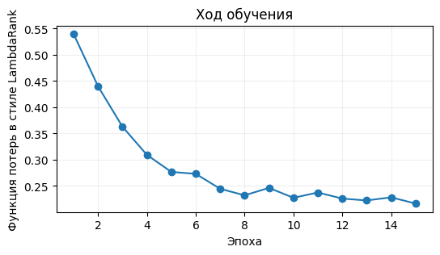

При применении модели каждая пара «пользователь — фильм» получает одну оценку. Попарная часть нужна только для вычисления функции потерь при обучении. На тесте нейросеть даёт NDCG@10 = 0.542, MAP@10 = 0.405, Recall@10 = 0.681.

### Итоговое сравнение

| Модель | NDCG@10 | MAP@10 | Recall@10 |
|:--|:--|:--|:--|
| XGBRanker | 0.5970 | 0.4581 | 0.7367 |
| CatBoostRanker | 0.5911 | 0.4537 | 0.7367 |
| Correlation | 0.5665 | 0.4373 | 0.6957 |
| PyTorch LambdaRank-style | 0.5420 | 0.4046 | 0.6812 |
| Popularity | 0.4885 | 0.3551 | 0.6256 |
| Random | 0.1089 | 0.0507 | 0.1812 |

На этом запуске первое место у XGBRanker, CatBoostRanker совсем рядом. С другим random seed порядок двух бустингов может поменяться, поэтому на маленьком примере не так важно, какая библиотека оказалась первой. Важнее, что все модели оценены одинаково: на одном наборе кандидатов и одними реализациями метрик. Нейросеть уступает бустингам, хотя заметно обходит ранжирование по популярности[^n9a].

**Важный вывод:** результат подтверждает общее правило. В классических методах градиентный бустинг для ранжирования — это база, которую довольно непросто победить. При этом нейросетевое ранжирование набирает популярность: в VK его недавно выкатили в продакшн в некоторых сервисах, им занимаются в Яндексе и в западном Big Tech. Это большая тема с множеством методов и приёмов, она подробно разбирается в теме «Нейросетевое ранжирование».

[^n9a]: Примечание составителя: по таблице нейросеть уступает и корреляционному бейзлайну без обучения (NDCG@10 0.542 против 0.567), хотя получает тот же корреляционный признак на вход.

### Одна выдача глазами

Одного числа метрики мало, чтобы понять поведение модели. Полезно открыть выдачу нескольких конкретных пользователей. Какие фильмы были релевантными? Что модель поставила наверх? Какие значения признаков были у этих фильмов? В ноутбуке для этого выводятся первые 15 фильмов выдачи CatBoostRanker для пользователя `EXAMPLE_USER` с колонками `label`, `catboost_score`, `item_popularity`, `corr_top3_mean`, `genre_affinity`; пользователя можно поменять. Для первого пользователя тестовой выборки все три релевантных фильма — «A Time to Kill», «Twister» и «Heat» — заняли три верхние позиции. У лидера выдачи высокая популярность (90 оценок в обучающих данных) и самая сильная корреляция с историей ($corr\_top3\_mean \approx 0.35$). Ниже идут нерелевантные «Psycho» и «The American President».

### Что важно запомнить

Ноутбук завершается списком выводов, которые связывают практику с теорией:

- метрика ранжирования считается отдельно для каждого пользователя и затем усредняется; объединять фильмы разных пользователей в один список и считать по нему NDCG нельзя;
- оценка модели и метрика — не одно и то же: для ранжирования важен не масштаб score, а порядок объектов внутри пользователя;
- NDCG учитывает и релевантность, и позицию: DCG уменьшает вклад объектов по мере удаления от начала списка, а деление на IDCG нормирует результат относительно идеального порядка;
- MAP — среднее AP по пользователям; её особенно естественно использовать при бинарной релевантности, и она растёт, когда релевантные объекты ближе к началу;
- набор кандидатов — часть офлайн-эксперимента: если вместо 47 отрицательных кандидатов взять, скажем, 1000, абсолютные значения метрик изменятся даже для той же модели, поэтому сравнивать эксперименты можно только при одинаковой схеме формирования кандидатов;
- при построении признаков легко допустить утечку данных: популярность, корреляции и другие агрегаты считаются только по данным, которые были бы известны модели в момент рекомендации;
- модели Learning to Rank должны знать границы пользовательских списков: в CatBoost это `group_id`, в XGBoost — `qid`, в реализации на PyTorch пары формируются только внутри одного пользователя;
- LambdaRank связывает попарное обучение с NDCG: ошибка в паре весит больше, если перестановка этих объектов сильнее меняет NDCG, поэтому модель сосредотачивается на ошибках, важных для итоговой метрики.

::: {.qa title="Вопросы из чата"}
**На каких датасетах смотреть метрики?** В статьях для офлайн-оценки используют относительно небольшой набор публичных датасетов, на них все и проверяют методы. В продакшене смотрят на собственный датасет, собранный внутри компании.

**Есть ли сложившийся подход: какая библиотека градиентного бустинга лучше в рекомендательных системах?** Как и везде, где применяют градиентный бустинг, это обычно CatBoost или XGBoost. В России по понятным причинам чаще используют CatBoost. На нашем примере они дают почти одинаковое качество.
:::


## Главное из семинара {.unnumbered}

::: keypoints
- Качество изменений проверяют двумя способами. A/B-тест прямо измеряет бизнес-эффект, но долог, рискован и требует инфраструктуры. Офлайн-эксперимент на логах быстр и безопасен, но смещён: фидбек есть только на то, что показала старая модель. Поэтому офлайн — фильтр для идей, A/B — финальное решение.
- Метрики образуют три уровня: бизнес-метрики (недели, только в A/B), онлайн-прокси вроде CTR (дни), офлайн-метрики на логах (минуты). Офлайн-метрики выбирают так, чтобы они согласовывались с бизнесовыми, и смотрят на набор метрик, а не на одну.
- Офлайн-разбиение должно быть честным по времени: обучаться на данных из будущего тестового периода нельзя.
- Для ретривала главная метрика — Recall@K: что потеряно при отборе, ранкер уже не вернёт. Precision@K, Recall@K и HitRate@K не видят порядок внутри топа.
- Метрики ранжирования учитывают позиции: MAP (для бинарной релевантности), NDCG (и для градуированной, нормирована на идеальный порядок), MRR (позиция первого релевантного). ROC-AUC считают по каждому пользователю и усредняют; глобальный AUC может сильно вводить в заблуждение, а ошибки в топе и в хвосте AUC весят одинаково.
- Контекстуальные метрики — Coverage, Diversity, Novelty, Serendipity, Popularity bias — описывают «здоровье» системы, которое точностные метрики не видят. Добавлять разнообразие и новизну искусственно опасно: нужен баланс с релевантностью.
- Любую модель сравнивают с бейзлайнами: Random, Top popular, TopByCtr, Rating, редакторская подборка. В ноутбуке простой корреляционный бейзлайн обгоняет популярность и даже небольшую нейросеть.
- Модели Learning to Rank должны знать границы пользовательских списков (`group_id` в CatBoost, `qid` в XGBoost). Градиентный бустинг с ранжирующим лоссом (YetiRank, `rank:ndcg`) — сильная база, которую непросто победить.
- LambdaRank связывает попарное обучение с NDCG: вес пары пропорционален $|\Delta NDCG|$ от её перестановки, поэтому модель сосредотачивается на ошибках в верху выдачи.
:::

## Что подчеркнул лектор {.unnumbered}

::: emphasis
- Без A/B-тестирования ничего достоверно сказать нельзя. Если офлайн и A/B расходятся, правят метрику, а не игнорируют тест.
- Офлайн-замер наказывает модель за новое: айтемы, которых не показывали, считаются нерелевантными. Это встроенное смещение, а не ошибка в коде.
- Метрики считаются внутри одного пользователя и потом усредняются: пользователь видит только свою ленту.
- Абсолютные значения метрик зависят от набора кандидатов и схемы эксперимента; сравнивать модели можно только на одинаковой схеме. Ориентир для MRR на практике — порядка 0.1.
- В бизнесе обычно максимизируют одну целевую метрику при условии, что остальные заметно не проседают.
- Serendipity интересна, но ею часто пренебрегают: её трудно измерить, и профит не превращается напрямую в деньги.
- При построении признаков легко допустить утечку: глобальные агрегаты считают только по обучающим данным.
- К семинару прикреплён тест с дедлайном через несколько дней.
:::

## Стоит посмотреть в видео {.unnumbered}

::: watch
- **00:06:53–00:09:29** — схема офлайн-замера и пример, где новая модель проигрывает из-за непоказанных айтемов (слайды 5–6).
- **00:28:11–00:36:38** — разбор Precision@K и Recall@K по картинкам выдачи с синими и серыми айтемами (слайды 15–16).
- **00:40:07–00:45:12** — пошаговый подсчёт AP и пример с релевантным айтемом в хвосте (слайды 19–20).
- **00:51:56–01:00:19** — ROC-AUC: два определения, глобальный AUC против AUC по пользователю, ошибка в топе и в хвосте (слайды 28–31); рассуждение местами скомкано.
- **01:20:41–01:40:08** — обзор ноутбука: код метрик, признаков, CatBoostRanker и XGBRanker, нейросеть; показ документации CatBoost. Лектор сначала называет победителем CatBoost, затем поправляется (01:40:08).
:::

## Глоссарий {.unnumbered}

| Термин | Коротко |
|:--|:-------------|
| **A/B-тест** | Параллельное сравнение старой и новой версии на разных группах реальных пользователей |
| **A/A-тест** | A/B-тест с одинаковыми группами; проверяет, что без изменений метрики не «прокрашиваются» |
| **CUPED** | Метод снижения дисперсии в A/B-тестах; применим не ко всем метрикам |
| **MDE** | Minimum detectable effect — минимальный эффект, который тест способен обнаружить; задаёт длительность теста |
| **Офлайн-эксперимент** | Подсчёт метрик новой модели на исторических логах без выкатки на пользователей |
| **Бизнес-метрики** | Метрики, ближайшие к цели бизнеса (retention, время в сервисе, выручка); мерятся только в A/B |
| **Технические (прокси-) метрики** | Метрики на фидбеке пользователей, которые проще мерить и которые должны согласовываться с бизнесовыми |
| **CTR** | Доля кликов среди показов |
| **Retention** | Доля пользователей, вернувшихся в сервис через заданное время |
| **Explicit feedback** | Явный отклик: лайки, дизлайки, оценки, «не интересно» |
| **Implicit feedback** | Неявный отклик: клики, время просмотра, добавления в корзину, покупки |
| **Time split** | Разбиение по времени: обучение на прошлом, тест на последующем периоде |
| **Global time split** | Одна общая граница по времени для всех пользователей |
| **Leave-last-out** | В тест у каждого пользователя уходит его последнее взаимодействие |
| **Ретривал (отбор кандидатов)** | Первый этап пайплайна: отбор из каталога сотен–тысяч кандидатов для ранжирования |
| **Precision@K** | Доля релевантных среди первых K рекомендаций |
| **Recall@K** | Доля всех релевантных айтемов, попавших в топ-K; главная метрика ретривала |
| **HitRate@K** | 1, если в топ-K есть хотя бы один релевантный айтем, иначе 0 |
| **AP (average precision)** | Среднее precision@k по позициям релевантных айтемов одной выдачи |
| **MAP (mean average precision)** | Среднее AP по пользователям; для бинарной релевантности |
| **CG (cumulative gain)** | Сумма релевантностей в топ-K без учёта позиции |
| **DCG (discounted cumulative gain)** | Сумма gain с дисконтом $1/\log_2(k+1)$ по позиции |
| **Gain** | Полезность айтема в DCG; часто $2^{rel}-1$ |
| **IDCG** | DCG идеального порядка при тех же метках |
| **NDCG** | DCG / IDCG; от 0 до 1, единица — идеальная сортировка |
| **MRR (mean reciprocal rank)** | Среднее по пользователям $1/\text{rank}$ первого релевантного айтема |
| **ROC-AUC** | Доля верно упорядоченных пар «релевантный — нерелевантный» |
| **Глобальный AUC** | AUC по парам из всех пользователей сразу; вводит в заблуждение |
| **AUC по пользователю** | AUC внутри ленты каждого пользователя, усреднённый по пользователям |
| **Контекстуальные метрики** | Метрики «здоровья» системы помимо точности: покрытие, разнообразие, новизна и т. п. |
| **Coverage** | Доля каталога, хотя бы раз попавшая в рекомендации |
| **Diversity** | Средняя непохожесть айтемов в ленте пользователя |
| **Novelty** | Новизна айтема: чем реже его рекомендуют, тем он новее |
| **Serendipity** | Способность находить релевантное и при этом неожиданное для пользователя |
| **Popularity bias** | Преобладание популярных айтемов в рекомендациях |
| **Информационный пузырь** | Замыкание пользователя в узком круге однотипного контента |
| **Бейзлайн** | Простейший способ рекомендаций — точка отсчёта для моделей |
| **Top popular** | Бейзлайн: самые популярные айтемы для всех |
| **TopByCtr** | Бейзлайн: айтемы с наибольшим CTR |
| **Редакторская подборка** | Бейзлайн: топ, вручную собранный редакторами |
| **MovieLens 100K** | Учебный датасет: 100 000 оценок фильмов, 943 пользователя, 1682 фильма |
| **Бинаризация таргета** | Превращение оценки в метку 0/1 (например, релевантно при оценке ≥ 4) |
| **Набор кандидатов** | Список айтемов пользователя, который ранжирует модель (в ноутбуке 3 релевантных + 47 случайных) |
| **Утечка данных** | Попадание в признаки сведений из данных, на которых меряется качество |
| **Признаки-счётчики** | Признаки вида «сколько раз встретилось»: популярность, длина истории |
| **Корреляционная модель** | Похожесть айтемов как корреляция их бинарных векторов взаимодействий |
| **CatBoostRanker** | Модель градиентного бустинга CatBoost для ранжирования |
| **Pool** | Формат датасета CatBoost с метками и группами |
| **group_id** | Поле Pool: строки одной группы (пользователя) сравниваются только между собой |
| **PairLogit / PairLogitPairwise** | Попарные лоссы CatBoost в духе RankNet; различаются подбором значений в листьях |
| **YetiRank** | Лосс CatBoost, ориентированный на ранжирующие метрики по принципу LambdaRank |
| **XGBRanker** | Модель ранжирования XGBoost; группа задаётся `qid` |
| **LambdaMART** | LambdaRank с градиентным бустингом над деревьями |
| **ΔNDCG** | Изменение NDCG при перестановке пары; вес пары в LambdaRank |
