Работа — серверная часть системы управления студентами общежития: REST API на Python, к которому переведён клиент из первой лабораторной. Сервер хранит студентов (ИСУ, ФИО, группа, общежитие, комната, даты заселения и выселения, признак иностранца, заметки) в памяти и в JSON-файле, проверяет входные данные, фильтрует список по query-параметрам или телу запроса `QUERY` и возвращает ошибки в едином формате. Клиент перестал хранить данные и проверять бизнес-правила — он только отправляет запросы и показывает ответы.

Стек — Python, FastAPI, Pydantic v2 и сервер uvicorn. Вопросы к защите делятся на две части: язык Python в роли серверного (типы, модели данных, исключения, декораторы, области видимости, асинхронность, генераторы, модули) и устройство HTTP API (REST, методы и коды, маршрутизация, JSON, валидация, stateless, хранение, CRUD).

Учебник опирается на условие работы и на репозиторий `github.com/fafakaj/web_lab_2` (коммит `dd18e8d`): блоки «В твоей работе» цитируют его код. Остальные примеры кода — иллюстрации на той же предметной области, а не решение задания.

## Вопрос 1. Python в серверной веб-разработке.

Браузер умеет показывать страницу и отправлять HTTP-запросы, но не может быть источником правды: данные в нём живут у одного пользователя, их легко подменить, а правила (например, «ИСУ ID уникален») проверить негде. Эту работу берёт на себя **серверная часть** (backend): она принимает HTTP-запрос, проверяет данные, применяет бизнес-правила, читает или меняет хранилище и возвращает ответ, обычно JSON. В этой лабораторной именно сюда переезжает всё, что в ЛР1 жило в браузере: хранение студентов, валидация, генерация ответов на фильтры.

### Почему Python

Python на сервере выбирают не за скорость выполнения, а за скорость разработки. Короткий синтаксис, большая стандартная библиотека и зрелая экосистема дают готовые решения почти для каждой задачи бэкенда: фреймворки (Django, Flask, FastAPI — их сравнение в [вопросе 2](#q2)), валидация (Pydantic), ORM (SQLAlchemy, Django ORM), клиенты баз данных и очередей, тестирование (pytest). Отдельный плюс — общий язык с анализом данных и ML: модель можно обслуживать тем же стеком, на котором её обучали.

Слабые места тоже известны. Интерпретатор CPython медленнее компилируемых языков на вычислительных (**CPU-bound**) задачах, а **GIL** (глобальная блокировка интерпретатора) не даёт потокам одного процесса выполнять Python-код параллельно. Для типичного веб-сервиса это редко главное: большую часть времени обработчик ждёт сеть, диск или базу (**I/O-bound**), а ожидание GIL отпускает. Как потоки и `async` сосуществуют на сервере — [вопрос 8](#q8). Тяжёлые вычисления выносят в отдельные процессы, очереди задач или библиотеки на C.

| Подходит хорошо | Подходит хуже |
|:-----|:-----|
| CRUD-API, админки, внутренние сервисы | высоконагруженные вычисления в самом обработчике |
| быстрое прототипирование, учебные проекты | сервисы с жёсткими требованиями к задержкам |
| сервисы рядом с ML и аналитикой | задачи, где важна предсказуемая память на миллионах соединений |

### Как Python-код получает HTTP-запрос

Код обработчика сам не слушает сокет и не разбирает байты HTTP. Между сетью и кодом стоят два слоя. **Сервер приложения** (uvicorn, gunicorn) принимает TCP-соединения, разбирает HTTP и вызывает приложение через стандартный интерфейс. **Фреймворк** реализует этот интерфейс со своей стороны: сопоставляет путь с маршрутом, разбирает параметры, вызывает функцию-обработчик и превращает её результат в HTTP-ответ.

Интерфейсов два. **WSGI** (Web Server Gateway Interface, PEP 3333) — синхронный: приложение — это функция, которая получает запрос и возвращает тело ответа, один запрос занимает один поток до конца. На нём работают Flask и классический Django.

```python
# WSGI: вызов на каждый запрос, ответ — итерируемое из байтов
def app(environ, start_response):
    start_response("200 OK", [("Content-Type", "application/json")])
    return [b'{"isu_id": "412345"}']
```

**ASGI** (Asynchronous Server Gateway Interface) — асинхронный преемник: приложение — корутина, которая получает описание соединения `scope` и обменивается с сервером сообщениями через `receive` и `send`. Это позволяет обслуживать много соединений в одном потоке и поддерживает WebSocket и долгие соединения. На ASGI работают FastAPI (через Starlette) и Django в асинхронном режиме.

```python
# ASGI: корутина, обмен сообщениями с сервером
async def app(scope, receive, send):
    await send({"type": "http.response.start", "status": 200,
                "headers": [(b"content-type", b"application/json")]})
    await send({"type": "http.response.body", "body": b'{"isu_id": "412345"}'})
```

Писать такие функции руками никто не обязан — это делает фреймворк. Но знание интерфейса объясняет, почему FastAPI-приложение запускают командой `uvicorn app.main:app`: uvicorn — ASGI-сервер, а `app` — объект, который он вызывает на каждый запрос.

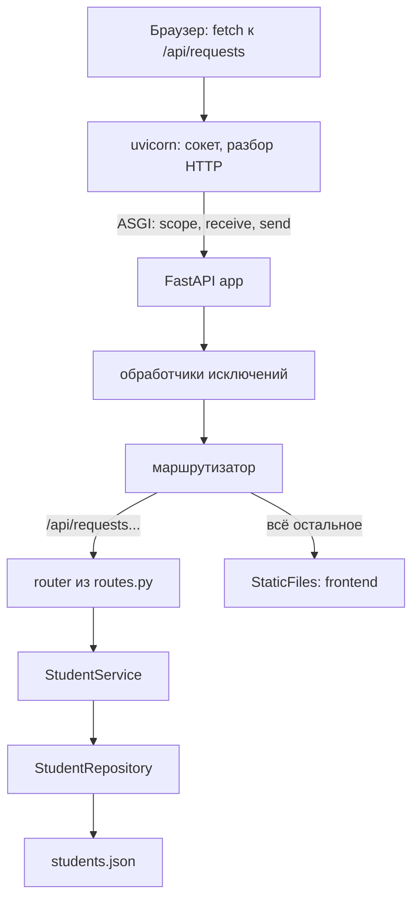

*Схема: один процесс uvicorn обслуживает и API, и HTML/JS клиента. Маршрутизатор сначала пробует маршруты API и только потом отдаёт статику; обработчики исключений оборачивают всё, что ниже, и превращают ошибки в JSON-ответы.*

Цикл «запрос — ответ» на стороне Python выглядит так: сервер получил байты и собрал из них описание запроса; фреймворк нашёл маршрут, извлёк path- и query-параметры, разобрал тело JSON и проверил его по модели; обработчик вызвал бизнес-логику; результат сериализован в JSON с нужным статус-кодом и отправлен клиенту. Между запросами обработчик ничего не помнит — всё долговременное лежит в хранилище (подробнее — [вопрос 16](#q16)).

### Окружение и зависимости

Серверный проект изолируют в **виртуальном окружении** (`python -m venv .venv`): у каждого проекта свой набор пакетов нужных версий, системный Python не засоряется. Зависимости фиксируют в `requirements.txt` (или `pyproject.toml`), чтобы проект одинаково собирался на любой машине.

```bash
python -m venv .venv
source .venv/bin/activate
pip install -r requirements.txt
uvicorn app.main:app --reload   # --reload — только для разработки
```

> [!NOTE]
> **В твоей работе**
>
> Файл: `backend/requirements.txt`, строки 1–2
>
> ```text
> fastapi==0.142.2
> uvicorn[standard]==0.54.0
> ```
>
> Версии закреплены точно, Pydantic приходит транзитивно вместе с FastAPI. Требование условия «REST API на Python» закрывается связкой FastAPI + uvicorn.
>
> Файл: `backend/app/main.py`, строки 30–38
>
> ```python
> app = FastAPI(title="Управление студентами", lifespan=lifespan)
>
> app.add_exception_handler(ServiceError, service_error_handler)
> app.add_exception_handler(RequestValidationError, validation_error_handler)
> app.add_exception_handler(StarletteHTTPException, http_error_handler)
> app.add_exception_handler(Exception, unexpected_error_handler)
>
> app.include_router(router)
> app.mount("/", StaticFiles(directory=FRONTEND_DIR, html=True), name="frontend")
> ```
>
> `app` — тот самый ASGI-объект, который вызывает uvicorn. Здесь собирается всё приложение: обработчики ошибок (механизм — [вопрос 5](#q5)), маршруты API из `routes.py` и статика клиента. Одно приложение отдаёт и API, и фронтенд, поэтому нет отдельного веб-сервера и проблем с CORS. Разбиение на `routes` / `service` / `repository` — [вопрос 10](#q10). Вероятный вопрос: «почему `mount` стоит последним?» — см. ниже.

> [!WARNING]
> **Подводный камень**
>
> Порядок регистрации маршрутов важен: Starlette проверяет их по очереди. `StaticFiles`, смонтированный на `/`, совпадает с любым путём. Если бы `mount` стоял до `include_router`, запросы к `/api/requests` уходили бы в статику и получали 404 вместо данных.

> [!TIP]
> **Могут спросить**
>
> **Чем WSGI отличается от ASGI?** WSGI — синхронный вызов «запрос → ответ», запрос занимает поток целиком. ASGI — асинхронный обмен сообщениями: приложение может ждать I/O, не блокируя поток, и поддерживает WebSocket. FastAPI работает поверх ASGI, Flask — поверх WSGI.
>
> **Зачем нужен uvicorn, если есть FastAPI?** FastAPI не умеет принимать соединения и разбирать HTTP — он только реализует ASGI-приложение. Принимает соединения сервер; в продакшене uvicorn часто запускают за nginx и с несколькими воркерами, но в этой работе несколько воркеров невозможны: данные лежат в памяти одного процесса ([вопрос 16](#q16)).
>
> **Мешает ли GIL этому серверу?** Практически нет: обработчики короткие и почти не нагружают процессор. GIL становится проблемой, когда в обработчике идут тяжёлые вычисления; тогда их выносят в процессы или фоновые задачи.

## Вопрос 2. Backend-фреймворки Python: FastAPI, Flask, Django REST Framework.

Голый ASGI- или WSGI-интерфейс ([вопрос 1](#q1)) даёт только «байты запроса на входе, байты ответа на выходе». Всё остальное — найти обработчик по пути, разобрать JSON, проверить поля, вернуть 404 или 422 в одном формате, отдать документацию — пришлось бы писать в каждом проекте заново. **Фреймворк** берёт эту рутину на себя. Условие разрешает три: FastAPI, Flask и Django REST Framework. Они решают одну задачу, но с разной философией, и от неё зависит, сколько кода напишешь сам.

### Микрофреймворк и «батарейки в комплекте»

**Микрофреймворк** даёт минимальное ядро — маршрутизацию, объект запроса, формирование ответа — и оставляет остальное на выбор разработчика: базу, валидацию, авторизацию подключают отдельными библиотеками. Так устроен Flask. Подход **«батарейки в комплекте»** (batteries included) — фреймворк приносит готовые и согласованные между собой ORM, миграции, аутентификацию, админку. Так устроен Django. FastAPI где-то посередине: ядро небольшое, но валидация, сериализация и документация встроены, потому что выводятся из аннотаций типов.

### Flask

Flask — WSGI-фреймворк. Маршрут объявляется декоратором `@app.route` (или его сокращениями `@app.get`, `@app.post`), тело запроса читается из глобального объекта `request` — это контекстная переменная, привязанная к текущему запросу (подробнее о контексте — [вопрос 7](#q7)). Валидации из коробки нет: проверять поля нужно вручную или через расширения (marshmallow, Flask-Pydantic).

```python
import re
from flask import Flask, jsonify

app = Flask(__name__)
students: dict[str, dict] = {}   # хранилище в памяти, ключ — ИСУ

@app.get("/api/requests/<isu_id>")
def get_student(isu_id: str):
    if not re.fullmatch(r"[0-9]{6}", isu_id):          # формат ИСУ проверяем сами
        return jsonify(error={"status": 422, "code": "invalid_isu_id",
                              "message": "ИСУ ID — 6 цифр"}), 422
    student = students.get(isu_id)
    if student is None:
        return jsonify(error={"status": 404, "code": "not_found",
                              "message": "Студент не найден"}), 404
    return jsonify(student)                             # 200 по умолчанию
```

Код прозрачен, но всё на виду и всё вручную: проверка формата, единый формат ошибки, сериализация. На пяти эндпоинтах с десятком полей это быстро превращается в копипасту.

### Django и Django REST Framework

**Django** — полноценный веб-фреймворк: ORM с миграциями, админка, аутентификация, шаблоны. **Django REST Framework** (DRF) — надстройка для API. Ключевые понятия: **сериализатор** описывает поля, валидирует вход и превращает объект модели в JSON и обратно; **ViewSet** объединяет в одном классе обработчики всех операций над ресурсом (`list`, `retrieve`, `create`, `partial_update`, `destroy`); **роутер** сам строит URL по ViewSet.

```python
# models.py — таблица в БД
class Student(models.Model):
    isu_id = models.CharField(max_length=6, primary_key=True)
    full_name = models.CharField(max_length=100)
    group = models.CharField(max_length=5)
    dormitory = models.CharField(max_length=3)
    check_out = models.DateField(null=True)

# serializers.py — валидация и JSON
class StudentSerializer(serializers.ModelSerializer):
    class Meta:
        model = Student
        fields = "__all__"

# views.py + urls.py — пять операций за несколько строк
class StudentViewSet(viewsets.ModelViewSet):
    queryset = Student.objects.all()
    serializer_class = StudentSerializer

router = DefaultRouter(trailing_slash=False)
router.register("api/requests", StudentViewSet)
```

`GET /api/requests/412345` здесь не написан явно: `ModelViewSet` сам реализует `retrieve`, вернёт 404, если записи нет, и 200 с сериализованным студентом, если есть. В придачу — админка для просмотра студентов и браузерная страница API. Цена — Django ожидает базу данных и свою структуру проекта (`settings.py`, приложения, миграции).

### FastAPI

FastAPI работает на ASGI (поверх Starlette) и строит API из **аннотаций типов**: тип параметра функции говорит, откуда его взять (путь, query-строка, тело) и как проверить. Модели тела — классы Pydantic ([вопрос 4](#q4)); ошибки проверки автоматически превращаются в ответ 422. Зависимости (сервис, сессия БД, текущий пользователь) подключаются через `Depends` ([вопрос 7](#q7)). По тем же аннотациям генерируется схема **OpenAPI** и интерактивная документация Swagger UI на `/docs`. Обработчики можно писать как `async def`, так и обычными `def` — тогда FastAPI выполнит их в пуле потоков ([вопрос 8](#q8)).

```python
@router.get("/{isu_id}", response_model=StudentOut)
def get_student(isu_id: Annotated[str, Path(pattern=r"^[0-9]{6}$")],
                service: Annotated[StudentService, Depends(get_service)]):
    return service.get(isu_id)   # 404 — исключение из сервиса, 422 — от FastAPI
```

Проверка формата ИСУ — одна строка в аннотации, сериализация и фильтрация полей ответа — `response_model`. Декоратор `@router.get` не оборачивает функцию, а регистрирует её как маршрут — [вопрос 6](#q6).

### Сравнение

| | Flask | Django REST Framework | FastAPI |
|:--|:----|:----|:----|
| Интерфейс сервера | WSGI | WSGI, ASGI (Django ≥ 3.0) | ASGI |
| Философия | микрофреймворк | «батарейки в комплекте» | ядро + валидация из типов |
| Валидация входа | вручную или расширения | сериализаторы | Pydantic по аннотациям |
| Работа с БД | на выбор (SQLAlchemy и др.) | Django ORM, миграции | на выбор |
| Документация API | расширения | схема и браузерный API | OpenAPI и Swagger из коробки |
| async | ограниченно (async-обработчики есть, сервер WSGI) | частично, сам DRF в основном синхронный | основной режим |
| Админка, аутентификация | нет, расширения | есть | нет, частично через зависимости |
| Сколько кода на CRUD | больше всего | меньше всего при ORM | средне |

### Как выбирать

Выбор определяется не модой, а тем, что уже дано и что надо получить. Если проект — большой сайт с базой, пользователями и админкой, Django + DRF даст больше всего бесплатно. Если нужен маленький сервис или максимальный контроль над каждой частью — Flask. Если основная работа — JSON-API со строгими контрактами, валидацией входа и документацией для клиентов — FastAPI. Для этой лабораторной важны условия: хранение в памяти или JSON-файле (требование 4) лишает DRF главного преимущества — `ModelViewSet` и `ModelSerializer` опираются на ORM, без базы пришлось бы писать обычные `ViewSet` и сериализаторы вручную. А требование серверной валидации (требование 2) и единый формат ошибок у FastAPI закрываются почти декларативно.

> [!NOTE]
> **В твоей работе**
>
> Файл: `backend/app/routes.py`, строки 8–17 и 30–32
>
> ```python
> router = APIRouter(prefix="/api/requests")
>
> IsuPath = Annotated[str, Path(pattern=r"^[0-9]{6}$")]
>
>
> def get_service(request: Request) -> StudentService:
>     return StudentService(request.app.state.repository)
>
>
> Service = Annotated[StudentService, Depends(get_service)]
> ...
> @router.get("/{isu_id}", response_model=StudentOut)
> def get_student(isu_id: IsuPath, service: Service):
>     return service.get(isu_id)
> ```
>
> Выбран FastAPI. В коде обоснования выбора нет, на защите стоит назвать его по существу: требование 2 (серверная валидация) закрывается Pydantic-моделями и `Path(pattern=...)`, а не ручными `if`; ошибки формата сразу приходят как 422, и их остаётся привести к единому формату в одном обработчике. Алиасы `IsuPath` и `Service` вынесены, чтобы не повторять длинные аннотации в каждом из пяти маршрутов. Обработчик — одна строка: вся логика в сервисе, что требует пункт 5 условия. Вероятный вопрос: «что сделал бы Flask на месте `IsuPath`?» — ручную проверку регулярным выражением в теле обработчика.

> [!WARNING]
> **Подводный камень**
>
> Метод `QUERY` из условия не входит в стандартный набор, и фреймворки поддерживают его по-разному. В FastAPI он объявлен через `@router.api_route("", methods=["QUERY"])` и работает, но Swagger UI его не показывает — проверять его приходится curl'ом. Во Flask достаточно `methods=["QUERY"]` в `@app.route`. В DRF стандартные ViewSet и роутер знают только привычные методы: пришлось бы расширять `http_method_names` и связывать метод с действием вручную.

> [!TIP]
> **Могут спросить**
>
> **Почему FastAPI быстрее Flask?** Сам по себе Python-код не быстрее; выигрыш — в ASGI и асинхронной модели, которая обслуживает много одновременно ждущих соединений без потока на каждое. На коротких синхронных обработчиках, как в этой работе, разница почти незаметна.
>
> **Что такое сериализатор в DRF и что его заменяет в FastAPI?** Сериализатор DRF проверяет входные данные и переводит объекты в JSON и обратно. В FastAPI ту же роль играют Pydantic-модели: `StudentCreate` проверяет тело запроса, `StudentOut` через `response_model` определяет, что уйдёт клиенту.
>
> **Откуда FastAPI знает, что `isu_id` — из пути, а `filters` — из query-строки?** Из сигнатуры: имя параметра совпадает с `{isu_id}` в шаблоне пути, а для модели фильтров явно указано `Query()`. Модель без указаний FastAPI считает телом запроса — так устроен обработчик метода `QUERY`.

## Вопрос 3. Типизация данных в Python и аннотации типов.

Сервис получает `isu_id`. Это строка `"412345"` или число `412345`? Если пришло число, то `students.get(412345)` в словаре со строковыми ключами вернёт `None`, и сервер ответит 404 на студента, который на самом деле есть. Python не сообщит об этом ни при запуске, ни при импорте модуля: ошибка всплывёт только на конкретном запросе. Аннотации типов позволяют записать прямо в коде, какие значения ожидаются. Проверить эту запись могут инструменты: редактор и статический анализатор — до запуска, а библиотеки вроде Pydantic и FastAPI — на входящих данных во время работы.

### Динамическая и строгая типизация

Python типизирован **динамически**: тип есть у значения, а не у переменной, и проверяется в момент операции. Одна и та же переменная может сначала хранить строку, а потом число. При этом типизация **строгая**: несовместимые типы неявно не преобразуются.

```python
isu_id = "412345"
isu_id = 412345              # допустимо: у переменной нет закреплённого типа
"Комната " + 1205            # TypeError: строка и число не складываются
```

В JavaScript, где типизация слабая, последняя строка дала бы `"Комната 1205"`. Python же падает, но только тогда, когда выполнение дойдёт до этой строки.

### Аннотации

**Аннотация типа** (type hint, PEP 484) — запись после двоеточия у переменной или параметра и после `->` у возвращаемого значения:

```python
MAX_STAY_YEARS: int = 9

def find_student(students: dict[str, dict], isu_id: str) -> dict | None:
    return students.get(isu_id)
```

Интерпретатор вычисляет аннотации и сохраняет их в атрибуте `__annotations__` функции или класса, но **не проверяет**. Вызов `find_student(students, 412345)` выполнится без ошибки и вернёт `None`.

> [!WARNING]
> **Подводный камень**
>
> Аннотация — это обещание, а не проверка. Если в проекте не запускается `mypy` (или аналог) и данные не проходят через Pydantic, неверная аннотация ничем не отличается от комментария, который устарел.

### Кто читает аннотации

У аннотаций два потребителя. **Статические анализаторы** — `mypy`, `pyright`, встроенная проверка PyCharm — читают исходный код без запуска и сообщают о несоответствиях: передан `int` вместо `str`, не обработан случай `None`. Поведение программы от этого не меняется. **Библиотеки в рантайме** получают аннотации через `typing.get_type_hints(...)` (с `include_extras=True` — вместе с метаданными `Annotated`) и строят по ним поведение: проверку, преобразование, документацию.

### Основной синтаксис

| Запись | Смысл | Пример из предметной области |
|:--|:----------|:----------|
| `list[dict]` | список словарей | `list_all() -> list[dict]` |
| `dict[str, dict]` | словарь: ключ — строка, значение — словарь | студенты по ИСУ |
| `X \| None`, `Optional[X]` | значение типа `X` или `None` | `check_out: date \| None` — ещё проживает |
| `Literal["sg", "alp", ...]` | одно из перечисленных значений | код общежития |
| `Callable[[dict], dict]` | функция, принимающая `dict` и возвращающая `dict` | функция изменения записи |
| `Annotated[T, m1, m2]` | тип `T` плюс метаданные для библиотек | `Annotated[str, Field(pattern=...)]` |
| `Any` | любой тип, проверка отключена | — |

Встроенные `list[...]` и `dict[...]` в аннотациях работают с Python 3.9 (раньше писали `typing.List`), запись `X | Y` — с 3.10. `Optional[X]` и `X | None` — одно и то же.

### `Annotated` и алиасы типов

**`Annotated`** прикрепляет к типу произвольные метаданные. Python их игнорирует, `mypy` видит только базовый тип, а Pydantic и FastAPI ищут среди метаданных знакомые объекты: `Field(...)` с ограничениями, `BeforeValidator(...)` с функцией предобработки, `Path(...)`, `Query(...)`, `Depends(...)`.

**Алиас типа** — это просто имя, присвоенное выражению типа. Алиас позволяет один раз описать «что такое номер группы» и использовать это описание везде.

**Плохо:**

```python
class StudentCreate(BaseModel):
    group: str = Field(pattern=r"^[A-Z][0-9]{4}$")

class StudentFilter(BaseModel):
    group: str | None = Field(None, pattern=r"^[A-Z][0-9]{4}$")   # то же правило ещё раз
```

**Хорошо:**

```python
Group = Annotated[str, BeforeValidator(strip_upper), Field(pattern=r"^[A-Z][0-9]{4}$")]

class StudentCreate(BaseModel):
    group: Group

class StudentFilter(BaseModel):
    group: Group | None = None
```

В первом варианте правило записано дважды. Если поменять его в одном месте, создание и фильтр начнут принимать разные группы. К тому же нормализация (`" m3301 "` → `"M3301"`) в нём легко теряется.

### Как FastAPI и Pydantic превращают аннотации в проверку

Когда приложение стартует, FastAPI разбирает сигнатуру каждого обработчика и по аннотациям решает, откуда брать параметр. Если имя параметра есть в шаблоне пути, это path-параметр. Если тип — подкласс `BaseModel`, параметр читается из JSON-тела. Простой тип (`str`, `int`, `bool`) берётся из query-строки. `Annotated[..., Depends(...)]` означает зависимость, а `Annotated[..., Path(...)]` или `Query(...)` явно задаёт источник и ограничения. Из тех же аннотаций строится OpenAPI-схема для Swagger.

Pydantic по аннотациям модели один раз, при создании класса, собирает валидатор. На каждом запросе валидатор проверяет данные и **приводит** их к нужному типу: в нестрогом (lax) режиме строка `"true"` из query-строки становится `True`, а `"2024-09-01"` — объектом `date`. Все найденные ошибки собираются в один список, и FastAPI отвечает 422. Когда приведение нежелательно, используют строгие типы: `StrictBool` принимает только `true`/`false`, без `1`, `"yes"` и `"on"`. Подробнее о том, как ошибки превращаются в ответ, — [вопрос 15](#q15).

> [!NOTE]
> **В твоей работе**
>
> Файл: `backend/app/schemas.py`, строки 7–50
>
> ```python
> DormitoryCode = Literal["sg", "alp", "bel", "len", "msg"]
> ...
> IsuId = Annotated[str, Field(pattern=r"^[0-9]{6}$")]
> FullName = Annotated[
>     str,
>     BeforeValidator(collapse_spaces),
>     Field(min_length=5, max_length=100, pattern=rf"^{NAME_WORD}(?: {NAME_WORD})+$"),
> ]
> ...
> Group = Annotated[str, BeforeValidator(strip_upper), Field(pattern=r"^[A-Z][0-9]{4}$")]
> Room = Annotated[str, Field(pattern=r"^[1-9][0-9]{3}$")]
> IsoDate = Annotated[date, BeforeValidator(require_iso_date)]
> ```
>
> Все правила полей студента (требование 2 — серверная валидация) записаны как алиасы `Annotated` и переиспользуются в `StudentCreate`, `StudentUpdate` и `StudentFilter`. `IsoDate` нужен потому, что в нестрогом режиме Pydantic принимает для `date` не только строку `YYYY-MM-DD`, но и, например, число как Unix-время. `BeforeValidator` срабатывает раньше и пропускает только строку нужного формата.
>
> Файл: `backend/app/routes.py`, строки 10–17
>
> ```python
> IsuPath = Annotated[str, Path(pattern=r"^[0-9]{6}$")]
>
> def get_service(request: Request) -> StudentService:
>     return StudentService(request.app.state.repository)
>
> Service = Annotated[StudentService, Depends(get_service)]
> ```
>
> Здесь аннотации управляют уже не моделью, а маршрутом: `IsuPath` проверяет ИСУ в URL, а `Service` объявляет зависимость (подробнее — [вопрос 7](#q7)). В `repository.py` аннотации чисто документирующие: `students: dict[str, dict]` (строка 12), `change: Callable[[dict], dict]` (строка 53). В рантайме их никто не проверяет. Преподаватель может спросить, что произойдёт, если передать в `update` не функцию, — ответ: `TypeError` при вызове `change(current)`, аннотация от этого не защищает.

> [!TIP]
> **Могут спросить**
>
> **В `StudentUpdate` написано `full_name: FullName = None`, но `FullName` — это `str`. Это ошибка?** С точки зрения типов да, и `mypy` укажет на несовместимое значение по умолчанию. Но Pydantic не проверяет значения по умолчанию, поэтому отсутствие поля проходит, а явный `"full_name": null` от клиента проверяется как `str` и даёт 422. Получается, что запрет «обнулять ФИО» выражен этой неточной аннотацией. Честнее было бы написать `FullName | None = None` и запретить `None` отдельным валидатором.
>
> **`Optional[str]` значит «необязательное поле»?** Нет. `Optional[str]` значит только «строка или `None`». Обязательность в Pydantic задаёт наличие значения по умолчанию: поле `check_out: date | None` без `= None` обязательно, просто `null` в нём допустим.
>
> **Почему в фильтре `is_foreign: bool | None`, а при создании — `StrictBool`?** Query-строка всегда текстовая, и `?is_foreign=true` приходит как строка `"true"`. Строгий тип отверг бы её. В JSON-теле POST есть настоящий `true`, поэтому там строгость отсекает `1` и `"yes"`.

## Вопрос 4. Модели данных: dataclass, Pydantic-модели, словари и классы.

Студент — это девять полей: ИСУ, ФИО, группа, общежитие, комната, даты заселения и выселения, признак иностранца, заметки. Через бэкенд эти данные проходят по цепочке: JSON из запроса, бизнес-правила, хранилище, JSON в ответе. На каждом шаге нужно решить, чем их представить в коде. Варианты расположены от самого свободного до самого строгого: словарь, обычный класс, `dataclass`, Pydantic-модель. Чем строже представление, тем раньше ловятся ошибки и тем больше кода пишет за тебя библиотека.

### Словарь

**Словарь** — самое прямое представление: JSON-объект разбирается в `dict` и обратно без посредников.

```python
student = {"isu_id": "412345", "full_name": "Иванов Иван Иванович", "check_out": None}
student["chek_out"]          # KeyError — опечатка обнаружится только при выполнении
student["room"] = 1205       # число вместо строки — никто не заметит
```

Словарь ничего не гарантирует: ни набора ключей, ни типов значений. IDE не подсказывает ключи, а опечатка становится ошибкой только на той строке, которая выполнится. Частично это исправляет **`TypedDict`**: он описывает ключи и типы для `mypy`, но в рантайме остаётся обычным `dict` без проверок.

```python
class StudentDict(TypedDict):
    isu_id: str
    check_out: str | None    # mypy поймает student["chek_out"], интерпретатор — нет
```

### Обычный класс

Класс фиксирует набор атрибутов и позволяет добавить поведение — методы. Но всё служебное придётся написать руками.

```python
class Student:
    def __init__(self, isu_id, full_name, check_in, check_out=None):
        self.isu_id = isu_id
        self.full_name = full_name
        self.check_in = check_in
        self.check_out = check_out

    def is_living(self):
        return self.check_out is None
```

Без собственных `__repr__` и `__eq__` объект печатается как `<Student object at 0x7f...>`, а два студента с одинаковым ИСУ не равны, потому что `==` сравнивает идентичность объектов. Проверки типов здесь тоже нет.

### `@dataclass`

Декоратор **`@dataclass`** (о декораторах — [вопрос 6](#q6)) читает аннотации полей класса (см. [вопрос 3](#q3)) и генерирует `__init__`, `__repr__` и `__eq__` по значениям полей. Есть параметры: `frozen=True` делает объект неизменяемым, `field(default_factory=list)` задаёт изменяемые значения по умолчанию.

```python
@dataclass
class Student:
    isu_id: str
    full_name: str
    check_in: date
    check_out: date | None = None
    notes: str = ""

Student(isu_id=412345, full_name="", check_in="вчера")   # создаётся без ошибок
```

`dataclass` **не валидирует**: аннотации для него — только список полей. Он хорош для внутренних данных, которые программа создаёт сама, но не для данных извне.

### Pydantic `BaseModel`

**Pydantic-модель** тоже описывается аннотациями, но при создании объекта проверяет и приводит каждое поле. Если что-то не так, она выбрасывает `ValidationError` со списком всех ошибок сразу.

```python
class Student(BaseModel):
    model_config = ConfigDict(extra="forbid")   # неизвестные поля — ошибка
    isu_id: str = Field(pattern=r"^[0-9]{6}$")
    check_in: date
    check_out: date | None = None

Student.model_validate({"isu_id": "412345", "check_in": "2024-09-01"})
# check_in стал date(2024, 9, 1)
Student.model_validate({"isu_id": "41", "check_in": "вчера", "room": "1205"})
# ValidationError: три ошибки — шаблон isu_id, дата, лишнее поле room
```

Основные операции: `model_validate(dict)` и `model_validate_json(str)` — вход; `model_dump()` — в словарь с объектами Python; `model_dump(mode="json")` — в словарь только с JSON-типами (даты становятся строками); `model_dump_json()` — сразу в строку. У `model_dump` есть фильтры `exclude_unset` (только поля, которые клиент прислал) и `exclude_none`. Поведение модели настраивается через `model_config = ConfigDict(...)`. По умолчанию `extra="ignore"` молча отбрасывает лишние поля, `extra="forbid"` превращает их в ошибку. Сериализация подробнее — [вопрос 14](#q14).

### Сравнение

| Вариант | Проверка при создании | `__init__`, `__repr__`, `__eq__` | В JSON и обратно | Где уместен |
|:--|:------|:------|:------|:----------|
| `dict` | нет | не нужны | напрямую, `json` | внутренние данные, хранение |
| `TypedDict` | только `mypy` | не нужны | напрямую | словари с известной структурой |
| обычный класс | вручную | вручную | вручную | объекты с поведением |
| `@dataclass` | нет | генерируются | `asdict()` + `json`, обратно вручную | внутренние структуры |
| `BaseModel` | да, с приведением | генерируются | встроено | граница с внешним миром: API, файлы, конфиги |

### Разные модели под разные операции

Одна и та же сущность на разных операциях выглядит по-разному. При создании все поля обязательны и `isu_id` задаёт клиент. При изменении любое поле можно не присылать, а `isu_id` менять нельзя. В ответе отдаётся то, что хранится, без входных правил. Фильтр состоит из подмножества полей, и каждое из них необязательно. Поэтому принято заводить отдельные модели: **Create**, **Update**, **Out**, **Filter**.

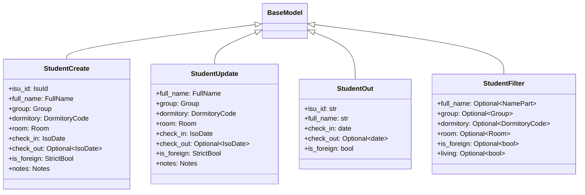

*Схема: в `StudentUpdate` нет `isu_id`, поэтому при `extra="forbid"` попытка сменить идентификатор даёт 422, а не тихое переименование. Входные модели используют строгие алиасы, `StudentOut` — простые типы: данные к этому моменту уже проверены. Фильтр содержит вычисляемое поле `living`, которого у студента нет. У `StudentOut` для краткости показаны не все поля.*

**Плохо:**

```python
@router.patch("/{isu_id}")
def update_student(isu_id: str, changes: StudentCreate): ...   # одна модель на всё
```

**Хорошо:**

```python
@router.patch("/{isu_id}", response_model=StudentOut)
def update_student(isu_id: IsuPath, changes: StudentUpdate): ...
```

С общей моделью PATCH требует прислать все поля, то есть по сути становится PUT, и разрешает передать в теле `isu_id`, который расходится с ИСУ в URL. Кроме того, ответ отдаёт всё, что лежит в объекте. `response_model=StudentOut` работает как белый список: перед отправкой FastAPI пропускает результат через `StudentOut`, и лишние ключи внутреннего словаря отбрасываются.

> [!NOTE]
> **В твоей работе**
>
> Файл: `backend/app/schemas.py`, строки 54–78
>
> ```python
> class StudentCreate(BaseModel):
>     model_config = ConfigDict(extra="forbid")
>
>     isu_id: IsuId
>     full_name: FullName
>     ...
>     check_out: IsoDate | None = None
>     is_foreign: StrictBool
>     notes: Notes = ""
>
>
> class StudentUpdate(BaseModel):
>     model_config = ConfigDict(extra="forbid")
>
>     full_name: FullName = None
>     ...
>     check_out: IsoDate | None = None
>     is_foreign: StrictBool = None
>     notes: Notes = None
> ```
>
> Модель студента из ЛР1 (требование «та же модель») описана один раз набором алиасов, а четыре класса собирают её под операции. Только у `check_out` в `StudentUpdate` тип допускает `None`: явный `null` в нём означает «выселение отменено». Для остальных полей `null` даёт 422 (подробности тонкости — [вопрос 3](#q3)).
>
> Файл: `backend/app/service.py`, строки 103–107
>
> ```python
> def update(self, isu_id: str, changes: StudentUpdate) -> dict:
>     fields = changes.model_dump(mode="json", exclude_unset=True)
>
>     if not fields:
>         raise EmptyUpdateError("Нет полей для обновления")
> ```
>
> `exclude_unset=True` отличает «поле не прислали» от «прислали `null`», и на этом держится частичное обновление. С `exclude_none=True` невозможно было бы снять дату выселения. В `find` (строка 82), наоборот, стоит `exclude_none=True`: фильтр со значением `None` означает «не фильтровать».

> [!CAUTION]
> **Расхождение с практикой**
>
> Pydantic-модели есть только на границах. В `create` объект сразу превращается в словарь (`data.model_dump(mode="json")`, `service.py`, строка 96), репозиторий хранит `dict[str, dict]`, правила работают со строковыми ключами (`student["check_out"]`), а даты внутри хранятся строками и в `merge` разбираются обратно через `date.fromisoformat`. Получается граница «модель на входе — словарь внутри — модель на выходе», и внутри типобезопасность теряется: опечатку в ключе не поймает ни IDE, ни `mypy`. В больших проектах внутри держат доменные объекты (`dataclass` или ту же модель) и переводят их в словарь только при записи. На защите это решение можно обосновать так: хранилище — JSON-файл, словарь в формате JSON пишется в файл без преобразований, полей мало, и вся проверка уже выполнена на входе. Цена такого решения — двойное преобразование дат и отсутствие подсказок типов внутри сервиса.

> [!TIP]
> **Могут спросить**
>
> **Почему не `dataclass`?** `dataclass` не проверяет данные, а требование 2 — серверная валидация. FastAPI умеет принимать и `dataclass`, проверяя его через Pydantic, но у `BaseModel` есть `ConfigDict(extra="forbid")` и `model_dump(exclude_unset=True)`, без которых PATCH пришлось бы писать вручную.
>
> **Зачем `StudentOut`, если сервис и так возвращает словарь студента?** `StudentOut` задаёт контракт ответа: перед отправкой FastAPI проверяет по нему результат, отбрасывает лишние ключи и строит из него схему ответа в Swagger. Если внутреннее хранилище получит служебное поле, оно не уйдёт клиенту.
>
> **Почему в `StudentOut` нет `extra="forbid"` и проверок формата?** Эта модель описывает данные, которые сервер уже проверил при записи. Лишние ключи здесь надо молча отбросить (`extra="ignore"` по умолчанию), а не превращать их в ошибку 500.

## Вопрос 5. Исключения в Python и их обработка в Backend-приложениях.

Запрос `PATCH /api/requests/412345` проходит несколько уровней вызовов: маршрут вызывает сервис, сервис вызывает репозиторий, репозиторий вызывает функцию слияния, а та проверяет даты. Что-то может пойти не так на любом уровне: студента нет, дата выселения раньше даты заселения, файл не записался. Если сообщать об ошибке возвращаемым значением (`None`, `False`, код ошибки), каждая функция в цепочке должна проверить результат вызова и передать его выше. Одна пропущенная проверка — и программа продолжает работать с неверными данными. **Исключение** решает это иначе: оно прерывает выполнение в месте ошибки и поднимается по стеку вызовов, пока не встретит код, который умеет его обработать. Промежуточным функциям об ошибке знать не нужно.

### Механика: `try`, `except`, `else`, `finally`

```python
import json

def load_students(path):
    try:
        text = path.read_text(encoding="utf-8")   # здесь может быть OSError
        records = json.loads(text)                # здесь — json.JSONDecodeError
    except FileNotFoundError:
        return []                                 # файла нет — начинаем с пустого списка
    except json.JSONDecodeError as error:
        print(f"Битый JSON, строка {error.lineno}")
        raise                                     # пробросить то же исключение дальше
    else:
        print(f"Загружено студентов: {len(records)}")  # только если ошибок не было
        return records
    finally:
        print("Попытка загрузки завершена")       # выполняется всегда
```

Блоки `except` проверяются сверху вниз, и срабатывает первый подходящий. Подходящий — тот, в котором указан класс исключения или любой из его предков. Поэтому более узкие классы пишут выше: `except Exception` в первой строке перехватил бы всё, и до остальных блоков дело бы не дошло. `else` выполняется, только если в `try` не было исключения. Туда выносят код, ошибки которого не должны попасть под эти `except`. `finally` выполняется в любом случае: при нормальном завершении, при `return` и при исключении. В нём освобождают ресурсы.

Конструкция `with` — тот же `try/finally` в короткой записи: `with self.lock:` гарантирует, что блокировка будет отпущена, даже если внутри блока возникло исключение.

### Иерархия встроенных исключений

Исключения — обычные классы, и они образуют дерево наследования.

| Класс | Что означает | Ловить в приложении? |
|:--|:-----------|:--|
| `BaseException` | корень иерархии | нет |
| `SystemExit`, `KeyboardInterrupt` | `sys.exit()`, Ctrl+C | нет: это сигналы остановки, а не ошибки |
| `Exception` | база для всех «обычных» ошибок | только на самом верхнем уровне |
| `ValueError`, `TypeError` | неверное значение или тип | да, узко |
| `LookupError` → `KeyError`, `IndexError` | нет ключа или индекса | да, узко |
| `OSError` → `FileNotFoundError`, `PermissionError` | ошибки ввода-вывода | да |

`except Exception` ловит всё, кроме сигналов остановки. Голый `except:` равен `except BaseException:` и ловит даже Ctrl+C.

**Плохо:**

```python
try:
    student = students[isu_id]
    student["room"] = new_room.strip()
except Exception:
    return None          # «студента нет» — а может, new_room оказался None
```

**Хорошо:**

```python
try:
    student = students[isu_id]
except KeyError:
    return None          # перехватываем ровно ту ошибку, которую ожидаем
student["room"] = new_room.strip()
```

Широкий `except` склеивает ожидаемую ситуацию («такого ИСУ нет») с ошибкой в программе (`AttributeError` у `None`). Баг превращается в тихое «не найдено», и найти его потом очень трудно. Правило такое: в `try` держи минимум кода и лови только те исключения, которые знаешь, как обработать.

### Свои исключения и цепочка причин

Встроенных классов не хватает, чтобы выразить смысл предметной области: `ValueError` не говорит, что именно нарушено — уникальность ИСУ или правило дат. Поэтому заводят свои классы и выстраивают из них иерархию: общий базовый класс для всех ошибок слоя и наследники под конкретные ситуации. Вызывающий код может поймать конкретный класс (`except ConflictError`) или все ошибки слоя сразу (`except ServiceError`).

Когда низкоуровневую ошибку переводят в ошибку более высокого уровня, используют `raise ... from error`. Новое исключение сохраняет исходное в атрибуте `__cause__`, а трейсбэк показывает оба исключения, разделённые строкой «The above exception was the direct cause of the following exception». Без `from` Python тоже запомнит исходное исключение (в `__context__`), но подпишет его как «During handling of the above exception, another exception occurred». Такая подпись выглядит как сбой в самом обработчике. Запись `raise ... from None` намеренно скрывает причину.

### Исключения в бэкенде: перевод в HTTP в одном месте

В веб-приложении исключение — естественный способ прервать обработку запроса из глубины слоёв. Сервис обнаружил, что студента нет, и бросил `NotFoundError`. Маршрут и всё, что лежит выше, не пишут ни одной проверки. Исключение долетает до фреймворка, тот находит зарегистрированный **обработчик исключений** (exception handler) и превращает исключение в HTTP-ответ.

Ключевой принцип здесь — **доменные исключения не знают про HTTP**. Сервис сообщает, *что* случилось («конфликт», «не найдено»), а какой код и какое тело ответа этому соответствуют, решает отдельный модуль. Тогда сервис можно вызвать из CLI-скрипта или теста без веб-сервера, а формат ошибок меняется в одном файле. Как слои зависят друг от друга, разобрано в [вопросе 10](#q10).

**Плохо:**

```python
from fastapi import HTTPException

def create(self, data):
    if data.isu_id in self.students:
        raise HTTPException(409, "Дубль ИСУ")   # сервис знает про HTTP
```

**Хорошо:**

```python
def create(self, data):
    if data.isu_id in self.students:
        raise ConflictError(f"Студент с ИСУ {data.isu_id} уже есть", "isu_id")
# а соответствие ConflictError -> 409 задано в обработчике
```

Обработчик в FastAPI (а точнее, в Starlette, на котором FastAPI построен) регистрируется вызовом `app.add_exception_handler(Класс, функция)` или декоратором `@app.exception_handler(Класс)`. Когда исключение долетает до фреймворка, Starlette проходит по **MRO** его класса (`type(exc).__mro__` — цепочка «класс → родитель → … → `object`») и берёт первый класс, для которого есть обработчик. Поэтому одного обработчика на `ServiceError` хватает на всех его наследников. Обработчик на `Exception` стоит особняком: он вызывается последним, на самом внешнем уровне приложения, и отвечает кодом 500.

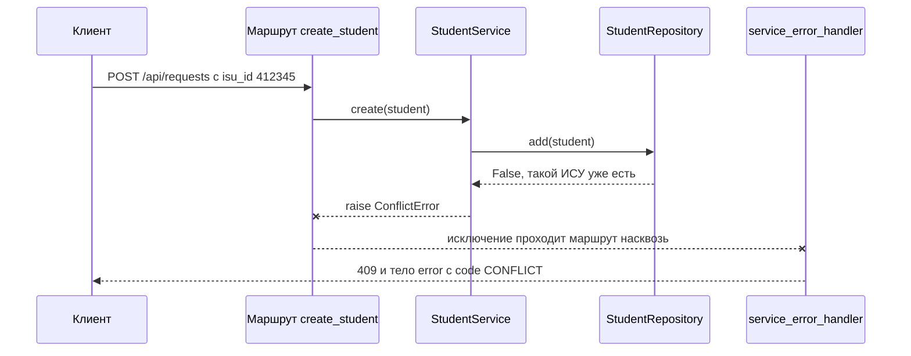

*Схема: в маршруте нет ни `try`, ни `if` — исключение пролетает через него. Код 409 и формат тела определяются только в обработчике, поэтому все ошибки сервиса выглядят для клиента одинаково.*

### Необработанное исключение и код 500

Если исключение не ожидалось (`KeyError` из-за бага, сбой диска), клиент всё равно должен получить корректный ответ: код 500 и тело в том же формате, что у остальных ошибок. Трейсбэк в ответ не попадает никогда. Он раскрывает пути к файлам, имена модулей и куски данных, а клиенту ничем не помогает. Подробности пишутся в лог сервера, клиент получает короткое сообщение. Если обработчика на `Exception` нет, Starlette отдаст текстовый `Internal Server Error`, без единого формата ([вопрос 15](#q15)).

> [!WARNING]
> **Подводный камень**
>
> Обработчик на `Exception` не «съедает» ошибку. Starlette отправляет клиенту ответ этого обработчика, а затем пробрасывает исключение дальше, серверу. Поэтому uvicorn печатает трейсбэк в консоль, хотя сам обработчик ничего не логирует. Логирование, на которое можно положиться (`logger.exception(...)`), стоит писать явно.

> [!NOTE]
> **В твоей работе**
>
> Файл: `backend/app/service.py`, строки 7–27
>
> ```python
> class ServiceError(Exception):
>     def __init__(self, message: str, field: str | None = None):
>         super().__init__(message)
>         self.message = message
>         self.field = field
>
>
> class NotFoundError(ServiceError):
>     pass
>
>
> class ConflictError(ServiceError):
>     pass
> ...
> class RuleViolationError(ServiceError):
>     pass
> ```
>
> Иерархия живёт в слое сервиса и ничего не знает про HTTP. `field` нужен, чтобы клиент подсветил конкретное поле формы. Соответствие кодам задано отдельно:
>
> Файл: `backend/app/errors.py`, строки 8–13 и 53–56
>
> ```python
> SERVICE_ERRORS = {
>     NotFoundError: (404, "NOT_FOUND"),
>     ConflictError: (409, "CONFLICT"),
>     EmptyUpdateError: (400, "BAD_REQUEST"),
>     RuleViolationError: (422, "VALIDATION_ERROR"),
> }
> ...
> def service_error_handler(request: Request, exc: ServiceError) -> JSONResponse:
>     status, code = SERVICE_ERRORS[type(exc)]
>     details = [] if exc.field is None else [{"field": exc.field, "message": exc.message}]
>     return error_response(status, code, exc.message, details)
> ```
>
> Регистрация — `backend/app/main.py`, строки 32–35: четыре обработчика на `ServiceError`, `RequestValidationError`, `StarletteHTTPException` и `Exception`. Так закрыты требование единого формата ошибок с кодами 400–500 и требование разнести маршруты, логику и работу с данными по разным файлам: `errors.py` зависит от `service.py`, а не наоборот. Обработчик на `Exception` (строки 95–96 `errors.py`) отдаёт 500 с общим сообщением без подробностей.
>
> Цепочка причин — в `backend/app/repository.py`, строки 20–26: при битом `students.json` `json.JSONDecodeError` превращается в `RuntimeError(...) from error`. Исключение возникает в `lifespan`, поэтому сервер не стартует, а файл остаётся нетронутым. Это осознанный выбор: молча начать с пустого списка значило бы затереть данные при первой же записи.
>
> Хороший пример `with` как `finally` — `repository.update`: функция `merge` вызывается под `with self.lock:`. Если `check_dates` внутри неё бросит `RuleViolationError`, блокировка всё равно освободится, а словарь не изменится: присваивание `self.students[isu_id] = student` стоит после вызова `change(current)`.

> [!CAUTION]
> **Расхождение с практикой**
>
> `SERVICE_ERRORS[type(exc)]` ищет точный класс, хотя сам Starlette выбирает обработчик по MRO. Если завести наследника, например `class RoomFullError(ConflictError)`, и забыть добавить его в словарь, в обработчике возникнет `KeyError`, и клиент получит 500 вместо 409. Надёжнее искать по MRO (`for cls in type(exc).__mro__`) или хранить код как атрибут класса (`status = 409`). На защите стоит признать это ограничение: для четырёх классов без дальнейшего наследования решение работает.

> [!TIP]
> **Могут спросить**
>
> **Почему не бросать `HTTPException` прямо из сервиса — так короче?** Тогда слой бизнес-логики зависит от веб-фреймворка: его нельзя переиспользовать в скрипте или тесте без HTTP, а решение «какой код вернуть» расползается по всему коду. `HTTPException` уместен в маршрутах, но в работе и там не нужен: всё переводит обработчик.
>
> **В каком порядке писать несколько `except`?** От узких классов к широким: Python берёт первый подходящий блок, и `except Exception` выше `except KeyError` сделает второй недостижимым. По той же логике — по иерархии классов — Starlette выбирает обработчик через MRO.
>
> **Что увидит клиент, если в обработчике маршрута случится `ZeroDivisionError`?** Сработает `unexpected_error_handler`: код 500, тело `{"error": {"code": "INTERNAL_ERROR", ...}}` без трейсбэка. Сам трейсбэк окажется в консоли uvicorn, потому что Starlette пробрасывает исключение серверу после отправки ответа.

## Вопрос 6. Декораторы и их применение в веб-фреймворках.

Веб-приложению нужно связать URL с функцией-обработчиком, а ещё к десяткам обработчиков добавить общее поведение: проверку прав, журналирование, замер времени, кэш. Если писать это внутри каждого обработчика, код дублируется, а сама функция «получить студента по ИСУ» тонет в служебных строках. Нужен способ сказать «эта функция обрабатывает `GET /api/requests/{isu_id}`» или «эту функцию нужно замерять» одной строкой рядом с её объявлением, не трогая тело. В Python для этого есть **декораторы**.

### Функции как объекты и замыкания

В Python функция — обычный объект: её можно положить в переменную, передать аргументом, вернуть из другой функции. Функция, объявленная внутри другой, видит переменные внешней даже после того, как внешняя завершилась, — это **замыкание** (подробнее про области видимости — [вопрос 7](#q7)).

```python
def make_dorm_check(code):
    def check(student):
        return student["dormitory"] == code   # code взят из внешней функции
    return check

is_alp = make_dorm_check("alp")
is_alp({"isu_id": "412345", "dormitory": "alp"})   # True
```

### Декоратор: функция в функцию

**Декоратор** — вызываемый объект, который принимает функцию и возвращает функцию (ту же или новую). Запись с `@` — только синтаксис:

```python
@log_calls
def get_student(isu_id): ...

# то же самое, что:
def get_student(isu_id): ...
get_student = log_calls(get_student)
```

Декоратор применяется один раз — в момент объявления функции, то есть при импорте модуля, а не при каждом вызове. Если декораторов несколько, они применяются снизу вверх: ближайший к `def` — первым.

Типичный декоратор-обёртка возвращает новую функцию `wrapper`, которая делает что-то до и после вызова исходной:

```python
import functools
import time

def timed(func):
    @functools.wraps(func)                 # сохранить имя, docstring и сигнатуру
    def wrapper(*args, **kwargs):
        start = time.perf_counter()
        try:
            return func(*args, **kwargs)
        finally:
            ms = (time.perf_counter() - start) * 1000
            print(f"{func.__name__}: {ms:.1f} мс")
    return wrapper

@timed
def get_student(isu_id: str) -> dict:
    return repository.get(isu_id)
```

`functools.wraps` копирует в `wrapper` метаданные исходной функции (`__name__`, `__doc__`, `__module__`) и добавляет ссылку `__wrapped__` на оригинал.

> [!WARNING]
> **Подводный камень**
>
> В FastAPI `functools.wraps` не косметика. Фреймворк читает сигнатуру обработчика, чтобы понять, какие параметры брать из пути, из query-строки и из тела. Без `wraps` он увидит сигнатуру `wrapper(*args, **kwargs)` и будет ждать query-параметры `args` и `kwargs`, а `isu_id` пропадёт. С `wraps` `inspect.signature` идёт по `__wrapped__` и находит настоящие параметры. Ещё одно правило: обёртка для `async def`-обработчика сама должна быть `async def` и делать `await func(...)`, иначе вместо результата вернётся объект корутины.

### Декоратор с параметрами

Если декоратору нужны настройки (`@timed(threshold_ms=100)`), добавляется ещё один уровень: внешняя функция — **фабрика** — принимает параметры и возвращает уже настоящий декоратор.

```python
def timed(threshold_ms: float):
    def decorator(func):
        @functools.wraps(func)
        def wrapper(*args, **kwargs):
            start = time.perf_counter()
            result = func(*args, **kwargs)
            ms = (time.perf_counter() - start) * 1000
            if ms > threshold_ms:                       # threshold_ms — из замыкания
                print(f"медленно: {func.__name__} {ms:.0f} мс")
            return result
        return wrapper
    return decorator

@timed(threshold_ms=100)    # сначала вызов timed(100), потом decorator(update_student)
def update_student(isu_id, changes): ...
```

Отличить на глаз просто: если после имени декоратора стоят скобки, это фабрика.

### Декораторы-регистраторы

Не каждый декоратор оборачивает функцию. В веб-фреймворках самые частые декораторы — **регистраторы**: они записывают функцию в некоторую таблицу и возвращают её же без изменений. `@router.get("/{isu_id}")` в FastAPI устроен именно так: `router.get(...)` — фабрика, которая запоминает путь и параметры ответа; возвращённый ею декоратор вызывает `router.add_api_route(путь, функция, ...)` и отдаёт функцию обратно. После этого `get_student` по-прежнему можно вызвать напрямую, например в тесте.

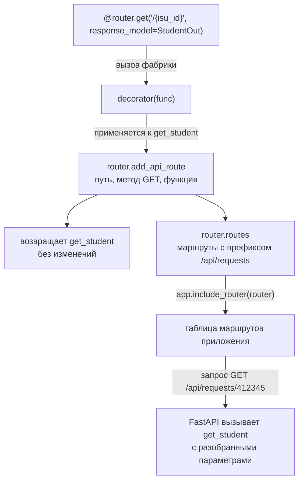

*Схема: декоратор срабатывает один раз при импорте `routes.py` и только заполняет таблицу; при каждом запросе вызывается уже сама функция, найденная по методу и пути. Поэтому маршрут, объявленный в модуле, который никто не импортировал, не существует.*

Flask устроен так же (`@app.route("/api/requests/<isu_id>")`), DRF — иначе: маршруты задаются классами `ViewSet` и роутером, а декораторы (`@api_view`, `@action`) встречаются точечно. Сравнение фреймворков — [вопрос 2](#q2), сопоставление пути с обработчиком — [вопрос 13](#q13).

### Другие применения

| Декоратор | Тип | Что делает |
|:--|:--|:-----------|
| `@router.get`, `@app.route` | регистратор | связывает метод и путь с обработчиком |
| `@app.middleware("http")` | регистратор | добавляет функцию, через которую проходит каждый запрос |
| `@login_required` (Flask-Login) | обёртка | проверяет вход до вызова обработчика, иначе 401/редирект |
| `@functools.lru_cache` | обёртка | кэширует результат по аргументам |
| `@contextmanager`, `@asynccontextmanager` | преобразователь | делает из генератора контекстный менеджер |
| `@property`, `@staticmethod`, `@classmethod` | дескриптор | меняют поведение атрибута класса |
| `@dataclass` | декоратор класса | генерирует `__init__`, `__repr__`, `__eq__` ([вопрос 4](#q4)) |

`@asynccontextmanager` берёт асинхронную генераторную функцию с одним `yield` и превращает её в объект, пригодный для `async with`: код до `yield` выполняется при входе, код после — при выходе. FastAPI использует это для **lifespan**: до `yield` — запуск приложения, после — остановка.

**Плохо:**

```python
@router.get("/{isu_id}")
def get_student(isu_id: IsuPath, service: Service):
    start = time.perf_counter()
    student = service.get(isu_id)
    print("get_student", time.perf_counter() - start)
    return student
```

**Хорошо:**

```python
@app.middleware("http")
async def timing(request, call_next):
    start = time.perf_counter()
    response = await call_next(request)
    print(request.method, request.url.path, time.perf_counter() - start)
    return response
```

В первом варианте замер скопирован в каждый обработчик и смешан с логикой. Своим декоратором `@timed` это лечится для выбранных функций; если замерять нужно все запросы, правильнее middleware — его тоже регистрирует декоратор, и он видит запрос целиком, включая время разбора тела и сериализации ответа.

> [!NOTE]
> **В твоей работе**
>
> Файл: `backend/app/routes.py`, строки 20–47
>
> ```python
> @router.get("", response_model=list[StudentOut])
> def list_students(filters: Annotated[StudentFilter, Query()], service: Service):
>     return service.find(filters)
>
>
> @router.api_route("", methods=["QUERY"], response_model=list[StudentOut])
> def query_students(filters: StudentFilter, service: Service):
>     return service.find(filters)
> ...
> @router.post("", status_code=201, response_model=StudentOut)
> def create_student(student: StudentCreate, service: Service):
>     return service.create(student)
> ...
> @router.delete("/{isu_id}", status_code=204)
> def delete_student(isu_id: IsuPath, service: Service) -> None:
>     service.delete(isu_id)
> ```
>
> Все шесть обязательных запросов условия объявлены декораторами-регистраторами. Метод `QUERY` у `APIRouter` своего сокращения не имеет, поэтому использован общий `@router.api_route(..., methods=["QUERY"])` — `get`, `post` и прочие сами являются его частными случаями. Параметры декоратора (`status_code=201`, `204`, `response_model`) описывают ответ, а не логику: обработчик просто возвращает словарь, а FastAPI по `response_model=StudentOut` проверяет и фильтрует его поля.
>
> Файл: `backend/app/main.py`, строки 22–27
>
> ```python
> @asynccontextmanager
> async def lifespan(app: FastAPI):
>     repository = StudentRepository()
>     repository.load()
>     app.state.repository = repository
>     yield
> ```
>
> Здесь декоратор-преобразователь: до `yield` хранилище создаётся и читает `students.json`, после `yield` кода нет — сохранять при остановке нечего, файл пишется при каждом изменении. Зачем хранилище кладётся в `app.state` — [вопрос 7](#q7). Своих декораторов-обёрток в работе нет. Вероятный вопрос: «что вернёт `@router.get` и можно ли вызвать `get_student` без сервера?» — ту же функцию; да, передав `isu_id` и сервис вручную.

> [!TIP]
> **Могут спросить**
>
> **Когда выполняется код декоратора?** Сам декоратор — один раз, при объявлении функции, то есть при импорте модуля. Код обёртки `wrapper` — при каждом вызове. Поэтому регистрация маршрутов происходит при `from app.routes import router` в `main.py`.
>
> **Чем `@router.get("/x")` отличается от `@timed`?** `router.get("/x")` — фабрика: сначала вызывается с параметрами и возвращает декоратор. Кроме того, это регистратор: он не оборачивает функцию, а запоминает её в таблице маршрутов и возвращает без изменений. `@timed` без скобок — сам декоратор-обёртка.
>
> **Зачем `functools.wraps`?** Без него обёртка теряет имя, docstring и сигнатуру исходной функции. Для FastAPI это ломает разбор параметров: фреймворк читает сигнатуру, и через `__wrapped__` находит настоящие параметры только при наличии `wraps`.

## Вопрос 7. Контекст выполнения запроса и область видимости данных.

Серверный процесс живёт часами и за это время обрабатывает тысячи запросов, часто одновременно. Одни данные должны существовать всё это время и быть общими — список студентов, настройки. Другие принадлежат одному запросу — фильтры, тело `PATCH`, найденный студент — и не должны попасть в соседний запрос. Если перепутать уровни, получаются трудноуловимые ошибки: данные одного пользователя видны другому, значение «залипает» между запросами, два потока одновременно портят общий словарь. Вопрос о том, где объявлена переменная и сколько она живёт, в сервере становится вопросом корректности.

### Области видимости в Python

**Область видимости** определяет, где имя доступно. Python ищет имя по правилу **LEGB**: Local (локальные переменные текущей функции) → Enclosing (объемлющие функции) → Global (уровень модуля) → Built-in (`len`, `print`).

```python
MAX_STAY_YEARS = 9                          # Global: уровень модуля

def make_checker(dormitory):                # dormitory — Local для make_checker
    def check(student):                     # для check dormitory — Enclosing
        name = student["full_name"].strip() # name — Local для check
        return student["dormitory"] == dormitory and len(name) > 0   # len — Built-in
    return check
```

Чтение имени из внешней области работает само. Присваивание внутри функции делает имя локальным для неё. Чтобы изменить переменную модуля, нужен `global`, переменную объемлющей функции — `nonlocal`:

```python
request_count = 0

def handle():
    global request_count
    request_count += 1        # без global — UnboundLocalError
```

Вложенная функция, которая использует переменные объемлющей, — **замыкание**: эти переменные остаются живы, пока жива сама функция (как замыкания используются в декораторах — [вопрос 6](#q6)).

> [!WARNING]
> **Подводный камень**
>
> Замыкание захватывает переменную, а не её значение. Лямбды, созданные в цикле `[lambda s: s["dormitory"] == code for code in codes]`, все увидят последнее значение `code`. Лечится параметром по умолчанию `lambda s, code=code: ...` или фабрикой, как `make_checker` выше.

### Время жизни данных в сервере

Область видимости говорит, где имя доступно; для сервера не менее важно, сколько живёт объект и кто его делит.

| Уровень | Что живёт | Сколько | Кто видит |
|:--|:----------|:--|:----|
| Процесс (модуль) | глобальные переменные модуля, константы, `app`, `router` | от импорта до остановки | все запросы и все потоки |
| Приложение | ресурсы из `lifespan`, `app.state` | от старта до остановки | все запросы |
| Запрос | `Request`, результаты зависимостей `Depends` | один запрос | один обработчик и его зависимости |
| Вызов | локальные переменные функции | один вызов | только эта функция и её замыкания |

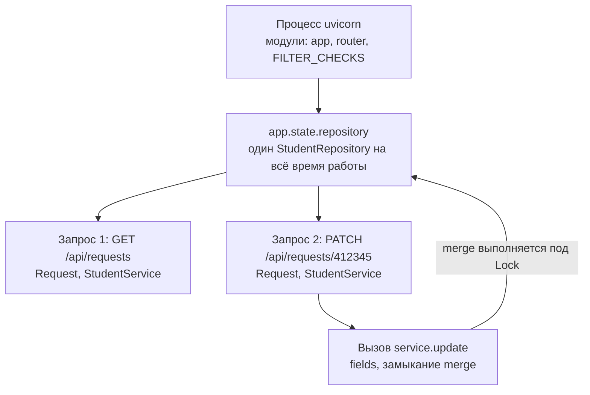

*Схема: стрелки от общего к частному. Объекты запроса создаются заново и исчезают с ответом, а репозиторий один на оба запроса — поэтому только он нуждается в защите от одновременного доступа.*

### Почему глобальное изменяемое состояние опасно

Изменяемый объект на уровне модуля видят все запросы сразу. Обработчики FastAPI, объявленные через `def`, выполняются в пуле потоков ([вопрос 8](#q8)), так что два запроса могут менять общий словарь одновременно. Опасна не сама глобальная константа (`MAX_STAY_YEARS`), а глобальная переменная, в которую пишут из запросов.

**Плохо:**

```python
current_filters = {}                 # общая на все запросы

@router.get("")
def list_students(group: str | None = None):
    current_filters["group"] = group # запрос 2 перезапишет фильтр запроса 1
    return service.find(current_filters)
```

**Хорошо:**

```python
@router.get("")
def list_students(filters: Annotated[StudentFilter, Query()], service: Service):
    return service.find(filters)     # фильтры — локальные данные этого запроса
```

В первом варианте данные запроса положены на уровень процесса: при одновременных запросах один пользователь получит список по чужому фильтру. Общим на сервере должно быть только то, что действительно общее, — хранилище; и доступ к нему — под блокировкой.

### Как обработчик получает контекст запроса

**Контекст запроса** — всё, что относится к текущему запросу: метод, путь, заголовки, тело, текущий пользователь, ссылки на ресурсы приложения. Фреймворки доставляют его до кода двумя способами.

**Flask — неявно, через context locals.** `from flask import request, g` — глобальные по виду объекты-прокси, которые в каждом потоке (точнее, в каждом контексте выполнения) указывают на свой запрос. Обработчик пишет `request.get_json()` без параметров. Удобно, но зависимость спрятана: функцию нельзя вызвать вне контекста запроса, и из сигнатуры не видно, что ей нужно.

**FastAPI — явно, через параметры.** Нужен запрос — объяви параметр `request: Request`. Нужен объект, который надо собрать, — объяви зависимость через `Depends`: FastAPI вызовет функцию-поставщик для каждого запроса и передаст результат. В пределах одного запроса результат зависимости кэшируется; зависимость с `yield` позволяет освободить ресурс после ответа (закрыть сессию БД).

Прокси Flask в современных версиях построены на модуле **`contextvars`**: `ContextVar` хранит значение, своё для каждого потока и каждой asyncio-задачи. Его же используют напрямую, когда значение нужно глубоко в коде, а протаскивать параметр неудобно, — например, идентификатор запроса для журнала.

```python
from contextvars import ContextVar

request_id: ContextVar[str] = ContextVar("request_id", default="-")

@app.middleware("http")
async def assign_id(request, call_next):
    request_id.set(request.headers.get("X-Request-ID", "-"))
    return await call_next(request)   # у параллельного запроса своё значение
```

### lifespan: ресурсы уровня приложения

Ресурсы, которые нужны всё время работы — подключение к БД, загруженные данные, — создают при старте. Делать это прямо при импорте модуля (`repository = StudentRepository(); repository.load()` на верхнем уровне) плохо: чтение файла происходит при любом импорте, в том числе в тестах, и порядок запуска не управляется. **lifespan** — асинхронный контекстный менеджер, который FastAPI запускает при старте (код до `yield`) и при остановке (после `yield`). Созданное в нём кладут в **`app.state`** — объект для произвольных атрибутов приложения; из обработчика он доступен как `request.app.state`.

> [!NOTE]
> **В твоей работе**
>
> Файл: `backend/app/main.py`, строки 22–30
>
> ```python
> @asynccontextmanager
> async def lifespan(app: FastAPI):
>     repository = StudentRepository()
>     repository.load()
>     app.state.repository = repository
>     yield
>
>
> app = FastAPI(title="Управление студентами", lifespan=lifespan)
> ```
>
> Файл: `backend/app/routes.py`, строки 13–17
>
> ```python
> def get_service(request: Request) -> StudentService:
>     return StudentService(request.app.state.repository)
>
>
> Service = Annotated[StudentService, Depends(get_service)]
> ```
>
> Хранилище — объект уровня приложения: создаётся один раз, читает `students.json` и живёт в `app.state` до остановки. На этом держатся требование 4 (данные в памяти и в JSON-файле) и требование stateless-клиента: данные теперь хранит сервер, а не браузер. Сервис — объект уровня запроса: `get_service` вызывается на каждый запрос и создаёт новый `StudentService`, который держит лишь ссылку на общий репозиторий. Своего состояния у сервиса нет, поэтому создавать его заново дёшево и безопасно.
>
> Файл: `backend/app/service.py`, строки 109–118
>
> ```python
>         def merge(current: dict) -> dict:
>             student = {**current, **fields}
>             ...
>             return student
>
>         student = self.repository.update(isu_id, merge)
> ```
>
> `merge` — замыкание: `fields` (изменённые поля из тела `PATCH`) — локальная переменная `update`, а вызывается `merge` внутри `repository.update`, под блокировкой, уже в другом модуле. Так чтение текущей записи, слияние, проверка дат и запись выполняются атомарно. `{**current, **fields}` создаёт новый словарь, а не меняет старый: это важно, потому что `repository.get` и `list_all` отдают ссылки на те же словари, что лежат в хранилище. Вероятный вопрос: «почему не изменить `current` на месте?» — объект виден другим запросам, а при ошибке проверки дат запись осталась бы наполовину изменённой.

> [!CAUTION]
> **Расхождение с практикой**
>
> Хранилище с данными — состояние внутри процесса, поэтому сервер работает только в одном процессе uvicorn: на практике данные выносят во внешнюю СУБД, а в `app.state` держат лишь подключение к ней. Почему несколько воркеров невозможны и как это защищать — [вопрос 16](#q16).

> [!TIP]
> **Могут спросить**
>
> **Почему не завести репозиторий глобальной переменной в `repository.py`?** Тогда файл читался бы при импорте модуля, в том числе в тестах, и подменить хранилище было бы сложнее. `lifespan` даёт явный момент запуска, а через `Depends` в тестах можно подставить другой сервис (`app.dependency_overrides`).
>
> **Чем `global` отличается от `nonlocal`?** `global` связывает имя с переменной модуля, `nonlocal` — с переменной ближайшей объемлющей функции. Оба нужны только для присваивания: читать внешнюю переменную можно и без них.
>
> **Как во Flask обработчик получает запрос без параметра?** `flask.request` — прокси на контекст текущего запроса: Flask перед вызовом обработчика помещает запрос в контекст и снимает его после ответа. Поэтому `request` нельзя использовать вне обработки запроса — будет `RuntimeError: Working outside of request context`.

## Вопрос 8. Синхронный и асинхронный код в Python.

Почти всё время обработки запроса сервер ничего не считает, а ждёт: пока придут байты тела запроса, пока ответит база данных или внешний сервис, пока файл `students.json` запишется на диск. Если на время такого ожидания процесс засыпает целиком, то второй клиент, который хочет получить список студентов общежития, будет ждать, пока закончится чужая запись. Синхронный и асинхронный код — два способа распорядиться этим временем ожидания: отдать его другим потокам или другим задачам в том же потоке.

### I/O-bound и CPU-bound, блокирующий вызов

Задача **I/O-bound** (ограничена вводом-выводом), если большую часть времени она ждёт сеть, диск или базу. Типичный обработчик REST API именно такой: прочитать запрос, найти студента по ИСУ, записать изменения, вернуть JSON. Задача **CPU-bound** (ограничена процессором), если она всё время считает: формирует большой отчёт, ресайзит фото студентов, перебирает варианты расселения по комнатам.

**Блокирующий вызов** — вызов, который не возвращает управление, пока операция не закончится: `time.sleep(2)`, `path.write_text(...)`, `requests.get(...)`, запрос через синхронный драйвер БД. Пока он идёт, поток, который его сделал, ничем другим заняться не может.

### Потоки и GIL

Классический способ обслуживать несколько запросов одновременно — **потоки**: каждый запрос обрабатывается в своём потоке, и, пока один поток ждёт диск, операционная система отдаёт процессор другому. В стандартной сборке CPython у потоков есть ограничение — **GIL** (Global Interpreter Lock): в каждый момент байт-код Python исполняет только один поток. Блокирующий ввод-вывод GIL отпускает, поэтому для I/O-bound задач потоки работают хорошо. Для CPU-bound задач потоки не ускоряют работу: вычисления всё равно идут по очереди, и параллелизм дают только процессы (`multiprocessing`, `ProcessPoolExecutor`). В Python 3.13 появилась экспериментальная сборка без GIL (free-threaded), но обычные установки пока работают с ним.

Цена потоков — память на стек каждого потока, переключения ядра и, главное, **гонки данных**: два потока одновременно меняют один словарь, и результат зависит от того, как легло переключение.

### Корутины и event loop

Асинхронный подход решает ту же задачу в одном потоке. Функция, объявленная через `async def`, при вызове не выполняется, а возвращает **корутину** — объект, который можно выполнять по частям. Внутри корутины `await` отмечает точку, где она готова подождать: «я жду ответа от базы, займись пока другим». Корутины по очереди запускает **event loop** (цикл событий, модуль `asyncio`): он держит список готовых к работе задач, выполняет одну до ближайшего `await`, а когда ожидаемая операция завершилась, возвращает задачу в очередь.

```python
import asyncio

async def load_student(isu_id: str) -> dict:
    await asyncio.sleep(0.1)          # имитация запроса к базе: loop свободен
    return {"isu_id": isu_id, "full_name": "Иванов Иван Иванович"}

async def main():
    # три запроса ждут одновременно: ~0.1 с, а не 0.3 с
    students = await asyncio.gather(
        load_student("412345"), load_student("412346"), load_student("412347")
    )
    print(students)

asyncio.run(main())                   # создаёт event loop и запускает корутину
```

Переключение здесь **кооперативное**: задачу никто не прерывает насильно, она сама отдаёт управление на `await`. Отсюда главное свойство и главная опасность асинхронного кода: между двумя `await` код выполняется без помех со стороны других задач, но если он на это время заблокируется, то встанут все задачи сразу.

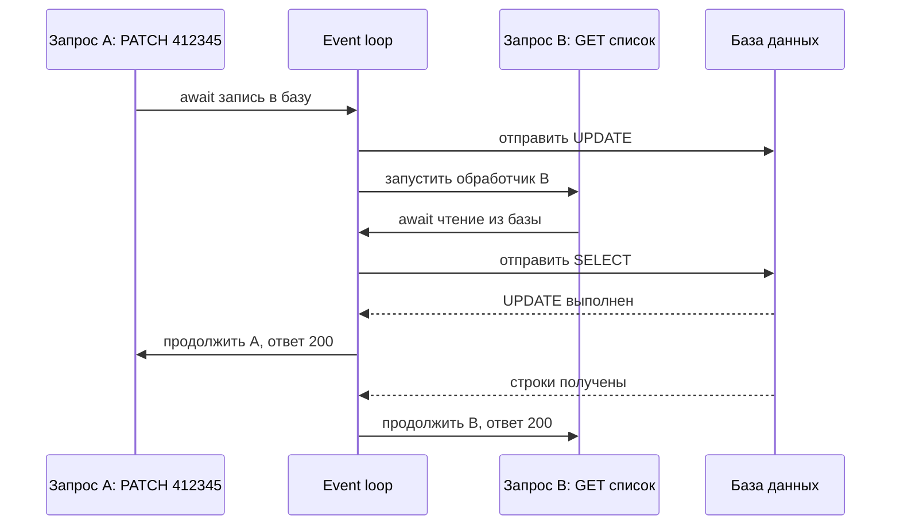

*Схема: один поток обслуживает два запроса. Пока A ждёт базу, loop запускает B; ни один из запросов не простаивает из-за другого, потому что ожидание происходит не в Python-коде, а в операционной системе.*

Асинхронными бывают и контекстные менеджеры: `async with` вызывает `__aenter__`/`__aexit__`, внутри которых тоже можно ждать, например открыть соединение с базой. Декоратор `@asynccontextmanager` строит такой менеджер из генератора с одним `yield` (как декоратор работает — [вопрос 6](#q6)).

### Асинхронный сервер и FastAPI

Чтобы фреймворк мог выполнять корутины, сам сервер должен быть асинхронным. Интерфейс **ASGI** — асинхронный преемник WSGI: приложение — это корутина, которую сервер (uvicorn) вызывает внутри своего event loop (подробнее о WSGI/ASGI и uvicorn — [вопрос 1](#q1)).

FastAPI разрешает объявлять обработчики обоими способами и обращается с ними по-разному:

| Обработчик | Где выполняется | Что можно внутри |
|:--|:----------|:----------|
| `async def` | прямо в event loop | только неблокирующий I/O через `await` (асинхронные драйверы, `httpx.AsyncClient`) |
| `def` | в пуле потоков (Starlette, через `anyio`, по умолчанию до 40 потоков) | любой блокирующий код: файлы, синхронные драйверы, `requests` |

Правило выбора простое: если все вызовы внутри асинхронные — `async def`; если хоть один блокирующий — обычный `def`, и FastAPI сам вынесет его из event loop.

**Плохо:**

```python
@router.patch("/{isu_id}")
async def update_student(isu_id: str, changes: StudentUpdate):
    time.sleep(1)                                   # блокирует весь event loop
    DATA_FILE.write_text(json.dumps(students))      # блокирующая запись на диск
    return students[isu_id]
```

**Хорошо:**

```python
@router.patch("/{isu_id}")
def update_student(isu_id: str, changes: StudentUpdate):
    time.sleep(1)                                   # блокирует только свой поток из пула
    DATA_FILE.write_text(json.dumps(students))
    return students[isu_id]
```

Синтаксически разница — одно слово `async`, а по поведению — противоположная. В первом варианте обработчик выполняется в event loop, и, пока идёт `time.sleep`, сервер не принимает и не обрабатывает никакие другие запросы: один медленный PATCH замораживает всё приложение. Во втором FastAPI отправит функцию в пул потоков, и остальные запросы продолжат обслуживаться.

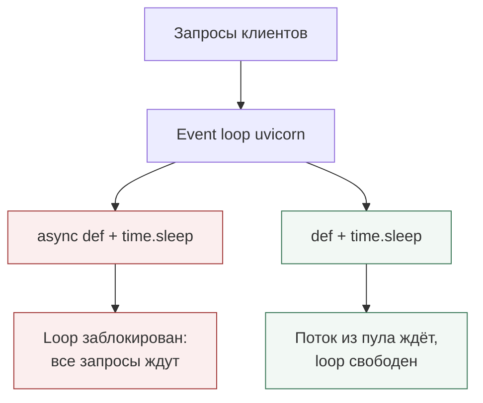

*Схема: блокирующий вызов безопасен только там, где блокируется не event loop, а отдельный поток. Если нужен именно `async def`, блокирующую часть выносят явно: `await asyncio.to_thread(...)` или `run_in_threadpool`.*

> [!WARNING]
> **Подводный камень**
>
> `async def` не делает код быстрее сам по себе. Асинхронность выигрывает, только когда внутри действительно есть `await` на ввод-вывод. CPU-bound вычисление в `async def` блокирует loop так же, как `time.sleep`, а в `def` занимает поток и упирается в GIL; для тяжёлых вычислений нужен пул процессов или отдельный воркер-очередь.

### Синхронный код в многопоточном сервере: зачем блокировка

Раз обработчики `def` выполняются в пуле потоков, два запроса к одним данным могут идти действительно одновременно. Проверка «есть ли уже студент с таким ИСУ» и добавление — это две операции; если между ними вклинится другой поток, оба POST увидят, что ИСУ свободен, и оба запишут студента. Такая гонка называется **check-then-act**, и лечится она взаимным исключением: **`threading.Lock`** гарантирует, что внутри `with lock:` в каждый момент находится только один поток. Подробнее о блокировке при записи в файл — [вопрос 17](#q17).

> [!NOTE]
> **В твоей работе**
>
> Все обработчики в `backend/app/routes.py` объявлены через обычный `def`, например:
>
> Файл: `backend/app/routes.py`, строки 35–42
>
> ```python
> @router.post("", status_code=201, response_model=StudentOut)
> def create_student(student: StudentCreate, service: Service):
>     return service.create(student)
>
>
> @router.patch("/{isu_id}", response_model=StudentOut)
> def update_student(isu_id: IsuPath, changes: StudentUpdate, service: Service):
>     return service.update(isu_id, changes)
> ```
>
> Это правильный выбор: каждое изменение заканчивается синхронной записью файла `students.json` (`path.write_text`), то есть обработчики блокирующие, и FastAPI выполняет их в пуле потоков. Следствие — параллельный доступ к общему словарю, поэтому в репозитории есть блокировка:
>
> Файл: `backend/app/repository.py`, строки 13, 45–51
>
> ```python
>         self.lock = threading.Lock()
> ...
>     def add(self, student: dict) -> bool:
>         with self.lock:
>             if student["isu_id"] in self.students:
>                 return False
>             self.students[student["isu_id"]] = student
>             self.save()
>             return True
> ```
>
> Проверка дубля, вставка и запись в файл идут под одной блокировкой, поэтому два одновременных POST с одним ИСУ не создадут двух студентов: второй получит `False` и 409. Так же устроен `update`: функция `merge` из сервиса вызывается внутри `with self.lock`, так что чтение текущей записи, проверка дат и сохранение атомарны относительно других потоков. Цена — все изменения выполняются строго по очереди вместе с записью файла; для учебной нагрузки это незаметно.
>
> Асинхронный код в работе есть в двух местах. На сервере — `lifespan` (`backend/app/main.py`, строки 22–27): `async def` с `@asynccontextmanager`, но внутри синхронный `repository.load()`; он блокирует loop, но только при старте, до приёма запросов, так что это допустимо. На клиенте — `frontend/js/api.js`, строки 33–58: функция `request` объявлена `async` и ждёт ответа через `await fetch(url, options)`. Это та же модель, что `asyncio`: в браузере один поток и event loop, `fetch` возвращает Promise (аналог future в `asyncio`), а `await` отдаёт управление, чтобы интерфейс не зависал на время запроса.
>
> На защите по этому месту спросят: «Почему не `async def`?» и «Что будет без `Lock`?» — ответы ниже.

> [!CAUTION]
> **Расхождение с практикой**
>
> `threading.Lock` защищает данные только внутри одного процесса. Если запустить uvicorn с `--workers 2`, будет два процесса со своими словарями и своими блокировками, и они начнут перезаписывать один файл друг за другом. В продакшене согласованность обеспечивает внешнее хранилище (СУБД с транзакциями), а не блокировка в памяти. На защите: условие разрешает хранение в памяти и JSON-файле, поэтому сервер рассчитан на один процесс — подробнее в [вопросе 16](#q16).

> [!TIP]
> **Могут спросить**
>
> **Почему обработчики объявлены через `def`, а не `async def`?** Внутри них блокирующая запись файла и нет ни одного `await`. В `async def` такая запись остановила бы event loop и все остальные запросы; `def` FastAPI выполняет в пуле потоков, где блокировка затрагивает только один поток.
>
> **Зачем `Lock`, если есть GIL?** GIL защищает только отдельные операции байт-кода, а не последовательность «проверить, есть ли ИСУ, — добавить — записать файл». Поток может переключиться между этими шагами, и без блокировки два запроса создадут дубль или один перезапишет изменения другого.
>
> **Когда стоило бы перейти на `async def`?** Когда все обращения к данным станут асинхронными: асинхронный драйвер БД (`asyncpg`, async-сессия SQLAlchemy) или `aiofiles` для файла. Тогда один поток обслужит тысячи одновременных соединений без накладных расходов на потоки, а `threading.Lock` пришлось бы заменить на `asyncio.Lock`.

## Вопрос 9. Итераторы, генераторы и работа с коллекциями данных.

Сервер постоянно перебирает данные: найти студентов общежития `alp`, которые ещё проживают; собрать словарь «ИСУ → запись» из массива, прочитанного из файла; отдать первые 20 записей списка. Если на каждую такую операцию заводить промежуточный список и писать цикл с индексами, код раздувается, а на больших объёмах лишние копии съедают память. В Python для этого есть единый механизм перебора — **итерация** — и инструменты поверх него: генераторы, comprehension и встроенные функции, работающие с любой последовательностью.

### Протокол итерации

Цикл `for` не знает, что перебирает — список, словарь, файл или ответ базы данных. Он опирается на **протокол итерации**: у объекта вызывается `iter()`, получается **итератор**, у итератора в цикле вызывается `next()`, пока тот не выбросит `StopIteration`.

Здесь два разных понятия. **Итерируемый объект** (iterable) умеет выдать итератор — у него есть `__iter__`. Список, словарь, строка, множество — итерируемые. **Итератор** хранит позицию перебора и отдаёт следующий элемент методом `__next__`; его `__iter__` возвращает его самого. Список можно обойти сколько угодно раз, потому что каждый `for` получает от него новый итератор; итератор же проходится один раз.

```python
students = [{"isu_id": "412345"}, {"isu_id": "412346"}]

it = iter(students)   # список выдаёт новый итератор
next(it)              # {"isu_id": "412345"}
next(it)              # {"isu_id": "412346"}
next(it)              # StopIteration — элементы кончились
```

Цикл `for student in students:` делает ровно это, только `StopIteration` перехватывает сам.

### Генераторы

Писать класс с `__iter__` и `__next__` ради каждого перебора неудобно. **Генераторная функция** — функция с `yield` — даёт итератор без класса: при вызове она ничего не выполняет, а возвращает объект-генератор; каждый `next()` прогоняет тело до следующего `yield` и замораживает выполнение со всеми локальными переменными.

```python
def living_in(students, dormitory):
    for student in students:
        if student["dormitory"] == dormitory and student["check_out"] is None:
            yield student          # отдать одного и ждать следующего next()
```

**Генераторное выражение** — то же в одну строку, в круглых скобках: `(s for s in students if s["is_foreign"])`.

Главное свойство генераторов — **ленивость**: элементы вычисляются по одному в момент запроса, весь результат в памяти одновременно не лежит. Это позволяет обрабатывать поток, который не помещается в память (строки большого файла, страницы выборки из БД), и останавливаться раньше: если нужны первые 20 подходящих студентов, генератор не будет проверять остальных. Для такого среза служит `itertools.islice`:

```python
from itertools import islice

page = list(islice(living_in(students, "alp"), 20))   # первые 20, дальше не считаем
```

### Comprehension

**Списковое включение** (list comprehension) `[выражение for x in коллекция if условие]` строит новый список; аналогично строятся словарь `{k: v for ...}` и множество `{x for ...}`. Отличие от генераторного выражения — скобки и жадность: comprehension вычисляет всё сразу и возвращает готовую коллекцию, которую можно обходить много раз, брать `len()` и индекс.

**Плохо:**

```python
by_isu = {}
for i in range(len(records)):
    by_isu[records[i]["isu_id"]] = records[i]
```

**Хорошо:**

```python
by_isu = {record["isu_id"]: record for record in records}
```

Первый вариант перебирает индексы, хотя индекс не нужен, и прячет намерение в теле цикла. Включение читается как определение: «словарь, где ключ — ИСУ, значение — запись».

### Встроенные функции для коллекций

Большинство задач обработки решаются встроенными функциями, которые принимают любое итерируемое и часто сами ленивые.

| Функция | Что делает | Пример на студентах |
|:--|:----------|:----------|
| `all(it)` / `any(it)` | все / хоть один истинный; останавливаются досрочно | `any(s["is_foreign"] for s in students)` |
| `filter(f, it)` | ленивый отбор | `filter(lambda s: s["group"] == "M3301", students)` |
| `map(f, it)` | ленивое преобразование | `map(lambda s: s["isu_id"], students)` |
| `sorted(it, key=...)` | новый отсортированный список | `sorted(students, key=lambda s: s["full_name"])` |
| `enumerate(it)` | пары «номер, элемент» | `for n, s in enumerate(students, 1)` |
| `zip(a, b)` | попарное объединение | `zip(isu_ids, rooms)` |
| `itertools.islice` | срез итератора без индексов | пагинация |

`map` и `filter` в современном коде обычно заменяют генераторными выражениями — они читаются проще, когда нужна и фильтрация, и преобразование.

### Выбор коллекции

Структура данных определяет стоимость основных операций. В **списке** поиск студента по ИСУ — линейный проход, $O(n)$. В **словаре** с ключом-ИСУ — хеш-таблица, поиск, вставка и удаление в среднем $O(1)$, и уникальность ключа обеспечивается самой структурой. **Множество** — словарь без значений: проверка «встречался ли такой ИСУ» за $O(1)$. Список уместен, когда важен порядок и нужен полный перебор; словарь — когда к элементу обращаются по ключу.

> [!WARNING]
> **Подводный камень**
>
> Генератор одноразовый. Если сохранить генераторное выражение в переменную, обойти его один раз (например, посчитать `len(list(found))`), а потом передать дальше, второй обход вернёт пустоту — без всякой ошибки. Если результат нужен больше одного раза, его материализуют: `list(...)`.
>
> Второе: нельзя менять словарь, пока по нему идёт итерация, — это `RuntimeError: dictionary changed size during iteration`. В многопоточном сервере это значит, что перебирать общий словарь, пока другой поток добавляет студента, нельзя без блокировки или копии.

> [!NOTE]
> **В твоей работе**
>
> Файл: `backend/app/service.py`, строки 33–40 и 73–84
>
> ```python
> FILTER_CHECKS = {
>     "full_name": lambda student, value: value.casefold() in student["full_name"].casefold(),
>     "group": lambda student, value: student["group"] == value,
>     ...
>     "living": lambda student, value: (student["check_out"] is None) == value,
> }
> ...
> def matches(student: dict, conditions: dict) -> bool:
>     return all(FILTER_CHECKS[name](student, value) for name, value in conditions.items())
> ...
>     def find(self, filters: StudentFilter) -> list[dict]:
>         conditions = filters.model_dump(exclude_none=True)
>         found = (student for student in self.repository.list_all() if matches(student, conditions))
>         return list(found)
> ```
>
> Фильтрация (требование фильтровать список через query-параметры и `QUERY`) собрана из трёх приёмов. Словарь `FILTER_CHECKS` сопоставляет имени фильтра функцию-проверку — вместо цепочки `if`. `all` с генераторным выражением внутри проверяет только переданные фильтры и останавливается на первом несовпадении; если фильтров нет, `all` от пустой последовательности даёт `True`, и возвращаются все студенты. `find` — генераторное выражение, сразу превращённое в список.
>
> Файл: `backend/app/repository.py`, строки 31 и 37–39
>
> ```python
>         self.students = {record["isu_id"]: record for record in records}
> ...
>     def list_all(self) -> list[dict]:
>         with self.lock:
>             return list(self.students.values())
> ```
>
> Массив из файла превращается dict comprehension'ом в словарь по ИСУ — так `get`, `delete` и проверка дубля при `add` работают за $O(1)$, а требование уникального ИСУ поддерживается самой структурой. `list_all` отдаёт копию списка под блокировкой: фильтр потом идёт по копии без блокировки и не упадёт, если параллельный запрос изменит словарь.
>
> Честно о ленивости: генератор в `find` ничего не экономит — источник уже скопирован в список, а результат сразу собирается `list(...)`. Запись эквивалентна `[s for s in ... if matches(s, conditions)]`. Вероятный вопрос: «зачем здесь генератор?» — ответ: по смыслу это фильтрующий проход, выигрыш дала бы ленивость только при пагинации через `islice` или потоковой отдаче.

Подробнее о хранении, блокировке и стоимости фильтрации в целом — [вопрос 17](#q17).

> [!TIP]
> **Могут спросить**
>
> **Чем итерируемый объект отличается от итератора?** Итерируемый объект умеет выдавать итератор (`__iter__`) и может обходиться многократно. Итератор хранит текущую позицию, отдаёт элементы через `__next__` и проходится один раз; по окончании бросает `StopIteration`.
>
> **Чем генераторное выражение отличается от list comprehension?** Comprehension сразу строит весь список в памяти, его можно обходить повторно и брать длину. Генераторное выражение ленивое: считает элементы по запросу, занимает постоянную память, но одноразовое.
>
> **Почему студенты хранятся в словаре, а не в списке?** Все операции по ИСУ — чтение, изменение, удаление, проверка дубля — в словаре стоят в среднем $O(1)$, в списке — линейный поиск. Фильтрация по другим полям всё равно остаётся полным проходом $O(n)$: индексов по группе или общежитию нет.

## Вопрос 10. Модули, пакеты и разделение Backend-приложения по слоям.

Пока бэкенд — один файл на сотню строк, всё видно сразу. Но в обработчике `POST /api/requests` смешиваются три разных заботы: разобрать HTTP-запрос, проверить правила (выселение позже заселения, ИСУ не занят) и записать студента в хранилище. Когда их пишут в одном месте, нельзя заменить JSON-файл на базу данных, не переписав обработчики, нельзя проверить правило о датах без HTTP-запроса, и любое изменение задевает всё сразу. Решение состоит из двух частей: механизм языка, позволяющий разнести код по файлам (**модули и пакеты**), и архитектурное правило, по которому его разносят (**слои**).

### Модули и пакеты

**Модуль** — это файл `.py`; имя файла становится именем модуля, всё, что определено на верхнем уровне (функции, классы, переменные), — его атрибутами. **Пакет** — каталог с модулями; обычный пакет помечается файлом `__init__.py`, который выполняется при первом импорте пакета и часто пуст. Без `__init__.py` каталог тоже импортируется — как пакет пространства имён (namespace package), но для приложения принято ставить файл явно.

`import` ищет модуль по списку каталогов `sys.path`: каталог запуска (или скрипта), стандартная библиотека, установленные пакеты из `site-packages`. Модуль выполняется один раз при первом импорте и кэшируется в `sys.modules`; повторные импорты получают тот же объект. Поэтому переменная уровня модуля фактически глобальна для процесса — подробнее о времени жизни данных — [вопрос 7](#q7).

Импорты бывают **абсолютные** (`from app.service import StudentService` — путь от корня, лежащего в `sys.path`) и **относительные** (`from .service import StudentService` — от текущего пакета). Абсолютные явнее и рекомендуются PEP 8; относительные удобны внутри пакета, но работают только когда модуль загружен как часть пакета, а не запущен как скрипт.

> [!WARNING]
> **Подводный камень**
>
> Абсолютный импорт `from app.service import ...` работает, только если в `sys.path` есть каталог, *содержащий* `app`. Поэтому приложение запускают из `backend/`: `uvicorn app.main:app`. uvicorn добавляет текущий каталог в `sys.path` (параметр `--app-dir`, по умолчанию `.`). Запуск из корня репозитория или `python app/main.py` даст `ModuleNotFoundError: No module named 'app'`.

**Циклический импорт** — модуль A импортирует B, а B импортирует A. Python начинает выполнять A, доходит до импорта B, выполняет B, а тот обращается к ещё не определённому имени из недовыполненного A — `ImportError: cannot import name ... (most likely due to a circular import)`. Обычно цикл — признак того, что зависимости между частями кода перепутаны, и лечится это не трюками с импортом внутри функции, а наведением порядка в направлении зависимостей.

### Слоистая архитектура

Типичный бэкенд делят на слои по ответственности:

| Слой | Отвечает за | Знает про HTTP | В этой работе |
|:--|:-----------|:--|:--|
| Маршруты (контроллер) | разобрать запрос, вызвать сервис, вернуть ответ с кодом | да | `routes.py` |
| Сервис (бизнес-логика) | правила предметной области: даты, уникальность ИСУ, «студента нет» | нет | `service.py` |
| Репозиторий (доступ к данным) | хранить, читать, менять записи | нет | `repository.py` |
| Схемы | форма входных и выходных данных | нет | `schemas.py` |
| Обработка ошибок | перевод исключений в HTTP-ответ единого формата | да | `errors.py` |
| Точка сборки | создать объекты и связать слои | да | `main.py` |

Ключевое правило — **направление зависимостей**: верхний слой зависит от нижнего, но не наоборот. Маршруты вызывают сервис, сервис — репозиторий; репозиторий не знает, что над ним есть HTTP, а сервис не возвращает коды состояния — он бросает доменные исключения, которые переводит в ответы отдельный модуль (подробнее — [вопрос 5](#q5)).

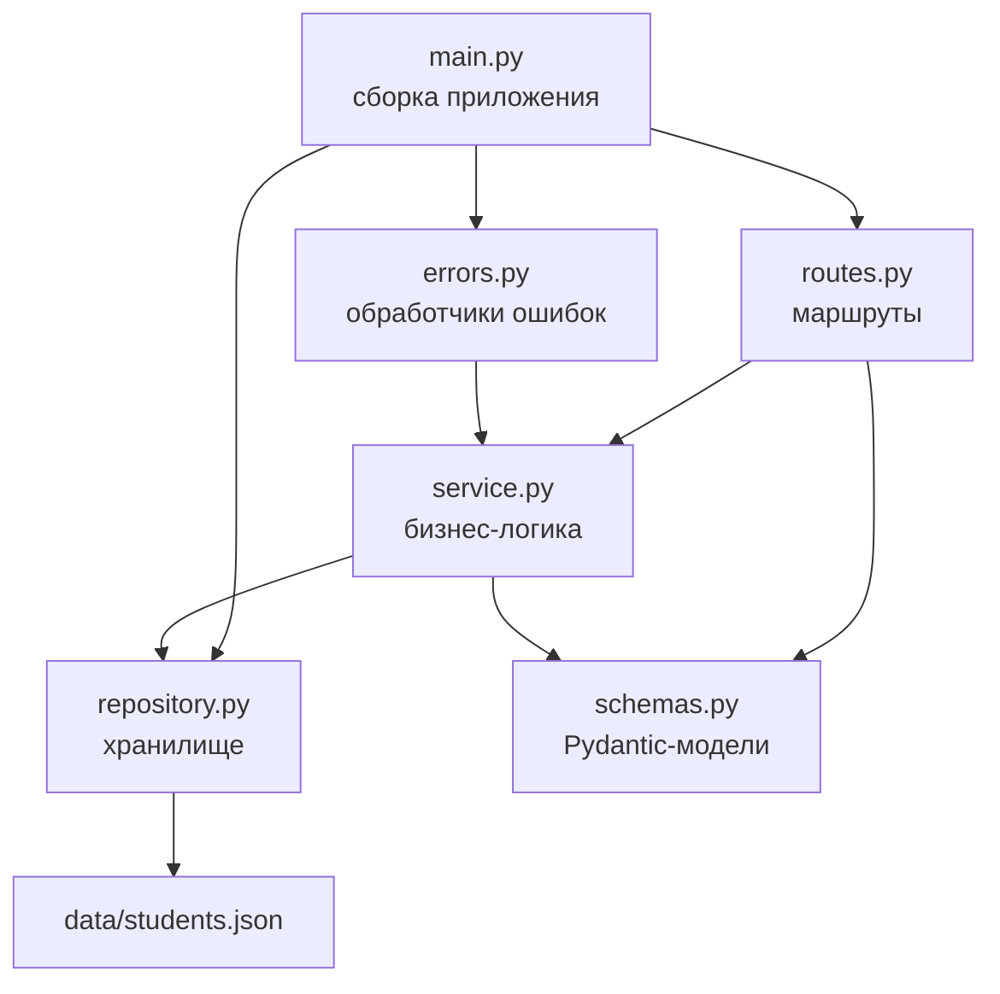

*Схема: стрелка — «импортирует». Все стрелки идут сверху вниз, циклов нет. Обратите внимание на `errors.py → service.py`: обработчики знают про исключения сервиса, а сервис про HTTP-обработчики не знает — поэтому цикла между ними нет.*

Что это даёт. Заменить JSON-файл на PostgreSQL — переписать `repository.py`, сохранив набор методов; сервис и маршруты не меняются. Правило о датах можно проверить юнит-тестом, вызвав `check_dates` напрямую, без запуска сервера. Сменить FastAPI на Flask — переписать маршруты и обработчики ошибок, логика остаётся.

**Плохо:**

```python
@router.post("", status_code=201)
def create_student(student: StudentCreate):
    data = json.loads(Path("data/students.json").read_text())   # данные прямо в обработчике
    if any(s["isu_id"] == student.isu_id for s in data):
        raise HTTPException(409, "ИСУ занят")                    # правило + HTTP вперемешку
    data.append(student.model_dump(mode="json"))
    Path("data/students.json").write_text(json.dumps(data))
    return student
```

**Хорошо:**

```python
@router.post("", status_code=201, response_model=StudentOut)
def create_student(student: StudentCreate, service: Service):
    return service.create(student)   # правила — в сервисе, хранение — в репозитории
```

В первом варианте обработчик сам читает файл, проверяет уникальность и пишет обратно: правило об уникальности ИСУ нельзя переиспользовать в `PATCH`, нет блокировки, а смена хранилища затрагивает каждый обработчик.

> [!NOTE]
> **В твоей работе**
>
> Требование 5 условия («разделить маршруты, бизнес-логику и работу с данными по отдельным файлам») закрыто пакетом `backend/app/` с пустым `__init__.py` и модулями `routes.py`, `service.py`, `repository.py`, плюс `schemas.py`, `errors.py` и `main.py`. Направление зависимостей видно по импортам.
>
> Файл: `backend/app/service.py`, строки 3–4
>
> ```python
> from app.repository import StudentRepository
> from app.schemas import StudentCreate, StudentFilter, StudentUpdate
> ```
>
> Файл: `backend/app/errors.py`, строка 6
>
> ```python
> from app.service import ConflictError, EmptyUpdateError, NotFoundError, RuleViolationError, ServiceError
> ```
>
> Файл: `backend/app/main.py`, строки 9–17
>
> ```python
> from app.errors import (
>     http_error_handler,
>     ...
>     validation_error_handler,
> )
> from app.repository import StudentRepository
> from app.routes import router
> from app.service import ServiceError
> ```
>
> `service.py` не импортирует ничего из FastAPI — бизнес-логика от веб-фреймворка не зависит. `repository.py` не импортирует модулей приложения вообще. `main.py` — единственное место, где всё связывается: создаётся репозиторий, регистрируются обработчики, подключается роутер. Сервис для каждого запроса создаёт функция `get_service` в `routes.py` через `Depends` — механизм разобран в [вопросе 7](#q7).

> [!CAUTION]
> **Расхождение с практикой**
>
> Разделение есть, но слои связаны жёстче, чем в учебной «чистой» архитектуре. Сервис зависит от конкретного класса `StudentRepository`, а не от абстракции (`Protocol` или абстрактного класса): заменить хранилище можно, только сохранив те же имена и сигнатуры методов, и это нигде не зафиксировано. Кроме того, сервис принимает Pydantic-модели `StudentCreate`/`StudentFilter` — слой логики знает о схемах ввода. Защищать так: для приложения из шести модулей отдельный интерфейс репозитория — лишняя церемония, Python позволяет подставить любой объект с теми же методами (утиная типизация), а Pydantic-модели здесь служат и описанием предметных данных. При росте проекта первым шагом был бы `Protocol` для репозитория.

> [!TIP]
> **Могут спросить**
>
> **Зачем нужен пустой `__init__.py`?** Он делает каталог обычным пакетом: Python однозначно видит `app` как пакет, инструменты (IDE, тесты, линтеры) корректно определяют корень импортов. Код в нём выполняется при первом импорте пакета; здесь он не нужен, поэтому файл пуст.
>
> **Куда положить проверку, что выселение позже заселения, и почему?** В сервис: это правило предметной области, оно одинаково для `POST` и `PATCH` и не зависит от того, пришли данные по HTTP или из теста. Pydantic проверяет форму отдельного поля, а правило связывает два поля и при `PATCH` проверяется на итоговой записи после слияния.
>
> **Как избежать циклического импорта между `errors.py` и `service.py`?** Держать зависимость в одну сторону: исключения объявлены в сервисе, а модуль ошибок импортирует их и переводит в HTTP. Если бы сервис импортировал что-то из `errors.py`, возник бы цикл — и заодно сервис оказался бы привязан к HTTP.

## Вопрос 11. REST и RESTful API.

Браузер с интерфейсом общежития и сервер со списком студентов — две разные программы, их часто пишут разные люди. Им нужен договор: по какому адресу лежат данные, как попросить список, как добавить студента, как понять, что запрос не удался. Если каждый проект придумывает такой договор с нуля, получается зоопарк вида `/api/getAllStudents`, `/api/doDelete?id=412345`, `/api/action` с полем `"cmd": "update"` в теле, и любой новый клиент вынужден изучать его по документации. **REST** (Representational State Transfer) — это набор правил, по которому такой договор строится одинаково: данные представлены как ресурсы с адресами, а действия над ними выражаются стандартными средствами HTTP.

### REST как архитектурный стиль

REST описал Рой Филдинг в диссертации 2000 года, когда разбирал, почему веб хорошо масштабируется. Это не протокол и не библиотека, а **архитектурный стиль**: набор ограничений, которые накладываются на взаимодействие клиента и сервера. Система, которая их соблюдает, получает предсказуемость, масштабируемость и независимость клиента от сервера.

| Ограничение | Суть | Что даёт |
|:--|:-----------|:------|
| Клиент-сервер | интерфейс и данные разделены | клиент и сервер развиваются независимо |
| Stateless | каждый запрос содержит всё нужное для его обработки, сервер не хранит сессию клиента | любой экземпляр сервера может обработать любой запрос |
| Кэшируемость | ответ помечает, можно ли его кэшировать | меньше повторных запросов |
| Единый интерфейс | одинаковые правила работы со всеми ресурсами | клиент работает с любым ресурсом одним способом |
| Многоуровневость | клиент не знает, говорит ли он с сервером или с прокси, балансировщиком, кэшем | между ними можно ставить промежуточные узлы |
| Код по запросу (необязательное) | сервер может передать клиенту исполняемый код | расширение клиента без его переустановки |

Ограничение stateless здесь только названо; что оно значит для клиента и сервера этой работы — [вопрос 16](#q16).

### Единый интерфейс

Главное ограничение REST, которое и отличает его от других стилей, складывается из четырёх частей.

**Ресурс** — любая сущность, которую можно назвать: студент, список студентов, список проживающих в `alp`. У ресурса есть **URI** — адрес, по которому к нему обращаются. Ресурсы бывают двух видов: **коллекция** (`/api/requests` — все студенты) и **элемент** коллекции (`/api/requests/412345` — один студент с ИСУ `412345`).

**Представление** — то, что передаётся по сети вместо самого ресурса. Студент в памяти сервера — словарь Python; клиент получает его JSON-представление. Клиент меняет ресурс тоже через представление: присылает JSON с новыми значениями полей.

**Самоописываемые сообщения** — каждое сообщение несёт достаточно информации, чтобы его понять: метод говорит, что сделать (`DELETE`), заголовок `Content-Type: application/json` — как разбирать тело, код ответа — чем всё закончилось (`404` — такого студента нет). Значение методов и кодов разобрано в [вопросе 12](#q12).

**HATEOAS** (Hypermedia as the Engine of Application State) — ответ содержит ссылки на возможные следующие действия, и клиент переходит по ним, а не собирает адреса сам:

```json
{
  "isu_id": "412345",
  "full_name": "Иванов Иван Иванович",
  "check_out": null,
  "_links": {
    "self":  { "href": "/api/requests/412345" },
    "evict": { "href": "/api/requests/412345", "method": "PATCH" }
  }
}
```

На практике HATEOAS реализуют редко: клиенты обычно пишут под конкретный API и знают адреса заранее.

### Ресурсы и URI

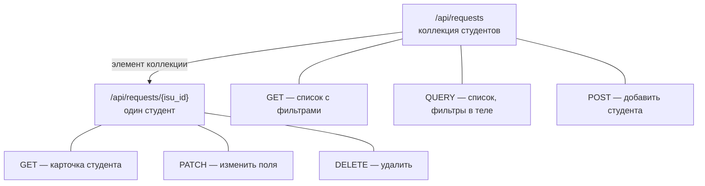

*Схема: в API всего два адреса, а всё разнообразие операций задаётся методом. Создание идёт на коллекцию, потому что ИСУ нового студента становится частью адреса элемента только после того, как он добавлен; чтение, изменение и удаление одного студента — на элемент.*

Принятые правила именования URI: ресурсы — существительные во множественном числе (`/students`, `/rooms`), действие в адрес не пишется — его выражает метод; иерархия — через `/` (`/dormitories/alp/rooms/1205`), уточнение выборки — через query-параметры (`?group=M3301&living=true`, подробнее — [вопрос 13](#q13)); строчные буквы, слова через дефис.

**Плохо:**

```http
POST /api/getStudent          {"isu_id": "412345"}
POST /api/deleteStudent       {"isu_id": "412345"}
GET  /api/students/412345/delete
```

**Хорошо:**

```http
GET    /api/requests/412345
DELETE /api/requests/412345
```

В первом варианте действие спрятано в имени адреса, а метод ничего не значит. Прокси и браузер не знают, что `POST /api/getStudent` только читает данные, и не смогут ни закэшировать ответ, ни безопасно повторить запрос. А `GET .../delete` ещё и опасен: поисковый робот или предзагрузка ссылок в браузере удалит студента, просто пройдя по ссылке.

### REST и RPC

**RPC** (Remote Procedure Call) — другой подход: API — это набор удалённых функций, клиент вызывает их по имени (`getStudent`, `evictStudent`). К нему относятся JSON-RPC, gRPC, SOAP. RPC естественнее, когда операции не сводятся к «создать / прочитать / изменить / удалить»: «пересчитать оплату за месяц», «перевести студента в другую комнату с проверкой мест». REST выигрывает, когда предметная область — набор сущностей с одинаковыми операциями: он стандартизирован, его понимают кэши, прокси, браузер и инструменты вроде Swagger. Сложные операции в REST обычно оформляют как ресурс: `POST /api/relocations` — создать заявку на переселение.

### RESTful API и модель зрелости

**RESTful API** — API, построенное по ограничениям REST. Строго по Филдингу без HATEOAS API нельзя называть REST, но в обиходе RESTful называют любой HTTP API с ресурсами, методами и кодами. Степень соответствия удобно описывать **моделью зрелости Ричардсона**:

| Уровень | Что есть | Пример |
|:--|:----------|:------|
| 0 | один адрес, один метод, действие — в теле | `POST /api` с `{"cmd": "delete", "isu_id": "412345"}` |
| 1 | отдельные ресурсы со своими URI | `POST /api/requests/412345/delete` |
| 2 | HTTP-методы и коды по назначению | `DELETE /api/requests/412345` → `204` |
| 3 | гипермедиа, ответы содержат ссылки | ответ с `_links`, как выше |

Большинство промышленных API находятся на уровне 2 — этого хватает, чтобы получить все практические выгоды стиля.

> [!NOTE]
> **В твоей работе**
>
> Файл: `backend/app/routes.py`, строки 8–45
>
> ```python
> router = APIRouter(prefix="/api/requests")
> ...
> @router.get("", response_model=list[StudentOut])
> def list_students(filters: Annotated[StudentFilter, Query()], service: Service):
> ...
> @router.api_route("", methods=["QUERY"], response_model=list[StudentOut])
> ...
> @router.get("/{isu_id}", response_model=StudentOut)
> ...
> @router.post("", status_code=201, response_model=StudentOut)
> ...
> @router.patch("/{isu_id}", response_model=StudentOut)
> ...
> @router.delete("/{isu_id}", status_code=204)
> ```
>
> Ровно шесть обязательных запросов из условия, два URI (коллекция и элемент), в адресах нет глаголов, идентификатор элемента — ИСУ (требование 3). Ответы — JSON с кодами по назначению (требование 1). Это уровень 2 по Ричардсону. Клиент и сервер разделены: страницы на JS ходят к API только через `fetch` в `frontend/js/api.js`, хотя раздаются тем же приложением. Кэширование не задействовано — сервер не ставит заголовков `Cache-Control` и `ETag`. На защите вероятен вопрос «какой уровень зрелости у твоего API и почему не третий»: ссылок в ответах нет, клиент сам строит адрес `/api/requests/{isu_id}`.

> [!CAUTION]
> **Расхождение с практикой**
>
> Ресурс называется `requests`, хотя это студенты: по правилам именования адрес был бы `/api/students`, а слово «requests» читается как «заявки» или «HTTP-запросы». Путь задан условием, менять его нельзя. Защищать так: имя адреса задано условием, семантика ресурса — студент, представление — модель студента, идентификатор — ИСУ, а всё остальное (методы, коды, структура коллекция/элемент) соответствует REST. Отсутствие HATEOAS — не ошибка, а обычный для практики уровень 2.

> [!TIP]
> **Могут спросить**
>
> **REST — это протокол?** Нет, это архитектурный стиль, набор ограничений. Обычно REST реализуют поверх HTTP, но сам стиль к HTTP не привязан; HTTP просто хорошо ему соответствует — у него есть URI, методы и коды.
>
> **Нарушает ли метод QUERY принципы REST?** Нет: это стандартный по смыслу HTTP-метод для безопасного чтения с телом, он применяется к той же коллекции и возвращает её представление. Единый интерфейс не требует обходиться только GET; важно, что смысл метода одинаков для всех ресурсов.
>
> **Почему создание — POST на коллекцию, а не PUT на элемент?** POST на коллекцию означает «добавь новый элемент», и сервер сам решает, корректен ли он. `PUT /api/requests/412345` тоже допустим, раз ИСУ знает клиент, но означает «положи представление по этому адресу» и обычно заменяет существующего студента, а не даёт `409`; условие требует именно POST.

## Вопрос 12. HTTP-методы и коды состояния.

Когда клиент обращается к `/api/requests/412345`, серверу нужно понять, чего от него хотят: показать студента, изменить его или удалить. Клиенту в ответ нужно понять, чем всё закончилось: успех, студента нет, данные не прошли проверку или сервер сломался. И ещё есть посредники — браузер, прокси, балансировщик: им надо знать, можно ли закэшировать ответ и можно ли повторить запрос, если соединение оборвалось. HTTP решает все три задачи стандартными средствами: намерение выражает **метод**, результат — **код состояния**, а свойства методов определены в спецификации (RFC 9110) одинаково для всех серверов.

### Запрос и ответ

HTTP-запрос — это стартовая строка (метод, путь, версия), заголовки и необязательное тело. Ответ — строка статуса (версия, код, пояснение), заголовки и тело.

```http
PATCH /api/requests/412345 HTTP/1.1
Host: localhost:8000
Content-Type: application/json

{"check_out": "2025-06-30"}
```

```http
HTTP/1.1 200 OK
Content-Type: application/json

{"isu_id": "412345", "full_name": "Иванов Иван Иванович", "check_out": "2025-06-30", ...}
```

### Методы и их свойства

У методов два ключевых свойства. **Безопасный** метод по смыслу только читает данные и не меняет состояние сервера: его можно вызывать сколько угодно, предзагружать, кэшировать. **Идемпотентный** метод даёт одинаковое итоговое состояние сервера при одном и при многократном выполнении. Всё безопасное идемпотентно, обратное неверно: `DELETE` меняет данные, но второй такой же запрос ничего к результату не добавит.

| Метод | Назначение | Тело запроса | Безопасный | Идемпотентный |
|:--|:-----------|:--|:--|:--|
| `GET` | получить ресурс или коллекцию | нет (смысл не определён) | да | да |
| `HEAD` | то же, что GET, но только заголовки | нет | да | да |
| `OPTIONS` | узнать возможности ресурса, CORS-preflight | обычно нет | да | да |
| `POST` | создать элемент в коллекции, любая обработка | да | нет | нет |
| `PUT` | положить представление целиком по адресу | да | нет | да |
| `PATCH` | частично изменить ресурс | да | нет | не гарантируется |
| `DELETE` | удалить ресурс | обычно нет | нет | да |
| `QUERY` | безопасное чтение с параметрами в теле | да | да | да |

Зачем это нужно на практике: если ответ на запрос не пришёл (оборвалась сеть), клиент или прокси может автоматически повторить идемпотентный запрос, ничего не сломав. Повтор `POST` опасен — он может создать запись второй раз; в этой работе дубль поймает проверка уникальности ИСУ и вернёт `409`.

Идемпотентность говорит о состоянии сервера, а не о коде ответа. Первый `DELETE /api/requests/412345` вернёт `204`, второй — `404`, но студента после обоих одинаково нет, так что свойство не нарушено.

### PUT и PATCH

`PUT` заменяет ресурс целиком: клиент присылает полное представление студента, и всё, чего в нём нет, теряется. `PATCH` меняет только присланные поля.

**Плохо:**

```http
PUT /api/requests/412345
Content-Type: application/json

{"check_out": "2025-06-30"}
```

**Хорошо:**

```http
PATCH /api/requests/412345
Content-Type: application/json

{"check_out": "2025-06-30"}
```

Чтобы отметить выселение, нужно поменять одно поле. Корректный `PUT` с таким телом означает «студент теперь состоит только из даты выселения» — сервер либо отвергнет его как неполный, либо потеряет ФИО, группу и комнату. Для частичного изменения правильный метод — `PATCH`.

`PATCH` не обязан быть идемпотентным: операция вида «увеличить счётчик нарушений на 1» при повторе даст другой результат. В этой работе `PATCH` только присваивает значения полям, поэтому фактически идемпотентен.

### Метод QUERY

Фильтры списка обычно передают в query-строке: `GET /api/requests?group=M3301&dormitory=alp`. Когда условий много или они сложные, у этого подхода появляются проблемы: длина URL ограничена (серверы и прокси режут адреса на нескольких килобайтах), URL попадает в логи и историю браузера, вложенные структуры в строке кодировать неудобно. Положить фильтры в тело `GET` нельзя: спецификация не определяет смысл тела у `GET`, и прокси или библиотеки вправе его отбросить. Обычный обходной путь — `POST /api/requests/search`, но `POST` не безопасен и не идемпотентен, так что посредники не будут ни кэшировать, ни повторять такой запрос.

**QUERY** — новый метод из проекта стандарта IETF (draft-ietf-httpbis-safe-method-w-body), который закрывает этот пробел: он безопасный и идемпотентный, как `GET`, но параметры запроса передаются в теле, как у `POST`.

```http
QUERY /api/requests HTTP/1.1
Content-Type: application/json

{"group": "M3301", "dormitory": "alp", "is_foreign": true, "living": true}
```

Порог, при котором клиент работы переходит с `GET` на `QUERY`, разобран в [вопросе 13](#q13).

### Коды состояния

Код — трёхзначное число, первая цифра задаёт класс. Клиент, не знающий конкретного кода, обязан понимать его по классу: незнакомый `418` он трактует как `400`.

| Класс | Смысл | Примеры |
|:--|:----------|:------|
| 1xx | информационные, обработка продолжается | `100 Continue`, `101 Switching Protocols` |
| 2xx | успех | `200`, `201`, `204` |
| 3xx | перенаправление | `301`, `304 Not Modified` |
| 4xx | ошибка клиента — повтор того же запроса не поможет | `400`, `404`, `409`, `422` |
| 5xx | ошибка сервера — запрос мог быть корректным | `500`, `503` |

Коды, которые требует условие (плюс `405`, добавленный в работе):

| Код | Когда | Пример в работе |
|:--|:----------|:------|
| `200 OK` | успешный запрос с телом ответа | GET списка или студента, QUERY, PATCH |
| `201 Created` | создан новый ресурс | POST нового студента |
| `204 No Content` | успех, тела нет | DELETE |
| `400 Bad Request` | запрос нельзя разобрать | битый JSON, нет тела, тело не объект, пустой PATCH |
| `404 Not Found` | ресурса нет | студента с таким ИСУ нет, неизвестный адрес |
| `405 Method Not Allowed` | адрес есть, но метод к нему не применим | `PUT /api/requests` |
| `409 Conflict` | запрос противоречит текущему состоянию | POST студента с уже существующим ИСУ |
| `422 Unprocessable Content` | синтаксис верный, но данные не проходят проверку | группа `"M33"`, выселение раньше заселения |
| `500 Internal Server Error` | непредвиденная ошибка на сервере | исключение в коде |

Граница между `400` и `422`: `400` — сервер не может даже прочитать запрос, `422` — прочитал, но содержимое неверно. Подробно уровни проверки и единый формат ошибки — в [вопросе 15](#q15). Отличие `409` от `422`: при `422` данные плохи сами по себе, при `409` они корректны, но конфликтуют с тем, что уже лежит на сервере, — тот же студент на пустой базе был бы создан. Про `201` и идентификацию созданного ресурса — [вопрос 18](#q18).

> [!WARNING]
> **Подводный камень**
>
> Ответ `200` с телом `{"error": "Студент не найден"}` — частая ошибка. Клиент, прокси и `fetch` видят успех (`response.ok === true`), кэш может сохранить «ошибку» как нормальный ответ, а мониторинг не заметит сбоев. Код должен отражать результат: тело дополняет его подробностями, но не заменяет.

> [!NOTE]
> **В твоей работе**
>
> Файл: `backend/app/routes.py`, строки 25–47
>
> ```python
> @router.api_route("", methods=["QUERY"], response_model=list[StudentOut])
> def query_students(filters: StudentFilter, service: Service):
>     return service.find(filters)
> ...
> @router.post("", status_code=201, response_model=StudentOut)
> ...
> @router.delete("/{isu_id}", status_code=204)
> def delete_student(isu_id: IsuPath, service: Service) -> None:
>     service.delete(isu_id)
> ```
>
> У FastAPI нет декоратора `@router.query`, поэтому QUERY объявлен через общий `api_route` со списком методов. Коды успеха заданы в декораторах: `201` для создания, `204` для удаления (обработчик ничего не возвращает). Коды ошибок назначаются в одном месте — по типу исключения сервиса:
>
> Файл: `backend/app/errors.py`, строки 8–19
>
> ```python
> SERVICE_ERRORS = {
>     NotFoundError: (404, "NOT_FOUND"),
>     ConflictError: (409, "CONFLICT"),
>     EmptyUpdateError: (400, "BAD_REQUEST"),
>     RuleViolationError: (422, "VALIDATION_ERROR"),
> }
>
> HTTP_ERRORS = {
>     400: ("BAD_REQUEST", "Некорректный запрос"),
>     404: ("NOT_FOUND", "Адрес не найден"),
>     405: ("METHOD_NOT_ALLOWED", "Метод не поддерживается для этого адреса"),
> }
> ```
>
> `http_error_handler` (строки 90–92) переносит в ответ заголовки исходного исключения, поэтому у `405` сохраняется заголовок `Allow` со списком допустимых методов, как требует спецификация. Вероятный вопрос: почему пустой `PATCH` — это `400`, а не `422`. Тело синтаксически верное, так что `422` тоже защитим; автор отнёс «нечего обновлять» к некорректному запросу. Как исключение сервиса превращается в ответ — [вопрос 5](#q5).

> [!CAUTION]
> **Расхождение с практикой**
>
> QUERY пока не окончательный стандарт, и поддержка у инструментов неполная: Swagger UI его не показывает (README советует проверять curl'ом), часть прокси, файрволов и HTTP-библиотек может отклонить незнакомый метод, а в браузере кросс-доменный QUERY всегда требует предварительного `OPTIONS`-запроса CORS. В работе последнее не мешает: фронтенд раздаётся тем же приложением, запросы идут на тот же адрес. Защищать так: метод требует условие, сервер реализует его семантику (безопасное чтение, фильтры в теле), а в промышленном API сегодня чаще делают `POST /api/requests/search` — ценой потери безопасности и идемпотентности метода.

> [!TIP]
> **Могут спросить**
>
> **Почему DELETE возвращает 204, а не 200?** Удалённый студент больше не существует, возвращать нечего; `204` прямо говорит «успех, тела нет», и клиент не пытается разбирать JSON. `200` с телом (например, удалённой записью) тоже допустим, если клиенту нужны эти данные.
>
> **Чем 401 отличается от 403?** `401` — клиент не аутентифицирован, сервер не знает, кто он. `403` — сервер знает, кто это, но доступ запрещён. В работе аутентификации нет, поэтому эти коды не используются.
>
> **Почему GET нельзя использовать для удаления, если он тоже «работает»?** GET по определению безопасен: браузер может предзагружать ссылки, прокси — кэшировать и повторять запросы, поисковый робот — обходить адреса. Удаление через GET приведёт к потере данных без явного действия пользователя.

## Вопрос 13. Маршрутизация, path-параметры и query-параметры.

На сервер приходит строка запроса `GET /api/requests/412345` или `GET /api/requests?group=M3301&living=true`. Прежде чем что-то делать, серверу нужно понять две вещи: какую функцию вызвать и какие данные достать из адреса. Первое решает **маршрутизация**, второе — разбор **path-параметров** (части пути) и **query-параметров** (строки после `?`).

### Маршрут и таблица маршрутов

**Маршрут** — пара «HTTP-метод + шаблон пути», к которой привязан обработчик. Все маршруты приложения собираются в **таблицу маршрутов**. Когда приходит запрос, фреймворк проходит по ней в порядке регистрации и сравнивает путь с каждым шаблоном. Срабатывает первый маршрут, у которого совпали и путь, и метод. Если путь совпал, а метод нет, ответ — 405 Method Not Allowed. Если не совпал ни один путь — 404.

В FastAPI маршруты объявляют декораторами (как декоратор заносит функцию в таблицу — [вопрос 6](#q6)). Маршруты одного ресурса группируют в **`APIRouter`** с общим **префиксом**, а потом подключают к приложению через `include_router`. Тогда путь `/api/requests` пишется один раз, а у отдельных маршрутов остаются только хвосты: `""` и `"/{isu_id}"`.

Раз таблица просматривается по порядку, порядок регистрации важен. Конкретный путь надо объявлять раньше шаблона, который его тоже покрывает.

**Плохо:**

```python
@router.get("/{isu_id}")
def get_student(isu_id: str): ...

@router.get("/stats")          # сюда не дойдёт: "/stats" уже совпал с "/{isu_id}"
def get_stats(): ...
```

**Хорошо:**

```python
@router.get("/stats")          # конкретный путь — первым
def get_stats(): ...

@router.get("/{isu_id}")
def get_student(isu_id: str): ...
```

В первом варианте `GET /api/requests/stats` попадёт в `get_student` с `isu_id="stats"`. Ограничение `pattern` на параметре не спасает: путь сопоставляется с шаблоном раньше, чем проверяется значение. Поэтому запрос получит 422 «некорректный ИСУ», а до статистики так и не дойдёт.

### Path-параметры

**Path-параметр** — переменный сегмент пути, который **идентифицирует ресурс**. В `/api/requests/{isu_id}` это номер ИСУ: `/api/requests/412345` — один конкретный студент. Без такого параметра адрес не имеет смысла, поэтому path-параметр всегда обязателен.

Фреймворк вырезает значение из пути (это всегда строка), приводит к типу из аннотации и проверяет ограничения. В FastAPI ограничения задаются через `Path(...)`: `pattern`, `ge`, `max_length`. Если проверка не прошла, обработчик не вызывается, а клиент получает 422.

### Query-параметры

**Query-параметры** идут после `?` парами `имя=значение`, разделёнными `&`. Они не указывают на ресурс, а **уточняют**, что из него вернуть: фильтры (`group=M3301`), сортировку (`sort=full_name`), пагинацию (`limit=20&offset=40`). Все они необязательны: `GET /api/requests` без параметров — тоже корректный запрос, это весь список.

| | Path-параметр | Query-параметр |
|:--|:----------|:----------|
| Роль | какой ресурс | что из него взять и как |
| Обязательность | всегда обязателен | обычно необязателен |
| Пример | `/api/requests/412345` | `/api/requests?dormitory=alp&living=true` |
| Если параметра нет | другой адрес или 404 | значение по умолчанию |

Из URL всё приходит строками. `is_foreign=true` для сервера сначала строка `"true"`, и превратить её в `bool` должен фреймворк по аннотации типа. Pydantic в обычном режиме принимает `true/false`, `1/0`, `yes/no`, а на остальное отвечает 422.

Несколько фильтров удобно описать одной моделью. Начиная с FastAPI 0.115 модель можно целиком объявить источником query-параметров: `Annotated[StudentFilter, Query()]`. У модели есть ещё одно преимущество: с `extra="forbid"` опечатка `?grup=M3301` даёт 422 «Неизвестное поле». Без этого параметр молча проигнорировали бы, и пользователь увидел бы весь список, решив, что фильтр сработал.

### URL-кодирование

Символы `?`, `&`, `=`, `/`, `#`, пробел и кириллица в URL зарезервированы или недопустимы. Поэтому значения кодируют **процентным кодированием**: байты UTF-8 записываются как `%XX`, а пробел в query-строке — как `+` или `%20`. Фильтр по ФИО «Иванов Иван» в адресе выглядит как `full_name=%D0%98%D0%B2%D0%B0...+%D0%98...`. Вручную склеивать строку нельзя: значение с `&` внутри разорвёт параметр на два. На клиенте для этого есть `URLSearchParams` (query-строка) и `encodeURIComponent` (сегмент пути), а сервер декодирует всё сам до того, как отдать значение обработчику.

### Длина URL и метод QUERY

Длина URL ограничена на практике. Стандарт HTTP рекомендует поддерживать хотя бы 8000 байт, а прокси, балансировщики и серверы часто режут раньше. Кроме того, URL оседает в логах и истории браузера. Длинный набор фильтров со списками значений, а тем более кириллицей (каждая буква — шесть символов `%XX%XX`), упирается в эти пределы. Переносить фильтры в тело `GET` нельзя: семантика тела у `GET` не определена, и посредники вправе его отбросить. Для этого случая и предложен метод **`QUERY`**: он безопасный и идемпотентный, как `GET`, но параметры передаются в теле. Его свойства и статус стандарта — [вопрос 12](#q12).

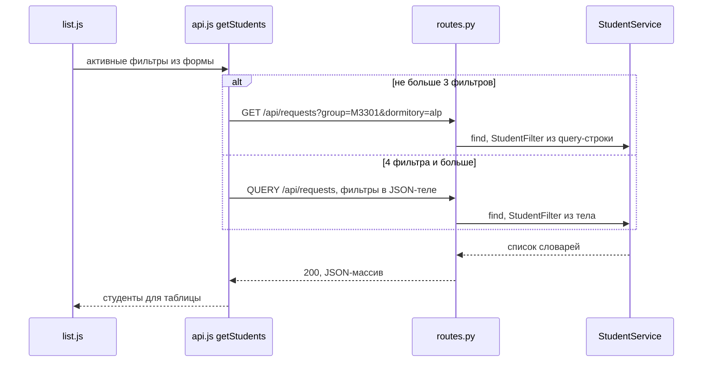

*Схема: клиент выбирает метод только по числу фильтров, а сервер сводит оба пути к одной модели `StudentFilter` и одному вызову `service.find`. Поэтому способ передачи параметров не влияет на результат фильтрации.*

> [!NOTE]
> **В твоей работе**
>
> Файл: `backend/app/routes.py`, строки 8–27
>
> ```python
> router = APIRouter(prefix="/api/requests")
>
> IsuPath = Annotated[str, Path(pattern=r"^[0-9]{6}$")]
> ...
> @router.get("", response_model=list[StudentOut])
> def list_students(filters: Annotated[StudentFilter, Query()], service: Service):
>     return service.find(filters)
>
>
> @router.api_route("", methods=["QUERY"], response_model=list[StudentOut])
> def query_students(filters: StudentFilter, service: Service):
>     return service.find(filters)
> ```
>
> Префикс задан один раз на роутер. `IsuPath` — переиспользуемый тип path-параметра: GET, PATCH и DELETE по `/{isu_id}` проверяют ИСУ одинаково. У `GET` модель фильтров читается из query-строки (`Query()`), у `QUERY` — та же модель без пометки. Одиночный параметр-модель FastAPI по умолчанию берёт из тела. У `StudentFilter` (`schemas.py`, строки 93–101) стоит `extra="forbid"`, поэтому неизвестный фильтр даёт 422. `is_foreign` и `living` объявлены как `bool | None`, а не `StrictBool`: из URL они приходят строкой `"true"`, и строгий тип отверг бы её.
>
> Файл: `frontend/js/api.js`, строки 73–79
>
> ```javascript
> if (Object.keys(active).length > QUERY_THRESHOLD) {
>     return request("QUERY", API_URL, active);
> }
>
> const query = new URLSearchParams(active).toString();
>
> return request("GET", query === "" ? API_URL : API_URL + "?" + query);
> ```
>
> Пустые фильтры отбрасываются заранее (строки 65–71). Кодирование делает `URLSearchParams`, адрес одного студента строится через `encodeURIComponent` (строка 61). В `main.py` (строки 37–38) роутер подключён раньше статики на `/`. Обратный порядок отдал бы все адреса, включая `/api/...`, обработчику статических файлов.
>
> Вероятный вопрос: «Почему порог именно 3?»

> [!CAUTION]
> **Расхождение с практикой**
>
> Условие не определяет, сколько параметров — это «слишком много». Порог `QUERY_THRESHOLD = 3` выбран автором условно: всех фильтров всего шесть, и даже со всеми сразу URL короткий. На практике на QUERY (или `POST /search`) переходят по длине и структуре запроса — списки значений, вложенные условия, — а не по числу полей. На защите так и скажи: порог показывает, что поддержаны оба способа, и легко меняется в одной константе. Ещё одно отличие: в примере условия `dormitory=8` — номер, а в работе общежитие задано кодом (`alp`, `bel`…). Набор значений закрыт через `Literal`, и любое другое значение даёт 422.

> [!TIP]
> **Могут спросить**
>
> **Почему `GET /api/requests/abc` возвращает 422, а не 404?** FastAPI проверяет path-параметр до вызова обработчика, и ошибка проверки по умолчанию — 422. Можно возразить, что «нет такого ресурса» — это 404. Оба ответа встречаются на практике. Клиент в работе показывает и на 404, и на 422 одно сообщение «Студент не найден» (`form.js`, строка 84).
>
> **Почему фильтр — query-параметр, а не путь `/api/requests/group/M3301`?** Путь идентифицирует ресурс, а группа — не ресурс, а условие отбора. К тому же фильтры комбинируются в любом наборе и порядке. В пути для каждой комбинации понадобился бы свой шаблон, а query-параметры комбинируются свободно.
>
> **Что такое `APIRouter` и зачем префикс?** Это группа маршрутов, которую можно объявить в отдельном файле и подключить к приложению целиком. Префикс задаёт общую часть пути один раз, поэтому ресурс переименовывается в одном месте. Заодно это и разделение маршрутов по файлам, которого требует условие (подробнее — [вопрос 10](#q10)).

## Вопрос 14. JSON, сериализация и десериализация.

Данные о студенте в этой системе живут в трёх местах: в объектах JavaScript в браузере, в объектах Python на сервере и в файле на диске. Между ними передаются только байты. Значит, нужен общий текстовый формат и правила перевода в него и обратно. Перевод объекта в такой формат называется **сериализацией**, обратный перевод — **десериализацией**. В вебе стандартный формат для этого — **JSON**.

### Формат JSON

JSON (RFC 8259) — текстовый формат из шести типов: **объект** (`{"ключ": значение}`, ключи только строки), **массив**, **строка** в двойных кавычках, **число**, `true`/`false` и `null`. Комментариев, дат, отдельного целого типа и множеств в нём нет. Кодировка — UTF-8.

| JSON | Python | JavaScript |
|:--|:--|:--|
| объект | `dict` | `Object` |
| массив | `list` (при записи — и `tuple`) | `Array` |
| строка | `str` | `string` |
| число | `int` или `float` | `number` |
| `true` / `false` | `True` / `False` | `true` / `false` |
| `null` | `None` | `null` |

Перевод не всегда обратим. Кортеж превращается в массив и возвращается списком. Ключ `1` в словаре Python становится строкой `"1"`. Целые числа больше $2^{53}$ JavaScript читает с потерей точности.

### Модуль json

Стандартный модуль `json` переводит строку в объекты (`json.loads`) и обратно (`json.dumps`); `json.load`/`json.dump` делают то же с файлом. У `dumps` два полезных параметра. `ensure_ascii=False` пишет кириллицу как есть. По умолчанию каждая буква «Иванов» превратится в шестисимвольную escape-последовательность: обратная косая черта, `u` и четыре шестнадцатеричные цифры кода символа. `indent=2` добавляет отступы, чтобы файл можно было читать.

Сериализовать `json` умеет только типы из таблицы. Дата, `set`, `Decimal` или собственный класс вызывают `TypeError`.

**Плохо:**

```python
student = {"isu_id": "412345", "check_in": date(2024, 9, 1)}
json.dumps(student)   # TypeError: Object of type date is not JSON serializable
```

**Хорошо:**

```python
student = {"isu_id": "412345", "check_in": date(2024, 9, 1).isoformat()}
json.dumps(student, ensure_ascii=False)   # {"isu_id": "412345", "check_in": "2024-09-01"}
```

Даты в JSON принято передавать строкой ISO 8601 (`"2024-09-01"`): она однозначна, не зависит от часового пояса и правильно сортируется как строка. Второй способ — `json.dumps(..., default=функция)`: функция вызывается для каждого незнакомого объекта и возвращает его JSON-совместимую замену. Но такая замена работает в одну сторону: при чтении `loads` вернёт строку, а не дату, и восстановить тип придётся самому.

### Сериализация в Pydantic

Восстанавливать типы при чтении умеет Pydantic: модель знает тип каждого поля (сами модели — [вопрос 4](#q4)). У модели три способа выгрузки:

| Вызов | Результат | `check_in` |
|:--|:--|:--|
| `model.model_dump()` | `dict` с объектами Python | `date(2024, 9, 1)` |
| `model.model_dump(mode="json")` | `dict` только из JSON-совместимых значений | `"2024-09-01"` |
| `model.model_dump_json()` | готовая строка JSON | `"2024-09-01"` внутри текста |

Параметры `exclude_unset`, `exclude_none` и `include` управляют набором полей. Для частичного обновления особенно важен `exclude_unset=True`: он оставляет только поля, которые клиент действительно прислал.

В FastAPI обработчик может вернуть словарь или модель, а `response_model=StudentOut` определяет, что уйдёт клиенту. Возвращённое значение проверяется по модели, лишние поля отбрасываются, и только потом результат сериализуется. Так служебное поле не попадёт в ответ, даже если оно есть в хранилище.

### Десериализация тела запроса

Клиент сообщает формат тела заголовком `Content-Type: application/json`. FastAPI читает байты тела и разбирает их как JSON. При другом заголовке он JSON не разбирает, и модель получает сырые байты, которые проверку не пройдут. Разобранный словарь затем проверяется моделью из аннотации параметра (`student: StudentCreate`). На этом шаге строка `"2024-09-01"` становится объектом `date`, а несоответствие типов даёт 422. В Pydantic v2 число не превращается в строку автоматически, поэтому `"isu_id": 412345` без кавычек будет отклонён. ИСУ — строка, а не число, ещё и потому, что номер с ведущим нулём (`"012345"`) число бы потеряло. Подробнее о проверках и кодах ошибок — [вопрос 15](#q15).

### null, отсутствие поля и пустая строка

В частичном обновлении (`PATCH`) это разные сообщения, и путать их нельзя:

| Тело PATCH | Смысл | Что делает сервер |
|:--|:----|:----|
| поля `check_out` нет | «не трогать» | значение не меняется (`exclude_unset`) |
| `"check_out": null` | «очистить» | студент снова числится проживающим |
| `"check_out": ""` | ошибка формата | 422: пустая строка — не дата |
| `"notes": ""` | пустое значение | заметки очищаются — для строки это допустимое значение |

Так же устроен стандарт JSON Merge Patch (RFC 7396): отсутствующее поле не меняется, `null` — сброс.

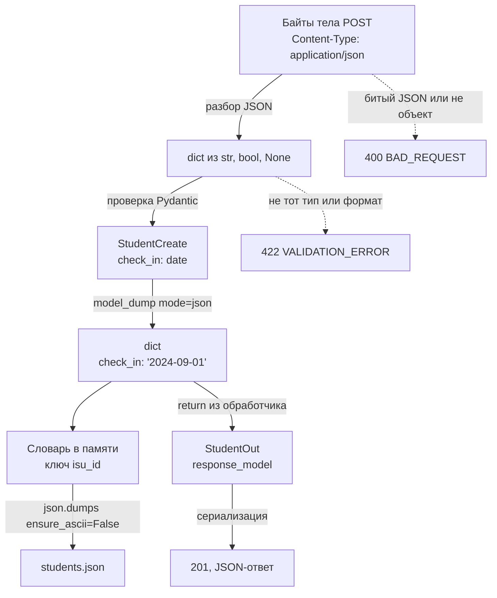

*Схема: типизированная модель существует только на границе запроса. Внутрь сервер кладёт уже JSON-совместимый словарь, поэтому запись в файл не требует преобразований. На выходе `StudentOut` заново разбирает строковые даты в `date` и сериализует их обратно.*

> [!NOTE]
> **В твоей работе**
>
> Файл: `backend/app/service.py`, строки 94–104
>
> ```python
> def create(self, data: StudentCreate) -> dict:
>     check_dates(data.check_in, data.check_out)
>     student = data.model_dump(mode="json")
>     ...
> def update(self, isu_id: str, changes: StudentUpdate) -> dict:
>     fields = changes.model_dump(mode="json", exclude_unset=True)
> ```
>
> Файл: `backend/app/repository.py`, строки 33–35
>
> ```python
> def save(self) -> None:
>     records = list(self.students.values())
>     self.path.write_text(json.dumps(records, ensure_ascii=False, indent=2), encoding="utf-8")
> ```
>
> Проверка дат в `create` идёт на модели, где даты — объекты `date`. В хранилище уходит словарь в `mode="json"`. Благодаря этому в памяти и в файле лежит одно и то же представление: `json.dumps` не споткнётся о дату, а `load()` при запуске (`repository.py`, строка 21) получает ровно то, что было в памяти до перезапуска. Как устроено само хранение — [вопрос 17](#q17). Обратная сторона: внутри сервиса даты — строки, и в `update` их приходится вручную разбирать через `date.fromisoformat` (`service.py`, строки 113–114). Ошибки разбора тела `errors.py` превращает в 400 (строки 40–45): битый JSON, пустое тело, тело не объект или без `application/json`. Остальные ошибки проверки — 422.
>
> На клиенте `api.js` (строки 36–38) ставит `Content-Type: application/json` и сериализует тело через `JSON.stringify`, а ответ читает `response.json()` (строка 57). Для 204 ответ не разбирается вовсе: тела нет, и `response.json()` упал бы. Форма передаёт даты строками из `<input type="date">` и явно отправляет `check_out: null`, если студент ещё живёт (`form.js`, строка 114).
>
> Вероятный вопрос: «Зачем `mode="json"`, если можно хранить модель?»

> [!WARNING]
> **Подводный камень**
>
> В браузере с московским временем `JSON.stringify(new Date(2024, 8, 1))` даёт не `"2024-09-01"`, а `"2024-08-31T21:00:00.000Z"`: объект `Date` — момент времени, и при сериализации он переводится в UTC. Сервер работы принимает только строку ровно `ГГГГ-ММ-ДД` и ответит 422. Даже если бы он принимал полную дату со временем, день съехал бы на сутки. Дату без времени передают строкой, а не объектом `Date`.

> [!TIP]
> **Могут спросить**
>
> **Зачем `mode="json"`, если можно хранить модель или обычный `model_dump()`?** Обычный `model_dump()` оставляет `date`, и `json.dumps` в `save()` упадёт с `TypeError`. `mode="json"` сразу даёт форму, которая без преобразований пишется в файл и читается обратно. Цена — даты внутри сервиса становятся строками, и для сравнения их надо разбирать.
>
> **Чем `response_model` отличается от простого `return dict`?** Без него FastAPI сериализует то, что вернули, как есть. С ним результат проверяется и фильтруется по модели `StudentOut`: лишние ключи не уходят клиенту, а модель попадает в документацию OpenAPI как схема ответа.
>
> **Что вернёт сервер, если тело — массив `[...]` или испорченный JSON?** 400 в едином формате ошибки: тело не подходит синтаксически, и проверять поля бессмысленно. Если же JSON корректный, но поле не того типа, — 422 с указанием поля в `details`. Подробнее о границе 400/422 — [вопрос 15](#q15).

## Вопрос 15. Серверная валидация и обработка ошибок.

Форма в браузере может проверить, что номер ИСУ состоит из шести цифр, а дата выселения позже даты заселения. Но API принимает запросы не только от формы: тот же `POST /api/requests` можно отправить через `curl`, Postman или чужой скрипт, а проверки в JavaScript отключаются в devtools за секунду. Если сервер верит тому, что пришло, в хранилище попадут студент с ИСУ `"abc"`, комната `"0000"` и запись, где выселение раньше заселения. Отсюда правило: **серверная валидация** — единственная проверка, на которую можно опереться, а проверки на клиенте нужны только для удобства пользователя. Второй вопрос — что ответить, если данные плохие: клиенту нужен понятный код, сообщение и указание на конкретное поле, а не трейсбэк и не `200 OK` с текстом «ошибка».

### Уровни проверки

Входящий запрос проверяется в несколько этапов. На каждом этапе ловятся свои ошибки, и у каждой свой HTTP-код.

| Уровень | Что проверяется | Кто проверяет | Код |
|:--|:-----------|:-----|:--|
| Синтаксис | тело — корректный JSON, это объект, тело вообще есть | разбор тела во фреймворке | 400 |
| Структура и формат | обязательные поля, типы, шаблоны, длины, допустимые значения, лишние поля | Pydantic-модель | 422 |
| Бизнес-правила | соотношения полей и данные «из мира»: даты, сроки проживания | сервис | 422 |
| Состояние хранилища | ИСУ уже занят; студента с таким ИСУ нет | сервис + репозиторий | 409 / 404 |
| Непредвиденное | ошибка в коде, сбой записи файла | общий обработчик | 500 |

Разница между **400** и **422** такая: 400 означает «я не понял твой запрос» (тело не разбирается как JSON), 422 — «запрос понятен, но данные в нём неверны» (JSON корректный, только группа `"m33"` не подходит под шаблон). Подробнее о самих кодах и их классах — [вопрос 12](#q12).

Порядок уровней важен: нет смысла проверять даты, пока не известно, что поле `check_in` вообще является датой. Структурная проверка отсекает мусор до бизнес-логики, поэтому код сервиса может полагаться на типы и не проверять каждое поле на `None` и на строку.

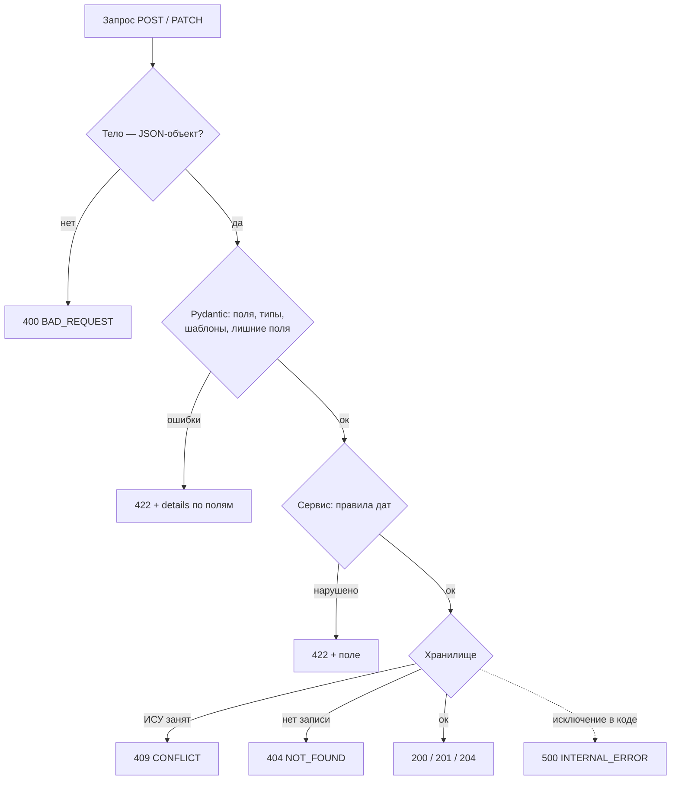

*Схема: запрос проходит фильтры от дешёвых к дорогим. Pydantic собирает все ошибки формата сразу, поэтому клиент получает полный список проблемных полей за один ответ; правила сервиса проверяются только на уже типизированных данных и останавливаются на первом нарушении.*

### Структурная валидация и нормализация

Структурные правила удобно описывать декларативно — моделью, в которой тип поля и ограничения записаны рядом (о моделях — [вопрос 4](#q4), об `Annotated` и `Literal` — [вопрос 3](#q3)). В FastAPI модель, указанная в параметре обработчика, проверяется до вызова твоего кода: если данные не подходят, обработчик не вызывается, а фреймворк бросает `RequestValidationError`.

Перед проверкой полезно **нормализовать** ввод: убрать пробелы по краям, схлопнуть двойные пробелы в ФИО, привести группу к верхнему регистру. Тогда `" m3301 "` и `"M3301"` станут одним значением, и пользователь не получит ошибку из-за лишнего пробела. Нормализация выполняется до проверки шаблона — иначе шаблон `^[A-Z][0-9]{4}$` отверг бы строчную букву.

Два приёма делают модель строже, чем по умолчанию:

- `extra="forbid"` — неизвестное поле (`"isu"` вместо `"isu_id"`, попытка передать `isu_id` в PATCH) даёт ошибку, а не молча отбрасывается. Без этого опечатка в имени поля выглядит как успешный запрос, который ничего не изменил.
- `StrictBool` и строгие форматы — Pydantic по умолчанию приводит типы: строка `"yes"` станет `True`, число `1704067200` — датой. Для тела JSON, где у значения есть настоящий тип, такая услужливость скрывает ошибки клиента.

**Плохо:**

```python
@app.post("/api/requests")
def create_student():
    data = request.get_json()
    students[data["isu_id"]] = data      # верим клиенту: любые поля, любые типы
    return {"ok": False, "error": "..."} if not data.get("full_name") else data
```

**Хорошо:**

```python
class StudentCreate(BaseModel):
    model_config = ConfigDict(extra="forbid")   # лишние поля — ошибка
    isu_id: Annotated[str, Field(pattern=r"^[0-9]{6}$")]
    is_foreign: StrictBool                      # "true" строкой не пройдёт

@router.post("", status_code=201)
def create_student(student: StudentCreate, service: Service):
    return service.create(student)              # сюда доходят только проверенные данные
```

Первый вариант падает с `KeyError` (а это 500) при отсутствии `isu_id`, сохраняет в хранилище что угодно и сообщает об ошибке кодом 200 — клиент, который смотрит на статус ответа, сочтёт запрос успешным.

### Бизнес-правила

Не всё укладывается в тип поля. «Выселение позже заселения» связывает два поля; «заселение не позже чем через год от сегодня» зависит от текущей даты; «ИСУ не занят» зависит от содержимого хранилища. Межполевые правила можно описать в модели (`@model_validator`), но правила, которым нужны хранилище или итоговое состояние записи, место в сервисе. Типичный пример — PATCH: клиент прислал только `check_out`, а сравнивать его надо с `check_in`, который уже хранится. Проверить это можно только после слияния изменений с текущей записью.

Сервис сообщает о нарушении исключением из своей иерархии (`RuleViolationError`, `ConflictError`, `NotFoundError`); он ничего не знает про HTTP-коды. Перевод исключения в ответ делается в одном месте — обработчиками исключений фреймворка. Механика исключений и регистрации обработчиков — [вопрос 5](#q5).

### Единый формат ошибки

Если каждый эндпоинт возвращает ошибку по-своему (где-то `{"detail": "..."}`, где-то строку, где-то `{"msg": ...}`), клиенту приходится писать разбор под каждый случай. **Единый формат** решает это: любая ошибка — 400, 404, 409, 422 или 500 — приходит с одинаковой структурой.

```json
{
  "error": {
    "status": 422,
    "code": "VALIDATION_ERROR",
    "message": "Данные не прошли проверку",
    "details": [
      {"field": "group", "message": "Группа — латинская буква и 4 цифры, например M3301"},
      {"field": "isu", "message": "Неизвестное поле"}
    ]
  }
}
```

`code` — машиночитаемый ярлык для ветвления в коде клиента, `message` — текст для человека, `details` — привязка к полям, чтобы форма подсветила именно те поля, которые не прошли проверку. Существуют и стандартные форматы: RFC 9457 (Problem Details, `application/problem+json`) с полями `type`, `title`, `status`, `detail`; собственный формат допустим, если он один на весь API.

**500** — особый случай. Ответ на непредвиденную ошибку не должен содержать трейсбэк, текст исключения, пути к файлам и SQL: это подсказки атакующему и бесполезный для пользователя шум. Клиент получает общее сообщение, подробности пишутся в лог сервера.

> [!NOTE]
> **В твоей работе**
>
> Файл: `backend/app/schemas.py`, строки 48–65
>
> ```python
> Group = Annotated[str, BeforeValidator(strip_upper), Field(pattern=r"^[A-Z][0-9]{4}$")]
> Room = Annotated[str, Field(pattern=r"^[1-9][0-9]{3}$")]
> IsoDate = Annotated[date, BeforeValidator(require_iso_date)]
> ...
> class StudentCreate(BaseModel):
>     model_config = ConfigDict(extra="forbid")
>
>     isu_id: IsuId
>     ...
>     check_out: IsoDate | None = None
>     is_foreign: StrictBool
>     notes: Notes = ""
> ```
>
> Требование 2 («серверная валидация входных данных») закрыто на двух уровнях. Формат полей — в `schemas.py`: `BeforeValidator` нормализует значение до проверки шаблона, `require_iso_date` пропускает дату только строкой `ГГГГ-ММ-ДД` (без него Pydantic принял бы и число-timestamp), `extra="forbid"` запрещает лишние поля. В `StudentFilter` поля `is_foreign` и `living` объявлены обычным `bool`, а не `StrictBool`: query-параметры всегда приходят строками, и `"true"` должна превратиться в `True`. Правила дат — в `service.check_dates` (`service.py`, строки 50–70); в `update` они проверяются внутри `merge`, на уже слитой записи.
>
> Файл: `backend/app/errors.py`, строки 78–87
>
> ```python
> def validation_error_handler(request: Request, exc: RequestValidationError) -> JSONResponse:
>     errors = exc.errors()
>
>     for error in errors:
>         if is_body_error(error):
>             return error_response(400, "BAD_REQUEST", BODY_ERRORS[error["type"]])
>
>     hints = FILTER_HINTS if request.method in ("GET", "QUERY") else FIELD_HINTS
>     details = [describe(error, hints) for error in errors]
>     return error_response(422, "VALIDATION_ERROR", "Данные не прошли проверку", details)
> ```
>
> FastAPI сообщает обо всех ошибках входа одним исключением `RequestValidationError`, и по умолчанию отвечает на всё кодом 422. Этот обработчик разделяет случаи: битый JSON, отсутствие тела или тело-не-объект — 400, всё остальное — 422 со списком полей и понятными подсказками вместо технических сообщений Pydantic. Ошибки сервиса переводятся в коды словарём `SERVICE_ERRORS` (строки 8–13), а `unexpected_error_handler` (строки 95–96) отдаёт 500 без подробностей. Так закрыт пункт условия про единый формат и коды 200–500. Клиент пользуется `details`: `form.js` (строки 130–149) раскладывает сообщения под поля формы при 422 и 409.
>
> На защите могут спросить, почему некорректный ИСУ в пути (`GET /api/requests/12ab`) даёт 422, а не 404. Ответ: `IsuPath` проверяет шаблон до обращения к хранилищу, и формально запрос с таким адресом — ошибка формата параметра. Клиент `form.js` (строка 84) трактует 404 и 422 одинаково — «Студент не найден».

> [!WARNING]
> **Подводный камень**
>
> Ошибки Pydantic приходят все сразу, а правила сервиса — по одной: `check_dates` бросает исключение на первом нарушении. Если в POST неверны и даты, и ИСУ уже занят, клиент увидит только 422 про даты (в `create` даты проверяются раньше добавления в хранилище), а 409 — лишь после исправления. Это нормально, но об этом стоит знать, объясняя порядок проверок.

> [!CAUTION]
> **Расхождение с практикой**
>
> Три спорных места. Пустой PATCH (`{}`) отвечает 400 (`EmptyUpdateError`), хотя JSON корректный, — по логике «понятный запрос с неподходящим содержимым» это ближе к 422; защищать можно так: запрос бессмысленен как операция, а не неверен по полям, поэтому и `details` пустой. Правило дат зависит от `date.today()`: одна и та же запись сегодня проходит проверку, а через год — нет; это осознанное бизнес-правило, но его стоит назвать. Наконец, `form.js` по-прежнему ограничивает даты (атрибуты `min`/`max`, своя константа `MAX_STAY_YEARS = 9`): это подсказка для удобства, решение принимает сервер, но правило записано в двух местах и при изменении может разойтись.

Границы применимости: валидация в модели и сервисе подходит, пока проверки локальны. Уникальность ИСУ надёжна только потому, что проверка и вставка выполняются под одной блокировкой в репозитории ([вопрос 17](#q17)); в системе с несколькими экземплярами сервера такую гарантию даёт только ограничение уникальности в базе данных.

> [!TIP]
> **Могут спросить**
>
> **Зачем проверять на сервере, если форма уже проверяет?** Сервер не знает, кто прислал запрос: форму можно обойти через `curl` или devtools. Клиентская проверка экономит пользователю время, серверная защищает данные. По условию клиент stateless и не содержит бизнес-логики, поэтому авторитетная проверка — только на сервере.
>
> **Чем 400 отличается от 422 в твоей работе?** 400 — тело не удалось разобрать: некорректный JSON, тела нет, или это не объект. 422 — JSON корректен, но поля не проходят проверку формата или бизнес-правил. Пустой PATCH — исключение, он отвечает 400.
>
> **Что увидит клиент, если в коде сервиса возникнет `KeyError`?** Ответ 500 в едином формате с кодом `INTERNAL_ERROR` и общим сообщением, без текста исключения. Трейсбэк попадёт в консоль uvicorn: после обработчика Starlette пробрасывает исключение серверу (подробнее — [вопрос 5](#q5)).

## Вопрос 16. Stateless-архитектура.

Сервер обслуживает много клиентов сразу. Если он помнит про каждого, «на чём тот остановился» (какой фильтр выбран, какая страница списка открыта, какую запись он сейчас редактирует), то следующий запрос клиента имеет смысл только для того процесса, который это запомнил. Второй экземпляр сервера за балансировщиком такого клиента не поймёт, после перезапуска память пропадёт, а память на хранение этих данных растёт с числом клиентов. Stateless-архитектура снимает проблему: сервер не помнит клиента между запросами, и любой запрос можно обработать, ничего не зная о предыдущих.

### Состояние сессии и состояние ресурса

Слово «состояние» здесь означает две разные вещи, и их нужно различать.

**Состояние сессии** (состояние приложения на стороне клиента) — то, где клиент находится в работе с системой: выбранные фильтры `group=M3301`, номер страницы, открытая карточка студента `412345`. Оно касается одного клиента.

**Состояние ресурса** — сами данные системы: список студентов, их комнаты, даты заселения. Оно общее для всех клиентов, и хранить его — прямая обязанность сервера.

Ограничение **stateless** в REST (подробнее о REST — [вопрос 11](#q11)) запрещает серверу хранить только первое. Каждый запрос должен быть **самодостаточным**: всё, что нужно для его обработки, — метод, URI, параметры, тело, заголовки, включая данные аутентификации, — приходит в самом запросе. При этом сервер может и должен хранить студентов: stateless не значит «сервер вообще без данных».

**Плохо:**

```python
# сервер запоминает фильтр каждого клиента
saved_filters: dict[str, dict] = {}          # ключ — id сессии из cookie

@app.post("/api/requests/filter")
def set_filter(filters: dict, session_id: str = Cookie()):
    saved_filters[session_id] = filters

@app.get("/api/requests")
def list_students(session_id: str = Cookie()):
    return service.find(saved_filters.get(session_id, {}))
```

**Хорошо:**

```python
# фильтр приходит в каждом запросе
@router.get("")
def list_students(filters: Annotated[StudentFilter, Query()], service: Service):
    return service.find(filters)
```

В первом варианте результат `GET /api/requests` зависит от того, что этот же клиент делал раньше и на каком процессе. Ссылку на отфильтрованный список нельзя переслать коллеге, кэш не может сохранить ответ по URL, а после перезапуска сервера фильтр молча сбрасывается. Во втором варианте `GET /api/requests?group=M3301&dormitory=alp` значит одно и то же для любого клиента, в любой момент и на любом экземпляре сервера.

### Что даёт stateless и чем за него платят

| Плюс | Почему |
|:--|:----------|
| Горизонтальное масштабирование | любой экземпляр сервера обработает любой запрос, балансировщику не нужна «липкая» привязка клиента к процессу |
| Устойчивость к перезапуску | серверу нечего терять, кроме данных ресурса, а они в хранилище |
| Простота | нет таблиц сессий, их очистки по таймауту, синхронизации между экземплярами |
| Кэшируемость и видимость | ответ определяется запросом, его можно кэшировать и понять по логу |

Платить приходится повторной передачей данных: фильтры, токен аутентификации и прочий контекст идут в каждом запросе. Аутентификацию поэтому обычно делают токеном в заголовке `Authorization` (например JWT, который сервер проверяет подписью без обращения к хранилищу сессий), а не серверной сессией. В этой работе аутентификации нет, поэтому эта сторона вопроса не возникает.

### Stateless в условии: клиент без состояния

В условии stateless сформулировано про клиент: «интерфейс должен работать в режиме stateless (бизнес-логика должна мигрировать на серверную часть)». Это другая, хотя и близкая, мысль: клиент не хранит данных у себя и не принимает решений за сервер. **Источник правды** — сервер: клиент на каждое действие отправляет запрос и показывает ответ.

Что это значит на практике, видно по сравнению с ЛР1 (по описанию автора в `REPORT.md`): там студенты лежали в cookies браузера, идентификатор генерировал клиент, проверки полей выполнял JavaScript. Теперь хранение, проверка уникальности ИСУ и вся валидация — на сервере ([вопрос 15](#q15)), а клиент только собирает данные из формы, отправляет их и выводит ответ или ошибку из поля `details`.

Состояние интерфейса при этом никуда не девается: пользователь выбрал фильтры, открыл карточку. Его кладут туда, где оно ничего не ломает, — в URL. Тогда страница восстанавливается по адресу, её можно обновить, добавить в закладки и переслать.

> [!NOTE]
> **В твоей работе**
>
> Форма фильтров на `frontend/index.html` (строка 27) объявлена как `<form method="get" action="index.html">`: при нажатии «Найти» браузер сам переносит поля в query-строку адреса страницы. Скрипт списка читает фильтры оттуда.
>
> Файл: `frontend/js/list.js`, строки 38–52
>
> ```javascript
> function readFilters() {
>     const params = new URLSearchParams(window.location.search);
>     const filters = {};
>
>     FILTER_NAMES.forEach(function (name) {
>         const value = (params.get(name) || "").trim();
>         filterForm.elements[name].value = value;
>
>         if (value !== "") {
>             filters[name] = parseFilterValue(name, value);
>         }
>     });
>
>     return filters;
> }
> ```
>
> Ни cookies, ни `localStorage` в клиенте нет: идентификатор открытой карточки тоже берётся из URL (`?id=412345`, функция `getIdFromUrl` в `api.js`), а весь обмен с сервером идёт через одну функцию `request` в `frontend/js/api.js`. Возможный вопрос: «Где у тебя хранится выбранный фильтр?» Ответ: только в адресе страницы; сервер его не запоминает, а получает заново с каждым запросом.

> [!WARNING]
> **Подводный камень**
>
> В `index.html` у полей фильтра остались атрибуты `pattern` и `maxlength`. Это не противоречит требованию: браузерная проверка — подсказка для удобства пользователя, а не бизнес-логика. Решение принимает сервер, и запрос в обход интерфейса (curl, Postman) проверяется точно так же. Противоречием было бы, если бы клиент оставался единственным местом проверки.

### Сервер с данными в памяти: stateless или нет

Сервер работы не хранит сессий, значит, по отношению к клиентам он stateless. Но как хранилище он **stateful**: студенты лежат в словаре внутри процесса (`app.state.repository`, [вопрос 7](#q7)), и этот словарь существует в одном экземпляре. Поэтому сервер нельзя размножить. README прямо предупреждает: запускать без `--workers`, иначе у каждого воркера будет своя копия словаря и они будут затирать файл друг друга.

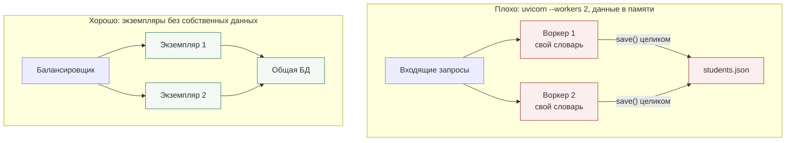

*Схема: в верхнем варианте студент, добавленный через воркер 1, не виден воркеру 2, а следующая запись воркера 2 перепишет файл своей копией и удалит этого студента. В нижнем экземпляры одинаковые и взаимозаменяемые, потому что единственная копия данных лежит вне их.*

Общепринятый способ масштабировать сервер — вынести состояние ресурса во внешнее хранилище (PostgreSQL, Redis), а сами процессы приложения сделать одинаковыми и без собственных данных. Тогда их можно добавлять, убирать и перезапускать по одному. Как устроено хранение в этой работе и где его пределы, разобрано в [вопросе 17](#q17).

> [!CAUTION]
> **Расхождение с практикой**
>
> Хранение в памяти процесса не масштабируется горизонтально: работает ровно один процесс uvicorn. На защите стоит сказать, что такое хранение разрешено условием (требование 4) и достаточно для учебного объёма, что ограничение осознанное и описано в README, и что при росте нагрузки репозиторий заменяется на работу с БД без изменений в маршрутах и клиенте ([вопрос 10](#q10)).

> [!TIP]
> **Могут спросить**
>
> **Если сервер хранит студентов, почему он считается stateless?** Stateless относится к состоянию сессии: сервер не помнит, что делал конкретный клиент до текущего запроса. Данные ресурса хранить можно и нужно, иначе API было бы бесполезным.
>
> **Чем cookie с id сессии отличается от токена в заголовке?** Сам по себе cookie — только способ доставки. Нарушение stateless — когда по id из cookie сервер ищет у себя состояние клиента. Самодостаточный токен (например подписанный JWT) несёт нужные данные в себе, и любой экземпляр проверит его без общего хранилища сессий.
>
> **Что будет, если обновить страницу со списком?** Фильтры восстановятся из адреса, и клиент заново запросит список у сервера. Ничего не теряется, потому что у клиента и не было данных, которые нужно было бы сохранять.

## Вопрос 17. Хранение и фильтрация данных в памяти и JSON-файлах.

Серверу нужно где-то держать студентов между запросами. Полноценная СУБД для учебного API на сотню записей избыточна: её надо поставить, настроить, описать схему. Условие (требование 4) разрешает два простых варианта: хранить данные в памяти приложения или в JSON-файле. У каждого есть свои слабые места, и чтобы ими пользоваться, нужно понимать, что они дают и чего не дают: сохранность при перезапуске, корректность при одновременных запросах, целостность при сбое, скорость поиска.

### Память, файл и их сочетание

**Хранение в памяти** — обычная структура данных Python внутри процесса сервера. Чтение и запись быстрые, кода почти нет. Но данные живут, пока жив процесс: перезапуск, падение или `--reload` после правки кода стирают всё. И они видны только этому процессу ([вопрос 16](#q16)).

**Хранение в JSON-файле** переживает перезапуск, а файл можно открыть глазами. Цена в том, что у файла нет ни индексов, ни частичного обновления: чтобы поменять одну комнату, нужно прочитать весь файл, разобрать его, изменить и записать заново целиком (формат JSON разобран в [вопросе 14](#q14)).

Обычно их сочетают. При старте файл один раз читается в память, все чтения идут из памяти, а каждое изменение сразу записывается и в память, и в файл. Такую схему называют **сквозной записью** (write-through).

| Вариант | Переживает перезапуск | Чтение | Запись | Несколько процессов |
|:--|:--|:--|:----|:--|
| Только память | нет | O(1) по ключу | O(1) | нет, у каждого своя копия |
| Только файл | да | разбор всего файла | перезапись всего файла | только с файловыми блокировками |
| Память + файл | да | O(1) по ключу | O(1) в памяти + перезапись файла | нет |

### Структура в памяти: словарь по ИСУ

Список студентов `list[dict]` — первое, что приходит в голову, но для поиска `GET /api/requests/412345` по нему придётся пройти все записи, а уникальность ИСУ (требование 3) проверять тем же проходом. Словарь `dict[str, dict]` с ключом `isu_id` даёт поиск за O(1) в среднем, а уникальность получается сама: двух одинаковых ключей в словаре не бывает. В файле удобнее массив (так он читается и редактируется естественнее), поэтому при загрузке массив превращается в словарь, а при сохранении обратно в список значений. Выбор коллекций подробнее — в [вопросе 9](#q9).

### Одновременные запросы и блокировка

Обработчики работы объявлены через `def`, и FastAPI выполняет их в пуле потоков ([вопрос 8](#q8)). Значит, два запроса могут работать с одним словарём одновременно. Опасна не одиночная операция со словарём, а последовательность «прочитать — решить — записать». Два `POST` с ИСУ `412345` оба проверят «такого ключа нет», и оба добавят запись: второй молча затрёт первого вместо ответа 409. Два `PATCH` одного студента (один меняет комнату, другой дату выселения) оба прочитают исходную запись и запишут каждый свою версию, и одно изменение потеряется. Это классическое **потерянное обновление**.

Лечится это блокировкой (`threading.Lock`), под которой выполняется вся последовательность целиком, включая запись в файл. Иначе два потока начнут писать файл одновременно.

> [!NOTE]
> **В твоей работе**
>
> Файл: `backend/app/repository.py`, строки 45–61
>
> ```python
> def add(self, student: dict) -> bool:
>     with self.lock:
>         if student["isu_id"] in self.students:
>             return False
>         self.students[student["isu_id"]] = student
>         self.save()
>         return True
>
> def update(self, isu_id: str, change: Callable[[dict], dict]) -> dict | None:
>     with self.lock:
>         current = self.students.get(isu_id)
>         if current is None:
>             return None
>         student = change(current)
>         self.students[isu_id] = student
>         self.save()
>         return student
> ```
>
> Проверка дубля и вставка в `add` идут под одной блокировкой, поэтому гонки двух `POST` нет, и второй получит `False`, а сервис превратит это в 409. В `update` репозиторий не знает правил предметной области: он принимает функцию `change` (в сервисе это замыкание `merge`, которое сливает поля и проверяет даты) и вызывает её под блокировкой. Так проверка дат выполняется на актуальной записи, а не на копии, прочитанной до чужого изменения. Если `merge` бросит `RuleViolationError`, `with` отпустит блокировку, а словарь останется нетронутым: присваивание стоит после вызова. `merge` строит новый словарь `{**current, **fields}`, а не меняет старый, поэтому поток, который в этот момент отдаёт старую запись клиенту, не увидит её наполовину изменённой.

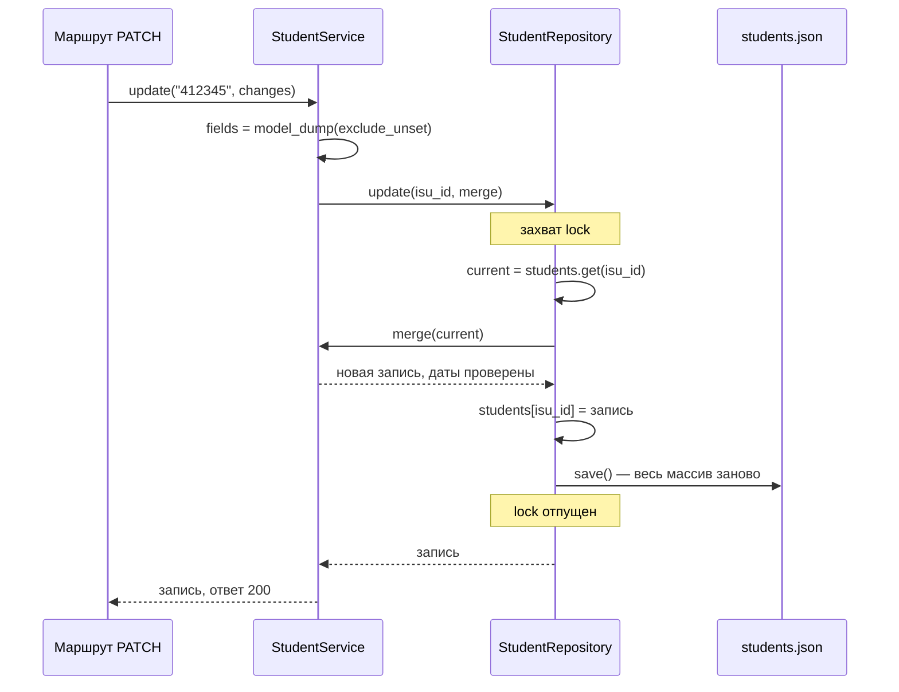

*Схема: всё от чтения текущей записи до записи файла происходит под одной блокировкой, и параллельный PATCH того же или другого студента ждёт. Обратная сторона: пока пишется файл, ждут и все чтения, потому что `list_all` и `get` берут ту же блокировку.*

### Запись файла: атомарность и кодировка

`Path.write_text` открывает файл с обрезкой до нуля байт и пишет новое содержимое. Если процесс упадёт, закончится место на диске или выключится машина посреди записи, на диске останется половина JSON. Чтобы этого не было, применяют **атомарную запись**: содержимое пишется во временный файл рядом, сбрасывается на диск, после чего временный файл переименовывается в основной. `os.replace` в пределах одной файловой системы выполняет замену атомарно, поэтому на диске всегда лежит либо старая, либо новая полная версия.

**Плохо:**

```python
def save(self) -> None:
    records = list(self.students.values())
    self.path.write_text(json.dumps(records, ensure_ascii=False, indent=2), encoding="utf-8")
```

**Хорошо:**

```python
def save(self) -> None:
    records = list(self.students.values())
    tmp = self.path.with_suffix(".json.tmp")
    with tmp.open("w", encoding="utf-8") as file:
        json.dump(records, file, ensure_ascii=False, indent=2)
        file.flush()
        os.fsync(file.fileno())      # данные действительно на диске
    os.replace(tmp, self.path)       # атомарная замена
```

Первый вариант — дословно код работы (`repository.py`, строки 33–35).

Ещё две детали записи. `encoding="utf-8"` нужно указывать явно: без него Python берёт кодировку системы, и на Windows это может быть `cp1251`, так что файл, записанный на одной машине, не прочитается на другой. `ensure_ascii=False` оставляет «Иванов Иван Иванович» читаемым в файле вместо escape-последовательностей (подробнее — [вопрос 14](#q14)). На корректность это не влияет, только на удобство.

> [!NOTE]
> **В твоей работе**
>
> Файл: `backend/app/repository.py`, строки 15–31
>
> ```python
> def load(self) -> None:
>     if not self.path.exists():
>         self.path.parent.mkdir(parents=True, exist_ok=True)
>         self.path.write_text("[]", encoding="utf-8")
>
>     try:
>         records = json.loads(self.path.read_text(encoding="utf-8"))
>     except json.JSONDecodeError as error:
>         raise RuntimeError(
>             f"Файл {self.path} повреждён ({error}). Сервер не запущен, ..."
>         ) from error
>     ...
>     self.students = {record["isu_id"]: record for record in records}
> ```
>
> Отсутствующий файл — нормальный первый запуск: создаётся пустой массив. Битый файл — ошибка, и сервер отказывается стартовать, а не начинает с пустого списка. Это правильное решение: иначе первая же запись затёрла бы повреждённый, но ещё восстановимый файл. Но в сочетании с неатомарным `save()` получается неприятная цепочка: сбой во время записи, затем битый файл, затем сервер не поднимается без ручного вмешательства. Вызов `load()` в `lifespan` при старте приложения описан в [вопросе 7](#q7).

### Фильтрация в памяти

Без индексов фильтрация — это **линейный проход**: каждая запись проверяется по всем условиям, время O(n). Для сотен и тысяч записей это микросекунды-миллисекунды, и строить индексы бессмысленно.

Условия бывают разной природы. **Точное совпадение** подходит для кодов и идентификаторов (`group`, `dormitory`, `room`, `is_foreign`). Для ФИО пользователь вводит часть фамилии, поэтому нужен **поиск подстроки без учёта регистра**: `casefold()` надёжнее `lower()` для Unicode (например, немецкое `ß` превращается в `ss`). **Вычисляемый фильтр** не соответствует ни одному полю: «проживает сейчас» значит `check_out is None`.

> [!NOTE]
> **В твоей работе**
>
> Файл: `backend/app/service.py`, строки 33–40 и 73–84
>
> ```python
> FILTER_CHECKS = {
>     "full_name": lambda student, value: value.casefold() in student["full_name"].casefold(),
>     "group": lambda student, value: student["group"] == value,
>     ...
>     "living": lambda student, value: (student["check_out"] is None) == value,
> }
>
> def matches(student: dict, conditions: dict) -> bool:
>     return all(FILTER_CHECKS[name](student, value) for name, value in conditions.items())
> ...
>     def find(self, filters: StudentFilter) -> list[dict]:
>         conditions = filters.model_dump(exclude_none=True)
>         found = (student for student in self.repository.list_all() if matches(student, conditions))
>         return list(found)
> ```
>
> Фильтры объединяются по «И»: `all` вернёт `True` для пустого набора условий, поэтому запрос без фильтров отдаёт всех. Не заданные фильтры отбрасываются через `exclude_none=True`. Новый фильтр добавляется одной строкой в словарь. Фильтрация выполняется в сервисе, а не в репозитории: при переходе на БД её пришлось бы переносить в SQL `WHERE`. `list_all` под блокировкой копирует список, а проход идёт уже без неё и не задерживает запись. Сравнение `group` точное, но работает без учёта регистра, потому что модель приводит группу к верхнему регистру и на входе, и в фильтре ([вопрос 15](#q15)).

### Границы применимости

| Когда хватает памяти + JSON | Когда нужна СУБД |
|:----------|:----------|
| сотни–тысячи записей | десятки тысяч и больше: перезапись файла на каждое изменение становится заметной |
| один процесс сервера | несколько воркеров или экземпляров |
| редкие изменения | частая запись: блокировка на время записи файла сериализует все запросы |
| простые фильтры перебором | поиск по индексам, сортировка, пагинация, связи между таблицами |
| потеря последнего изменения при сбое терпима | нужны транзакции и гарантии сохранности (ACID) |

Перечисленное в правой колонке СУБД (SQLite для одного процесса, PostgreSQL для нескольких) даёт без дополнительного кода. Слой репозитория в работе отделён ([вопрос 10](#q10)), поэтому замена хранилища затронет `repository.py` и место, где вызывается фильтрация.

> [!CAUTION]
> **Расхождение с практикой**
>
> `save()` пишет файл напрямую, без временного файла и `os.replace`, и переписывает его целиком при каждом изменении, удерживая блокировку. По практике запись делают атомарной. Защищать так: хранение в файле разрешено условием, на учебном объёме перезапись занимает доли миллисекунды, повреждённый файл не затирается молча (сервер останавливается с понятным сообщением), а исправление занимает несколько строк и показано выше.

> [!TIP]
> **Могут спросить**
>
> **Почему бы не читать файл на каждый запрос вместо словаря в памяти?** Тогда каждый `GET` разбирал бы весь файл, что медленнее, и всё равно нужна была бы блокировка против чтения недописанного файла. Память даёт быстрые чтения, а файл нужен только для сохранности при перезапуске.
>
> **Что будет, если отредактировать `students.json` руками, пока сервер работает?** Сервер изменений не увидит: он читает файл только при старте. А при первом же изменении через API перезапишет файл своей копией, и ручные правки пропадут.
>
> **Как ускорить фильтрацию, если студентов станет много?** Завести вспомогательные словари-индексы, например `dormitory → множество ИСУ`, и поддерживать их при каждом изменении. Но это уже ручная реализация того, что СУБД делает индексом, и правильный шаг на таком объёме — переход на СУБД.

## Вопрос 18. CRUD-операции и уникальная идентификация ресурсов.

Почти любая учётная система делает с данными одно и то же: заводит запись, показывает её, правит и удаляет. Студента заселили — появилась запись, сменилась комната — запись изменилась, ошибочную запись убрали. Чтобы над записью можно было выполнить что-то кроме «создать», её нужно однозначно найти: если у двух студентов один и тот же идентификатор, команда «удали студента 412345» становится неоднозначной. Поэтому набор базовых операций и способ идентификации всегда идут вместе.

### CRUD и его отображение на HTTP

**CRUD** — аббревиатура четырёх базовых операций над данными: Create (создать), Read (прочитать), Update (изменить), Delete (удалить). Это понятие не из HTTP: те же четыре операции есть в SQL (`INSERT`, `SELECT`, `UPDATE`, `DELETE`) и в любом хранилище. В REST API CRUD выражается через HTTP-методы над URI ресурса: что делать, говорит метод, над чем — адрес (о ресурсах и URI подробнее — [вопрос 11](#q11)).

| Операция | Метод и адрес | Успех | Типичные ошибки |
|:--|:-----------|:------|:------|
| Create | `POST /api/requests` | `201 Created`, тело — созданный студент | `409` дубль ИСУ, `422` неверные поля |
| Read (список) | `GET /api/requests?group=M3301` | `200`, массив (может быть пустым) | `422` неверный фильтр |
| Read (один) | `GET /api/requests/412345` | `200`, объект | `404` нет такого |
| Update | `PATCH /api/requests/412345` | `200`, обновлённый объект | `404`, `422`, `400` пустое тело |
| Delete | `DELETE /api/requests/412345` | `204 No Content`, тела нет | `404` |

Операции над коллекцией (`/api/requests`) — создание и поиск; операции над элементом (`/api/requests/{isu_id}`) — чтение, изменение, удаление конкретного студента. Для Update есть два метода: `PUT` заменяет ресурс целиком, `PATCH` меняет только присланные поля; свойства методов (безопасность, идемпотентность) и полная таблица кодов — в [вопросе 12](#q12).

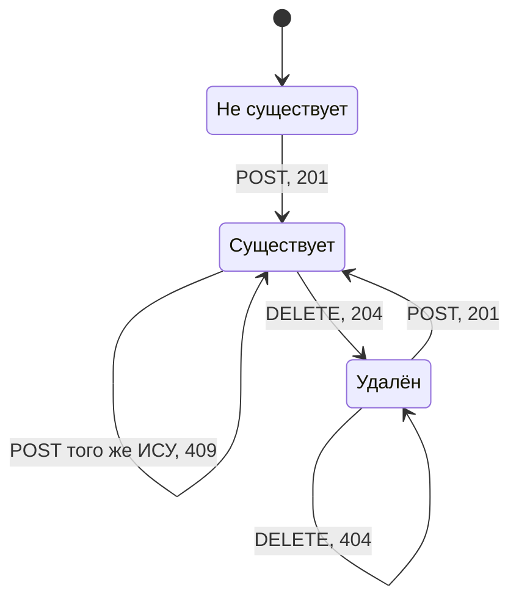

*Схема: жизненный цикл студента как ресурса. Повторный POST с тем же ИСУ не создаёт второй записи, а получает 409 — состояние не меняется. После удаления ресурс неотличим от несуществующего: его снова можно создать тем же ИСУ, а повторный DELETE получает 404.*

### Идентификатор ресурса

Идентификатор — значение, которое однозначно указывает на одну запись и попадает в URI элемента. Его выбор — одно из главных решений при проектировании API, потому что идентификатор живёт в ссылках, закладках, логах и других системах, и сменить его потом дорого. Есть два подхода.

**Естественный ключ** — атрибут, который уже уникален в предметной области: номер ИСУ, номер паспорта, ИНН. **Суррогатный ключ** — значение, придуманное системой только для идентификации: автоинкрементное число (`1, 2, 3…`) или UUID (`3f2a…`).

| | Естественный (ИСУ) | Суррогатный автоинкремент | Суррогатный UUID |
|:--|:------|:------|:------|
| Кто назначает | внешний мир, клиент его знает заранее | хранилище при вставке | сервер или клиент |
| Смысл для человека | есть: по ИСУ ищут в деканате | нет | нет |
| Защита от дублей | сама уникальность ключа | не защищает: два одинаковых студента получат разные id | не защищает |
| Изменяемость | значение может оказаться ошибочным, исправлять больно | никогда не меняется | никогда не меняется |
| Перебор через URL | легко угадать соседние | легко угадать | практически невозможно |

Главный аргумент за суррогатный ключ — стабильность: он не несёт смысла, поэтому никогда не меняется. Главный аргумент за естественный — он сам по себе защищает от дублей и понятен пользователю. Частое компромиссное решение в базах данных — суррогатный первичный ключ плюс уникальный индекс на естественном атрибуте. Тогда ИСУ можно исправить одной операцией, а дубли всё равно невозможны.

### Кто назначает идентификатор

Если идентификатор суррогатный, назначать его должен сервер: только он видит все записи и может гарантировать уникальность. Генерация id на клиенте (`Date.now()`, счётчик в браузере) ломается, как только клиентов больше одного: две вкладки или два пользователя независимо выдадут одинаковое число, и одна запись перезапишет другую. В ЛР1 данные и id жили на клиенте, и проблема не проявлялась, потому что клиент был единственным владельцем данных. Когда данные переехали на сервер (требование stateless-клиента, [вопрос 16](#q16)), клиентская генерация id стала бы ошибкой.

С естественным ключом ситуация другая: ИСУ назначает не система, а университет, и клиент присылает его в теле `POST`. Сервер не генерирует значение, а только проверяет уникальность.

### Уникальность и 409 Conflict

Код **409 Conflict** означает, что запрос корректен по форме, но противоречит текущему состоянию ресурса — например, студент с таким ИСУ уже есть. Это не 422: данные валидны, повторный запрос был бы успешным, если бы не существующая запись.

Проверку уникальности важно делать атомарно, вместе со вставкой: если между «записи нет» и «добавить» вклинится второй `POST` с тем же ИСУ, оба запроса увидят свободный ключ и второй молча перезапишет первого. Как эта гонка устроена и как её закрывает блокировка в репозитории — [вопрос 17](#q17). В СУБД ту же гарантию даёт ограничение `UNIQUE`, а не проверка в коде приложения.

> [!WARNING]
> **Подводный камень**
>
> Идентификатор нельзя менять через обычное обновление. Если `PATCH /api/requests/412345` с телом `{"isu_id": "412346"}` сработает, ресурс фактически переедет на другой URI, старые ссылки сломаются, а новый ИСУ может совпасть с чужим. Обычно поле идентификатора просто исключают из модели обновления; смена ключа — отдельная осознанная операция или удаление и создание заново.

### Идемпотентность удаления

Повторный `DELETE` того же студента возвращает 404, а не 204. Это не нарушает идемпотентность: идемпотентность говорит о состоянии сервера, а не о совпадении ответов. После первого и после десятого вызова студента в системе нет — состояние одно и то же. Некоторые API отвечают на повторный DELETE 204, чтобы клиенту было проще; оба варианта считаются допустимыми.

> [!NOTE]
> **В твоей работе**
>
> Требование 3 условия — уникальный ИСУ ID — реализовано как естественный ключ: `isu_id` одновременно поле модели, ключ словаря в хранилище и path-параметр в URL. Репозиторий проверяет дубль и вставляет запись под одной блокировкой (`repository.add`, разбор — [вопрос 17](#q17)) и возвращает `False`, если ИСУ занят. Сервис переводит `False` в доменное исключение, которое обработчик ошибок отдаёт как 409:
>
> Файл: `backend/app/service.py`, строки 94–101
>
> ```python
> def create(self, data: StudentCreate) -> dict:
>     check_dates(data.check_in, data.check_out)
>     student = data.model_dump(mode="json")
>
>     if not self.repository.add(student):
>         raise ConflictError(f"Студент с ИСУ {data.isu_id} уже есть", "isu_id")
>
>     return student
> ```
>
> Неизменяемость ключа обеспечена схемой: в `StudentUpdate` (`backend/app/schemas.py`, строки 68–78) поля `isu_id` нет, а `extra="forbid"` превращает попытку прислать его в `PATCH` в ответ 422. Формат ИСУ в URL проверяется до сервиса: `IsuPath = Annotated[str, Path(pattern=r"^[0-9]{6}$")]` (`routes.py`, строка 10), поэтому `GET /api/requests/abc` получит 422, а не 404. Коды операций заданы в маршрутах: `status_code=201` у `POST` и `status_code=204` у `DELETE` (`routes.py`, строки 35 и 45).
>
> Вероятный вопрос: «Что делать, если ИСУ ввели с ошибкой?» Честный ответ: в этой работе — удалить запись и создать заново; отдельной операции смены ключа нет, и это прямое следствие выбора естественного ключа.

> [!CAUTION]
> **Расхождение с практикой**
>
> По HTTP-семантике ответ `201 Created` обычно сопровождается заголовком `Location: /api/requests/412345` с адресом созданного ресурса; в работе он не возвращается. Защищать так: тело ответа содержит созданного студента вместе с `isu_id`, а ИСУ клиент и так прислал сам, поэтому URL ресурса ему известен. Добавить заголовок несложно — через параметр `Response` в обработчике. Второе отступление — ресурс называется `/api/requests`, хотя по смыслу это студенты; имя задано условием, подробнее — [вопрос 11](#q11).

Есть и граница применимости модели «одна запись на ИСУ»: если студент выселился и через год заселился снова, его прежние даты перезапишутся, и история проживания потеряется. Для истории понадобился бы отдельный ресурс «заселение» со своим суррогатным идентификатором и ссылкой на ИСУ.

> [!TIP]
> **Могут спросить**
>
> **Почему дубль ИСУ — это 409, а не 400 или 422?** Сам запрос корректен и прошёл валидацию: формат ИСУ правильный, все поля на месте. Он конфликтует только с текущим состоянием хранилища — уже существующей записью, а это и есть смысл 409.
>
> **Чем PUT отличается от PATCH и почему в работе PATCH?** PUT заменяет ресурс целиком, и отсутствующие поля должны считаться удалёнными или сброшенными; PATCH меняет только присланные. Условие требует PATCH, и сервис берёт из тела только явно переданные поля (`exclude_unset=True`), а остальные оставляет как были.
>
> **Почему бы не использовать UUID вместо ИСУ?** UUID стабилен и не угадывается, но не защищает от дублей: один и тот же студент мог бы оказаться в системе дважды под разными UUID. Условие прямо требует ИСУ ID как идентификатор; при переходе на СУБД разумно было бы сделать суррогатный первичный ключ и уникальное ограничение на ИСУ.


***

Учебник подготовлен к защите лабораторной работы по её условию и репозиторию; примеры кода иллюстрируют принципы и не являются готовым решением задания.
